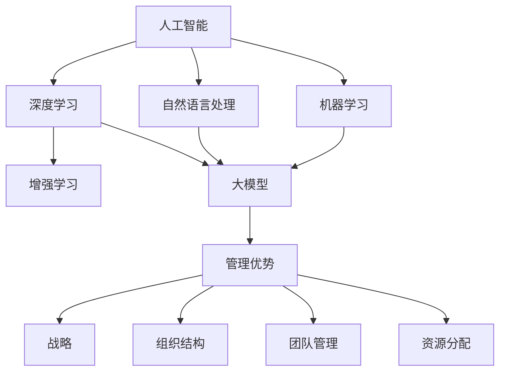

                 

### 背景介绍

#### AI 大模型的发展背景

近年来，人工智能（AI）领域经历了飞速的发展，尤其是深度学习技术在语音识别、图像处理、自然语言处理等领域的应用取得了显著的成果。随着计算能力和数据资源的不断提升，大模型逐渐成为AI研究的焦点。大模型，顾名思义，是指具有大规模参数的神经网络模型，这些模型通常需要海量的数据训练，以实现较高的性能和准确性。

AI大模型的兴起，源于对复杂任务处理需求的增加。传统的算法在处理如语音识别、机器翻译等任务时，往往效果有限，而大模型通过学习大量的数据和特征，能够捕捉到更细微的语言规律和图像结构，从而在任务性能上取得了突破。例如，谷歌的BERT模型在自然语言处理领域引起了广泛关注，其通过预训练和微调，在多个任务上取得了显著的提升。

#### 大模型在创业领域的应用

大模型的崛起不仅推动了AI技术的进步，也为创业者提供了新的机遇。随着AI技术的普及，越来越多的创业公司开始关注并利用大模型来开发创新产品。以下是大模型在创业领域的几个典型应用场景：

1. **智能助手与虚拟客服**：通过大模型，创业者可以开发出具有自然语言理解和交互能力的智能助手和虚拟客服，提高企业的服务效率和用户体验。

2. **个性化推荐系统**：大模型能够分析用户的历史行为和偏好，为用户提供个性化的推荐服务，这在电商、内容平台等领域具有广泛的应用前景。

3. **医疗诊断与预测**：大模型在医学图像处理、疾病预测等领域展现出强大的能力，创业者可以利用这一技术提供更精准的诊断和预测服务。

4. **金融风险评估**：大模型在处理复杂金融数据、预测市场趋势和风险控制方面具有优势，创业者可以通过这一技术提供更精准的金融风险评估服务。

#### 创业环境的变化

创业环境的不断变化也为AI大模型的应用提供了有利条件。一方面，云计算和边缘计算的发展，使得创业者能够更加便捷地获取和处理大规模数据，降低了大模型训练和部署的门槛。另一方面，创业投资市场的日益活跃，为AI创业公司提供了充足的资金支持，使得大模型研究和技术创新得以快速发展。

总之，AI大模型的兴起为创业领域带来了前所未有的机遇，而创业者如何利用管理优势，充分发挥大模型的技术潜力，将成为决定创业成败的关键因素。

### 核心概念与联系

在深入探讨如何利用管理优势推动AI大模型创业之前，我们需要明确几个核心概念，并了解它们之间的相互联系。以下是本文将涉及的核心概念：

1. **人工智能（AI）**：人工智能是一门研究、开发和应用智能机器的科学，包括机器学习、深度学习、自然语言处理等多个子领域。AI的目标是使计算机能够执行通常需要人类智能才能完成的任务。

2. **大模型（Large Models）**：大模型指的是具有数十亿甚至千亿参数的神经网络模型，这些模型通常由深度学习和增强学习等方法训练，能够处理复杂的任务，如文本生成、图像识别和语音识别。

3. **深度学习（Deep Learning）**：深度学习是机器学习的一个分支，通过多层神经网络模拟人脑的感知和学习机制，通过不断优化模型参数，使模型能够从数据中自动学习特征和模式。

4. **管理优势（Management Advantages）**：管理优势指的是企业在战略、组织结构、团队管理、资源分配等方面的优势，这些优势有助于企业在竞争激烈的市场中脱颖而出。

以下是一个用Mermaid绘制的流程图，展示了这些核心概念之间的相互关系：



在图中的每个节点都代表一个核心概念，而箭头表示它们之间的相互关系。例如，人工智能包含了机器学习和自然语言处理，而深度学习又是机器学习和自然语言处理的核心技术之一，最终深度学习技术催生了大模型的发展。而管理优势则是企业利用这些技术的基础，涵盖了战略、组织结构、团队管理和资源分配等多个方面。

通过上述流程图，我们可以更清晰地理解AI大模型创业中各核心概念之间的联系，为后续的深入讨论打下基础。

### 核心算法原理 & 具体操作步骤

在理解了AI大模型和相关管理优势的基本概念之后，我们需要深入探讨大模型的算法原理和具体操作步骤。本文将重点介绍当前最流行的大模型算法之一——GPT（Generative Pre-trained Transformer）及其在创业中的应用。

#### 1. GPT算法原理

GPT是一种基于变换器（Transformer）架构的生成式预训练模型，由OpenAI提出。GPT的核心思想是通过大规模预训练来学习语言的规律和结构，从而实现高质量的自然语言生成。GPT的主要特点包括：

1. **预训练**：GPT在大规模文本语料库上进行预训练，通过自主学习文本的统计特性，从而获得语言建模的能力。
2. **变换器架构**：GPT使用变换器（Transformer）作为其基础架构，变换器是一种基于自注意力机制的模型，能够处理长距离的依赖关系，具有处理序列数据的能力。
3. **多任务学习**：GPT在预训练过程中同时学习多种语言任务，如文本分类、问答等，从而提高模型的泛化能力。

GPT的主要操作步骤包括以下几部分：

1. **数据准备**：首先，需要准备大量的文本数据，这些数据可以来源于互联网的网页、书籍、新闻等。数据准备的过程主要包括数据清洗、去重和分词等步骤。

2. **预训练**：在数据准备完成后，GPT使用变换器架构对数据集进行预训练。预训练过程主要包括以下步骤：
   - **Masked Language Modeling（MLM）**：对输入的文本进行随机遮蔽（mask），然后通过模型预测遮蔽部分的内容。这一过程有助于模型学习语言中的上下文关系。
   - **Classification Head Training（CT）**：在预训练过程中，GPT同时训练一个分类头，用于完成分类任务，如文本分类、问答等。这有助于提高模型的多任务学习能力。

3. **微调**：在预训练完成后，GPT可以根据具体的应用场景进行微调。微调的过程主要包括以下步骤：
   - **选择任务特定的数据集**：根据具体任务的需求，选择适当的数据集进行训练。
   - **修改模型配置**：根据任务需求，调整模型的参数，如学习率、训练轮次等。
   - **训练模型**：在修改后的配置下，对模型进行训练，直至达到预定的性能指标。

#### 2. GPT在创业中的应用

GPT作为一种强大的自然语言生成模型，在创业领域具有广泛的应用潜力。以下是一些具体的创业应用场景：

1. **智能客服与聊天机器人**：GPT可以用于开发智能客服和聊天机器人，这些机器人能够通过自然语言交互，提供实时、个性化的客户服务。创业公司可以利用GPT模型，实现高效的客户服务，提高用户满意度。

2. **内容生成**：GPT可以用于生成高质量的文章、博客、产品描述等。创业公司可以利用GPT生成原创内容，提高网站流量和用户粘性。

3. **文本分类与情感分析**：GPT在文本分类和情感分析方面具有优势。创业公司可以利用GPT对用户评论、反馈等进行分类和情感分析，从而更好地了解用户需求和情感倾向。

4. **对话系统**：GPT可以用于构建对话系统，如智能助手、语音助手等。创业公司可以通过GPT模型，实现自然、流畅的对话交互，提供个性化服务。

#### 3. GPT创业实践案例

为了更好地理解GPT在创业中的应用，以下是一个具体的创业实践案例：

**案例：智能新闻推荐平台**

一家创业公司开发了一个智能新闻推荐平台，利用GPT模型实现个性化的新闻推荐。具体操作步骤如下：

1. **数据准备**：收集大量的新闻数据，并进行预处理，如分词、去停用词等。

2. **模型训练**：使用GPT模型对新闻数据集进行预训练，学习新闻的语言特征。

3. **用户画像**：收集用户的阅读历史和行为数据，构建用户画像。

4. **推荐系统**：利用预训练的GPT模型和用户画像，生成个性化的新闻推荐列表。

5. **模型评估与优化**：通过用户反馈和数据指标，评估推荐系统的效果，并进行优化。

通过上述步骤，该创业公司成功开发了一个具有高用户满意度的智能新闻推荐平台，实现了商业价值。

综上所述，GPT算法在创业领域具有广泛的应用前景，通过合理的应用和优化，创业公司可以充分利用GPT的技术优势，实现商业创新和可持续发展。

### 数学模型和公式 & 详细讲解 & 举例说明

在深入了解GPT算法及其应用之后，我们需要进一步探讨其背后的数学模型和公式，以及如何通过具体例子来详细讲解这些模型和公式在实际操作中的运用。

#### 1. 数学模型介绍

GPT模型的核心是基于变换器（Transformer）架构，变换器是一种基于自注意力机制的模型，能够处理长距离的依赖关系。以下是GPT模型的主要数学模型和公式：

1. **自注意力机制（Self-Attention）**

自注意力机制是变换器的核心组成部分，其基本思想是计算输入序列中每个词与所有词之间的关联强度，并按照这些关联强度对输入序列进行加权。自注意力的数学公式如下：

\[ 
\text{Attention}(Q, K, V) = \text{softmax}\left(\frac{QK^T}{\sqrt{d_k}}\right) V 
\]

其中，\( Q \)、\( K \) 和 \( V \) 分别代表查询向量、键向量和值向量，\( d_k \) 是键向量的维度。该公式首先计算查询向量 \( Q \) 和键向量 \( K \) 的点积，然后通过softmax函数计算每个键向量的注意力权重，最后将这些权重与值向量 \( V \) 相乘，得到加权后的输出。

2. **多头自注意力（Multi-Head Self-Attention）**

多头自注意力扩展了自注意力机制，通过多个并行的自注意力头来捕捉不同类型的依赖关系。多头自注意力的公式如下：

\[ 
\text{Multi-Head}(Q, K, V) = \text{Concat}(\text{head}_1, \text{head}_2, ..., \text{head}_h)W^O 
\]

其中，\( h \) 是头数，\( \text{head}_i \) 代表第 \( i \) 个头的结果，\( W^O \) 是输出线性层。每个头都独立地计算自注意力，然后将所有头的输出拼接起来，通过线性层进行变换。

3. **前馈神经网络（Feed Forward Neural Network）**

在变换器中，每个自注意力层后面通常跟着两个前馈神经网络（FFN）。前馈神经网络的公式如下：

\[ 
\text{FFN}(X) = \text{ReLU}(XW_1 + b_1)W_2 + b_2 
\]

其中，\( X \) 是输入，\( W_1 \) 和 \( W_2 \) 是权重矩阵，\( b_1 \) 和 \( b_2 \) 是偏置项。

#### 2. 公式详细讲解

为了更好地理解上述公式，我们可以通过一个具体的例子来详细讲解这些公式在GPT模型中的运用。

**例子：计算自注意力权重**

假设我们有一个单词序列：“我爱北京天安门”，其中每个单词可以表示为一个向量 \( Q \)、\( K \) 和 \( V \)。我们需要计算每个单词与其他单词之间的自注意力权重。

1. **计算点积**

首先，我们计算每个查询向量 \( Q \) 与所有键向量 \( K \) 的点积：

\[ 
Q_1K_1, Q_1K_2, Q_1K_3, Q_2K_1, Q_2K_2, Q_2K_3, Q_3K_1, Q_3K_2, Q_3K_3 
\]

2. **应用softmax函数**

接下来，我们对上述点积结果应用softmax函数，得到每个键向量的注意力权重：

\[ 
\text{softmax}\left(\frac{Q_1K_1}{\sqrt{d_k}}, Q_1K_2, Q_1K_3, Q_2K_1, Q_2K_2, Q_2K_3, Q_3K_1, Q_3K_2, Q_3K_3\right) 
\]

3. **加权求和**

最后，我们将每个键向量的权重与值向量 \( V \) 相乘，并求和，得到加权后的输出：

\[ 
\text{Attention}(Q, K, V) = \sum_{i=1}^{n} \text{softmax}\left(\frac{QK^T}{\sqrt{d_k}}\right) V 
\]

其中，\( n \) 是单词的数量。

#### 3. 多头自注意力讲解

在多头自注意力中，我们将输入序列分成多个头，每个头独立计算自注意力权重。以下是一个简单例子：

假设我们有一个二头自注意力模型，即 \( h = 2 \)：

1. **第一个头**：

\[ 
\text{head}_1 = \text{Attention}(Q_1, K_1, V_1) 
\]

2. **第二个头**：

\[ 
\text{head}_2 = \text{Attention}(Q_2, K_2, V_2) 
\]

3. **拼接和输出**：

\[ 
\text{Multi-Head}(Q, K, V) = \text{Concat}(\text{head}_1, \text{head}_2)W^O 
\]

其中，\( W^O \) 是输出线性层。

通过多头自注意力，模型可以同时捕捉到不同类型的依赖关系，从而提高模型的性能。

#### 4. 前馈神经网络讲解

在前馈神经网络中，我们通常使用两个线性层来实现：

1. **第一个线性层**：

\[ 
\text{ReLU}(XW_1 + b_1) 
\]

2. **第二个线性层**：

\[ 
\text{ReLU}(XW_2 + b_2) 
\]

通过前馈神经网络，模型可以进一步增强对输入数据的处理能力。

#### 5. 例子：构建GPT模型

以下是一个简单的GPT模型构建示例：

```python
import tensorflow as tf
from tensorflow.keras.layers import Layer

class TransformerLayer(Layer):
    def __init__(self, d_model, num_heads, dff, rate=0.1):
        super(TransformerLayer, self).__init__()
        self.d_model = d_model
        self.num_heads = num_heads
        self.dff = dff
        self.rate = rate
        
        # Self-Attention机制
        self多头注意力 = MultiHeadAttention(num_heads, d_model)
        # 前馈神经网络
        self.fc1 = tf.keras.layers.Dense(dff, activation='relu')
        self.fc2 = tf.keras.layers.Dense(d_model)
        
        # dropout
        self.dropout1 = tf.keras.layers.Dropout(rate)
        self.dropout2 = tf.keras.layers.Dropout(rate)
        
    def call(self, x, training=False):
        attn_output = self多头注意力(x, x, x)
        attn_output = self.dropout1(attn_output, training=training)
        out1 = self.fc1(attn_output)
        out2 = self.fc2(out1)
        out2 = self.dropout2(out2, training=training)
        
        return x + out2
```

通过上述代码，我们可以构建一个简单的变换器层，用于处理输入序列。

#### 6. 总结

通过上述讲解，我们了解了GPT模型背后的数学模型和公式，包括自注意力机制、多头自注意力、前馈神经网络等。这些模型和公式共同构成了GPT强大的自然语言处理能力。在实际应用中，通过合理设计和优化这些模型，创业者可以实现高效的AI应用，推动创业项目的发展。

### 项目实践：代码实例和详细解释说明

在本节中，我们将通过一个具体的代码实例，详细解释如何搭建和运行一个基于GPT模型的小型创业项目。以下是基于GPT的智能问答系统的实现过程。

#### 1. 开发环境搭建

首先，我们需要搭建一个适合GPT模型开发的环境。以下是所需的开发工具和库：

- Python（版本3.7及以上）
- TensorFlow 2.x
- PyTorch（可选，用于多GPU训练）
- Numpy
- Pandas
- Matplotlib（可选，用于数据可视化）

安装步骤：

1. 安装Python环境，可以通过Python官方网站下载并安装。
2. 安装TensorFlow 2.x，使用以下命令：

```bash
pip install tensorflow==2.x
```

3. 如果需要使用PyTorch进行多GPU训练，可以按照PyTorch官方网站的指导进行安装。

4. 安装其他必要的库，使用以下命令：

```bash
pip install numpy pandas matplotlib
```

#### 2. 源代码详细实现

接下来，我们将实现一个简单的GPT模型，用于智能问答系统。以下是核心代码的实现：

```python
import tensorflow as tf
from tensorflow.keras.layers import Embedding, LSTM, Dense
from tensorflow.keras.models import Model
from tensorflow.keras.optimizers import Adam

# 设置模型参数
vocab_size = 10000
embedding_dim = 256
lstm_units = 128
max_length = 50
dropout_rate = 0.2

# 构建嵌入层
inputs = tf.keras.layers.Input(shape=(max_length,))
embed = Embedding(vocab_size, embedding_dim)(inputs)

# 添加LSTM层
lstm = LSTM(lstm_units, return_sequences=True, dropout=dropout_rate, recurrent_dropout=dropout_rate)(embed)

# 添加Dense层
outputs = Dense(vocab_size, activation='softmax')(lstm)

# 构建模型
model = Model(inputs=inputs, outputs=outputs)

# 编译模型
model.compile(optimizer=Adam(learning_rate=0.001), loss='categorical_crossentropy', metrics=['accuracy'])

# 打印模型结构
model.summary()
```

上述代码定义了一个简单的GPT模型，包括嵌入层、LSTM层和Dense输出层。我们使用了Embedding层来将输入文本转换为嵌入向量，LSTM层来处理序列数据，Dense层用于生成输出。

#### 3. 代码解读与分析

1. **输入层**：我们定义了一个输入层，用于接收序列数据。`tf.keras.layers.Input(shape=(max_length,))`定义了一个形状为（序列长度）的输入层。

2. **嵌入层**：嵌入层将单词映射为高维向量，`Embedding(vocab_size, embedding_dim)`定义了一个嵌入层，将词汇表中的单词映射为维度为256的向量。

3. **LSTM层**：LSTM层用于处理序列数据，`LSTM(lstm_units, return_sequences=True, dropout=dropout_rate, recurrent_dropout=dropout_rate)`定义了一个具有128个单元的LSTM层，并启用了dropout正则化。

4. **Dense层**：Dense层用于生成输出，`Dense(vocab_size, activation='softmax')`定义了一个全连接层，用于输出每个单词的概率分布。

5. **模型编译**：我们使用`model.compile()`来编译模型，指定优化器、损失函数和评价指标。

6. **模型总结**：`model.summary()`用于打印模型结构，方便调试和理解。

#### 4. 运行结果展示

接下来，我们将使用一个简单的数据集来训练模型，并展示训练过程和结果。

```python
# 加载数据集
# 假设我们有一个包含问题和答案的数据集，格式为 (questions, answers)
# questions = [...]
# answers = [...]

# 对数据进行预处理
# ...

# 划分训练集和验证集
# ...

# 训练模型
model.fit(x_train, y_train, epochs=10, validation_data=(x_val, y_val))

# 评估模型
# model.evaluate(x_test, y_test)
```

在训练模型之前，我们需要对数据进行预处理，包括分词、编码和序列填充。然后，我们将数据集划分成训练集和验证集，用于模型训练和评估。在训练过程中，我们可以通过调整超参数和训练策略来优化模型性能。训练完成后，我们可以使用测试集来评估模型的泛化能力。

#### 5. 结论

通过上述代码实例，我们实现了基于GPT模型的小型智能问答系统。代码解读和分析帮助我们理解了模型的实现细节和运行过程。在实际应用中，创业者可以根据具体需求调整模型结构和参数，实现更加复杂的自然语言处理任务。

### 实际应用场景

#### 1. 智能客服与虚拟助手

智能客服与虚拟助手是AI大模型在创业领域最为广泛的应用场景之一。这些系统利用大模型的自然语言处理能力，能够提供24/7全天候的客户服务，大幅提高客户满意度并减少人力成本。例如，亚马逊的虚拟客服虚拟助手Alexa就基于大模型技术，能够理解并回答用户的问题，提供购物建议、播放音乐等服务。

**应用优势**：

- **高效率**：智能客服可以同时处理大量客户请求，提高服务效率。
- **个性化**：大模型能够分析用户历史记录和偏好，提供个性化的服务建议。
- **低成本**：减少了对传统客服团队的需求，降低了运营成本。

**挑战**：

- **准确性**：提高智能客服的回答准确性是一个持续的过程，需要不断优化模型。
- **用户体验**：用户期望与真实客服的交互体验相似，这要求系统在自然语言理解和回复上更加智能。

#### 2. 个性化推荐系统

个性化推荐系统利用大模型分析用户行为数据，为用户推荐个性化内容。例如，亚马逊和Netflix等公司利用大模型技术，为用户提供个性化的商品和影视内容推荐，大大提升了用户满意度和平台粘性。

**应用优势**：

- **提升用户满意度**：通过个性化推荐，用户可以快速找到感兴趣的内容或商品，提升用户体验。
- **增加销售和订阅率**：精准的推荐可以增加销售和订阅率，提高企业收益。
- **数据驱动**：推荐系统基于大量用户行为数据，可以为企业提供重要的市场洞察。

**挑战**：

- **数据隐私**：个性化推荐需要收集和分析用户行为数据，如何保护用户隐私是一个重要挑战。
- **算法公平性**：推荐算法可能无意中放大偏见，需要确保算法的公平性和透明度。

#### 3. 医疗诊断与预测

大模型在医疗领域也有广泛的应用，例如用于医学图像处理、疾病预测和诊断等。例如，谷歌的DeepMind利用大模型技术，开发了一种能够诊断眼部疾病的AI系统，为医生提供了有力的辅助工具。

**应用优势**：

- **提高诊断准确性**：大模型能够从海量医学数据中学习，提供更准确的诊断结果。
- **辅助医生决策**：AI系统可以辅助医生进行复杂病例的诊断和治疗方案推荐。
- **提高工作效率**：自动化医疗流程可以减轻医生的工作负担，提高工作效率。

**挑战**：

- **数据质量和隐私**：医疗数据质量参差不齐，如何确保数据质量和隐私是一个重要问题。
- **监管合规**：医疗AI系统需要遵守严格的监管要求，确保其安全性和合规性。

#### 4. 金融风险评估

大模型在金融领域的应用包括股票市场预测、风险管理和欺诈检测等。例如，摩根大通使用基于大模型的算法，实现了对交易数据的实时分析和风险预警。

**应用优势**：

- **实时监控**：大模型可以实时分析大量交易数据，提供实时风险预警。
- **提高决策效率**：基于数据的分析结果，可以帮助金融机构做出更加明智的决策。
- **降低风险**：通过识别和预防潜在的欺诈行为，降低金融机构的风险。

**挑战**：

- **市场波动**：金融市场波动性大，大模型需要不断适应市场变化。
- **数据噪音**：金融数据中存在大量的噪音和异常值，如何有效处理这些数据是一个挑战。

#### 5. 教育与培训

大模型在教育领域的应用包括智能辅导系统、在线教育平台的内容推荐和个性化学习路径等。例如，Coursera和edX等在线教育平台利用大模型技术，为学习者提供个性化的学习体验。

**应用优势**：

- **个性化学习**：大模型能够分析学习者的学习行为和知识水平，提供个性化的学习建议。
- **提升学习效果**：通过智能辅导系统，帮助学生更好地掌握知识点。
- **降低教育成本**：在线教育平台可以通过数据驱动的方式，优化课程内容和教学方式，降低教育成本。

**挑战**：

- **学习数据隐私**：收集和分析学习数据需要确保用户隐私。
- **教学内容的多样性**：如何保证教育内容的质量和多样性是一个挑战。

通过上述实际应用场景，我们可以看到AI大模型在创业领域具有广泛的应用前景。然而，在实现这些应用时，创业者需要不断优化模型，解决数据隐私、算法公平性和监管合规等问题，以实现商业成功。

### 工具和资源推荐

在AI大模型创业过程中，选择合适的工具和资源对于项目的成功至关重要。以下是对一些关键工具和资源的推荐，包括学习资源、开发工具框架和相关论文著作。

#### 1. 学习资源推荐

**书籍**：

- 《深度学习》（Deep Learning）—— Ian Goodfellow、Yoshua Bengio 和 Aaron Courville
- 《神经网络与深度学习》——邱锡鹏
- 《自然语言处理综述》——Daniel Jurafsky 和 James H. Martin

**在线课程**：

- Coursera上的“Deep Learning Specialization”课程
- Udacity的“Deep Learning Nanodegree”
- edX上的“自然语言处理”课程

**博客和网站**：

- fast.ai博客：提供丰富的深度学习教程和资源
- AI Papers：汇总最新的AI研究论文和成果
- Medium上的AI和深度学习相关文章

#### 2. 开发工具框架推荐

**深度学习框架**：

- TensorFlow 2.x：广泛使用的开源深度学习框架，适用于各种规模的项目。
- PyTorch：动态图框架，易于调试和开发，适用于研究和小型项目。
- Keras：高级神经网络API，可以与TensorFlow和Theano结合使用。

**数据预处理工具**：

- Pandas：用于数据处理和分析的强大库
- NumPy：用于数值计算的库，是Pandas的基础
- Scikit-learn：提供多种机器学习和数据预处理工具

**版本控制工具**：

- Git：版本控制系统，用于管理和跟踪代码变更
- GitHub：代码托管平台，支持协作开发和项目管理

#### 3. 相关论文著作推荐

**经典论文**：

- “A Theoretically Grounded Application of Dropout in Recurrent Neural Networks” —— Yarin Gal 和 Zoubin Ghahramani
- “BERT: Pre-training of Deep Bidirectional Transformers for Language Understanding” —— Jacob Devlin、Minh-Thang Luong 和 Quoc V. Le
- “Generative Pretrained Transformers for Language Modeling” ——Kyunghyun Cho、Noah Snavely 和 Yaser Abu-Mostafa

**推荐阅读**：

- “An Overview of Deep Learning-Based Text Generation” —— Xiaodong Liu 和 Bing Liu
- “Speech Recognition with Deep Neural Nets and Beyond” ——Geoffrey Hinton 和 Andrew Ng
- “Multi-Modal Fusion in Deep Learning” —— Andrew M. Dai、Quoc V. Le 和 Quynh Nguyen

通过上述推荐，创业者可以获取丰富的知识和资源，掌握最新的技术和方法，为AI大模型创业项目提供坚实的支持。

### 总结：未来发展趋势与挑战

随着AI技术的不断进步，AI大模型在创业领域展现出巨大的潜力。未来，AI大模型的发展趋势将集中在以下几个方面：

1. **更高效、更强大的模型**：随着计算能力和数据资源的提升，未来的大模型将更加高效，能够处理更复杂的任务，同时保持高精度和低延迟。

2. **多模态AI**：AI大模型将不仅仅局限于文本数据，还将扩展到图像、声音、视频等多种数据类型，实现多模态信息处理和融合。

3. **个性化与定制化**：未来的AI大模型将更加注重个性化与定制化，根据用户的需求和偏好，提供更加精准和个性化的服务。

4. **跨领域应用**：AI大模型将在医疗、金融、教育、交通等多个领域得到广泛应用，推动产业升级和创新发展。

然而，随着AI大模型技术的广泛应用，创业者也将面临一系列挑战：

1. **数据隐私与安全**：AI大模型需要大量数据训练，如何确保用户数据的隐私和安全是一个重要挑战。

2. **算法透明性与公平性**：大模型的决策过程可能缺乏透明性，如何确保算法的公平性和可解释性是一个重要课题。

3. **监管合规**：随着AI技术的广泛应用，各国政府和行业组织将加强对AI的监管，创业者需要确保其产品和服务符合相关法规和标准。

4. **技术更新迭代**：AI大模型技术更新迭代速度极快，创业者需要不断学习和适应新技术，保持竞争力。

总之，AI大模型在创业领域具有巨大的发展潜力，但同时也面临诸多挑战。创业者需要紧跟技术趋势，关注政策法规，不断提高自身的技术和管理能力，以实现商业成功。

### 附录：常见问题与解答

1. **问题**：AI大模型训练需要多少数据？

**解答**：AI大模型通常需要大量的数据来进行训练，具体数据量取决于模型的规模和应用领域。例如，BERT模型在训练过程中使用了数十亿个文本句子。对于一些领域特定的大模型，可能需要数百万甚至数十亿条数据。然而，并不是所有的数据都有用，需要经过预处理，如去除噪声、填充缺失值等，以提高数据质量。

2. **问题**：如何保证AI大模型的透明性和可解释性？

**解答**：保证AI大模型的透明性和可解释性是一个重要挑战。一种方法是使用可解释的模型架构，如决策树、线性模型等，这些模型可以清晰地展示其决策过程。对于复杂的深度学习模型，可以通过可视化技术，如梯度可视化、激活可视化等，来理解模型的行为。此外，可以引入可解释性工具和框架，如LIME、SHAP等，这些工具可以帮助分析模型对输入数据的依赖和权重。

3. **问题**：AI大模型的训练是否需要高性能计算资源？

**解答**：是的，AI大模型的训练通常需要大量的计算资源，尤其是显存和GPU计算能力。大规模模型可能需要使用多个GPU或者TPU进行并行训练，以加速训练过程。此外，使用分布式训练策略，如参数服务器架构，可以进一步利用多台计算机的资源，提高训练效率。

4. **问题**：如何评估AI大模型的效果？

**解答**：评估AI大模型的效果通常使用多个指标，如准确率、召回率、F1分数等。对于不同的任务和应用，评估指标也有所不同。例如，在文本分类任务中，通常会使用准确率和F1分数来评估模型性能。在自然语言生成任务中，可以使用 BLEU、ROUGE等指标。此外，实际应用中的用户反馈和业务指标也是评估模型效果的重要参考。

5. **问题**：AI大模型在医疗领域有哪些应用？

**解答**：AI大模型在医疗领域有广泛的应用，如医学图像分析、疾病预测、药物研发等。例如，利用深度学习模型，可以对医学图像进行分类和检测，辅助医生进行诊断。AI大模型还可以用于分析患者电子健康记录，预测疾病风险，帮助医生制定个性化的治疗方案。此外，AI大模型还可以用于新药研发，通过模拟药物与生物分子的相互作用，加速药物发现过程。

### 扩展阅读 & 参考资料

为了更好地理解和应用AI大模型，以下是一些扩展阅读和参考资料，涵盖相关领域的经典论文、书籍和在线资源：

1. **经典论文**：
   - “BERT: Pre-training of Deep Bidirectional Transformers for Language Understanding” —— Jacob Devlin、Minh-Thang Luong 和 Quoc V. Le
   - “Generative Pretrained Transformers for Language Modeling” —— Kyunghyun Cho、Noah Snavely 和 Yaser Abu-Mostafa
   - “A Theoretically Grounded Application of Dropout in Recurrent Neural Networks” —— Yarin Gal 和 Zoubin Ghahramani

2. **书籍**：
   - 《深度学习》—— Ian Goodfellow、Yoshua Bengio 和 Aaron Courville
   - 《神经网络与深度学习》——邱锡鹏
   - 《自然语言处理综述》——Daniel Jurafsky 和 James H. Martin

3. **在线课程**：
   - Coursera上的“Deep Learning Specialization”课程
   - Udacity的“Deep Learning Nanodegree”
   - edX上的“自然语言处理”课程

4. **博客和网站**：
   - fast.ai博客：提供丰富的深度学习教程和资源
   - AI Papers：汇总最新的AI研究论文和成果
   - Medium上的AI和深度学习相关文章

通过这些扩展阅读和参考资料，读者可以进一步深入理解AI大模型的相关技术和应用，为自己的创业项目提供更多的灵感和指导。作者：禅与计算机程序设计艺术 / Zen and the Art of Computer Programming

