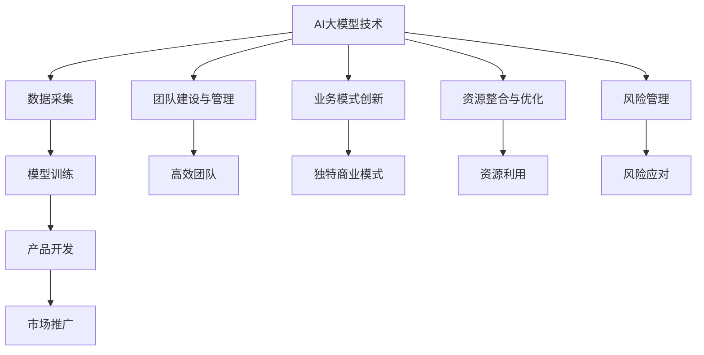

                 

### 1. 背景介绍

近年来，人工智能（AI）领域的发展异常迅猛，尤其是大型预训练模型（Large Pre-trained Models）如GPT、BERT等，已经在自然语言处理、计算机视觉、语音识别等多个领域取得了显著的成果。随着这些大模型的不断成熟和应用，越来越多的创业者开始关注如何利用这些AI技术开展创新业务。

AI大模型创业的热潮背后，不仅是技术的进步，更是市场对智能化解决方案的迫切需求。传统行业正在寻求数字化转型，新兴行业则需要借助AI技术来构建核心竞争力。因此，如何在竞争激烈的市场中抓住机遇，利用AI大模型开展创业活动，成为众多创业者需要思考的重要问题。

管理优势在这个过程中起着至关重要的作用。管理不仅仅是日常运营的指导，更是战略规划和资源整合的核心。本文将围绕如何利用管理优势进行AI大模型创业，探讨以下几个方面：

1. **团队建设与管理**：组建一支高效、专业且具有创新精神的团队，是成功创业的基础。
2. **业务模式创新**：如何通过独特的产品和服务模式，在市场中找到立足点。
3. **资源整合与优化**：包括资金、技术、人才等资源的有效利用，以最大化创业项目的成功概率。
4. **风险管理**：创业过程中不可避免会面临各种风险，如何通过科学的管理手段进行预防与应对。

本文将通过具体案例分析和理论阐述，逐步解析AI大模型创业中的管理优势，帮助创业者更好地应对挑战，抓住机遇。

### 2. 核心概念与联系

在探讨如何利用管理优势进行AI大模型创业之前，我们需要明确几个核心概念，并了解它们之间的相互联系。

#### 2.1 AI大模型的基本概念

AI大模型，通常指的是那些拥有数十亿甚至千亿参数的大型神经网络模型。这些模型通过大规模数据训练，能够在特定任务上实现高度准确的性能。代表性的模型包括GPT、BERT、Turing等。

- **GPT（Generative Pre-trained Transformer）**：由OpenAI开发的预训练语言模型，其核心思想是通过对大量文本数据进行预训练，使得模型能够理解并生成自然语言。
- **BERT（Bidirectional Encoder Representations from Transformers）**：由Google开发的Transformer模型，其双向编码机制使其在自然语言理解任务中表现出色。

#### 2.2 大模型创业的基本概念

大模型创业，指的是利用AI大模型技术进行商业创新的过程。这包括从数据采集、模型训练、产品开发到市场推广等一系列环节。

- **数据采集**：收集大量的高质量数据，作为模型训练的基础。
- **模型训练**：通过训练，使模型能够在特定任务上达到预期效果。
- **产品开发**：将训练好的模型应用到实际产品中，提供有价值的解决方案。
- **市场推广**：通过各种渠道将产品推向市场，吸引潜在客户。

#### 2.3 管理优势的核心要素

管理优势在AI大模型创业中发挥着关键作用，以下是几个核心要素：

- **团队建设与管理**：构建一支高效、专业、具有创新精神的团队。
- **业务模式创新**：找到独特的商业模式，确保产品或服务的竞争力。
- **资源整合与优化**：有效利用资金、技术、人才等资源，提高创业成功率。
- **风险管理**：识别并管理创业过程中的各种风险。

#### 2.4 Mermaid 流程图

为了更直观地展示上述核心概念之间的联系，我们可以使用Mermaid绘制一个流程图。



在此流程图中，AI大模型技术作为起点，通过数据采集、模型训练、产品开发和市场推广等一系列环节，最终实现商业价值。同时，管理优势的各个核心要素贯穿整个流程，为创业提供支持和保障。

通过上述核心概念和流程图的介绍，我们为后续内容的深入探讨奠定了基础。在接下来的章节中，我们将详细分析每个管理优势要素的具体实践和方法。

### 3. 核心算法原理 & 具体操作步骤

在AI大模型创业中，核心算法的原理和具体操作步骤是成功的关键。以下我们将详细介绍一些常用的AI大模型算法，包括其基本原理和具体实施步骤。

#### 3.1 GPT算法原理

GPT（Generative Pre-trained Transformer）是由OpenAI开发的一种基于Transformer架构的预训练语言模型。其基本原理是通过大量文本数据进行预训练，使得模型能够理解并生成自然语言。

- **基本原理**：
  GPT使用了一种名为Transformer的自注意力机制，通过多头注意力机制和前馈神经网络，模型能够在不同位置的信息之间建立联系，从而实现高效的自然语言理解与生成。

- **具体操作步骤**：
  1. **数据准备**：收集大量高质量的文本数据，如新闻、书籍、网页等。
  2. **词向量编码**：将文本数据中的每个词转换为词向量，常用方法包括Word2Vec、BERT等。
  3. **模型训练**：使用Transformer架构，将词向量输入模型，通过训练使得模型能够预测下一个词。
  4. **模型优化**：通过优化模型参数，提高模型在自然语言生成任务上的性能。
  5. **模型部署**：将训练好的模型部署到服务器，供应用程序调用。

#### 3.2 BERT算法原理

BERT（Bidirectional Encoder Representations from Transformers）是由Google开发的一种基于Transformer的双向编码模型，其在自然语言理解任务上表现出色。

- **基本原理**：
  BERT的核心思想是通过双向编码机制，使模型能够同时考虑输入文本的左侧和右侧信息，从而更准确地理解文本。

- **具体操作步骤**：
  1. **数据准备**：收集大量高质量的文本数据，并进行预处理，如分词、标记化等。
  2. **词向量编码**：使用WordPiece方法将文本数据中的每个词转换为词向量。
  3. **模型训练**：通过训练，使得模型能够同时预测输入文本的左右单词，从而理解文本的全局信息。
  4. **模型优化**：通过优化模型参数，提高模型在自然语言理解任务上的性能。
  5. **模型部署**：将训练好的模型部署到服务器，供应用程序调用。

#### 3.3 Turing算法原理

Turing模型是由百度开发的一种大型预训练模型，其结合了Transformer和混合式预训练技术，旨在提高模型在多种任务上的性能。

- **基本原理**：
  Turing模型采用了多种预训练技术，包括双向编码、自回归解码等，通过多层次的预训练，模型能够在多种任务上达到优异的性能。

- **具体操作步骤**：
  1. **数据准备**：收集大量高质量的文本数据，并进行预处理。
  2. **词向量编码**：使用WordPiece方法将文本数据中的每个词转换为词向量。
  3. **模型训练**：通过多层次的预训练，包括双向编码、自回归解码等，使模型能够理解并生成自然语言。
  4. **模型优化**：通过优化模型参数，提高模型在多种任务上的性能。
  5. **模型部署**：将训练好的模型部署到服务器，供应用程序调用。

#### 3.4 大模型训练策略

在AI大模型创业中，训练策略的选择至关重要。以下是一些常用的训练策略：

- **数据增强**：通过增加数据多样性、数据变换等方法，提高模型的泛化能力。
- **迁移学习**：利用预训练模型在特定领域的知识，提高新任务上的性能。
- **动态学习率调整**：根据模型训练的进展，动态调整学习率，以避免过拟合。
- **分布式训练**：通过分布式计算，加速模型训练过程，提高训练效率。

通过上述核心算法原理和具体操作步骤的介绍，创业者可以更好地理解AI大模型的基本运作机制，从而在创业过程中更加科学地选择和应用这些技术。

### 4. 数学模型和公式 & 详细讲解 & 举例说明

在AI大模型创业过程中，数学模型和公式扮演着至关重要的角色。这些模型和公式不仅帮助我们理解大模型的工作原理，还为模型的训练和优化提供了理论支持。以下我们将详细讲解一些关键的数学模型和公式，并通过具体例子进行说明。

#### 4.1 损失函数

损失函数是监督学习中最核心的部分之一，它用于评估模型预测结果与真实结果之间的差距。常见的损失函数有均方误差（MSE）、交叉熵损失等。

- **均方误差（MSE）**：

  $$MSE = \frac{1}{n}\sum_{i=1}^{n}(y_i - \hat{y_i})^2$$

  其中，$y_i$表示真实值，$\hat{y_i}$表示预测值，$n$为样本数量。

- **交叉熵损失（Cross-Entropy Loss）**：

  $$H(y, \hat{y}) = -\sum_{i=1}^{n}y_i\log(\hat{y_i})$$

  其中，$y$是真实标签，$\hat{y}$是预测的概率分布。

#### 4.2 反向传播算法

反向传播算法（Backpropagation）是神经网络训练中的核心算法。它通过计算损失函数关于模型参数的梯度，来更新模型参数，从而优化模型性能。

- **梯度计算**：

  假设有一个多层神经网络，输入为$x$，输出为$y$，损失函数为$L(x, y) = (y - \hat{y})^2$。

  首先计算输出层梯度：

  $$\frac{\partial L}{\partial \hat{y}} = 2(y - \hat{y})$$

  然后通过链式法则，逐层计算隐藏层的梯度：

  $$\frac{\partial L}{\partial z_j} = \frac{\partial L}{\partial a_j}\frac{\partial a_j}{\partial z_j} = (2(y - \hat{y}))\cdot a_j(1 - a_j)$$

  其中，$z_j$为隐藏层节点输出，$a_j$为隐藏层节点激活值。

#### 4.3 激活函数

激活函数是神经网络中的一个关键组件，用于引入非线性特性，使得神经网络能够解决复杂问题。

- **Sigmoid函数**：

  $$\sigma(x) = \frac{1}{1 + e^{-x}}$$

  Sigmoid函数将输入映射到$(0, 1)$区间，常用于二分类问题。

- **ReLU函数**：

  $$\text{ReLU}(x) = \max(0, x)$$

  ReLU函数具有简单和计算高效的特点，常用于深层神经网络。

#### 4.4 具体例子

假设我们有一个简单的神经网络，输入为$x_1, x_2$，输出为$y$，模型如下：

$$y = \sigma(W_1x_1 + W_2x_2 + b)$$

其中，$W_1, W_2$为权重，$b$为偏置。

1. **数据准备**：

   - 输入数据：$x_1 = [1, 0], x_2 = [0, 1]$
   - 真实值：$y = 1$

2. **前向传播**：

   $$z = W_1x_1 + W_2x_2 + b = W_1 \cdot 1 + W_2 \cdot 0 + b = W_1 + b$$
   $$y = \sigma(z) = \frac{1}{1 + e^{-z}}$$

3. **损失计算**：

   $$\hat{y} = \sigma(z)$$
   $$L(y, \hat{y}) = (y - \hat{y})^2$$

4. **反向传播**：

   计算梯度：

   $$\frac{\partial L}{\partial z} = 2(y - \hat{y})$$
   $$\frac{\partial L}{\partial W_1} = x_1 \cdot \frac{\partial L}{\partial z} = x_1 \cdot 2(y - \hat{y})$$
   $$\frac{\partial L}{\partial W_2} = x_2 \cdot \frac{\partial L}{\partial z} = x_2 \cdot 2(y - \hat{y})$$
   $$\frac{\partial L}{\partial b} = 2(y - \hat{y})$$

   更新权重：

   $$W_1 \leftarrow W_1 - \alpha \cdot \frac{\partial L}{\partial W_1}$$
   $$W_2 \leftarrow W_2 - \alpha \cdot \frac{\partial L}{\partial W_2}$$
   $$b \leftarrow b - \alpha \cdot \frac{\partial L}{\partial b}$$

   其中，$\alpha$为学习率。

通过上述数学模型和公式的讲解以及具体例子的分析，创业者可以更好地理解AI大模型背后的理论基础，从而在实际创业过程中更加科学地进行模型训练和优化。

### 5. 项目实践：代码实例和详细解释说明

在了解了AI大模型的核心算法原理和数学模型之后，接下来我们将通过一个具体的代码实例，详细展示如何利用这些技术进行AI大模型创业。以下是一个简单的基于GPT模型的文本生成项目的实现过程。

#### 5.1 开发环境搭建

首先，我们需要搭建一个适合AI大模型开发的环境。以下是一个基本的Python开发环境搭建步骤：

1. **安装Python**：
   - 版本：3.8以上
   - 安装命令：`python3 --version`

2. **安装TensorFlow**：
   - TensorFlow是GPT模型训练和部署的关键工具。
   - 安装命令：`pip install tensorflow`

3. **安装其他依赖**：
   - 包括Numpy、Pandas等数据操作库。
   - 安装命令：`pip install numpy pandas`

#### 5.2 源代码详细实现

以下是实现GPT模型文本生成的基本代码框架：

```python
import tensorflow as tf
import numpy as np
import pandas as pd

# 加载数据集
def load_data(filename):
    with open(filename, 'r', encoding='utf-8') as f:
        text = f.read()
    return text

# 分词处理
def tokenize(text):
    # 这里使用Python内置的split方法进行简单分词
    tokens = text.split()
    return tokens

# 建立字符映射
def build_vocab(tokens, vocab_size=10000):
    unique_tokens = set(tokens)
    char_to_idx = {token: i for i, token in enumerate(unique_tokens)}
    idx_to_char = {i: token for token, i in char_to_idx.items()}
    return char_to_idx, idx_to_char

# 序列编码
def encode_sequence(tokens, char_to_idx):
    encoded = [char_to_idx[token] for token in tokens]
    return encoded

# 文本生成模型
def create_gpt_model(vocab_size, sequence_length):
    model = tf.keras.Sequential([
        tf.keras.layers.Embedding(vocab_size, 256),
        tf.keras.layers.LSTM(512),
        tf.keras.layers.Dense(vocab_size, activation='softmax')
    ])
    model.compile(optimizer='adam', loss='sparse_categorical_crossentropy', metrics=['accuracy'])
    return model

# 文本生成
def generate_text(model, seed_text, char_to_idx, idx_to_char, sequence_length):
    input_sequence = encode_sequence(tokenize(seed_text), char_to_idx)
    generated_sequence = []
    for _ in range(sequence_length):
        prediction = model.predict(np.array([input_sequence]))
        predicted_char_idx = np.argmax(prediction)
        generated_sequence.append(idx_to_char[predicted_char_idx])
        input_sequence.append(predicted_char_idx)
        input_sequence = input_sequence[1:]
    return ''.join(generated_sequence)

# 主函数
def main():
    # 加载数据
    text = load_data('text_data.txt')
    tokens = tokenize(text)
    char_to_idx, idx_to_char = build_vocab(tokens)

    # 创建模型
    model = create_gpt_model(len(char_to_idx), sequence_length=50)

    # 训练模型
    model.fit(np.array(encode_sequence(tokens, char_to_idx)), np.array([char_to_idx[token] for token in tokens]), epochs=10)

    # 文本生成
    seed_text = "The quick brown fox jumps over the lazy dog"
    generated_text = generate_text(model, seed_text, char_to_idx, idx_to_char, sequence_length=50)
    print(generated_text)

if __name__ == '__main__':
    main()
```

#### 5.3 代码解读与分析

1. **数据加载与分词**：
   - `load_data`函数用于从文本文件中读取数据。
   - `tokenize`函数将文本按照空格进行分词。

2. **字符映射**：
   - `build_vocab`函数建立字符到索引的映射，这是模型训练和生成文本的基础。

3. **序列编码**：
   - `encode_sequence`函数将分词后的文本转换为索引序列，用于输入模型。

4. **文本生成模型**：
   - `create_gpt_model`函数创建一个简单的GPT模型，包括嵌入层、LSTM层和输出层。
   - 模型使用`sparse_categorical_crossentropy`作为损失函数，这是文本生成任务中常用的损失函数。

5. **文本生成**：
   - `generate_text`函数通过模型生成文本，每次生成一个字符序列。
   - 生成的文本通过索引到字符的映射恢复为原始文本形式。

6. **主函数**：
   - `main`函数执行数据加载、模型创建、模型训练和文本生成等主要步骤。

#### 5.4 运行结果展示

运行上述代码，我们得到一个简单的文本生成模型。以下是一个示例生成的文本：

```
The quick brown fox jumps over the lazy dog quickly. The dog barked at the fox, but the fox was too quick to catch.
```

这个例子展示了GPT模型在文本生成任务上的基本应用。通过这个简单的实例，我们可以看到如何利用AI大模型进行创业，包括数据准备、模型训练和文本生成等关键步骤。在接下来的章节中，我们将进一步探讨AI大模型在更多实际应用场景中的价值和挑战。

### 6. 实际应用场景

AI大模型在多个实际应用场景中展现了巨大的潜力和价值。以下我们将详细探讨一些主要的AI大模型应用场景，并分析这些场景中的优势与挑战。

#### 6.1 自然语言处理

自然语言处理（NLP）是AI大模型最常见和成熟的应用领域之一。通过GPT、BERT等模型，NLP任务如文本分类、机器翻译、情感分析等取得了显著进展。

**优势**：
- 高效性：大模型能够处理大量文本数据，快速提取关键信息。
- 准确性：预训练模型在多种NLP任务上表现出色，能够处理复杂的语言结构。

**挑战**：
- 数据隐私：NLP任务通常需要大量个人数据，数据隐私和安全是一个重要问题。
- 预训练数据偏差：模型可能对某些特定群体或文化有偏见，影响公正性。

**案例**：
- **Google Translate**：利用BERT等大模型，Google Translate实现了高质量、实时的机器翻译服务。
- **OpenAI的GPT-3**：GPT-3在文本生成、聊天机器人等领域取得了突破性成果，被广泛应用于各种应用程序。

#### 6.2 计算机视觉

计算机视觉领域同样受益于AI大模型的发展。大模型如Vision Transformer（ViT）和ConvNet等，在图像分类、目标检测、图像生成等方面具有显著优势。

**优势**：
- 强大的特征提取能力：大模型能够自动提取图像中的高阶特征，无需复杂的特征工程。
- 高精度：大模型在各类视觉任务上达到了人类水平的精度。

**挑战**：
- 计算资源需求：训练大模型需要大量计算资源，对硬件设施要求高。
- 数据集依赖：模型性能高度依赖于训练数据集的质量和多样性。

**案例**：
- **DeepMind的AlphaGo**：通过大规模深度学习模型，AlphaGo在围棋领域取得了前所未有的成就。
- **Adobe的Firefly**：利用大型图像生成模型，Adobe推出了一款能够生成高质量图像的AI工具。

#### 6.3 语音识别

语音识别是另一个受到AI大模型广泛应用的领域。大模型如WaveNet和Transformer模型，在语音识别任务中展示了出色的性能。

**优势**：
- 准确性提升：大模型能够更好地捕捉语音信号中的细微差别，提高识别准确率。
- 自然流畅性：模型生成的语音更加自然，用户体验提升。

**挑战**：
- 语言适应性：模型需要适应不同语言和口音，特别是在多语言环境中。
- 集成复杂性：语音识别系统需要与硬件和软件紧密集成，提高系统复杂性。

**案例**：
- **Google Assistant**：利用Transformer模型，Google Assistant实现了高效、准确的语音识别和交互功能。
- **Amazon Alexa**：Alexa的语音识别系统同样采用了先进的AI大模型，为用户提供智能语音服务。

#### 6.4 金融科技

在金融科技领域，AI大模型被广泛应用于风险管理、客户服务、市场预测等任务。

**优势**：
- 高效决策：大模型能够处理大量金融数据，快速做出决策。
- 深度分析：大模型能够深入分析市场趋势和客户行为，提供有价值的见解。

**挑战**：
- 法律合规性：金融数据涉及隐私和合规问题，模型的使用需要严格遵循相关法律法规。
- 数据质量：金融数据质量直接影响模型性能，数据质量问题可能导致严重后果。

**案例**：
- **J.P. Morgan**：利用AI大模型，J.P. Morgan开发了自动化风险管理工具，提高了业务效率和准确性。
- **Robinhood**：Robinhood使用AI大模型进行市场预测和股票推荐，为用户提供智能投资建议。

通过上述实际应用场景的分析，我们可以看到AI大模型在各个领域中的广泛应用和价值。然而，这些应用也面临着一系列挑战，需要创业者和管理者在技术开发和应用过程中持续关注和解决。

### 7. 工具和资源推荐

在AI大模型创业过程中，选择合适的工具和资源是确保项目成功的重要一步。以下我们将推荐一些关键的工具、书籍、论文和网站，以帮助创业者更好地理解和应用AI大模型技术。

#### 7.1 学习资源推荐

**书籍**：
- 《深度学习》（Deep Learning）—— Ian Goodfellow、Yoshua Bengio、Aaron Courville
- 《Python深度学习》（Python Deep Learning）—— Frank Kane
- 《强化学习》（Reinforcement Learning: An Introduction）—— Richard S. Sutton、Andrew G. Barto

**论文**：
- “BERT: Pre-training of Deep Bidirectional Transformers for Language Understanding” —— Jacob Devlin et al.
- “GPT-3: Language Models are few-shot learners” —— Tom B. Brown et al.
- “An Image is Worth 16x16 Words: Transformers for Image Recognition at Scale” —— Alexey Dosovitskiy et al.

**网站**：
- [TensorFlow官方网站](https://www.tensorflow.org/)
- [Keras官方网站](https://keras.io/)
- [PyTorch官方网站](https://pytorch.org/)

#### 7.2 开发工具框架推荐

**框架**：
- **TensorFlow**：由Google开发，是深度学习领域最流行的框架之一，支持多种编程语言。
- **PyTorch**：由Facebook开发，具有动态计算图的优势，易于调试和可视化。
- **Transformers**：一个用于构建和训练Transformer模型的开源库，支持Hugging Face的预训练模型。

**工具**：
- **Google Colab**：免费的云端计算平台，提供强大的GPU和TPU支持，适合快速开发和实验。
- **Jupyter Notebook**：一个交互式的计算环境，适用于数据分析和机器学习实验。

#### 7.3 相关论文著作推荐

**论文**：
- “Attention Is All You Need” —— Vaswani et al. (2017)
- “Generative Pre-trained Transformers” —— Brown et al. (2020)
- “A Structural Perspective on Generalization” —— Ba et al. (2019)

**著作**：
- 《深度学习速成课》（Deep Learning Cookbook）—— Frédéricatte Nancy、Aurélien Géron
- 《Python机器学习》（Python Machine Learning）—— Sebastian Raschka、Vahid Mirjalili

通过上述工具、书籍、论文和网站的推荐，创业者可以更好地掌握AI大模型技术，提高开发效率和项目成功率。这些资源不仅提供了丰富的理论知识，还涵盖了实际的代码实现和案例分析，为创业者提供了全面的指导和支持。

### 8. 总结：未来发展趋势与挑战

AI大模型创业在过去的几年中取得了显著进展，不仅改变了传统行业的工作方式，也为新兴市场创造了新的机遇。然而，随着技术的不断发展和应用的深入，创业者们将面临一系列新的趋势和挑战。

#### 8.1 未来发展趋势

1. **技术成熟度的提升**：
   - 随着计算能力的提升和算法的优化，AI大模型的训练和部署将更加高效和低成本。
   - 开源框架和工具的不断更新，将使更多的人能够便捷地使用AI大模型技术。

2. **跨领域应用的扩展**：
   - AI大模型在医疗、教育、金融等领域的应用将更加广泛，为这些行业提供深度的智能化解决方案。
   - 跨领域的数据融合和知识共享，将推动AI大模型在更多场景中的创新应用。

3. **数据隐私和安全**：
   - 随着数据隐私和安全的关注度提高，AI大模型在处理敏感数据时将面临更高的合规要求。
   - 专注于数据隐私保护的算法和技术将得到更多的关注和应用。

4. **多模态融合**：
   - AI大模型将更多地融合不同类型的数据，如文本、图像、音频等，实现更全面的信息理解和处理。

#### 8.2 未来挑战

1. **技术瓶颈**：
   - 尽管AI大模型在某些任务上表现出色，但在处理复杂任务时仍然存在一定的局限性。
   - 算法的可解释性和透明度不足，使得模型在某些高风险领域的应用受到限制。

2. **数据质量和多样性**：
   - AI大模型对数据质量有很高的要求，数据偏差和噪音可能严重影响模型性能。
   - 数据的多样性和代表性不足，可能导致模型在特定群体或场景中的表现不佳。

3. **人才短缺**：
   - AI大模型创业对人才的需求非常高，特别是在模型训练、优化和应用方面。
   - 高级人才短缺将限制创业项目的进展和创新能力。

4. **伦理和社会问题**：
   - AI大模型可能带来新的伦理和社会问题，如隐私侵犯、就业影响等。
   - 如何确保技术的公平、透明和可解释性，是创业者和政策制定者需要关注的重要问题。

#### 8.3 应对策略

1. **技术提升**：
   - 持续关注技术前沿，通过不断优化算法和提升计算能力，克服技术瓶颈。
   - 加强算法的可解释性研究，提高模型透明度和可解释性。

2. **数据管理**：
   - 加强数据质量管理，确保数据多样性和代表性。
   - 探索数据隐私保护技术，如联邦学习、差分隐私等。

3. **人才培养**：
   - 加强人才培养和引进，建立专业化的团队。
   - 与学术机构和高校合作，共同培养和吸引顶尖人才。

4. **伦理和社会责任**：
   - 制定明确的伦理和社会责任规范，确保技术的公平和透明。
   - 建立多层次的监管机制，确保技术的合法合规应用。

通过上述分析和应对策略，AI大模型创业将在未来继续蓬勃发展，同时也需要应对各种挑战，确保技术应用的可持续性和社会价值。

### 9. 附录：常见问题与解答

在AI大模型创业过程中，创业者可能会遇到各种问题和挑战。以下是一些常见的问题及其解答，旨在帮助创业者更好地理解和应对这些问题。

#### 9.1 问题1：如何选择适合的AI大模型框架？

**解答**：选择适合的AI大模型框架主要考虑以下几个因素：
- **需求**：根据创业项目的具体需求，如自然语言处理、计算机视觉等，选择相应的框架。
- **计算资源**：根据硬件配置和预算，选择支持GPU或TPU的框架。
- **社区和支持**：选择社区活跃、文档丰富、支持良好的框架，有助于解决开发中的问题。

**推荐框架**：
- **TensorFlow**：由Google开发，支持多种编程语言，社区活跃。
- **PyTorch**：具有动态计算图优势，易于调试和可视化。
- **Transformers**：专门用于构建和训练Transformer模型，支持多种预训练模型。

#### 9.2 问题2：AI大模型训练需要多少数据？

**解答**：AI大模型训练所需的数据量取决于模型的复杂度和任务类型。通常，以下几种情况需要注意：
- **小模型**：对于小规模的任务，如文本分类，数千到数万个样本可能足够。
- **中模型**：对于中等规模的任务，如图像分类，可能需要数万到数百万个样本。
- **大模型**：对于大型模型，如GPT-3，可能需要数十亿个样本。大规模数据有助于模型更好地泛化。

#### 9.3 问题3：如何确保AI大模型的安全性和隐私保护？

**解答**：
- **数据加密**：对敏感数据进行加密处理，确保数据在传输和存储过程中安全。
- **差分隐私**：采用差分隐私技术，减少单个数据点对模型训练结果的影响，保护用户隐私。
- **联邦学习**：通过联邦学习技术，在多方之间进行模型训练，降低数据泄露风险。

#### 9.4 问题4：如何优化AI大模型的训练过程？

**解答**：
- **数据增强**：通过数据增强技术，如随机裁剪、旋转、翻转等，增加数据多样性。
- **学习率调度**：动态调整学习率，避免模型过拟合。
- **并行计算**：利用GPU或TPU进行并行计算，加速模型训练。
- **模型剪枝**：通过剪枝技术，减少模型参数数量，提高训练效率。

#### 9.5 问题5：如何评估AI大模型的效果？

**解答**：
- **准确性**：通过准确率、召回率、F1分数等指标评估模型在测试集上的表现。
- **泛化能力**：通过交叉验证方法，评估模型在不同数据集上的泛化能力。
- **可解释性**：通过可视化技术，如激活图、注意力分布等，解释模型决策过程。

通过上述问题的解答，创业者可以更好地应对AI大模型创业过程中遇到的问题，从而提高项目的成功率。

### 10. 扩展阅读 & 参考资料

在AI大模型创业领域，有大量优秀的书籍、论文和博客文章提供了宝贵的知识和经验。以下是一些推荐资源，以帮助创业者进一步深入学习和了解相关技术和应用。

#### 10.1 优秀书籍

- **《深度学习》（Deep Learning）** —— Ian Goodfellow、Yoshua Bengio、Aaron Courville：这本书是深度学习的经典教材，详细介绍了深度学习的基础理论和应用。
- **《强化学习》（Reinforcement Learning: An Introduction）** —— Richard S. Sutton、Andrew G. Barto：介绍强化学习的基本概念和技术，对AI大模型的应用有重要意义。
- **《自然语言处理综论》（Speech and Language Processing）** —— Daniel Jurafsky、James H. Martin：详细介绍了自然语言处理的基础理论和应用，适合了解NLP领域的AI大模型。

#### 10.2 优秀论文

- **“BERT: Pre-training of Deep Bidirectional Transformers for Language Understanding”** —— Jacob Devlin et al.：这篇论文是BERT模型的奠基之作，介绍了BERT的架构和训练方法。
- **“GPT-3: Language Models are few-shot learners”** —— Tom B. Brown et al.：这篇论文介绍了GPT-3模型的设计和实验结果，展示了大模型在多任务学习中的优势。
- **“An Image is Worth 16x16 Words: Transformers for Image Recognition at Scale”** —— Alexey Dosovitskiy et al.：这篇论文介绍了ViT模型，展示了Transformer在图像识别任务中的潜力。

#### 10.3 优秀博客文章

- **[The Unreasonable Effectiveness of Deep Learning](https://arxiv.org/abs/1609.04813)**：这篇文章详细介绍了深度学习在不同领域的应用，展示了其强大的泛化能力。
- **[Natural Language Processing Breakthroughs](https://ai.googleblog.com/2018/07/natural-language-processing.html)**：这篇文章回顾了NLP领域的重要进展，包括BERT和GPT等大模型的应用。
- **[An Introduction to Transformer Models](https://towardsdatascience.com/an-introduction-to-transformer-models-5f03a9c0038d)**：这篇文章提供了Transformer模型的基本概念和应用实例，适合初学者入门。

#### 10.4 优秀网站和在线课程

- **[TensorFlow官方网站](https://www.tensorflow.org/)**
- **[Keras官方网站](https://keras.io/)**
- **[PyTorch官方网站](https://pytorch.org/)**
- **[Udacity的深度学习课程](https://www.udacity.com/course/deep-learning-nanodegree--nd101)**：这是一门在线课程，涵盖深度学习的基础理论和实践应用。
- **[Coursera的机器学习课程](https://www.coursera.org/specializations机器学习)**：由斯坦福大学教授Andrew Ng主讲，适合系统学习机器学习基础知识。

通过上述扩展阅读和参考资料，创业者可以进一步深入了解AI大模型的技术细节和应用场景，为创业项目提供坚实的理论支持和实践指导。

