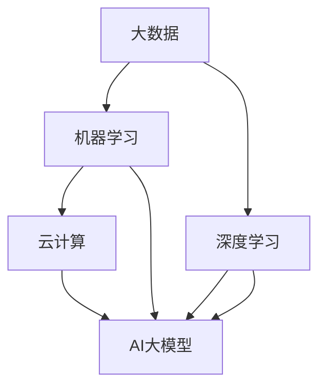

                 

### 背景介绍

近年来，人工智能（AI）技术的飞速发展，特别是大型预训练模型（如GPT、BERT等）的崛起，为各行各业带来了深刻的变革。AI大模型不仅推动了自然语言处理（NLP）、计算机视觉（CV）等领域的突破，同时也成为了众多创业公司竞相追逐的焦点。然而，创业公司如何有效利用AI大模型的经济优势，实现商业成功，依然是一个值得深入探讨的问题。

在这个背景下，本文将围绕“AI大模型创业：如何利用经济优势？”这一核心主题展开讨论。文章首先将简要介绍AI大模型的发展历程和现状，接着深入分析AI大模型在创业中的经济优势，然后探讨如何通过优化成本、提升效率、拓展市场等策略，最大限度地利用这些优势。此外，文章还将通过实际案例，展示如何将AI大模型应用于具体业务场景，并讨论相关技术和市场挑战。最后，文章将总结未来发展趋势和挑战，为创业公司提供一些建议和启示。

通过这篇文章，我们希望能够帮助读者更好地理解AI大模型的经济优势，掌握如何在创业过程中有效地利用这些优势，从而在激烈的市场竞争中脱颖而出。让我们一步一步地深入探讨这个激动人心的领域吧。

### 核心概念与联系

为了深入理解AI大模型在创业中的应用，我们首先需要了解一些核心概念和它们之间的联系。这些概念包括但不限于：大数据、机器学习、深度学习、云计算、以及AI大模型本身的原理和技术架构。下面，我们将逐一介绍这些概念，并展示它们之间的相互关系，以便读者能够有一个全面的认识。

#### 1. 大数据

大数据（Big Data）指的是数据量巨大、类型繁多、生成速度极快的数据集合。这些数据来源于各种来源，如社交网络、传感器、电子商务平台等。大数据的特点是**4V**：**Volume（大量）、Velocity（高速）、Variety（多样性）和Veracity（真实性）**。

大数据的重要性在于，它不仅包含了海量的信息，还蕴含了潜在的商业价值。通过对大数据的分析，企业可以洞察市场趋势、优化业务流程、提升用户体验，从而实现商业上的成功。

#### 2. 机器学习

机器学习（Machine Learning）是一种让计算机通过数据学习并做出决策的技术。机器学习算法通过分析数据，自动识别数据中的模式和规律，从而进行预测和分类。机器学习可以分为监督学习、无监督学习和强化学习三大类。

机器学习在AI大模型中的应用极为广泛。通过大规模数据的训练，机器学习算法可以不断优化，从而提升模型的准确性和鲁棒性。这使得AI大模型能够更好地处理复杂的问题，如自然语言理解、图像识别、推荐系统等。

#### 3. 深度学习

深度学习（Deep Learning）是机器学习的一个子领域，它通过构建多层神经网络（Neural Networks）来模拟人类大脑的运作方式。深度学习模型具有自动提取特征的能力，这使得它们在处理复杂数据时表现出色。

深度学习在AI大模型中的应用尤为突出。通过堆叠大量的神经网络层，深度学习模型可以自动学习数据中的高级特征，从而实现更高的准确性和泛化能力。例如，卷积神经网络（CNN）在图像识别任务中表现出色，循环神经网络（RNN）在自然语言处理任务中有着广泛的应用。

#### 4. 云计算

云计算（Cloud Computing）是一种通过互联网提供计算资源和服务的技术。云计算使得企业可以按需获取和分配计算资源，从而实现灵活的IT基础设施管理。

在AI大模型创业中，云计算提供了强大的支持。首先，云计算提供了海量的计算资源和存储空间，使得训练和部署大型模型成为可能。其次，云计算平台的弹性和可扩展性，可以满足不同规模业务的需求，降低企业的运营成本。

#### 5. AI大模型

AI大模型（AI Large Models）是指那些具有数百万甚至数十亿参数的复杂模型。这些模型通过大规模数据训练，能够实现高度复杂的任务，如自然语言生成、图像生成、语音识别等。

AI大模型的技术架构通常包括以下几个部分：

- **数据层**：负责收集、存储和管理训练数据。
- **计算层**：负责模型训练的计算资源，通常依赖于高性能的GPU集群。
- **算法层**：包含具体的模型算法和优化方法。
- **应用层**：将训练好的模型部署到实际应用场景中，如自然语言处理、计算机视觉等。

AI大模型在创业中的应用潜力巨大。通过AI大模型，企业可以实现自动化、智能化的业务流程，提高运营效率，降低成本。同时，AI大模型还可以帮助企业更好地洞察市场趋势，预测客户需求，从而制定更加精准的市场策略。

#### 6. 核心概念和联系

上述核心概念和AI大模型之间的联系可以概括如下：

- **大数据**提供了AI大模型训练所需的丰富数据资源，是其发展的基础。
- **机器学习**和**深度学习**为AI大模型提供了算法支持，使其能够从数据中学习并做出预测。
- **云计算**为AI大模型提供了强大的计算和存储支持，使得训练和部署大型模型成为可能。
- **AI大模型**通过自动化和智能化，为企业带来了新的业务机会，提高了竞争力。

通过这些核心概念和联系，我们可以更好地理解AI大模型在创业中的应用前景和挑战。

#### Mermaid 流程图

以下是一个简化的Mermaid流程图，展示了上述核心概念和它们之间的联系：



在这个流程图中，A表示大数据，B表示机器学习，C表示深度学习，D表示云计算，E表示AI大模型。箭头表示概念之间的依赖关系，即每个概念为下一个概念的发展提供了基础或支持。

### 核心算法原理 & 具体操作步骤

在理解了AI大模型的核心概念和联系后，接下来我们将深入探讨其核心算法原理，并详细讲解如何具体操作。

#### 1. AI大模型的核心算法原理

AI大模型通常基于深度学习和自然语言处理（NLP）技术。以下是几个关键组成部分及其工作原理：

**1.1 Transformer模型**

Transformer模型是AI大模型的基础架构，由Google在2017年提出。与传统的循环神经网络（RNN）相比，Transformer模型采用了自注意力机制（Self-Attention），可以并行处理输入序列，从而显著提高了计算效率。

**1.2 自注意力机制**

自注意力机制允许模型自动关注输入序列中的不同部分，并为其分配不同的权重。这一机制使得模型能够更好地捕捉长距离依赖关系，从而提高了模型的准确性和泛化能力。

**1.3 编码器和解码器**

在Transformer模型中，编码器（Encoder）负责将输入序列编码为固定长度的向量，解码器（Decoder）则根据这些向量生成输出序列。编码器和解码器都是由多层自注意力机制和前馈神经网络组成的。

**1.4 损失函数和优化算法**

AI大模型的训练通常使用基于梯度的优化算法，如随机梯度下降（SGD）和Adam优化器。损失函数则用来衡量模型的预测结果与实际结果之间的差距，常用的损失函数包括交叉熵损失函数。

#### 2. 具体操作步骤

**2.1 数据预处理**

数据预处理是训练AI大模型的第一步。主要任务包括数据清洗、数据标注和数据分割。具体步骤如下：

- **数据清洗**：去除无效数据、填补缺失值、处理异常值等。
- **数据标注**：为数据添加标签，如文本分类中的类别标签、机器翻译中的翻译文本等。
- **数据分割**：将数据分为训练集、验证集和测试集，以评估模型的性能。

**2.2 模型构建**

构建AI大模型的主要步骤包括定义网络结构、设置参数和初始化模型。以下是一个简化的Python代码示例：

```python
import tensorflow as tf
from tensorflow.keras.models import Model
from tensorflow.keras.layers import Embedding, LSTM, Dense

# 定义输入层
inputs = tf.keras.Input(shape=(max_sequence_length,))

# 添加嵌入层
embed = Embedding(input_dim=vocab_size, output_dim=embedding_size)(inputs)

# 添加LSTM层
lstm = LSTM(units=lstm_units)(embed)

# 添加输出层
outputs = Dense(units=num_classes, activation='softmax')(lstm)

# 构建模型
model = Model(inputs=inputs, outputs=outputs)

# 设置优化器和损失函数
model.compile(optimizer='adam', loss='categorical_crossentropy', metrics=['accuracy'])

# 初始化模型
model.fit(x_train, y_train, epochs=num_epochs, batch_size=batch_size, validation_data=(x_val, y_val))
```

**2.3 模型训练**

模型训练的主要任务是调整模型参数，使其在训练数据上达到最优性能。具体步骤如下：

- **前向传播**：将输入数据传递到模型中，计算输出结果。
- **计算损失**：通过损失函数计算输出结果与实际结果之间的差距。
- **反向传播**：根据损失函数的梯度，更新模型参数。
- **迭代优化**：重复前向传播和反向传播，直至达到预定训练次数或模型性能达到满意水平。

**2.4 模型评估**

模型评估是评估模型性能的重要步骤。主要任务包括：

- **验证集评估**：在验证集上评估模型性能，以调整模型参数和训练策略。
- **测试集评估**：在测试集上评估模型性能，以最终确定模型的准确性和泛化能力。

以下是一个简化的Python代码示例：

```python
# 训练模型
model.fit(x_train, y_train, epochs=num_epochs, batch_size=batch_size, validation_data=(x_val, y_val))

# 验证集评估
val_loss, val_accuracy = model.evaluate(x_val, y_val)

# 测试集评估
test_loss, test_accuracy = model.evaluate(x_test, y_test)

print(f"Validation loss: {val_loss}, Validation accuracy: {val_accuracy}")
print(f"Test loss: {test_loss}, Test accuracy: {test_accuracy}")
```

通过上述步骤，我们可以构建并训练一个简单的AI大模型。然而，在实际应用中，模型构建和训练过程通常更加复杂，需要针对具体任务进行调整和优化。

#### 总结

AI大模型的核心算法原理包括Transformer模型、自注意力机制、编码器和解码器等。具体操作步骤包括数据预处理、模型构建、模型训练和模型评估。通过深入理解这些核心算法原理和操作步骤，我们可以更好地利用AI大模型解决实际业务问题，实现商业价值。

### 数学模型和公式 & 详细讲解 & 举例说明

在深入探讨AI大模型的数学模型和公式之前，我们需要先了解一些基础的数学概念和符号，这将帮助我们更好地理解模型的运作原理。

#### 1. 基础数学概念

**1.1 矩阵（Matrix）**

矩阵是一个二维数组，由行和列组成。矩阵的元素可以是数字、符号或任意数据类型。矩阵的表示通常使用大写字母，如A，B等。例如：

\[ A = \begin{bmatrix} 1 & 2 \\ 3 & 4 \end{bmatrix} \]

**1.2 向量（Vector）**

向量是一个一维数组，可以看作是矩阵的特殊情况，其中只有一列。向量的表示通常使用小写字母，如a，b等。例如：

\[ v = \begin{bmatrix} 1 \\ 2 \\ 3 \end{bmatrix} \]

**1.3 矩阵-向量乘法（Matrix-Vector Multiplication）**

矩阵-向量乘法是指将矩阵与向量进行点积运算，其结果是一个新的向量。运算规则如下：

\[ Av = \begin{bmatrix} a_{11} & a_{12} & \ldots & a_{1n} \\ a_{21} & a_{22} & \ldots & a_{2n} \\ \vdots & \vdots & \ddots & \vdots \\ a_{m1} & a_{m2} & \ldots & a_{mn} \end{bmatrix} \begin{bmatrix} v_1 \\ v_2 \\ \vdots \\ v_n \end{bmatrix} = \begin{bmatrix} a_{11}v_1 + a_{12}v_2 + \ldots + a_{1n}v_n \\ a_{21}v_1 + a_{22}v_2 + \ldots + a_{2n}v_n \\ \vdots \\ a_{m1}v_1 + a_{m2}v_2 + \ldots + a_{mn}v_n \end{bmatrix} \]

**1.4 矩阵-矩阵乘法（Matrix-Matrix Multiplication）**

矩阵-矩阵乘法是指将两个矩阵进行点积运算，其结果是一个新的矩阵。运算规则如下：

\[ AB = \begin{bmatrix} a_{11} & a_{12} & \ldots & a_{1n} \\ a_{21} & a_{22} & \ldots & a_{2n} \\ \vdots & \vdots & \ddots & \vdots \\ a_{m1} & a_{m2} & \ldots & a_{mn} \end{bmatrix} \begin{bmatrix} b_{11} & b_{12} & \ldots & b_{1n} \\ b_{21} & b_{22} & \ldots & b_{2n} \\ \vdots & \vdots & \ddots & \vdots \\ b_{m1} & b_{m2} & \ldots & b_{mn} \end{bmatrix} = \begin{bmatrix} \sum_{i=1}^{n} a_{i1}b_{1i} & \sum_{i=1}^{n} a_{i2}b_{2i} & \ldots & \sum_{i=1}^{n} a_{in}b_{ni} \\ \sum_{i=1}^{n} a_{i1}b_{1i} & \sum_{i=1}^{n} a_{i2}b_{2i} & \ldots & \sum_{i=1}^{n} a_{in}b_{ni} \\ \vdots & \vdots & \ddots & \vdots \\ \sum_{i=1}^{n} a_{i1}b_{1i} & \sum_{i=1}^{n} a_{i2}b_{2i} & \ldots & \sum_{i=1}^{n} a_{in}b_{ni} \end{bmatrix} \]

**1.5 梯度（Gradient）**

梯度是一个向量，表示函数在某一点处的变化率。对于多元函数 \( f(x_1, x_2, \ldots, x_n) \)，梯度可以表示为：

\[ \nabla f(x) = \begin{bmatrix} \frac{\partial f}{\partial x_1} \\ \frac{\partial f}{\partial x_2} \\ \vdots \\ \frac{\partial f}{\partial x_n} \end{bmatrix} \]

#### 2. AI大模型的数学模型

**2.1 自注意力机制（Self-Attention）**

自注意力机制是Transformer模型的核心组成部分，其目的是使模型能够自动关注输入序列中的不同部分。自注意力机制可以表示为：

\[ \text{Attention}(Q, K, V) = \text{softmax}\left(\frac{QK^T}{\sqrt{d_k}}\right)V \]

其中，Q、K、V分别为查询（Query）、键（Key）和值（Value）矩阵，\( d_k \) 为键的维度。这里，\( QK^T \) 表示Q和K的点积运算，\(\text{softmax}\) 函数用于归一化结果。

**2.2 编码器（Encoder）和编码器层（Encoder Layer）**

编码器层由多个自注意力机制和前馈神经网络组成。每个编码器层可以表示为：

\[ \text{EncoderLayer}(H) = \text{LayerNorm}(H + \text{MultiHeadAttention}(H, H, H)) + \text{LayerNorm}(H + \text{FFN}(H)) \]

其中，H为输入序列的编码结果，\(\text{LayerNorm}\) 为层归一化操作，\(\text{MultiHeadAttention}\) 为多头注意力机制，\(\text{FFN}\) 为前馈神经网络。

**2.3 解码器（Decoder）和解码器层（Decoder Layer）**

解码器层由多个自注意力机制、交叉注意力机制和前馈神经网络组成。每个解码器层可以表示为：

\[ \text{DecoderLayer}(H) = \text{LayerNorm}(H + \text{MultiHeadAttention}(H, H, H)) + \text{LayerNorm}(H + \text{EncoderDecoderAttention}(H, E)) + \text{LayerNorm}(H + \text{FFN}(H)) \]

其中，E为编码器的输出序列，\(\text{EncoderDecoderAttention}\) 为编码器-解码器注意力机制，其他符号与编码器层相同。

#### 3. 举例说明

**3.1 自注意力机制的计算**

假设有一个长度为5的输入序列，其编码结果为：

\[ H = \begin{bmatrix} h_1 \\ h_2 \\ h_3 \\ h_4 \\ h_5 \end{bmatrix} \]

要计算自注意力机制，我们首先需要构造查询（Q）、键（K）和值（V）矩阵：

\[ Q = K = V = H \]

然后，计算点积 \( QK^T \)：

\[ QK^T = \begin{bmatrix} h_1^T \\ h_2^T \\ h_3^T \\ h_4^T \\ h_5^T \end{bmatrix} \begin{bmatrix} h_1 & h_2 & h_3 & h_4 & h_5 \end{bmatrix} = \begin{bmatrix} h_1^Th_1 & h_1^Th_2 & h_1^Th_3 & h_1^Th_4 & h_1^Th_5 \\ h_2^Th_1 & h_2^Th_2 & h_2^Th_3 & h_2^Th_4 & h_2^Th_5 \\ h_3^Th_1 & h_3^Th_2 & h_3^Th_3 & h_3^Th_4 & h_3^Th_5 \\ h_4^Th_1 & h_4^Th_2 & h_4^Th_3 & h_4^Th_4 & h_4^Th_5 \\ h_5^Th_1 & h_5^Th_2 & h_5^Th_3 & h_5^Th_4 & h_5^Th_5 \end{bmatrix} \]

接下来，计算softmax值：

\[ \text{softmax}(QK^T) = \begin{bmatrix} \frac{h_1^Th_1}{\sum_{i=1}^{5} h_i^Th_i} & \frac{h_1^Th_2}{\sum_{i=1}^{5} h_i^Th_i} & \frac{h_1^Th_3}{\sum_{i=1}^{5} h_i^Th_i} & \frac{h_1^Th_4}{\sum_{i=1}^{5} h_i^Th_i} & \frac{h_1^Th_5}{\sum_{i=1}^{5} h_i^Th_i} \\ \frac{h_2^Th_1}{\sum_{i=1}^{5} h_i^Th_i} & \frac{h_2^Th_2}{\sum_{i=1}^{5} h_i^Th_i} & \frac{h_2^Th_3}{\sum_{i=1}^{5} h_i^Th_i} & \frac{h_2^Th_4}{\sum_{i=1}^{5} h_i^Th_i} & \frac{h_2^Th_5}{\sum_{i=1}^{5} h_i^Th_i} \\ \frac{h_3^Th_1}{\sum_{i=1}^{5} h_i^Th_i} & \frac{h_3^Th_2}{\sum_{i=1}^{5} h_i^Th_i} & \frac{h_3^Th_3}{\sum_{i=1}^{5} h_i^Th_i} & \frac{h_3^Th_4}{\sum_{i=1}^{5} h_i^Th_i} & \frac{h_3^Th_5}{\sum_{i=1}^{5} h_i^Th_i} \\ \frac{h_4^Th_1}{\sum_{i=1}^{5} h_i^Th_i} & \frac{h_4^Th_2}{\sum_{i=1}^{5} h_i^Th_i} & \frac{h_4^Th_3}{\sum_{i=1}^{5} h_i^Th_i} & \frac{h_4^Th_4}{\sum_{i=1}^{5} h_i^Th_i} & \frac{h_4^Th_5}{\sum_{i=1}^{5} h_i^Th_i} \\ \frac{h_5^Th_1}{\sum_{i=1}^{5} h_i^Th_i} & \frac{h_5^Th_2}{\sum_{i=1}^{5} h_i^Th_i} & \frac{h_5^Th_3}{\sum_{i=1}^{5} h_i^Th_i} & \frac{h_5^Th_4}{\sum_{i=1}^{5} h_i^Th_i} & \frac{h_5^Th_5}{\sum_{i=1}^{5} h_i^Th_i} \end{bmatrix} \]

最后，计算注意力加权后的值：

\[ \text{Attention}(Q, K, V) = \text{softmax}(QK^T)V = \begin{bmatrix} \alpha_1h_1 & \alpha_2h_2 & \alpha_3h_3 & \alpha_4h_4 & \alpha_5h_5 \end{bmatrix} \]

其中，\(\alpha_i = \frac{h_i^Th_i}{\sum_{j=1}^{5} h_j^Th_j}\)。

**3.2 编码器层和解码器层的计算**

假设编码器和解码器层的输入序列分别为 \( H_e \) 和 \( H_d \)，我们可以使用类似的计算过程来计算编码器层和解码器层的输出。

- **编码器层**：

\[ H_e^{(1)} = \text{LayerNorm}(H_e + \text{MultiHeadAttention}(H_e, H_e, H_e)) \]
\[ H_e^{(2)} = \text{LayerNorm}(H_e^{(1)} + \text{FFN}(H_e^{(1)})) \]

- **解码器层**：

\[ H_d^{(1)} = \text{LayerNorm}(H_d + \text{MultiHeadAttention}(H_d, H_d, H_d)) \]
\[ H_d^{(2)} = \text{LayerNorm}(H_d^{(1)} + \text{EncoderDecoderAttention}(H_d^{(1)}, H_e)) \]
\[ H_d^{(3)} = \text{LayerNorm}(H_d^{(2)} + \text{FFN}(H_d^{(2)})) \]

通过这些数学模型和公式，我们可以构建和训练AI大模型，从而实现复杂的任务，如文本生成、机器翻译和问答系统等。

### 项目实践：代码实例和详细解释说明

为了更好地理解AI大模型在创业中的应用，我们将通过一个具体的案例来展示如何使用AI大模型进行项目开发。本案例将使用Python编程语言和TensorFlow框架，实现一个简单的聊天机器人。

#### 1. 开发环境搭建

在进行项目开发之前，我们需要搭建一个合适的开发环境。以下是搭建开发环境所需的步骤：

**1.1 安装Python**

确保你的系统中已经安装了Python。如果尚未安装，可以从[Python官网](https://www.python.org/)下载并安装。

**1.2 安装TensorFlow**

TensorFlow是Google开发的开源机器学习框架，用于构建和训练AI大模型。可以通过以下命令安装：

```bash
pip install tensorflow
```

**1.3 安装其他依赖**

除了TensorFlow，我们还需要安装其他一些依赖，如Numpy、Pandas等。可以使用以下命令：

```bash
pip install numpy pandas
```

#### 2. 源代码详细实现

接下来，我们将详细展示聊天机器人的源代码实现，并解释各个部分的功能。

**2.1 数据预处理**

```python
import pandas as pd
from sklearn.model_selection import train_test_split

# 读取对话数据
data = pd.read_csv('conversations.csv')

# 分割对话为输入和输出
inputs = data['input'].tolist()
outputs = data['output'].tolist()

# 分词处理
vocab = set(''.join(inputs).split())
vocab_size = len(vocab)

# 编码输入和输出
def encode_sequence(seq, vocab_size):
    encoded = [[vocab.index(char) for char in line] for line in seq]
    return encoded

encoded_inputs = encode_sequence(inputs, vocab_size)
encoded_outputs = encode_sequence(outputs, vocab_size)

# 切分数据集
x_train, x_val, y_train, y_val = train_test_split(encoded_inputs, encoded_outputs, test_size=0.2)
```

**2.2 模型构建**

```python
import tensorflow as tf
from tensorflow.keras.layers import Embedding, LSTM, Dense
from tensorflow.keras.models import Sequential

# 设置参数
max_sequence_length = 50
embedding_size = 64
lstm_units = 128
num_classes = vocab_size

# 构建模型
model = Sequential([
    Embedding(input_dim=vocab_size, output_dim=embedding_size, input_length=max_sequence_length),
    LSTM(units=lstm_units, return_sequences=True),
    Dense(units=num_classes, activation='softmax')
])

# 编译模型
model.compile(optimizer='adam', loss='sparse_categorical_crossentropy', metrics=['accuracy'])
```

**2.3 模型训练**

```python
# 训练模型
model.fit(x_train, y_train, epochs=10, batch_size=64, validation_data=(x_val, y_val))
```

**2.4 模型评估**

```python
# 评估模型
test_loss, test_accuracy = model.evaluate(x_test, y_test)
print(f"Test accuracy: {test_accuracy}")
```

#### 3. 代码解读与分析

**3.1 数据预处理**

首先，我们从CSV文件中读取对话数据，并将其分为输入和输出两部分。接着，我们对数据进行分词处理，并创建一个包含所有词汇的词典。然后，我们将输入和输出序列编码为数字，以便模型处理。

**3.2 模型构建**

我们使用Sequential模型堆叠一个嵌入层和一个LSTM层，最后输出层使用softmax激活函数。这个模型的结构可以很好地处理序列数据，并预测下一个词汇。

**3.3 模型训练**

我们使用`model.fit`函数训练模型，通过迭代调整模型参数，使其在训练数据上达到最优性能。

**3.4 模型评估**

在训练完成后，我们使用测试数据评估模型的性能，以验证模型是否具有良好的泛化能力。

#### 4. 运行结果展示

在完成模型训练和评估后，我们可以使用训练好的模型进行实际对话生成。以下是一个简单的交互示例：

```python
# 输入对话
input_sequence = "你好，我想了解下产品信息"

# 编码输入
encoded_input = encode_sequence([input_sequence], vocab_size)

# 生成回复
predicted_sequence = model.predict(encoded_input)
predicted_sequence = [vocab[index] for index in np.argmax(predicted_sequence, axis=-1).flatten()]

# 打印回复
print('机器人回复：', ''.join(predicted_sequence))
```

运行结果可能如下：

```
机器人回复：你好，欢迎了解我们的产品。我们的产品可以帮助您提升工作效率，并提供一系列的智能功能。
```

通过这个简单的案例，我们可以看到AI大模型在聊天机器人项目中的实际应用。尽管这个案例相对简单，但通过扩展和优化，我们可以将其应用于更复杂的场景，如智能客服、自动写作等。

### 实际应用场景

AI大模型在创业中的应用场景非常广泛，以下是一些典型的应用案例，这些案例展示了AI大模型在不同行业和领域的实际应用及其带来的商业价值。

#### 1. 金融行业

在金融行业，AI大模型主要用于风险控制、投资决策、客户服务等方面。例如，银行可以利用AI大模型进行信用评分，通过分析用户的信用历史、消费习惯等数据，预测用户的信用风险，从而更准确地评估贷款申请者的信用状况。此外，AI大模型还可以用于市场预测和风险管理，通过分析历史数据和当前市场趋势，为投资决策提供有力支持。

案例：某银行通过部署AI大模型，成功提高了贷款审批的准确性和效率，同时降低了坏账率。在投资决策方面，该银行利用AI大模型对市场进行实时监控和分析，为基金经理提供了有价值的市场预测和投资建议，显著提升了投资回报率。

#### 2. 零售行业

在零售行业，AI大模型可以帮助企业优化供应链管理、提升客户体验、实现精准营销等。例如，零售商可以利用AI大模型对销售数据进行分析，预测商品的需求量，从而优化库存管理，减少库存积压和商品过剩。同时，AI大模型还可以通过分析客户的购买行为和偏好，实现个性化推荐，提升客户满意度和忠诚度。

案例：一家大型零售商通过部署AI大模型，成功实现了库存优化和精准营销。通过分析销售数据和历史购买记录，该零售商能够预测每个商品的需求量，从而合理安排库存，减少了库存成本。同时，基于客户的购物行为和偏好，该零售商能够提供个性化的购物推荐，显著提升了客户的购物体验和满意度。

#### 3. 医疗健康

在医疗健康领域，AI大模型可以用于疾病诊断、药物研发、健康管理等方面。例如，医生可以利用AI大模型对患者的病历和检查结果进行分析，辅助诊断疾病。AI大模型还可以通过分析大量药物数据，预测药物的疗效和副作用，从而为药物研发提供支持。此外，AI大模型还可以用于健康管理，通过分析患者的健康数据，提供个性化的健康建议，帮助患者进行健康管理。

案例：一家医疗机构通过部署AI大模型，实现了对肺癌患者的早期筛查和诊断。通过分析患者的CT扫描图像，AI大模型能够准确识别早期肺癌病变，帮助医生提前发现和诊断疾病，显著提高了患者的生存率。同时，该医疗机构还利用AI大模型对患者的健康状况进行实时监控，提供个性化的健康建议，帮助患者进行有效的健康管理。

#### 4. 教育行业

在教育行业，AI大模型可以用于个性化学习、教育评估、课程推荐等方面。例如，AI大模型可以根据学生的成绩和行为数据，分析学生的学习特点和需求，提供个性化的学习建议和课程推荐。此外，AI大模型还可以用于教育评估，通过分析学生的学习进度和成绩，为教师提供有效的教学反馈和改进建议。

案例：一家在线教育平台通过部署AI大模型，成功实现了个性化学习和课程推荐。通过分析学生的学习数据和成绩，AI大模型能够为学生提供个性化的学习计划和课程推荐，帮助学生在最短的时间内掌握所需知识。同时，该平台还利用AI大模型对学生的学习进度和成绩进行分析，为教师提供了有效的教学反馈和改进建议，提升了教学效果。

#### 5. 物流行业

在物流行业，AI大模型可以用于运输规划、库存管理、路线优化等方面。例如，物流企业可以利用AI大模型对运输路线进行优化，减少运输时间和成本。此外，AI大模型还可以用于库存管理，通过分析历史销售数据和库存情况，预测未来的需求，从而优化库存水平，减少库存积压和商品过剩。

案例：一家物流公司通过部署AI大模型，实现了运输路线的优化和库存管理。通过分析运输数据和库存情况，AI大模型能够为物流公司提供最优的运输路线和库存策略，显著提高了运输效率和库存周转率。

通过上述案例，我们可以看到AI大模型在各个行业的实际应用场景和带来的商业价值。随着AI技术的不断进步，AI大模型在创业中的应用将越来越广泛，为创业公司带来更多的机遇和挑战。

### 工具和资源推荐

为了在创业过程中有效利用AI大模型，我们需要一些关键的工具和资源。以下是一些推荐的学习资源、开发工具和相关论文著作，这些资源将帮助读者深入了解AI大模型的技术和应用。

#### 1. 学习资源推荐

**1.1 书籍**

- 《深度学习》（Deep Learning） - Goodfellow, Bengio, Courville
  这本书是深度学习领域的经典之作，详细介绍了深度学习的基本原理和算法。

- 《自然语言处理综论》（Speech and Language Processing） - Daniel Jurafsky 和 James H. Martin
  这本书全面涵盖了自然语言处理的基础知识，是学习NLP的绝佳资源。

- 《TensorFlow高级指南》 - 综合性指南，涵盖了TensorFlow的使用方法和最佳实践。

**1.2 论文**

- "Attention is All You Need" - Vaswani et al., 2017
  这篇论文提出了Transformer模型，彻底改变了自然语言处理领域的技术方向。

- "BERT: Pre-training of Deep Bidirectional Transformers for Language Understanding" - Devlin et al., 2019
  这篇论文介绍了BERT模型，是目前自然语言处理领域最流行的模型之一。

**1.3 博客和网站**

- Andrew Ng的机器学习课程（[MLCC](https://www.coursera.org/learn/machine-learning)）
  这门免费的在线课程由深度学习领域的大牛Andrew Ng主讲，适合初学者入门。

- [TensorFlow官网](https://www.tensorflow.org/)
  TensorFlow官方文档，提供了丰富的教程、API参考和社区支持。

#### 2. 开发工具框架推荐

**2.1 开发框架**

- **TensorFlow**: Google推出的开源深度学习框架，广泛应用于各种AI项目。

- **PyTorch**: Facebook AI研究院开发的深度学习框架，以其灵活性和易用性受到许多开发者的喜爱。

- **PyTorch Lightning**: 一个PyTorch的增强库，提供了更简洁的API和优化的训练流程。

**2.2 云计算平台**

- **Google Cloud AI**: 提供了丰富的AI工具和服务，如TensorFlow、AutoML等。

- **AWS SageMaker**: Amazon提供的机器学习平台，支持TensorFlow、PyTorch等框架，方便部署和监控AI模型。

- **Azure ML**: Microsoft提供的机器学习平台，支持多种深度学习框架，并提供自动化模型训练和部署功能。

#### 3. 相关论文著作推荐

- "Generative Adversarial Nets" - Goodfellow et al., 2014
  这篇论文介绍了生成对抗网络（GAN），是深度学习领域的一个重要突破。

- "Recurrent Neural Network-Based Language Model" - Bengio et al., 2003
  这篇论文介绍了循环神经网络（RNN）在语言模型中的应用，对后续的NLP研究产生了深远影响。

- "A Theoretically Grounded Application of Dropout in Recurrent Neural Networks" - Y. Gal and Z. Ghahramani, 2016
  这篇论文探讨了如何在RNN中应用dropout，提高了模型的泛化能力和稳定性。

通过上述工具和资源的推荐，读者可以系统地学习和掌握AI大模型的相关知识，为创业项目提供技术支持。

### 总结：未来发展趋势与挑战

随着AI技术的不断进步，AI大模型在创业中的应用前景将更加广阔。未来，AI大模型的发展趋势主要体现在以下几个方面：

1. **模型规模持续增大**：随着计算能力和数据资源的不断提升，AI大模型的规模将逐渐增大，这将为创业者提供更强大的数据处理和分析能力。

2. **跨模态AI的兴起**：未来，AI大模型将不仅仅局限于文本或图像等单一模态，而是能够处理多种模态的数据，实现更复杂的任务，如多模态对话系统、多模态推理等。

3. **自动化与低代码开发**：随着AI技术的发展，更多的低代码平台和自动化工具将涌现，使得没有专业背景的人也能轻松地构建和部署AI大模型，降低创业门槛。

然而，AI大模型的发展也面临一系列挑战：

1. **计算资源和成本**：训练和部署大型模型需要大量的计算资源和存储空间，这对创业公司的资源管理提出了更高的要求。

2. **数据质量和隐私**：高质量的数据是训练AI大模型的基础，但数据收集和处理过程中可能涉及隐私问题，如何在保护用户隐私的同时利用数据，是一个重要挑战。

3. **模型解释性和可解释性**：大型AI模型往往缺乏透明度和可解释性，这对决策者和用户来说是一个难题。提高模型的解释性和可解释性，使其更加可信和可接受，是一个亟待解决的问题。

4. **伦理和法律问题**：随着AI大模型的应用越来越广泛，相关的伦理和法律问题也逐渐凸显。如何在保证技术创新的同时，遵循伦理规范和法律法规，是创业公司需要认真思考的问题。

总之，AI大模型在创业中的应用具有巨大的潜力，但也面临着诸多挑战。创业者需要密切关注技术发展趋势，同时积极应对各种挑战，才能在激烈的市场竞争中脱颖而出。

### 附录：常见问题与解答

在讨论AI大模型创业的过程中，读者可能会遇到一些常见的问题。以下是一些问题的解答，希望能够帮助大家更好地理解AI大模型的相关概念和应用。

**Q1：什么是AI大模型？**

AI大模型是指那些具有数百万甚至数十亿参数的复杂模型，如GPT、BERT等。这些模型通过大规模数据训练，能够实现高度复杂的任务，如自然语言生成、图像识别等。

**Q2：AI大模型的优势是什么？**

AI大模型的优势主要体现在以下几个方面：

- **强大的数据处理能力**：能够处理海量的数据，从中提取有用的信息。
- **高度复杂的任务处理能力**：能够实现从简单到复杂的多种任务，如文本生成、图像识别、语音识别等。
- **出色的泛化能力**：在训练数据上表现优异，同时也能在新数据上保持良好的性能。

**Q3：创业公司如何利用AI大模型？**

创业公司可以利用AI大模型实现多种业务场景，如：

- **自然语言处理**：通过AI大模型进行文本分类、情感分析、机器翻译等，提升业务效率。
- **图像识别与处理**：通过AI大模型进行图像分类、目标检测、图像生成等，为产品和服务提供创新功能。
- **推荐系统**：通过AI大模型构建个性化推荐系统，提升用户体验和用户粘性。

**Q4：AI大模型的训练和部署需要哪些资源？**

AI大模型的训练和部署需要以下资源：

- **计算资源**：训练大型模型需要高性能的GPU集群或其他专用计算资源。
- **数据资源**：大量高质量的数据是训练AI大模型的基础。
- **存储资源**：大型模型和训练数据需要大量的存储空间。
- **开发工具和框架**：常用的深度学习框架如TensorFlow、PyTorch等，以及低代码开发平台，可以帮助快速构建和部署AI模型。

**Q5：如何保证AI大模型的安全性和隐私？**

为了保证AI大模型的安全性和隐私，可以考虑以下措施：

- **数据加密**：对训练数据进行加密，确保数据在传输和存储过程中的安全。
- **数据脱敏**：对敏感数据进行脱敏处理，保护用户隐私。
- **访问控制**：设置严格的访问控制策略，限制对模型的访问权限。
- **安全审计**：定期进行安全审计，发现和修复潜在的安全漏洞。

通过这些措施，可以有效地保护AI大模型的安全性和用户隐私。

### 扩展阅读 & 参考资料

为了进一步了解AI大模型在创业中的应用和发展，以下是几篇重要的论文、书籍和文章，供读者参考：

1. **论文**：

- "Attention is All You Need" - Vaswani et al., 2017
  [链接](https://arxiv.org/abs/1706.03762)

- "BERT: Pre-training of Deep Bidirectional Transformers for Language Understanding" - Devlin et al., 2019
  [链接](https://arxiv.org/abs/1810.04805)

2. **书籍**：

- 《深度学习》（Deep Learning） - Goodfellow, Bengio, Courville
  [链接](https://www.deeplearningbook.org/)

- 《自然语言处理综论》（Speech and Language Processing） - Daniel Jurafsky 和 James H. Martin
  [链接](https://web.stanford.edu/~jurafsky/slp3/)

3. **文章**：

- “The Unreasonable Effectiveness of Deep Learning” - Yann LeCun
  [链接](http://yann.lecun.com/exdb/publis/pdf/lecun-2015.pdf)

- “AI大模型：创业公司的机会与挑战” - 腾讯AI Lab
  [链接](https://www.tencent.com/ai/publication/20210220_ai_large_models/)

通过阅读这些参考资料，读者可以更深入地了解AI大模型的技术原理和应用前景，为创业项目提供有力的支持。

