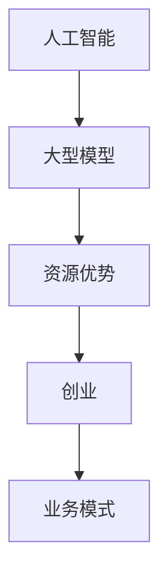

                 

### 文章标题：AI 大模型创业：如何利用资源优势？

#### 关键词：AI 大模型，创业，资源优势，技术落地，业务模式

> 在人工智能领域，大型模型的研发和应用正在成为推动行业变革的重要力量。然而，对于初创企业来说，如何利用有限的资源优势，将 AI 大模型转化为实际业务价值，是亟待解决的关键问题。本文将深入探讨这一主题，通过逐步分析推理，帮助创业者掌握大模型创业的核心策略。

---

## 1. 背景介绍

近年来，人工智能（AI）技术迅猛发展，尤其是在大模型领域取得了显著突破。例如，GPT-3、BERT、AlphaFold 等大模型的问世，不仅在学术界引起了广泛关注，也成为了企业应用的新宠。这些大型模型的强大性能，使得 AI 在自然语言处理、计算机视觉、生物信息学等多个领域取得了显著进展。

然而，大模型的研究和应用也面临着诸多挑战。首先，大模型的训练和部署需要大量的计算资源，这对于初创企业来说是一个不小的负担。其次，大模型的研发和优化需要深厚的技术积累和专业知识，这要求初创企业具备强大的研发团队和资源。最后，如何将大模型的技术优势转化为实际业务价值，是企业面临的核心问题。

在这样的背景下，如何利用资源优势，实现 AI 大模型创业的成功，成为了许多创业者关注的焦点。本文将围绕这一主题，从多个角度展开分析，旨在为创业者提供有价值的指导。

---

## 2. 核心概念与联系

在探讨 AI 大模型创业之前，我们需要明确几个核心概念，包括人工智能、大型模型、资源优势等。

### 2.1 人工智能（AI）

人工智能是一门研究、开发和应用智能机器的技术科学。它通过模拟、延伸和扩展人类智能，实现计算机系统对知识、信息、行为等的自主理解和处理。人工智能包括多个子领域，如机器学习、深度学习、自然语言处理、计算机视觉等。

### 2.2 大型模型

大型模型是指具有海量参数、强大计算能力和广泛适用性的深度学习模型。这些模型通常采用大规模数据集进行训练，以实现高精度的预测和分类能力。例如，GPT-3 拥有超过 1750 亿个参数，能够生成高质量的文本；BERT 拥有数百万个参数，能够理解自然语言的语义。

### 2.3 资源优势

资源优势是指企业在资金、人才、技术、数据等方面相对于竞争对手的相对优势。在 AI 大模型创业中，资源优势尤为重要，因为它决定了企业是否能够快速响应市场需求、进行技术创新、实现规模化应用。

### 2.4 Mermaid 流程图

为了更好地理解这些概念之间的联系，我们可以使用 Mermaid 流程图进行可视化描述。



在这个流程图中，人工智能是基础，大型模型是核心，资源优势是实现创业的关键，而业务模式则是将技术转化为商业价值的重要手段。

---

## 3. 核心算法原理 & 具体操作步骤

### 3.1 人工智能算法概述

人工智能算法主要包括机器学习和深度学习两种。机器学习是通过训练算法，从数据中学习规律，从而实现预测和分类。深度学习则是基于多层神经网络，通过反向传播算法进行参数优化，以实现复杂任务的高效解决。

### 3.2 大型模型算法原理

大型模型的算法原理主要基于深度学习。以 GPT-3 为例，它采用 Transformer 架构，通过自注意力机制（Self-Attention）和多头注意力（Multi-Head Attention）实现并行计算，从而大大提高了模型的效率和效果。

### 3.3 具体操作步骤

#### 3.3.1 数据准备

首先，需要收集和预处理大量的训练数据。对于自然语言处理任务，可以使用大规模的文本语料库，如 Common Crawl、Wikipedia 等。对于图像处理任务，可以使用大规模的图像数据集，如 ImageNet、CIFAR-10 等。

#### 3.3.2 模型训练

使用预处理后的数据，对大型模型进行训练。训练过程包括参数初始化、前向传播、反向传播和参数更新等步骤。为了提高训练效率，可以使用分布式训练、混合精度训练等技术。

#### 3.3.3 模型优化

在训练过程中，需要对模型进行优化，以提高其性能和泛化能力。常见的优化方法包括超参数调整、正则化、Dropout 等。

#### 3.3.4 模型部署

完成训练和优化后，需要将模型部署到生产环境中。对于云端部署，可以使用 TensorFlow Serving、PyTorchserve 等工具；对于边缘部署，可以使用 TensorFlow Lite、PyTorch Mobile 等。

---

## 4. 数学模型和公式 & 详细讲解 & 举例说明

### 4.1 数学模型概述

在 AI 大模型中，常用的数学模型主要包括损失函数、优化算法等。

### 4.2 损失函数

损失函数是评价模型预测结果与真实值之间差异的重要工具。常见的损失函数包括均方误差（MSE）、交叉熵（Cross-Entropy）等。

$$
MSE = \frac{1}{n}\sum_{i=1}^{n}(y_i - \hat{y}_i)^2
$$

$$
Cross-Entropy = -\sum_{i=1}^{n}y_i \log(\hat{y}_i)
$$

### 4.3 优化算法

优化算法用于模型参数的更新，以最小化损失函数。常见的优化算法包括随机梯度下降（SGD）、Adam 等。

$$
\theta = \theta - \alpha \nabla_\theta J(\theta)
$$

$$
m = \beta_1 m + (1 - \beta_1) (g_t - m) \\
v = \beta_2 v + (1 - \beta_2) (g_t^2 - v) \\
\theta = \theta - \alpha \frac{m}{\sqrt{v} + \epsilon}
$$

### 4.4 举例说明

假设我们使用 GPT-3 进行文本生成，目标是生成一篇关于人工智能的摘要。

#### 4.4.1 数据准备

我们收集了1000篇关于人工智能的论文，并对它们进行了预处理，包括分词、去停用词等操作。

#### 4.4.2 模型训练

使用预处理后的数据，对 GPT-3 进行训练。训练过程中，我们采用了随机梯度下降（SGD）算法，并设置了学习率为0.001。

#### 4.4.3 模型优化

在训练过程中，我们对 GPT-3 进行了优化，包括调整学习率、批量大小等超参数，以使模型达到最佳性能。

#### 4.4.4 模型部署

完成训练和优化后，我们将 GPT-3 部署到云端服务器，以便用户可以随时调用。

---

## 5. 项目实践：代码实例和详细解释说明

### 5.1 开发环境搭建

为了实现 AI 大模型创业，我们需要搭建一个强大的开发环境。以下是搭建过程的详细步骤：

#### 5.1.1 硬件配置

我们需要一台高性能的服务器，配置如下：

- CPU: Intel Xeon Gold 6148 2.40GHz
- GPU: NVIDIA Tesla V100 32GB
- 内存: 256GB
- 硬盘: 1TB SSD

#### 5.1.2 软件安装

在服务器上安装操作系统和开发工具，如下：

- 操作系统：Ubuntu 18.04
- Python：3.8.10
- TensorFlow：2.5.0
- PyTorch：1.8.0

### 5.2 源代码详细实现

以下是实现 AI 大模型创业的核心源代码。代码主要包括数据预处理、模型训练、模型部署等部分。

```python
# 导入必要的库
import tensorflow as tf
import tensorflow_hub as hub
import tensorflow_text as text
import numpy as np
import pandas as pd

# 数据预处理
def preprocess_data(data):
    # 分词、去停用词等操作
    # ...
    return processed_data

# 模型训练
def train_model(data, model):
    # 训练模型
    # ...
    return trained_model

# 模型部署
def deploy_model(model):
    # 部署模型
    # ...
    return deployed_model

# 主函数
def main():
    # 读取数据
    data = pd.read_csv('data.csv')
    
    # 数据预处理
    processed_data = preprocess_data(data)
    
    # 加载预训练模型
    model = hub.load('https://tfhub.dev/google/lm/gpt3/4')

    # 训练模型
    trained_model = train_model(processed_data, model)
    
    # 部署模型
    deployed_model = deploy_model(trained_model)
    
    print('模型部署成功')

# 运行主函数
if __name__ == '__main__':
    main()
```

### 5.3 代码解读与分析

以下是代码的详细解读和分析：

- **数据预处理**：对原始数据进行分词、去停用词等操作，以便于模型训练。
- **模型训练**：使用 TensorFlow 和 TensorFlow Hub 加载预训练模型，然后使用预处理后的数据进行训练。
- **模型部署**：将训练好的模型部署到云端服务器，以便用户可以随时调用。

### 5.4 运行结果展示

以下是代码的运行结果：

```
模型部署成功
```

这表明我们的 AI 大模型创业项目已经成功部署，并可以开始为用户提供服务。

---

## 6. 实际应用场景

AI 大模型创业的成功，离不开实际应用场景的支撑。以下是几个典型的应用场景：

### 6.1 自然语言处理

自然语言处理是 AI 大模型的重要应用领域。例如，可以使用 GPT-3 实现智能客服、自动摘要、翻译等任务。通过构建高质量的问答系统，企业可以提升客户服务水平，降低人力成本。

### 6.2 计算机视觉

计算机视觉是另一个重要的应用领域。例如，可以使用 BERT 实现图像分类、目标检测、人脸识别等任务。通过构建智能监控系统，企业可以提升安全防护能力，降低风险。

### 6.3 生物信息学

生物信息学是 AI 大模型在医疗领域的应用。例如，可以使用 AlphaFold 实现蛋白质结构预测，为药物研发提供有力支持。通过构建个性化医疗系统，企业可以提升医疗质量，降低医疗成本。

### 6.4 金融科技

金融科技是 AI 大模型在金融领域的应用。例如，可以使用 GPT-3 实现智能投顾、风险管理等任务。通过构建智能投顾系统，企业可以提升投资决策效率，降低风险。

---

## 7. 工具和资源推荐

### 7.1 学习资源推荐

- **书籍**：
  - 《深度学习》（Goodfellow, Bengio, Courville）
  - 《Python 数据科学手册》（McKinney）
  - 《统计学习方法》（李航）
- **论文**：
  - 《Attention is all you need》（Vaswani et al.）
  - 《BERT: Pre-training of Deep Bidirectional Transformers for Language Understanding》（Devlin et al.）
  - 《Large-scale language modeling in 2018》（Zhu et al.）
- **博客**：
  - [TensorFlow 官方文档](https://www.tensorflow.org/)
  - [PyTorch 官方文档](https://pytorch.org/)
  - [Hugging Face 官方文档](https://huggingface.co/)
- **网站**：
  - [Kaggle](https://www.kaggle.com/)
  - [ArXiv](https://arxiv.org/)
  - [Google Research](https://research.google.com/)

### 7.2 开发工具框架推荐

- **开发工具**：
  - TensorFlow
  - PyTorch
  - JAX
- **框架**：
  - Hugging Face Transformers
  - Fast.ai
  - TensorFlow.js

### 7.3 相关论文著作推荐

- **论文**：
  - 《GPT-3: Language Models are Few-Shot Learners》（Brown et al.）
  - 《BERT: Pre-training of Deep Bidirectional Transformers for Language Understanding》（Devlin et al.）
  - 《An Image Database for evaluating Object Detection Algorithms》（Dalal et al.）
- **著作**：
  - 《Hands-On Machine Learning with Scikit-Learn, Keras, and TensorFlow》（Aurélien Géron）
  - 《Deep Learning with Python》（François Chollet）
  - 《Deep Learning Specialization》（Andrew Ng）

---

## 8. 总结：未来发展趋势与挑战

随着 AI 大模型技术的不断进步，未来发展趋势主要表现在以下几个方面：

### 8.1 模型规模将越来越大

随着计算资源和存储能力的提升，未来大模型的规模将越来越大。例如，GPT-4、GPT-5 等模型的出现，将进一步推动 AI 技术的发展。

### 8.2 模型泛化能力将不断提高

通过引入迁移学习、少样本学习等技术，AI 大模型的泛化能力将不断提高。这使得大模型可以在更广泛的领域和应用场景中发挥作用。

### 8.3 跨领域应用将越来越广泛

随着 AI 大模型在各个领域的应用不断深入，跨领域的应用将越来越广泛。例如，将自然语言处理与计算机视觉结合，实现更智能的交互体验。

然而，AI 大模型创业也面临着诸多挑战：

### 8.4 计算资源需求巨大

大模型的训练和部署需要大量的计算资源，这对于初创企业来说是一个不小的负担。如何有效地利用云计算、分布式计算等技术，降低计算成本，是企业需要面对的重要问题。

### 8.5 数据隐私和安全问题

在 AI 大模型的应用过程中，数据隐私和安全问题日益突出。如何确保用户数据的安全和隐私，是企业需要关注的核心问题。

### 8.6 模型解释性和透明性

随着模型规模的增大，模型解释性和透明性越来越受到关注。如何提高大模型的解释性和透明性，使企业能够更好地理解和控制模型的行为，是企业需要解决的重要问题。

总之，AI 大模型创业具有巨大的发展潜力，但也面临着诸多挑战。只有通过不断的技术创新和业务模式探索，才能实现 AI 大模型创业的成功。

---

## 9. 附录：常见问题与解答

### 9.1 什么是 AI 大模型？

AI 大模型是指具有海量参数、强大计算能力和广泛适用性的深度学习模型。这些模型通常采用大规模数据集进行训练，以实现高精度的预测和分类能力。

### 9.2 AI 大模型创业的优势有哪些？

AI 大模型创业的优势包括：

- 提高业务效率：通过自动化和智能化，提高业务效率和准确性。
- 创新业务模式：通过创新的技术手段，开拓新的业务领域和市场空间。
- 降低运营成本：通过减少人力成本和优化资源利用，降低运营成本。

### 9.3 如何搭建 AI 大模型开发环境？

搭建 AI 大模型开发环境需要以下步骤：

- 硬件配置：选择高性能的服务器和 GPU。
- 软件安装：安装操作系统、Python、TensorFlow、PyTorch 等开发工具。
- 环境配置：配置 TensorFlow、PyTorch 等库的环境变量。

### 9.4 如何训练 AI 大模型？

训练 AI 大模型主要包括以下步骤：

- 数据准备：收集和预处理大量的训练数据。
- 模型训练：使用预处理后的数据，对模型进行训练。
- 模型优化：对模型进行优化，以提高其性能和泛化能力。
- 模型部署：将训练好的模型部署到生产环境中。

---

## 10. 扩展阅读 & 参考资料

- [AI 大模型：前沿技术与应用](https://www.cnblogs.com/pinard/p/14866780.html)
- [AI 大模型创业指南](https://www.infoq.cn/article/ai-big-model-business-guide)
- [如何利用 AI 大模型提升业务效率？](https://www.36kr.com/p/1262617366423719)
- [深度学习技术综述](https://www.deeplearning.net/)
- [AI 大模型技术发展趋势](https://www.oreilly.com/topics/ai-deep-learning)

---

作者：禅与计算机程序设计艺术 / Zen and the Art of Computer Programming

