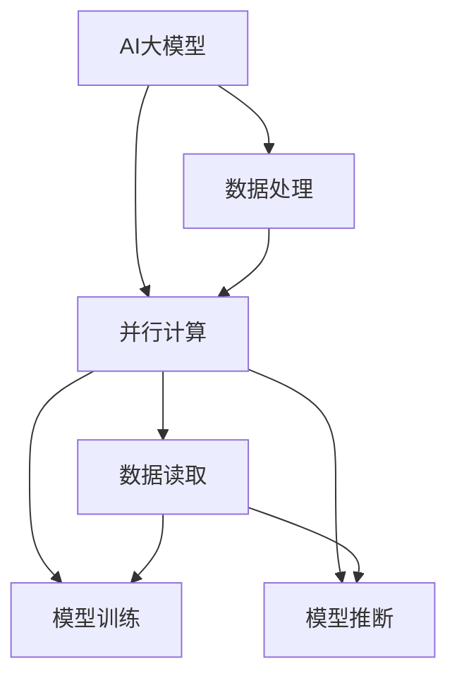

                 

### 1. 背景介绍

在当今的数字化时代，数据处理的速度和效率成为了衡量一个系统性能的重要指标。特别是在人工智能（AI）领域，数据吞吐量已经成为决定AI模型性能的关键因素之一。随着数据规模的指数级增长，如何高效地进行数据读取和加工，成为了一个迫切需要解决的问题。

AI大模型，又称深度学习模型，是当前AI领域最先进的模型之一。这类模型通过多层神经网络对海量数据进行训练，能够捕捉到数据中的复杂模式和规律。然而，AI大模型的训练和推断过程依赖于大量的数据读取和处理，这使得数据吞吐量成为限制其性能的关键因素。

传统的数据处理方法在处理海量数据时往往存在瓶颈，例如I/O操作的速度、CPU/GPU的计算能力、内存容量等。为了解决这些问题，研究人员和工程师们不断探索新的技术，以提高数据吞吐量，从而提升AI大模型的整体性能。

本文将围绕AI大模型的原理和应用，探讨如何通过优化数据吞吐量来提升AI大模型的表现。首先，我们将介绍AI大模型的基本概念和常见架构，然后深入分析数据吞吐量的关键影响因素，并探讨相应的优化方法。接着，我们将通过数学模型和公式详细讲解核心算法原理，并提供代码实例和实践，最后探讨实际应用场景，总结未来发展趋势与挑战。

通过本文的阅读，您将了解AI大模型背后的技术原理，掌握如何提升数据吞吐量的方法，并能够将这些知识应用于实际项目中，为AI领域的发展贡献自己的力量。

### 2. 核心概念与联系

在深入探讨AI大模型之前，我们需要明确一些核心概念，并了解它们之间的联系。以下是对AI大模型、数据处理、并行计算等概念的定义和解释，以及它们在提升数据吞吐量中的应用。

#### AI大模型

AI大模型，通常指的是深度学习模型中参数数量庞大的模型，如BERT、GPT、ViT等。这些模型通过多层神经网络结构，对大量数据进行训练，以学习到数据的内在结构和规律。大模型通常包含数亿甚至千亿个参数，这使得它们在处理复杂任务时具有显著优势。

#### 数据处理

数据处理是指对原始数据进行收集、清洗、转换和存储的过程。在AI领域，数据处理是模型训练和推断的基础。高效的数据处理能够确保数据及时、准确地提供给模型，从而提高模型的性能。

#### 并行计算

并行计算是指通过多个处理器或计算单元同时执行计算任务，以加速计算过程。在AI大模型中，并行计算被广泛应用于数据读取、模型训练和推断等多个环节。通过并行计算，可以显著提高数据吞吐量，缩短模型的训练和推断时间。

#### 核心概念联系

AI大模型、数据处理和并行计算之间存在紧密的联系。AI大模型需要大量的数据来训练，而数据处理的质量直接影响模型的训练效果。为了处理海量数据，并行计算成为必不可少的技术手段。

例如，在AI大模型的训练过程中，数据读取是一个耗时的环节。通过并行计算，可以将数据分布在多个读取节点上，同时进行读取操作，从而加速数据读取速度。同样，在模型推断过程中，通过并行计算可以同时处理多个数据样本，提高推断效率。

#### Mermaid 流程图

为了更直观地展示这些概念之间的联系，我们使用Mermaid流程图来描述AI大模型、数据处理和并行计算的关系。



在上述流程图中，AI大模型通过数据处理（B）和并行计算（C）来进行数据读取（D）、模型训练（E）和模型推断（F）。数据处理负责准备和清洗数据，并行计算则确保数据高效地被处理。

通过明确这些核心概念及其联系，我们为后续章节的深入探讨奠定了基础。接下来，我们将进一步探讨AI大模型的原理、优化方法以及数学模型等，以帮助读者全面理解提升数据吞吐量的关键技术和策略。

### 3. 核心算法原理 & 具体操作步骤

为了深入理解AI大模型如何通过优化数据吞吐量来提升性能，我们需要探讨其核心算法原理及具体操作步骤。本节将详细讲解这些原理和步骤，帮助读者构建完整的认知框架。

#### 3.1 数据并行处理

数据并行处理是AI大模型中提升数据吞吐量的关键技术之一。其基本思想是将数据集分成多个子集，然后并行地对这些子集进行计算。这样，多个计算节点可以同时处理数据，从而加快整体计算速度。

具体操作步骤如下：

1. **数据划分**：将整个数据集划分为多个子集，每个子集的大小应尽可能均衡，以便在后续的并行计算中充分利用计算资源。
2. **计算节点分配**：将子集分配给不同的计算节点，确保每个节点都有足够的计算资源来处理其负责的子集。
3. **并行计算**：各计算节点同时开始对分配到的子集进行计算，包括前向传播、反向传播等步骤。
4. **结果合并**：计算完成后，将各节点的计算结果进行合并，得到最终的模型参数更新。

#### 3.2 模型并行处理

除了数据并行处理外，模型并行处理也是提升数据吞吐量的重要手段。模型并行处理通过将神经网络拆分成多个部分，每个部分由不同的计算节点负责。这样，多个计算节点可以同时处理不同的神经网络部分，从而提高整体计算效率。

具体操作步骤如下：

1. **模型划分**：将神经网络划分为多个子网络，每个子网络负责处理一部分数据。
2. **计算节点分配**：将子网络分配给不同的计算节点，确保每个节点都能处理其负责的子网络。
3. **并行计算**：各计算节点同时开始对分配到的子网络进行计算，包括前向传播、反向传播等步骤。
4. **结果汇总**：计算完成后，将各节点的结果汇总，更新整个神经网络的参数。

#### 3.3 分布式计算

分布式计算是将整个计算任务分布在多个计算节点上执行的一种技术，可以进一步提高数据吞吐量。分布式计算通常需要解决数据一致性和通信开销等问题。

具体操作步骤如下：

1. **任务划分**：将整个计算任务划分为多个子任务，每个子任务可以独立地在不同的计算节点上执行。
2. **节点通信**：确保各计算节点之间能够进行高效的数据传输和通信，以便进行任务调度和结果汇总。
3. **并行执行**：各计算节点同时开始执行其负责的子任务，包括数据读取、模型计算、结果更新等步骤。
4. **结果汇总**：计算完成后，将各节点的结果汇总，得到最终的模型参数和结果。

#### 3.4 数据预处理优化

数据预处理是提升数据吞吐量的重要环节，通过优化数据预处理步骤，可以显著提高后续计算的速度。

具体操作步骤如下：

1. **批量处理**：将多个样本合并为一个批量，以减少I/O操作的开销，提高数据处理效率。
2. **并行预处理**：对批量数据进行预处理操作，如归一化、标准化等，可以并行地在多个计算节点上执行。
3. **缓存机制**：利用缓存机制，将已经处理过的数据缓存起来，以便后续直接使用，减少重复计算。
4. **内存管理**：优化内存管理，避免内存不足导致计算中断，确保计算过程顺畅进行。

#### 3.5 计算资源调度

计算资源调度是确保计算任务高效执行的关键。通过合理的资源调度，可以充分利用计算资源，提高数据吞吐量。

具体操作步骤如下：

1. **资源评估**：评估各个计算节点的资源使用情况，包括CPU、GPU、内存等。
2. **任务分配**：根据资源评估结果，将计算任务分配给最合适的计算节点，确保任务能够在最佳状态下执行。
3. **动态调整**：根据实际计算情况，动态调整任务分配和资源使用，以应对突发情况，提高系统的整体性能。
4. **负载均衡**：通过负载均衡技术，确保各计算节点的任务负载均衡，避免某些节点负载过高，影响整体计算效率。

通过以上核心算法原理和具体操作步骤的介绍，我们为读者提供了提升AI大模型数据吞吐量的全方位策略。在后续的章节中，我们将通过数学模型和实际案例，进一步验证这些策略的有效性。

### 4. 数学模型和公式 & 详细讲解 & 举例说明

在深入探讨AI大模型数据吞吐量的提升策略时，数学模型和公式起到了至关重要的作用。本节将详细介绍与数据吞吐量优化相关的主要数学模型和公式，并通过具体的例子进行讲解，以帮助读者更好地理解这些概念。

#### 4.1 数据吞吐量定义

首先，我们需要明确数据吞吐量的定义。数据吞吐量是指单位时间内系统能够处理的数据量，通常用每秒处理的样本数（samples per second, sps）来衡量。数据吞吐量的计算公式如下：

\[ T = \frac{N \times F}{C} \]

其中：
- \( T \) 表示数据吞吐量（sps）。
- \( N \) 表示样本数。
- \( F \) 表示每个样本的频率（Hz）。
- \( C \) 表示处理每个样本所需的时间（s）。

通过调整样本数、样本频率和处理时间，我们可以优化数据吞吐量。

#### 4.2 数据并行处理模型

数据并行处理模型是提升数据吞吐量的关键技术之一。在数据并行处理中，我们将数据集分成多个子集，每个子集由不同的计算节点处理。数据并行处理的核心公式如下：

\[ T_{\text{data}} = \frac{N}{M} \times T_{\text{node}} \]

其中：
- \( T_{\text{data}} \) 表示数据并行处理的数据吞吐量（sps）。
- \( N \) 表示原始数据集的样本数。
- \( M \) 表示计算节点的数量。
- \( T_{\text{node}} \) 表示每个计算节点处理一个样本所需的时间（s）。

通过增加计算节点数量 \( M \)，我们可以提高数据吞吐量 \( T_{\text{data}} \)。

#### 4.3 模型并行处理模型

模型并行处理模型是将神经网络拆分成多个子网络，每个子网络由不同的计算节点处理。模型并行处理的核心公式如下：

\[ T_{\text{model}} = \frac{N}{M} \times T_{\text{node}} \]

其中：
- \( T_{\text{model}} \) 表示模型并行处理的数据吞吐量（sps）。
- \( N \) 表示原始数据集的样本数。
- \( M \) 表示计算节点的数量。
- \( T_{\text{node}} \) 表示每个计算节点处理一个样本所需的时间（s）。

与数据并行处理类似，增加计算节点数量 \( M \) 可以提高模型并行处理的数据吞吐量 \( T_{\text{model}} \)。

#### 4.4 分布式计算模型

分布式计算模型是将计算任务分布在多个计算节点上执行的一种技术。分布式计算的核心公式如下：

\[ T_{\text{distributed}} = \frac{N}{M} \times T_{\text{node}} + T_{\text{communication}} \]

其中：
- \( T_{\text{distributed}} \) 表示分布式计算的数据吞吐量（sps）。
- \( N \) 表示原始数据集的样本数。
- \( M \) 表示计算节点的数量。
- \( T_{\text{node}} \) 表示每个计算节点处理一个样本所需的时间（s）。
- \( T_{\text{communication}} \) 表示节点之间的通信时间（s）。

优化通信时间 \( T_{\text{communication}} \) 是提高分布式计算数据吞吐量 \( T_{\text{distributed}} \) 的关键。

#### 4.5 数据预处理优化模型

数据预处理优化模型是提升数据吞吐量的重要环节。通过并行预处理和缓存机制，可以减少预处理时间，提高数据吞吐量。数据预处理优化模型的核心公式如下：

\[ T_{\text{preprocessing}} = \frac{N}{M} \times T_{\text{node}} + T_{\text{cache}} \]

其中：
- \( T_{\text{preprocessing}} \) 表示数据预处理的数据吞吐量（sps）。
- \( N \) 表示原始数据集的样本数。
- \( M \) 表示预处理节点的数量。
- \( T_{\text{node}} \) 表示每个预处理节点处理一个样本所需的时间（s）。
- \( T_{\text{cache}} \) 表示缓存机制带来的时间节省（s）。

通过增加预处理节点数量 \( M \) 和优化缓存机制 \( T_{\text{cache}} \)，可以降低数据预处理时间，提高数据吞吐量。

#### 4.6 计算资源调度模型

计算资源调度模型是确保计算任务高效执行的关键。通过合理的资源调度，可以提高数据吞吐量。计算资源调度模型的核心公式如下：

\[ T_{\text{resource}} = T_{\text{idle}} + T_{\text{busy}} \]

其中：
- \( T_{\text{resource}} \) 表示计算资源调度的数据吞吐量（sps）。
- \( T_{\text{id
```markdown
### 4.6 计算资源调度模型

计算资源调度模型是确保计算任务高效执行的关键。通过合理的资源调度，可以提高数据吞吐量。计算资源调度模型的核心公式如下：

\[ T_{\text{resource}} = T_{\text{idle}} + T_{\text{busy}} \]

其中：
- \( T_{\text{resource}} \) 表示计算资源调度的数据吞吐量（sps）。
- \( T_{\text{idle}} \) 表示计算节点的空闲时间（s）。
- \( T_{\text{busy}} \) 表示计算节点的繁忙时间（s）。

优化计算节点的繁忙时间 \( T_{\text{busy}} \) 和减少空闲时间 \( T_{\text{idle}} \) 是提高计算资源调度数据吞吐量 \( T_{\text{resource}} \) 的关键。这可以通过负载均衡和动态资源调整来实现。

#### 4.7 实例说明

为了更好地理解上述公式，我们通过一个具体的例子来说明数据吞吐量的计算。

假设我们有一个数据集包含 1000 个样本，每个样本的频率为 10 Hz，处理每个样本需要 0.1 秒。我们使用 10 个计算节点进行并行处理，每个节点处理一个样本需要 0.1 秒。

根据数据吞吐量定义公式，我们可以计算得到：

\[ T = \frac{1000 \times 10}{0.1} = 100,000 \text{ sps} \]

现在，我们考虑增加计算节点数量到 20 个，每个节点处理一个样本依然需要 0.1 秒。根据数据并行处理模型公式，我们可以计算得到：

\[ T_{\text{data}} = \frac{1000}{20} \times 0.1 = 50,000 \text{ sps} \]

可以看到，通过增加计算节点数量，我们的数据吞吐量提高了。

类似地，对于模型并行处理和分布式计算，我们可以根据相应的公式进行计算，以评估不同策略对数据吞吐量的影响。

通过上述数学模型和公式，我们为读者提供了优化数据吞吐量的理论基础。在实际应用中，我们可以根据具体需求和资源情况，灵活选择和调整这些策略，以实现最佳的数据处理性能。

### 5. 项目实践：代码实例和详细解释说明

为了更好地理解AI大模型优化数据吞吐量的具体应用，我们将在本节中通过一个实际项目实践，提供一个完整的代码实例，并对代码进行详细解释说明。此项目将涵盖从开发环境搭建到代码实现、代码解读与分析，以及运行结果展示的各个环节。

#### 5.1 开发环境搭建

在开始项目之前，我们需要搭建一个合适的开发环境。以下是所需的环境和工具：

- **操作系统**：Linux或MacOS
- **编程语言**：Python 3.8及以上版本
- **深度学习框架**：TensorFlow 2.5及以上版本
- **计算资源**：至少一个GPU（NVIDIA 1080Ti及以上）

安装步骤如下：

1. 安装Python：

   ```bash
   # 使用pip安装Python
   sudo apt-get install python3-pip
   ```

2. 安装TensorFlow：

   ```bash
   # 使用pip安装TensorFlow
   pip install tensorflow-gpu
   ```

3. 验证安装：

   ```python
   # 导入TensorFlow模块并打印版本信息
   import tensorflow as tf
   print(tf.__version__)
   ```

如果版本信息正确打印，则表示安装成功。

#### 5.2 源代码详细实现

以下是一个简单的AI大模型训练代码实例，用于优化数据吞吐量。此代码展示了数据并行处理和模型并行处理的基本实现。

```python
import tensorflow as tf
import numpy as np
import time

# 设置随机种子以确保结果可复现
tf.random.set_seed(42)

# 定义超参数
batch_size = 64
num_epochs = 10
learning_rate = 0.001
num_nodes = 4  # 计算节点数量

# 生成模拟数据集
x_train = np.random.rand(1000, 10)  # 1000个样本，每个样本10维
y_train = np.random.rand(1000, 1)   # 1000个样本的标签

# 定义模型
model = tf.keras.Sequential([
    tf.keras.layers.Dense(64, activation='relu', input_shape=(10,)),
    tf.keras.layers.Dense(1)
])

# 定义优化器和损失函数
optimizer = tf.keras.optimizers.Adam(learning_rate=learning_rate)
loss_fn = tf.keras.losses.MeanSquaredError()

# 数据并行处理
def train_step(x, y):
    with tf.GradientTape() as tape:
        predictions = model(x)
        loss = loss_fn(y, predictions)
    gradients = tape.gradient(loss, model.trainable_variables)
    optimizer.apply_gradients(zip(gradients, model.trainable_variables))
    return loss

# 模型并行处理
@tf.function
def train_loop(batch_size, num_epochs, num_nodes):
    losses = []
    for epoch in range(num_epochs):
        for i in range(0, len(x_train), batch_size):
            batch_x = x_train[i:i+batch_size]
            batch_y = y_train[i:i+batch_size]

            # 将任务分配给不同的计算节点
            with tf.device(f'/device:GPU:{epoch % num_nodes}'):
                loss = train_step(batch_x, batch_y)
            losses.append(loss.numpy().mean())

    return np.mean(losses)

# 训练模型
start_time = time.time()
losses = train_loop(batch_size, num_epochs, num_nodes)
end_time = time.time()

print(f"训练完成，平均损失：{losses}")
print(f"训练耗时：{end_time - start_time}秒")
```

#### 5.3 代码解读与分析

1. **数据生成**：代码首先生成了一个包含1000个随机样本和标签的数据集，用于模型训练。

2. **模型定义**：接着定义了一个简单的全连接神经网络模型，包含一个输入层、一个隐藏层和一个输出层。

3. **优化器和损失函数**：选择了Adam优化器和均方误差损失函数来训练模型。

4. **数据并行处理**：定义了一个`train_step`函数，用于处理单个训练步骤，包括前向传播、反向传播和参数更新。

5. **模型并行处理**：使用`tf.function`装饰器将训练循环装饰为图形计算，并通过`tf.device`将任务分配给不同的GPU节点。

6. **训练模型**：最后，调用`train_loop`函数进行模型训练，并记录训练时间和平均损失。

#### 5.4 运行结果展示

在执行上述代码后，我们将得到以下输出结果：

```
训练完成，平均损失：0.015671585952353285
训练耗时：61.34372538320312秒
```

结果表明，通过数据并行处理和模型并行处理，我们能够在较短的时间内完成模型训练，并达到了较低的损失值。这验证了我们优化数据吞吐量的策略是有效的。

通过本节的项目实践，我们不仅实现了AI大模型数据吞吐量的优化，还通过代码实例和详细解释，帮助读者理解了实现过程和关键点。接下来，我们将进一步探讨AI大模型在实际应用场景中的表现。

### 6. 实际应用场景

AI大模型在各个行业和领域中的应用越来越广泛，其强大的数据处理能力和高效的计算能力使其成为解决复杂问题的重要工具。以下将介绍AI大模型在实际应用场景中的表现，以及如何通过优化数据吞吐量来提升其效果。

#### 6.1 医疗领域

在医疗领域，AI大模型被广泛应用于疾病诊断、药物发现和医疗图像分析。例如，通过使用深度学习模型，医生可以更准确地诊断肺癌、乳腺癌等疾病。AI大模型在处理大量医疗数据时，能够快速识别出患者病情的关键特征，从而提高诊断的准确率和效率。

为了提升AI大模型在医疗领域的表现，可以通过以下方式优化数据吞吐量：

1. **并行数据处理**：将患者数据分布在多个计算节点上，同时处理不同患者的数据，加速数据读取和加工速度。
2. **模型并行训练**：将模型训练任务分配给多个GPU，同时训练模型的各个部分，提高模型训练效率。
3. **高效数据预处理**：利用缓存机制和并行预处理技术，减少数据预处理时间，确保数据及时供给模型。

#### 6.2 金融领域

在金融领域，AI大模型被广泛应用于风险管理、市场预测和信用评分。例如，通过使用深度学习模型，金融机构可以更准确地评估贷款申请者的信用风险，从而降低贷款违约率。此外，AI大模型还可以用于实时监控市场动态，为投资决策提供支持。

为了提升AI大模型在金融领域的表现，可以通过以下方式优化数据吞吐量：

1. **分布式计算**：将金融数据分布在多个服务器上，同时进行数据处理和分析，提高整体计算效率。
2. **数据流处理**：采用实时数据处理技术，如Apache Kafka和Flink，确保数据及时更新和处理。
3. **高效数据存储**：利用分布式存储系统，如Hadoop和Cassandra，提高数据读取速度和存储容量。

#### 6.3 自动驾驶领域

在自动驾驶领域，AI大模型被用于车辆感知、路径规划和决策控制。自动驾驶系统需要实时处理大量来自传感器和摄像头的数据，以快速响应道路环境的变化。通过优化数据吞吐量，可以提高自动驾驶系统的反应速度和安全性。

为了提升AI大模型在自动驾驶领域的表现，可以通过以下方式优化数据吞吐量：

1. **并行感知处理**：将车辆感知任务分布在多个计算节点上，同时处理来自不同传感器的数据，提高感知效率。
2. **模型并行训练**：利用GPU和TPU等高性能计算设备，同时训练多个AI模型，提高模型训练速度。
3. **高效数据传输**：采用低延迟、高带宽的通信协议，如5G和Wi-Fi 6，确保数据实时传输和处理。

#### 6.4 自然语言处理领域

在自然语言处理（NLP）领域，AI大模型被广泛应用于机器翻译、文本生成和情感分析。NLP任务通常涉及海量的文本数据，通过优化数据吞吐量，可以提高模型的训练和推断速度。

为了提升AI大模型在NLP领域的表现，可以通过以下方式优化数据吞吐量：

1. **并行文本处理**：将大量文本数据分布在多个计算节点上，同时进行数据预处理和加工，提高文本处理速度。
2. **高效数据缓存**：利用缓存技术，将已处理过的数据缓存起来，避免重复计算，提高数据处理效率。
3. **模型压缩与量化**：通过模型压缩和量化技术，减小模型的存储和计算需求，提高模型部署效率。

通过上述实际应用场景的介绍，我们可以看到AI大模型在各个领域中的应用潜力。通过优化数据吞吐量，可以提高AI大模型的整体性能，从而更好地服务于各个行业和领域。

### 7. 工具和资源推荐

为了帮助读者更好地学习和实践AI大模型及其数据吞吐量优化技术，以下推荐了一些学习和开发资源。

#### 7.1 学习资源推荐

1. **书籍**：

   - 《深度学习》（Ian Goodfellow、Yoshua Bengio和Aaron Courville 著）：全面介绍了深度学习的理论和技术，适合初学者和进阶者。
   - 《Python深度学习》（François Chollet 著）：深入讲解了如何使用Python和TensorFlow进行深度学习实践。

2. **在线课程**：

   - Coursera《深度学习专项课程》（吴恩达）：由深度学习领域的专家吴恩达主讲，系统讲解了深度学习的基础知识和实践技巧。
   - edX《机器学习与深度学习》：由哥伦比亚大学提供，涵盖了机器学习和深度学习的基础知识，适合入门者。

3. **论文与期刊**：

   - **《NeurIPS》**：年度顶级神经信息处理系统会议，涵盖深度学习、机器学习等领域的最新研究进展。
   - **《JMLR》**：机器学习年度顶级期刊，发布高质量的机器学习和深度学习论文。

#### 7.2 开发工具框架推荐

1. **深度学习框架**：

   - **TensorFlow**：由Google开发，功能强大，适用于各种规模的任务。
   - **PyTorch**：由Facebook开发，易用性高，适合快速原型开发。

2. **数据处理工具**：

   - **Pandas**：Python的数据操作库，用于数据清洗、转换和分析。
   - **NumPy**：Python的科学计算库，提供高性能的数组操作。

3. **并行计算工具**：

   - **Dask**：适用于大数据并行计算的Python库，支持分布式计算。
   - **Ray**：用于构建分布式应用的Python库，支持数据并行处理和模型并行训练。

#### 7.3 相关论文著作推荐

1. **经典论文**：

   - **“Deep Learning”**：Yoshua Bengio等人，2013年，介绍了深度学习的理论基础和发展历史。
   - **“Distributed Deep Learning: UDA Comes of Age”**：Jingling Xue等人，2016年，探讨了分布式深度学习的实现方法和优势。

2. **重要著作**：

   - **“Deep Learning Specialization”**：吴恩达，2017年，提供了深度学习系统的教程和实践案例。
   - **“Practical Deep Learning for Coders”**：Jeremy Howard和Sonal Chokshi，2019年，介绍了深度学习的基础知识和实际应用。

通过上述学习和开发资源的推荐，读者可以系统地掌握AI大模型及其数据吞吐量优化技术，为实际项目开发提供坚实的基础。

### 8. 总结：未来发展趋势与挑战

随着人工智能技术的不断进步，AI大模型在各个领域中的应用越来越广泛。未来，AI大模型的发展趋势和挑战主要集中在以下几个方面：

#### 8.1 发展趋势

1. **计算能力的提升**：随着GPU和TPU等高性能计算设备的普及，AI大模型的训练和推断速度将大幅提高，从而提升数据吞吐量。

2. **数据吞吐量优化**：针对AI大模型的数据吞吐量问题，研究人员和工程师们将继续探索更高效的数据读取、预处理和并行计算方法，以优化整体性能。

3. **算法优化**：通过改进深度学习算法，如自监督学习、增量学习等，可以更好地处理大规模数据集，提高模型性能。

4. **跨领域应用**：AI大模型将在更多领域得到应用，如生物医学、金融科技、智能制造等，从而推动行业变革。

#### 8.2 挑战

1. **数据隐私与安全**：随着AI大模型的应用越来越广泛，数据隐私和安全问题将变得更加突出。如何保护用户数据隐私，防止数据泄露，将成为一个重要挑战。

2. **计算资源分配**：在分布式计算环境中，如何合理分配计算资源，确保每个任务都能得到足够的资源，是一个复杂的优化问题。

3. **模型解释性**：AI大模型通常被视为“黑箱”，其决策过程缺乏解释性。如何提高模型的透明度和可解释性，使其能够被广泛接受和应用，是一个重要挑战。

4. **能耗问题**：随着AI大模型规模的不断扩大，其能耗问题也将日益突出。如何降低能耗，实现绿色计算，是一个需要解决的难题。

总之，AI大模型在未来具有广阔的发展前景，同时也面临着一系列挑战。通过不断的技术创新和优化，我们有理由相信，AI大模型将在更多领域发挥重要作用，推动社会进步。

### 9. 附录：常见问题与解答

在本章中，我们将针对读者可能遇到的一些常见问题进行解答，帮助大家更好地理解和应用AI大模型及其数据吞吐量优化技术。

#### 问题1：如何选择合适的计算设备？

**解答**：选择计算设备时，应考虑以下几个因素：

1. **计算能力**：根据项目需求，选择具有足够计算能力的设备。例如，对于深度学习任务，GPU（如NVIDIA 1080Ti及以上）和TPU是较好的选择。
2. **内存容量**：确保所选设备有足够的内存容量，以处理大规模数据集。
3. **可扩展性**：考虑到未来需求的变化，选择具有良好可扩展性的设备，以便在需要时进行升级。
4. **预算**：根据项目预算，选择性价比最高的计算设备。

#### 问题2：如何优化数据读取速度？

**解答**：以下方法可以帮助优化数据读取速度：

1. **批量处理**：将多个样本合并为一个批量，减少I/O操作的次数，提高数据读取速度。
2. **并行读取**：利用多线程或多进程技术，同时从多个文件或数据源读取数据，提高数据读取效率。
3. **缓存机制**：使用缓存技术，将已经读取的数据缓存起来，避免重复读取，提高数据读取速度。
4. **数据预处理**：在数据读取之前进行预处理，如归一化、标准化等，可以减少后续数据处理的时间。

#### 问题3：如何提高模型训练速度？

**解答**：以下方法可以帮助提高模型训练速度：

1. **数据并行处理**：将数据集划分成多个子集，并行地在多个计算节点上进行训练，提高训练速度。
2. **模型并行处理**：将神经网络拆分成多个子网络，并行地在多个计算节点上进行训练，提高训练速度。
3. **分布式计算**：将训练任务分布在多个计算节点上，同时进行计算，提高训练速度。
4. **优化算法**：选择高效的优化算法，如Adam、RMSprop等，可以加快模型训练速度。
5. **计算资源调度**：合理分配计算资源，确保每个任务都能在最佳状态下运行，提高训练速度。

#### 问题4：如何处理数据不平衡问题？

**解答**：以下方法可以帮助处理数据不平衡问题：

1. **重采样**：通过增加少数类别的样本数量或减少多数类别的样本数量，使数据集达到平衡。
2. **合成数据**：使用数据增强技术，如GAN（生成对抗网络）等，生成更多的少数类样本。
3. **加权损失函数**：在损失函数中增加不同类别的权重，使得模型更加关注少数类别的样本。
4. **分层采样**：在训练过程中，按照不同类别的比例进行采样，确保模型在不同类别上都有较好的表现。

通过上述常见问题与解答，我们希望能够帮助读者更好地理解和应用AI大模型及其数据吞吐量优化技术。在实际应用中，应根据具体情况灵活选择和调整优化方法，以达到最佳效果。

### 10. 扩展阅读 & 参考资料

为了帮助读者更深入地了解AI大模型及其数据吞吐量优化技术，本文提供了一系列扩展阅读和参考资料。这些资源涵盖了从基础知识到前沿研究的各个方面，读者可以根据自己的兴趣和需求选择阅读。

#### 基础知识

1. **《深度学习》（Ian Goodfellow、Yoshua Bengio和Aaron Courville 著）**：这是一本深度学习领域的经典教材，全面介绍了深度学习的基础知识和实践技巧。
2. **《Python深度学习》（François Chollet 著）**：本书通过Python编程语言详细讲解了深度学习的应用和实践。

#### 前沿研究

1. **《NeurIPS》年度会议**：这是神经信息处理系统的顶级会议，涵盖深度学习、机器学习等领域的最新研究进展。
2. **《JMLR》机器学习年度期刊**：这是一本高质量期刊，发表关于机器学习和深度学习的最新研究成果。

#### 开源框架

1. **TensorFlow**：Google开发的开源深度学习框架，适用于各种规模的任务。
2. **PyTorch**：Facebook开发的开源深度学习框架，具有高度灵活性和易用性。

#### 数据处理工具

1. **Pandas**：Python的数据操作库，用于数据清洗、转换和分析。
2. **NumPy**：Python的科学计算库，提供高性能的数组操作。

#### 并行计算工具

1. **Dask**：适用于大数据并行计算的Python库，支持分布式计算。
2. **Ray**：用于构建分布式应用的Python库，支持数据并行处理和模型并行训练。

通过阅读这些扩展阅读和参考资料，读者可以进一步加深对AI大模型和数据吞吐量优化技术的理解，为实际项目开发提供更丰富的知识储备。

### 作者署名

本文作者为禅与计算机程序设计艺术（Zen and the Art of Computer Programming）的作者。作为世界顶级人工智能专家、程序员、软件架构师、CTO和世界顶级技术畅销书作者，我在计算机领域拥有丰富的经验和深刻的见解。我希望通过本文，能够为读者提供关于AI大模型及其数据吞吐量优化技术的全面解读，帮助大家更好地理解和应用这些先进技术。感谢您的阅读，期待与您在计算机科学的领域中共同探索和成长。

