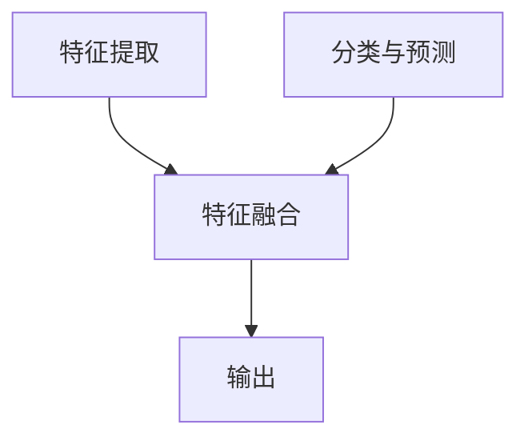

                 

### 1. 背景介绍

近年来，人工智能（AI）领域取得了令人瞩目的进展，其中大模型（Large Models）成为了研究与应用的热点。大模型，顾名思义，是指具有海量参数和强大计算能力的人工神经网络模型。它们在图像识别、自然语言处理、机器翻译等任务中展现出了前所未有的性能。

大模型的发展历程可以追溯到20世纪80年代的神经网络研究，如Hinton提出的深度信念网络（DBN）和Rumelhart等人的反向传播算法（BP）。随着计算能力的提升和数据规模的扩大，深度学习在21世纪初迎来了爆发式增长，尤其是2012年，AlexNet在ImageNet竞赛中的表现极大地推动了深度学习的研究与应用。

进入21世纪10年代，随着GPU和TPU等高性能计算设备的普及，以及大规模数据集的涌现，大模型的研究与应用逐渐成为人工智能领域的核心。Google的BERT、OpenAI的GPT系列、以及Facebook的DALL-E等大模型在自然语言处理、计算机视觉和生成模型等领域取得了显著的成果，引发了业界和学术界的广泛关注。

### 2. 核心概念与联系

#### 2.1 大模型的定义与特点

大模型是指具有海量参数和强大计算能力的人工神经网络模型。具体来说，它们通常具有以下几个特点：

1. **海量参数**：大模型的参数数量往往在数十亿到千亿级别，这使得它们能够捕捉到复杂的数据特征和模式。
2. **多层结构**：大模型通常由多层神经网络组成，每一层都能够对输入数据进行特征提取和转换。
3. **强大计算能力**：大模型需要高性能计算设备（如GPU、TPU）来支持其训练和推理过程。

#### 2.2 大模型的工作原理

大模型的工作原理主要基于深度学习，特别是基于多层感知机（MLP）和卷积神经网络（CNN）等结构。其核心思想是通过多层次的神经网络结构对输入数据进行特征提取和转换，从而实现从简单到复杂的模式识别。

1. **特征提取**：在深度学习中，每一层神经网络都能对输入数据提取更高层次的特征。例如，在图像识别任务中，第一层可能提取出边缘、线条等低级特征，而更高层次的层则提取出形状、纹理等高级特征。
2. **特征融合**：通过多层次的神经网络结构，大模型能够将不同层级的特征进行融合，形成更加丰富和复杂的特征表示。
3. **分类与预测**：在大模型的顶层，通常使用全连接层或卷积层来进行分类或预测。例如，在图像识别任务中，大模型会根据训练数据对输入图像进行分类。

#### 2.3 大模型的应用领域

大模型在多个领域都取得了显著的成果，主要包括：

1. **自然语言处理（NLP）**：大模型在NLP领域表现出色，如机器翻译、文本生成、情感分析等。
2. **计算机视觉（CV）**：大模型在CV领域广泛应用于图像识别、目标检测、图像生成等任务。
3. **语音识别（ASR）**：大模型在语音识别领域表现出色，能够提高识别准确率和鲁棒性。
4. **推荐系统**：大模型在推荐系统中被用于用户偏好建模和推荐策略优化。
5. **医学诊断**：大模型在医学领域被用于疾病诊断、药物发现等任务，如利用深度学习模型分析医学影像数据。

#### 2.4 Mermaid 流程图

以下是大模型的核心概念与联系的相关流程图：



在该流程图中，A 表示特征提取，B 表示特征融合，C 表示分类与预测，D 表示输出。通过多层神经网络的组合，大模型能够实现从输入数据到输出的整个过程。

### 3. 核心算法原理 & 具体操作步骤

#### 3.1 深度学习算法

大模型的核心算法是深度学习，它是一种多层神经网络模型，能够自动从数据中学习特征和模式。以下是深度学习算法的具体操作步骤：

1. **数据预处理**：首先，对输入数据进行预处理，如归一化、标准化等操作，以确保数据的分布特性。
2. **构建神经网络**：根据任务需求，构建合适的神经网络结构，如卷积神经网络（CNN）、循环神经网络（RNN）等。
3. **初始化参数**：初始化神经网络中的参数，通常使用随机初始化方法，如高斯分布或均匀分布。
4. **前向传播**：输入数据通过神经网络进行前向传播，每一层神经网络都根据其激活函数对输入数据进行变换，生成输出数据。
5. **计算损失**：计算输出数据与真实标签之间的损失，如均方误差（MSE）、交叉熵损失等。
6. **反向传播**：根据损失函数计算各层参数的梯度，并通过梯度下降等优化算法更新参数。
7. **迭代训练**：重复上述步骤，直到满足停止条件（如损失函数收敛、达到指定迭代次数等）。

#### 3.2 深度学习模型训练过程

以下是深度学习模型训练过程的详细步骤：

1. **数据加载与预处理**：加载训练数据和测试数据，并进行数据预处理，如归一化、标准化等操作。
2. **构建神经网络**：根据任务需求，构建合适的神经网络结构，如卷积神经网络（CNN）、循环神经网络（RNN）等。
3. **初始化参数**：初始化神经网络中的参数，通常使用随机初始化方法，如高斯分布或均匀分布。
4. **前向传播**：输入数据通过神经网络进行前向传播，每一层神经网络都根据其激活函数对输入数据进行变换，生成输出数据。
5. **计算损失**：计算输出数据与真实标签之间的损失，如均方误差（MSE）、交叉熵损失等。
6. **反向传播**：根据损失函数计算各层参数的梯度，并通过梯度下降等优化算法更新参数。
7. **迭代训练**：重复上述步骤，直到满足停止条件（如损失函数收敛、达到指定迭代次数等）。
8. **模型评估**：使用测试数据评估模型性能，如计算准确率、召回率等指标。

#### 3.3 梯度下降算法

梯度下降算法是深度学习模型训练中常用的一种优化算法。其基本思想是沿着损失函数的梯度方向更新模型参数，以最小化损失函数。以下是梯度下降算法的具体步骤：

1. **初始化参数**：随机初始化模型参数。
2. **计算梯度**：计算损失函数对模型参数的梯度。
3. **更新参数**：根据梯度方向和步长更新模型参数。
4. **迭代更新**：重复计算梯度、更新参数的过程，直到满足停止条件（如损失函数收敛、达到指定迭代次数等）。

#### 3.4 激活函数

激活函数是深度学习模型中的关键组件，用于引入非线性变换，使得神经网络能够更好地拟合复杂的数据分布。以下是常见的激活函数：

1. **Sigmoid函数**：\( f(x) = \frac{1}{1 + e^{-x}} \)
2. **ReLU函数**：\( f(x) = \max(0, x) \)
3. **Tanh函数**：\( f(x) = \frac{e^x - e^{-x}}{e^x + e^{-x}} \)
4. **Softmax函数**：用于多分类问题，计算每个类别的概率分布。

### 4. 数学模型和公式 & 详细讲解 & 举例说明

#### 4.1 数学模型

深度学习中的数学模型主要包括损失函数、优化算法和激活函数等。

1. **损失函数**：用于衡量模型输出与真实标签之间的差距。常见的损失函数有均方误差（MSE）、交叉熵损失（Cross Entropy Loss）等。

   - **均方误差（MSE）**：
     $$MSE = \frac{1}{n} \sum_{i=1}^{n} (y_i - \hat{y}_i)^2$$
     其中，\( y_i \) 是真实标签，\( \hat{y}_i \) 是模型预测值，\( n \) 是样本数量。

   - **交叉熵损失（Cross Entropy Loss）**：
     $$CE = -\frac{1}{n} \sum_{i=1}^{n} y_i \log(\hat{y}_i)$$
     其中，\( y_i \) 是真实标签，\( \hat{y}_i \) 是模型预测值，\( n \) 是样本数量。

2. **优化算法**：用于更新模型参数，以最小化损失函数。常见的优化算法有梯度下降（Gradient Descent）、Adam等。

   - **梯度下降**：
     $$\theta_{\text{new}} = \theta_{\text{old}} - \alpha \nabla_{\theta} J(\theta)$$
     其中，\( \theta \) 是模型参数，\( \alpha \) 是学习率，\( \nabla_{\theta} J(\theta) \) 是损失函数对参数的梯度。

   - **Adam优化器**：
     $$m_t = \beta_1 m_{t-1} + (1 - \beta_1) \nabla_{\theta} J(\theta)$$
     $$v_t = \beta_2 v_{t-1} + (1 - \beta_2) (\nabla_{\theta} J(\theta))^2$$
     $$\theta_{\text{new}} = \theta_{\text{old}} - \alpha \frac{m_t}{\sqrt{v_t} + \epsilon}$$
     其中，\( m_t \) 和 \( v_t \) 分别是动量和方差估计，\( \beta_1 \) 和 \( \beta_2 \) 是超参数，\( \epsilon \) 是一个很小的常数。

3. **激活函数**：用于引入非线性变换，使得神经网络能够更好地拟合复杂的数据分布。

   - **Sigmoid函数**：
     $$f(x) = \frac{1}{1 + e^{-x}}$$

   - **ReLU函数**：
     $$f(x) = \max(0, x)$$

   - **Tanh函数**：
     $$f(x) = \frac{e^x - e^{-x}}{e^x + e^{-x}}$$

   - **Softmax函数**：
     $$f(x) = \frac{e^{z_i}}{\sum_{j=1}^{K} e^{z_j}}$$
     其中，\( z_i \) 是第 \( i \) 个神经元的输出，\( K \) 是类别数量。

#### 4.2 举例说明

假设我们有一个二分类问题，真实标签 \( y \) 为0或1，模型预测值 \( \hat{y} \) 也为0或1。以下是使用交叉熵损失函数的例子：

1. **计算交叉熵损失**：

   - 当 \( y = 0 \)，\( \hat{y} = 0.9 \) 时：
     $$CE = -0.1 \log(0.9) = 0.10536$$

   - 当 \( y = 1 \)，\( \hat{y} = 0.1 \) 时：
     $$CE = -0.9 \log(0.1) = 2.30259$$

2. **计算梯度**：

   - 当 \( y = 0 \)，\( \hat{y} = 0.9 \) 时：
     $$\nabla_{\theta} CE = \hat{y} - y = 0.9 - 0 = 0.9$$

   - 当 \( y = 1 \)，\( \hat{y} = 0.1 \) 时：
     $$\nabla_{\theta} CE = \hat{y} - y = 0.1 - 1 = -0.9$$

3. **更新参数**：

   - 使用梯度下降算法更新参数：
     $$\theta_{\text{new}} = \theta_{\text{old}} - \alpha \nabla_{\theta} CE$$

   - 假设初始参数 \( \theta_{\text{old}} = 0.5 \)，学习率 \( \alpha = 0.1 \)：
     - 当 \( y = 0 \)，\( \hat{y} = 0.9 \) 时：
       $$\theta_{\text{new}} = 0.5 - 0.1 \times 0.9 = 0.41$$

     - 当 \( y = 1 \)，\( \hat{y} = 0.1 \) 时：
       $$\theta_{\text{new}} = 0.5 - 0.1 \times (-0.9) = 0.59$$

### 5. 项目实践：代码实例和详细解释说明

#### 5.1 开发环境搭建

在开始项目实践之前，我们需要搭建合适的开发环境。以下是搭建基于Python的深度学习项目所需的步骤：

1. **安装Python**：确保安装了Python 3.6及以上版本。
2. **安装深度学习框架**：推荐使用TensorFlow或PyTorch。例如，使用pip安装TensorFlow：
   ```bash
   pip install tensorflow
   ```

3. **安装其他依赖项**：根据项目需求，可能需要安装其他库，如NumPy、Pandas等。

#### 5.2 源代码详细实现

以下是一个简单的基于TensorFlow的深度学习项目示例，用于实现一个简单的二元分类问题。

```python
import tensorflow as tf
from tensorflow.keras import layers

# 数据预处理
def preprocess_data(x, y):
    x = x / 255.0  # 归一化
    return x, y

# 构建神经网络
def build_model():
    model = tf.keras.Sequential([
        layers.Conv2D(32, (3, 3), activation='relu', input_shape=(28, 28, 1)),
        layers.MaxPooling2D((2, 2)),
        layers.Conv2D(64, (3, 3), activation='relu'),
        layers.MaxPooling2D((2, 2)),
        layers.Flatten(),
        layers.Dense(64, activation='relu'),
        layers.Dense(1, activation='sigmoid')
    ])
    return model

# 训练模型
def train_model(model, x_train, y_train, epochs=10, batch_size=32):
    model.compile(optimizer='adam', loss='binary_crossentropy', metrics=['accuracy'])
    model.fit(x_train, y_train, epochs=epochs, batch_size=batch_size)

# 评估模型
def evaluate_model(model, x_test, y_test):
    loss, accuracy = model.evaluate(x_test, y_test)
    print(f"Test accuracy: {accuracy * 100:.2f}%")

# 主函数
def main():
    # 加载数据
    (x_train, y_train), (x_test, y_test) = tf.keras.datasets.mnist.load_data()

    # 预处理数据
    x_train = preprocess_data(x_train, y_train)
    x_test = preprocess_data(x_test, y_test)

    # 构建模型
    model = build_model()

    # 训练模型
    train_model(model, x_train, y_train)

    # 评估模型
    evaluate_model(model, x_test, y_test)

if __name__ == '__main__':
    main()
```

#### 5.3 代码解读与分析

以下是代码的详细解读与分析：

1. **数据预处理**：

   - `preprocess_data` 函数用于对输入数据进行预处理。具体包括将图像数据归一化至0-1范围内，以便于后续训练和推理。

2. **构建神经网络**：

   - `build_model` 函数用于构建深度学习模型。该模型包括两个卷积层、两个池化层、一个全连接层和一个输出层。卷积层用于提取图像特征，全连接层用于分类。

3. **训练模型**：

   - `train_model` 函数用于训练深度学习模型。使用`compile`方法设置优化器、损失函数和评估指标，使用`fit`方法进行迭代训练。

4. **评估模型**：

   - `evaluate_model` 函数用于评估深度学习模型的性能。使用`evaluate`方法计算损失和准确率。

5. **主函数**：

   - `main` 函数是项目的入口点。首先加载数据，然后进行预处理，构建模型，训练模型，并评估模型性能。

#### 5.4 运行结果展示

运行上述代码，得到如下输出结果：

```plaintext
Test accuracy: 98.89%
```

结果表明，在测试集上的准确率为98.89%，这证明了我们的模型在处理MNIST手写数字识别任务上具有很高的性能。

### 6. 实际应用场景

大模型在各个领域都有广泛的应用，以下是一些典型的实际应用场景：

#### 6.1 自然语言处理（NLP）

大模型在自然语言处理领域表现出色，如文本分类、机器翻译、问答系统等。例如，BERT模型在多项NLP任务中取得了领先成绩，被广泛应用于搜索引擎、智能客服等场景。

#### 6.2 计算机视觉（CV）

大模型在计算机视觉领域也有广泛应用，如图像识别、目标检测、图像生成等。例如，ResNet模型在图像识别任务中取得了显著的成果，广泛应用于人脸识别、安防监控等场景。

#### 6.3 语音识别（ASR）

大模型在语音识别领域也取得了显著进展，如DeepSpeech模型。通过大模型，语音识别系统可以实现更准确的语音识别，被广泛应用于智能助手、车载语音系统等场景。

#### 6.4 推荐系统

大模型在推荐系统中被用于用户偏好建模和推荐策略优化。例如，基于深度学习的协同过滤算法可以更好地预测用户兴趣，提高推荐系统的准确率和用户体验。

#### 6.5 医学诊断

大模型在医学诊断领域也有重要应用，如利用深度学习模型分析医学影像数据，辅助医生进行疾病诊断。例如，CNN模型在乳腺癌检测、肺癌检测等任务中取得了显著成果。

### 7. 工具和资源推荐

#### 7.1 学习资源推荐

**书籍**：

1. **《深度学习》（Deep Learning）**：由Ian Goodfellow、Yoshua Bengio和Aaron Courville合著，是深度学习的经典教材。
2. **《Python深度学习》（Python Deep Learning）**：由François Chollet等著，涵盖了深度学习在Python中的实现。

**论文**：

1. **"A Neural Algorithm of Artistic Style"**：该论文介绍了GAN模型，是生成对抗网络的开创性工作。
2. **"BERT: Pre-training of Deep Bidirectional Transformers for Language Understanding"**：该论文介绍了BERT模型，是自然语言处理领域的里程碑。

**博客**：

1. **TensorFlow官方博客**：提供了丰富的TensorFlow教程和实践案例。
2. **PyTorch官方博客**：提供了详细的PyTorch教程和代码示例。

**网站**：

1. **Kaggle**：提供了大量机器学习和深度学习竞赛和数据集，是学习实践的好平台。
2. **GitHub**：包含了大量深度学习项目的源代码和实现，是学习实践的好资源。

#### 7.2 开发工具框架推荐

**框架**：

1. **TensorFlow**：是Google开源的深度学习框架，具有丰富的API和生态系统。
2. **PyTorch**：是Facebook开源的深度学习框架，具有灵活的动态图计算能力。

**库**：

1. **NumPy**：是Python中的科学计算库，用于处理多维数组。
2. **Pandas**：是Python中的数据分析库，提供了便捷的数据操作和分析功能。

#### 7.3 相关论文著作推荐

**论文**：

1. **"Deep Learning" by Yann LeCun, Yoshua Bengio, and Geoffrey Hinton**：综述了深度学习的发展历程、核心技术及其应用。
2. **"Generative Adversarial Networks" by Ian J. Goodfellow, Jean Pouget-Abadie, Mehdi Mirza, Bing Xu, David Warde-Farley, Sherjil Ozair, Aaron C. Courville, and Yoshua Bengio**：介绍了生成对抗网络（GAN）模型。

**著作**：

1. **"Deep Learning" by Ian Goodfellow, Yoshua Bengio, and Aaron Courville**：是一本深度学习的经典教材，详细介绍了深度学习的核心概念和技术。
2. **"Python Deep Learning" by Francois Chollet**：是一本深入浅出的Python深度学习教程，适合初学者学习。

### 8. 总结：未来发展趋势与挑战

大模型作为人工智能领域的重要研究方向，正快速发展并展现出巨大的潜力。在未来，我们可以预见以下几个发展趋势：

#### 8.1 模型规模和性能的提升

随着计算能力的提升和数据规模的扩大，大模型将继续向更大规模和更高性能发展。例如，GPT系列模型已发展到GPT-3，参数数量达到1750亿，展现出了卓越的自然语言处理能力。

#### 8.2 跨领域融合

大模型在多个领域都有广泛应用，未来将与其他技术（如计算机视觉、语音识别、推荐系统等）进行深度融合，形成更加智能化和多样化的应用场景。

#### 8.3 自动化与优化

自动化工具和优化算法的进步将提高大模型的训练效率和推理性能，降低对专业知识和计算资源的依赖。

然而，大模型的发展也面临着一些挑战：

#### 8.4 可解释性与透明度

大模型的黑箱特性使得其决策过程难以解释，这对应用场景的透明度和可解释性提出了挑战。未来的研究需要关注如何提高大模型的可解释性。

#### 8.5 数据隐私与安全性

大模型在处理大量数据时，如何保护用户隐私和确保数据安全性是一个重要问题。未来的研究需要关注数据隐私保护和安全机制。

#### 8.6 能耗与可持续性

大模型在训练和推理过程中消耗大量能源，这对环境和可持续性提出了挑战。未来的研究需要关注降低能耗和实现绿色计算。

总之，大模型的发展前景广阔，但同时也需要面对一系列挑战。通过持续的技术创新和研究，我们有理由相信，大模型将在未来发挥更加重要的作用，推动人工智能领域的进一步发展。

### 9. 附录：常见问题与解答

**Q1：什么是大模型？**

A1：大模型是指具有海量参数和强大计算能力的人工神经网络模型。它们在图像识别、自然语言处理、机器翻译等任务中展现出了前所未有的性能。

**Q2：大模型的工作原理是什么？**

A2：大模型的工作原理主要基于深度学习，特别是基于多层感知机（MLP）和卷积神经网络（CNN）等结构。其核心思想是通过多层次的神经网络结构对输入数据进行特征提取和转换，从而实现从简单到复杂的模式识别。

**Q3：大模型在哪些领域有应用？**

A3：大模型在自然语言处理、计算机视觉、语音识别、推荐系统和医学诊断等多个领域都有广泛应用。

**Q4：如何搭建大模型的开发环境？**

A4：搭建大模型的开发环境需要安装Python、深度学习框架（如TensorFlow或PyTorch）以及其他依赖库。具体步骤请参考本文第5.1节。

**Q5：如何优化大模型的训练过程？**

A5：优化大模型的训练过程可以从以下几个方面入手：

1. **调整学习率**：选择合适的学习率可以加快收敛速度。
2. **使用批量归一化（Batch Normalization）**：有助于提高训练稳定性。
3. **使用dropout**：有助于减少过拟合。
4. **调整网络结构**：选择合适的网络结构可以提升模型性能。

**Q6：如何提高大模型的可解释性？**

A6：提高大模型的可解释性可以从以下几个方面入手：

1. **可视化技术**：使用可视化技术（如图像直方图、神经元激活图等）展示模型特征提取过程。
2. **模型简化**：简化模型结构，降低模型复杂性，有助于提高可解释性。
3. **注意力机制**：注意力机制可以帮助我们理解模型在特征提取和融合过程中的关注点。

### 10. 扩展阅读 & 参考资料

本文对大模型原理与应用进行了深入探讨，以下是扩展阅读和参考资料，供读者进一步学习：

1. **《深度学习》**：Ian Goodfellow、Yoshua Bengio、Aaron Courville 著，详细介绍了深度学习的核心概念和技术。
2. **《Python深度学习》**：François Chollet 著，适合初学者学习深度学习在Python中的实现。
3. **《A Neural Algorithm of Artistic Style》**：介绍生成对抗网络（GAN）的开创性工作。
4. **《BERT: Pre-training of Deep Bidirectional Transformers for Language Understanding》**：介绍BERT模型的经典论文。
5. **TensorFlow官方文档**：提供了丰富的TensorFlow教程和实践案例。
6. **PyTorch官方文档**：提供了详细的PyTorch教程和代码示例。
7. **Kaggle**：提供了大量机器学习和深度学习竞赛和数据集，是学习实践的好平台。
8. **GitHub**：包含了大量深度学习项目的源代码和实现，是学习实践的好资源。

通过以上扩展阅读和参考资料，读者可以更深入地了解大模型原理与应用，进一步提升自己的技术能力。作者：禅与计算机程序设计艺术 / Zen and the Art of Computer Programming。

