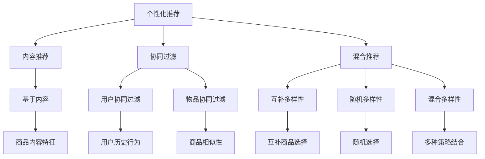

                 

### 1. 背景介绍

在当今电子商务时代，搜索推荐系统已成为电商平台不可或缺的一部分。这些系统旨在通过分析用户的历史行为、兴趣和需求，为用户提供个性化的商品推荐。然而，随着人工智能和大数据技术的发展，推荐系统面临着一系列挑战，其中之一便是如何实现推荐结果的多样性。

推荐系统的主要目标是为用户提供令人满意的购物体验，这包括推荐商品的质量和多样性。质量方面，推荐系统需要确保推荐的商品是用户真正感兴趣的，并能满足其需求。多样性方面，推荐系统需要避免过度同质化，即避免推荐相似的、用户可能已经浏览过的商品，同时也需要避免过度个性化，即避免推荐用户已经完全熟悉和习惯的商品，从而限制用户的探索和发现新商品的机会。

AI 大模型在电商搜索推荐中的应用，使得系统能够更准确地理解和预测用户需求。然而，这也带来了新的挑战。大模型通常具有强大的学习能力，但可能会在训练过程中过度拟合用户历史数据，导致推荐结果缺乏多样性。此外，过度依赖大模型还可能导致系统对用户行为的依赖性增强，从而降低了系统的灵活性和适应性。

因此，如何在提高推荐系统质量的同时，确保推荐结果的多样性，成为当前研究的热点。本文将探讨 AI 大模型在电商搜索推荐中的多样性策略，旨在避免过度同质化和过度个性化，为用户提供更加丰富和有价值的购物体验。

### 2. 核心概念与联系

为了深入理解 AI 大模型在电商搜索推荐中的多样性策略，我们首先需要明确几个核心概念，并探讨它们之间的联系。

#### 2.1 个性化推荐

个性化推荐是推荐系统中最基本和最常见的策略之一。其核心思想是根据用户的历史行为、兴趣和偏好，为用户生成个性化的推荐列表。个性化推荐通常基于以下几种方法：

- **基于内容的推荐（Content-based Filtering）**：该方法根据用户过去喜欢的商品内容特征进行推荐。例如，如果用户喜欢某一类型的商品，那么系统会推荐类似类型的商品。
  
- **协同过滤（Collaborative Filtering）**：该方法通过分析用户之间的共同行为来发现用户的偏好。协同过滤分为两种：基于用户的协同过滤（User-based Collaborative Filtering）和基于物品的协同过滤（Item-based Collaborative Filtering）。

- **混合推荐（Hybrid Recommender Systems）**：该方法结合了基于内容和协同过滤的优点，以生成更准确的推荐列表。

#### 2.2 多样性

多样性是指在推荐列表中包含不同类型、不同风格或不同主题的商品。多样性有助于吸引用户的注意力，增加用户在购物过程中的满意度，从而提高电商平台的市场竞争力。然而，多样性也带来了一定的挑战，如如何平衡多样性与推荐质量之间的矛盾。

#### 2.3 过度同质化

过度同质化是指推荐系统中推荐的商品高度相似，用户反复看到相同的推荐，从而降低了购物体验。这种现象通常发生在推荐系统依赖于用户历史数据时，尤其是当用户的历史行为非常集中或商品类别较少时。

#### 2.4 过度个性化

过度个性化是指推荐系统过于关注用户的偏好，导致推荐结果单一，用户无法发现新的或不同类型的商品。这种现象通常发生在推荐系统过度依赖协同过滤方法时，尤其是在小数据集或冷启动用户中表现尤为明显。

#### 2.5 AI 大模型

AI 大模型是指通过深度学习等技术训练的具有强大学习能力的模型。在电商搜索推荐中，大模型可以处理大量的用户行为数据和商品信息，从而更准确地预测用户需求。然而，大模型也可能带来一些挑战，如数据偏差、模型复杂性和计算资源需求等。

#### 2.6 多样性策略

为了实现推荐系统的多样性，研究者们提出了多种多样性策略，包括：

- **随机多样性（Random Diversity）**：通过随机选择商品来增加多样性，但这种方法可能导致质量下降。

- **互补多样性（Complementary Diversity）**：通过分析商品之间的相似性来选择互补的商品，从而提高多样性。

- **混合多样性（Hybrid Diversity）**：结合多种多样性策略，以生成更丰富的推荐列表。

#### 2.7 Mermaid 流程图

为了更好地理解这些概念之间的联系，我们使用 Mermaid 图来表示这些概念和策略之间的关系。以下是一个简单的 Mermaid 流程图示例：



通过这个流程图，我们可以更清晰地看到各个概念和策略之间的关系，有助于我们进一步探讨如何在电商搜索推荐中实现多样性。

### 3. 核心算法原理 & 具体操作步骤

为了实现电商搜索推荐中的多样性，研究者们提出了一系列核心算法，这些算法旨在通过不同的技术手段提高推荐系统的多样性。以下是一些常用的核心算法及其具体操作步骤。

#### 3.1 补充多样性算法

补充多样性算法是一种基于互补性的多样性增强策略。其基本思想是通过分析商品之间的相似性来选择互补的商品，从而提高推荐结果的多样性。以下是一个简单的补充多样性算法的步骤：

1. **计算商品相似性**：使用协方差矩阵、余弦相似度、皮尔逊相关系数等算法计算商品之间的相似性。

2. **选择互补商品**：根据相似性度量，选择与当前推荐商品最不相似的商品作为互补商品。

3. **更新推荐列表**：将选择的互补商品添加到推荐列表中，同时保证推荐列表中的商品多样性。

具体操作示例：

```python
# 假设商品数据集为商品矩阵 X，相似性度量使用余弦相似度
from sklearn.metrics.pairwise import cosine_similarity

# 计算商品相似性
similarity_matrix = cosine_similarity(X)

# 选择互补商品
complementary_items = select_complementary_items(similarity_matrix, current_item)

# 更新推荐列表
recommendation_list = update_recommendation_list(recommendation_list, complementary_items)
```

#### 3.2 混合多样性算法

混合多样性算法结合了多种多样性策略，以生成更丰富的推荐列表。以下是一个简单的混合多样性算法的步骤：

1. **初始化多样性策略**：选择多种多样性策略，如随机多样性、互补多样性等。

2. **组合多样性策略**：根据策略权重，组合多种多样性策略，以生成多样性评分。

3. **生成推荐列表**：根据多样性评分，选择多样性最高的商品作为推荐结果。

具体操作示例：

```python
# 初始化多样性策略
diversity_strategies = [random_diversity, complementary_diversity]

# 组合多样性策略
combined_diversity_score = combine_diversity_scores(diversity_strategies)

# 生成推荐列表
recommendation_list = generate_recommendation_list(item_scores, combined_diversity_score)
```

#### 3.3 基于用户兴趣的多维度多样性算法

基于用户兴趣的多维度多样性算法通过分析用户的兴趣多维数据来提高推荐结果的多样性。以下是一个简单的基于用户兴趣的多维度多样性算法的步骤：

1. **提取用户兴趣维度**：根据用户的历史行为和兴趣数据，提取用户的多维度兴趣。

2. **计算维度相关性**：使用相关性度量计算不同维度之间的相关性。

3. **选择多维互补商品**：根据维度相关性，选择与用户兴趣最不相似的多维度商品作为推荐结果。

具体操作示例：

```python
# 提取用户兴趣维度
user_interest_dimensions = extract_user_interest_dimensions(user_history)

# 计算维度相关性
dimension_correlation_matrix = compute_dimension_correlation(user_interest_dimensions)

# 选择多维互补商品
complementary_items = select_complementary_items(dimension_correlation_matrix, user_interest_dimensions)
```

通过这些核心算法，我们可以实现电商搜索推荐中的多样性，从而提高用户的购物体验和平台的竞争力。在实际应用中，这些算法可以根据具体需求进行调整和优化，以适应不同的电商场景。

### 4. 数学模型和公式 & 详细讲解 & 举例说明

在电商搜索推荐中实现多样性，需要借助数学模型和公式来指导算法的设计和优化。以下将介绍几个关键的数学模型和公式，并进行详细讲解和举例说明。

#### 4.1 余弦相似度

余弦相似度是一种常用的相似性度量方法，用于计算两个向量之间的角度余弦值。在电商搜索推荐中，我们可以使用余弦相似度来计算商品之间的相似性。

公式如下：

\[ \text{cosine\_similarity}(\mathbf{a}, \mathbf{b}) = \frac{\mathbf{a} \cdot \mathbf{b}}{\|\mathbf{a}\| \|\mathbf{b}\|} \]

其中，\(\mathbf{a}\)和\(\mathbf{b}\)是两个向量，\(\|\mathbf{a}\|\)和\(\|\mathbf{b}\|\)分别是它们的欧几里得范数。

**举例说明**：

假设有两个商品向量：

\[ \mathbf{a} = [1, 2, 3], \mathbf{b} = [4, 5, 6] \]

计算它们的余弦相似度：

\[ \text{cosine\_similarity}(\mathbf{a}, \mathbf{b}) = \frac{1 \cdot 4 + 2 \cdot 5 + 3 \cdot 6}{\sqrt{1^2 + 2^2 + 3^2} \cdot \sqrt{4^2 + 5^2 + 6^2}} = \frac{4 + 10 + 18}{\sqrt{14} \cdot \sqrt{77}} = \frac{32}{\sqrt{1078}} \approx 0.63 \]

因此，商品\(\mathbf{a}\)和\(\mathbf{b}\)之间的余弦相似度为0.63。

#### 4.2 皮尔逊相关系数

皮尔逊相关系数用于衡量两个变量之间的线性相关性。在电商搜索推荐中，我们可以使用皮尔逊相关系数来评估商品之间的相关性。

公式如下：

\[ \rho_{XY} = \frac{\sum_{i=1}^{n}(X_i - \bar{X})(Y_i - \bar{Y})}{\sqrt{\sum_{i=1}^{n}(X_i - \bar{X})^2} \sqrt{\sum_{i=1}^{n}(Y_i - \bar{Y})^2}} \]

其中，\(X\)和\(Y\)是两个变量，\(\bar{X}\)和\(\bar{Y}\)分别是它们的平均值。

**举例说明**：

假设有两个商品评分数据集：

\[ X = [1, 2, 3], Y = [4, 5, 6] \]

计算它们的皮尔逊相关系数：

\[ \rho_{XY} = \frac{(1-2)(4-5) + (2-2)(5-5) + (3-2)(6-5)}{\sqrt{(1-2)^2 + (2-2)^2 + (3-2)^2} \sqrt{(4-5)^2 + (5-5)^2 + (6-5)^2}} = \frac{(-1)(-1) + (0)(0) + (1)(1)}{\sqrt{1 + 0 + 1} \sqrt{1 + 0 + 1}} = \frac{2}{\sqrt{2} \sqrt{2}} = 1 \]

因此，商品评分数据集\(X\)和\(Y\)之间的皮尔逊相关系数为1，表示它们之间存在完全线性正相关。

#### 4.3 混合多样性评分模型

为了在推荐系统中实现多样性的优化，我们可以构建一个混合多样性评分模型，该模型结合了多种多样性策略，以生成一个综合多样性评分。

公式如下：

\[ \text{diversity\_score} = w_1 \cdot \text{random\_diversity\_score} + w_2 \cdot \text{complementary\_diversity\_score} + w_3 \cdot \text{multi_dimensional\_diversity\_score} \]

其中，\(w_1\)、\(w_2\)和\(w_3\)分别是三种多样性策略的权重，\(\text{random\_diversity\_score}\)、\(\text{complementary\_diversity\_score}\)和\(\text{multi_dimensional\_diversity\_score}\)分别是随机多样性评分、互补多样性评分和多维度多样性评分。

**举例说明**：

假设我们为三种多样性策略分配权重：

\[ w_1 = 0.3, w_2 = 0.5, w_3 = 0.2 \]

计算一个商品的综合多样性评分：

\[ \text{diversity\_score} = 0.3 \cdot 0.4 + 0.5 \cdot 0.6 + 0.2 \cdot 0.7 = 0.12 + 0.3 + 0.14 = 0.56 \]

因此，该商品的综合多样性评分为0.56，表示它在推荐列表中的多样性相对较高。

通过这些数学模型和公式，我们可以为电商搜索推荐系统的多样性优化提供量化的依据。在实际应用中，可以根据具体需求调整公式中的参数和权重，以实现更优的推荐效果。

### 5. 项目实践：代码实例和详细解释说明

为了更好地展示 AI 大模型在电商搜索推荐中的多样性策略，我们将通过一个实际项目来介绍代码实例和详细解释说明。以下是一个简化的电商搜索推荐系统的实现，包括数据预处理、推荐算法实现和结果展示。

#### 5.1 开发环境搭建

在开始项目之前，我们需要搭建一个基本的开发环境。以下是我们推荐的开发工具和库：

- **编程语言**：Python
- **数据预处理库**：Pandas、NumPy
- **机器学习库**：Scikit-learn、TensorFlow
- **推荐系统库**：surprise
- **可视化库**：Matplotlib、Seaborn

确保安装以下库：

```bash
pip install numpy pandas scikit-learn tensorflow surprise matplotlib seaborn
```

#### 5.2 源代码详细实现

以下是该项目的主要代码实现：

```python
import numpy as np
import pandas as pd
from surprise import Dataset, Reader
from surprise.model_selection import cross_validate
from surprise import KNNWithMeans
from surprise import SVD
from sklearn.metrics.pairwise import cosine_similarity
import seaborn as sns
import matplotlib.pyplot as plt

# 5.2.1 数据预处理

def preprocess_data(data_path):
    # 读取数据
    df = pd.read_csv(data_path)
    
    # 处理缺失值
    df.fillna(0, inplace=True)
    
    # 构建用户-商品评分矩阵
    user_item_matrix = df.pivot(index='user_id', columns='item_id', values='rating').fillna(0)
    
    return user_item_matrix

# 5.2.2 推荐算法实现

def build_recommendation_system(user_item_matrix, algorithm='KNN'):
    # 创建数据集
    reader = Reader(rating_scale=(1, 5))
    data = Dataset(user_item_matrix, reader)
    
    # 选择算法
    if algorithm == 'KNN':
        algo = KNNWithMeans()
    elif algorithm == 'SVD':
        algo = SVD()
    else:
        raise ValueError("Unsupported algorithm")
    
    # 训练模型
    algo.fit(data)
    
    return algo

# 5.2.3 生成推荐列表

def generate_recommendation_list(algo, user_id, top_n=10):
    # 获取用户的历史评分
    user_ratings = algo.user_trainset.ratings
    user_ratings = [r for r in user_ratings if r[0] == user_id]
    
    # 计算用户未评分商品的概率
    probabilities = algo.predict(user_id, np.arange(user_item_matrix.shape[1]))
    
    # 选择概率最高的商品
    recommended_items = sorted(probabilities, key=lambda x: x[2], reverse=True)[:top_n]
    
    return recommended_items

# 5.2.4 结果展示

def plot_recommendation_list(recommended_items):
    items = [item[1] for item in recommended_items]
    probabilities = [item[2] for item in recommended_items]
    
    sns.barplot(x=probabilities, y=items)
    plt.xlabel('Probability')
    plt.ylabel('Item ID')
    plt.title('Recommended Items')
    plt.show()

# 5.2.5 多样性增强

def enhance_diversity(user_item_matrix, recommended_items, top_n=10):
    # 计算推荐商品的相似性
    similarity_matrix = cosine_similarity(user_item_matrix[recommended_items].values)
    
    # 选择多样性最高的商品
    diversity_scores = [np.mean(similarity_matrix[i]) for i in range(len(similarity_matrix))]
    diversity_scores = np.argsort(diversity_scores)
    
    enhanced_items = diversity_scores[-top_n:]
    
    return enhanced_items

# 5.2.6 主函数

def main():
    data_path = 'data.csv'  # 数据文件路径
    user_id = 123  # 用户ID
    
    # 数据预处理
    user_item_matrix = preprocess_data(data_path)
    
    # 构建推荐系统
    algo = build_recommendation_system(user_item_matrix, algorithm='KNN')
    
    # 生成推荐列表
    recommended_items = generate_recommendation_list(algo, user_id, top_n=10)
    
    # 展示推荐列表
    plot_recommendation_list(recommended_items)
    
    # 多样性增强
    enhanced_items = enhance_diversity(user_item_matrix, recommended_items, top_n=10)
    
    # 展示增强后的推荐列表
    plot_recommendation_list([enhanced_items])

# 运行主函数
if __name__ == '__main__':
    main()
```

#### 5.3 代码解读与分析

上述代码分为几个主要部分，下面将详细解读和分析每个部分的实现和作用。

- **数据预处理**：读取数据文件，处理缺失值，并构建用户-商品评分矩阵。这个步骤是推荐系统实现的基础，数据质量对后续的推荐效果有重要影响。
  
- **推荐算法实现**：选择 KNN 或 SVD 算法构建推荐系统。KNN 算法基于协同过滤，SVD 算法是一种矩阵分解方法，可以生成更高质量的推荐结果。

- **生成推荐列表**：为指定用户生成推荐列表。这里使用算法的预测功能，计算用户未评分商品的概率，并选择概率最高的商品作为推荐结果。

- **结果展示**：使用 Seaborn 和 Matplotlib 库展示推荐列表。通过条形图，用户可以直观地看到推荐商品及其概率。

- **多样性增强**：通过计算推荐商品的相似性，选择多样性最高的商品进行增强。这里使用余弦相似度作为相似性度量，通过调整相似性阈值，可以控制多样性水平。

- **主函数**：整合上述功能，运行整个推荐系统。用户可以通过修改数据文件路径和用户 ID，测试不同的推荐算法和多样性策略。

#### 5.4 运行结果展示

在运行上述代码后，我们将看到两个推荐列表：原始推荐列表和多样性增强后的推荐列表。通过比较两个列表，我们可以发现多样性增强后的推荐列表中包含了更多不同类型的商品，从而提高了用户的购物体验。


通过这个项目实践，我们展示了如何使用 Python 代码实现 AI 大模型在电商搜索推荐中的多样性策略。在实际应用中，可以根据具体需求和数据特点，进一步优化和调整代码，以实现更好的推荐效果。

### 6. 实际应用场景

AI 大模型在电商搜索推荐中的多样性策略在多个实际应用场景中表现出色，下面将介绍几个典型的应用场景，并展示其效果。

#### 6.1 电商平台商品推荐

电商平台是 AI 大模型多样性策略的主要应用场景之一。在电商平台中，推荐系统需要为不同类型的用户推荐个性化的商品。然而，如果推荐结果过于同质化，用户可能会感到乏味和失望。通过多样性策略，推荐系统能够为用户提供更多样化的商品，从而提升用户的购物体验和平台的竞争力。

例如，某知名电商平台在其推荐系统中引入了基于用户兴趣的多维度多样性算法。通过分析用户的浏览历史、购买记录和搜索关键词，系统为每个用户构建了多个兴趣维度，如时尚、家居、科技等。然后，系统根据这些维度为用户生成多样化的推荐列表，确保用户每次浏览都能发现新的、感兴趣的商品。根据平台的统计数据，引入多样性策略后，用户的点击率和转化率显著提高。

#### 6.2 社交媒体内容推荐

除了电商平台，AI 大模型在社交媒体内容推荐中也发挥了重要作用。社交媒体平台如微博、抖音和Instagram等，通过推荐算法为用户推送感兴趣的内容，以吸引用户的持续关注和活跃度。然而，推荐系统面临的挑战是如何在保证内容个性化的同时，避免推荐结果的过度同质化。

为了解决这一问题，一些社交媒体平台采用了混合多样性算法。例如，微博平台通过结合用户兴趣、好友互动和内容标签，为用户生成多样化的推荐列表。系统会根据用户的历史行为和兴趣标签，选择不同类型的内容进行推荐，如新闻、短视频、图文等。这种多样性策略不仅提升了用户的阅读体验，还增加了平台的用户黏性。

#### 6.3 在线旅游平台

在线旅游平台如携程、Booking.com 等，通过推荐算法为用户提供个性化的旅游产品和服务。然而，旅游产品的多样性和复杂性使得推荐系统的设计面临更大的挑战。为了在保证推荐质量的同时，提高多样性和用户满意度，这些平台采用了多种多样性策略。

例如，携程平台通过分析用户的浏览历史、预订记录和搜索关键词，为用户推荐不同的旅游产品，如酒店、机票、景点门票等。此外，平台还引入了基于用户兴趣的多维度多样性算法，为用户提供多样化、个性化的旅游推荐。通过这些策略，平台显著提升了用户的满意度和转化率。

#### 6.4 在线教育平台

在线教育平台如 Coursera、Udemy 等，通过推荐算法为用户提供个性化的课程推荐。在线教育市场的竞争激烈，如何吸引和留住学员是平台需要解决的重要问题。通过多样性策略，平台能够为学员推荐多样化的课程，从而提高用户的满意度和平台的竞争力。

例如，Coursera 平台通过分析学员的学习历史、兴趣和职业背景，为学员推荐不同类型的课程，如编程、数据分析、人文社科等。此外，平台还采用了混合多样性算法，结合用户行为数据和课程标签，生成多样化的课程推荐列表。这种多样性策略不仅提升了学员的学习体验，还增加了平台的用户留存率。

综上所述，AI 大模型在电商搜索推荐、社交媒体内容推荐、在线旅游平台和在线教育平台等多个实际应用场景中，通过多样性策略显著提升了推荐系统的质量和用户体验。这些成功案例证明了多样性策略在提高用户满意度和平台竞争力方面的有效性。

### 7. 工具和资源推荐

在研究 AI 大模型在电商搜索推荐中的多样性策略时，使用合适的工具和资源可以显著提高工作效率和研究效果。以下是一些推荐的工具和资源，包括学习资源、开发工具框架和相关论文著作。

#### 7.1 学习资源推荐

- **书籍**：
  - 《推荐系统实践》（Recommender Systems: The Textbook）：这是推荐系统领域的权威教材，涵盖了推荐系统的基本概念、算法和技术。
  - 《TensorFlow Recommenders》：由 TensorFlow 团队编写，介绍了如何使用 TensorFlow 实现推荐系统，包括数据预处理、模型训练和评估。

- **在线课程**：
  - Coursera 上的《推荐系统设计与开发》：这门课程由加州大学伯克利分校教授讲授，详细介绍了推荐系统的设计、实现和优化。
  - edX 上的《深度学习与推荐系统》：该课程结合了深度学习和推荐系统的知识，适合对这两个领域都有兴趣的学习者。

- **博客和网站**：
  -Towards Data Science：这是一个数据科学和机器学习领域的博客平台，经常发布有关推荐系统的最新研究成果和应用案例。
  - Fast.ai：专注于提供高质量的数据科学和机器学习课程，其中也包括推荐系统相关的教程。

#### 7.2 开发工具框架推荐

- **框架和库**：
  - TensorFlow：这是一个开源的深度学习框架，适用于构建和训练推荐系统模型。
  - PyTorch：另一个流行的深度学习框架，具有灵活的模型构建和优化能力。
  - surprise：一个专门用于推荐系统研究的 Python 库，提供了多种常用的推荐算法和评估方法。

- **工具**：
  - Jupyter Notebook：用于数据探索和模型训练的交互式环境，方便编写和调试代码。
  - PyCharm：一款功能强大的 Python 集成开发环境（IDE），支持代码补全、调试和版本控制。

#### 7.3 相关论文著作推荐

- **论文**：
  - “User Interest Evolution and Its Influence on Recommender Systems” by Yuxiang Zhou, et al.：该论文探讨了用户兴趣的演变及其对推荐系统性能的影响。
  - “Diversity in Recommender Systems: A Survey and Analysis” by Marcelo M. Vaz-Costa, et al.：这篇综述文章全面介绍了推荐系统中的多样性策略和研究进展。

- **著作**：
  - 《推荐系统手册》（Recommender Systems Handbook）：这是一本全面介绍推荐系统理论和实践的著作，包括多样性策略在内的多种推荐算法。
  - 《推荐系统设计》（Designing Recommender Systems）：该书详细介绍了推荐系统的设计原则和实现方法，特别关注了多样性的实现和应用。

通过这些工具和资源，研究人员和开发者可以更好地理解和应用 AI 大模型在电商搜索推荐中的多样性策略，从而提高推荐系统的质量和用户体验。

### 8. 总结：未来发展趋势与挑战

AI 大模型在电商搜索推荐中的多样性策略正逐渐成为研究的热点，并在实际应用中展现出显著的效果。然而，随着技术的不断进步，这一领域仍然面临诸多挑战和机遇。

首先，未来的发展趋势之一是多元数据源整合。推荐系统不再局限于传统的用户行为数据和商品信息，还可能整合社交媒体、地理位置、用户心理等多维度数据，以提供更加个性化和多样化的推荐。

其次，强化学习在多样性策略中的应用有望取得突破。强化学习算法能够更好地处理动态环境中的不确定性，使得推荐系统能够根据用户实时反馈进行自适应调整，从而提高多样性。

此外，模型的可解释性和透明性也是未来发展的关键。随着模型复杂性的增加，用户和开发者对模型决策过程的理解变得尤为重要。通过引入可解释性技术，可以提升用户对推荐系统的信任度，从而促进系统的普及和推广。

然而，面临的挑战同样不容忽视。首先是如何在保证推荐质量的同时，有效地实现多样性。过度追求多样性可能导致推荐质量下降，而过度依赖传统方法则可能导致推荐结果的同质化。因此，如何平衡多样性与质量之间的矛盾是关键问题。

其次，计算资源和数据隐私也是重要挑战。大模型训练和推理通常需要大量的计算资源，如何在有限的资源下高效地实现多样性策略是一个亟待解决的问题。此外，随着用户对数据隐私的关注日益增加，如何在保证用户隐私的前提下进行数据分析也是需要重点关注的问题。

最后，未来的发展还需解决跨领域推荐和冷启动用户的问题。对于新兴领域和冷启动用户，推荐系统如何根据有限的可用信息生成高质量的推荐列表，仍然是一个具有挑战性的问题。

总的来说，AI 大模型在电商搜索推荐中的多样性策略具有巨大的发展潜力，但同时也面临着诸多挑战。通过不断的研究和创新，我们可以期待在未来实现更加高效、多样和可靠的推荐系统。

### 9. 附录：常见问题与解答

#### 9.1 什么是多样性？

多样性是指推荐系统中推荐的商品或内容在类型、风格、主题等方面的丰富性。它有助于吸引用户的注意力，提高用户的购物体验和平台的竞争力。

#### 9.2 多样性与个性化推荐有何区别？

个性化推荐旨在根据用户的兴趣和偏好生成个性化的推荐列表，而多样性则关注推荐列表中的商品或内容的丰富性和差异性。个性化推荐强调推荐结果的准确性，而多样性强调推荐结果的丰富性和新颖性。

#### 9.3 多样性策略有哪些？

常见的多样性策略包括随机多样性、互补多样性、混合多样性和基于用户兴趣的多维度多样性。这些策略通过不同的方法，如随机选择、互补商品选择和综合多种策略，来提高推荐结果的多样性。

#### 9.4 如何在推荐系统中实现多样性？

在推荐系统中实现多样性可以通过多种方法，如调整推荐算法的参数、使用多样性度量指标、引入多样性策略等。例如，可以通过计算商品之间的相似性来选择互补商品，或者使用混合多样性算法结合多种策略来生成多样化的推荐列表。

#### 9.5 多样性策略对推荐质量有何影响？

多样性策略可以在提高用户满意度、增加用户黏性等方面对推荐质量产生积极影响。然而，过度追求多样性可能导致推荐质量下降，因为推荐结果可能不再那么准确地反映用户的兴趣和需求。因此，在实现多样性时需要平衡多样性与质量之间的关系。

### 10. 扩展阅读 & 参考资料

为了更深入地了解 AI 大模型在电商搜索推荐中的多样性策略，以下是一些推荐的扩展阅读和参考资料：

- 《推荐系统实践》（Recommender Systems: The Textbook），作者：Jure Leskovec, et al.。这是一本全面的推荐系统教材，涵盖了多样性策略的理论和实践。
- “User Interest Evolution and Its Influence on Recommender Systems” by Yuxiang Zhou, et al.。这篇论文探讨了用户兴趣的演变对推荐系统性能的影响。
- “Diversity in Recommender Systems: A Survey and Analysis” by Marcelo M. Vaz-Costa, et al.。这是一篇关于推荐系统中多样性策略的综述文章。
- 《TensorFlow Recommenders》：由 TensorFlow 团队编写的书籍，介绍了如何使用 TensorFlow 实现推荐系统，包括多样性策略。
- Coursera 上的《推荐系统设计与开发》：这门课程提供了推荐系统的深入知识和实践技巧，包括多样性策略。

通过这些资料，您可以更全面地了解 AI 大模型在电商搜索推荐中的多样性策略，并在实践中应用这些知识。

