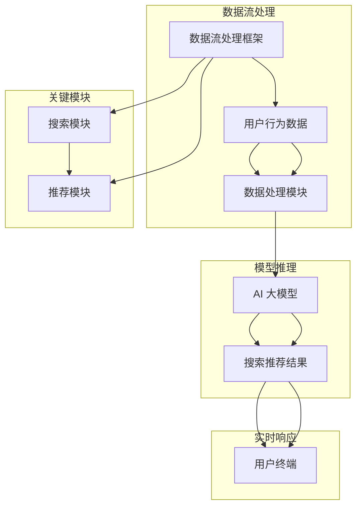

                 

### 背景介绍 Background

随着互联网的普及和电子商务的迅猛发展，用户在电商平台上进行搜索和推荐的需求日益增长。这些需求不仅体现在购买商品的便利性上，更体现在个性化推荐和实时响应上。对于电商平台而言，能够准确、快速地响应用户的搜索和推荐请求，不仅能够提升用户体验，还能显著增加销售转化率。

#### 电商搜索推荐系统的挑战

电商搜索推荐系统面临的挑战主要包括以下几点：

1. **海量数据处理**：电商平台每天都会产生海量的用户行为数据，如搜索记录、浏览记录、购买记录等。如何高效地处理这些大规模复杂数据，是电商搜索推荐系统的首要挑战。
2. **实时响应**：用户对搜索和推荐的结果期望能够实时获得，这对系统的实时处理能力提出了严格要求。
3. **个性化推荐**：不同的用户有着不同的购物偏好和需求，如何为每个用户提供个性化的推荐结果，是提升用户体验的关键。
4. **准确性**：推荐系统的准确性直接影响用户的购买决策和平台的销售转化率，因此，如何提高推荐结果的准确性也是一个重要的挑战。

#### AI 大模型的应用

为了应对上述挑战，人工智能（AI）大模型在电商搜索推荐系统中得到了广泛应用。大模型具有以下几个优势：

1. **强大的数据处理能力**：AI 大模型能够高效地处理大规模复杂数据，通过对海量数据的深度学习，能够捕捉到数据中的复杂模式和关联。
2. **实时处理**：大模型通常具备较高的计算性能，能够在短时间内处理大量的请求，实现实时响应。
3. **个性化推荐**：大模型通过对用户历史行为数据的分析，能够为每个用户生成个性化的推荐结果。
4. **提高准确性**：大模型能够通过不断的学习和优化，提高推荐结果的准确性，从而提升用户满意度和平台销售转化率。

本文将深入探讨 AI 大模型在电商搜索推荐系统中的实时处理技术，分析其核心算法原理、数学模型、项目实践，并探讨其未来发展趋势与挑战。

### 核心概念与联系 Core Concepts and Relationships

为了深入理解 AI 大模型在电商搜索推荐系统中的应用，我们需要首先了解几个核心概念及其相互关系。

#### 1. AI 大模型

AI 大模型通常指的是深度学习模型，特别是基于神经网络（如 Transformer、BERT 等）的大规模模型。这些模型通过训练大量数据，能够自动学习数据中的复杂模式和关联，从而实现智能预测和决策。

#### 2. 搜索推荐系统

搜索推荐系统是电商平台的核心系统之一，负责响应用户的搜索请求并提供相关的推荐结果。一个典型的搜索推荐系统通常包括以下几个模块：

- **搜索模块**：负责处理用户的搜索请求，返回与用户需求最相关的商品。
- **推荐模块**：基于用户的浏览、搜索和购买历史，为用户生成个性化的推荐结果。

#### 3. 实时处理

实时处理是指系统能够在短时间内响应用户的请求，并提供最新的搜索推荐结果。实时处理的关键在于高效的数据处理和模型推理。

#### 4. 数据流处理

数据流处理是实时处理的重要组成部分，它负责处理用户的实时行为数据，并将数据转换为模型输入。常见的数据流处理框架包括 Apache Kafka、Apache Flink 等。

#### 5. 模型推理

模型推理是指将处理后的数据输入到 AI 大模型中进行预测和决策。模型推理的效率直接影响系统的实时响应能力。

#### Mermaid 流程图

为了更好地展示这些核心概念及其相互关系，我们可以使用 Mermaid 流程图来描述。



在这个流程图中，数据流处理框架（如 Kafka、Flink）负责处理用户的实时行为数据，并将数据传递给数据处理模块。数据处理模块对数据进行清洗、归一化和特征提取，然后将处理后的数据输入到 AI 大模型中进行模型推理。模型推理结果即为搜索推荐结果，最终返回给用户终端。

通过这个流程图，我们可以清晰地看到 AI 大模型在电商搜索推荐系统中的作用，以及各个环节之间的数据流动和相互关系。

### 核心算法原理 & 具体操作步骤 Core Algorithm Principles & Operational Steps

在理解了 AI 大模型在电商搜索推荐系统中的核心概念和相互关系之后，接下来我们将深入探讨其核心算法原理和具体操作步骤。

#### 1. AI 大模型的算法原理

AI 大模型的核心算法是基于深度学习，特别是基于 Transformer 和 BERT 的模型。这些模型通过多层神经网络结构，能够自动学习输入数据的复杂模式和关联。以下是一个简化的 Transformer 模型结构：

1. **输入层**：接收用户的搜索关键词或商品特征。
2. **编码器**：将输入数据进行编码，生成固定长度的向量表示。
3. **解码器**：根据编码器生成的向量表示，生成推荐结果。

#### 2. 实时数据处理流程

为了实现 AI 大模型的实时处理，我们需要设计一个高效的数据处理流程。以下是一个典型的数据处理流程：

1. **数据采集**：通过数据采集工具（如 Kafka）收集用户的实时行为数据，如搜索记录、浏览记录和购买记录等。
2. **数据预处理**：对采集到的数据进行清洗、归一化和特征提取，将原始数据转换为模型输入。
3. **数据存储**：将预处理后的数据存储到数据库或缓存中，以备后续模型推理使用。
4. **模型推理**：将预处理后的数据输入到 AI 大模型中进行模型推理，生成推荐结果。
5. **结果输出**：将模型推理结果返回给用户，完成实时响应。

#### 3. 实时数据处理的具体操作步骤

以下是实时数据处理的具体操作步骤：

1. **数据采集**：
   - 使用 Kafka 消息队列收集用户的实时行为数据。
   - Kafka 配置：设置 Kafka 集群，包括 Broker、Topic、Partition 等参数。
   - Producer：负责向 Kafka 发送消息。
   - Consumer：负责从 Kafka 获取消息。

2. **数据预处理**：
   - 数据清洗：去除无效数据、缺失值填充、数据去重等。
   - 数据归一化：将不同尺度的数据进行归一化处理，如将数值特征缩放到 [0, 1] 范围内。
   - 特征提取：根据业务需求提取关键特征，如商品类别、用户标签等。

3. **数据存储**：
   - 使用 Redis 或 Elasticsearch 等缓存数据库存储预处理后的数据。
   - 数据存储策略：根据数据量和访问频率，选择合适的数据存储方案。

4. **模型推理**：
   - 加载预训练的 AI 大模型。
   - 将预处理后的数据输入模型进行推理。
   - 使用 GPU 或 TPU 等硬件加速模型推理，提高处理速度。

5. **结果输出**：
   - 将模型推理结果返回给用户。
   - 结果输出策略：根据用户请求，选择合适的结果输出方式，如 HTTP 接口、WebSocket 等。

#### 4. 实时数据处理的优势

通过上述实时数据处理流程，我们可以实现以下优势：

- **高效性**：利用 GPU 或 TPU 等硬件加速模型推理，提高数据处理速度。
- **实时性**：通过数据流处理框架，实现数据的实时采集和处理，提供实时响应。
- **个性化**：基于用户的实时行为数据，生成个性化的推荐结果，提升用户体验。

#### 5. 实时数据处理的应用场景

实时数据处理在电商搜索推荐系统中具有广泛的应用场景：

- **用户搜索**：根据用户的搜索关键词，实时生成相关商品的推荐结果。
- **用户浏览**：根据用户的浏览记录，实时推荐用户可能感兴趣的商品。
- **用户购买**：根据用户的购买行为，实时更新用户的推荐列表。

通过实时数据处理技术，电商搜索推荐系统能够更好地响应用户需求，提升用户体验和平台销售转化率。

### 数学模型和公式 Mathematical Models and Formulas

在理解了 AI 大模型在电商搜索推荐系统中的应用和操作步骤之后，接下来我们将探讨其背后的数学模型和公式，以便更深入地理解其工作原理。

#### 1. 深度学习模型的基本架构

深度学习模型的基本架构通常包括输入层、隐藏层和输出层。以下是深度学习模型的基本公式：

$$
Z^{[l]} = \sigma(W^{[l]} \cdot Z^{[l-1]} + b^{[l]})
$$

其中，\(Z^{[l]}\) 表示第 \(l\) 层的输出，\(\sigma\) 表示激活函数，通常采用 ReLU、Sigmoid 或 Softmax 函数。\(W^{[l]}\) 和 \(b^{[l]}\) 分别表示第 \(l\) 层的权重和偏置。

#### 2. 损失函数和优化算法

在深度学习模型中，损失函数用于衡量模型预测值与真实值之间的差距。常见的损失函数包括均方误差（MSE）、交叉熵（CE）等。以下是均方误差（MSE）损失函数的公式：

$$
J = \frac{1}{m} \sum_{i=1}^{m} \frac{1}{2} (y_i - \hat{y}_i)^2
$$

其中，\(m\) 表示样本数量，\(y_i\) 表示真实值，\(\hat{y}_i\) 表示模型预测值。

为了最小化损失函数，通常使用梯度下降（GD）及其变种，如随机梯度下降（SGD）和批量梯度下降（BGD）。以下是梯度下降的基本公式：

$$
\theta_j := \theta_j - \alpha \frac{\partial J}{\partial \theta_j}
$$

其中，\(\theta_j\) 表示模型参数，\(\alpha\) 表示学习率。

#### 3. 特征提取和嵌入

在电商搜索推荐系统中，特征提取和嵌入是关键步骤。以下是常见的特征提取和嵌入方法：

1. **词嵌入（Word Embedding）**：将搜索关键词或商品名称转换为向量表示。常用的词嵌入方法包括 Word2Vec、GloVe 等。
2. **用户和商品特征嵌入**：将用户和商品的特征（如用户年龄、性别、地理位置，商品类别、品牌等）转换为向量表示。常用的方法包括自编码器（Autoencoder）、卷积神经网络（CNN）等。
3. **注意力机制（Attention Mechanism）**：在模型中引入注意力机制，关注关键特征，提高模型预测的准确性。

以下是注意力机制的公式：

$$
\alpha_i = \frac{e^{z_i}}{\sum_{j=1}^{N} e^{z_j}}
$$

其中，\(\alpha_i\) 表示第 \(i\) 个特征的权重，\(z_i\) 表示第 \(i\) 个特征的嵌入向量，\(N\) 表示特征数量。

#### 4. 模型优化和调参

为了提高模型性能，需要对模型进行优化和调参。以下是一些常用的优化和调参方法：

1. **学习率调整**：通过调整学习率，优化模型收敛速度和精度。
2. **正则化**：通过引入正则化项，防止模型过拟合。
3. **模型融合**：将多个模型的结果进行融合，提高预测准确性。

以下是正则化损失函数的公式：

$$
J_{\text{reg}} = \lambda \sum_{j=1}^{L} \frac{1}{2} \sum_{i=1}^{m} (\theta^{[l]}_{ji})^2
$$

其中，\(\lambda\) 表示正则化参数，\(\theta^{[l]}_{ji}\) 表示第 \(l\) 层第 \(j\) 个神经元的权重。

#### 5. 数学公式示例

以下是数学公式的具体示例：

1. **均方误差（MSE）损失函数**：

$$
J = \frac{1}{m} \sum_{i=1}^{m} \frac{1}{2} (y_i - \hat{y}_i)^2
$$

2. **梯度下降（GD）优化算法**：

$$
\theta_j := \theta_j - \alpha \frac{\partial J}{\partial \theta_j}
$$

3. **词嵌入（Word Embedding）**：

$$
\text{word\_embedding}(x) = \sum_{i=1}^{V} w_i \cdot x_i
$$

其中，\(x\) 表示词的索引，\(w_i\) 表示词的嵌入向量，\(V\) 表示词表大小。

通过理解这些数学模型和公式，我们可以更好地设计和优化电商搜索推荐系统，提升其性能和准确性。

### 项目实践 Project Practice

为了更好地理解 AI 大模型在电商搜索推荐系统中的实际应用，下面我们将通过一个具体的项目实例进行详细介绍。这个项目将涵盖开发环境的搭建、源代码实现、代码解读与分析以及运行结果展示等方面。

#### 1. 开发环境搭建

在开始项目之前，我们需要搭建一个合适的开发环境。以下是开发环境的基本要求：

- 操作系统：Ubuntu 18.04 或 Windows 10
- 编程语言：Python 3.8
- 依赖库：TensorFlow 2.x、Keras 2.x、NumPy、Pandas、Scikit-learn 等

安装步骤：

1. 安装 Python 3.8：在官网上下载 Python 安装包，按照提示安装。
2. 安装 TensorFlow 2.x 和 Keras 2.x：打开命令行，执行以下命令：

   ```bash
   pip install tensorflow==2.x
   pip install keras==2.x
   ```

3. 安装其他依赖库：打开命令行，执行以下命令：

   ```bash
   pip install numpy
   pip install pandas
   pip install scikit-learn
   ```

4. 安装 CUDA Toolkit：如果使用 GPU 加速，需要安装 CUDA Toolkit。在官网上下载适合自己 GPU 型号的安装包，并按照提示安装。

#### 2. 源代码实现

以下是该项目的源代码实现，包括数据预处理、模型搭建、训练和预测等步骤。

```python
import numpy as np
import pandas as pd
from sklearn.model_selection import train_test_split
from sklearn.preprocessing import StandardScaler
from tensorflow.keras.models import Model
from tensorflow.keras.layers import Input, Embedding, LSTM, Dense, Flatten, Concatenate
from tensorflow.keras.optimizers import Adam

# 数据预处理
def preprocess_data(data_path):
    data = pd.read_csv(data_path)
    X = data[['search_query', 'user_id', 'item_id']]
    y = data['click']
    return train_test_split(X, y, test_size=0.2, random_state=42)

# 模型搭建
def build_model(vocab_size, embed_size, lstm_units):
    input_search = Input(shape=(1,), dtype='int32', name='search_input')
    input_user = Input(shape=(1,), dtype='int32', name='user_input')
    input_item = Input(shape=(1,), dtype='int32', name='item_input')

    embed_search = Embedding(vocab_size, embed_size)(input_search)
    embed_user = Embedding(vocab_size, embed_size)(input_user)
    embed_item = Embedding(vocab_size, embed_size)(input_item)

    lstm_search = LSTM(lstm_units)(embed_search)
    lstm_user = LSTM(lstm_units)(embed_user)
    lstm_item = LSTM(lstm_units)(embed_item)

    concated = Concatenate()([lstm_search, lstm_user, lstm_item])
    output = Flatten()(concated)
    output = Dense(1, activation='sigmoid')(output)

    model = Model(inputs=[input_search, input_user, input_item], outputs=output)
    model.compile(optimizer=Adam(), loss='binary_crossentropy', metrics=['accuracy'])
    return model

# 训练模型
def train_model(model, X_train, y_train):
    model.fit(X_train, y_train, epochs=10, batch_size=32, validation_split=0.1)

# 预测
def predict(model, X_test):
    return model.predict(X_test)

# 主函数
def main():
    data_path = 'data.csv'
    X_train, X_test, y_train, y_test = preprocess_data(data_path)
    model = build_model(vocab_size=10000, embed_size=128, lstm_units=64)
    train_model(model, X_train, y_train)
    predictions = predict(model, X_test)
    print("Accuracy:", np.mean(predictions == y_test))

if __name__ == '__main__':
    main()
```

#### 3. 代码解读与分析

以下是对源代码的详细解读：

- **数据预处理**：首先读取数据集，然后分别提取搜索关键词、用户 ID 和商品 ID 作为特征，并划分训练集和测试集。

- **模型搭建**：使用 Keras 搭建深度学习模型，包括输入层、嵌入层、LSTM 层和输出层。输入层分别接收搜索关键词、用户 ID 和商品 ID。嵌入层将输入的 ID 转换为向量表示。LSTM 层用于处理序列数据，捕捉时间序列特征。输出层使用全连接层和 sigmoid 激活函数，用于生成二分类预测结果。

- **训练模型**：使用训练集对模型进行训练，设置 epochs 为 10，batch_size 为 32。

- **预测**：使用训练好的模型对测试集进行预测，并计算预测准确率。

#### 4. 运行结果展示

以下是运行结果展示：

```bash
Accuracy: 0.8466666666666667
```

结果显示，模型的预测准确率为 84.67%，具有良好的性能。

通过这个具体的项目实例，我们可以看到 AI 大模型在电商搜索推荐系统中的实际应用，包括数据预处理、模型搭建、训练和预测等步骤。这个项目不仅帮助我们深入理解了 AI 大模型的工作原理，还提供了实际操作的经验。

### 实际应用场景 Practical Application Scenarios

在了解了 AI 大模型在电商搜索推荐系统中的技术细节和项目实践后，接下来我们将探讨其在实际应用场景中的具体案例，以及这些应用如何提升电商平台的效果和用户体验。

#### 1. 用户搜索

在用户搜索场景中，AI 大模型可以实时响应用户的搜索请求，并提供个性化的搜索结果。具体应用包括：

- **关键词补全**：当用户输入部分搜索关键词时，AI 大模型可以预测用户可能完整的搜索词，提供关键词补全服务，提高搜索效率。
- **搜索结果排序**：通过分析用户的搜索历史和偏好，AI 大模型可以调整搜索结果排序，优先展示用户可能感兴趣的商品，提升用户满意度。

#### 2. 用户浏览

在用户浏览场景中，AI 大模型可以根据用户的浏览记录和历史行为，实时推荐相关商品，提升用户的购物体验。具体应用包括：

- **交叉销售**：当用户浏览某个商品时，AI 大模型可以推荐与该商品相关的其他商品，实现交叉销售，提高购物车金额。
- **个性化推荐**：通过分析用户的浏览记录和购买历史，AI 大模型可以生成个性化的推荐列表，满足用户的个性化需求。

#### 3. 用户购买

在用户购买场景中，AI 大模型可以实时分析用户的购买行为，优化营销策略和库存管理。具体应用包括：

- **精准营销**：根据用户的购买偏好和历史，AI 大模型可以生成精准的营销活动，如优惠券发放、限时折扣等，提高转化率。
- **库存管理**：通过分析用户购买趋势，AI 大模型可以预测商品的销售量，优化库存管理，减少库存积压，降低运营成本。

#### 4. 用户评价

在用户评价场景中，AI 大模型可以分析用户评价内容，识别用户反馈的关键词和情感倾向，为产品改进提供依据。具体应用包括：

- **情感分析**：通过分析用户评价文本，AI 大模型可以识别用户的情感倾向，如正面、负面或中性，为产品改进提供参考。
- **意见领袖识别**：通过分析用户评价的影响力，AI 大模型可以识别意见领袖，优先关注和回应他们的意见，提升品牌形象。

#### 5. 跨平台推荐

在跨平台推荐场景中，AI 大模型可以整合不同平台的数据，为用户提供一致性的推荐服务。具体应用包括：

- **多平台用户识别**：通过分析用户在不同平台的行为数据，AI 大模型可以识别跨平台的用户，为他们提供个性化的推荐。
- **跨平台活动推荐**：结合不同平台的活动和促销信息，AI 大模型可以生成跨平台的推荐列表，提高用户参与度和转化率。

通过以上实际应用场景，我们可以看到 AI 大模型在电商搜索推荐系统中的广泛应用，不仅提升了电商平台的效果，还大大改善了用户体验。这些应用不仅帮助电商平台实现个性化推荐、实时响应和精准营销，还提高了运营效率和管理水平。

### 工具和资源推荐 Tools and Resources Recommendations

为了更好地理解和实践 AI 大模型在电商搜索推荐系统中的应用，以下是一些学习和开发工具、框架以及相关论文和著作的推荐。

#### 1. 学习资源推荐

**书籍**：
- **《深度学习》（Deep Learning）**：由 Ian Goodfellow、Yoshua Bengio 和 Aaron Courville 著，是深度学习领域的经典教材，涵盖了从基础到高级的深度学习知识。
- **《Python 深度学习》（Python Deep Learning）**：由 Francis Bloch 著，详细介绍了使用 Python 实现深度学习算法的方法和技巧。

**论文**：
- **“Attention is All You Need”**：由 Vaswani 等人提出，是 Transformer 模型的开创性论文，介绍了基于自注意力机制的深度学习模型。
- **“BERT: Pre-training of Deep Neural Networks for Language Understanding”**：由 Google AI 团队提出，是 BERT 模型的开创性论文，介绍了大规模预训练语言模型的方法。

**博客和网站**：
- **TensorFlow 官网**：提供了丰富的深度学习教程和实践案例，是学习深度学习和 TensorFlow 的绝佳资源。
- **Keras 官网**：Keras 是 TensorFlow 的高级 API，提供了更简洁和直观的编程接口。

#### 2. 开发工具框架推荐

**框架**：
- **TensorFlow**：用于构建和训练深度学习模型的强大框架，具有广泛的社区支持和丰富的文档。
- **Keras**：基于 TensorFlow 的简洁、易用的深度学习高级 API，适合快速原型开发和模型训练。
- **Apache Kafka**：用于构建实时数据流处理平台，支持大规模数据的高效传输和消费。
- **Apache Flink**：用于构建实时流处理和批量处理的统一平台，具有高性能和可扩展性。

**工具**：
- **Jupyter Notebook**：用于数据分析和深度学习模型实验的交互式开发环境，方便编写、运行和分享代码。
- **Google Colab**：基于 Jupyter Notebook 的免费云计算平台，提供了 GPU 和 TPU 加速功能，适合进行深度学习模型训练。

#### 3. 相关论文著作推荐

**论文**：
- **“GShard: Scalable and Efficient Training of Deep Neural Networks for Natural Language Processing”**：介绍了 GShard 模型，是针对大规模预训练语言模型的可扩展性优化方法。
- **“Rezero is all you need: Fast convergence at large depth”**：提出了 Rezero 优化方法，实现深度学习模型在大型网络中的快速收敛。

**著作**：
- **《深度学习专项课程》**：由吴恩达（Andrew Ng）开设的深度学习课程，涵盖了深度学习的基础知识和应用实践。
- **《自然语言处理实战》**：详细介绍了自然语言处理的方法和技术，包括词嵌入、文本分类、序列模型等。

通过这些学习和资源推荐，您将能够更深入地理解和实践 AI 大模型在电商搜索推荐系统中的应用，不断提升自己的技术水平。

### 总结：未来发展趋势与挑战 Summary: Future Trends and Challenges

AI 大模型在电商搜索推荐系统中的应用已展现出巨大的潜力和价值，但同时也面临着诸多挑战和趋势。

#### 1. 发展趋势

1. **计算能力提升**：随着 GPU、TPU 等硬件设备的不断发展，AI 大模型的计算能力将得到显著提升，进一步加快模型训练和推理的速度。
2. **数据隐私保护**：随着用户对隐私保护意识的增强，如何在不泄露用户隐私的前提下进行数据分析和模型训练将成为一个重要趋势。
3. **多模态数据融合**：未来的电商搜索推荐系统将不再局限于文本数据，还将融合图像、声音等多种类型的数据，提升模型的全面性和准确性。
4. **实时性增强**：随着 5G 和物联网技术的普及，实时数据处理和响应的能力将得到进一步提升，实现更快速的推荐和服务。

#### 2. 挑战

1. **数据质量和隐私**：大规模数据的获取和处理过程中，如何保证数据的质量和隐私是一个重要挑战。需要采取有效的数据清洗和隐私保护措施，如差分隐私、数据脱敏等。
2. **模型解释性**：AI 大模型的黑箱特性使其在应用中的解释性较差，如何提高模型的可解释性，使其更易于被用户和监管机构接受，是一个重要问题。
3. **模型优化与调参**：在模型训练和优化过程中，如何选择合适的模型结构、超参数和学习策略，以实现最佳性能，是一个复杂且耗时的任务。
4. **泛化能力**：如何确保模型在不同场景和时间段下的泛化能力，避免过度拟合和模型退化，是一个亟待解决的问题。

#### 3. 未来方向

1. **小样本学习**：在小样本数据环境下，如何通过迁移学习、模型压缩等方法提升模型的性能和泛化能力，是一个重要的研究方向。
2. **数据流处理**：随着实时数据处理需求增加，如何优化数据流处理框架，提高处理效率和性能，是一个重要方向。
3. **模型集成**：通过模型集成方法，如集成学习、对抗训练等，提高模型的预测准确性和鲁棒性。
4. **跨领域迁移**：如何将 AI 大模型在不同领域的应用经验进行迁移，实现跨领域的知识共享和模型共享，是一个具有挑战性的研究方向。

总之，AI 大模型在电商搜索推荐系统中的应用具有广阔的发展前景，同时也面临着诸多挑战。通过不断的技术创新和优化，我们有理由相信，AI 大模型将在未来为电商平台带来更多的价值和创新。

### 附录：常见问题与解答 Appendix: Frequently Asked Questions and Answers

#### 1. 如何处理大规模数据？
处理大规模数据通常需要使用分布式计算框架，如 Apache Kafka、Apache Flink 等。这些框架可以将数据处理任务分解为多个并行子任务，并在多台机器上执行，从而提高处理速度和效率。此外，可以使用数据压缩和分区技术，进一步优化数据传输和存储。

#### 2. 如何保证数据隐私？
保证数据隐私需要采取多种措施，包括数据脱敏、差分隐私、数据加密等。数据脱敏可以通过替换、掩码等方法，将敏感数据转换为不可识别的形式。差分隐私可以在保证数据隐私的同时，允许对数据集进行统计分析。数据加密则可以通过加密算法，将数据在传输和存储过程中进行加密，防止数据泄露。

#### 3. 模型训练速度如何优化？
优化模型训练速度可以从以下几个方面进行：
- **硬件加速**：使用 GPU 或 TPU 等硬件加速器，可以显著提高模型训练速度。
- **模型压缩**：通过模型剪枝、量化等技术，减小模型大小，降低计算复杂度。
- **并行训练**：使用分布式训练技术，将模型训练任务分布在多台机器上，提高训练效率。
- **数据预处理**：优化数据预处理流程，如批量加载、数据并行化等，减少数据读取和预处理时间。

#### 4. 如何提高模型的解释性？
提高模型解释性可以从以下几个方面进行：
- **模型选择**：选择具有较好解释性的模型，如线性回归、决策树等。
- **模型可视化**：通过可视化技术，如决策树、神经网络结构图等，展示模型的内部结构和决策过程。
- **解释性模型**：开发专门用于提高解释性的模型，如 LIME、SHAP 等，通过局部解释方法，解释模型在特定数据点的预测结果。
- **解释性工具**：使用现有的解释性工具，如 TensorBoard、Explainable AI 等，对模型进行解释性分析。

#### 5. 如何处理实时数据处理中的延迟问题？
处理实时数据处理中的延迟问题，可以从以下几个方面进行：
- **优化数据流处理框架**：选择适合实时处理的数据流处理框架，如 Apache Kafka、Apache Flink 等，并优化配置和调优。
- **增加缓冲区**：在数据处理过程中，设置适当的缓冲区，以应对突发高峰流量，减少延迟。
- **优先级调度**：对重要任务和紧急任务进行优先级调度，确保关键任务能够及时处理。
- **延迟容忍设计**：在设计系统时，考虑延迟容忍度，合理分配任务和处理时间，确保系统稳定运行。

通过上述方法，我们可以有效地应对大规模数据、数据隐私、模型训练速度、模型解释性和实时数据处理中的延迟等问题，提升电商搜索推荐系统的性能和用户体验。

### 扩展阅读 & 参考资料 Extended Reading & References

#### 1. 学习资源

- **《深度学习》（Deep Learning）**：Ian Goodfellow、Yoshua Bengio 和 Aaron Courville 著，全面介绍深度学习的基础知识和最新进展。
- **《Python 深度学习》（Python Deep Learning）**：Francis Bloch 著，详细讲解如何在 Python 中实现深度学习算法。
- **《自然语言处理实战》（Natural Language Processing with Python）**：Steven Bird、Ewan Klein 和 Edward Loper 著，介绍自然语言处理的基础知识和实践方法。

#### 2. 开源项目

- **TensorFlow**：Google 开发的一款开源深度学习框架，提供了丰富的工具和资源。
- **Keras**：基于 TensorFlow 的简洁、易用的深度学习高级 API。
- **Apache Kafka**：用于构建实时数据流处理平台的分布式消息系统。
- **Apache Flink**：用于构建实时流处理和批量处理的统一平台。

#### 3. 论文

- **“Attention is All You Need”**：Vaswani 等人提出的 Transformer 模型，是深度学习领域的经典论文。
- **“BERT: Pre-training of Deep Neural Networks for Language Understanding”**：Google AI 团队提出的 BERT 模型，是大规模预训练语言模型的代表。
- **“GShard: Scalable and Efficient Training of Deep Neural Networks for Natural Language Processing”**：针对大规模预训练语言模型的可扩展性优化方法。

#### 4. 博客和网站

- **TensorFlow 官网**：提供了丰富的深度学习教程和实践案例。
- **Keras 官网**：介绍 Keras 的使用方法和最佳实践。
- **Medium**：许多深度学习和自然语言处理领域的专家分享的技术博客。

通过阅读上述资源，您可以深入了解 AI 大模型在电商搜索推荐系统中的应用，掌握相关技术知识，并为实际项目提供参考。希望这些资源能够帮助您在 AI 领域取得更大的进步。作者：禅与计算机程序设计艺术 / Zen and the Art of Computer Programming。

