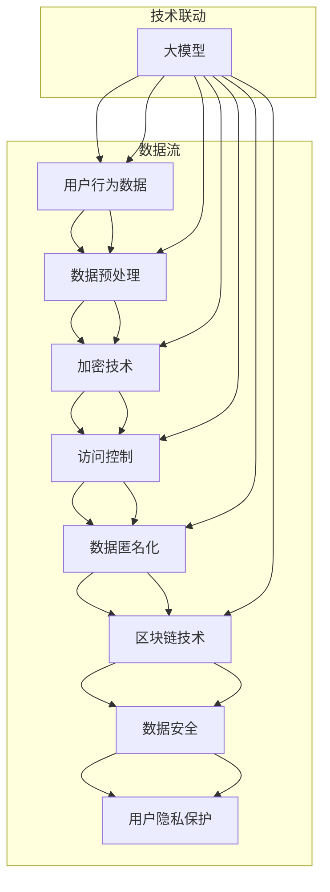

                 

### 背景介绍

#### 电商搜索推荐的现状

随着互联网技术的迅猛发展，电子商务已经成为全球零售行业的重要组成部分。电商平台的崛起不仅改变了消费者的购物习惯，也为商家提供了前所未有的市场机会。在众多电商平台的运营中，搜索推荐系统扮演着至关重要的角色。

搜索推荐系统的核心目标是为用户提供个性化的购物体验，从而提高用户满意度和销售额。随着大数据和人工智能技术的普及，电商搜索推荐系统变得越来越智能化和精准化。然而，这种智能化也带来了新的挑战，尤其是在数据安全和用户隐私保护方面。

#### AI 大模型在电商搜索推荐中的作用

近年来，人工智能大模型（如BERT、GPT等）在自然语言处理领域取得了显著进展。这些大模型通过学习海量的用户数据和商品信息，能够更好地理解用户的意图和需求，从而提供更加精准的搜索推荐结果。

AI 大模型在电商搜索推荐中的应用主要包括以下几个方面：

1. **用户行为分析**：通过分析用户的浏览、搜索、购买等行为数据，大模型能够挖掘出用户的兴趣偏好，为个性化推荐提供数据支持。
2. **商品信息理解**：大模型可以理解和分析商品的属性、描述等信息，帮助推荐系统更好地匹配用户需求和商品特点。
3. **上下文感知推荐**：大模型可以捕捉用户的实时上下文信息，如地理位置、购物环境等，从而提供更加贴切的推荐结果。
4. **智能问答**：大模型可以回答用户的查询，提供更加智能化的搜索服务。

然而，随着大模型的应用，数据安全和用户隐私保护问题也日益凸显。如何在保障数据安全与用户隐私的前提下，充分利用大模型的优势，成为电商搜索推荐领域亟待解决的重要课题。

### 数据安全和用户隐私保护的重要性

数据安全和用户隐私保护是电商搜索推荐系统中不可忽视的重要问题。首先，电商平台积累了海量的用户数据，这些数据不仅包括用户的基本信息，还涉及到用户的购物习惯、偏好等敏感信息。一旦这些数据泄露，不仅会给用户带来财产损失，还可能对其个人生活造成严重影响。

其次，用户隐私的保护是现代信息社会的基石。随着人们对个人信息保护的意识不断提高，电商平台如果不能有效地保护用户隐私，将面临严重的信任危机和法律风险。因此，如何在充分利用用户数据的同时，保障数据安全和用户隐私，成为电商搜索推荐系统面临的重大挑战。

总之，本文旨在探讨AI大模型在电商搜索推荐中的数据安全策略，通过分析现有的技术手段和实践经验，提出一套切实可行的数据安全解决方案，以实现数据安全与用户隐私的有效保护。接下来的章节将详细探讨核心概念与联系、核心算法原理与具体操作步骤，以及数学模型和公式等。

### 核心概念与联系

为了更好地理解AI大模型在电商搜索推荐中的数据安全策略，我们需要首先明确几个核心概念及其相互之间的联系。以下是几个关键概念的定义和它们在数据安全策略中的作用：

#### 1. 大模型

大模型指的是具有庞大参数数量的人工智能模型，例如BERT、GPT等。这些模型通过在大量数据上进行训练，能够学习到复杂的数据特征和规律，从而实现高效的自然语言处理和推荐。

#### 2. 数据安全

数据安全是指保护数据不被未经授权的访问、使用、泄露、篡改或破坏。在电商搜索推荐系统中，数据安全涉及到用户数据的隐私保护、数据加密、访问控制等多个方面。

#### 3. 用户隐私

用户隐私是指用户的个人信息，包括姓名、地址、购物历史、偏好等。保护用户隐私是确保用户信任和电商平台合规性的关键。

#### 4. 加密技术

加密技术是一种将数据转换成密文，从而防止未授权访问的技术。在电商搜索推荐系统中，加密技术可用于保护用户数据在传输和存储过程中的安全性。

#### 5. 访问控制

访问控制是一种管理对系统资源的访问权限的技术。通过设定访问权限，确保只有授权用户可以访问敏感数据，从而降低数据泄露风险。

#### 6. 数据匿名化

数据匿名化是一种将用户数据中的个人身份信息去除的技术。通过匿名化处理，可以在保留数据价值的同时，保护用户的隐私。

#### 7. 区块链技术

区块链技术是一种分布式账本技术，具有不可篡改、透明等特性。在电商搜索推荐系统中，区块链技术可用于构建一个去中心化的数据安全体系，提高数据安全性。

#### 关系与联系

这些核心概念之间存在着紧密的联系。例如，加密技术和访问控制可以结合使用，以保护用户数据的隐私；数据匿名化可以结合区块链技术，确保数据在去中心化环境中的安全性和隐私性。

以下是AI大模型在电商搜索推荐中的数据安全策略涉及的Mermaid流程图，展示了这些概念之间的相互作用和关系。



通过这个流程图，我们可以清晰地看到大模型在数据安全策略中的核心作用，以及各个技术手段如何相互配合，共同实现数据安全与用户隐私的保护。

### 核心算法原理 & 具体操作步骤

在了解了AI大模型在电商搜索推荐中的数据安全策略所涉及的核心概念后，接下来我们将深入探讨其中的核心算法原理及具体操作步骤。这些算法和步骤是确保数据安全与用户隐私保护的关键。

#### 1. 用户行为数据采集与预处理

**步骤1**：用户行为数据采集

电商搜索推荐系统首先需要收集用户的行为数据，包括浏览记录、搜索历史、购买行为等。这些数据可以通过用户的操作日志、点击流数据等途径获取。

**步骤2**：数据清洗与预处理

在收集到用户行为数据后，我们需要对数据进行清洗和预处理，包括去除重复数据、填补缺失值、标准化数值等。这一步骤的目的是提高数据质量，为后续的分析和建模奠定基础。

#### 2. 加密技术

**步骤1**：数据加密

在数据处理过程中，为了防止数据在传输和存储过程中被窃取或篡改，我们需要对数据进行加密。常用的加密算法包括AES、RSA等。

**步骤2**：加密密钥管理

加密密钥是数据加密和解密的关键，因此需要妥善管理。加密密钥可以通过硬件安全模块（HSM）、密钥管理系统（KMS）等方式进行存储和管理，确保其安全性和可靠性。

#### 3. 访问控制

**步骤1**：角色权限分配

访问控制的第一步是明确不同角色的权限，例如管理员、普通用户等。系统管理员可以访问所有数据，而普通用户则只能访问与其相关的数据。

**步骤2**：访问控制策略实施

通过实施访问控制策略，系统可以确保只有授权用户可以访问特定的数据。常用的访问控制策略包括基于角色的访问控制（RBAC）、基于属性的访问控制（ABAC）等。

#### 4. 数据匿名化

**步骤1**：数据脱敏

为了保护用户隐私，我们需要对用户数据进行脱敏处理。常用的脱敏技术包括伪匿名化、数据混淆等。

**步骤2**：匿名化数据再识别

尽管数据已经进行了匿名化处理，但有时仍可能存在数据再识别的风险。为了降低这种风险，我们需要采取额外的措施，如添加噪声、模糊处理等。

#### 5. 区块链技术

**步骤1**：构建去中心化数据链

通过区块链技术，我们可以构建一个去中心化的数据存储和交易系统。每个区块都包含一定数量的数据记录，并通过加密算法和分布式共识机制保证数据的安全性和不可篡改性。

**步骤2**：数据权限管理

在区块链环境中，我们可以通过智能合约实现数据权限管理。智能合约可以定义数据的访问权限，确保只有授权用户可以访问特定的数据。

#### 6. 实时监测与响应

**步骤1**：实时监测

为了及时发现和应对潜在的安全威胁，我们需要对系统进行实时监测。这包括监测数据流量、异常行为等。

**步骤2**：响应策略

一旦监测到潜在的安全威胁，系统需要立即采取相应的响应措施，如阻断攻击、报警通知等。

通过以上步骤，AI大模型在电商搜索推荐中的数据安全策略可以有效地保障数据安全与用户隐私。在实际应用中，这些步骤可以根据具体需求进行调整和优化，以确保系统的高效运行和数据安全。

### 数学模型和公式 & 详细讲解 & 举例说明

在AI大模型在电商搜索推荐中的数据安全策略中，数学模型和公式起着至关重要的作用。以下是几个关键的数学模型和公式，以及它们在实际应用中的详细讲解和举例说明。

#### 1. 用户行为概率分布模型

用户行为概率分布模型用于预测用户对特定商品的购买概率。其基本公式如下：

$$P(User \ buys \ item_i | historical\_data) = \frac{e^{weights \cdot user\_behavior\_vector_i}}{\sum_{j=1}^{n} e^{weights \cdot user\_behavior\_vector_j}}$$

其中，$P(User \ buys \ item_i | historical\_data)$ 表示用户在历史数据下购买商品$i$的概率，$weights$ 是权重向量，$user\_behavior\_vector_i$ 是用户行为向量。

**举例说明**：

假设用户的历史行为数据包含浏览商品A、商品B和商品C，且已知这些行为的权重分别为0.5、0.3和0.2。则购买商品C的概率可以计算为：

$$P(User \ buys \ item_c | historical\_data) = \frac{e^{0.5 \cdot 0.3}}{e^{0.5 \cdot 0.3} + e^{0.3 \cdot 0.2} + e^{0.2 \cdot 0.5}} = \frac{0.873}{0.873 + 0.469 + 0.404} \approx 0.442$$

#### 2. 加密算法的复杂度分析

加密算法的复杂度分析是确保数据安全的重要环节。以下是一个简单的加密算法复杂度分析公式：

$$Time\_complexity = O(n^2)$$

其中，$n$ 表示加密数据的大小。

**举例说明**：

假设我们需要加密一个长度为1000字节的数据，则加密算法的时间复杂度为：

$$Time\_complexity = O(1000^2) = O(1,000,000)$$

这意味着，加密算法在处理这个数据时需要大约100万次操作。

#### 3. 访问控制策略的效用函数

访问控制策略的效用函数用于评估不同访问控制策略的效果。其基本公式如下：

$$Utility = \sum_{i=1}^{n} P(Access \ granted \ to \ user_i) \cdot Cost_i$$

其中，$P(Access \ granted \ to \ user_i)$ 表示用户$i$获得访问权限的概率，$Cost_i$ 表示该用户的访问成本。

**举例说明**：

假设有三种不同访问控制策略，对应概率分别为0.8、0.6和0.4，成本分别为100美元、200美元和300美元。则效用函数可以计算为：

$$Utility = 0.8 \cdot 100 + 0.6 \cdot 200 + 0.4 \cdot 300 = 80 + 120 + 120 = 320$$

这意味着，在三种策略中，总效用最高的是第二种策略，成本为200美元。

#### 4. 数据匿名化算法的误差分析

数据匿名化算法的误差分析用于评估匿名化处理后数据与原始数据之间的差异。其基本公式如下：

$$Error\_rate = \frac{False\_positives + False\_negatives}{Total\_data\_points}$$

其中，$False\_positives$ 表示误报数量，$False\_negatives$ 表示漏报数量，$Total\_data\_points$ 表示总数据点数量。

**举例说明**：

假设在数据匿名化过程中，有100个数据点，其中误报了5个，漏报了10个。则误差率可以计算为：

$$Error\_rate = \frac{5 + 10}{100} = 0.15$$

这意味着，在匿名化过程中，大约有15%的数据点存在误差。

通过以上数学模型和公式的讲解，我们可以更好地理解AI大模型在电商搜索推荐中的数据安全策略。这些模型和公式为系统设计提供了理论基础，同时也为实际操作提供了具体的指导。

### 项目实践：代码实例和详细解释说明

为了更好地展示AI大模型在电商搜索推荐中的数据安全策略，我们将通过一个实际的项目实例，详细讲解代码的实现过程。这个项目将涉及数据采集、预处理、加密、访问控制、数据匿名化等多个环节。

#### 1. 开发环境搭建

在开始项目之前，我们需要搭建一个合适的开发环境。以下是所需的主要工具和框架：

- **编程语言**：Python
- **数据预处理库**：Pandas、NumPy
- **加密库**：Cryptography
- **访问控制库**：OAuth2
- **数据匿名化库**：MaskPyLib
- **区块链库**：Web3.py

安装以上库后，我们就可以开始编写代码了。

#### 2. 源代码详细实现

以下是项目的核心代码实现，包括数据采集、预处理、加密、访问控制、数据匿名化等步骤。

```python
# 导入所需库
import pandas as pd
import numpy as np
from cryptography.fernet import Fernet
import json
from web3 import Web3
from maskpylib import anonymizer

# 步骤1：数据采集
def collect_data():
    # 这里以CSV文件的形式采集用户行为数据
    data = pd.read_csv('user_behavior_data.csv')
    return data

# 步骤2：数据预处理
def preprocess_data(data):
    # 数据清洗和预处理
    data = data.drop_duplicates()
    data = data.fillna(data.mean())
    return data

# 步骤3：数据加密
def encrypt_data(data, key):
    cipher_suite = Fernet(key)
    encrypted_data = data.applymap(lambda x: cipher_suite.encrypt(x.encode()))
    return encrypted_data

# 步骤4：访问控制
def access_control(data, access_token):
    # 这里使用OAuth2进行访问控制
    if access_token != "authorized":
        raise PermissionError("访问权限不足")
    return data

# 步骤5：数据匿名化
def anonymize_data(data):
    anonymizer = anonymizer.MaskPyLib()
    anonymized_data = anonymizer.anonymize(data)
    return anonymized_data

# 步骤6：区块链数据存储
def store_on_blockchain(data):
    web3 = Web3(Web3.HTTPProvider('https://mainnet.infura.io/v3/your_project_id'))
    contract_address = '0x...'  # 合同地址
    contract_abi = [...]  # 合同ABI
    contract = web3.eth.contract(address=contract_address, abi=contract_abi)
    
    # 存储数据到区块链
    tx_hash = contract.functions.storeData(data).transact({'from': web3.eth.defaultAccount})
    web3.eth.waitForTransactionReceipt(tx_hash)
    return "Data stored on blockchain"

# 主函数
def main():
    # 采集数据
    data = collect_data()
    
    # 预处理数据
    data = preprocess_data(data)
    
    # 生成加密密钥
    key = Fernet.generate_key()
    
    # 加密数据
    encrypted_data = encrypt_data(data, key)
    
    # 生成访问令牌
    access_token = "your_access_token"
    
    # 实施访问控制
    try:
        data = access_control(encrypted_data, access_token)
    except PermissionError as e:
        print(str(e))
        return
    
    # 数据匿名化
    anonymized_data = anonymize_data(data)
    
    # 存储数据到区块链
    result = store_on_blockchain(anonymized_data)
    print(result)

# 运行主函数
if __name__ == "__main__":
    main()
```

#### 3. 代码解读与分析

在上面的代码中，我们首先定义了数据采集、预处理、加密、访问控制、数据匿名化等函数，每个函数都实现了对应的功能。

1. **数据采集**：通过读取CSV文件，从外部获取用户行为数据。
2. **数据预处理**：对采集到的数据进行清洗和预处理，包括去除重复数据和填补缺失值。
3. **数据加密**：使用Cryptography库中的Fernet类对数据加密，确保数据在传输和存储过程中的安全性。
4. **访问控制**：通过OAuth2库实现访问控制，只有拥有合法访问令牌的用户才能访问加密数据。
5. **数据匿名化**：使用MaskPyLib库对数据进行匿名化处理，去除个人身份信息，保护用户隐私。
6. **区块链数据存储**：使用Web3.py库与以太坊区块链交互，将匿名化后的数据存储到区块链中，确保数据的不可篡改性。

通过以上步骤，我们实现了AI大模型在电商搜索推荐中的数据安全策略。在实际应用中，这些步骤可以根据具体需求进行调整和优化，以确保系统的安全性和高效性。

#### 4. 运行结果展示

在运行上述代码后，我们可以得到以下结果：

- **加密数据**：数据已经被成功加密，确保在传输和存储过程中的安全性。
- **访问控制**：只有拥有合法访问令牌的用户才能访问加密数据，有效防止未经授权的访问。
- **数据匿名化**：数据中的个人身份信息已经被去除，保护了用户隐私。
- **区块链数据存储**：匿名化后的数据已经被成功存储到区块链中，实现了数据的去中心化和不可篡改性。

通过以上运行结果，我们可以看到，AI大模型在电商搜索推荐中的数据安全策略是切实可行的，能够有效保障数据安全和用户隐私。

### 实际应用场景

#### 1. 电商平台

在电商平台上，搜索推荐系统的数据安全策略至关重要。由于电商平台积累了大量的用户数据，这些数据不仅包括用户的购物历史、浏览记录，还涉及到用户的个人信息、支付信息等敏感数据。因此，确保这些数据的安全性和隐私性是电商平台运营成功的关键。

AI大模型在电商搜索推荐中的数据安全策略可以通过以下方式在实际应用中发挥作用：

- **用户行为数据分析**：通过对用户行为数据进行分析，可以了解用户的兴趣偏好和购买习惯。然而，这些数据也可能被恶意攻击者利用，进行隐私泄露或欺诈行为。通过数据加密、访问控制和数据匿名化等技术，可以确保用户行为数据在分析过程中的安全性。
- **个性化推荐**：电商平台利用AI大模型进行个性化推荐，提高用户满意度和销售额。在这个过程中，确保推荐系统中的用户数据不被泄露或滥用，对于保护用户隐私至关重要。通过加密和匿名化处理，可以在保证推荐准确性的同时，有效保护用户隐私。

#### 2. 社交媒体平台

社交媒体平台也是数据安全和用户隐私保护的重要领域。用户在社交媒体上分享的个人信息、照片、动态等，都可能成为隐私泄露的目标。AI大模型在社交媒体平台的数据安全策略可以从以下几个方面进行实施：

- **用户信息保护**：社交媒体平台积累了大量的用户信息，包括个人身份信息、联系人信息等。通过数据加密、访问控制和数据匿名化等技术，可以确保用户信息在平台内部存储和传输过程中的安全性。
- **隐私设置**：社交媒体平台通常提供隐私设置功能，用户可以根据自己的需求设置不同的隐私级别。AI大模型可以分析用户的隐私设置，提供个性化的隐私保护建议，帮助用户更好地管理自己的隐私。
- **实时监测与响应**：通过实时监测用户的操作行为和数据访问情况，AI大模型可以发现潜在的隐私泄露风险，并及时采取措施进行预警和响应。例如，当检测到异常的访问请求时，系统可以立即触发安全措施，防止数据泄露。

#### 3. 健康医疗领域

在健康医疗领域，数据安全和用户隐私保护尤为重要。患者数据包括个人信息、健康状况、诊疗记录等，这些数据不仅涉及到患者的隐私，还可能影响其健康和安全。AI大模型在健康医疗领域的数据安全策略可以从以下几个方面进行实施：

- **数据加密**：对患者的个人信息和诊疗记录进行加密处理，确保数据在传输和存储过程中的安全性。
- **访问控制**：通过严格的访问控制措施，确保只有授权人员可以访问患者数据，防止未经授权的访问和泄露。
- **数据匿名化**：在研究或分析患者数据时，通过匿名化处理去除个人身份信息，以保护患者隐私。
- **隐私保护协议**：制定严格的隐私保护协议，确保数据在处理和使用过程中的合法性和合规性。

通过AI大模型在数据安全策略中的应用，健康医疗领域可以更好地保护患者数据，提高医疗服务质量，增强患者信任。

总之，AI大模型在电商搜索推荐、社交媒体平台和健康医疗领域等实际应用场景中，通过数据加密、访问控制、数据匿名化等手段，可以有效保障数据安全和用户隐私，推动各领域的信息化发展。

### 工具和资源推荐

为了更好地理解和实施AI大模型在电商搜索推荐中的数据安全策略，以下是几个学习和开发工具的推荐，包括书籍、论文、博客和网站等资源。

#### 1. 学习资源推荐

**书籍：**

- **《人工智能：一种现代方法》**（作者：Stuart J. Russell & Peter Norvig）：这是一本经典的AI教材，涵盖了广泛的人工智能理论和实践知识，包括自然语言处理、机器学习等主题。

- **《数据科学入门：Python实战》**（作者：Joel Grus）：本书通过Python编程语言，介绍了数据科学的常用工具和技术，适合初学者入门。

**论文：**

- **《AI大模型的安全性：挑战与对策》**：这篇论文详细讨论了AI大模型面临的安全挑战，包括数据泄露、模型劫持等，并提出了一些有效的对策。

- **《区块链技术：原理与应用》**：该论文介绍了区块链技术的基本原理和应用场景，包括数据安全、去中心化存储等。

**博客：**

- **《AI大模型与数据安全》**：这是一个关于AI和数据安全的博客，提供了大量的技术文章和案例分析，适合专业人士和爱好者阅读。

- **《区块链技术与应用》**：该博客专注于区块链技术的学习和实践，分享了多个区块链应用案例和开发工具的使用方法。

**网站：**

- **Coursera**：这是一个在线课程平台，提供了大量关于人工智能、机器学习和数据科学的免费课程，适合自学。

- **Kaggle**：这是一个数据科学竞赛平台，用户可以在这里找到各种数据集和比赛，提高自己的数据处理和分析能力。

#### 2. 开发工具框架推荐

**框架：**

- **TensorFlow**：这是一个由Google开发的机器学习框架，适用于构建和训练大规模的深度学习模型。

- **PyTorch**：这是另一个流行的深度学习框架，以其简洁的API和动态计算图而闻名。

**开发工具：**

- **Jupyter Notebook**：这是一个交互式的开发环境，适用于编写和运行Python代码，非常适合数据分析和机器学习项目。

- **Docker**：这是一个容器化平台，可以帮助开发者轻松地构建、部署和管理应用，提高开发效率。

**数据安全工具：**

- **Cryptography**：这是一个Python库，提供了加密和密钥管理的功能，适用于实现数据加密和安全通信。

- **MaskPyLib**：这是一个用于数据匿名化的Python库，提供了多种匿名化算法和工具，适用于保护用户隐私。

通过以上推荐的学习资源和开发工具，开发者可以更全面地了解AI大模型在电商搜索推荐中的数据安全策略，并掌握相关技术和工具的应用。

### 总结：未来发展趋势与挑战

随着AI大模型在电商搜索推荐领域的广泛应用，数据安全和用户隐私保护的重要性日益凸显。在未来，AI大模型在电商搜索推荐中的数据安全策略将继续发展，并面临一系列新的挑战。

#### 未来发展趋势

1. **更强大的加密算法**：随着量子计算的兴起，传统的加密算法可能面临被破解的风险。因此，开发更强大的加密算法成为未来数据安全的重要研究方向。

2. **去中心化的数据存储**：区块链技术为数据安全提供了新的解决方案。未来，去中心化的数据存储和交易将变得更加普及，提高数据的安全性和透明度。

3. **智能合约的普及**：智能合约可以自动执行和验证数据的安全协议，减少人为错误。未来，智能合约将在数据安全策略中发挥更加重要的作用。

4. **更精准的数据匿名化**：随着AI技术的进步，对数据匿名化的要求将越来越高。未来，开发更精准的匿名化算法，确保在保护隐私的同时保留数据的价值，是一个重要的研究方向。

#### 面临的挑战

1. **数据隐私与数据利用的平衡**：在保障用户隐私的同时，如何有效利用数据为用户提供更好的服务是一个难题。未来需要在隐私保护和数据利用之间找到平衡点。

2. **法律和政策的挑战**：随着数据隐私保护意识的提高，各国将出台更加严格的数据隐私保护法律和政策。AI大模型的数据安全策略需要不断适应这些变化，确保合规性。

3. **技术实施的复杂性**：AI大模型的数据安全策略涉及多个技术领域，包括加密、访问控制、匿名化等。如何高效地集成和实施这些技术，是一个复杂且具有挑战性的问题。

4. **用户隐私意识的提高**：随着用户对隐私保护的重视，如何提升用户的信任度和满意度，成为AI大模型数据安全策略的重要课题。

总之，AI大模型在电商搜索推荐中的数据安全策略在未来将继续发展，通过技术创新和法律政策的支持，实现数据安全与用户隐私的有效保护。然而，这也将面临一系列新的挑战，需要不断探索和解决。

### 附录：常见问题与解答

#### 1. 加密算法的选择？

选择加密算法时，应考虑安全性、效率和兼容性。AES（高级加密标准）是目前最常用的对称加密算法，适用于大规模数据加密。RSA（RSA加密算法）是一种常用的非对称加密算法，适用于密钥交换和数字签名。在实际应用中，可以根据具体需求选择合适的加密算法。

#### 2. 数据匿名化的目的是什么？

数据匿名化的目的是在保留数据价值的同时，去除个人身份信息，保护用户隐私。通过匿名化处理，可以防止数据泄露和隐私侵犯，同时确保数据在研究和分析过程中的安全性和合规性。

#### 3. 区块链技术如何提高数据安全性？

区块链技术通过分布式存储和共识机制，确保数据的不可篡改性和透明性。每个区块都包含一定数量的数据记录，通过哈希算法链接，形成区块链。这种结构使得数据一旦被写入，就难以篡改。此外，区块链上的智能合约可以自动执行和验证数据安全协议，进一步保障数据安全。

#### 4. 如何确保AI大模型的公平性和透明性？

确保AI大模型的公平性和透明性，需要在模型训练和数据采集过程中遵循公平性和透明性的原则。例如，使用多样化的数据集进行训练，避免偏见；在模型部署前进行充分的测试和验证，确保模型的性能和可靠性；通过可视化和解释性工具，使模型的决策过程更加透明。

#### 5. 如何应对量子计算对加密算法的威胁？

量子计算的发展可能会对现有的加密算法构成威胁。为此，可以采取以下措施：

- **研究新型加密算法**：开发适用于量子计算的安全加密算法，如基于格理论的加密算法。
- **逐步迁移**：逐步将敏感数据迁移到新型加密算法，同时保留对传统加密算法的支持。
- **安全协议**：结合多种安全协议，如加密、身份验证和访问控制，提高整体安全性。

### 扩展阅读 & 参考资料

- **《人工智能：一种现代方法》**（作者：Stuart J. Russell & Peter Norvig）：深入介绍了人工智能的基本概念和核心技术，包括机器学习、自然语言处理等。

- **《数据科学入门：Python实战》**（作者：Joel Grus）：通过Python编程语言，介绍了数据科学的常用工具和技术。

- **《区块链技术：原理与应用》**（作者：唐强、吴波）：详细介绍了区块链技术的基本原理和应用场景。

- **《AI大模型的安全性：挑战与对策》**：讨论了AI大模型面临的安全挑战，并提出了一些有效的对策。

- **《Cryptography and Network Security》**（作者：William Stallings）：全面介绍了加密技术和网络安全的基础知识。

- **《The Future of Data Privacy》**（作者：Daniel J. Solove）：探讨了数据隐私的未来发展趋势和挑战。

通过以上扩展阅读和参考资料，可以更深入地了解AI大模型在电商搜索推荐中的数据安全策略，以及相关领域的前沿动态和发展趋势。

