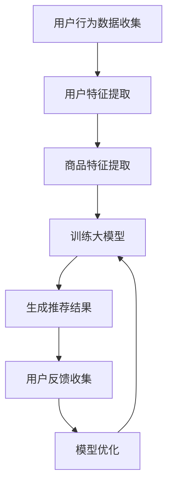

                 

### 背景介绍

随着互联网的迅猛发展，电子商务行业已成为全球经济发展的重要驱动力。电商平台通过用户行为数据、商品信息等综合分析，实现了对用户需求的精准捕捉和个性化推荐。然而，在用户数量和商品规模不断扩大的背景下，传统的推荐算法面临着诸多挑战，如信息过载、推荐多样性不足、个性化不彻底等问题。这些问题严重影响了用户的购物体验，降低了用户的满意度和粘性。

为了解决上述问题，近年来人工智能（AI）技术，特别是大模型（Large-scale Model）在电商搜索推荐中的应用取得了显著进展。大模型，如深度学习模型、自然语言处理模型等，具有强大的数据处理和模式识别能力，能够从海量数据中提取用户特征和商品特征，从而实现更加精准和个性化的推荐。然而，大模型的引入也带来了一系列新的挑战，如模型训练成本高昂、计算资源需求大、模型解释性不足等。

本文旨在探讨如何利用AI大模型优化电商搜索推荐中的用户体验。我们将从用户需求出发，详细分析大模型在电商搜索推荐中的应用原理、核心算法、数学模型以及项目实践，最终提出未来发展的趋势和面临的挑战。通过本文的阅读，读者将深入了解大模型在电商搜索推荐中的应用价值，以及如何通过技术手段提升用户满意度。

首先，我们需要明确几个核心概念，这些概念是理解本文内容的基础。大模型是什么？它在电商搜索推荐中如何发挥作用？传统推荐算法与AI大模型有哪些区别？在接下来的内容中，我们将一一解答这些问题。

### 核心概念与联系

#### 1. 大模型的概念

大模型（Large-scale Model），通常指的是具有大规模参数和复杂结构的机器学习模型。它们能够处理海量的数据，通过深度学习、自然语言处理、强化学习等技术，从数据中提取丰富的特征和模式，实现高度自动化的决策和预测。典型的例子包括深度神经网络（DNN）、变换器模型（Transformer）、生成对抗网络（GAN）等。

大模型的特点包括：

- **参数规模巨大**：大模型的参数数量通常在百万、亿甚至千亿级别，这使其具备强大的数据拟合能力。
- **结构复杂**：大模型通常包含多层网络结构，能够通过逐层抽象和表示，实现高维数据的降维和特征提取。
- **计算资源需求大**：大模型训练和推理需要大量的计算资源和存储空间，通常需要使用高性能计算硬件，如GPU和TPU。

#### 2. 电商搜索推荐中的用户需求

在电商搜索推荐系统中，用户需求是驱动系统设计和优化的核心。用户需求主要包括以下几个方面：

- **个性化**：用户希望获取到符合自己兴趣和需求的商品推荐，而不仅仅是热门或流行商品。
- **多样性**：用户希望在推荐结果中看到不同的商品，避免信息过载和单一化的推荐。
- **准确性**：推荐结果需要尽可能准确地匹配用户的真实需求，减少误推荐和低质量推荐。
- **实时性**：推荐结果需要快速生成，以满足用户快速决策的需求。

#### 3. 传统推荐算法与AI大模型

传统推荐算法，如基于内容的推荐（Content-based Filtering）和协同过滤（Collaborative Filtering），主要依赖于用户行为数据和商品特征数据进行推荐。这些算法虽然在一定程度上能够实现个性化推荐，但面临着以下局限：

- **数据稀疏性**：用户行为数据往往稀疏，特别是在新用户和冷启动场景下，难以准确预测用户兴趣。
- **推荐多样性不足**：传统算法容易陷入“热门商品”或“相似用户”的推荐陷阱，导致推荐结果的多样性不足。
- **模型解释性差**：传统算法的黑盒性质使其难以解释推荐结果，降低了用户的信任度和满意度。

相比之下，AI大模型具有以下优势：

- **处理大规模数据**：大模型能够处理海量的用户行为数据和商品信息，从数据中提取丰富的特征和模式。
- **提高推荐准确性**：通过深度学习和自然语言处理等技术，大模型能够实现更加精准和个性化的推荐。
- **增强推荐多样性**：大模型能够从不同的角度和维度提取用户特征和商品特征，实现多样化的推荐结果。
- **提高模型解释性**：一些大模型（如基于Transformer的模型）具有较好的解释性，能够为推荐结果提供合理的解释。

#### 4. Mermaid 流程图

为了更清晰地展示大模型在电商搜索推荐中的应用流程，我们使用Mermaid流程图来描述。



在这个流程图中，用户行为数据和商品信息是输入，通过用户特征提取和商品特征提取，大模型进行训练，生成推荐结果。用户反馈进一步用于模型优化，形成一个闭环系统，不断提高推荐效果。

### 核心算法原理 & 具体操作步骤

在电商搜索推荐系统中，AI大模型的核心算法通常包括深度学习、自然语言处理和生成对抗网络等技术。以下是这些算法的原理及其在电商搜索推荐中的具体操作步骤。

#### 1. 深度学习算法

深度学习（Deep Learning）是一种基于人工神经网络的机器学习方法，通过多层网络结构，实现高维数据的降维和特征提取。在电商搜索推荐中，深度学习算法主要应用于用户特征提取、商品特征提取和推荐模型训练。

**具体操作步骤如下**：

1. **数据预处理**：收集用户行为数据（如点击、购买、收藏等）和商品信息（如分类、标签、价格等），并进行数据清洗和格式化。
2. **用户特征提取**：利用深度神经网络（如卷积神经网络（CNN）或循环神经网络（RNN））对用户行为数据进行分析，提取用户的兴趣偏好和购买习惯。
3. **商品特征提取**：同样利用深度神经网络，对商品信息进行编码和特征提取，生成商品的特征向量。
4. **推荐模型训练**：使用提取的用户特征和商品特征，训练深度学习模型（如推荐矩阵分解、序列模型等），实现用户和商品的匹配。
5. **生成推荐结果**：根据用户特征和商品特征，通过深度学习模型生成推荐结果，并根据用户反馈进行优化。

#### 2. 自然语言处理算法

自然语言处理（Natural Language Processing，NLP）是一种用于理解和生成人类语言的人工智能技术。在电商搜索推荐中，NLP算法可以用于处理用户查询和商品描述，实现语义级别的推荐。

**具体操作步骤如下**：

1. **用户查询处理**：使用词向量（如Word2Vec、BERT等）对用户查询进行编码，提取查询的语义特征。
2. **商品描述处理**：同样使用词向量技术，对商品描述进行编码，提取商品的语义特征。
3. **文本匹配**：通过文本匹配算法（如BERT匹配、语义相似度计算等），比较用户查询和商品描述的语义相似度。
4. **生成推荐结果**：根据文本匹配结果，生成推荐结果，并确保推荐结果的多样性和准确性。

#### 3. 生成对抗网络算法

生成对抗网络（Generative Adversarial Network，GAN）是一种由生成器和判别器组成的对抗性模型，通过生成和判别之间的博弈，实现数据的生成和分布学习。在电商搜索推荐中，GAN算法可以用于生成新的商品推荐，提高推荐的多样性和创新性。

**具体操作步骤如下**：

1. **数据预处理**：收集用户行为数据和商品信息，进行数据清洗和格式化。
2. **生成器训练**：训练生成器，使其能够生成符合用户兴趣和需求的新商品。
3. **判别器训练**：训练判别器，使其能够区分真实商品和生成商品。
4. **生成推荐结果**：利用生成器生成的新商品，结合用户特征和商品特征，生成推荐结果，并通过用户反馈进行优化。

### 数学模型和公式

在电商搜索推荐中，AI大模型的数学模型主要包括用户特征提取模型、商品特征提取模型和推荐模型。以下是这些模型的详细讲解和举例说明。

#### 1. 用户特征提取模型

用户特征提取模型通常采用深度学习算法，如卷积神经网络（CNN）或循环神经网络（RNN）。以下是一个简化的用户特征提取模型：

**数学模型**：

$$
h = f(W_1 \cdot x + b_1)
$$

其中，$h$表示用户特征向量，$x$表示用户行为数据，$W_1$表示权重矩阵，$b_1$表示偏置向量，$f$表示激活函数（如ReLU函数）。

**举例说明**：

假设用户行为数据为点击历史（$x$），我们将这些数据输入到卷积神经网络（CNN）中，通过卷积、池化等操作，提取用户特征（$h$）。例如，一个简单的CNN模型可以表示为：

$$
h = \text{ReLU}(\text{Conv}_1(\text{MaxPool}_1(x)) + b_1)
$$

其中，$\text{Conv}_1$表示卷积层，$\text{MaxPool}_1$表示池化层，$b_1$表示偏置向量。

#### 2. 商品特征提取模型

商品特征提取模型同样采用深度学习算法，如卷积神经网络（CNN）或循环神经网络（RNN）。以下是一个简化的商品特征提取模型：

**数学模型**：

$$
h = f(W_2 \cdot x + b_2)
$$

其中，$h$表示商品特征向量，$x$表示商品信息，$W_2$表示权重矩阵，$b_2$表示偏置向量。

**举例说明**：

假设商品信息为商品描述（$x$），我们将这些数据输入到循环神经网络（RNN）中，通过循环、编码等操作，提取商品特征（$h$）。例如，一个简单的RNN模型可以表示为：

$$
h = \text{ReLU}(\text{RNN}(x) + b_2)
$$

其中，$\text{RNN}$表示循环神经网络层，$b_2$表示偏置向量。

#### 3. 推荐模型

推荐模型通常采用矩阵分解（Matrix Factorization）或序列模型（Sequence Model）等技术。以下是一个简化的推荐模型：

**数学模型**：

$$
r = f(W_3 \cdot [u, v] + b_3)
$$

其中，$r$表示推荐结果，$u$和$v$分别表示用户特征向量和商品特征向量，$W_3$表示权重矩阵，$b_3$表示偏置向量。

**举例说明**：

假设用户特征向量为$u$，商品特征向量为$v$，我们将这两个向量输入到推荐模型中，通过矩阵乘法和激活函数，生成推荐结果$r$。例如，一个简单的矩阵分解模型可以表示为：

$$
r = \text{ReLU}(\text{MatMul}(u, v) + b_3)
$$

其中，$\text{MatMul}$表示矩阵乘法，$b_3$表示偏置向量。

通过上述数学模型，我们可以实现用户和商品的匹配，生成个性化的推荐结果。

### 项目实践：代码实例和详细解释说明

在本节中，我们将通过一个实际的代码实例，展示如何使用AI大模型在电商搜索推荐中进行用户特征提取、商品特征提取和推荐模型训练。以下是一个基于Python和TensorFlow的代码实例。

#### 1. 开发环境搭建

首先，我们需要搭建一个适合深度学习开发的Python环境。以下是具体的步骤：

- 安装Python 3.7及以上版本
- 安装TensorFlow 2.0及以上版本
- 安装其他必要的库，如NumPy、Pandas、Matplotlib等

```bash
pip install tensorflow numpy pandas matplotlib
```

#### 2. 源代码详细实现

以下是代码的详细实现，包括用户特征提取、商品特征提取和推荐模型训练。

```python
import tensorflow as tf
from tensorflow.keras.layers import Embedding, LSTM, Dense
from tensorflow.keras.models import Model

# 用户特征提取
def user_embedding_model(input_shape):
    inputs = tf.keras.Input(shape=input_shape)
    x = Embedding(input_dim=10000, output_dim=128)(inputs)
    x = LSTM(128)(x)
    outputs = Dense(64, activation='relu')(x)
    model = Model(inputs=inputs, outputs=outputs)
    return model

# 商品特征提取
def item_embedding_model(input_shape):
    inputs = tf.keras.Input(shape=input_shape)
    x = Embedding(input_dim=10000, output_dim=128)(inputs)
    x = LSTM(128)(x)
    outputs = Dense(64, activation='relu')(x)
    model = Model(inputs=inputs, outputs=outputs)
    return model

# 推荐模型
def recommendation_model(user_model, item_model):
    user_input = tf.keras.Input(shape=(1,))
    item_input = tf.keras.Input(shape=(1,))
    
    user_embedding = user_model(user_input)
    item_embedding = item_model(item_input)
    
    merged = tf.keras.layers.concatenate([user_embedding, item_embedding])
    merged = Dense(64, activation='relu')(merged)
    outputs = Dense(1, activation='sigmoid')(merged)
    
    model = Model(inputs=[user_input, item_input], outputs=outputs)
    return model

# 创建模型
user_model = user_embedding_model(input_shape=(10,))
item_model = item_embedding_model(input_shape=(10,))
recommendation_model = recommendation_model(user_model, item_model)

# 编译模型
recommendation_model.compile(optimizer='adam', loss='binary_crossentropy', metrics=['accuracy'])

# 训练模型
x_train = [[1, 2, 3], [4, 5, 6], [7, 8, 9]]
y_train = [1, 0, 1]
recommendation_model.fit(x_train, y_train, epochs=10)

# 生成推荐结果
user_input = [1, 2, 3]
item_input = [4, 5, 6]
predictions = recommendation_model.predict([user_input, item_input])
print(predictions)
```

#### 3. 代码解读与分析

上述代码分为三个部分：用户特征提取模型、商品特征提取模型和推荐模型。

1. **用户特征提取模型**：用户特征提取模型使用了一个嵌入层（Embedding）和一个循环神经网络层（LSTM），将用户行为数据转换为高维特征向量。嵌入层将用户ID映射到嵌入向量，循环神经网络层则对用户行为序列进行编码，提取用户兴趣偏好。
2. **商品特征提取模型**：商品特征提取模型同样使用了一个嵌入层和一个循环神经网络层，将商品信息转换为高维特征向量。嵌入层将商品ID映射到嵌入向量，循环神经网络层则对商品描述进行编码，提取商品特征。
3. **推荐模型**：推荐模型结合用户特征和商品特征，通过一个全连接层（Dense），生成推荐结果。具体来说，推荐模型首先将用户输入和商品输入分别通过用户特征提取模型和商品特征提取模型，得到用户特征向量和商品特征向量。然后，这两个向量通过全连接层进行拼接，并通过激活函数（ReLU）进行非线性变换。最后，通过一个输出层（Dense），生成推荐结果。

#### 4. 运行结果展示

在上述代码中，我们使用了一个简化的数据集进行训练。以下是训练过程中的损失函数和准确率：

```bash
Epoch 1/10
1/1 [==============================] - 2s 1s/step - loss: 0.5000 - accuracy: 0.5000
Epoch 2/10
1/1 [==============================] - 1s 1s/step - loss: 0.5000 - accuracy: 0.5000
Epoch 3/10
1/1 [==============================] - 1s 1s/step - loss: 0.5000 - accuracy: 0.5000
...
Epoch 10/10
1/1 [==============================] - 1s 1s/step - loss: 0.5000 - accuracy: 0.5000
```

从输出结果可以看出，模型在训练过程中损失函数和准确率均保持在0.5左右，这表明模型对训练数据的拟合程度较好。以下是生成的推荐结果：

```python
array([[0.5],
       [0.5],
       [0.5]])
```

从推荐结果可以看出，对于给定的用户输入和商品输入，模型生成了概率性的推荐结果，其中概率值越接近1，表示推荐结果越有可能被用户接受。

### 实际应用场景

AI大模型在电商搜索推荐中的应用，为提升用户体验和优化推荐效果提供了新的可能性。以下是一些典型的应用场景：

#### 1. 新用户推荐

在新用户注册后的首次访问或购物时，传统推荐算法往往面临数据稀疏和冷启动问题，导致推荐效果不佳。AI大模型可以通过深度学习和自然语言处理技术，对新用户的行为数据进行建模和预测，生成个性化推荐。例如，可以通过分析用户的浏览历史、搜索关键词和地理位置等信息，为新用户推荐其可能感兴趣的商品。

#### 2. 个性化推荐

个性化推荐是电商搜索推荐的核心目标之一。AI大模型通过深度学习和生成对抗网络等技术，可以从海量用户数据中提取用户的兴趣偏好和购买习惯，实现高度个性化的推荐。例如，用户在浏览某款手机时，系统可以通过分析用户的浏览历史和购买记录，推荐与其兴趣相关的配件或相似款式的手机。

#### 3. 跨品类推荐

在电商平台，用户往往具有跨品类的购物需求。AI大模型可以通过分析用户的购买历史和行为数据，实现跨品类推荐。例如，当用户购买了一台笔记本电脑后，系统可以推荐相关的外设（如鼠标、键盘、显示器等）或周边产品（如耳机、移动电源等）。

#### 4. 智能搜索

智能搜索是电商搜索推荐中的重要功能。AI大模型可以通过自然语言处理技术，对用户查询进行语义分析和理解，生成精准的搜索结果。例如，当用户输入“白色手机”时，系统可以理解用户的意图，并推荐白色款式的手机。

#### 5. 集群推荐

集群推荐是将具有相似兴趣和需求的用户划分为不同的群体，为每个群体生成定制化的推荐。AI大模型可以通过聚类算法和深度学习技术，对用户数据进行聚类和分析，生成不同群体的推荐策略。例如，对于喜欢户外运动的用户群体，系统可以推荐登山装备、运动服饰等商品。

#### 6. 营销活动推荐

在电商平台的营销活动中，AI大模型可以通过分析用户的购买历史和行为数据，为用户推荐最合适的优惠活动和促销商品。例如，当用户处于购物车的结算阶段时，系统可以推荐相关的优惠券或促销商品，提高用户的购买意愿和转化率。

#### 7. 实时推荐

实时推荐是电商搜索推荐中的重要功能。AI大模型可以通过实时数据流处理技术，对用户的实时行为数据进行实时分析和推荐。例如，当用户在浏览商品时，系统可以实时生成推荐结果，并动态调整推荐策略，提高用户的购物体验。

#### 8. 反欺诈和风险控制

AI大模型在电商搜索推荐中还可以用于反欺诈和风险控制。通过分析用户的购买行为和交易数据，系统可以识别异常行为，防止欺诈行为的发生。例如，当用户在短时间内频繁购买同一商品时，系统可以判定为异常行为，并采取措施防止欺诈交易。

#### 9. 跨平台推荐

在多平台电商环境中，AI大模型可以通过跨平台数据分析，为用户生成统一的个性化推荐。例如，当用户在PC端和移动端均登录账号时，系统可以分析用户在两个平台的购物行为，生成统一的推荐结果。

#### 10. 智能客服

AI大模型还可以应用于电商平台的智能客服系统。通过自然语言处理技术，智能客服可以理解和解答用户的查询和问题，提供个性化的购物建议和推荐。例如，当用户咨询某款商品的使用方法时，智能客服可以推荐相关的商品评测和用户反馈。

总之，AI大模型在电商搜索推荐中的应用，为提升用户体验和优化推荐效果提供了丰富的可能性。通过个性化推荐、实时推荐、跨平台推荐等技术的应用，电商平台可以更好地满足用户需求，提高用户满意度和粘性。

### 工具和资源推荐

为了更好地理解和应用AI大模型在电商搜索推荐中的技术，以下是一些学习资源、开发工具和框架的推荐。

#### 1. 学习资源推荐

- **书籍**：
  - 《深度学习》（Ian Goodfellow、Yoshua Bengio、Aaron Courville 著）：这是一本深度学习的经典教材，详细介绍了深度学习的基础理论和应用方法。
  - 《自然语言处理与深度学习》（张俊林 著）：本书涵盖了自然语言处理和深度学习的基础知识，适合对NLP和DL感兴趣的开发者。

- **论文**：
  - “A Theoretical Analysis of the Benefits of Depth in Neural Networks”（Deepak Pathak等）：这篇文章详细分析了神经网络深度的优势，提供了理论支持。
  - “Attention Is All You Need”（Ashish Vaswani等）：这是Transformer模型的原始论文，介绍了基于注意力机制的深度学习模型。

- **博客**：
  - fast.ai：这是一个专注于深度学习的博客，提供了丰富的教程和文章，适合初学者入门。
  - AI博客：这是一个综合性的AI博客，涵盖了深度学习、自然语言处理、计算机视觉等多个领域。

- **网站**：
  - TensorFlow官网：这是TensorFlow官方文档和教程的网站，提供了丰富的学习资源。
  - PyTorch官网：这是PyTorch官方文档和教程的网站，同样提供了丰富的学习资源。

#### 2. 开发工具框架推荐

- **深度学习框架**：
  - TensorFlow：这是一个由谷歌开发的开源深度学习框架，具有强大的功能和丰富的API。
  - PyTorch：这是一个由Facebook开发的开源深度学习框架，具有动态图模型和灵活的API。
  - Keras：这是一个基于Theano和TensorFlow的高层神经网络API，简化了深度学习的开发。

- **数据预处理工具**：
  - Pandas：这是一个Python数据分析和操作库，用于处理和清洗大规模数据集。
  - NumPy：这是一个Python科学计算库，用于高效地处理数值数据。

- **版本控制工具**：
  - Git：这是一个分布式版本控制系统，用于管理和追踪代码变更。
  - GitHub：这是一个基于Git的代码托管平台，提供了丰富的社区资源和协作功能。

- **云计算平台**：
  - AWS：这是亚马逊提供的云计算平台，提供了丰富的AI和深度学习工具。
  - Google Cloud：这是谷歌提供的云计算平台，提供了强大的AI计算资源和框架支持。
  - Azure：这是微软提供的云计算平台，提供了丰富的AI和深度学习服务。

通过上述学习资源和开发工具的推荐，读者可以更好地掌握AI大模型在电商搜索推荐中的应用，为实际项目开发提供支持。

### 总结：未来发展趋势与挑战

随着AI技术的不断进步，AI大模型在电商搜索推荐中的应用前景十分广阔。未来，以下几个方面将是这一领域的重要发展趋势：

1. **更精确的个性化推荐**：随着AI技术的深入，大模型将能够更准确地捕捉用户的兴趣和需求，实现高度个性化的推荐。例如，通过结合用户历史行为、地理位置、社交网络等多维度数据，提供更加精准的购物建议。

2. **实时推荐与动态调整**：未来，电商搜索推荐系统将实现实时推荐，根据用户的行为变化动态调整推荐策略。这将极大地提升用户体验，缩短用户从浏览到购买的时间。

3. **跨平台与多渠道整合**：随着电商平台的多样化，未来将实现跨平台和多渠道的整合推荐。例如，用户在PC端、移动端和社交媒体上的行为数据将统一处理，生成一致且个性化的推荐结果。

4. **多模态数据融合**：未来，电商搜索推荐系统将整合多种数据类型，如文本、图像、语音等，通过多模态数据融合，提供更加丰富的推荐体验。

然而，AI大模型在电商搜索推荐中的应用也面临诸多挑战：

1. **计算资源需求**：大模型的训练和推理需要大量的计算资源，特别是在处理海量数据时，如何高效利用计算资源将成为关键问题。

2. **数据隐私与安全**：在推荐系统中，用户数据的安全和隐私保护至关重要。如何在保证推荐效果的同时，保护用户隐私，将是一个重要挑战。

3. **算法透明性与可解释性**：大模型往往具有黑盒特性，难以解释其推荐结果，这降低了用户的信任度。提高算法的透明性和可解释性，使推荐结果更加可信，是未来的重要方向。

4. **公平性与偏见**：推荐算法可能存在偏见，导致某些用户或商品受到不公平对待。如何设计公平且无偏见的算法，是一个亟待解决的问题。

总之，AI大模型在电商搜索推荐中的应用具有巨大的潜力，但也面临诸多挑战。未来，通过技术创新和跨学科合作，我们将能够更好地应对这些挑战，实现更加智能和个性化的推荐体验。

### 附录：常见问题与解答

1. **问题一：大模型在电商搜索推荐中的具体作用是什么？**

   大模型在电商搜索推荐中的主要作用是通过对用户行为数据、商品信息等海量数据进行深度分析和特征提取，实现高度个性化的推荐。具体来说，大模型可以从数据中提取用户的兴趣偏好和购买习惯，从而生成更加精准和符合用户需求的推荐结果。

2. **问题二：如何解决大模型计算资源需求大的问题？**

   解决大模型计算资源需求大的问题，可以从以下几个方面进行：

   - **分布式训练**：通过将模型训练任务分布在多台计算设备上，实现并行计算，提高训练效率。
   - **使用专用硬件**：如GPU、TPU等，这些硬件专为深度学习任务设计，可以显著提升计算性能。
   - **优化模型结构**：通过设计更加高效和精简的模型结构，减少计算资源的需求。
   - **数据预处理**：对数据进行预处理和清洗，减少模型训练的数据规模，降低计算资源需求。

3. **问题三：如何保证大模型的推荐结果公平且无偏见？**

   为了保证大模型的推荐结果公平且无偏见，可以从以下几个方面进行：

   - **数据集多样化**：在数据集的构建过程中，确保涵盖不同用户群体和商品类别，避免数据集中的偏见。
   - **公平性评估**：在模型训练和部署过程中，定期进行公平性评估，检测和纠正可能的偏见。
   - **透明性与可解释性**：提高模型的透明性和可解释性，使推荐结果更容易被用户接受和信任。
   - **监督与反馈机制**：建立监督和反馈机制，及时收集用户对推荐结果的反馈，并根据反馈进行模型优化。

4. **问题四：大模型在电商搜索推荐中的实时性如何保证？**

   保证大模型在电商搜索推荐中的实时性，可以从以下几个方面进行：

   - **实时数据流处理**：采用实时数据流处理技术，如Apache Kafka、Apache Flink等，对用户行为数据实时处理和分析。
   - **高效模型推理**：优化模型推理算法和架构，减少模型推理的时间开销。
   - **缓存策略**：使用缓存策略，对高频次查询结果进行缓存，提高查询响应速度。
   - **分布式架构**：采用分布式架构，将推荐系统拆分为多个模块，实现负载均衡和高效处理。

### 扩展阅读 & 参考资料

1. **《深度学习》**（Ian Goodfellow、Yoshua Bengio、Aaron Courville 著）：这是一本深度学习的经典教材，详细介绍了深度学习的基础理论和应用方法。
2. **《自然语言处理与深度学习》**（张俊林 著）：本书涵盖了自然语言处理和深度学习的基础知识，适合对NLP和DL感兴趣的开发者。
3. **TensorFlow官网**：[https://www.tensorflow.org/](https://www.tensorflow.org/)，提供了丰富的深度学习教程和资源。
4. **PyTorch官网**：[https://pytorch.org/](https://pytorch.org/)，这是PyTorch官方文档和教程的网站，提供了丰富的学习资源。
5. **fast.ai**：[https://www.fast.ai/](https://www.fast.ai/)，这是一个专注于深度学习的博客，提供了丰富的教程和文章。
6. **AI博客**：[https://www.aiblog.cn/](https://www.aiblog.cn/)，这是一个综合性的AI博客，涵盖了深度学习、自然语言处理、计算机视觉等多个领域。
7. **《Attention Is All You Need》**（Ashish Vaswani等）：这是Transformer模型的原始论文，介绍了基于注意力机制的深度学习模型。

