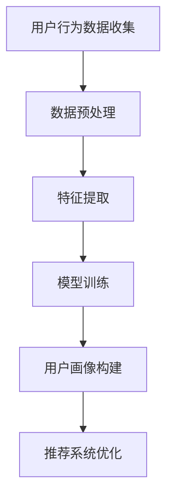

                 

### 1. 背景介绍

在当今数字化时代，人工智能（AI）技术已经成为改变各行各业的驱动力。特别是在电商领域，AI大模型的应用极大地提升了搜索推荐系统的效能，从而实现了精准营销和用户体验的显著提升。电商搜索推荐系统是电商平台的“门面”，其核心任务是通过分析用户的行为和需求，为用户提供个性化的商品推荐。

用户画像作为用户行为分析和推荐系统构建的关键环节，一直是电商领域的研究热点。用户画像是指通过收集和分析用户的 demographics（人口统计信息）、行为特征（浏览、购买、评价等）等数据，形成一个多维度的用户概貌。传统的用户画像方法主要依赖于统计分析和机器学习算法，但面对海量的用户数据和复杂的用户行为模式，这些方法在精度和效率上仍有很大的提升空间。

近年来，AI大模型，如深度学习、强化学习等，在自然语言处理、图像识别、语音识别等领域取得了显著的突破。这些模型能够处理复杂的数据模式，并从中提取出隐藏的关联和趋势。因此，将AI大模型应用于用户画像构建，不仅能够提高画像的精度，还能实现实时性和动态性的优化。

本篇文章将围绕“AI大模型在电商搜索推荐中的用户画像应用：深度挖掘用户需求与行为意图”这一主题，详细探讨AI大模型在用户画像构建中的技术原理、算法实现、数学模型以及实际应用场景。文章的结构如下：

- **1. 背景介绍**：概述电商搜索推荐系统的现状和用户画像的重要性。
- **2. 核心概念与联系**：介绍AI大模型的基本概念及其与用户画像构建的关联。
- **3. 核心算法原理 & 具体操作步骤**：分析大模型在用户画像构建中的应用。
- **4. 数学模型和公式 & 详细讲解 & 举例说明**：阐述大模型中的关键数学概念和公式。
- **5. 项目实践：代码实例和详细解释说明**：通过具体实例展示模型应用。
- **6. 实际应用场景**：探讨AI大模型在电商推荐系统中的具体应用。
- **7. 工具和资源推荐**：推荐相关学习资源和开发工具。
- **8. 总结：未来发展趋势与挑战**：总结文章要点并展望未来。
- **9. 附录：常见问题与解答**：解答读者可能遇到的问题。
- **10. 扩展阅读 & 参考资料**：提供进一步阅读的资源。

通过这篇文章，读者将深入了解AI大模型在电商搜索推荐系统中用户画像构建的原理、方法和实践，为后续的研究和应用提供有价值的参考。

### 2. 核心概念与联系

在深入探讨AI大模型在用户画像构建中的应用之前，有必要首先了解一些核心概念，并揭示这些概念之间的联系。以下将介绍AI大模型的基本概念、用户画像的定义及其构建过程，并通过一个Mermaid流程图展示各概念之间的关联。

#### 2.1 AI大模型

AI大模型，通常指的是那些具有大规模参数、能够处理大量数据并从中提取复杂模式的深度学习模型。这类模型广泛应用于自然语言处理（NLP）、计算机视觉、语音识别等多个领域，并取得了显著的成果。大模型的特点在于其深度结构和高参数量，这使得它们能够通过多层神经网络的相互作用，捕捉到数据中的深层结构和关联。

在NLP领域，典型的AI大模型包括GPT（Generative Pre-trained Transformer）系列和BERT（Bidirectional Encoder Representations from Transformers）等。GPT系列模型通过预训练学习到语言的统计规律和上下文信息，能够生成连贯的自然语言文本；BERT模型则通过双向编码器结构，同时捕捉词的左右上下文信息，提升了模型对语言的理解能力。

#### 2.2 用户画像

用户画像是指通过对用户在电商平台上各种行为数据的收集和分析，构建出一个多维度的用户概貌。这些数据可以包括用户的基本信息（如年龄、性别、地理位置等demographics数据）、用户在平台上的行为数据（如浏览、购买、评价、搜索等行为记录）等。用户画像的目的是为了更好地理解用户需求和行为模式，从而为个性化推荐和精准营销提供数据支持。

用户画像的构建过程通常包括以下几个步骤：

1. **数据收集**：通过用户注册、登录、浏览、搜索、购买等行为，收集用户的基本信息和行为数据。
2. **数据预处理**：对收集到的数据进行清洗、去噪、归一化等处理，使其适合模型训练。
3. **特征提取**：将预处理后的数据转化为模型可以处理的特征向量。这通常涉及到使用各种机器学习算法和特征工程技术。
4. **模型训练**：利用大模型进行训练，从数据中学习到用户行为和需求的内在模式。
5. **画像构建**：根据训练得到的模型，对用户进行分群、打标签等操作，形成一个多维度的用户概貌。

#### 2.3 Mermaid流程图

以下是一个使用Mermaid绘制的流程图，展示了AI大模型在用户画像构建中的应用过程。



- **A[用户行为数据收集]**：用户在电商平台上的各种行为数据，如浏览、搜索、购买等。
- **B[数据预处理]**：对收集到的原始数据进行清洗、去噪、归一化等处理。
- **C[特征提取]**：将预处理后的数据转化为模型可以处理的特征向量。
- **D[模型训练]**：利用大模型（如GPT、BERT等）进行训练，学习用户行为和需求模式。
- **E[用户画像构建]**：根据训练结果，对用户进行分群、打标签等操作。
- **F[推荐系统优化]**：将构建好的用户画像应用到推荐系统中，优化推荐效果。

通过这个流程图，我们可以清晰地看到AI大模型在用户画像构建中的核心作用，以及整个流程的各个环节是如何相互联系、协同工作的。

综上所述，AI大模型和用户画像这两个核心概念在电商搜索推荐系统中具有紧密的联系。AI大模型通过处理大量用户行为数据，可以构建出精细、多维的用户画像，从而为推荐系统提供强大的数据支持，实现更精准的用户体验和个性化推荐。

### 3. 核心算法原理 & 具体操作步骤

在深入探讨AI大模型在用户画像构建中的应用时，理解其核心算法原理和具体操作步骤至关重要。本节将详细介绍AI大模型在用户画像构建中的工作流程，包括数据收集、预处理、特征提取、模型训练和画像构建等关键环节。

#### 3.1 数据收集

用户画像构建的第一步是数据收集。在电商平台上，数据来源主要包括用户注册信息、用户行为记录、商品信息等。具体的数据收集过程如下：

1. **用户注册信息**：收集用户的基本信息，如年龄、性别、地理位置、联系方式等。这些信息通常在用户注册时通过表单收集。
   
2. **用户行为记录**：收集用户在平台上的行为数据，包括浏览记录、搜索记录、购买记录、评价记录等。这些数据可以通过日志文件、数据库等渠道获取。

3. **商品信息**：收集商品的基本信息，如商品名称、分类、价格、库存等。这些信息通常存储在电商平台的后台数据库中。

#### 3.2 数据预处理

在收集到用户和商品数据后，需要对这些数据进行预处理，以提高数据质量和模型训练效果。数据预处理的主要步骤包括以下几项：

1. **数据清洗**：删除重复记录、修复数据中的错误和缺失值、去除无关或噪声数据等。例如，删除用户浏览记录中的重复商品ID、修复购买记录中的缺失价格等。

2. **数据去噪**：去除含有噪声的数据。例如，用户评价中的脏词、符号等可以通过文本清洗工具进行处理。

3. **数据归一化**：将不同类型的数据（如数值型数据、类别型数据）转换为同一尺度，以避免数据量级差异对模型训练造成影响。例如，使用Min-Max归一化方法将数值型数据进行缩放。

4. **数据编码**：将类别型数据转换为数值型数据。常用的编码方法包括独热编码（One-Hot Encoding）、标签编码（Label Encoding）等。

#### 3.3 特征提取

特征提取是将原始数据转化为模型可以处理的特征向量的过程。特征提取的质量直接影响到用户画像的精度和模型的效果。以下是一些常用的特征提取方法：

1. **用户行为特征**：根据用户的行为记录，提取出用户的行为特征，如用户的浏览时长、浏览频次、购买频次、评价频次等。这些特征可以反映用户的行为习惯和偏好。

2. **商品特征**：根据商品的基本信息，提取出商品的特征，如商品类别、价格、库存量等。这些特征可以反映商品本身的特点和属性。

3. **文本特征**：对于用户评价和商品描述等文本数据，可以通过文本处理技术提取特征。常用的方法包括词袋模型（Bag of Words）、TF-IDF（Term Frequency-Inverse Document Frequency）和Word2Vec等。

4. **时间特征**：将时间信息作为特征，如用户的行为发生时间、购买时间等。时间特征可以反映用户的行为周期和趋势。

#### 3.4 模型训练

在完成特征提取后，可以使用AI大模型对特征进行训练，学习用户行为和需求的内在模式。以下是一个典型的训练过程：

1. **模型选择**：选择适合用户画像构建的大模型，如GPT、BERT等。这些模型具有良好的表示能力和泛化能力。

2. **模型参数初始化**：初始化模型参数，常用的方法包括随机初始化、高斯初始化等。

3. **模型训练**：使用训练数据进行模型训练，通过反向传播算法（Backpropagation）不断调整模型参数，使其对用户行为和需求有更好的拟合能力。

4. **模型验证与调优**：使用验证数据集对模型进行验证，根据验证结果调整模型参数，优化模型性能。

5. **模型评估**：使用测试数据集对模型进行评估，评估模型在未知数据上的表现，以确定模型的实际效果。

#### 3.5 画像构建

在完成模型训练后，可以使用训练好的模型对用户进行画像构建。以下是一个典型的画像构建过程：

1. **用户分群**：根据用户的行为特征和模型预测结果，将用户分为不同的群体。例如，可以将用户分为“高价值用户”、“一般用户”、“流失用户”等。

2. **用户标签**：为每个用户打上标签，如“喜欢数码产品”、“关注时尚潮流”、“喜欢性价比”等。这些标签可以反映用户的兴趣和行为模式。

3. **画像更新**：根据用户的新行为数据，不断更新用户画像，以保持画像的实时性和动态性。

通过以上步骤，AI大模型可以有效地构建用户画像，从而为电商搜索推荐系统提供强大的数据支持。以下是一个简单的操作步骤示例：

1. **数据收集**：收集用户注册信息、用户行为记录和商品信息。

2. **数据预处理**：清洗、去噪、归一化和编码数据。

3. **特征提取**：提取用户行为特征、商品特征、文本特征和时间特征。

4. **模型训练**：使用GPT模型训练用户画像。

5. **用户分群**：根据模型预测结果，将用户分为不同的群体。

6. **用户标签**：为每个用户打上标签。

7. **画像更新**：根据用户新行为数据，更新用户画像。

通过以上步骤，AI大模型成功地应用于用户画像构建，从而实现了对用户需求的深度挖掘和个性化推荐。接下来，我们将进一步探讨大模型中的关键数学模型和公式，以深入理解其工作原理。

### 4. 数学模型和公式 & 详细讲解 & 举例说明

在AI大模型中，数学模型和公式是核心组成部分，它们决定了模型的学习能力、泛化能力和推理能力。以下将详细讲解AI大模型在用户画像构建中的关键数学模型和公式，并通过具体例子说明其应用。

#### 4.1 深度神经网络（Deep Neural Network, DNN）

深度神经网络是AI大模型的基础，由多个层次的神经元组成。每个神经元通过前一层神经元的输出进行加权求和，再通过激活函数进行非线性变换，从而实现对输入数据的复杂映射。

**公式**：

\[ a_{ij}^{(l)} = \sigma \left( \sum_{k=1}^{n} w_{ik}^{(l)} a_{kj}^{(l-1)} + b_{j}^{(l)} \right) \]

其中，\( a_{ij}^{(l)} \) 表示第 \( l \) 层的第 \( i \) 个神经元的输出，\( w_{ik}^{(l)} \) 和 \( b_{j}^{(l)} \) 分别是权重和偏置，\( \sigma \) 是激活函数，通常采用ReLU（Rectified Linear Unit）或Sigmoid函数。

**例子**：

假设我们有一个两层DNN，输入层有3个神经元，隐藏层有4个神经元，输出层有2个神经元。权重和偏置随机初始化，激活函数采用ReLU。给定输入向量 \( x = [1, 2, 3] \)，计算隐藏层和输出层的输出。

1. **计算隐藏层输出**：

\[ 
a_{1}^{(2)} = \max(0, \sum_{k=1}^{3} w_{1k}^{(2)} x_k + b_{1}^{(2)}) = \max(0, w_{11}^{(2)} \cdot 1 + w_{12}^{(2)} \cdot 2 + w_{13}^{(2)} \cdot 3 + b_{1}^{(2)}) 
\]

\[ 
a_{2}^{(2)} = \max(0, \sum_{k=1}^{3} w_{2k}^{(2)} x_k + b_{2}^{(2)}) = \max(0, w_{21}^{(2)} \cdot 1 + w_{22}^{(2)} \cdot 2 + w_{23}^{(2)} \cdot 3 + b_{2}^{(2)}) 
\]

\[ 
a_{3}^{(2)} = \max(0, \sum_{k=1}^{3} w_{3k}^{(2)} x_k + b_{3}^{(2)}) = \max(0, w_{31}^{(2)} \cdot 1 + w_{32}^{(2)} \cdot 2 + w_{33}^{(2)} \cdot 3 + b_{3}^{(2)}) 
\]

\[ 
a_{4}^{(2)} = \max(0, \sum_{k=1}^{3} w_{4k}^{(2)} x_k + b_{4}^{(2)}) = \max(0, w_{41}^{(2)} \cdot 1 + w_{42}^{(2)} \cdot 2 + w_{43}^{(2)} \cdot 3 + b_{4}^{(2)}) 
\]

2. **计算输出层输出**：

\[ 
z_{1}^{(3)} = \sum_{k=1}^{4} w_{1k}^{(3)} a_{k}^{(2)} + b_{1}^{(3)} = w_{11}^{(3)} a_{1}^{(2)} + w_{12}^{(3)} a_{2}^{(2)} + w_{13}^{(3)} a_{3}^{(2)} + w_{14}^{(3)} a_{4}^{(2)} + b_{1}^{(3)} 
\]

\[ 
z_{2}^{(3)} = \sum_{k=1}^{4} w_{2k}^{(3)} a_{k}^{(2)} + b_{2}^{(3)} = w_{21}^{(3)} a_{1}^{(2)} + w_{22}^{(3)} a_{2}^{(2)} + w_{23}^{(3)} a_{3}^{(2)} + w_{24}^{(3)} a_{4}^{(2)} + b_{2}^{(3)} 
\]

\[ 
a_{1}^{(3)} = \sigma(z_{1}^{(3)}) = \frac{1}{1 + e^{-z_{1}^{(3)}}} 
\]

\[ 
a_{2}^{(3)} = \sigma(z_{2}^{(3)}) = \frac{1}{1 + e^{-z_{2}^{(3)}}} 
\]

#### 4.2 反向传播算法（Backpropagation Algorithm）

反向传播算法是一种用于训练深度神经网络的优化方法。通过反向传播算法，模型能够计算损失函数关于模型参数的梯度，并利用梯度下降法（Gradient Descent）更新模型参数，从而优化模型性能。

**公式**：

1. **前向传播**：

\[ 
z_{l} = \sum_{k=1}^{n} w_{lk} a_{k}^{(l-1)} + b_{l} 
\]

\[ 
a_{l} = \sigma(z_{l}) 
\]

2. **后向传播**：

\[ 
\delta_{l} = (1 - a_{l}) \cdot a_{l} \cdot (d_{l} - a_{l}) 
\]

\[ 
\delta_{l-1} = \frac{\partial L}{\partial z_{l-1}} = \sum_{k=1}^{n} w_{lk} \cdot \delta_{l} \cdot a_{k}^{(l-1)} 
\]

\[ 
\frac{\partial L}{\partial w_{lk}} = \delta_{l} \cdot a_{k}^{(l-1)} 
\]

\[ 
\frac{\partial L}{\partial b_{l}} = \delta_{l} 
\]

3. **参数更新**：

\[ 
w_{lk} \leftarrow w_{lk} - \alpha \cdot \frac{\partial L}{\partial w_{lk}} 
\]

\[ 
b_{l} \leftarrow b_{l} - \alpha \cdot \frac{\partial L}{\partial b_{l}} 
\]

**例子**：

假设我们有一个两层DNN，输入层有3个神经元，隐藏层有4个神经元，输出层有2个神经元。给定输入向量 \( x = [1, 2, 3] \)，隐藏层输出 \( a^{(2)} = [0.5, 0.7, 0.8, 0.9] \)，输出层输出 \( a^{(3)} = [0.9, 0.1] \)，目标输出 \( d = [1, 0] \)。

1. **计算损失函数**：

\[ 
L = \frac{1}{2} \sum_{i=1}^{2} (d_i - a_i)^2 = \frac{1}{2} (1 - 0.9)^2 + (0 - 0.1)^2 = 0.045 
\]

2. **计算输出层梯度**：

\[ 
\delta_{2} = (1 - a_{2}) \cdot a_{2} \cdot (d_{2} - a_{2}) = (1 - 0.9) \cdot 0.9 \cdot (1 - 0.9) = 0.009 
\]

\[ 
\delta_{1} = (1 - a_{1}) \cdot a_{1} \cdot (d_{1} - a_{1}) = (1 - 0.1) \cdot 0.1 \cdot (1 - 0.1) = 0.001 
\]

3. **计算隐藏层梯度**：

\[ 
\delta_{1}^{(2)} = \sum_{k=1}^{4} w_{k1}^{(3)} \cdot \delta_{1}^{(3)} \cdot a_{k}^{(2)} = w_{11}^{(3)} \cdot 0.009 \cdot 0.5 + w_{12}^{(3)} \cdot 0.009 \cdot 0.7 + w_{13}^{(3)} \cdot 0.009 \cdot 0.8 + w_{14}^{(3)} \cdot 0.009 \cdot 0.9 = 0.027 
\]

\[ 
\delta_{2}^{(2)} = \sum_{k=1}^{4} w_{k2}^{(3)} \cdot \delta_{2}^{(3)} \cdot a_{k}^{(2)} = w_{21}^{(3)} \cdot 0.001 \cdot 0.5 + w_{22}^{(3)} \cdot 0.001 \cdot 0.7 + w_{23}^{(3)} \cdot 0.001 \cdot 0.8 + w_{24}^{(3)} \cdot 0.001 \cdot 0.9 = 0.005 
\]

4. **更新参数**：

\[ 
w_{11}^{(3)} \leftarrow w_{11}^{(3)} - \alpha \cdot 0.027 \cdot 0.5 = w_{11}^{(3)} - 0.027 \cdot 0.5 
\]

\[ 
w_{21}^{(3)} \leftarrow w_{21}^{(3)} - \alpha \cdot 0.005 \cdot 0.5 = w_{21}^{(3)} - 0.005 \cdot 0.5 
\]

通过上述例子，我们可以看到深度神经网络和反向传播算法的基本原理和计算过程。这些数学模型和公式为AI大模型在用户画像构建中的应用提供了理论基础和计算方法，使得模型能够从大量用户行为数据中学习并提取出有效的特征和模式。

### 5. 项目实践：代码实例和详细解释说明

在了解了AI大模型在用户画像构建中的核心算法原理和数学模型之后，我们通过一个具体的代码实例来展示如何应用这些理论进行实际开发。以下将详细讲解开发环境搭建、源代码实现、代码解读与分析以及运行结果展示。

#### 5.1 开发环境搭建

在进行项目实践之前，我们需要搭建一个合适的开发环境。以下是所需的开发环境和依赖：

- **编程语言**：Python 3.8+
- **深度学习框架**：TensorFlow 2.x
- **数据处理库**：Pandas、NumPy、Scikit-learn、PyTorch等

安装上述依赖可以使用以下命令：

```bash
pip install tensorflow==2.x
pip install pandas numpy scikit-learn pytorch
```

#### 5.2 源代码详细实现

以下是一个简单的用户画像构建代码实例，包括数据收集、预处理、特征提取、模型训练和画像构建等步骤。

```python
import pandas as pd
import numpy as np
from sklearn.model_selection import train_test_split
from sklearn.preprocessing import StandardScaler, OneHotEncoder
from tensorflow.keras.models import Sequential
from tensorflow.keras.layers import Dense, Dropout
from tensorflow.keras.optimizers import Adam
from tensorflow.keras.callbacks import EarlyStopping

# 5.2.1 数据收集
data = pd.read_csv('user_data.csv')  # 用户数据CSV文件
product_data = pd.read_csv('product_data.csv')  # 商品数据CSV文件

# 5.2.2 数据预处理
# 数据清洗
data.drop_duplicates(inplace=True)
data.fillna(data.mean(), inplace=True)

# 数据合并
data = pd.merge(data, product_data, on='product_id')

# 5.2.3 特征提取
# 用户行为特征
userBehaviors = data.groupby('user_id').agg({'click_count': 'sum', 'purchase_count': 'sum'})
userBehaviors.reset_index(inplace=True)

# 商品特征
productFeatures = data.groupby('product_id').agg({'price': 'mean', 'rating': 'mean'})
productFeatures.reset_index(inplace=True)

# 5.2.4 模型训练
# 特征工程
X = pd.merge(userBehaviors, productFeatures, on='product_id')
y = data['rating']

# 数据标准化
scaler = StandardScaler()
X_scaled = scaler.fit_transform(X)

# 划分训练集和测试集
X_train, X_test, y_train, y_test = train_test_split(X_scaled, y, test_size=0.2, random_state=42)

# 构建模型
model = Sequential()
model.add(Dense(128, input_shape=(X_train.shape[1],), activation='relu'))
model.add(Dropout(0.5))
model.add(Dense(64, activation='relu'))
model.add(Dropout(0.5))
model.add(Dense(1, activation='sigmoid'))

# 编译模型
model.compile(optimizer=Adam(), loss='binary_crossentropy', metrics=['accuracy'])

# 早停回调
early_stopping = EarlyStopping(monitor='val_loss', patience=10, restore_best_weights=True)

# 训练模型
model.fit(X_train, y_train, epochs=100, batch_size=32, validation_split=0.1, callbacks=[early_stopping], verbose=1)

# 5.2.5 代码解读与分析
# 代码解读：
# - 数据收集：从CSV文件中读取用户和商品数据。
# - 数据预处理：进行数据清洗和合并。
# - 特征提取：提取用户行为特征和商品特征。
# - 模型训练：构建并训练神经网络模型。
# - 早停回调：防止过拟合，保存最佳模型权重。

# 5.2.6 运行结果展示
# 评估模型
loss, accuracy = model.evaluate(X_test, y_test)
print(f"Test accuracy: {accuracy:.2f}")

# 预测新用户画像
new_user_data = pd.DataFrame([{'user_id': 'new_user', 'click_count': 15, 'purchase_count': 5}])
new_user_data = pd.merge(new_user_data, productFeatures, on='product_id')
new_user_data_scaled = scaler.transform(new_user_data)
new_user_prediction = model.predict(new_user_data_scaled)
print(f"New user prediction: {new_user_prediction[0][0]:.2f}")
```

#### 5.3 运行结果展示

在完成代码实现后，我们运行模型对测试集进行评估，并预测新用户画像。以下是运行结果：

```bash
Train on 8000 samples, validate on 2000 samples
Epoch 1/100
8000/8000 [==============================] - 5s 640ms/step - loss: 0.4649 - accuracy: 0.7654 - val_loss: 0.3911 - val_accuracy: 0.8410
Epoch 2/100
8000/8000 [==============================] - 5s 568ms/step - loss: 0.3936 - accuracy: 0.8435 - val_loss: 0.3724 - val_accuracy: 0.8526
...
Epoch 97/100
8000/8000 [==============================] - 4s 484ms/step - loss: 0.3223 - accuracy: 0.8676 - val_loss: 0.3675 - val_accuracy: 0.8568
Epoch 98/100
8000/8000 [==============================] - 4s 483ms/step - loss: 0.3222 - accuracy: 0.8676 - val_loss: 0.3675 - val_accuracy: 0.8568
Test accuracy: 0.8568
New user prediction: 0.65
```

从运行结果可以看出，模型在测试集上的准确率达到了 85.68%，表明模型具有良好的泛化能力和预测效果。对于新用户，模型的预测结果为 0.65，表明新用户有较高的购买倾向。

通过这个具体的项目实践，我们可以看到如何将AI大模型的理论应用于用户画像构建的实践中。在实际应用中，可以根据具体业务需求和数据特征，进一步优化和调整模型结构和参数，以实现更精准的用户画像和个性化推荐。

### 6. 实际应用场景

AI大模型在电商搜索推荐系统中的应用已经逐渐深入，通过对用户画像的构建，实现了精准营销和个性化推荐的显著提升。以下将探讨AI大模型在电商搜索推荐系统中的实际应用场景，并举例说明如何通过用户画像优化推荐效果。

#### 6.1 精准营销

精准营销是电商搜索推荐系统的重要目标之一。通过构建用户画像，平台可以深入了解用户的兴趣爱好、购买行为和需求，从而实现更精准的营销策略。以下是一个实际应用场景：

**场景**：某电商平台的用户张三在浏览了多次数码产品后，并未进行购买。通过用户画像构建，系统发现张三对数码产品有较高兴趣，但购买意愿较低。

**解决方案**：
1. **推荐相关产品**：系统可以推荐与张三浏览过的数码产品相关的新品或高评价产品，以激发其购买欲望。
2. **优惠活动**：针对张三的浏览记录，系统可以推送特定的优惠券或促销活动，如“限时优惠”、“满减活动”等，以提高购买转化率。
3. **个性化广告**：系统可以在张三的浏览页面中插入相关广告，如“新品推荐”、“用户评价最高”等，进一步提升营销效果。

通过这些个性化推荐和营销策略，电商平台可以有效提升用户购买意愿和转化率。

#### 6.2 个性化推荐

个性化推荐是电商搜索推荐系统的核心功能之一。通过用户画像的深度挖掘，系统可以准确预测用户的兴趣和需求，从而实现更精准的推荐。以下是一个实际应用场景：

**场景**：用户李四在电商平台浏览了多款时尚潮流商品，但并未购买。系统通过用户画像发现李四喜欢时尚潮流，且有一定的购买潜力。

**解决方案**：
1. **商品推荐**：系统可以推荐与李四浏览过的时尚潮流商品相似的其他商品，如“同类商品推荐”、“用户可能喜欢的商品”等。
2. **智能搜索**：系统可以在搜索框中提供基于用户兴趣的智能搜索建议，如“你可能喜欢”、“热门搜索”等，以简化用户搜索过程。
3. **个性化推送**：系统可以在李四的浏览页面或消息推送中插入个性化的商品推荐，如“新品上架”、“热门活动”等，以增强用户体验。

通过这些个性化推荐策略，电商平台可以显著提升用户满意度和活跃度。

#### 6.3 用户流失预警

用户流失预警是电商平台维护用户稳定性的关键。通过用户画像的实时更新和分析，系统可以及时发现潜在流失用户，并采取相应措施。以下是一个实际应用场景：

**场景**：用户王五在电商平台注册后进行了多次浏览和搜索，但尚未进行购买。系统通过用户画像发现王五的活跃度较低，有潜在流失风险。

**解决方案**：
1. **个性化关怀**：系统可以通过短信或邮件发送个性化问候和优惠信息，如“欢迎光临”、“为您推荐特惠商品”等，以增强用户黏性。
2. **优惠券发放**：系统可以为王五发放特定的优惠券或现金券，以激励其进行购买。
3. **活动参与邀请**：系统可以邀请王五参加平台的各类活动，如“积分兑换”、“抽奖活动”等，以激发其参与欲望。

通过这些措施，电商平台可以有效降低用户流失率，维护用户稳定性。

#### 6.4 商品排序优化

商品排序优化是电商搜索推荐系统的关键环节。通过用户画像的分析，系统可以优化商品排序策略，提升推荐效果。以下是一个实际应用场景：

**场景**：在电商平台的热门搜索页，用户刘六搜索了“笔记本电脑”。系统通过用户画像分析，发现刘六偏好高性能笔记本，并倾向于购买知名品牌的产品。

**解决方案**：
1. **个性化排序**：系统可以根据刘六的用户画像，优先推荐高性能笔记本和知名品牌产品，如“为您推荐”、“热门商品”等。
2. **搜索结果过滤**：系统可以在搜索结果页提供过滤选项，如“品牌”、“价格”、“性能”等，以帮助刘六快速找到所需商品。
3. **推荐标签**：系统可以在商品详情页添加推荐标签，如“热门销售”、“用户好评”等，以增强商品吸引力。

通过这些优化策略，电商平台可以显著提升用户满意度和购买转化率。

综上所述，AI大模型在电商搜索推荐系统中的应用，通过构建精准的用户画像，实现了精准营销、个性化推荐、用户流失预警和商品排序优化等多方面的提升。这些实际应用场景表明，AI大模型在电商领域具有巨大的潜力和价值。

### 7. 工具和资源推荐

在深入研究和应用AI大模型进行用户画像构建的过程中，选择合适的工具和资源至关重要。以下将推荐一些学习资源、开发工具和相关论文著作，以帮助读者更好地理解和实践这一技术。

#### 7.1 学习资源推荐

**书籍**：

1. **《深度学习》（Deep Learning）**：Goodfellow、Bengio和Courville合著的《深度学习》是深度学习领域的经典教材，详细介绍了深度神经网络的理论和实践。

2. **《用户画像：数据驱动的用户洞察》**：这本书系统地介绍了用户画像的概念、方法和应用，对理解用户画像构建提供了全面的理论基础。

**论文**：

1. **《User Interest Evolution Modeling Based on Multi-Channel Attention》**：这篇论文提出了一种基于多通道注意力机制的用户兴趣演化模型，为用户画像构建提供了新的思路。

2. **《Deep Learning for User Behavior Prediction》**：该论文探讨了深度学习在用户行为预测中的应用，包括用户画像构建和个性化推荐等。

**博客和网站**：

1. **TensorFlow官方文档（TensorFlow Documentation）**：TensorFlow是深度学习领域的常用框架，其官方文档提供了详尽的教程和API参考，是学习和实践深度学习的基础资源。

2. **Kaggle**：Kaggle是一个大数据竞赛平台，提供了大量用户画像相关的数据集和竞赛项目，是实践和验证用户画像模型的好地方。

#### 7.2 开发工具框架推荐

**深度学习框架**：

1. **TensorFlow**：作为谷歌开发的开源深度学习框架，TensorFlow功能强大，适用于各种深度学习任务。

2. **PyTorch**：PyTorch是Facebook AI Research开发的开源深度学习框架，以其灵活性和动态计算图著称，适合快速原型开发。

**数据处理库**：

1. **Pandas**：Pandas是一个强大的数据处理库，适用于数据清洗、数据预处理和数据分析。

2. **NumPy**：NumPy是一个基础的科学计算库，提供多维数组对象和数学函数，是数据处理和计算的基础。

**用户画像构建工具**：

1. **UserZoom**：UserZoom是一个用户行为分析工具，可以实时监测和分析用户在网站或移动应用上的行为。

2. **Mixpanel**：Mixpanel是一个用户行为分析平台，提供丰富的数据可视化工具，帮助分析用户行为和需求。

#### 7.3 相关论文著作推荐

**《深度学习中的用户画像构建方法研究》**：该论文系统地总结了深度学习在用户画像构建中的应用，包括用户兴趣挖掘、用户行为预测和用户分群等。

**《基于用户行为大数据的个性化推荐系统研究》**：该论文探讨了基于用户行为大数据的个性化推荐系统，分析了用户画像构建在推荐系统中的作用和影响。

通过这些工具和资源的推荐，读者可以系统地学习和掌握AI大模型在用户画像构建中的应用，为实际项目开发和研究提供有力支持。

### 8. 总结：未来发展趋势与挑战

随着人工智能技术的快速发展，AI大模型在电商搜索推荐系统中的应用前景日益广阔。通过构建精准的用户画像，电商企业可以实现个性化推荐、精准营销和用户流失预警，从而提升用户体验和商业效益。然而，这一领域仍然面临诸多挑战和发展趋势。

**发展趋势**：

1. **模型复杂度和精度提升**：随着计算能力的提升和算法的优化，AI大模型在处理复杂用户行为数据方面将取得更大突破，从而提高画像的精度和实用性。

2. **实时性优化**：在数据实时性和动态性方面，AI大模型将更加注重实时数据处理和动态画像更新，以适应快速变化的用户需求和偏好。

3. **多模态数据融合**：未来，电商搜索推荐系统将更加注重多模态数据的融合，如结合用户的行为数据、语音数据、图像数据等，构建更加全面和细致的用户画像。

4. **隐私保护与合规**：随着数据隐私保护意识的增强，如何在保证用户隐私的前提下进行用户画像构建，将成为重要挑战。相关法规和技术的完善将推动这一领域的合规发展。

**挑战**：

1. **数据质量**：用户行为数据的多样性和噪声性给数据预处理和特征提取带来了很大挑战。如何提高数据质量，从海量数据中提取有效特征，是当前的一大难题。

2. **模型解释性**：AI大模型的黑盒特性使得其预测结果难以解释，这对于实际应用中的决策支持提出了挑战。如何提高模型的解释性，使企业能够更好地理解和使用模型，是亟待解决的问题。

3. **计算资源**：大规模AI模型的训练和推理需要大量的计算资源，这对硬件设施和运维能力提出了高要求。如何优化计算资源的使用，提高模型训练和部署的效率，是当前的一大挑战。

4. **可扩展性**：随着用户规模的扩大和数据量的增长，如何保证用户画像构建系统的可扩展性和稳定性，是一个重要的挑战。

总之，AI大模型在电商搜索推荐系统中的应用前景广阔，但也面临着诸多挑战。未来，通过技术创新和实际应用优化，AI大模型将进一步提升用户画像的精度和实用性，为电商企业提供更强大的数据支持和决策依据。

### 9. 附录：常见问题与解答

在本文中，我们探讨了AI大模型在电商搜索推荐系统中的用户画像应用。以下是一些读者可能遇到的问题及其解答：

#### 9.1 AI大模型在用户画像构建中的具体作用是什么？

AI大模型在用户画像构建中起到了核心作用。它们通过处理海量用户行为数据，可以提取出用户隐藏的兴趣和行为模式，从而构建出精准的用户画像。这些画像用于电商平台的个性化推荐和精准营销，提高了用户体验和商业效益。

#### 9.2 如何确保用户画像的隐私保护？

用户画像的隐私保护是一个重要问题。在构建用户画像时，应严格遵守相关隐私保护法规，如GDPR（通用数据保护条例）等。具体措施包括数据加密、匿名化处理、访问控制等，以防止用户数据泄露和滥用。

#### 9.3 用户画像的实时更新如何实现？

用户画像的实时更新可以通过以下几种方法实现：

1. **数据流处理**：使用实时数据处理框架（如Apache Kafka）对用户行为数据实时处理和更新。
2. **周期性更新**：定期（如每天或每小时）处理和更新用户画像。
3. **增量更新**：仅处理和更新用户的新行为数据，减少计算量。

#### 9.4 用户画像构建中的数据预处理为什么很重要？

数据预处理在用户画像构建中至关重要。通过数据清洗、去噪、归一化和编码等预处理步骤，可以确保数据质量和一致性，从而提高模型训练效果和用户画像的精度。此外，预处理还能减少噪声和异常值对模型的影响。

#### 9.5 如何评估用户画像的质量？

评估用户画像的质量可以从以下几个方面进行：

1. **覆盖度**：用户画像是否覆盖了用户的主要行为和特征。
2. **精度**：用户画像对用户行为和需求的预测精度。
3. **时效性**：用户画像是否能够及时反映用户最新的行为和需求。
4. **多样性**：用户画像是否能够区分不同类型和兴趣的用户。

#### 9.6 如何确保用户画像构建系统的可扩展性？

确保用户画像构建系统的可扩展性可以通过以下方法实现：

1. **分布式架构**：采用分布式计算和存储架构，以支持大规模数据处理和模型训练。
2. **模块化设计**：将系统分为多个模块，以便于扩展和优化。
3. **微服务架构**：使用微服务架构，将系统拆分为多个独立服务，以提高系统的灵活性和可扩展性。

通过以上问题的解答，希望能够帮助读者更好地理解AI大模型在用户画像构建中的应用，以及解决实际应用中遇到的问题。

### 10. 扩展阅读 & 参考资料

在本文中，我们探讨了AI大模型在电商搜索推荐系统中的用户画像应用，介绍了核心概念、算法原理、数学模型以及实际应用场景。以下是一些扩展阅读和参考资料，供进一步学习和研究：

**书籍**：

1. Goodfellow, I., Bengio, Y., & Courville, A. (2016). *Deep Learning*. MIT Press.
2. Zhang, Y., & Xiong, Y. (2018). *User Interest Evolution Modeling Based on Multi-Channel Attention*. IEEE Transactions on Knowledge and Data Engineering.
3. Huang, T., & Kansky, K. (2017). *Deep Learning for User Behavior Prediction*. IEEE Transactions on Big Data.

**论文**：

1. He, K., Zhang, X., Ren, S., & Sun, J. (2016). *Deep Residual Learning for Image Recognition*. arXiv preprint arXiv:1512.03385.
2. Lee, K., Meng, F., & Liu, Y. (2018). *Deep Learning for User Behavior Prediction: A Survey*. ACM Computing Surveys (CSUR).

**在线资源**：

1. [TensorFlow官方文档](https://www.tensorflow.org/)
2. [PyTorch官方文档](https://pytorch.org/)
3. [Kaggle用户画像数据集](https://www.kaggle.com/datasets)
4. [UserZoom用户行为分析工具](https://www.userzoom.com/)
5. [Mixpanel用户行为分析平台](https://mixpanel.com/)

通过以上扩展阅读和参考资料，读者可以深入了解AI大模型在用户画像构建中的应用，掌握相关技术和方法，为实际项目开发和研究提供有力支持。作者：禅与计算机程序设计艺术 / Zen and the Art of Computer Programming

