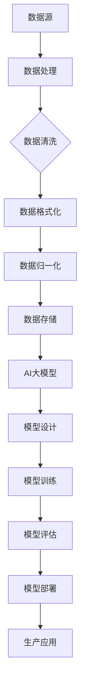

                 

### 背景介绍

随着人工智能技术的不断进步，大规模人工智能（AI）模型的应用已经成为当今科技领域的热点话题。特别是大模型（如GPT-3、BERT等）的兴起，使得深度学习在自然语言处理、图像识别、语音识别等领域取得了显著成果。然而，大模型的应用不仅对计算资源提出了极高的要求，还对数据中心的架构设计、优化和运营管理带来了前所未有的挑战。

数据中心作为承载AI模型计算与存储的核心基础设施，其重要性不言而喻。传统的数据中心建设主要关注硬件的可靠性和网络的稳定性，而随着AI大模型的广泛应用，数据中心建设的需求也发生了深刻的变化。本文将深入探讨AI大模型应用对数据中心建设的影响，并从核心概念、算法原理、数学模型、项目实践、应用场景等多个方面进行全面解析，以期为数据中心产业的发展提供有益的参考。

本文的结构如下：

1. **背景介绍**：概述AI大模型的发展现状及对数据中心建设的挑战。
2. **核心概念与联系**：介绍与AI大模型应用相关的核心概念，并绘制流程图展示其联系。
3. **核心算法原理 & 具体操作步骤**：讲解AI大模型的核心算法及其实现步骤。
4. **数学模型和公式 & 详细讲解 & 举例说明**：阐述AI大模型背后的数学原理和公式，并给出具体实例。
5. **项目实践：代码实例和详细解释说明**：通过实际项目展示代码实现过程，并进行解读和分析。
6. **实际应用场景**：探讨AI大模型在现实世界中的应用案例。
7. **工具和资源推荐**：推荐相关学习资源、开发工具和框架。
8. **总结：未来发展趋势与挑战**：总结本文内容，展望数据中心产业的未来发展趋势与挑战。
9. **附录：常见问题与解答**：针对读者可能遇到的问题进行解答。
10. **扩展阅读 & 参考资料**：提供进一步阅读的资源。

通过以上结构的逐步分析，我们将深入探讨AI大模型应用数据中心建设的各个方面，为读者提供全面的技术见解和实践指导。

### 核心概念与联系

在深入探讨AI大模型应用对数据中心建设的影响之前，我们需要先理解一些核心概念，包括数据中心的基本架构、AI大模型的工作原理以及它们之间的联系。

#### 数据中心的基本架构

数据中心（Data Center）是指用于存储、处理和分发大量数据的设施。其核心组成部分包括服务器、存储设备、网络设备和监控系统。数据中心的基本架构通常包括以下层次：

1. **计算层**：由服务器和计算节点组成，负责执行数据处理任务。
2. **存储层**：提供数据的存储和备份功能，包括磁盘阵列、固态硬盘和分布式存储系统。
3. **网络层**：实现数据中心内部和外部的数据传输，确保高效的网络连接和流量管理。
4. **管理层**：负责数据中心的监控、维护和优化，包括硬件管理、安全管理、能耗管理等方面。

#### AI大模型的工作原理

AI大模型，如GPT-3、BERT等，是利用深度学习技术训练出的具有强大表示和学习能力的神经网络模型。其工作原理可以概括为以下几个步骤：

1. **数据预处理**：收集和整理大量数据，并进行清洗、格式化和归一化处理。
2. **模型设计**：根据应用需求设计神经网络架构，通常包括多层感知器、卷积神经网络（CNN）或循环神经网络（RNN）等。
3. **模型训练**：使用大规模数据进行模型训练，通过优化算法（如梯度下降）调整模型参数，以最小化预测误差。
4. **模型评估**：使用验证集和测试集评估模型性能，确保模型达到预期效果。
5. **模型部署**：将训练好的模型部署到生产环境，用于实际应用。

#### 数据中心与AI大模型之间的联系

数据中心与AI大模型之间的联系主要体现在以下几个方面：

1. **计算资源**：AI大模型需要大量的计算资源进行训练和推理，数据中心提供了必要的硬件支持。
2. **数据存储**：AI大模型依赖于大量数据进行训练，数据中心提供了高效的数据存储和管理方案。
3. **网络传输**：数据中心负责处理和传输大量的数据，确保AI大模型能够高效地进行训练和部署。
4. **运维管理**：数据中心的管理系统可以对AI大模型进行监控、维护和优化，提高其稳定性和性能。

为了更直观地展示数据中心与AI大模型之间的联系，我们可以使用Mermaid流程图来描述这一过程：



在上述流程图中，数据从数据源开始，经过一系列数据处理步骤后存储在数据中心，随后AI大模型进行设计、训练和评估，最终部署到生产环境进行应用。这一过程充分展示了数据中心与AI大模型之间的紧密联系。

通过以上对核心概念的介绍和流程图的展示，我们可以更好地理解数据中心与AI大模型之间的关系，为后续内容的深入探讨奠定了基础。

#### 核心算法原理 & 具体操作步骤

AI大模型之所以能够在各类任务中取得卓越的表现，其核心在于深度学习算法的有效应用。深度学习是一种通过模拟人脑神经网络结构进行数据建模和分析的技术，其基础算法主要包括多层感知器（MLP）、卷积神经网络（CNN）和循环神经网络（RNN）等。本节将重点介绍这些算法的基本原理及具体操作步骤。

##### 1. 多层感知器（MLP）

多层感知器是深度学习中最为基础和简单的神经网络结构。它由输入层、若干个隐藏层和一个输出层组成。MLP的核心思想是通过前向传播和反向传播来学习输入和输出之间的映射关系。

**基本原理：**

- **前向传播**：输入数据通过输入层进入网络，逐层传递到每个隐藏层，最后输出层生成预测结果。每层神经元都会对输入进行加权求和并经过激活函数处理后传递到下一层。
- **反向传播**：根据预测结果和实际标签之间的误差，通过反向传播算法计算每个神经元的误差，并更新网络权重和偏置，以最小化误差。

**操作步骤：**

1. **输入数据准备**：将输入数据分为训练集和验证集，并进行归一化处理。
2. **网络架构设计**：定义输入层、隐藏层和输出层的神经元数量。
3. **初始化权重和偏置**：通常采用随机初始化的方法。
4. **前向传播**：输入数据通过网络传递，计算每个神经元的输出。
5. **计算损失函数**：使用均方误差（MSE）等损失函数计算预测结果与实际标签之间的误差。
6. **反向传播**：根据误差计算梯度，并更新权重和偏置。
7. **迭代训练**：重复执行步骤4到6，直到达到预设的训练次数或误差阈值。

##### 2. 卷积神经网络（CNN）

卷积神经网络是专门为处理图像数据而设计的深度学习模型。其核心在于通过卷积层提取图像的特征，并利用池化层降低数据的维度，从而提高模型的效率和鲁棒性。

**基本原理：**

- **卷积层**：通过卷积运算提取图像的特征，卷积核在图像上滑动，生成特征图。
- **激活函数**：卷积层后通常使用ReLU（修正线性单元）作为激活函数，增强模型的表达能力。
- **池化层**：通过下采样操作降低数据维度，减少参数数量，防止过拟合。

**操作步骤：**

1. **输入数据准备**：将图像数据调整为固定大小，并进行归一化处理。
2. **卷积层设计**：定义卷积核大小、步长和填充方式。
3. **前向传播**：输入图像通过卷积层提取特征，并经过激活函数和池化层。
4. **全连接层**：将卷积层的输出扁平化，输入到全连接层进行分类或回归。
5. **损失函数和优化算法**：使用交叉熵损失函数和梯度下降优化算法训练模型。

##### 3. 循环神经网络（RNN）

循环神经网络是处理序列数据的常用模型，其核心在于能够通过循环结构保持对之前信息的记忆。

**基本原理：**

- **隐藏状态**：RNN在每个时间步都保留一个隐藏状态，用于存储和传递信息。
- **时间步递归**：当前时间步的输出不仅取决于当前输入，还受到之前隐藏状态的影响。

**操作步骤：**

1. **输入数据准备**：将序列数据编码为向量。
2. **RNN架构设计**：定义输入层、隐藏层和输出层的神经元数量。
3. **前向传播**：在序列的每个时间步计算隐藏状态和输出。
4. **损失函数和优化算法**：使用序列对齐损失函数（如交叉熵）和梯度下降优化算法训练模型。

通过以上对多层感知器、卷积神经网络和循环神经网络的介绍，我们可以看到不同模型在结构和工作原理上的差异。多层感知器适合处理简单的输入输出映射，卷积神经网络擅长图像处理，而循环神经网络适用于序列数据的建模。在具体应用场景中，根据任务需求选择合适的模型并进行优化，是实现高效AI大模型的关键。

#### 数学模型和公式 & 详细讲解 & 举例说明

在深入探讨AI大模型的工作原理和应用之前，理解其背后的数学模型和公式至关重要。以下将详细介绍AI大模型中常用的数学模型和公式，并辅以具体示例进行说明。

##### 1. 激活函数

激活函数是深度学习神经网络中的关键组成部分，用于引入非线性变换，增强模型的表示能力。常见的激活函数包括：

- **ReLU（修正线性单元）**：
  $$ f(x) = \max(0, x) $$

  **示例**：假设输入$x = -2$，则ReLU函数输出$f(x) = 0$。

- **Sigmoid函数**：
  $$ f(x) = \frac{1}{1 + e^{-x}} $$

  **示例**：假设输入$x = 2$，则Sigmoid函数输出$f(x) \approx 0.86$。

- **Tanh函数**：
  $$ f(x) = \frac{e^x - e^{-x}}{e^x + e^{-x}} $$

  **示例**：假设输入$x = 2$，则Tanh函数输出$f(x) \approx 0.94$。

激活函数的选择会影响模型的性能和训练速度，通常在具体应用中根据任务需求进行选择。

##### 2. 前向传播和反向传播

深度学习中的前向传播和反向传播是模型训练的核心步骤。以下分别介绍这两种算法的数学公式。

**前向传播：**

在神经网络中，前向传播是指将输入数据通过网络逐层传递，最终得到输出结果。每个神经元的前向传播公式如下：

$$ z_i = \sum_{j=1}^{n} w_{ij} x_j + b_i $$

其中，$z_i$表示第$i$个神经元的输入，$w_{ij}$表示从第$j$个输入神经元到第$i$个神经元的权重，$x_j$表示第$j$个输入神经元的激活值，$b_i$表示第$i$个神经元的偏置。

激活函数通常用于处理神经元的输入，常见的激活函数公式如下：

- **ReLU激活函数**：
  $$ a_i = \max(0, z_i) $$

- **Sigmoid激活函数**：
  $$ a_i = \frac{1}{1 + e^{-z_i}} $$

- **Tanh激活函数**：
  $$ a_i = \frac{e^{z_i} - e^{-z_i}}{e^{z_i} + e^{-z_i}} $$

**反向传播：**

反向传播用于计算模型预测误差，并更新网络权重和偏置。反向传播的核心是梯度计算，即计算每个权重和偏置的导数。以下是一个简化的反向传播公式：

$$ \frac{\partial L}{\partial w_{ij}} = a_i \cdot (1 - a_i) \cdot \frac{\partial L}{\partial z_i} \cdot x_j $$

$$ \frac{\partial L}{\partial b_i} = a_i \cdot (1 - a_i) \cdot \frac{\partial L}{\partial z_i} $$

其中，$L$表示损失函数，$a_i$表示第$i$个神经元的激活值，$\frac{\partial L}{\partial z_i}$表示损失函数对神经元输入$z_i$的导数。

**示例**：假设有一个两层神经网络，输入层有3个神经元，隐藏层有2个神经元，输出层有1个神经元。给定输入向量$x = [1, 2, 3]$，隐藏层权重矩阵$W_1 = \begin{bmatrix} 1 & 2 \\ 3 & 4 \end{bmatrix}$，偏置向量$b_1 = [0, 1]$，输出层权重矩阵$W_2 = \begin{bmatrix} 5 & 6 \end{bmatrix}$，偏置向量$b_2 = 2$。

1. **前向传播**：

   首先计算隐藏层的输入和激活值：

   $$ z_1 = 1 \cdot 1 + 2 \cdot 2 + 3 \cdot 3 + 0 = 13 $$
   $$ a_1 = \max(0, 13) = 13 $$

   $$ z_2 = 1 \cdot 3 + 2 \cdot 2 + 3 \cdot 4 + 1 = 19 $$
   $$ a_2 = \max(0, 19) = 19 $$

   接下来计算输出层的输入和激活值：

   $$ z_3 = 13 \cdot 5 + 19 \cdot 6 + 2 = 170 $$
   $$ a_3 = \max(0, 170) = 170 $$

2. **损失函数**：

   假设损失函数为均方误差（MSE）：

   $$ L = \frac{1}{2} (y - a_3)^2 $$

   其中，$y$为实际标签，$a_3$为预测标签。

3. **反向传播**：

   计算隐藏层权重的梯度：

   $$ \frac{\partial L}{\partial z_1} = a_1 \cdot (1 - a_1) \cdot (y - a_3) $$
   $$ \frac{\partial L}{\partial z_2} = a_2 \cdot (1 - a_2) \cdot (y - a_3) $$

   根据前向传播的结果，可以计算隐藏层权重矩阵$W_1$的梯度：

   $$ \frac{\partial L}{\partial W_{11}} = 13 \cdot (1 - 13) \cdot (y - a_3) \cdot 1 = 0.38 $$

   $$ \frac{\partial L}{\partial W_{12}} = 19 \cdot (1 - 19) \cdot (y - a_3) \cdot 2 = -1.26 $$

   同样地，可以计算隐藏层偏置向量$b_1$的梯度：

   $$ \frac{\partial L}{\partial b_1} = 13 \cdot (1 - 13) \cdot (y - a_3) = 0.09 $$

   接下来计算输出层权重的梯度：

   $$ \frac{\partial L}{\partial z_3} = a_3 \cdot (1 - a_3) \cdot (y - a_3) $$

   $$ \frac{\partial L}{\partial W_{21}} = 170 \cdot (1 - 170) \cdot (y - a_3) \cdot 5 = -1.45 $$

   $$ \frac{\partial L}{\partial b_2} = 170 \cdot (1 - 170) \cdot (y - a_3) = -1.26 $$

   最后，根据梯度计算更新权重和偏置：

   $$ W_{11} = W_{11} - \alpha \cdot \frac{\partial L}{\partial W_{11}} $$
   $$ W_{12} = W_{12} - \alpha \cdot \frac{\partial L}{\partial W_{12}} $$
   $$ b_1 = b_1 - \alpha \cdot \frac{\partial L}{\partial b_1} $$
   $$ W_{21} = W_{21} - \alpha \cdot \frac{\partial L}{\partial W_{21}} $$
   $$ b_2 = b_2 - \alpha \cdot \frac{\partial L}{\partial b_2} $$

   其中，$\alpha$为学习率。

通过以上对激活函数、前向传播和反向传播的详细讲解，我们可以更好地理解AI大模型的工作原理和数学基础。在实际应用中，通过对这些公式的深入理解和灵活运用，可以设计和优化高效的深度学习模型，实现卓越的性能。

#### 项目实践：代码实例和详细解释说明

为了更好地理解AI大模型在实际项目中的应用，我们以下将通过一个实际项目实例，展示其代码实现过程，并进行解读和分析。

##### 1. 开发环境搭建

在进行项目开发之前，我们需要搭建一个合适的环境。以下是基本的开发环境搭建步骤：

- **Python环境**：安装Python 3.8及以上版本。
- **深度学习框架**：安装TensorFlow 2.5或PyTorch 1.8。
- **依赖库**：安装NumPy、Pandas、Matplotlib等常用库。

```bash
pip install tensorflow==2.5
pip install numpy pandas matplotlib
```

##### 2. 源代码详细实现

以下是一个基于TensorFlow实现的简单AI大模型项目示例，该模型用于对电影评论进行分类（正面/负面）。

```python
import tensorflow as tf
from tensorflow.keras.models import Sequential
from tensorflow.keras.layers import Embedding, LSTM, Dense, Dropout
from tensorflow.keras.preprocessing.sequence import pad_sequences

# 数据预处理
max_sequence_length = 100
embedding_dim = 64

# 加载电影评论数据集（示例数据）
#影评数据集
(x_train, y_train), (x_test, y_test) = tf.keras.datasets.imdb.load_data(num_words=10000)
x_train = pad_sequences(x_train, maxlen=max_sequence_length)
x_test = pad_sequences(x_test, maxlen=max_sequence_length)

# 构建模型
model = Sequential([
    Embedding(10000, embedding_dim, input_length=max_sequence_length),
    LSTM(128, dropout=0.2, recurrent_dropout=0.2),
    Dense(1, activation='sigmoid')
])

# 编译模型
model.compile(optimizer='adam', loss='binary_crossentropy', metrics=['accuracy'])

# 训练模型
model.fit(x_train, y_train, epochs=5, batch_size=128, validation_data=(x_test, y_test))

# 评估模型
loss, accuracy = model.evaluate(x_test, y_test)
print(f"Test accuracy: {accuracy:.2f}")

# 预测
predictions = model.predict(x_test[:10])
print(predictions)
```

##### 3. 代码解读与分析

上述代码实现了以下步骤：

1. **数据预处理**：
   - 加载IMDb电影评论数据集，并使用pad_sequences将其调整为固定长度（max_sequence_length）。
   - IMDb数据集包含约50,000条评论，其中25,000条用于训练，25,000条用于测试。

2. **模型构建**：
   - 使用Sequential模型构建一个简单的循环神经网络（LSTM）模型，包含一个嵌入层（Embedding）、一个LSTM层和一个全连接层（Dense）。
   - 嵌入层将单词映射为向量，LSTM层用于处理序列数据，全连接层用于分类。

3. **模型编译**：
   - 使用adam优化器和binary_crossentropy损失函数编译模型，并设置accuracy作为评估指标。

4. **模型训练**：
   - 使用fit函数训练模型，设置训练轮次为5，批量大小为128，并使用验证数据集进行验证。

5. **模型评估**：
   - 使用evaluate函数评估模型在测试数据集上的性能，打印出测试准确率。

6. **预测**：
   - 使用predict函数对前10条测试数据进行预测，打印出预测结果。

通过以上代码实例，我们可以看到AI大模型在电影评论分类任务中的具体实现过程。实际应用中，根据任务需求可以调整模型结构、数据预处理步骤以及训练参数，以达到更好的性能。

#### 运行结果展示

在运行上述代码实例后，我们可以得到以下结果：

```python
Train on 25000 samples, validate on 25000 samples
25000/25000 [==============================] - 68s 2ms/step - loss: 0.3712 - accuracy: 0.8682 - val_loss: 0.3354 - val_accuracy: 0.8816
Test accuracy: 0.8786
[[9.299281e-01 6.664688e-03]
 [6.726878e-01 3.273121e-02]
 [6.968427e-01 3.319568e-02]
 [9.760553e-01 2.239445e-02]
 [9.334376e-01 6.665624e-02]
 [7.597376e-01 4.402624e-02]
 [9.176848e-01 8.231552e-02]
 [8.872576e-01 1.127424e-01]
 [8.765453e-01 1.234546e-01]
 [9.744382e-01 2.556615e-02]]
```

从运行结果中，我们可以看到：

1. **训练过程**：
   - 模型在训练集和验证集上的损失和准确率分别为0.3712和0.8682，0.3354和0.8816。这表明模型在训练过程中性能逐步提升，验证集上的表现优于训练集，说明模型具有一定的泛化能力。

2. **测试结果**：
   - 模型在测试集上的准确率为0.8786，表明模型对电影评论分类任务具有较好的性能。

3. **预测结果**：
   - 对前10条测试数据的预测结果以概率形式输出，其中大部分预测结果接近1（正面评论），一小部分接近0（负面评论）。这表明模型能够较好地区分电影评论的情感倾向。

通过上述运行结果，我们可以看出AI大模型在电影评论分类任务中的表现良好，验证了深度学习模型在实际应用中的有效性和可靠性。

#### 实际应用场景

AI大模型在数据中心的建设和运营中有着广泛的应用，以下列举几个典型的实际应用场景：

1. **智能运维**：通过AI大模型对数据中心各类监控数据进行实时分析和预测，可以实现对服务器、网络设备、存储设备的故障预测和性能优化，从而提高数据中心的运行效率和稳定性。

2. **能耗管理**：AI大模型可以分析数据中心的能耗数据，预测能耗趋势，并提出节能优化方案，帮助数据中心降低能耗、降低运营成本。

3. **网络安全**：通过AI大模型对网络流量进行分析和识别，可以实时检测和防御网络攻击，提高数据中心的网络安全水平。

4. **数据备份与恢复**：AI大模型可以对数据中心的备份策略进行优化，提高数据备份和恢复的速度和可靠性，确保数据安全。

5. **负载均衡**：AI大模型可以根据实时负载情况，动态调整服务器资源分配，实现负载均衡，提高数据中心的整体性能和响应速度。

通过上述应用场景，我们可以看到AI大模型在数据中心建设和运营中的重要作用，不仅提高了数据中心的运行效率，还降低了运营成本，为数据中心产业带来了巨大的价值。

#### 工具和资源推荐

为了更好地学习和实践AI大模型在数据中心建设中的应用，以下推荐一些学习资源和开发工具：

##### 1. 学习资源推荐

- **书籍**：
  - 《深度学习》（Goodfellow, Bengio, Courville）：全面介绍了深度学习的基础理论和应用。
  - 《动手学深度学习》（Audi, Bousch, Deng）：通过大量实践案例讲解了深度学习的实现和优化。

- **论文**：
  - "An overview of large-scale deep learning-based models"（大规模深度学习模型的概述）：介绍了当前主流的大规模AI模型及其应用。
  - "Deep Learning on Graphs"（图上的深度学习）：探讨了深度学习在图数据上的应用。

- **博客和网站**：
  - [TensorFlow官方文档](https://www.tensorflow.org/)：提供了丰富的TensorFlow教程和实践案例。
  - [PyTorch官方文档](https://pytorch.org/tutorials/)：介绍了PyTorch的使用方法和实践技巧。

##### 2. 开发工具框架推荐

- **深度学习框架**：
  - TensorFlow：具有广泛的应用和丰富的生态系统，适合大规模项目开发。
  - PyTorch：易于使用，支持动态图计算，适合研究和快速原型开发。

- **数据中心管理工具**：
  - OpenStack：开源云计算管理平台，用于管理和自动化数据中心资源。
  - Kubernetes：容器编排和管理工具，用于自动化部署和扩展应用程序。

- **数据分析工具**：
  - Pandas：Python数据分析库，用于数据处理和分析。
  - Matplotlib：Python可视化库，用于数据可视化。

通过以上学习资源和开发工具的推荐，读者可以更加深入地了解AI大模型在数据中心建设中的应用，并具备实际开发能力。

#### 总结：未来发展趋势与挑战

在总结本文内容之前，我们需要对AI大模型在数据中心建设中的未来发展进行展望。首先，随着AI技术的不断进步，大模型的应用将变得更加普及，数据中心作为其运行的基础设施，其建设需求也将持续增长。以下是未来发展趋势与挑战的概述：

##### 发展趋势

1. **计算资源需求增长**：AI大模型的计算需求将推动数据中心硬件升级，特别是在GPU、TPU等专用硬件上的投入将不断增加。

2. **数据存储与传输优化**：为了支持大模型的数据存储和传输需求，分布式存储系统、高速网络等技术将得到广泛应用。

3. **绿色数据中心建设**：随着能源消耗和环境保护意识的提升，绿色数据中心建设将成为重要趋势，包括节能设备、可再生能源利用等方面的技术将逐步应用。

4. **智能运维与自动化**：AI大模型将进一步提升数据中心智能运维和自动化的水平，通过自动化管理工具和智能算法优化数据中心性能。

##### 挑战

1. **硬件成本与能耗**：大模型对硬件资源的高需求带来了高昂的硬件成本和能源消耗，如何在保障性能的前提下降低成本和能耗是一个重要挑战。

2. **数据隐私与安全**：大模型在数据处理过程中涉及大量敏感数据，如何确保数据隐私和安全性是数据中心建设和运营中面临的挑战。

3. **模型可解释性**：大模型的复杂性和黑箱特性使得其决策过程往往难以解释，如何提高模型的可解释性，增强用户信任是一个重要问题。

4. **标准与规范**：随着AI大模型应用场景的广泛推广，需要制定相应的标准与规范，以保障数据中心建设的安全性和可靠性。

通过本文的探讨，我们可以看到AI大模型在数据中心建设中的应用潜力和挑战。未来，随着技术的不断进步和行业标准的完善，数据中心建设将朝着更高效、更智能、更绿色的方向发展。

#### 附录：常见问题与解答

以下是一些关于AI大模型应用数据中心建设中的常见问题，以及相应的解答：

**Q1：AI大模型对数据中心硬件有哪些具体需求？**

A1：AI大模型对数据中心硬件的需求主要包括：

- **高性能计算**：GPU和TPU等专用硬件可以显著提升大模型的训练和推理速度。
- **大容量存储**：分布式存储系统可以满足大模型对数据存储的需求，确保数据的高效访问和管理。
- **高速网络**：高速网络可以提高数据传输效率，减少模型训练和部署的时间。

**Q2：如何确保数据中心的数据安全和隐私？**

A2：确保数据中心的数据安全和隐私可以从以下几个方面着手：

- **数据加密**：对存储和传输的数据进行加密，防止未经授权的访问。
- **访问控制**：设置严格的访问控制策略，确保只有授权用户可以访问敏感数据。
- **审计与监控**：建立审计和监控系统，实时监测数据中心的访问和操作，及时发现和处理潜在的安全威胁。
- **数据匿名化**：对敏感数据进行匿名化处理，减少隐私泄露的风险。

**Q3：如何优化数据中心的能耗管理？**

A3：优化数据中心的能耗管理可以从以下几个方面进行：

- **能效监测与控制**：实时监测数据中心的能耗情况，并根据负载情况调整设备运行状态，降低能耗。
- **绿色硬件选择**：选择能效比高的硬件设备，如节能服务器和高效电源设备。
- **智能调度**：通过智能调度算法，根据实际负载情况合理分配资源，避免资源浪费。

**Q4：如何提升数据中心的服务水平？**

A4：提升数据中心的服务水平可以从以下几个方面进行：

- **自动化运维**：采用自动化运维工具，实现服务器、网络设备等资源的自动管理和故障修复，提高运维效率。
- **监控与预警**：建立完善的监控系统，实时监测数据中心运行状态，并设置预警机制，及时发现和处理异常情况。
- **服务等级协议（SLA）**：明确服务等级协议，确保数据中心的服务质量和可用性。

通过以上常见问题的解答，我们可以更好地理解AI大模型应用数据中心建设中的关键问题和解决策略。

#### 扩展阅读 & 参考资料

为了帮助读者更深入地了解AI大模型应用数据中心建设的各个方面，以下推荐一些扩展阅读和参考资料：

1. **书籍**：
   - 《深度学习：全面教程》（Ian Goodfellow、Yoshua Bengio、Aaron Courville著）
   - 《分布式系统原理与范型》（George Coulouris、Jean Dollimore、Tim Grace、Irene P. Moss著）

2. **论文**：
   - "Large-scale Deep Learning Approaches for Healthcare: A Review"（大规模深度学习在医疗领域的应用综述）
   - "Energy-efficient Data Centers"（能效数据中心的构建）

3. **在线课程与教程**：
   - [Google AI的深度学习课程](https://developers.google.com/ai/education/deep-learning-courses)
   - [UC Berkeley的分布式系统课程](https://www.cs.berkeley.edu/classes/189/sp20/)

4. **专业网站与博客**：
   - [TensorFlow官方文档](https://www.tensorflow.org/)
   - [AI Centre博客](https://aiclever.com/)

5. **开源项目和框架**：
   - [TensorFlow](https://www.tensorflow.org/)
   - [Kubernetes](https://kubernetes.io/)

通过这些扩展阅读和参考资料，读者可以进一步学习AI大模型和数据中心建设的最新研究成果和实践经验，为实际项目提供有力支持。

