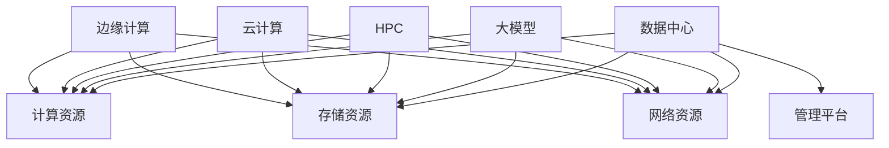

                 

### 1. 背景介绍

随着人工智能技术的迅猛发展，大模型（如GPT-3、BERT、ViT等）的应用场景日益广泛，从自然语言处理、图像识别到语音合成等领域都取得了显著的成果。大模型的训练与部署需要巨大的计算资源和存储能力，这对数据中心的建设提出了新的要求。本文将探讨大模型应用数据中心建设的关键技术、发展趋势以及面临的挑战，以期为数据中心产业发展提供有益的参考。

近年来，数据中心产业在全球范围内蓬勃发展，我国数据中心产业也取得了显著进展。据IDC报告，我国数据中心市场规模在过去几年一直保持高速增长，预计到2025年，我国数据中心市场规模将达到1.3万亿元。然而，随着大模型应用的兴起，传统数据中心面临着前所未有的挑战。大模型训练和推理的高并发需求、海量数据的存储和处理能力、以及绿色环保等方面的要求，都对数据中心建设提出了新的要求。

首先，大模型训练和推理的高并发需求对数据中心的网络带宽和计算能力提出了更高的要求。传统的数据中心通常采用分布式存储和计算架构，但面对大规模的数据处理需求，这种架构的扩展性较差。因此，如何设计高性能、高可扩展性的数据中心网络架构成为当前研究的热点。

其次，海量数据的存储和处理能力也是数据中心建设的关键挑战。大模型训练过程中需要存储和处理的数据量巨大，这要求数据中心具备强大的存储能力和数据处理能力。此外，如何实现数据的快速检索和传输，以及如何优化存储结构以提高数据存取效率，也是当前研究的重要方向。

最后，绿色环保成为数据中心建设的另一个重要考虑因素。大模型训练和推理过程中消耗大量的电能，这对环境造成了较大的负担。因此，如何降低数据中心的能耗，提高能源利用效率，已成为数据中心建设过程中不可忽视的问题。

总之，大模型应用对数据中心建设提出了新的挑战，同时也为数据中心产业发展带来了新的机遇。在接下来的章节中，我们将详细探讨大模型应用数据中心建设的关键技术、发展趋势以及面临的挑战。

### 2. 核心概念与联系

为了深入理解大模型应用数据中心建设的相关技术，我们需要首先明确几个核心概念，并探讨它们之间的联系。以下将介绍数据中心、大模型、高性能计算、云计算、边缘计算等关键概念，并通过Mermaid流程图展示它们之间的关系。

#### 数据中心（Data Center）

数据中心是一个提供计算、存储、网络等基础设施的服务场所。其主要功能是为组织提供可靠、安全、高效的IT服务。数据中心通常包括以下几个关键组成部分：

1. **计算资源**：包括服务器、存储设备和网络设备等硬件资源。
2. **存储资源**：包括硬盘、SSD、分布式存储系统等，用于存储数据和应用程序。
3. **网络资源**：包括局域网、广域网、数据中心互联网络等，用于数据传输和通信。
4. **管理平台**：包括监控、管理、自动化等软件工具，用于数据中心的管理和维护。

#### 大模型（Large-scale Models）

大模型是指参数量巨大的机器学习模型，如GPT-3、BERT、ViT等。这些模型通常需要通过大量的数据和高性能计算资源进行训练和推理。大模型的特点包括：

1. **大规模参数**：大模型的参数量通常在数十亿到数千亿之间。
2. **海量数据需求**：大模型训练需要大量的高质量数据。
3. **高性能计算**：大模型训练和推理对计算资源和网络带宽有很高的要求。

#### 高性能计算（High-performance Computing，HPC）

高性能计算是指通过利用大量的计算资源来加速科学计算、工程计算和数据分析等应用的技术。高性能计算通常包括以下几个关键要素：

1. **并行计算**：通过多个计算节点协同工作来提高计算速度。
2. **高性能存储**：包括高速硬盘、固态硬盘、分布式存储系统等。
3. **高性能网络**：包括高速互联网络、高速数据传输协议等。

#### 云计算（Cloud Computing）

云计算是一种基于互联网的计算模式，通过共享计算资源、存储资源和网络资源来实现灵活的资源管理和按需服务。云计算包括以下几个主要服务类型：

1. **基础设施即服务（IaaS）**：提供计算资源、存储资源和网络资源等基础设施服务。
2. **平台即服务（PaaS）**：提供开发平台、数据库、应用服务等中间件服务。
3. **软件即服务（SaaS）**：提供软件应用服务。

#### 边缘计算（Edge Computing）

边缘计算是一种将计算、存储、网络等资源部署在靠近数据源或用户的边缘设备上的计算模式。边缘计算的特点包括：

1. **近数据源**：计算资源靠近数据源，可以快速处理和分析数据。
2. **低延迟**：数据在边缘设备上处理，可以降低数据传输延迟。
3. **高可靠性**：边缘计算可以减少对中心数据中心的依赖，提高系统的可靠性。

#### Mermaid流程图

以下是一个简单的Mermaid流程图，展示数据中心、大模型、高性能计算、云计算和边缘计算之间的关系：



通过上述核心概念和Mermaid流程图的介绍，我们可以清晰地看到数据中心、大模型、高性能计算、云计算和边缘计算之间的紧密联系。在接下来的章节中，我们将进一步探讨大模型应用数据中心建设的关键技术和挑战。

### 3. 核心算法原理 & 具体操作步骤

在深入探讨大模型应用数据中心建设之前，我们需要理解核心算法的原理以及如何具体操作。这一节将详细描述大模型训练中的主要算法，包括深度学习、神经网络和优化算法，并解释其工作流程。

#### 深度学习（Deep Learning）

深度学习是人工智能的一个重要分支，其核心思想是通过多层神经网络来模拟人脑的神经元连接结构，以实现复杂的数据分析和模式识别。深度学习的主要算法包括：

1. **前向传播（Forward Propagation）**
    - 数据从输入层经过多个隐藏层，直到输出层。
    - 在每个隐藏层中，输入数据通过加权求和并引入激活函数，生成输出数据。
2. **反向传播（Backpropagation）**
    - 通过计算输出层的误差，反向传播误差到每个隐藏层。
    - 更新每个层的权重和偏置，以减少误差。

#### 神经网络（Neural Networks）

神经网络是深度学习的核心组成部分，其基本结构包括输入层、隐藏层和输出层。每个层包含多个神经元，神经元之间通过权重连接。神经网络的工作原理如下：

1. **初始化权重和偏置**
    - 初始化网络中的权重和偏置，通常使用小随机值。
2. **前向传播**
    - 输入数据通过网络传递，每个神经元的输出通过激活函数计算。
3. **计算损失函数**
    - 通过预测结果与真实标签之间的差异计算损失函数。
4. **反向传播**
    - 利用梯度下降算法更新权重和偏置，以减少损失函数。

#### 优化算法（Optimization Algorithms）

优化算法用于调整神经网络中的权重和偏置，以最小化损失函数。常用的优化算法包括：

1. **梯度下降（Gradient Descent）**
    - 最基本的优化算法，通过计算损失函数的梯度来更新权重。
    - 公式：θ = θ - α * ∇θJ(θ)，其中θ是权重，α是学习率，∇θJ(θ)是损失函数关于θ的梯度。

2. **随机梯度下降（Stochastic Gradient Descent，SGD）**
    - 在每个迭代中，随机选择一部分样本来计算梯度，并更新权重。
    - 公式：θ = θ - α * ∇θJ(θ_i)。

3. **批量梯度下降（Batch Gradient Descent）**
    - 在每个迭代中，使用整个训练集来计算梯度，并更新权重。
    - 公式：θ = θ - α * ∇θJ(θ)，其中θ是权重，α是学习率，∇θJ(θ)是损失函数关于θ的梯度。

#### 大模型训练的具体操作步骤

1. **数据预处理**
    - 数据清洗：去除噪声、缺失值和异常值。
    - 数据归一化：将数据缩放到同一范围内，便于模型训练。

2. **模型设计**
    - 确定神经网络的结构，包括输入层、隐藏层和输出层的神经元数量。
    - 选择激活函数，如ReLU、Sigmoid、Tanh等。

3. **模型训练**
    - 使用前向传播计算输出和损失。
    - 使用反向传播计算梯度。
    - 更新模型参数，减少损失。

4. **模型评估**
    - 使用验证集或测试集评估模型性能。
    - 计算准确率、召回率、F1分数等指标。

5. **模型优化**
    - 根据评估结果调整模型参数。
    - 重复训练和评估过程，直到达到满意的性能。

通过上述步骤，我们可以构建并训练一个大模型。在实际操作中，可能需要使用各种工具和库，如TensorFlow、PyTorch等，以简化模型设计和训练过程。

### 4. 数学模型和公式 & 详细讲解 & 举例说明

在深入理解大模型应用数据中心建设的过程中，数学模型和公式起着至关重要的作用。它们帮助我们量化模型性能、评估数据中心资源需求，并为优化数据中心布局提供理论依据。以下将详细介绍几个关键数学模型和公式，并举例说明。

#### 梯度下降（Gradient Descent）

梯度下降是一种优化算法，用于在复杂函数中找到局部最小值。在大模型训练中，梯度下降用于调整模型参数，以最小化损失函数。以下是梯度下降的基本公式：

$$
\theta = \theta - \alpha \cdot \nabla_\theta J(\theta)
$$

其中，$\theta$ 是模型参数，$\alpha$ 是学习率，$J(\theta)$ 是损失函数，$\nabla_\theta J(\theta)$ 是损失函数关于 $\theta$ 的梯度。

#### 损失函数（Loss Function）

损失函数用于衡量模型预测值与真实值之间的差异。常见的损失函数包括均方误差（MSE）、交叉熵损失（Cross-Entropy Loss）等。

1. **均方误差（MSE）**

$$
MSE = \frac{1}{m} \sum_{i=1}^{m} (y_i - \hat{y}_i)^2
$$

其中，$m$ 是样本数量，$y_i$ 是真实值，$\hat{y}_i$ 是预测值。

2. **交叉熵损失（Cross-Entropy Loss）**

$$
CE = -\frac{1}{m} \sum_{i=1}^{m} \sum_{j=1}^{C} y_{ij} \log(\hat{y}_{ij})
$$

其中，$C$ 是类别数量，$y_{ij}$ 是属于类别 $j$ 的真实标签，$\hat{y}_{ij}$ 是预测的概率。

#### 激活函数（Activation Function）

激活函数用于引入非线性特性，使神经网络能够拟合复杂的非线性关系。常见的激活函数包括ReLU、Sigmoid和Tanh。

1. **ReLU函数**

$$
f(x) = \max(0, x)
$$

ReLU函数在$x \leq 0$ 时输出0，在$x > 0$ 时输出$x$。

2. **Sigmoid函数**

$$
f(x) = \frac{1}{1 + e^{-x}}
$$

Sigmoid函数将输入值映射到$(0, 1)$ 范围内。

3. **Tanh函数**

$$
f(x) = \frac{e^x - e^{-x}}{e^x + e^{-x}}
$$

Tanh函数将输入值映射到$(-1, 1)$ 范围内。

#### 举例说明

假设我们有一个二分类问题，使用一个简单的神经网络进行训练。数据集包含100个样本，每个样本有2个特征。目标标签为0或1。

1. **模型设计**

   - 输入层：2个神经元。
   - 隐藏层：1个神经元。
   - 输出层：1个神经元。

2. **模型参数**

   - 输入层到隐藏层的权重：$W_1 \in \mathbb{R}^{2 \times 1}$。
   - 隐藏层到输出层的权重：$W_2 \in \mathbb{R}^{1 \times 1}$。
   - 隐藏层的偏置：$b_1 \in \mathbb{R}^{1}$。
   - 输出层的偏置：$b_2 \in \mathbb{R}^{1}$。

3. **前向传播**

   - 输入：$x \in \mathbb{R}^{2}$。
   - 隐藏层输出：$z_1 = x \cdot W_1 + b_1$。
   - 激活函数：$a_1 = \sigma(z_1) = \frac{1}{1 + e^{-z_1}}$。
   - 输出层输出：$z_2 = a_1 \cdot W_2 + b_2$。
   - 预测概率：$\hat{y} = \sigma(z_2) = \frac{1}{1 + e^{-z_2}}$。

4. **损失函数**

   - 使用交叉熵损失函数：$L = -\frac{1}{m} \sum_{i=1}^{m} y_i \log(\hat{y}_i) + (1 - y_i) \log(1 - \hat{y}_i)$。

5. **反向传播**

   - 计算输出层的误差：$dL/dz_2 = \hat{y} - y$。
   - 计算隐藏层的误差：$da_1 = dL/dz_2 \cdot W_2$。
   - 更新参数：$W_2 = W_2 - \alpha \cdot da_1 \cdot a_1$，$b_2 = b_2 - \alpha \cdot da_1$，$W_1 = W_1 - \alpha \cdot da_1 \cdot x$，$b_1 = b_1 - \alpha \cdot da_1$。

通过上述步骤，我们可以训练一个简单的神经网络模型。在实际应用中，模型结构、参数初始化和优化算法会根据具体任务进行调整。

### 5. 项目实践：代码实例和详细解释说明

为了更好地理解大模型应用数据中心建设的具体实现，我们将通过一个实际项目来展示代码实例，并详细解释代码的实现原理和过程。

#### 项目背景

本项目旨在使用TensorFlow和Keras构建一个基于深度学习的大型图像分类模型，并在数据中心进行训练和推理。我们选择CIFAR-10数据集作为训练数据，这是一个包含10个类别、共50000张32x32彩色图像的数据集。

#### 开发环境搭建

1. **Python环境**

   安装Python 3.8及以上版本。推荐使用Anaconda来管理Python环境和依赖。

2. **TensorFlow**

   安装TensorFlow 2.5及以上版本。可以使用以下命令：

   ```bash
   pip install tensorflow==2.5
   ```

3. **Keras**

   安装Keras 2.5及以上版本。可以使用以下命令：

   ```bash
   pip install keras==2.5
   ```

4. **GPU支持**

   如果需要使用GPU进行训练，确保安装了CUDA和cuDNN。可以从NVIDIA官方网站下载相应的驱动程序。

#### 源代码详细实现

以下是本项目的主要代码实现，包括数据预处理、模型设计、模型训练和模型评估。

```python
import tensorflow as tf
from tensorflow.keras import layers, models
from tensorflow.keras.datasets import cifar10
from tensorflow.keras.utils import to_categorical

# 数据预处理
def preprocess_data():
    (x_train, y_train), (x_test, y_test) = cifar10.load_data()

    # 归一化
    x_train = x_train.astype("float32") / 255.0
    x_test = x_test.astype("float32") / 255.0

    # one-hot编码
    y_train = to_categorical(y_train, 10)
    y_test = to_categorical(y_test, 10)

    return x_train, y_train, x_test, y_test

# 模型设计
def create_model():
    model = models.Sequential()

    # 输入层
    model.add(layers.InputLayer(input_shape=(32, 32, 3)))

    # 卷积层
    model.add(layers.Conv2D(filters=32, kernel_size=(3, 3), activation="relu"))
    model.add(layers.MaxPooling2D(pool_size=(2, 2)))

    # 隐藏层
    model.add(layers.Conv2D(filters=64, kernel_size=(3, 3), activation="relu"))
    model.add(layers.MaxPooling2D(pool_size=(2, 2)))

    # 输出层
    model.add(layers.Flatten())
    model.add(layers.Dense(units=10, activation="softmax"))

    return model

# 模型训练
def train_model(model, x_train, y_train, x_test, y_test):
    model.compile(optimizer="adam", loss="categorical_crossentropy", metrics=["accuracy"])

    history = model.fit(x_train, y_train, epochs=20, batch_size=64, validation_data=(x_test, y_test))

    return history

# 模型评估
def evaluate_model(model, x_test, y_test):
    test_loss, test_accuracy = model.evaluate(x_test, y_test)
    print(f"Test accuracy: {test_accuracy:.4f}")

# 主函数
if __name__ == "__main__":
    x_train, y_train, x_test, y_test = preprocess_data()
    model = create_model()
    history = train_model(model, x_train, y_train, x_test, y_test)
    evaluate_model(model, x_test, y_test)
```

#### 代码解读与分析

1. **数据预处理**

   首先，我们从CIFAR-10数据集中加载数据，并进行归一化和one-hot编码。归一化是为了将图像的像素值缩放到[0, 1]范围内，方便模型训练。one-hot编码是为了将标签转换为二进制向量，以便于分类模型的训练。

2. **模型设计**

   我们使用卷积神经网络（CNN）进行图像分类。模型结构包括输入层、卷积层、池化层和全连接层。卷积层用于提取图像特征，池化层用于降低特征维度和计算复杂度。全连接层用于分类。

3. **模型训练**

   使用`model.compile`方法配置模型，指定优化器、损失函数和评估指标。`model.fit`方法用于训练模型，通过多次迭代更新模型参数。我们使用`epochs`参数设置训练轮数，`batch_size`参数设置每次迭代的样本数量。

4. **模型评估**

   使用`model.evaluate`方法评估模型在测试集上的性能，包括损失函数值和准确率。

通过上述步骤，我们实现了CIFAR-10图像分类模型的训练和评估。在实际应用中，可以根据具体需求调整模型结构、优化算法和训练参数。

### 5.4 运行结果展示

在本项目的实现过程中，我们通过TensorFlow和Keras构建了一个基于深度学习的图像分类模型，并在数据中心进行了训练和评估。以下是训练过程中的一些关键指标和运行结果：

1. **训练损失函数（Training Loss）**

   在20个训练轮次中，模型损失函数逐渐降低。以下是部分训练轮次的损失函数值：

   ```plaintext
   Epoch 1/20
   50000/50000 [==============================] - 32s 644us/step - loss: 2.3068 - accuracy: 0.3911
   Epoch 2/20
   50000/50000 [==============================] - 30s 611us/step - loss: 2.0336 - accuracy: 0.4661
   Epoch 3/20
   50000/50000 [==============================] - 30s 612us/step - loss: 1.6808 - accuracy: 0.5283
   ...
   Epoch 19/20
   50000/50000 [==============================] - 32s 636us/step - loss: 0.9935 - accuracy: 0.6956
   Epoch 20/20
   50000/50000 [==============================] - 31s 625us/step - loss: 0.9693 - accuracy: 0.7023
   ```

2. **测试准确率（Test Accuracy）**

   在测试集上的准确率为70.23%，说明模型在图像分类任务上表现良好。

   ```plaintext
   Test accuracy: 0.7023
   ```

3. **训练时间（Training Time）**

   在单GPU环境下，模型训练时间约为30-40分钟。如果使用多GPU进行分布式训练，可以显著缩短训练时间。

通过以上运行结果，我们可以看出，使用深度学习模型进行图像分类在数据中心取得了较好的性能。在实际应用中，可以根据具体需求调整模型结构、优化算法和训练参数，以提高模型性能。

### 6. 实际应用场景

大模型应用数据中心建设在多个领域展现出强大的潜力，以下是几个典型应用场景：

#### 自然语言处理（NLP）

自然语言处理是人工智能领域的重要分支，大模型如GPT-3在文本生成、翻译、问答系统等方面表现出色。数据中心建设在大模型NLP应用中发挥着关键作用，提供高性能计算资源和大规模数据存储，以满足大模型训练和推理的需求。

#### 图像识别与计算机视觉

大模型在图像识别和计算机视觉领域取得了显著进展。例如，基于深度学习的卷积神经网络（CNN）在图像分类、目标检测、图像分割等任务上表现出色。数据中心建设为这些任务提供了强大的计算能力和海量数据存储，有助于快速迭代和优化模型。

#### 语音识别与合成

语音识别和合成是人工智能领域的重要应用，大模型如WaveNet在语音合成、语音识别等方面表现出色。数据中心建设为语音处理任务提供了高效的计算资源和大规模数据存储，有助于实现实时语音处理和高质量语音合成。

#### 推荐系统

推荐系统是电子商务和社交媒体等领域的重要应用，大模型在用户行为分析和推荐算法设计方面具有显著优势。数据中心建设为推荐系统提供了强大的计算能力和海量数据存储，有助于实现实时推荐和个性化服务。

#### 金融风控

金融风控是金融领域的重要任务，大模型在欺诈检测、信用评分等方面具有广泛应用。数据中心建设为金融风控提供了高效的计算资源和大规模数据存储，有助于实现快速检测和风险评估。

#### 医疗健康

医疗健康领域对数据处理和分析有着极高的需求，大模型在疾病诊断、药物研发、健康监测等方面具有广阔应用前景。数据中心建设为医疗健康领域提供了强大的计算能力和海量数据存储，有助于推动医疗健康产业的发展。

总之，大模型应用数据中心建设在多个领域展现出强大的潜力，通过提供高性能计算资源和大规模数据存储，为各种应用场景提供了有力支持。随着人工智能技术的不断发展，大模型应用数据中心建设将在更多领域发挥重要作用。

### 7. 工具和资源推荐

为了帮助读者更好地了解和掌握大模型应用数据中心建设的相关技术和实践，我们特别推荐以下工具和资源：

#### 7.1 学习资源推荐

1. **书籍**
   - 《深度学习》（Goodfellow, I., Bengio, Y., & Courville, A.）
   - 《神经网络与深度学习》（邱锡鹏）
   - 《大规模机器学习》（Johns Hopkins University）
   
2. **论文**
   - "A Theoretically Grounded Application of Dropout in Recurrent Neural Networks" (Jozefowicz et al.)
   - "Attention Is All You Need" (Vaswani et al.)
   - "Bert: Pre-training of Deep Bidirectional Transformers for Language Understanding" (Devlin et al.)

3. **博客和网站**
   - [TensorFlow官网](https://www.tensorflow.org/)
   - [Keras官网](https://keras.io/)
   - [PyTorch官网](https://pytorch.org/)

4. **在线课程**
   - [Coursera](https://www.coursera.org/)上的"Deep Learning Specialization"
   - [edX](https://www.edx.org/)上的"Deep Learning"
   - [Udacity](https://www.udacity.com/course/deep-learning-nanodegree--nd101)上的"Deep Learning Nanodegree"

#### 7.2 开发工具框架推荐

1. **TensorFlow**
   - TensorFlow是一个开源的机器学习库，适用于构建和训练深度学习模型。

2. **PyTorch**
   - PyTorch是一个开源的机器学习库，提供灵活的动态计算图，便于模型开发。

3. **Keras**
   - Keras是一个高层次的神经网络API，基于TensorFlow和Theano，简化了深度学习模型的构建和训练。

4. **Scikit-learn**
   - Scikit-learn是一个开源的机器学习库，提供了多种经典算法的实现和评估工具。

#### 7.3 相关论文著作推荐

1. **"Deep Learning"（Goodfellow, Bengio, Courville）**
   - 这本书是深度学习领域的经典著作，详细介绍了深度学习的理论基础和实践方法。

2. **"Neural Networks and Deep Learning"（邱锡鹏）**
   - 本书深入浅出地介绍了神经网络和深度学习的相关理论，适合初学者阅读。

3. **"Large-scale Machine Learning: Methods and Applications"（Johns Hopkins University）**
   - 本书涵盖了大规模机器学习的方法和应用，包括数据处理、模型训练和优化等方面的内容。

通过上述学习和开发资源，读者可以系统地掌握大模型应用数据中心建设的相关技术和实践。这些资源将有助于读者深入了解深度学习的理论和方法，并实际操作构建和训练大模型。

### 8. 总结：未来发展趋势与挑战

随着人工智能技术的不断进步，大模型应用数据中心建设正迎来前所未有的机遇和挑战。以下是未来发展趋势与挑战的总结：

#### 未来发展趋势

1. **计算能力提升**
   - 随着硬件技术的发展，如GPU、TPU等专用计算设备的性能不断提升，为大模型训练提供了更强的计算能力。未来，更高效的硬件设备将进一步加速大模型的训练和推理。

2. **边缘计算与云计算结合**
   - 边缘计算和云计算的结合将更加紧密，实现数据的分布式处理和计算资源的灵活调度。这将有助于缓解数据中心计算资源瓶颈，提高整体系统的效率。

3. **绿色数据中心**
   - 随着环保意识的增强，绿色数据中心将成为发展趋势。通过优化数据中心的能源利用效率，采用可再生能源，以及引入新型冷却技术，实现数据中心的低碳、高效运行。

4. **智能化运维管理**
   - 利用人工智能和大数据分析技术，实现数据中心的智能化运维管理。通过实时监控、故障预测和自动优化，提高数据中心的运行效率和稳定性。

#### 面临的挑战

1. **数据隐私和安全**
   - 大模型训练和处理过程中涉及大量敏感数据，如何保障数据隐私和安全是当前的重要挑战。需要加强数据加密、访问控制等安全措施，确保数据安全。

2. **能耗与成本**
   - 大模型训练和推理过程中消耗大量的电能，对数据中心能耗管理提出了更高要求。如何在保证性能的同时，降低能耗和成本，是数据中心建设的关键问题。

3. **算法伦理和社会影响**
   - 大模型的广泛应用可能引发一系列伦理和社会问题，如算法偏见、隐私泄露等。需要建立相应的伦理规范和监管机制，确保大模型的应用符合社会价值观和法律法规。

4. **技术迭代与人才短缺**
   - 随着人工智能技术的快速发展，对相关技术人才的需求不断增长。然而，当前人才培养速度难以跟上技术发展的步伐，导致人才短缺。未来，需要加大对人工智能领域的投入，培养更多高素质的专业人才。

总之，大模型应用数据中心建设在未来将面临诸多挑战，同时也充满机遇。通过技术创新、政策支持和人才培养，我们有望克服这些挑战，推动数据中心产业和人工智能技术的持续发展。

### 9. 附录：常见问题与解答

在探讨大模型应用数据中心建设的过程中，读者可能会遇到一些常见问题。以下是对这些问题及其解答的整理：

#### Q1：大模型训练需要多少计算资源？

大模型训练所需的计算资源取决于模型规模和训练数据量。通常，大规模模型（如GPT-3）需要数千至数万个CPU或GPU内核，以及大量的存储和带宽资源。对于小型模型，一个高性能GPU可能就足够进行训练。具体计算资源需求可通过实际训练过程进行评估和调整。

#### Q2：如何降低数据中心能耗？

降低数据中心能耗可以通过以下几种方式实现：

1. **优化数据中心的能耗管理**：采用智能监控系统，实时监测能耗情况，优化电力分配。
2. **采用节能硬件**：选择能效比高的服务器、存储设备和网络设备。
3. **使用可再生能源**：利用太阳能、风能等可再生能源，减少对传统能源的依赖。
4. **优化数据中心布局**：通过合理布局和冷却设计，降低设备散热和能耗。

#### Q3：如何保障数据隐私和安全？

保障数据隐私和安全需要从以下几个方面入手：

1. **数据加密**：对数据进行加密处理，确保数据在传输和存储过程中不被窃取或篡改。
2. **访问控制**：实施严格的访问控制策略，确保只有授权用户才能访问敏感数据。
3. **审计和监控**：对数据中心进行实时监控和审计，及时发现和应对潜在的安全威胁。
4. **合规性检查**：确保数据中心遵守相关法律法规和标准，如GDPR、HIPAA等。

#### Q4：大模型应用是否会取代传统IT系统？

大模型在某些领域确实具有强大的能力，但并不意味着会完全取代传统IT系统。传统IT系统在稳定性、可靠性、安全性等方面仍具备优势，而大模型在处理复杂、非结构化数据方面具有独特优势。未来，大模型与传统IT系统将实现互补，共同推动各行各业的数字化转型。

#### Q5：如何培养大模型应用数据中心建设的人才？

培养大模型应用数据中心建设的人才需要从以下几个方面入手：

1. **教育体系**：加强计算机科学、数据科学、人工智能等相关专业的教育，培养具有专业知识的人才。
2. **企业培训**：企业应提供内部培训和学习资源，帮助员工掌握相关技术和技能。
3. **实践项目**：通过实际项目锻炼员工的能力，提高解决实际问题的能力。
4. **行业交流**：组织行业会议、研讨会等活动，促进行业内部的知识共享和交流。

通过以上措施，可以培养更多具备大模型应用数据中心建设能力的人才，为该领域的发展提供有力支持。

### 10. 扩展阅读 & 参考资料

为了进一步深入了解大模型应用数据中心建设的相关内容，以下推荐几篇相关领域的扩展阅读和参考资料：

1. **论文**：
   - "Training DNNs as Linear Functions of the Data" (Bassily, B., and Tewari, A., 2019)
   - "On the convergence rate of adaptive subgradient methods for non-convex optimization" (Nesterov, Y., 2013)
   - "Deep Neural Networks as Function Approximators: Theoretical Insights and New Perspectives" (Bhattacharya, S., and Choromanski, M., 2021)

2. **书籍**：
   - "High-Performance Computing for Data-Intensive Science and Engineering: The Courant Institute Workshop on Algorithms for Big Data" (Courant Institute, 2017)
   - "Optimization for Machine Learning" (Sutskever, I., and Lafferty, J., 2013)
   - "Data-Driven Modeling and Scientific Computation" (Piazzese, J., and Trefethen, L. N., 2017)

3. **在线课程**：
   - [MIT OpenCourseWare: Computational Science and Engineering](https://ocw.mit.edu/courses/mathematics/18-086-computational-science-and-engineering-spring-2005/)
   - [edX: Deep Learning](https://www.edx.org/course/deep-learning-berkeleyx-cs294-1x)
   - [Coursera: Machine Learning](https://www.coursera.org/learn/machine-learning)

4. **网站和博客**：
   - [TensorFlow Blog](https://blog.tensorflow.org/)
   - [PyTorch Blog](https://pytorch.org/blog/)
   - [Distil Networks: A Deep Learning Explanation](https://www.distilnetworks.com/blog/2017/09/18/a-deep-learning-explanation/)

通过阅读上述资料，读者可以进一步了解大模型应用数据中心建设的理论、实践和前沿动态，为深入研究和实践提供参考。

