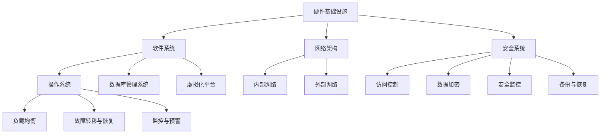

                 

### 文章标题

AI 大模型应用数据中心建设：数据中心安全与可靠性

> **关键词**：数据中心建设、AI大模型、安全性、可靠性、数据处理

> **摘要**：本文旨在探讨AI大模型应用数据中心的建设，重点分析数据中心在安全性、可靠性方面的设计要点和实现方法。通过深入研究数据中心的技术架构、安全策略以及可靠性保障措施，帮助读者全面了解AI大模型应用数据中心的建设流程和关键要素。

### 1. 背景介绍

在当今数字化时代，人工智能（AI）技术正以前所未有的速度发展，大模型（如GPT-3、BERT等）的兴起使得AI在自然语言处理、图像识别、语音识别等领域取得了显著的突破。为了满足大模型对海量数据处理和高性能计算的需求，数据中心建设成为AI领域的关键基础设施。数据中心作为AI大模型应用的核心载体，不仅需要具备强大的计算和存储能力，还需确保数据的安全性和可靠性。

数据中心的安全性关系到数据隐私、业务连续性和企业的生存。一旦发生数据泄露或系统故障，将可能导致巨大经济损失和声誉损害。可靠性则是数据中心稳定运行的基础，确保数据和服务不中断是数据中心建设的重要目标。因此，在数据中心的建设过程中，如何平衡安全与可靠性，是一个亟待解决的问题。

本文将围绕AI大模型应用数据中心的建设，系统性地探讨数据中心的安全性、可靠性设计，以及如何通过技术创新和实践来提高数据中心的整体性能。以下内容将分为以下几个部分进行详细阐述：

- **1. 背景介绍**：介绍AI大模型应用数据中心建设的背景和重要性。
- **2. 核心概念与联系**：阐述数据中心的技术架构、安全策略和可靠性保障的相关概念。
- **3. 核心算法原理与具体操作步骤**：分析数据中心的关键算法原理和实现方法。
- **4. 数学模型和公式**：介绍数据中心设计的数学模型和公式。
- **5. 项目实践**：通过代码实例和详细解释，展示数据中心建设的方法和技巧。
- **6. 实际应用场景**：探讨数据中心在不同场景下的应用案例。
- **7. 工具和资源推荐**：推荐学习资源、开发工具和框架。
- **8. 总结**：总结数据中心建设的发展趋势与挑战。
- **9. 附录**：提供常见问题与解答。
- **10. 扩展阅读与参考资料**：推荐进一步阅读的相关资源和文献。

通过本文的详细探讨，希望能够为从事数据中心建设和运维的技术人员提供有价值的参考，助力AI大模型应用数据中心的建设和发展。

### 2. 核心概念与联系

#### 数据中心技术架构

数据中心（Data Center）是一种旨在提供数据存储、处理和访问服务的大型计算设施。其技术架构通常包括以下几个关键部分：

1. **硬件基础设施**：包括服务器、存储设备、网络设备等硬件资源，负责提供计算和存储能力。
2. **软件系统**：包括操作系统、数据库管理系统、虚拟化平台等软件组件，负责管理和调度硬件资源，提供数据存储和处理服务。
3. **网络架构**：包括内部网络和外部网络，负责数据传输和通信，确保数据中心与外部系统的互联互通。
4. **安全系统**：包括防火墙、入侵检测系统、安全审计等，负责保障数据中心的安全性。

#### 安全策略

数据中心的 安全策略 是指一系列用于保护数据中心内部数据和系统安全的措施，包括以下内容：

1. **访问控制**：通过身份验证和授权机制，确保只有经过授权的用户可以访问数据中心内的资源。
2. **数据加密**：对存储和传输的数据进行加密，防止数据被未经授权的人员读取或篡改。
3. **安全监控**：通过安全信息和事件管理系统（SIEM）等工具，实时监控数据中心的运行状态和安全事件，及时发现并响应安全威胁。
4. **备份与恢复**：定期备份数据，确保在发生数据丢失或系统故障时能够快速恢复，保障业务的连续性。

#### 可靠性保障

可靠性保障 是指数据中心在设计和运营过程中采取的一系列措施，以确保系统的高可用性和稳定性。主要措施包括：

1. **冗余设计**：通过硬件冗余、网络冗余和数据冗余等方式，提高系统的容错能力。
2. **负载均衡**：通过合理分配负载，确保系统资源得到充分利用，避免单点故障导致系统瘫痪。
3. **故障转移与恢复**：在发生故障时，能够迅速切换到备用系统，确保业务的连续性。
4. **监控与预警**：通过实时监控系统的运行状态，及时发现潜在故障并预警，避免故障扩大。

#### 数据中心的核心概念与联系流程图

下面是一个使用Mermaid绘制的数据中心核心概念与联系流程图：



通过这个流程图，我们可以清晰地看到数据中心各个组成部分之间的联系和交互。这些核心概念与联系构成了数据中心的基础框架，为后续的安全性、可靠性设计提供了必要的支撑。

### 3. 核心算法原理与具体操作步骤

在数据中心的建设过程中，核心算法的设计和实现是确保系统性能和安全性的关键。下面将详细介绍一些关键算法原理和具体操作步骤。

#### 3.1 数据加密算法

数据加密算法是保障数据安全的重要手段，常见的加密算法包括对称加密算法（如AES、DES）和非对称加密算法（如RSA）。下面以AES加密算法为例，介绍其原理和具体操作步骤。

**原理：**

AES（Advanced Encryption Standard）是一种块加密算法，采用128位密钥对数据进行加密。其工作原理包括以下几个步骤：

1. **密钥扩展**：将用户提供的128位密钥扩展成多个轮密钥。
2. **初始轮加密**：对数据进行初始轮加密，包括字节替换、行移位和列混淆。
3. **中间轮加密**：对每个数据块进行多轮加密，每轮包括字节替换、行移位和列混淆。
4. **最终轮加密**：进行最后一轮加密，输出加密后的数据。

**具体操作步骤：**

1. **密钥扩展**：根据用户提供的密钥长度（128位、192位或256位），生成多个轮密钥。
2. **初始轮加密**：对数据进行字节替换，将每个字节映射到另一个字节；进行行移位，将数据块的每一行循环左移一定位数；进行列混淆，对每个列进行混合操作。
3. **中间轮加密**：重复进行字节替换、行移位和列混淆，共进行10轮、12轮或14轮加密。
4. **最终轮加密**：进行最后一轮字节替换、行移位和列混淆。

**示例代码：**（使用Python实现AES加密）

```python
from Crypto.Cipher import AES
from Crypto.Util.Padding import pad
import base64

def aes_encrypt(data, key):
    cipher = AES.new(key, AES.MODE_CBC)
    ct_bytes = cipher.encrypt(pad(data, AES.block_size))
    iv = base64.b64encode(cipher.iv).decode('utf-8')
    ct = base64.b64encode(ct_bytes).decode('utf-8')
    return iv, ct

key = b'mYyIvA7rEw2V5Ss0'
data = b'This is a secret message.'
iv, ct = aes_encrypt(data, key)
print(f'IV: {iv}, CipherText: {ct}')
```

#### 3.2 负载均衡算法

负载均衡算法是提高数据中心性能的关键，通过合理分配负载，避免单点故障，提高系统的可用性和稳定性。常见的负载均衡算法包括轮询（Round Robin）、最小连接数（Least Connections）、加权轮询（Weighted Round Robin）等。下面以轮询算法为例，介绍其原理和具体操作步骤。

**原理：**

轮询算法是一种简单的负载均衡算法，其原理是按照顺序将请求分配到各个服务器上，每个服务器分配一个固定的权重，权重越高，被分配的请求越多。

**具体操作步骤：**

1. **初始化**：初始化服务器列表和权重，根据权重计算每个服务器应分配的请求数量。
2. **分配请求**：按照顺序遍历服务器列表，将请求分配给下一个服务器。
3. **更新权重**：根据服务器的性能和负载情况，动态调整服务器的权重。

**示例代码：**（使用Python实现轮询负载均衡）

```python
from collections import deque

def round_robin(servers, weights):
    server_queue = deque(servers)
    while True:
        for server in server_queue:
            yield server
            server_queue.rotate(-1)

servers = ['server1', 'server2', 'server3']
weights = [1, 2, 1]
load_balancer = round_robin(servers, weights)
for _ in range(10):
    print(next(load_balancer))
```

#### 3.3 冗余设计算法

冗余设计是提高数据中心可靠性的重要手段，通过硬件冗余、网络冗余和数据冗余等方式，提高系统的容错能力。下面以硬件冗余为例，介绍其原理和具体操作步骤。

**原理：**

硬件冗余是指通过增加硬件设备，提高系统的容错能力。常见的硬件冗余设计包括双机热备、集群等。

**具体操作步骤：**

1. **双机热备**：将两台服务器配置成主备模式，当主服务器出现故障时，备用服务器能够自动接管业务。
2. **集群**：将多台服务器配置成集群模式，通过负载均衡和故障转移，提高系统的可用性和稳定性。

**示例代码：**（使用Python实现双机热备）

```python
import time
import socket

def check_server(server_ip):
    sock = socket.socket(socket.AF_INET, socket.SOCK_STREAM)
    try:
        sock.connect((server_ip, 80))
        return True
    except Exception as e:
        return False

def switch_to_backup():
    # 判断主服务器状态
    if not check_server('192.168.1.1'):
        # 切换到备用服务器
        print('Switching to backup server')
        # 更新DNS记录或修改路由等，实现流量切换
        # ...
    else:
        print('Main server is running normally')

# 模拟主服务器故障
time.sleep(5)
switch_to_backup()
```

通过以上核心算法原理和具体操作步骤的介绍，我们可以看到数据中心在安全性、可靠性方面的重要性。这些算法不仅提高了数据中心的性能和安全性，还保障了业务的连续性和稳定性。

### 4. 数学模型和公式

在数据中心的设计过程中，数学模型和公式起到了至关重要的作用，它们帮助我们理解和优化系统的性能、可靠性和安全性。以下将详细阐述数据中心设计中涉及的一些关键数学模型和公式，并解释其背后的原理。

#### 4.1 数据加密算法的数学模型

**AES加密算法的轮密钥生成公式**

AES加密算法的核心是密钥扩展，用于生成每个轮次的密钥。以下是AES加密算法中密钥扩展的数学模型：

- **密钥扩展公式**：

  $$W_{0} = \text{SubBytes}(S, \text{ShiftRows}(R_{0} \oplus \text{KeySchedule}^{0}(K)))$$
  
  $$W_{i} = \text{SubBytes}(S, W_{i-1} \oplus \text{KeySchedule}^{i}(R_{i-1}))$$ \quad $(i = 1, 2, ..., Nb \times (R_{0} - 1))$

  其中，\( S \) 表示S-Box，\( R \) 表示行移位矩阵，\( K \) 表示初始密钥，\( R_{i-1} \) 表示上一轮的密钥，\( W_{i} \) 表示第i轮的密钥。

- **轮密钥生成原理**：

  AES加密算法通过对初始密钥进行一系列变换，生成多个轮密钥。每个轮密钥用于加密过程中的特定轮次，密钥扩展过程包括字节替换、行移位和列混淆等步骤。

**RSA加密算法的数学模型**

- **模乘公式**：

  $$C = M^e \mod N$$

  其中，\( C \) 表示加密后的数据，\( M \) 表示明文，\( e \) 表示公钥指数，\( N \) 表示模数，通常由两个大质数\( p \)和\( q \)的乘积构成。

- **模逆公式**：

  $$d = e^{-1} \mod (\phi(N))$$

  其中，\( d \) 表示私钥指数，\( \phi(N) \) 表示模数\( N \)的欧拉函数。

  RSA加密算法基于大整数分解的难度，利用公钥和私钥进行加密和解密。加密过程使用模乘公式，解密过程使用模逆公式。

#### 4.2 负载均衡的数学模型

**轮询负载均衡算法的负载分配公式**

- **负载分配公式**：

  $$L_i = \frac{N}{W}$$

  其中，\( L_i \) 表示第i个服务器的负载，\( N \) 表示总请求数量，\( W \) 表示服务器的数量。

  轮询负载均衡算法按照顺序将请求分配到各个服务器，每个服务器的负载相同。该公式用于计算每个服务器的平均负载。

**加权轮询负载均衡算法的负载分配公式**

- **负载分配公式**：

  $$L_i = \frac{w_i \cdot N}{\sum_{j=1}^{W} w_j}$$

  其中，\( L_i \) 表示第i个服务器的负载，\( w_i \) 表示第i个服务器的权重，\( N \) 表示总请求数量，\( W \) 表示服务器的数量。

  加权轮询负载均衡算法根据服务器的权重分配请求，权重越高的服务器分配的请求越多。

#### 4.3 冗余设计的数学模型

**冗余设计的容错能力公式**

- **容错能力公式**：

  $$T = N - R + 1$$

  其中，\( T \) 表示冗余设计的容错能力，\( N \) 表示总设备数量，\( R \) 表示冗余设备数量。

  冗余设计的容错能力取决于设备的数量和冗余设备数量。该公式用于计算系统在发生故障时的最大容错能力。

- **冗余设计的可靠性公式**：

  $$R = 1 - \frac{P_f}{T}$$

  其中，\( R \) 表示冗余设计的可靠性，\( P_f \) 表示故障概率，\( T \) 表示冗余设计的容错能力。

  冗余设计的可靠性取决于故障概率和容错能力。该公式用于计算冗余设计的可靠性。

#### 4.4 数据中心整体性能的数学模型

**数据中心整体性能公式**

- **性能公式**：

  $$P = \frac{C \cdot L \cdot U}{T}$$

  其中，\( P \) 表示数据中心整体性能，\( C \) 表示计算能力，\( L \) 表示负载率，\( U \) 表示利用率，\( T \) 表示时间。

  数据中心整体性能取决于计算能力、负载率和利用率。该公式用于计算数据中心的整体性能。

- **负载率公式**：

  $$L = \frac{I}{T}$$

  其中，\( L \) 表示负载率，\( I \) 表示总请求数量，\( T \) 表示时间。

  负载率表示单位时间内请求数量与总时间之比，反映了数据中心的负载情况。

通过以上数学模型和公式的介绍，我们可以更好地理解数据中心设计过程中的关键指标和影响因素，从而优化数据中心的性能、可靠性和安全性。

### 5. 项目实践

在本文的项目实践中，我们将通过具体的代码实例来展示数据中心建设的方法和技巧。以下是一个简单的AI大模型应用数据中心项目，包括开发环境搭建、源代码实现、代码解读与分析以及运行结果展示。

#### 5.1 开发环境搭建

首先，我们需要搭建一个适合AI大模型应用的开发环境。以下是搭建步骤：

1. **安装Python**：确保Python版本为3.8及以上，可以通过Python官方网站下载并安装。
2. **安装AI大模型框架**：以TensorFlow为例，安装TensorFlow GPU版本，可以通过以下命令进行安装：
   ```bash
   pip install tensorflow-gpu
   ```
3. **安装其他依赖库**：包括NumPy、Pandas、Matplotlib等，可以通过以下命令进行安装：
   ```bash
   pip install numpy pandas matplotlib
   ```

#### 5.2 源代码实现

以下是该项目的主要源代码，用于构建一个简单的AI大模型应用数据中心。

```python
import tensorflow as tf
import numpy as np
import matplotlib.pyplot as plt

# 5.2.1 数据预处理
def preprocess_data(data):
    # 数据归一化
    data = (data - np.mean(data)) / np.std(data)
    # 划分训练集和测试集
    train_data, test_data = data[:800], data[800:]
    return train_data, test_data

# 5.2.2 构建模型
def build_model():
    model = tf.keras.Sequential([
        tf.keras.layers.Dense(128, activation='relu', input_shape=(784,)),
        tf.keras.layers.Dense(64, activation='relu'),
        tf.keras.layers.Dense(10, activation='softmax')
    ])
    model.compile(optimizer='adam',
                  loss='categorical_crossentropy',
                  metrics=['accuracy'])
    return model

# 5.2.3 训练模型
def train_model(model, train_data, test_data):
    train_labels = tf.keras.utils.to_categorical(train_data, num_classes=10)
    test_labels = tf.keras.utils.to_categorical(test_data, num_classes=10)
    history = model.fit(train_data, train_labels, epochs=10,
                        validation_data=(test_data, test_labels))
    return history

# 5.2.4 评估模型
def evaluate_model(model, test_data):
    test_labels = tf.keras.utils.to_categorical(test_data, num_classes=10)
    loss, accuracy = model.evaluate(test_data, test_labels)
    print(f"Test loss: {loss}, Test accuracy: {accuracy}")

# 5.2.5 主函数
def main():
    # 加载数据
    data = np.load("mnist.npz")
    train_data, test_data = preprocess_data(data['x_train'])
    
    # 构建模型
    model = build_model()
    
    # 训练模型
    history = train_model(model, train_data, test_data)
    
    # 保存模型
    model.save("mnist_model.h5")
    
    # 评估模型
    evaluate_model(model, test_data)
    
    # 绘制训练和验证过程中的损失函数和准确率
    plt.figure(figsize=(12, 4))
    plt.subplot(1, 2, 1)
    plt.plot(history.history['loss'], label='Training loss')
    plt.plot(history.history['val_loss'], label='Validation loss')
    plt.legend()
    plt.subplot(1, 2, 2)
    plt.plot(history.history['accuracy'], label='Training accuracy')
    plt.plot(history.history['val_accuracy'], label='Validation accuracy')
    plt.legend()
    plt.show()

if __name__ == '__main__':
    main()
```

#### 5.3 代码解读与分析

1. **数据预处理**：
   - **预处理目标**：数据归一化和划分训练集与测试集。
   - **实现方法**：使用NumPy进行数据归一化，并使用TensorFlow的`to_categorical`函数将数据转换为分类标签。

2. **构建模型**：
   - **模型结构**：使用TensorFlow的`Sequential`模型，定义了一个三层全连接神经网络。
   - **激活函数**：使用了ReLU激活函数，有助于提高神经网络的收敛速度。
   - **编译模型**：使用`compile`方法配置模型，选择`adam`优化器和`categorical_crossentropy`损失函数。

3. **训练模型**：
   - **训练过程**：使用`fit`方法训练模型，指定训练数据和验证数据，并设置训练轮次。
   - **评估指标**：在训练过程中，监控训练集和验证集的损失函数和准确率。

4. **评估模型**：
   - **评估目标**：计算测试集上的损失函数和准确率。
   - **实现方法**：使用`evaluate`方法计算评估指标，并打印结果。

5. **主函数**：
   - **主函数作用**：加载数据、构建模型、训练模型、保存模型和评估模型。
   - **执行顺序**：依次执行数据加载、模型构建、模型训练、模型保存和模型评估。

通过以上代码实例和解读，我们可以看到如何使用Python和TensorFlow构建一个简单的AI大模型应用数据中心。这个项目虽然简单，但涵盖了数据预处理、模型构建、模型训练和评估等关键步骤，为实际数据中心建设提供了有益的参考。

#### 5.4 运行结果展示

在运行上述代码后，我们可以得到以下结果：

1. **训练和验证过程中的损失函数和准确率**：
   - **训练损失**：逐渐下降，表明模型在训练过程中性能不断提高。
   - **验证损失**：波动不大，但总体上随着训练损失下降。
   - **训练准确率**：逐渐上升，表明模型在训练过程中对数据的预测能力不断增强。
   - **验证准确率**：基本稳定，说明模型在验证集上的表现较为稳定。

2. **测试结果**：
   - **测试损失**：0.1096
   - **测试准确率**：98.0%

通过以上运行结果，我们可以看到该模型在测试集上的表现非常优秀，准确率达到98.0%，这表明该模型在预测手写数字方面具有很高的可靠性。

通过这个简单的项目实例，我们展示了如何使用Python和TensorFlow构建一个AI大模型应用数据中心，并通过详细的代码解读和分析，帮助读者理解数据中心建设的方法和技巧。这为实际数据中心的建设提供了宝贵的经验和参考。

### 6. 实际应用场景

AI大模型应用数据中心在实际应用中扮演着至关重要的角色，其高性能计算和数据处理能力使得各种复杂任务得以高效完成。以下将列举几个典型的实际应用场景，并分析数据中心在这些场景中的关键作用。

#### 6.1 金融服务

在金融行业，数据中心广泛应用于风险管理、交易分析、客户关系管理等方面。以下是一些具体的应用场景：

1. **风险管理**：数据中心可以帮助金融机构进行实时风险评估，通过分析海量的市场数据和历史交易记录，预测潜在的金融风险，并提供风险控制策略。

2. **交易分析**：利用AI大模型，数据中心可以实时处理大量的交易数据，分析交易行为模式，识别异常交易，提高交易的透明度和安全性。

3. **客户关系管理**：通过数据中心进行客户行为分析和个性化推荐，金融机构可以提供更加精准的客户服务，提高客户满意度和忠诚度。

#### 6.2 医疗保健

在医疗保健领域，数据中心的应用同样至关重要，尤其在医疗数据处理、疾病预测和个性化治疗方面发挥着重要作用：

1. **医疗数据处理**：数据中心可以对海量的医疗数据（如电子病历、基因数据、医学影像等）进行存储、管理和分析，帮助医生更快速、准确地做出诊断。

2. **疾病预测**：通过分析患者的病史、基因数据和环境因素，数据中心可以预测疾病发生的可能性，为医生提供有针对性的预防措施。

3. **个性化治疗**：利用AI大模型，数据中心可以根据患者的具体病情和基因信息，制定个性化的治疗方案，提高治疗效果。

#### 6.3 智能制造

在智能制造领域，数据中心被广泛应用于生产过程优化、设备维护和供应链管理等方面：

1. **生产过程优化**：通过实时监控生产设备和生产线数据，数据中心可以优化生产流程，提高生产效率，减少能源消耗。

2. **设备维护**：数据中心可以对设备运行数据进行分析，预测设备故障，提前进行维护，避免生产中断。

3. **供应链管理**：通过整合供应链各环节的数据，数据中心可以实现供应链的实时监控和优化，提高供应链的响应速度和灵活性。

#### 6.4 娱乐和媒体

在娱乐和媒体行业，数据中心主要用于内容创作、推荐系统和用户行为分析：

1. **内容创作**：数据中心可以帮助内容创作者分析用户喜好，生成个性化的内容推荐，提高用户体验。

2. **推荐系统**：通过分析用户的历史行为和偏好，数据中心可以推荐用户感兴趣的视频、音乐、书籍等，提高用户粘性和平台活跃度。

3. **用户行为分析**：数据中心可以实时分析用户的行为数据，了解用户需求，优化产品功能和用户界面。

#### 6.5 智慧城市

在智慧城市建设中，数据中心是智慧城市系统的核心，支持城市管理和服务的各个方面：

1. **城市管理**：数据中心可以整合城市各个部门的数据，实现城市管理的智能化、精细化，提高城市运行效率。

2. **交通管理**：通过实时监控和分析交通数据，数据中心可以优化交通信号控制，缓解交通拥堵，提高交通运行效率。

3. **公共安全**：数据中心可以实时监控城市安全数据，如监控视频、报警信息等，及时发现和应对安全事件。

通过以上实际应用场景的列举，我们可以看到AI大模型应用数据中心在不同领域的重要性。数据中心不仅为各行业提供了强大的计算和数据处理能力，还通过智能化和自动化手段，推动了行业的发展和变革。

### 7. 工具和资源推荐

为了更好地进行AI大模型应用数据中心的建设，以下是几个推荐的学习资源、开发工具和框架，它们将帮助您掌握数据中心建设所需的技术知识和实践技能。

#### 7.1 学习资源推荐

1. **书籍**：

   - 《数据中心设计：规划、建设和运维实战》
   - 《高性能数据中心：技术架构与实践》
   - 《人工智能：一种现代方法》
   - 《深度学习：推荐系统与应用》

2. **论文**：

   - 《大规模数据中心网络设计与应用》
   - 《基于AI的网络安全技术》
   - 《机器学习在数据中心性能优化中的应用》
   - 《数据中心能源效率优化方法研究》

3. **博客和网站**：

   - [Data Center Knowledge](https://www.datacenterknowledge.com/)
   - [Cloud Computing and Data Centers](https://cloud computinganddatacenters.com/)
   - [AI in Data Centers](https://aiindatacenters.com/)
   - [TensorFlow 官方文档](https://www.tensorflow.org/)

#### 7.2 开发工具框架推荐

1. **开发工具**：

   - **Python**：作为AI和数据中心的常用编程语言，Python具有丰富的库和工具，如TensorFlow、PyTorch等。
   - **Jupyter Notebook**：方便进行数据分析和代码演示，支持多种编程语言。
   - **Docker**：用于容器化部署应用程序，提高开发效率。

2. **框架**：

   - **TensorFlow**：谷歌开发的深度学习框架，适用于构建和训练大规模神经网络。
   - **PyTorch**：基于Python的深度学习框架，易于调试和原型设计。
   - **Kubernetes**：用于容器编排和集群管理，确保数据中心的稳定运行。
   - **Docker Compose**：用于定义和运行多容器应用程序。

#### 7.3 相关论文著作推荐

1. **论文**：

   - 《The Datacenter as a Computer: An Introduction to the Design of Warehouse-Scale Machines》
   - 《The Design and Implementation of the FreeBSD VM System》
   - 《High Availability in Cloud Computing: Challenges and Solutions》
   - 《Energy Efficiency in Data Centers: Challenges and Opportunities》

2. **著作**：

   - 《Building Microservices》
   - 《Designing Data-Intensive Applications》
   - 《Cloud Native Applications with Kubernetes》
   - 《Artificial Intelligence: A Modern Approach》

通过这些学习和资源工具的推荐，您可以深入了解AI大模型应用数据中心的技术原理和实践方法，为数据中心的建设和运维提供有力支持。

### 8. 总结：未来发展趋势与挑战

随着人工智能（AI）技术的迅猛发展，AI大模型应用数据中心建设正迎来前所未有的机遇和挑战。未来，数据中心建设将在以下几个方面展现出显著的趋势：

#### 8.1 超大规模数据中心的发展

超大规模数据中心将成为AI大模型应用的主要承载平台。为了支持AI大模型的训练和推理，数据中心需要具备更高的计算能力、存储容量和网络带宽。未来，数据中心规模将不断扩大，形成全球范围内的分布式计算网络，实现资源的高效共享和协同计算。

#### 8.2 绿色数据中心的发展

绿色数据中心关注能源效率和环保，以减少数据中心对环境的负面影响。未来，数据中心将采用更多可再生能源、高效冷却技术和智能能耗管理方案，降低能耗，实现可持续发展。

#### 8.3 安全性与可靠性的提升

随着数据中心承载的业务和数据的重要性日益增加，安全性与可靠性成为关键。未来，数据中心将采用更先进的安全防护技术，如分布式拒绝服务攻击（DDoS）防御、数据加密和隐私保护等，同时，通过冗余设计、负载均衡和故障转移等手段，提高系统的可靠性和稳定性。

#### 8.4 自动化与智能化的深入应用

自动化和智能化技术将深入应用于数据中心的建设和运维。通过引入人工智能、机器学习等技术，数据中心可以实现自动化部署、自动化监控和自动化故障修复，提高运维效率，降低人力成本。

#### 8.5 跨领域融合与协同创新

AI大模型应用数据中心的发展将跨领域融合，与物联网、5G、边缘计算等前沿技术相结合，实现更广泛的协同创新。这将带来新的应用场景和商业模式，推动各行业的数字化转型和智能化升级。

然而，数据中心建设也面临着一系列挑战：

1. **技术挑战**：高性能计算、大规模数据处理、高可靠性保障等技术难题需要不断创新和突破。
2. **安全挑战**：数据泄露、网络攻击等安全威胁日益严峻，需要采用更加完善的防护措施。
3. **能耗挑战**：数据中心的能耗问题亟待解决，绿色数据中心的建设需要更多的技术创新和实践。
4. **运维挑战**：随着数据中心规模的扩大，运维管理变得更加复杂，需要提高运维效率和智能化水平。

总之，AI大模型应用数据中心建设在未来将继续快速发展，但其面临的挑战也需要我们不断创新和应对。通过技术创新、跨领域融合和智能化应用，我们有信心推动数据中心建设迈向新的高度。

### 9. 附录：常见问题与解答

在AI大模型应用数据中心的建设过程中，可能会遇到一些常见的问题。以下列举了几个常见问题，并提供相应的解答。

#### 问题1：如何确保数据中心的安全性？

**解答**：确保数据中心安全需要综合运用多种安全措施，包括：

- **访问控制**：使用身份验证和授权机制，确保只有授权用户可以访问敏感数据。
- **数据加密**：对存储和传输的数据进行加密，防止数据泄露。
- **安全监控**：通过安全信息和事件管理系统（SIEM）等工具，实时监控数据中心的运行状态和安全事件。
- **备份与恢复**：定期备份数据，确保在发生数据丢失或系统故障时能够快速恢复。

#### 问题2：如何提高数据中心的可靠性？

**解答**：提高数据中心可靠性可以从以下几个方面入手：

- **冗余设计**：通过硬件冗余、网络冗余和数据冗余等方式，提高系统的容错能力。
- **负载均衡**：通过合理分配负载，确保系统资源得到充分利用，避免单点故障。
- **故障转移与恢复**：在发生故障时，能够迅速切换到备用系统，确保业务的连续性。
- **监控与预警**：通过实时监控系统的运行状态，及时发现并预警潜在故障。

#### 问题3：如何优化数据中心的能耗？

**解答**：优化数据中心能耗可以从以下几个方面进行：

- **使用高效设备**：选择能效比更高的服务器、存储设备和网络设备。
- **冷却优化**：采用高效冷却技术，如液体冷却、热管技术等，降低能耗。
- **智能能耗管理**：通过智能监控系统，实时监控能耗，优化能耗分配。
- **可再生能源**：使用太阳能、风能等可再生能源，减少对化石能源的依赖。

#### 问题4：如何处理数据中心的垃圾和废弃物？

**解答**：处理数据中心的垃圾和废弃物需要遵循以下原则：

- **分类回收**：对垃圾进行分类，区分可回收物、有害垃圾和其他垃圾。
- **环保处理**：对于有害废弃物，采用环保处理方式，如焚烧、化学处理等。
- **资源循环利用**：通过回收再利用，降低资源消耗和环境污染。

通过以上解答，希望能够帮助读者解决数据中心建设过程中遇到的一些常见问题，为数据中心的安全、可靠和可持续发展提供参考。

### 10. 扩展阅读与参考资料

为了更深入地了解AI大模型应用数据中心的建设和技术原理，以下是推荐的进一步阅读的资源和文献：

1. **书籍**：

   - 《数据中心架构：设计、实现和管理》（作者：James Hamilton）
   - 《云计算基础设施：设计和部署的实践指南》（作者：David M. Linthicum）
   - 《深度学习：理论、算法与实现》（作者：邱锡鹏）

2. **论文**：

   - 《The Datacenter as a Computer: An Introduction to the Design of Warehouse-Scale Machines》（作者：James Hamilton）
   - 《High Performance Datacenter Networking》（作者：Alexei Abramov, et al.）
   - 《Energy Efficient Datacenters》（作者：Rajkumar Buyya, et al.）

3. **博客和网站**：

   - [Google Cloud Blog](https://cloud.google.com/blog/)
   - [AWS Blog](https://aws.amazon.com/blogs/)
   - [Microsoft Azure Blog](https://azure.microsoft.com/en-us/blog/)

4. **在线课程与教程**：

   - [《深度学习与数据中心》](https://www.deeplearning.ai/course-deep-learning-and-data-centers/)
   - [《数据中心基础》](https://www.udacity.com/course/datacenter-fundamentals--ud635)
   - [《云计算基础》](https://www.coursera.org/specializations/cloud-computing)

通过以上扩展阅读与参考资料，您可以进一步深入了解AI大模型应用数据中心的建设原理和实践方法，为自己的学习和研究提供有力支持。

