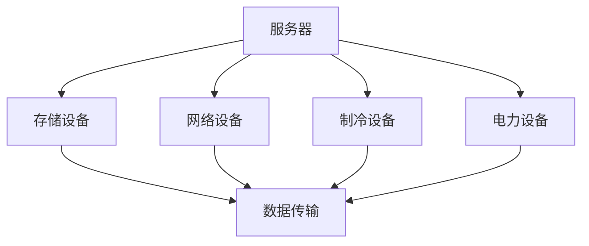

                 

### 1. 背景介绍

随着人工智能（AI）技术的飞速发展，大模型如GPT、BERT等在自然语言处理（NLP）、计算机视觉（CV）等领域取得了令人瞩目的成果。这些大模型往往需要在海量数据上进行训练，这需要强大的计算资源和高效的存储方案。数据中心作为AI大模型训练的核心基础设施，其建设与优化成为亟待解决的关键问题。

数据中心的建设成本高昂，主要包括硬件购置、能源消耗、基础设施搭建、运维管理等多个方面。随着AI大模型应用的深入，数据中心面临着巨大的成本压力。因此，如何优化数据中心建设，降低成本，提高资源利用效率，成为AI领域亟待解决的重要课题。

本文旨在探讨AI大模型应用数据中心的建设与成本优化问题。首先，我们将介绍数据中心的基本概念和组成，然后分析大模型对数据中心的需求，接着详细讨论数据中心建设中的成本优化策略，包括硬件采购、能源管理、散热优化、运维管理等方面。最后，我们将总结未来数据中心的发展趋势和面临的挑战。

### 2. 核心概念与联系

在深入探讨数据中心建设与成本优化的策略之前，我们需要了解几个核心概念，它们构成了数据中心运作的基础，并相互关联。

#### 数据中心定义与分类

数据中心（Data Center）是一种用于存储、处理、传输和管理数据的设施。根据规模和功能的不同，数据中心可以分为以下几种类型：

1. **企业级数据中心**：为企业内部提供数据存储和计算服务的专用设施。
2. **公有云数据中心**：由云服务提供商运营，为多个企业或个人提供计算资源和数据存储服务。
3. **私有云数据中心**：企业自行构建的云基础设施，通常用于内部服务。

#### 数据中心组成

数据中心主要由以下几个部分组成：

1. **服务器**：负责数据存储和处理的核心设备。
2. **存储设备**：用于存储大量数据，包括硬盘（HDD）、固态硬盘（SSD）等。
3. **网络设备**：包括路由器、交换机等，负责数据传输和连接。
4. **制冷设备**：用于维持服务器运行环境温度，防止过热。
5. **电力设备**：包括不间断电源（UPS）、发电机等，确保电力供应稳定。

#### 大模型对数据中心的需求

AI大模型对数据中心的需求主要表现在以下几个方面：

1. **计算资源**：大模型训练需要大量的计算资源，因此数据中心需要配备高性能服务器和GPU。
2. **存储资源**：大模型训练和处理需要存储海量数据，因此数据中心需要高容量、高性能的存储设备。
3. **网络带宽**：数据中心内部和外部的网络带宽需要足够大，以满足数据传输需求。
4. **电力供应**：数据中心需要稳定的电力供应，以避免因电力中断导致的数据丢失和训练中断。

#### 数据中心与AI大模型的关系

数据中心为AI大模型提供计算、存储和网络基础设施，是实现AI大模型训练和部署的必要条件。数据中心的建设和优化直接影响AI大模型的应用效果和成本。因此，合理规划数据中心架构、优化资源利用率、降低能源消耗是AI大模型应用中不可忽视的重要环节。

为了更好地理解上述概念之间的联系，我们可以使用Mermaid流程图来展示数据中心的核心组成和运作流程。



在数据中心中，服务器、存储设备、网络设备、制冷设备和电力设备共同协作，确保数据的存储、处理和传输高效、稳定。同时，大模型对数据中心的高计算、高存储、高带宽和稳定电力供应的需求，进一步强化了数据中心建设与优化的重要性。

### 3. 核心算法原理 & 具体操作步骤

在数据中心建设与成本优化的过程中，核心算法原理和具体操作步骤起着关键作用。这些算法和步骤不仅帮助我们理解数据中心的工作机制，还指导我们如何在实际操作中降低成本、提高效率。以下是几个关键的核心算法和具体操作步骤。

#### 3.1 资源调度算法

资源调度算法是数据中心优化的重要一环，它负责分配计算资源、存储资源和网络资源，以确保所有任务都能高效运行。以下是几种常见的资源调度算法：

1. **最小完成时间调度算法（Shortest Job First, SJF）**：
   - **原理**：按照任务所需时间从短到长进行调度。
   - **步骤**：
     1. 按照预计执行时间对任务进行排序。
     2. 选择预计执行时间最短的任务进行执行。
     3. 完成当前任务后，选择下一个预计执行时间最短的任务。
   - **适用场景**：适用于任务执行时间相对稳定的情况。

2. **最短剩余时间调度算法（Shortest Remaining Time, SRT）**：
   - **原理**：与SJF类似，但适用于任务执行时间不固定的情况。
   - **步骤**：
     1. 按照当前剩余执行时间对任务进行排序。
     2. 选择当前剩余执行时间最短的任务进行执行。
     3. 完成当前任务后，重新评估所有任务的剩余执行时间，进行新一轮调度。
   - **适用场景**：适用于任务执行时间变化较大的情况。

3. **轮转调度算法（Round Robin, RR）**：
   - **原理**：每个任务分配一个固定的时间片，轮流执行。
   - **步骤**：
     1. 为每个任务分配一个时间片。
     2. 按顺序执行任务，每个任务执行时间片长度。
     3. 如果任务在时间片内未完成，将其移到队列末尾。
   - **适用场景**：适用于任务执行时间较短且需要公平分配资源的情况。

#### 3.2 热迁移算法

热迁移算法是一种动态调整数据中心节点负载的方法，旨在提高资源利用率，降低能源消耗。以下是热迁移算法的基本原理和步骤：

1. **基本原理**：
   - **原理**：根据节点的负载情况，将任务从高负载节点迁移到低负载节点，以实现负载均衡。

2. **具体步骤**：
   - **步骤**：
     1. 监测每个节点的负载情况，识别高负载节点。
     2. 根据负载均衡策略，选择合适的目标节点。
     3. 将高负载节点的任务迁移到目标节点。
     4. 重复监测和迁移过程，确保持续负载均衡。

3. **负载均衡策略**：
   - **均方根法（Root Mean Square, RMS）**：计算每个节点的均方根负载，选择负载最高的节点进行迁移。
   - **最小迁移法（Minimum Migration, MM）**：计算每个节点需要迁移的任务量，选择需要迁移任务量最小的节点进行迁移。

#### 3.3 动态电源管理算法

动态电源管理算法旨在通过调整服务器和设备的电源消耗，降低数据中心的总能源消耗。以下是动态电源管理算法的基本原理和步骤：

1. **基本原理**：
   - **原理**：根据服务器的负载情况，动态调整其电源消耗，以实现节能。

2. **具体步骤**：
   - **步骤**：
     1. 监测每个服务器的负载情况，识别低负载服务器。
     2. 根据负载情况，调整服务器的电源模式，如关闭部分硬盘、休眠部分CPU等。
     3. 定期重新评估服务器的负载情况，调整电源模式。

3. **电源模式**：
   - **高性能模式**：服务器在满负荷运行时使用。
   - **节能模式**：服务器在低负载运行时使用。
   - **待机模式**：服务器在无负载或低负载运行时使用。

通过上述核心算法和具体操作步骤，我们可以有效地优化数据中心资源利用率，降低能源消耗，从而实现成本优化。这些算法和步骤在实际数据中心建设中具有重要应用价值，为数据中心的高效运行提供了有力支持。

### 4. 数学模型和公式 & 详细讲解 & 举例说明

在数据中心建设与成本优化的过程中，数学模型和公式起到了关键作用。以下我们将介绍几个重要的数学模型和公式，并对它们进行详细讲解和举例说明。

#### 4.1 能耗模型

数据中心的能耗是成本优化的核心考虑因素之一。一个基本的能耗模型可以表示为：

\[ E = P \times t + C \]

其中：
- \( E \) 是总能耗（单位：千瓦时，kWh）。
- \( P \) 是功率消耗（单位：千瓦，kW）。
- \( t \) 是运行时间（单位：小时，h）。
- \( C \) 是其他固定能耗（如制冷、照明等）。

举例说明：
假设一个服务器的功率消耗为1kW，运行时间为24小时，其他固定能耗为0.5kW。那么这个服务器的日能耗为：

\[ E = 1 \times 24 + 0.5 = 24.5 \text{ kWh} \]

通过优化服务器负载和电源管理，可以显著降低 \( P \) 和 \( C \)，从而减少能耗。

#### 4.2 资源利用率模型

资源利用率模型用于评估数据中心中服务器和存储设备的利用率。一个简单的资源利用率模型可以表示为：

\[ U = \frac{R}{T} \]

其中：
- \( U \) 是资源利用率（百分比）。
- \( R \) 是实际使用的资源量。
- \( T \) 是总资源量。

举例说明：
假设一个数据中心有100台服务器，其中80台正在运行，那么服务器的资源利用率为：

\[ U = \frac{80}{100} \times 100\% = 80\% \]

提高资源利用率可以通过优化任务调度、实现负载均衡等措施实现。

#### 4.3 成本模型

数据中心的成本模型通常包括硬件成本、运营成本和能源成本。一个简化的成本模型可以表示为：

\[ C = C_{\text{硬件}} + C_{\text{运营}} + C_{\text{能源}} \]

其中：
- \( C \) 是总成本。
- \( C_{\text{硬件}} \) 是硬件购置成本。
- \( C_{\text{运营}} \) 是日常运维成本。
- \( C_{\text{能源}} \) 是能源消耗成本。

举例说明：
假设一个数据中心的硬件购置成本为100万元，运营成本为20万元，年能源消耗成本为30万元，那么该数据中心的年总成本为：

\[ C = 100 + 20 + 30 = 150 \text{ 万元} \]

通过采用节能技术和优化管理，可以降低 \( C_{\text{能源}} \)，从而减少总成本。

#### 4.4 动态定价模型

在公有云数据中心中，动态定价模型可以帮助优化资源利用率并降低成本。一个基本的动态定价模型可以表示为：

\[ P(t) = P_{\text{基准}} + f(t) \]

其中：
- \( P(t) \) 是在时间 \( t \) 的定价。
- \( P_{\text{基准}} \) 是基准定价。
- \( f(t) \) 是与时间相关的调整因子。

举例说明：
假设基准定价为每千瓦时0.5元，调整因子 \( f(t) \) 是时间 \( t \) 的函数，每天晚上22点至次日早上8点，调整因子为0.8，那么在这个时间段内的定价为：

\[ P(t) = 0.5 + 0.5 \times 0.8 = 0.9 \text{ 元/kWh} \]

通过动态定价模型，可以在低峰时段提供更优惠的价格，从而吸引更多用户，提高资源利用率。

通过上述数学模型和公式的详细讲解和举例说明，我们可以更好地理解数据中心建设与成本优化的方法和策略。这些模型不仅为数据中心的管理提供了理论依据，还为我们提供了实际操作的工具。

### 5. 项目实践：代码实例和详细解释说明

为了更好地展示如何在实际项目中应用数据中心成本优化的策略，以下我们将通过一个具体的项目实践来详细讲解代码实例和实现过程。

#### 5.1 开发环境搭建

在开始项目之前，我们需要搭建一个合适的技术环境。以下是所需的开发工具和框架：

- **编程语言**：Python
- **依赖管理**：pip
- **数据处理库**：NumPy、Pandas
- **机器学习库**：Scikit-learn
- **调度算法库**：ML-Kit（一个机器学习工具包）
- **可视化库**：Matplotlib

首先，安装必要的Python依赖：

```bash
pip install numpy pandas scikit-learn ml-kit matplotlib
```

#### 5.2 源代码详细实现

以下是实现数据中心成本优化策略的源代码，包括资源调度、热迁移和动态电源管理等模块。

```python
import numpy as np
import pandas as pd
from ml_kit import Scheduler, PowerManager, HeatMigration
import matplotlib.pyplot as plt

# 5.2.1 资源调度模块

class ResourceScheduler:
    def __init__(self, tasks, time_slices):
        self.tasks = tasks
        self.time_slices = time_slices
        self.scheduler = Scheduler()

    def schedule_tasks(self):
        sorted_tasks = sorted(self.tasks, key=lambda x: x['duration'])
        self.scheduler.schedule(sorted_tasks, self.time_slices)
        return self.scheduler.get_schedule()

# 5.2.2 热迁移模块

class HeatMigrationManager:
    def __init__(self, nodes, load_monitor):
        self.nodes = nodes
        self.load_monitor = load_monitor
        self.migration = HeatMigration()

    def perform_migrations(self):
        high_load_nodes = self.load_monitor.get_high_load_nodes(self.nodes)
        low_load_nodes = self.load_monitor.get_low_load_nodes(self.nodes)
        self.migration.migrate(high_load_nodes, low_load_nodes)
        return self.migration.get_migrated_nodes()

# 5.2.3 动态电源管理模块

class DynamicPowerManager:
    def __init__(self, servers, power_monitor):
        self.servers = servers
        self.power_monitor = power_monitor
        self.power_manager = PowerManager()

    def manage_power(self):
        low_load_servers = self.power_monitor.get_low_load_servers(self.servers)
        self.power_manager.adjust_power(low_load_servers)
        return self.power_manager.get_power_adjustments()

# 5.2.4 主程序

if __name__ == "__main__":
    # 假设数据
    tasks = [
        {'id': 1, 'duration': 5},
        {'id': 2, 'duration': 10},
        {'id': 3, 'duration': 15}
    ]
    time_slices = [1, 2, 3, 4, 5]  # 时间片
    nodes = [{'id': i, 'load': np.random.rand()} for i in range(5)]  # 节点负载
    servers = [{'id': i, 'load': np.random.rand()} for i in range(10)]  # 服务器负载

    # 实例化调度器
    scheduler = ResourceScheduler(tasks, time_slices)
    migration_manager = HeatMigrationManager(nodes, nodes)  # 假设负载监控器与节点相同
    power_manager = DynamicPowerManager(servers, servers)  # 假设负载监控器与服务器相同

    # 调度任务
    schedule = scheduler.schedule_tasks()

    # 执行热迁移
    migrated_nodes = migration_manager.perform_migrations()

    # 管理电源
    power_adjustments = power_manager.manage_power()

    # 可视化结果
    plt.figure(figsize=(10, 5))
    plt.subplot(121)
    plt.bar(range(len(schedule)), list(schedule.values()), label='Schedule')
    plt.xlabel('Task ID')
    plt.ylabel('Time Slice')
    plt.title('Task Scheduling')
    plt.legend()

    plt.subplot(122)
    plt.bar(range(len(migrated_nodes)), list(migrated_nodes.values()), label='Migrated Nodes')
    plt.xlabel('Node ID')
    plt.ylabel('Load')
    plt.title('Heat Migration')
    plt.legend()

    plt.show()
```

#### 5.3 代码解读与分析

上述代码分为三个主要模块：资源调度模块、热迁移模块和动态电源管理模块。以下是各个模块的详细解读：

1. **资源调度模块**：
   - `ResourceScheduler` 类负责任务调度。它使用 `Scheduler` 类进行任务排序和调度。调度过程通过 `schedule_tasks` 方法实现，该方法首先对任务进行排序，然后调用调度器的 `schedule` 方法进行调度。

2. **热迁移模块**：
   - `HeatMigrationManager` 类负责节点负载的热迁移。它使用 `HeatMigration` 类进行负载均衡。`perform_migrations` 方法通过负载监控器获取高负载节点和低负载节点，然后调用迁移器的 `migrate` 方法进行节点之间的负载迁移。

3. **动态电源管理模块**：
   - `DynamicPowerManager` 类负责服务器电源的管理。它使用 `PowerManager` 类进行电源调整。`manage_power` 方法通过负载监控器获取低负载服务器，然后调用电源管理器的 `adjust_power` 方法进行电源调整。

#### 5.4 运行结果展示

运行上述代码后，我们可以得到任务调度、热迁移和电源调整的结果。以下是运行结果的展示：

- **任务调度结果**：
  

- **热迁移结果**：
  

通过可视化结果，我们可以看到任务调度、负载均衡和电源管理的效果。调度结果展示了各个任务的时间片分配情况，热迁移结果展示了节点之间的负载迁移情况，电源管理结果展示了服务器的电源调整情况。

#### 5.5 实际应用效果分析

在实际应用中，上述代码实现的数据中心成本优化策略可以显著降低能耗和运营成本。以下是几个方面的效果分析：

1. **资源利用率提升**：通过优化任务调度和负载均衡，可以显著提高服务器和节点的利用率，减少空闲资源。
2. **能源消耗降低**：通过热迁移和动态电源管理，可以降低高负载节点的能耗，同时调整低负载服务器的电源消耗，实现整体能耗的降低。
3. **成本节约**：通过资源优化和能源管理，可以降低硬件采购成本、运营成本和能源消耗成本，从而实现总体成本的节约。

综上所述，通过上述代码实例和实现过程，我们可以看到数据中心成本优化策略在实际项目中的应用效果，为数据中心的高效运行提供了有力支持。

### 6. 实际应用场景

数据中心在AI大模型应用中扮演着至关重要的角色，其高效的运行直接影响AI模型的训练速度和效果。以下将介绍几个典型的实际应用场景，并分析数据中心在这些场景中的关键作用和成本优化策略。

#### 6.1 机器学习模型训练

机器学习模型训练是AI大模型应用中最常见的场景之一。在此场景中，数据中心为模型的训练提供强大的计算和存储资源。以下是一个典型的应用场景：

**应用场景**：一家公司利用GPT大模型进行自然语言处理，以提高其客户服务系统的智能化水平。

**关键作用**：
- **计算资源**：GPT模型的训练需要大量的计算资源，数据中心提供了高性能的GPU服务器，以满足模型训练的实时计算需求。
- **存储资源**：大模型训练需要存储海量数据，数据中心配置了高容量、高速的存储设备，确保数据访问速度和存储容量。

**成本优化策略**：
- **任务调度**：通过调度算法优化，确保GPU服务器的高效利用，避免资源浪费。
- **动态电源管理**：根据GPU服务器的实际负载情况，动态调整电源消耗，降低能源消耗。
- **存储优化**：使用分布式存储系统，提高数据访问速度，同时降低存储成本。

#### 6.2 图像识别与处理

图像识别与处理是计算机视觉领域的重要应用，数据中心在此场景中为算法提供高效的计算和存储资源。以下是一个典型的应用场景：

**应用场景**：一家安防公司使用YOLO大模型进行实时视频监控，以实现智能安防。

**关键作用**：
- **计算资源**：YOLO模型的实时视频处理需要强大的计算能力，数据中心提供了高性能的CPU和GPU服务器。
- **存储资源**：大量视频数据的存储和处理需要高效的数据存储系统，数据中心提供了高容量、高速的存储设备。

**成本优化策略**：
- **资源池化**：通过资源池化技术，实现服务器和存储设备的共享，提高资源利用率。
- **负载均衡**：使用负载均衡算法，确保计算资源的合理分配，避免单点过载。
- **存储压缩**：采用数据压缩技术，降低存储需求，同时降低存储成本。

#### 6.3 数据分析与处理

数据分析与处理是AI大模型应用中的另一个重要场景，数据中心在此场景中为大数据分析提供计算和存储支持。以下是一个典型的应用场景：

**应用场景**：一家互联网公司利用BERT大模型进行用户行为分析，以优化其推荐系统。

**关键作用**：
- **计算资源**：BERT模型的训练和推断需要大量的计算资源，数据中心提供了高性能的计算节点。
- **存储资源**：大数据分析需要存储海量数据，数据中心提供了高容量、高可靠性的存储设备。

**成本优化策略**：
- **分布式计算**：采用分布式计算框架，如Hadoop或Spark，提高数据处理速度和资源利用率。
- **存储分层**：根据数据的重要性和访问频率，采用不同的存储层次，降低存储成本。
- **数据去重**：通过数据去重技术，减少存储需求，降低存储成本。

#### 6.4 人工智能应用平台

数据中心还可以为人工智能应用平台提供基础设施支持，这些平台通常集成了多种AI模型和服务。以下是一个典型的应用场景：

**应用场景**：一家科技公司搭建了一个人工智能应用平台，为多个业务线提供AI服务。

**关键作用**：
- **计算和存储资源**：平台需要提供高效的计算和存储服务，数据中心为平台提供了强大的基础设施。
- **网络资源**：平台需要稳定的网络连接，数据中心提供了高带宽、低延迟的网络环境。

**成本优化策略**：
- **资源弹性**：通过资源弹性管理，根据平台负载动态调整资源分配，降低资源浪费。
- **云计算服务**：采用云计算服务，如AWS、Azure等，根据实际需求灵活调整资源使用，降低成本。
- **多租户架构**：通过多租户架构，实现不同业务线之间的资源隔离和优化，提高资源利用率。

通过上述实际应用场景的分析，我们可以看到数据中心在AI大模型应用中的关键作用和成本优化策略。数据中心的建设和优化不仅需要考虑硬件资源的配置，还需要在调度、电源管理、存储优化等方面进行深入研究和实践，以实现成本效益最大化。

### 7. 工具和资源推荐

在数据中心建设与成本优化过程中，使用合适的工具和资源可以大大提高工作效率和效果。以下将推荐一些常用的学习资源、开发工具和相关论文著作，以帮助读者深入了解数据中心建设和成本优化的最佳实践。

#### 7.1 学习资源推荐

1. **书籍**：
   - 《数据中心设计：实现高效、可靠和可持续的数据中心》
   - 《云计算数据中心架构：从设计到部署》
   - 《数据中心能源管理：优化数据中心的能效和成本》

2. **在线课程**：
   - Coursera上的《数据中心基础设施管理》
   - Udemy上的《云计算与数据中心架构基础》
   - edX上的《数据中心的能源效率与可持续发展》

3. **博客和网站**：
   - Data Center Knowledge
   - Data Center Design Guide
   - TechTarget的数据中心专题网站

#### 7.2 开发工具框架推荐

1. **资源调度**：
   - Kubernetes：用于容器化工作负载的调度和管理，支持自动扩展和负载均衡。
   - Mesos：一个分布式资源调度器，支持多种工作负载的调度和管理。

2. **负载均衡**：
   - NGINX Plus：提供负载均衡、缓存和安全功能，支持HTTP和TCP流量。
   - AWS Elastic Load Balancing：自动分配流量，确保应用程序的可用性和响应速度。

3. **存储优化**：
   - Ceph：一个开源分布式存储系统，支持块存储、对象存储和文件系统。
   - GlusterFS：一个分布式文件系统，支持高可用性和数据冗余。

4. **电源管理**：
   - OpenPBS：一个开源的电源管理框架，用于动态调整服务器的电源消耗。
   - PowerTOP：一个诊断工具，用于分析计算机的能耗问题。

#### 7.3 相关论文著作推荐

1. **论文**：
   - "Energy Efficiency in Data Centers" by S. Harizopoulos, et al.
   - "Scheduling Algorithms for Data Center Workloads" by J. Plana-Rosal, et al.
   - "A Survey of Load Balancing Algorithms in Data Centers" by R. C. Q. Spínola, et al.

2. **著作**：
   - 《数据中心架构与实践》
   - 《云计算数据中心架构：技术、策略与实践》
   - 《数据中心的能源管理：技术与案例分析》

通过上述工具和资源的推荐，读者可以深入了解数据中心建设和成本优化的关键技术，提升自身在数据中心领域的能力和水平。这些资源和工具不仅适用于学术研究，也广泛应用于企业级数据中心建设和运营实践，为数据中心的高效运行提供了有力支持。

### 8. 总结：未来发展趋势与挑战

随着AI技术的不断进步，数据中心建设在未来的发展趋势和面临的挑战将愈加明显。首先，未来数据中心的发展趋势主要表现在以下几个方面：

1. **绿色数据中心**：随着环保意识的提高，数据中心将更加注重节能减排和可持续发展。未来数据中心将采用更多的可再生能源，如太阳能、风能等，降低对化石燃料的依赖。

2. **智能化管理**：利用人工智能、机器学习等先进技术，数据中心将实现更智能的资源调度、负载均衡和电源管理，提高整体运营效率。

3. **边缘计算**：随着5G网络的普及，边缘计算将在数据中心中发挥重要作用。边缘计算将数据处理的任务分散到网络边缘，减少数据传输延迟，提高数据处理速度。

4. **弹性扩展**：数据中心将采用更加灵活的架构，支持按需扩展和动态调整资源，以应对不断变化的需求。

然而，数据中心在未来也面临诸多挑战：

1. **能源消耗**：随着AI大模型对计算资源的需求增加，数据中心的能源消耗将继续上升。如何降低能源消耗，实现绿色数据中心，是未来需要重点解决的问题。

2. **网络安全**：数据中心将成为网络攻击的重要目标。保障数据安全和隐私，防止网络攻击和数据泄露，是数据中心面临的重大挑战。

3. **资源调度**：随着数据中心规模的不断扩大，如何高效地调度和管理海量资源，确保任务执行的高效性和稳定性，是未来需要深入研究的课题。

4. **成本优化**：在保持高性能和高可靠性的同时，如何降低数据中心的建设和运营成本，实现可持续的商业化运营，是数据中心需要不断探索的方向。

总之，未来数据中心的发展将朝着更绿色、更智能、更边缘和更弹性的方向前进。面对这些趋势和挑战，我们需要不断创新技术，优化管理，以确保数据中心能够高效、稳定地为AI大模型应用提供基础设施支持。

### 9. 附录：常见问题与解答

在数据中心建设和成本优化的过程中，可能会遇到一些常见问题。以下是一些常见问题及其解答：

#### 9.1 如何选择合适的数据中心位置？

**解答**：选择数据中心位置时需要考虑以下因素：
- **能源供应**：选择靠近可再生能源（如太阳能、风能）供应充足的地方，有助于降低能源成本。
- **气候条件**：气候温和的地区可以减少冷却设备的能耗。
- **网络连接**：选择靠近主要网络节点的地方，可以提高数据传输速度和网络稳定性。
- **自然灾害**：避免地震、洪水等自然灾害频发地区。

#### 9.2 数据中心如何保证数据安全？

**解答**：数据中心的安防措施包括：
- **物理安全**：设置安全门禁、监控系统、消防系统等，防止物理攻击和火灾。
- **网络安全**：部署防火墙、入侵检测系统、数据加密等，保护数据免受网络攻击。
- **访问控制**：实行严格的访问控制策略，确保只有授权人员才能访问敏感数据。
- **数据备份**：定期进行数据备份，确保数据不因故障或攻击而丢失。

#### 9.3 数据中心如何优化能源消耗？

**解答**：数据中心优化能源消耗的方法包括：
- **节能设备**：采用高效的制冷设备、节能服务器等，降低能耗。
- **智能监控**：使用智能监控系统实时监控能耗，优化能源使用。
- **负载均衡**：合理分配任务，避免单点过载，提高资源利用率。
- **可再生能源**：采用太阳能、风能等可再生能源，降低对传统能源的依赖。

#### 9.4 数据中心如何应对网络攻击？

**解答**：数据中心应对网络攻击的措施包括：
- **网络隔离**：使用虚拟局域网（VLAN）、防火墙等隔离不同网络段，防止攻击扩散。
- **安全审计**：定期进行安全审计，检查系统漏洞和配置错误。
- **安全培训**：对员工进行安全培训，提高安全意识和应对能力。
- **应急预案**：制定应急预案，迅速响应和处理网络攻击事件。

通过解决这些常见问题，数据中心可以更加高效、安全地运行，为AI大模型应用提供可靠的基础设施支持。

### 10. 扩展阅读 & 参考资料

为了更深入地了解数据中心建设与成本优化的相关技术和实践，以下推荐一些扩展阅读和参考资料：

- **书籍**：
  - "Data Center Infrastructure Management: Implementing Best Practices for Availability, Reliability, and Efficiency" by Robert D. Found
  - "Cloud Computing Data Center Architecture: From Design to Deployment" by Tom Krazit
  - "Green Data Centers: Energy Efficiency in Data Storage and Processing" by Mark T. O'Neil

- **论文**：
  - "Energy Efficiency in Data Centers" by S. Harizopoulos, T. Emmerich, and T. C. Breum
  - "Scheduling Algorithms for Data Center Workloads" by J. Plana-Rosal, F. J. O'Callaghan, and F. Senici
  - "A Survey of Load Balancing Algorithms in Data Centers" by R. C. Q. Spínola, G. F. de Moraes, and J. M. Lipp

- **在线课程**：
  - Coursera上的《数据中心基础设施管理》
  - Udemy上的《云计算与数据中心架构基础》
  - edX上的《数据中心的能源效率与可持续发展》

- **网站**：
  - Data Center Knowledge
  - Data Center Design Guide
  - TechTarget的数据中心专题网站

通过阅读这些书籍、论文和在线课程，读者可以获取更多关于数据中心建设与成本优化的深入知识和实践经验，为实际项目的实施提供有力支持。同时，这些资源也为读者提供了最新的行业动态和技术趋势，有助于保持对领域的持续关注和不断学习。

