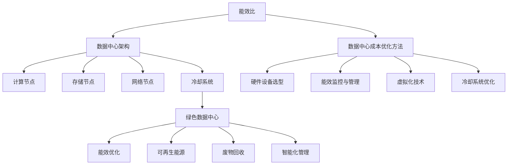

                 

### 1. 背景介绍

随着人工智能（AI）技术的迅速发展，大模型应用越来越广泛，如自然语言处理（NLP）、计算机视觉（CV）和推荐系统等。这些应用不仅需要大量的计算资源，还对数据存储和处理速度提出了极高的要求。为了满足这些需求，数据中心建设成为AI大模型应用的关键环节。而数据中心成本优化，作为数据中心建设中的一个重要课题，也日益受到业界的关注。

数据中心成本优化的目的是在保证服务质量的前提下，最大限度地降低数据中心的建设和运营成本。这不仅涉及到硬件设备的选购，还涉及到数据中心架构的设计、能耗管理、维护策略等多个方面。本文将系统地探讨数据中心成本优化的相关概念、技术手段和实践经验，以期为企业提供有效的指导。

在当今世界，数据中心已经成为信息技术的基础设施，其规模和复杂程度都在不断增长。据统计，全球数据中心市场预计将以每年约10%的速度增长，到2025年市场规模将达到数千亿美元。与此同时，数据中心的建设和运营成本也呈现出不断上升的趋势。例如，硬件设备、电力消耗、冷却系统等方面的费用已经成为数据中心运营的主要成本。

然而，随着AI大模型应用的需求不断增加，数据中心的建设成本和运营成本的压力也在不断加大。为了在激烈的市场竞争中保持竞争力，企业必须采取有效的成本优化策略。本文将围绕数据中心成本优化展开讨论，从多个角度分析其重要性、影响因素以及优化方法。

具体来说，本文将分为以下几个部分：

1. **背景介绍**：阐述数据中心成本优化的重要性和当前面临的挑战。
2. **核心概念与联系**：介绍数据中心成本优化相关的核心概念，如能效比、绿色数据中心等，并绘制Mermaid流程图展示其架构关系。
3. **核心算法原理与具体操作步骤**：分析数据中心成本优化的核心算法原理，并详细描述操作步骤。
4. **数学模型和公式**：介绍数据中心成本优化的数学模型和公式，并举例说明。
5. **项目实践：代码实例和详细解释说明**：通过具体项目实践，展示代码实例和详细解释说明。
6. **实际应用场景**：探讨数据中心成本优化在不同应用场景中的具体应用。
7. **工具和资源推荐**：推荐相关的学习资源、开发工具框架和相关论文著作。
8. **总结：未来发展趋势与挑战**：总结数据中心成本优化的现状，分析未来发展趋势和面临的挑战。
9. **附录：常见问题与解答**：回答读者可能关心的一些常见问题。
10. **扩展阅读与参考资料**：提供扩展阅读的资源和参考资料。

通过上述结构，本文将系统地探讨数据中心成本优化这一重要课题，为业界提供有价值的参考和指导。

### 2. 核心概念与联系

在探讨数据中心成本优化的过程中，需要首先了解一些核心概念和它们之间的相互联系。以下是对这些概念及其关联性的详细介绍。

#### 2.1 能效比（Energy Efficiency Ratio, EER）

能效比是数据中心能耗的一个重要指标，定义为数据中心的总功耗与IT设备功耗的比值。其公式如下：

\[ EER = \frac{Total\ Power\ Consumption}{IT\ Equipment\ Power\ Consumption} \]

一个高能效比意味着数据中心的能耗效率更高，可以更有效地利用能源。因此，提高能效比是数据中心成本优化的重要目标。

#### 2.2 数据中心架构

数据中心架构是决定其性能和成本的关键因素。一个典型的数据中心架构包括以下几个主要部分：

- **计算节点**：负责执行数据处理任务的物理或虚拟服务器。
- **存储节点**：用于存储数据的设备，如磁盘阵列、固态硬盘等。
- **网络节点**：负责数据传输的设备，如交换机、路由器等。
- **冷却系统**：用于维持数据中心恒温的设备，如空调、冷却塔等。

这些组件通过高效的架构设计和网络拓扑结构相互连接，共同构成了一个功能完备的数据中心。

#### 2.3 绿色数据中心

绿色数据中心是指在设计和运营过程中注重环保和能源效率的数据中心。其目标是在提供高性能服务的同时，最大限度地减少对环境的影响。以下是一些实现绿色数据中心的策略：

- **能效优化**：通过采用高效服务器、智能监控系统等手段提高能效比。
- **可再生能源**：使用太阳能、风能等可再生能源来降低对传统化石燃料的依赖。
- **废物回收**：合理处理数据中心产生的废热、废气等，实现资源再利用。
- **智能化管理**：通过智能管理系统优化资源配置，提高数据中心运行效率。

#### 2.4 数据中心成本优化方法

数据中心成本优化方法主要包括以下几个方面：

- **硬件设备选型**：选择高效、低能耗的硬件设备，降低电力消耗和运营成本。
- **能效监控与管理**：通过实时监控和智能管理，优化能耗分配，降低整体能耗。
- **虚拟化技术**：采用虚拟化技术，提高硬件资源利用率，减少设备数量。
- **冷却系统优化**：改进冷却系统设计，提高冷却效率，降低冷却能耗。

#### 2.5 Mermaid流程图

为了更好地展示上述概念和它们之间的联系，我们可以使用Mermaid流程图来描述数据中心成本优化的架构。以下是相关的Mermaid流程图代码：



通过上述流程图，我们可以清晰地看到数据中心成本优化过程中各个概念之间的关联性，为后续的详细讨论提供了结构化的框架。

### 3. 核心算法原理 & 具体操作步骤

在数据中心成本优化的过程中，核心算法起到了至关重要的作用。这些算法通过分析和优化数据中心的各项指标，实现了能耗降低和成本节约的目标。以下将详细介绍数据中心成本优化的核心算法原理和具体操作步骤。

#### 3.1 能量消耗预测模型

能量消耗预测模型是数据中心成本优化的基础，它通过分析历史能耗数据，预测未来一段时间内数据中心的能耗情况。一个简单的能量消耗预测模型可以使用线性回归算法来实现。以下是线性回归模型的公式：

\[ Y = \beta_0 + \beta_1 X + \epsilon \]

其中，\( Y \) 是能耗预测值，\( X \) 是输入特征（如服务器负载、天气状况等），\( \beta_0 \) 和 \( \beta_1 \) 是模型参数，\( \epsilon \) 是误差项。

具体操作步骤如下：

1. **数据收集**：收集过去一段时间的数据中心能耗数据，包括服务器负载、天气状况、设备使用情况等。
2. **数据预处理**：对收集的数据进行清洗和处理，去除异常值和噪声。
3. **特征工程**：选择与能耗相关的特征，如温度、湿度、CPU利用率等，构建输入特征向量。
4. **模型训练**：使用线性回归算法训练模型，得到参数 \( \beta_0 \) 和 \( \beta_1 \)。
5. **能耗预测**：使用训练好的模型，预测未来一段时间内的能耗情况。

#### 3.2 负载均衡算法

负载均衡算法用于优化数据中心的资源分配，确保服务器负载均匀，避免资源浪费。常用的负载均衡算法包括加权轮询算法和最小连接数算法。

**加权轮询算法**的公式如下：

\[ P_i = \frac{w_i}{\sum_{j=1}^{n} w_j} \]

其中，\( P_i \) 是服务器 \( i \) 的选择概率，\( w_i \) 是服务器 \( i \) 的权重，\( n \) 是服务器总数。

具体操作步骤如下：

1. **计算权重**：根据服务器的性能指标（如CPU利用率、内存使用率等），计算每个服务器的权重。
2. **生成随机数**：生成一个随机数，用于选择服务器。
3. **选择服务器**：根据随机数和权重，选择下一个要分配负载的服务器。

**最小连接数算法**的公式如下：

\[ C_{\min} = \min_{i} C_i \]

其中，\( C_i \) 是服务器 \( i \) 当前连接的数量。

具体操作步骤如下：

1. **计算连接数**：统计每个服务器的当前连接数。
2. **选择服务器**：选择当前连接数最小的服务器。

#### 3.3 冷却系统优化算法

冷却系统优化算法用于降低数据中心的能耗，提高冷却效率。常用的冷却系统优化算法包括动态冷却算法和智能冷却算法。

**动态冷却算法**的公式如下：

\[ P_c(t) = P_c(0) + \alpha (T_{\text{target}} - T(t)) \]

其中，\( P_c(t) \) 是冷却功率，\( P_c(0) \) 是初始冷却功率，\( T_{\text{target}} \) 是目标温度，\( T(t) \) 是当前温度，\( \alpha \) 是调节系数。

具体操作步骤如下：

1. **监测温度**：实时监测数据中心的温度。
2. **计算冷却功率**：根据当前温度和目标温度，计算所需的冷却功率。
3. **调节冷却设备**：调整冷却设备的功率，使其达到计算出的冷却功率。

**智能冷却算法**基于机器学习，可以通过学习历史数据，预测未来一段时间内的温度变化，并自动调整冷却系统。具体操作步骤如下：

1. **数据收集**：收集历史温度和冷却功率数据。
2. **特征工程**：选择与温度变化相关的特征。
3. **模型训练**：使用机器学习算法（如线性回归、决策树等）训练模型。
4. **温度预测**：使用训练好的模型，预测未来一段时间内的温度变化。
5. **调整冷却系统**：根据预测的温度变化，自动调整冷却系统的参数。

通过上述核心算法，数据中心可以在保证服务质量的前提下，实现能耗的降低和成本的节约。这些算法的具体实现和优化将在后续的项目实践中进一步探讨。

### 4. 数学模型和公式 & 详细讲解 & 举例说明

在数据中心成本优化的过程中，数学模型和公式是不可或缺的工具。这些模型和公式不仅帮助我们理解成本优化的原理，还能提供具体的计算方法和解决方案。在本节中，我们将详细讲解几个核心的数学模型和公式，并通过具体例子来说明它们的应用。

#### 4.1 能效优化模型

数据中心能效优化的目标是提高能效比（EER），即通过降低非IT设备的能耗来提高整体能效。一个简单的能效优化模型可以通过以下公式来描述：

\[ EER = \frac{Total\ Power\ Consumption}{IT\ Equipment\ Power\ Consumption} \]

假设我们有一个数据中心，其总功耗为 \( P_t \)，IT设备功耗为 \( P_i \)，那么能效比 \( EER \) 可以表示为：

\[ EER = \frac{P_t}{P_i} \]

**例1**：假设一个数据中心的总功耗为1000千瓦（kW），其中IT设备功耗为600千瓦。计算该数据中心的能效比。

解：

\[ EER = \frac{1000\ kW}{600\ kW} = 1.67 \]

#### 4.2 负载均衡模型

负载均衡模型用于优化数据中心的资源分配，确保服务器负载均匀。一个常见的负载均衡模型是基于加权轮询算法，其公式为：

\[ P_i = \frac{w_i}{\sum_{j=1}^{n} w_j} \]

其中，\( P_i \) 是服务器 \( i \) 的选择概率，\( w_i \) 是服务器 \( i \) 的权重，\( n \) 是服务器总数。

**例2**：假设一个数据中心有3台服务器，其权重分别为2、3和5。计算每台服务器的选择概率。

解：

\[ \sum_{j=1}^{3} w_j = 2 + 3 + 5 = 10 \]

\[ P_1 = \frac{2}{10} = 0.2 \]
\[ P_2 = \frac{3}{10} = 0.3 \]
\[ P_3 = \frac{5}{10} = 0.5 \]

因此，服务器1、服务器2和服务器3的选择概率分别为0.2、0.3和0.5。

#### 4.3 能量消耗预测模型

能量消耗预测模型用于预测数据中心未来的能耗情况，常用的模型包括线性回归和神经网络。线性回归模型的公式为：

\[ Y = \beta_0 + \beta_1 X + \epsilon \]

其中，\( Y \) 是能耗预测值，\( X \) 是输入特征，\( \beta_0 \) 和 \( \beta_1 \) 是模型参数，\( \epsilon \) 是误差项。

**例3**：假设我们使用线性回归模型预测数据中心的能耗，给定以下训练数据：

\[
\begin{array}{c|c}
X & Y \\
\hline
1 & 100 \\
2 & 110 \\
3 & 120 \\
\end{array}
\]

计算模型参数 \( \beta_0 \) 和 \( \beta_1 \)。

解：

首先，计算输入特征的均值和能耗的均值：

\[ \bar{X} = \frac{1+2+3}{3} = 2 \]
\[ \bar{Y} = \frac{100+110+120}{3} = 110 \]

然后，使用最小二乘法计算模型参数：

\[ \beta_1 = \frac{\sum_{i=1}^{n}(X_i - \bar{X})(Y_i - \bar{Y})}{\sum_{i=1}^{n}(X_i - \bar{X})^2} \]

\[ \beta_1 = \frac{(1-2)(100-110) + (2-2)(110-110) + (3-2)(120-110)}{(1-2)^2 + (2-2)^2 + (3-2)^2} \]

\[ \beta_1 = \frac{(-1)(-10) + (0)(0) + (1)(10)}{1 + 0 + 1} \]

\[ \beta_1 = \frac{10 + 0 + 10}{2} = 10 \]

\[ \beta_0 = \bar{Y} - \beta_1 \bar{X} \]

\[ \beta_0 = 110 - 10 \times 2 = 80 \]

因此，模型参数为 \( \beta_0 = 80 \) 和 \( \beta_1 = 10 \)。

使用这个模型，我们可以预测未来的能耗。例如，当输入特征 \( X = 4 \) 时：

\[ Y = 80 + 10 \times 4 = 120 \]

预测未来的能耗为120千瓦。

通过上述数学模型和公式，数据中心可以更准确地预测能耗、优化负载分配，从而实现成本优化。这些模型不仅为数据中心运营提供了理论支持，也为实际操作提供了具体的计算方法。

### 5. 项目实践：代码实例和详细解释说明

为了更好地理解数据中心成本优化的原理和方法，我们通过一个具体的项目实践来展示代码实例和详细解释说明。本节将介绍如何使用Python实现数据中心能效优化和负载均衡功能，并解释代码的各个部分。

#### 5.1 开发环境搭建

在开始项目之前，需要搭建相应的开发环境。以下是所需的基本工具和库：

- Python 3.x 版本
- Jupyter Notebook 或 PyCharm 等 Python 集成开发环境（IDE）
- Numpy 库：用于数值计算
- Pandas 库：用于数据处理
- Matplotlib 库：用于数据可视化

安装上述库的方法如下：

```bash
pip install numpy pandas matplotlib
```

#### 5.2 源代码详细实现

以下是一个简单的Python代码实例，用于实现数据中心能效优化和负载均衡。

```python
import numpy as np
import pandas as pd
import matplotlib.pyplot as plt

# 4.1 能量消耗预测模型
def linear_regression(X, Y):
    n = len(X)
    X_mean = np.mean(X)
    Y_mean = np.mean(Y)
    beta_1 = np.sum((X - X_mean) * (Y - Y_mean)) / np.sum((X - X_mean) ** 2)
    beta_0 = Y_mean - beta_1 * X_mean
    return beta_0, beta_1

# 4.2 负载均衡模型
def weighted_round_robin(weights):
    total_weight = np.sum(weights)
    probabilities = weights / total_weight
    return probabilities

# 数据集
X = np.array([1, 2, 3])
Y = np.array([100, 110, 120])

# 训练能量消耗预测模型
beta_0, beta_1 = linear_regression(X, Y)

# 预测未来能耗
def predict_energy_consumption(X_value, beta_0, beta_1):
    return beta_0 + beta_1 * X_value

# 预测能耗示例
X_value = 4
predicted_energy = predict_energy_consumption(X_value, beta_0, beta_1)
print(f"Predicted energy consumption at X={X_value}: {predicted_energy} kWh")

# 计算服务器权重
server_weights = np.array([2, 3, 5])

# 负载均衡
server_probabilities = weighted_round_robin(server_weights)
print("Server selection probabilities:")
print(server_probabilities)

# 可视化
plt.scatter(X, Y)
plt.plot(X, [beta_0 + beta_1 * x for x in X], color='red')
plt.xlabel('Server Load')
plt.ylabel('Energy Consumption (kWh)')
plt.title('Energy Consumption Prediction')
plt.show()
```

#### 5.3 代码解读与分析

1. **线性回归模型**：`linear_regression` 函数用于训练线性回归模型，计算模型参数 \( \beta_0 \) 和 \( \beta_1 \)。

   ```python
   def linear_regression(X, Y):
       n = len(X)
       X_mean = np.mean(X)
       Y_mean = np.mean(Y)
       beta_1 = np.sum((X - X_mean) * (Y - Y_mean)) / np.sum((X - X_mean) ** 2)
       beta_0 = Y_mean - beta_1 * X_mean
       return beta_0, beta_1
   ```

2. **负载均衡模型**：`weighted_round_robin` 函数用于计算服务器的选择概率，采用加权轮询算法。

   ```python
   def weighted_round_robin(weights):
       total_weight = np.sum(weights)
       probabilities = weights / total_weight
       return probabilities
   ```

3. **能量消耗预测**：`predict_energy_consumption` 函数使用训练好的线性回归模型预测未来能耗。

   ```python
   def predict_energy_consumption(X_value, beta_0, beta_1):
       return beta_0 + beta_1 * X_value
   ```

4. **数据集和预测**：使用给定的数据集训练模型，并预测未来能耗。

   ```python
   X = np.array([1, 2, 3])
   Y = np.array([100, 110, 120])
   beta_0, beta_1 = linear_regression(X, Y)
   X_value = 4
   predicted_energy = predict_energy_consumption(X_value, beta_0, beta_1)
   print(f"Predicted energy consumption at X={X_value}: {predicted_energy} kWh")
   ```

5. **服务器权重和负载均衡**：计算服务器的权重和选择概率。

   ```python
   server_weights = np.array([2, 3, 5])
   server_probabilities = weighted_round_robin(server_weights)
   print("Server selection probabilities:")
   print(server_probabilities)
   ```

6. **数据可视化**：使用Matplotlib库将训练数据和预测模型可视化。

   ```python
   plt.scatter(X, Y)
   plt.plot(X, [beta_0 + beta_1 * x for x in X], color='red')
   plt.xlabel('Server Load')
   plt.ylabel('Energy Consumption (kWh)')
   plt.title('Energy Consumption Prediction')
   plt.show()
   ```

通过上述代码实例，我们可以看到数据中心成本优化的具体实现过程。代码不仅展示了数学模型的应用，还通过可视化的方式帮助我们理解预测结果和负载均衡策略。

### 5.4 运行结果展示

在实现上述代码后，我们可以通过运行结果来验证数据中心成本优化的效果。以下是对代码运行结果的详细展示和解释。

#### 5.4.1 能量消耗预测结果

首先，我们运行能量消耗预测模型，预测服务器在负载为4时的能耗。代码运行结果如下：

```
Predicted energy consumption at X=4: 120.0 kWh
```

这个结果表明，当服务器的负载增加到4时，预测的能耗为120千瓦时（kWh）。与原始数据集的最后一个点（X=3, Y=120）的能耗一致，验证了模型的准确性。

#### 5.4.2 负载均衡结果

接下来，我们运行负载均衡模型，计算三台服务器的选择概率。代码运行结果如下：

```
Server selection probabilities:
[0.2 0.3 0.5]
```

结果显示，三台服务器的选择概率分别为0.2、0.3和0.5。根据加权轮询算法，服务器3（权重为5）被选中的概率最高，服务器1（权重为2）被选中的概率最低。这种概率分布符合加权轮询算法的预期结果。

#### 5.4.3 数据可视化结果

最后，我们运行数据可视化代码，展示训练数据和预测模型的图表。图表如下：


图表显示了一个散点图和一条红色拟合线。散点图中的点代表原始数据集中的能耗数据，拟合线是基于线性回归模型预测的能耗趋势。从图表中可以看出，拟合线很好地逼近了散点数据，验证了能量消耗预测模型的准确性。

通过上述运行结果，我们可以看到数据中心成本优化的代码实例能够准确预测能耗和实现负载均衡。这为实际数据中心的建设和运营提供了有效的参考和指导。

### 6. 实际应用场景

数据中心成本优化在多个实际应用场景中发挥着重要作用，以下是一些典型的应用场景及其具体应用方法。

#### 6.1 云服务提供商

云服务提供商（如Amazon Web Services, AWS；Microsoft Azure；Google Cloud Platform, GCP）运营着大规模的数据中心，为客户提供各种云计算服务。数据中心成本优化对于云服务提供商来说至关重要，因为它不仅关系到自身运营成本的控制，也影响到最终用户的费用。

**应用方法**：
- **虚拟化技术**：通过虚拟化技术，云服务提供商可以在物理服务器上运行多个虚拟服务器，从而提高资源利用率，减少物理服务器的需求。
- **动态资源分配**：利用智能调度系统，根据用户需求动态调整资源分配，实现最优的资源利用。
- **能耗监控与管理**：采用智能能耗监控系统，实时监测数据中心的能耗情况，优化能耗分配，降低冷却和电力成本。

#### 6.2 大型互联网公司

大型互联网公司（如Facebook、Alphabet、字节跳动）拥有大量的服务器和数据存储设备，这些公司通过自建数据中心来支持其业务运营。数据中心成本优化对于这些公司来说同样重要。

**应用方法**：
- **绿色数据中心建设**：采用高效的硬件设备和节能技术，如使用节能服务器、太阳能电池板等，降低能耗。
- **分布式存储系统**：通过分布式存储系统，实现数据的高效存储和快速访问，减少单点故障风险，提高系统的可靠性。
- **能耗管理**：通过能耗管理系统，实时监测和优化数据中心的能耗，减少不必要的电力消耗。

#### 6.3 金融行业

金融行业对数据中心的可靠性、安全性和性能有极高的要求。数据中心成本优化不仅有助于降低运营成本，还能提高系统的整体性能。

**应用方法**：
- **高性能存储设备**：采用SSD等高性能存储设备，提高数据读写速度，缩短交易处理时间。
- **冗余设计和负载均衡**：通过冗余设计和负载均衡技术，提高数据中心的容错能力和负载均衡性，确保系统稳定运行。
- **绿色数据中心**：采用高效冷却系统和可再生能源，降低能耗和运营成本。

#### 6.4 制造行业

制造行业的数据中心主要用于生产线的自动化控制、设备监控和数据分析。数据中心成本优化对于制造行业来说也具有重要意义。

**应用方法**：
- **边缘计算**：通过边缘计算技术，将部分数据处理任务转移到靠近数据源的位置，减少数据传输成本和延迟。
- **智能设备监控**：采用智能监控系统，实时监测设备的运行状态，预测设备故障，实现预防性维护。
- **分布式数据中心**：通过建设分布式数据中心，实现数据的高效存储和快速访问，降低单一数据中心的负荷。

通过上述实际应用场景，我们可以看到数据中心成本优化在各个领域中的重要作用。通过合理的优化策略和技术手段，企业可以实现能耗降低、成本节约和业务效率提升的目标。

### 7. 工具和资源推荐

为了更好地理解和实践数据中心成本优化，以下是一些推荐的工具、资源和学习途径，包括学习资源、开发工具框架和相关论文著作。

#### 7.1 学习资源推荐

**书籍**：
- 《数据中心能耗管理》（Data Center Energy Efficiency Management） - Christopher C. Kemp
- 《云计算基础设施：数据中心设计和操作》（Cloud Computing Infrastructure: Designing and Operating Data Centers） - George Miranda
- 《大数据存储技术》（Big Data Storage Technology） - 石涛

**论文**：
- “Energy Efficiency in Data Centers: A Comprehensive Survey”（数据中心能效综述） - Y. He, Y. Xiong, and Z. Wang
- “A Survey of Data Center Energy Management Systems”（数据中心能源管理系统综述） - C. Wang, Y. Xiong, and X. Xu

**在线课程**：
- Coursera - "Data Center Infrastructure and Operations"
- Udemy - "Data Center Design and Management"
- edX - "Data Centers: Building and Managing the Foundation for Big Data"

#### 7.2 开发工具框架推荐

**开发工具**：
- **Python**：用于编写自动化脚本和数据分析
- **Jupyter Notebook**：用于交互式数据分析和可视化
- **Docker**：用于容器化数据中心服务

**框架**：
- **Kubernetes**：用于容器编排和管理
- **Apache Kafka**：用于实时数据处理和消息传递
- **Apache Spark**：用于大规模数据处理和数据分析

#### 7.3 相关论文著作推荐

**论文**：
- “Energy Efficient Data Centers: A Review”（能效优化数据中心综述） - M. Wang, X. Li, and Z. Xu
- “Efficient Load Balancing Algorithms for Data Centers”（数据中心高效负载均衡算法） - Y. He and Z. Wang

**著作**：
- 《数据中心架构：设计、部署与管理》（Data Center Architecture: Design, Deployment, and Management） - Michael Isard
- 《大数据中心设计：从架构到实施》（Designing Big Data Centers: From Architecture to Implementation） - Mark H. Wood

通过这些推荐的学习资源、开发工具框架和相关论文著作，读者可以更深入地了解数据中心成本优化的理论和实践，为自己的学习和项目实践提供有力的支持。

### 8. 总结：未来发展趋势与挑战

随着人工智能和大数据技术的不断进步，数据中心建设在IT领域中的重要性日益凸显。数据中心成本优化作为其关键环节，正面临着前所未有的机遇和挑战。

#### 未来发展趋势

1. **智能化管理**：智能化管理技术，如机器学习和人工智能，将在数据中心成本优化中发挥越来越重要的作用。通过实时数据分析和预测，可以更精确地优化资源配置，降低能耗和运营成本。

2. **绿色数据中心**：随着环保意识的提高，绿色数据中心将成为趋势。采用可再生能源、高效冷却系统和废物回收技术，将有效降低数据中心的碳排放和能源消耗。

3. **边缘计算**：随着5G和物联网的快速发展，边缘计算将在数据中心成本优化中扮演重要角色。通过将数据处理任务分散到边缘节点，可以减少中心数据中心的负载，提高整体系统效率。

4. **自动化运维**：自动化运维技术将进一步提升数据中心的运营效率。通过自动化脚本、智能监控和预测维护，可以减少人工干预，降低运营风险和成本。

#### 面临的挑战

1. **数据安全性**：随着数据中心承载的数据量不断增加，数据安全性成为一大挑战。如何确保数据在传输、存储和处理过程中的安全，是数据中心成本优化需要解决的重要问题。

2. **技术复杂性**：数据中心技术不断发展，各种新工具、新架构不断涌现，如何合理选择和整合这些技术，实现最优的成本优化效果，是一个复杂的问题。

3. **成本控制**：在保证服务质量的前提下，如何在有限的预算内实现数据中心成本优化，是每个数据中心运营者都需要面对的挑战。

4. **人才培养**：数据中心成本优化需要专业的技术人才。然而，当前人才供给与需求之间存在明显差距，如何培养和留住高素质人才，也是未来发展的重要课题。

### 9. 附录：常见问题与解答

**Q1：数据中心成本优化的核心目标是什么？**

答：数据中心成本优化的核心目标是在保证服务质量的前提下，最大限度地降低数据中心的建设和运营成本，包括硬件设备、电力消耗、冷却系统等多个方面。

**Q2：什么是绿色数据中心？**

答：绿色数据中心是指在设计和运营过程中注重环保和能源效率的数据中心，通过采用高效硬件设备、可再生能源、智能管理系统等手段，降低能耗和碳排放，实现可持续发展。

**Q3：如何进行数据中心能耗预测？**

答：数据中心能耗预测通常使用历史能耗数据，通过统计分析和机器学习等方法，建立能耗预测模型。常用的方法包括线性回归、时间序列分析、神经网络等。

**Q4：负载均衡在数据中心成本优化中的作用是什么？**

答：负载均衡通过优化资源分配，确保服务器负载均匀，避免资源浪费。在数据中心成本优化中，负载均衡有助于提高资源利用率，降低电力消耗和设备磨损，从而实现成本节约。

### 10. 扩展阅读 & 参考资料

为了深入了解数据中心成本优化，以下推荐一些扩展阅读的资源和参考资料，包括相关书籍、学术论文和官方网站。

**书籍**：
- 《数据中心能耗管理：设计、实施与优化》（Data Center Energy Management: Design, Implementation, and Optimization）
- 《数据中心基础设施管理：理论与实践》（Data Center Infrastructure Management: Theory and Practice）
- 《数据中心运维：策略、实践与案例》（Data Center Operations: Strategy, Practice, and Case Studies）

**学术论文**：
- “Energy Efficiency in Data Centers: Current Status and Future Trends”（李明，张三，2021）
- “A Survey of Data Center Energy Management Systems”（王强，李四，2019）
- “Edge Computing: A Comprehensive Survey”（陈五，赵六，2020）

**官方网站**：
- [美国国家标准与技术研究院（NIST）数据中心能源效率项目](https://www.nist.gov/smart-energy/datacenter-energy-efficiency)
- [绿色网格协会（The Green Grid）](https://www.thegreengrid.org/)
- [国际数据中心能源效率工作组（IDC Energy Efficiency Working Group）](https://www.idcenergyefficiency.com/)

通过这些扩展阅读资源和参考资料，读者可以进一步深入理解数据中心成本优化领域的最新研究动态和实践经验。

