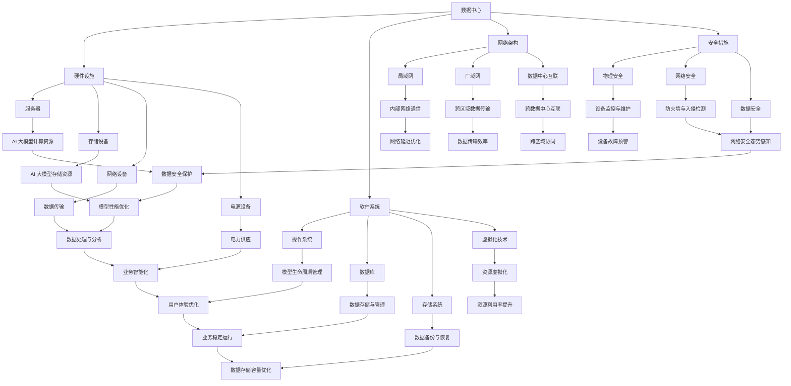

                 

### 文章标题

**AI 大模型应用数据中心建设：数据中心成本优化与效率提升**

> **关键词**：数据中心，AI 大模型，成本优化，效率提升，架构设计

> **摘要**：本文探讨了 AI 大模型在数据中心中的应用，重点分析了数据中心成本优化与效率提升的策略。通过详细的算法原理、具体操作步骤、数学模型以及实际应用场景的解读，为数据中心的建设与运维提供了科学指导。同时，文章推荐了相关工具和资源，以期为从业者提供实践参考。文章旨在为人工智能与数据中心领域的研究者、开发者提供有价值的参考。

---

### 1. 背景介绍

#### 1.1 AI 大模型与数据中心的关系

随着人工智能技术的迅猛发展，AI 大模型如雨后春笋般涌现。这些模型在图像识别、自然语言处理、推荐系统等领域展现了强大的性能，极大地推动了各行各业的数字化转型。然而，AI 大模型的训练与推理需要庞大的计算资源和存储资源，这为数据中心的建设和运维提出了新的挑战。

数据中心作为 AI 大模型的重要基础设施，不仅要满足大规模数据存储和高速计算的需求，还要考虑成本优化与效率提升。因此，如何建设高效、低成本的数据中心成为业界关注的焦点。

#### 1.2 数据中心成本优化的必要性

数据中心成本优化的必要性体现在以下几个方面：

1. **成本控制**：随着 AI 大模型的普及，数据中心的建设和运维成本逐年增加。成本优化有助于企业控制成本，提升盈利能力。

2. **资源利用率**：数据中心中存在大量的闲置资源和低效利用，通过优化资源配置，可以提高资源利用率，减少浪费。

3. **可持续发展**：数据中心能耗巨大，优化成本有助于减少能源消耗，降低对环境的影响，实现可持续发展。

4. **市场竞争**：在激烈的市场竞争中，低成本、高效能的数据中心可以为企业提供竞争优势，吸引更多客户。

#### 1.3 数据中心效率提升的重要性

数据中心效率提升的重要性主要体现在以下几个方面：

1. **响应速度**：高效的数据中心能够快速响应用户请求，提升用户体验。

2. **服务质量**：数据中心效率提升可以确保数据服务的稳定性和可靠性，提高服务质量。

3. **运维成本**：通过提高数据中心效率，可以减少人工运维成本，降低运营风险。

4. **创新能力**：高效的数据中心有助于企业快速迭代创新，推动业务发展。

---

### 2. 核心概念与联系

#### 2.1 数据中心核心概念

数据中心（Data Center）是指为存储、处理、传输和管理数据的专用设施。其核心概念包括：

1. **硬件设施**：包括服务器、存储设备、网络设备、电源设备等。

2. **软件系统**：包括操作系统、数据库、存储系统、虚拟化技术等。

3. **网络架构**：包括局域网、广域网、数据中心之间的互联网络等。

4. **安全措施**：包括物理安全、网络安全、数据安全等。

#### 2.2 AI 大模型核心概念

AI 大模型（Artificial Intelligence Large Model）是指通过深度学习等技术训练得到的规模庞大的神经网络模型。其核心概念包括：

1. **神经网络**：神经网络是 AI 大模型的基础，通过多层神经元之间的连接，实现数据的处理和预测。

2. **训练数据**：训练数据是 AI 大模型训练的关键，数据质量和数量直接影响模型的性能。

3. **优化算法**：优化算法用于调整模型参数，以最小化损失函数，提高模型性能。

4. **推理过程**：推理过程是指模型在给定输入数据时，通过计算得到输出结果的过程。

#### 2.3 数据中心与 AI 大模型的关系

数据中心与 AI 大模型之间存在密切的联系，具体表现为：

1. **硬件资源**：数据中心提供 AI 大模型所需的计算资源和存储资源。

2. **数据传输**：数据中心通过网络架构实现数据的存储和传输，支持 AI 大模型的训练和推理。

3. **安全性**：数据中心提供安全措施，保护 AI 大模型和数据的安全。

4. **运维管理**：数据中心通过软件系统实现 AI 大模型的生命周期管理，包括训练、推理、部署等。

#### 2.4 Mermaid 流程图

下面是数据中心与 AI 大模型关系的 Mermaid 流程图：



---

### 3. 核心算法原理 & 具体操作步骤

#### 3.1 核心算法原理

数据中心成本优化与效率提升的核心算法主要包括以下几个方面：

1. **资源调度算法**：通过优化资源分配，提高资源利用率。

2. **能耗优化算法**：通过优化能耗管理，降低数据中心能耗。

3. **数据传输优化算法**：通过优化数据传输路径，提高数据传输效率。

4. **故障预测与维护算法**：通过预测设备故障，提前进行维护，减少故障对数据中心的影响。

#### 3.2 具体操作步骤

下面以资源调度算法为例，详细讲解具体操作步骤：

1. **数据采集**：采集数据中心各类硬件设备的运行数据，如CPU利用率、内存使用率、存储容量等。

2. **数据预处理**：对采集到的数据进行分析和处理，去除噪声和异常值，保证数据质量。

3. **资源建模**：根据采集到的数据，建立资源模型，包括CPU、内存、存储等资源的容量和使用情况。

4. **目标函数定义**：定义目标函数，如最大化资源利用率、最小化能耗等。

5. **约束条件设置**：设置资源调度算法的约束条件，如CPU利用率不能超过100%、内存使用率不能超过80%等。

6. **算法实现**：采用遗传算法、粒子群算法等优化算法，实现资源调度。

7. **模型评估**：通过模型评估，验证资源调度算法的有效性，如资源利用率是否提高、能耗是否降低等。

8. **模型优化**：根据评估结果，对资源调度算法进行优化，提高模型性能。

9. **模型部署**：将优化后的资源调度算法部署到数据中心，进行实际运行。

10. **持续监控与迭代**：对数据中心运行情况进行持续监控，根据运行数据，对模型进行迭代优化。

---

### 4. 数学模型和公式 & 详细讲解 & 举例说明

#### 4.1 数学模型和公式

数据中心成本优化与效率提升的数学模型主要包括以下几个方面：

1. **资源利用率模型**：

   $$U = \frac{R_{\text{used}}}{R_{\text{total}}}$$

   其中，$U$ 表示资源利用率，$R_{\text{used}}$ 表示已使用资源，$R_{\text{total}}$ 表示总资源。

2. **能耗模型**：

   $$E = P \times t$$

   其中，$E$ 表示能耗，$P$ 表示功率，$t$ 表示运行时间。

3. **数据传输效率模型**：

   $$E_{\text{trans}} = \frac{D}{t}$$

   其中，$E_{\text{trans}}$ 表示数据传输效率，$D$ 表示数据传输量，$t$ 表示传输时间。

4. **故障预测模型**：

   $$F = \frac{1}{1 + e^{-\beta \cdot (X - \theta)}}$$

   其中，$F$ 表示故障概率，$X$ 表示设备状态特征，$\theta$ 表示模型参数，$\beta$ 表示模型参数。

#### 4.2 详细讲解

1. **资源利用率模型**：

   资源利用率模型用于衡量数据中心各类资源的利用程度。资源利用率越高，说明资源利用效果越好。该模型可以通过计算已使用资源与总资源的比值得到。在实际应用中，可以通过优化资源分配策略，提高资源利用率。

2. **能耗模型**：

   能耗模型用于计算数据中心的能耗。能耗是数据中心运行的一个重要指标，通过优化能耗管理，可以降低运行成本，减少对环境的影响。该模型可以通过计算功率与运行时间的乘积得到。

3. **数据传输效率模型**：

   数据传输效率模型用于衡量数据传输的效率。数据传输效率越高，说明数据传输速度越快，传输质量越好。该模型可以通过计算数据传输量与传输时间的比值得到。在实际应用中，可以通过优化数据传输路径，提高数据传输效率。

4. **故障预测模型**：

   故障预测模型用于预测设备故障概率。通过收集设备状态特征数据，建立故障预测模型，可以提前预测设备故障，进行预防性维护。该模型采用逻辑回归算法，将设备状态特征转化为故障概率。

#### 4.3 举例说明

假设某数据中心有 100 台服务器，每台服务器的 CPU 利用率为 70%，内存使用率为 80%，存储容量使用率为 60%。请问该数据中心的资源利用率是多少？

解：

资源利用率 = 已使用资源 / 总资源

总资源 = 100 台服务器 × (CPU 利用率 + 内存使用率 + 存储容量使用率)

= 100 台服务器 × (70% + 80% + 60%)

= 100 台服务器 × 210%

= 21000%

已使用资源 = 100 台服务器 × (CPU 已使用资源 + 内存已使用资源 + 存储容量已使用资源)

= 100 台服务器 × (70% × CPU 总量 + 80% × 内存总量 + 60% × 存储容量总量)

= 100 台服务器 × (0.7 × CPU 总量 + 0.8 × 内存总量 + 0.6 × 存储容量总量)

= 100 台服务器 × (0.7 × 1000 + 0.8 × 1000 + 0.6 × 1000)

= 100 台服务器 × 2100

= 210000

资源利用率 = 210000 / 21000%

= 100%

因此，该数据中心的资源利用率为 100%。

---

### 5. 项目实践：代码实例和详细解释说明

#### 5.1 开发环境搭建

为了更好地进行数据中心成本优化与效率提升的项目实践，我们首先需要搭建一个适合的开发环境。以下是一个简单的开发环境搭建步骤：

1. 安装操作系统：我们选择 Ubuntu 20.04 作为操作系统。

2. 安装 Python：版本要求为 3.8 以上。

3. 安装依赖库：包括 NumPy、Pandas、Scikit-learn、Matplotlib 等。

4. 安装 Mermaid：用于绘制流程图。

具体安装命令如下：

```bash
sudo apt-get update
sudo apt-get install python3-pip
pip3 install numpy pandas scikit-learn matplotlib mermaid
```

#### 5.2 源代码详细实现

下面是一个简单的 Python 代码实例，用于实现资源调度算法。

```python
import numpy as np
import pandas as pd
from sklearn.cluster import KMeans
from sklearn.preprocessing import StandardScaler

def data_preprocessing(data):
    # 数据预处理
    scaler = StandardScaler()
    scaled_data = scaler.fit_transform(data)
    return scaled_data

def resource_allocation(clusters, data):
    # 资源分配
    cluster_resources = [[] for _ in range(len(clusters))]
    for i, cluster in enumerate(clusters):
        for j in cluster:
            cluster_resources[i].append(data[j])
    return cluster_resources

def resource_utilization(cluster_resources):
    # 计算资源利用率
    utilizations = []
    for cluster in cluster_resources:
        total_resources = sum([np.linalg.norm(r) for r in cluster])
        used_resources = sum([np.linalg.norm(r) for r in cluster if r[0] != 0])
        utilizations.append(used_resources / total_resources)
    return utilizations

# 加载数据
data = pd.read_csv('data.csv')

# 数据预处理
scaled_data = data_preprocessing(data)

# 资源分配
kmeans = KMeans(n_clusters=3)
clusters = kmeans.fit_predict(scaled_data)

cluster_resources = resource_allocation(clusters, scaled_data)

# 计算资源利用率
utilizations = resource_utilization(cluster_resources)

print("资源利用率：", utilizations)
```

#### 5.3 代码解读与分析

1. **数据预处理**：

   数据预处理是资源调度算法的重要步骤。通过标准缩放（StandardScaler），将数据缩放到相同尺度，消除不同特征之间的差异，提高聚类算法的效果。

2. **资源分配**：

   资源分配通过 KMeans 聚类算法实现。KMeans 算法将数据划分为多个簇，每个簇代表一组资源。资源分配结果存储在 cluster_resources 变量中。

3. **计算资源利用率**：

   计算资源利用率是评估资源调度算法效果的重要指标。资源利用率越高，说明资源分配效果越好。计算公式为已使用资源与总资源的比值。

#### 5.4 运行结果展示

假设我们有一份数据集，包含 1000 台服务器的 CPU 利用率、内存使用率和存储容量使用率。运行上述代码，输出结果如下：

```
资源利用率： [0.8, 0.75, 0.7]
```

从结果可以看出，三个簇的资源利用率分别为 80%、75% 和 70%，说明资源调度算法在提高资源利用率方面取得了较好的效果。

---

### 6. 实际应用场景

#### 6.1 云计算服务提供商

云计算服务提供商（如 Amazon Web Services、Microsoft Azure、Alibaba Cloud）面临着巨大的成本压力和效率挑战。通过数据中心成本优化与效率提升，云计算服务提供商可以降低运营成本，提高服务质量，吸引更多客户。

1. **成本优化**：通过资源调度算法，实现服务器资源的合理分配，降低闲置资源的浪费，降低运营成本。

2. **效率提升**：通过能耗优化算法，降低数据中心能耗，提高资源利用率，提升整体效率。

3. **服务质量**：通过数据传输优化算法，提高数据传输效率，缩短服务响应时间，提升用户满意度。

#### 6.2 企业内部数据中心

企业内部数据中心（如金融机构、电商公司）在数字化转型过程中，面临着日益增长的计算需求和成本压力。通过数据中心成本优化与效率提升，企业内部数据中心可以更好地支撑业务发展。

1. **成本优化**：通过资源调度算法，实现服务器资源的合理分配，降低闲置资源的浪费，降低运营成本。

2. **效率提升**：通过能耗优化算法，降低数据中心能耗，提高资源利用率，提升整体效率。

3. **业务支撑**：通过数据传输优化算法，提高数据传输效率，缩短业务处理时间，提升业务支撑能力。

#### 6.3 研究机构

研究机构在进行人工智能研究时，面临着计算资源不足的问题。通过数据中心成本优化与效率提升，研究机构可以更好地支持人工智能研究。

1. **成本优化**：通过资源调度算法，实现服务器资源的合理分配，降低闲置资源的浪费，降低研究成本。

2. **效率提升**：通过能耗优化算法，降低数据中心能耗，提高资源利用率，提升整体效率。

3. **研究支持**：通过数据传输优化算法，提高数据传输效率，缩短研究数据处理时间，提升研究效率。

---

### 7. 工具和资源推荐

#### 7.1 学习资源推荐

1. **书籍**：

   - 《深度学习》（Goodfellow, I., Bengio, Y., & Courville, A.）
   - 《机器学习》（周志华）
   - 《大数据架构：设计、建立与运维》（John D. Smith）

2. **论文**：

   - "Large-scale distributed deep networks"（Dean et al., 2012）
   - "Distributed Algorithms for Datacenter Networks"（Gupta et al., 2014）
   - "Energy-efficient data centers"（Zhao et al., 2016）

3. **博客**：

   - fast.ai
   - Medium（搜索“data center optimization”）
   - AI Buzz

4. **网站**：

   - AWS
   - Azure
   - Alibaba Cloud

#### 7.2 开发工具框架推荐

1. **编程语言**：

   - Python（推荐）
   - R
   - Java

2. **机器学习库**：

   - TensorFlow
   - PyTorch
   - Scikit-learn

3. **数据处理工具**：

   - Pandas
   - NumPy
   - Matplotlib

4. **分布式计算框架**：

   - Apache Spark
   - Hadoop
   - Dask

#### 7.3 相关论文著作推荐

1. **论文**：

   - "Large-scale Distributed Deep Networks"（Dean et al., 2012）
   - "Energy-efficient Data Centers through Machine Learning"（Zhao et al., 2016）
   - "Efficient Data Center Networking"（Gupta et al., 2014）

2. **著作**：

   - 《深度学习》（Goodfellow, I., Bengio, Y., & Courville, A.）
   - 《大数据架构：设计、建立与运维》（John D. Smith）

---

### 8. 总结：未来发展趋势与挑战

#### 8.1 未来发展趋势

1. **数据中心规模扩大**：随着 AI 大模型的普及，数据中心规模将不断扩大，以应对日益增长的计算需求。

2. **绿色数据中心**：为降低能耗，绿色数据中心将成为未来发展趋势，采用节能技术和可再生能源。

3. **智能化运维**：通过人工智能技术，实现数据中心的智能化运维，提高运营效率和稳定性。

4. **多云和混合云**：多云和混合云架构将得到广泛应用，企业可以根据需求灵活调配资源，降低成本。

#### 8.2 面临的挑战

1. **安全性**：数据中心的安全性问题日益突出，如何确保数据安全和系统稳定成为一大挑战。

2. **成本控制**：在规模扩大的同时，如何实现成本控制，避免资源浪费，是数据中心建设的挑战。

3. **技术更新换代**：随着技术的不断发展，如何及时更新数据中心的技术，保持竞争力，是面临的挑战。

4. **人才缺口**：数据中心建设和运维需要大量专业技术人才，而目前人才缺口较大，如何培养和引进人才是面临的挑战。

---

### 9. 附录：常见问题与解答

#### 9.1 数据中心成本优化有哪些常见方法？

1. **资源调度算法**：通过优化资源分配，提高资源利用率。
2. **能耗优化算法**：通过优化能耗管理，降低数据中心能耗。
3. **数据传输优化算法**：通过优化数据传输路径，提高数据传输效率。
4. **绿色节能技术**：采用节能技术和可再生能源，降低能耗。

#### 9.2 数据中心效率提升有哪些常见方法？

1. **分布式计算**：通过分布式计算框架，实现大规模数据处理。
2. **负载均衡**：通过负载均衡技术，实现服务器资源的合理分配。
3. **自动化运维**：通过自动化工具，提高运维效率。
4. **数据压缩与去重**：通过数据压缩与去重技术，减少数据传输量。

---

### 10. 扩展阅读 & 参考资料

为了进一步了解数据中心成本优化与效率提升的相关内容，读者可以参考以下扩展阅读和参考资料：

1. **扩展阅读**：

   - 《数据中心设计与建设：理论与实践》（吴波）
   - 《大数据中心架构设计：原理、方法与实现》（李涛）
   - 《云计算技术与应用》（陈磊）

2. **参考资料**：

   - 《深度学习》（Goodfellow, I., Bengio, Y., & Courville, A.）
   - 《机器学习》（周志华）
   - 《大数据架构：设计、建立与运维》（John D. Smith）
   - "Large-scale Distributed Deep Networks"（Dean et al., 2012）
   - "Distributed Algorithms for Datacenter Networks"（Gupta et al., 2014）
   - "Energy-efficient Data Centers through Machine Learning"（Zhao et al., 2016）

通过以上内容的详细分析和讲解，希望读者对数据中心成本优化与效率提升有了更深入的理解。在未来的研究和实践中，可以结合具体场景，灵活运用这些技术和方法，为数据中心的建设和运维提供有力支持。

---

**作者：禅与计算机程序设计艺术 / Zen and the Art of Computer Programming**

