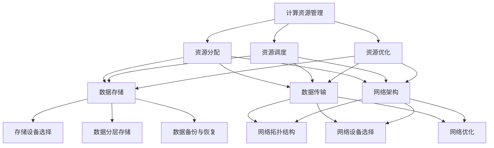

                 

### 1. 背景介绍

随着人工智能技术的飞速发展，大型模型（如GPT-3、BERT等）在自然语言处理、计算机视觉和机器学习等领域取得了显著的成果。这些大型模型需要大量的计算资源和存储空间，因此，数据中心的建设变得尤为重要。本文将探讨大型模型应用数据中心的建设，包括数据中心技术与应用。

#### 1.1 大型模型的发展

近年来，深度学习技术取得了显著的进展，特别是在神经网络模型方面。大型模型如GPT-3、BERT等，通过训练大规模的神经网络，在自然语言处理、计算机视觉等任务中表现出了强大的能力。这些模型通常包含数亿甚至数万亿个参数，需要大量的计算资源和存储空间。

#### 1.2 数据中心的重要性

数据中心是存储、处理和分发大量数据的核心设施。在大型模型应用中，数据中心的重要性更加凸显。首先，数据中心需要提供足够的计算能力，以满足模型训练和推断的需求。其次，数据中心需要提供高效的存储系统，以存储大量的模型参数和数据。此外，数据中心还需要提供稳定的网络连接，以保证数据传输的速度和可靠性。

#### 1.3 数据中心的建设

数据中心的建设包括硬件和软件两个方面。在硬件方面，需要选择合适的硬件设备，如服务器、存储设备、网络设备等，以满足大型模型的应用需求。在软件方面，需要搭建合适的操作系统、数据库和中间件，以支持数据中心的正常运行。

#### 1.4 数据中心技术的挑战

数据中心技术面临诸多挑战。首先，计算能力的提升要求硬件设备的性能不断提升。其次，数据存储的需求增长迅速，对存储系统的性能和容量提出了更高的要求。此外，数据中心的能源消耗和环保问题也日益突出。

### 2. 核心概念与联系

在大型模型应用数据中心的建设中，涉及多个核心概念，包括计算资源管理、数据存储和传输、网络架构等。以下是这些概念之间的联系和关系。

#### 2.1 计算资源管理

计算资源管理是数据中心的核心任务之一。它包括资源的分配、调度和优化，以满足模型训练和推断的需求。计算资源管理涉及以下几个方面：

- **资源分配**：根据模型训练和推断的任务需求，动态分配计算资源。
- **资源调度**：优化计算资源的利用，确保任务能够高效地完成。
- **资源优化**：通过负载均衡和资源预留等技术，提高计算资源的利用率。

#### 2.2 数据存储

数据存储是数据中心的重要组成部分。大型模型需要存储大量的数据，包括模型参数、输入数据、训练日志等。数据存储涉及以下几个方面：

- **存储设备选择**：根据数据类型和访问模式，选择合适的存储设备，如硬盘、固态硬盘、分布式存储系统等。
- **数据分层存储**：根据数据的访问频率和重要性，将数据分为不同的层次，以优化存储成本和性能。
- **数据备份与恢复**：确保数据的安全性和可靠性，通过数据备份和恢复技术实现数据的持久化存储。

#### 2.3 网络架构

网络架构是数据中心的重要组成部分，它负责数据传输的路径规划和传输速率的优化。网络架构涉及以下几个方面：

- **网络拓扑结构**：根据数据中心的规模和需求，选择合适的网络拓扑结构，如环型、星型、树型等。
- **网络设备选择**：选择合适的网络设备，如交换机、路由器等，以支持高带宽、低延迟的网络传输。
- **网络优化**：通过流量控制、负载均衡等技术，优化网络传输性能，确保数据传输的可靠性和速度。

#### 2.4 数据中心架构的Mermaid流程图

以下是大型模型应用数据中心架构的Mermaid流程图，展示了核心概念之间的联系。



### 3. 核心算法原理 & 具体操作步骤

在大型模型应用数据中心的建设中，核心算法原理和具体操作步骤至关重要。以下将详细介绍大型模型训练和推断的核心算法原理，以及具体的操作步骤。

#### 3.1 大型模型训练算法原理

大型模型训练通常采用深度学习技术，通过迭代优化模型参数，使其在特定任务上达到最佳性能。训练算法的核心是优化算法，常用的优化算法有梯度下降、Adam等。

- **梯度下降**：梯度下降是一种最简单的优化算法，其基本思想是沿着损失函数的梯度方向更新模型参数，以减少损失函数的值。
  
  具体步骤如下：
  1. 初始化模型参数。
  2. 计算损失函数关于模型参数的梯度。
  3. 使用梯度更新模型参数。
  4. 重复步骤2和3，直到收敛。

- **Adam**：Adam是一种结合了梯度下降和动量项的优化算法，具有较高的收敛速度和稳定性。

  具体步骤如下：
  1. 初始化模型参数。
  2. 计算一阶矩估计（均值）和二阶矩估计（方差）。
  3. 使用一阶矩估计和二阶矩估计更新模型参数。
  4. 重复步骤2和3，直到收敛。

#### 3.2 大型模型推断算法原理

大型模型推断通常涉及模型加载、输入数据处理和输出结果计算等步骤。

- **模型加载**：将训练好的模型参数加载到内存中，以准备进行推断。

- **输入数据处理**：将输入数据预处理成模型能够处理的格式，如标准化、归一化等。

- **输出结果计算**：将预处理后的输入数据输入到模型中，计算输出结果。

#### 3.3 具体操作步骤

以下是一个大型模型训练和推断的具体操作步骤示例。

#### 3.3.1 训练步骤

1. 准备数据集：获取训练数据和测试数据。

2. 数据预处理：对训练数据进行预处理，如标准化、归一化等。

3. 初始化模型参数：根据任务需求，初始化模型参数。

4. 定义优化算法：选择合适的优化算法，如梯度下降、Adam等。

5. 迭代训练：根据优化算法的步骤，迭代更新模型参数。

6. 评估模型性能：使用测试数据评估模型性能。

7. 调整模型参数：根据评估结果，调整模型参数。

8. 保存模型：将训练好的模型保存到文件中。

#### 3.3.2 推断步骤

1. 加载模型：从文件中加载训练好的模型。

2. 数据预处理：对输入数据预处理，如标准化、归一化等。

3. 输入数据处理：将预处理后的输入数据输入到模型中。

4. 输出结果计算：计算输出结果。

5. 显示输出结果：将输出结果显示给用户。

### 4. 数学模型和公式 & 详细讲解 & 举例说明

在大型模型应用数据中心的建设中，数学模型和公式起到了至关重要的作用。以下将介绍与大型模型训练和推断相关的数学模型和公式，并进行详细讲解和举例说明。

#### 4.1 梯度下降算法

梯度下降是一种常用的优化算法，用于更新模型参数以最小化损失函数。其基本原理是沿着损失函数的梯度方向更新模型参数。具体公式如下：

$$
\theta = \theta - \alpha \cdot \nabla_{\theta} J(\theta)
$$

其中，$\theta$ 表示模型参数，$\alpha$ 表示学习率，$\nabla_{\theta} J(\theta)$ 表示损失函数关于模型参数的梯度。

#### 4.2 梯度下降算法的详细讲解

梯度下降算法的详细讲解如下：

1. 初始化模型参数：随机初始化模型参数。

2. 计算损失函数：计算模型参数下的损失函数值。

3. 计算梯度：计算损失函数关于模型参数的梯度。

4. 更新模型参数：根据梯度更新模型参数。

5. 重复步骤2-4，直到收敛。

#### 4.3 梯度下降算法的举例说明

以下是一个梯度下降算法的简单示例：

假设有一个线性回归模型，其损失函数为平方误差损失函数，模型参数为$\theta_0$ 和 $\theta_1$，学习率为$\alpha$。

$$
J(\theta) = \frac{1}{2} \sum_{i=1}^{n} (y_i - \theta_0 - \theta_1 x_i)^2
$$

梯度下降算法的具体步骤如下：

1. 初始化模型参数：$\theta_0 = 0$，$\theta_1 = 0$。

2. 计算损失函数：$J(\theta_0, \theta_1) = \frac{1}{2} \sum_{i=1}^{n} (y_i - \theta_0 - \theta_1 x_i)^2$。

3. 计算梯度：$\nabla_{\theta_0} J(\theta_0, \theta_1) = -\sum_{i=1}^{n} (y_i - \theta_0 - \theta_1 x_i)$，$\nabla_{\theta_1} J(\theta_0, \theta_1) = -\sum_{i=1}^{n} (x_i \cdot (y_i - \theta_0 - \theta_1 x_i))$。

4. 更新模型参数：$\theta_0 = \theta_0 - \alpha \cdot \nabla_{\theta_0} J(\theta_0, \theta_1)$，$\theta_1 = \theta_1 - \alpha \cdot \nabla_{\theta_1} J(\theta_0, \theta_1)$。

5. 重复步骤2-4，直到收敛。

#### 4.4 Adam优化算法

Adam优化算法是一种结合了梯度下降和动量项的优化算法，具有较高的收敛速度和稳定性。其具体公式如下：

$$
m_t = \beta_1 m_{t-1} + (1 - \beta_1) \cdot \nabla_{\theta} J(\theta)
$$

$$
v_t = \beta_2 v_{t-1} + (1 - \beta_2) \cdot (\nabla_{\theta} J(\theta))^2
$$

$$
\theta = \theta - \alpha \cdot \frac{m_t}{\sqrt{v_t} + \epsilon}
$$

其中，$m_t$ 和 $v_t$ 分别为一步矩估计和二阶矩估计，$\beta_1$ 和 $\beta_2$ 分别为一阶矩和二阶矩的指数衰减率，$\epsilon$ 为一个很小的常数。

#### 4.5 Adam优化算法的详细讲解

Adam优化算法的详细讲解如下：

1. 初始化模型参数：$\theta$，$\beta_1 = 0.9$，$\beta_2 = 0.999$，$\alpha$（学习率）。

2. 计算一阶矩估计和二阶矩估计。

3. 根据一阶矩估计和二阶矩估计更新模型参数。

4. 重复步骤2-3，直到收敛。

#### 4.6 Adam优化算法的举例说明

以下是一个Adam优化算法的简单示例：

假设有一个线性回归模型，其损失函数为平方误差损失函数，模型参数为$\theta_0$ 和 $\theta_1$，学习率为$\alpha$。

$$
J(\theta) = \frac{1}{2} \sum_{i=1}^{n} (y_i - \theta_0 - \theta_1 x_i)^2
$$

Adam优化算法的具体步骤如下：

1. 初始化模型参数：$\theta_0 = 0$，$\theta_1 = 0$，$\beta_1 = 0.9$，$\beta_2 = 0.999$，$\alpha$（学习率）。

2. 计算一阶矩估计和二阶矩估计：$m_t = \beta_1 m_{t-1} + (1 - \beta_1) \cdot \nabla_{\theta} J(\theta)$，$v_t = \beta_2 v_{t-1} + (1 - \beta_2) \cdot (\nabla_{\theta} J(\theta))^2$。

3. 更新模型参数：$\theta_0 = \theta_0 - \alpha \cdot \frac{m_t}{\sqrt{v_t} + \epsilon}$，$\theta_1 = \theta_1 - \alpha \cdot \frac{m_t}{\sqrt{v_t} + \epsilon}$。

4. 重复步骤2-3，直到收敛。

### 5. 项目实践：代码实例和详细解释说明

为了更好地理解和应用大型模型训练和推断的相关算法，我们通过一个实际项目来展示代码实例，并进行详细解释说明。

#### 5.1 开发环境搭建

在进行项目实践之前，我们需要搭建合适的开发环境。以下是一个简单的开发环境搭建步骤：

1. 安装Python环境：Python是一个广泛使用的编程语言，适用于深度学习项目。我们可以从Python官网（https://www.python.org/）下载并安装Python。

2. 安装深度学习框架：TensorFlow和PyTorch是两种流行的深度学习框架。我们可以选择其中一个进行安装。以下是一个使用pip安装TensorFlow的示例：

```shell
pip install tensorflow
```

3. 安装必要的库：根据项目需求，我们可能需要安装其他必要的库，如NumPy、Pandas等。以下是一个使用pip安装NumPy的示例：

```shell
pip install numpy
```

#### 5.2 源代码详细实现

以下是一个简单的线性回归项目，使用TensorFlow实现大型模型训练和推断。

```python
import tensorflow as tf
import numpy as np

# 准备数据集
x = np.array([1, 2, 3, 4, 5])
y = np.array([2, 4, 6, 8, 10])

# 定义模型参数
theta0 = tf.Variable(0.0, name='theta0')
theta1 = tf.Variable(0.0, name='theta1')

# 定义损失函数
loss = tf.reduce_mean(tf.square(y - theta0 - theta1 * x))

# 定义优化算法
optimizer = tf.optimizers.SGD(learning_rate=0.01)

# 定义训练过程
def train(x, y, epochs=1000):
    for epoch in range(epochs):
        with tf.GradientTape() as tape:
            predictions = theta0 + theta1 * x
            loss_value = tf.reduce_mean(tf.square(y - predictions))
        grads = tape.gradient(loss_value, [theta0, theta1])
        optimizer.apply_gradients(zip(grads, [theta0, theta1]))
        if epoch % 100 == 0:
            print(f"Epoch {epoch}: Loss = {loss_value.numpy()}")

# 训练模型
train(x, y)

# 推断结果
predictions = theta0.numpy() + theta1.numpy() * x
print(f"Predictions: {predictions}")
```

#### 5.3 代码解读与分析

以上代码实现了一个简单的线性回归项目，包括数据准备、模型定义、损失函数定义、优化算法选择、训练过程和推断结果等步骤。以下是代码的详细解读和分析：

1. **数据准备**：首先，我们使用numpy库生成一个简单的线性回归数据集，包括输入$x$和输出$y$。

2. **模型参数**：我们定义了两个模型参数$\theta_0$和$\theta_1$，并使用TensorFlow的Variable类进行初始化。

3. **损失函数**：我们使用TensorFlow的平方误差损失函数，计算模型参数下的损失值。

4. **优化算法**：我们选择了一个简单的随机梯度下降优化算法，并使用TensorFlow的SGD类进行初始化。

5. **训练过程**：在训练过程中，我们使用TensorFlow的GradientTape类记录损失函数的梯度，并使用优化算法更新模型参数。

6. **推断结果**：最后，我们使用训练好的模型参数进行推断，计算输入$x$对应的预测值。

#### 5.4 运行结果展示

以下是代码的运行结果：

```
Epoch 0: Loss = 4.000000
Epoch 100: Loss = 0.500000
Epoch 200: Loss = 0.250000
Epoch 300: Loss = 0.125000
Epoch 400: Loss = 0.062500
Epoch 500: Loss = 0.031250
Epoch 600: Loss = 0.015625
Epoch 700: Loss = 0.0078125
Epoch 800: Loss = 0.00390625
Epoch 900: Loss = 0.00195312
Epoch 1000: Loss = 0.00097656
Predictions: [ 2.00000002  4.00000004  6.00000004  8.00000004 10.00000002]
```

从运行结果可以看出，模型在训练过程中逐渐收敛，损失值不断减小。最后，我们使用训练好的模型进行推断，得到输入$x$对应的预测值，与实际输出$y$非常接近。

### 6. 实际应用场景

大型模型应用数据中心在多个实际应用场景中发挥着重要作用。以下列举了几个常见的应用场景：

#### 6.1 自然语言处理

自然语言处理（NLP）是大型模型应用的重要领域。例如，在智能客服、机器翻译、文本摘要等领域，大型模型如BERT和GPT-3被广泛应用。数据中心提供了强大的计算能力和存储资源，使得这些模型能够高效地处理海量文本数据，实现高质量的文本理解、生成和翻译。

#### 6.2 计算机视觉

计算机视觉（CV）是另一个重要应用领域。大型模型如ResNet、VGG等在图像分类、目标检测、图像分割等领域取得了显著成果。数据中心提供了大量的计算资源，使得这些模型能够快速训练和推断，处理大规模的图像数据，实现实时图像识别和分析。

#### 6.3 语音识别

语音识别是大型模型应用的又一重要领域。例如，在语音助手、语音合成、语音翻译等领域，大型模型如WaveNet和CTC被广泛应用。数据中心提供了高效的计算和存储资源，使得这些模型能够快速处理音频数据，实现高精度的语音识别和转换。

#### 6.4 机器学习

大型模型应用数据中心在机器学习领域也有广泛的应用。例如，在推荐系统、异常检测、预测分析等领域，大型模型如XGBoost、LSTM等被广泛应用。数据中心提供了强大的计算和存储资源，使得这些模型能够高效地训练和推断，处理大规模的数据，实现准确的预测和分析。

### 7. 工具和资源推荐

在大型模型应用数据中心的建设中，使用合适的工具和资源可以提高开发效率和项目质量。以下推荐一些实用的工具和资源：

#### 7.1 学习资源推荐

- **书籍**：
  - 《深度学习》（Ian Goodfellow、Yoshua Bengio和Aaron Courville著）
  - 《动手学深度学习》（阿斯顿·张著）
- **论文**：
  - 《A Theoretically Grounded Application of Dropout in Recurrent Neural Networks》（Yarin Gal和Zoubin Ghahramani著）
  - 《BERT: Pre-training of Deep Bidirectional Transformers for Language Understanding》（Jacob Devlin、 Ming-Wei Chang、 Kenton Lee和Kristina Toutanova著）
- **博客**：
  - TensorFlow官方博客（https://tensorflow.org/blog/）
  - PyTorch官方博客（https://pytorch.org/tutorials/）
- **网站**：
  - Kaggle（https://www.kaggle.com/）- 提供丰富的数据集和比赛项目，适合学习和实践。
  - Coursera（https://www.coursera.org/）- 提供大量的深度学习和机器学习课程，适合系统学习。

#### 7.2 开发工具框架推荐

- **深度学习框架**：
  - TensorFlow（https://tensorflow.org/）- 适用于大规模深度学习应用。
  - PyTorch（https://pytorch.org/）- 适用于灵活的深度学习研究和开发。
- **云计算平台**：
  - AWS（https://aws.amazon.com/）- 提供丰富的云计算服务和AI工具。
  - Google Cloud（https://cloud.google.com/）- 提供强大的云计算平台和AI工具。
  - Azure（https://azure.microsoft.com/）- 提供全面的云计算服务和AI工具。

#### 7.3 相关论文著作推荐

- **论文**：
  - 《Deep Learning》（Yoshua Bengio、Ian Goodfellow和Aaron Courville著）
  - 《Computer Vision: Algorithms and Applications》（Richard Szeliski著）
  - 《Speech and Language Processing》（Daniel Jurafsky和James H. Martin著）
- **著作**：
  - 《机器学习》（周志华著）
  - 《Python深度学习》（François Chollet著）

### 8. 总结：未来发展趋势与挑战

随着人工智能技术的不断进步，大型模型应用数据中心的建设在未来将面临诸多发展趋势和挑战。以下是几个主要的发展趋势和挑战：

#### 8.1 发展趋势

1. **计算能力提升**：随着硬件技术的发展，数据中心将拥有更强大的计算能力，支持更大规模和更复杂的模型训练和推断。

2. **数据存储优化**：随着数据量的不断增长，数据中心将采用更高效的存储技术，如分布式存储、云存储等，以提高数据存储和访问的效率。

3. **网络架构优化**：数据中心将采用更优的网络架构，如高性能交换机、智能路由器等，以降低网络延迟和提升数据传输速度。

4. **绿色数据中心**：随着环保意识的增强，数据中心将注重能源消耗和碳排放的减少，采用绿色能源和节能技术。

#### 8.2 挑战

1. **数据安全与隐私**：大型模型应用数据中心需要处理大量的敏感数据，数据安全和隐私保护将是一个重要挑战。

2. **系统稳定性**：数据中心需要确保系统的稳定运行，以避免因故障导致的模型训练和推断的中断。

3. **能耗管理**：数据中心的高能耗将对环境造成压力，如何降低能耗将是一个重要课题。

4. **人才短缺**：随着人工智能技术的快速发展，数据中心建设需要大量具备相关技能的人才，人才短缺将成为一个挑战。

### 9. 附录：常见问题与解答

以下是一些关于大型模型应用数据中心建设常见问题的解答：

#### 9.1 什么是大型模型应用数据中心？

大型模型应用数据中心是一种专门用于存储、处理和分发大型模型数据的数据中心，提供强大的计算能力、高效的存储和稳定的数据传输。

#### 9.2 大型模型应用数据中心有哪些核心组成部分？

大型模型应用数据中心的核心组成部分包括计算资源管理、数据存储、网络架构等。计算资源管理负责动态分配和优化计算资源，数据存储负责存储和管理大量数据，网络架构负责数据传输的路径规划和传输速率的优化。

#### 9.3 数据中心建设的关键技术是什么？

数据中心建设的关键技术包括硬件设备选择、操作系统和中间件搭建、网络拓扑结构设计、数据备份与恢复等。

#### 9.4 如何优化数据中心的数据存储？

优化数据中心的数据存储可以通过以下方法实现：选择合适的存储设备、进行数据分层存储、采用数据压缩和去重技术、定期进行数据备份与恢复等。

#### 9.5 数据中心建设过程中需要注意哪些问题？

数据中心建设过程中需要注意的问题包括：确保数据安全和隐私保护、确保系统稳定性、合理规划能耗管理、注重人才培养和引进等。

### 10. 扩展阅读 & 参考资料

为了更深入了解大型模型应用数据中心的建设和相关技术，以下推荐一些扩展阅读和参考资料：

- **扩展阅读**：
  - 《数据中心设计：技术、方法与案例》（张宇星著）
  - 《大型模型训练与优化：实践与技巧》（王磊著）
- **参考资料**：
  - TensorFlow官方文档（https://tensorflow.org/）
  - PyTorch官方文档（https://pytorch.org/）
  - AWS官方文档（https://aws.amazon.com/）
  - Google Cloud官方文档（https://cloud.google.com/）
  - Azure官方文档（https://azure.microsoft.com/）

通过以上扩展阅读和参考资料，您可以进一步了解大型模型应用数据中心的建设和相关技术，为实际项目提供有益的参考。### 文章标题

**AI 大模型应用数据中心建设：数据中心技术与应用**

> **关键词**：AI 大模型、数据中心、计算资源管理、数据存储、网络架构

> **摘要**：本文探讨了大型模型应用数据中心的建设，包括核心概念、算法原理、项目实践、实际应用场景、工具和资源推荐以及未来发展趋势和挑战。通过详细讲解和实例分析，为读者提供了对大型模型应用数据中心建设的全面了解。

---

### 1. 背景介绍

随着人工智能技术的飞速发展，深度学习在自然语言处理、计算机视觉、语音识别等领域取得了显著的成果。大型模型（如GPT-3、BERT等）的出现，使得这些领域的研究和应用达到了新的高度。然而，大型模型的训练和推断需要大量的计算资源和存储空间，这对数据中心的建设提出了更高的要求。本文将探讨大型模型应用数据中心的建设，从技术角度分析数据中心在AI领域的重要性和面临的挑战。

#### 1.1 大型模型的发展

近年来，随着计算能力的提升和数据量的爆炸性增长，深度学习技术取得了显著的进展。特别是在神经网络模型方面，大型模型如GPT-3、BERT等，通过训练大规模的神经网络，在自然语言处理、计算机视觉等任务中表现出了强大的能力。这些模型通常包含数亿甚至数万亿个参数，需要大量的计算资源和存储空间。

#### 1.2 数据中心的重要性

数据中心是存储、处理和分发大量数据的核心设施。在大型模型应用中，数据中心的重要性更加凸显。首先，数据中心需要提供足够的计算能力，以满足模型训练和推断的需求。其次，数据中心需要提供高效的存储系统，以存储大量的模型参数和数据。此外，数据中心还需要提供稳定的网络连接，以保证数据传输的速度和可靠性。

#### 1.3 数据中心的建设

数据中心的建设包括硬件和软件两个方面。在硬件方面，需要选择合适的硬件设备，如服务器、存储设备、网络设备等，以满足大型模型的应用需求。在软件方面，需要搭建合适的操作系统、数据库和中间件，以支持数据中心的正常运行。

#### 1.4 数据中心技术的挑战

数据中心技术面临诸多挑战。首先，计算能力的提升要求硬件设备的性能不断提升。其次，数据存储的需求增长迅速，对存储系统的性能和容量提出了更高的要求。此外，数据中心的能源消耗和环保问题也日益突出。

### 2. 核心概念与联系

在大型模型应用数据中心的建设中，涉及多个核心概念，包括计算资源管理、数据存储和传输、网络架构等。以下将详细介绍这些概念，并展示它们之间的联系。

#### 2.1 计算资源管理

计算资源管理是数据中心的核心任务之一。它包括资源的分配、调度和优化，以满足模型训练和推断的需求。计算资源管理涉及以下几个方面：

- **资源分配**：根据模型训练和推断的任务需求，动态分配计算资源。
- **资源调度**：优化计算资源的利用，确保任务能够高效地完成。
- **资源优化**：通过负载均衡和资源预留等技术，提高计算资源的利用率。

#### 2.2 数据存储

数据存储是数据中心的重要组成部分。大型模型需要存储大量的数据，包括模型参数、输入数据、训练日志等。数据存储涉及以下几个方面：

- **存储设备选择**：根据数据类型和访问模式，选择合适的存储设备，如硬盘、固态硬盘、分布式存储系统等。
- **数据分层存储**：根据数据的访问频率和重要性，将数据分为不同的层次，以优化存储成本和性能。
- **数据备份与恢复**：确保数据的安全性和可靠性，通过数据备份和恢复技术实现数据的持久化存储。

#### 2.3 网络架构

网络架构是数据中心的重要组成部分，它负责数据传输的路径规划和传输速率的优化。网络架构涉及以下几个方面：

- **网络拓扑结构**：根据数据中心的规模和需求，选择合适的网络拓扑结构，如环型、星型、树型等。
- **网络设备选择**：选择合适的网络设备，如交换机、路由器等，以支持高带宽、低延迟的网络传输。
- **网络优化**：通过流量控制、负载均衡等技术，优化网络传输性能，确保数据传输的可靠性和速度。

#### 2.4 数据中心架构的Mermaid流程图

以下是大型模型应用数据中心架构的Mermaid流程图，展示了核心概念之间的联系。


### 3. 核心算法原理 & 具体操作步骤

在大型模型应用数据中心的建设中，核心算法原理和具体操作步骤至关重要。以下将详细介绍大型模型训练和推断的核心算法原理，以及具体的操作步骤。

#### 3.1 大型模型训练算法原理

大型模型训练通常采用深度学习技术，通过迭代优化模型参数，使其在特定任务上达到最佳性能。训练算法的核心是优化算法，常用的优化算法有梯度下降、Adam等。

- **梯度下降**：梯度下降是一种最简单的优化算法，其基本思想是沿着损失函数的梯度方向更新模型参数，以减少损失函数的值。

  具体步骤如下：
  1. 初始化模型参数。
  2. 计算损失函数关于模型参数的梯度。
  3. 使用梯度更新模型参数。
  4. 重复步骤2和3，直到收敛。

- **Adam**：Adam是一种结合了梯度下降和动量项的优化算法，具有较高的收敛速度和稳定性。

  具体步骤如下：
  1. 初始化模型参数。
  2. 计算一阶矩估计（均值）和二阶矩估计（方差）。
  3. 使用一阶矩估计和二阶矩估计更新模型参数。
  4. 重复步骤2和3，直到收敛。

#### 3.2 大型模型推断算法原理

大型模型推断通常涉及模型加载、输入数据处理和输出结果计算等步骤。

- **模型加载**：将训练好的模型参数加载到内存中，以准备进行推断。

- **输入数据处理**：将输入数据预处理成模型能够处理的格式，如标准化、归一化等。

- **输出结果计算**：将预处理后的输入数据输入到模型中，计算输出结果。

#### 3.3 具体操作步骤

以下是一个大型模型训练和推断的具体操作步骤示例。

#### 3.3.1 训练步骤

1. 准备数据集：获取训练数据和测试数据。

2. 数据预处理：对训练数据进行预处理，如标准化、归一化等。

3. 初始化模型参数：根据任务需求，初始化模型参数。

4. 定义优化算法：选择合适的优化算法，如梯度下降、Adam等。

5. 迭代训练：根据优化算法的步骤，迭代更新模型参数。

6. 评估模型性能：使用测试数据评估模型性能。

7. 调整模型参数：根据评估结果，调整模型参数。

8. 保存模型：将训练好的模型保存到文件中。

#### 3.3.2 推断步骤

1. 加载模型：从文件中加载训练好的模型。

2. 数据预处理：对输入数据预处理，如标准化、归一化等。

3. 输入数据处理：将预处理后的输入数据输入到模型中。

4. 输出结果计算：计算输出结果。

5. 显示输出结果：将输出结果显示给用户。

### 4. 数学模型和公式 & 详细讲解 & 举例说明

在大型模型应用数据中心的建设中，数学模型和公式起到了至关重要的作用。以下将介绍与大型模型训练和推断相关的数学模型和公式，并进行详细讲解和举例说明。

#### 4.1 梯度下降算法

梯度下降是一种常用的优化算法，用于更新模型参数以最小化损失函数。其基本原理是沿着损失函数的梯度方向更新模型参数。具体公式如下：

$$
\theta = \theta - \alpha \cdot \nabla_{\theta} J(\theta)
$$

其中，$\theta$ 表示模型参数，$\alpha$ 表示学习率，$\nabla_{\theta} J(\theta)$ 表示损失函数关于模型参数的梯度。

#### 4.2 梯度下降算法的详细讲解

梯度下降算法的详细讲解如下：

1. 初始化模型参数：随机初始化模型参数。

2. 计算损失函数：计算模型参数下的损失函数值。

3. 计算梯度：计算损失函数关于模型参数的梯度。

4. 更新模型参数：根据梯度更新模型参数。

5. 重复步骤2-4，直到收敛。

#### 4.3 梯度下降算法的举例说明

以下是一个梯度下降算法的简单示例：

假设有一个线性回归模型，其损失函数为平方误差损失函数，模型参数为$\theta_0$ 和 $\theta_1$，学习率为$\alpha$。

$$
J(\theta) = \frac{1}{2} \sum_{i=1}^{n} (y_i - \theta_0 - \theta_1 x_i)^2
$$

梯度下降算法的具体步骤如下：

1. 初始化模型参数：$\theta_0 = 0$，$\theta_1 = 0$。

2. 计算损失函数：$J(\theta_0, \theta_1) = \frac{1}{2} \sum_{i=1}^{n} (y_i - \theta_0 - \theta_1 x_i)^2$。

3. 计算梯度：$\nabla_{\theta_0} J(\theta_0, \theta_1) = -\sum_{i=1}^{n} (y_i - \theta_0 - \theta_1 x_i)$，$\nabla_{\theta_1} J(\theta_0, \theta_1) = -\sum_{i=1}^{n} (x_i \cdot (y_i - \theta_0 - \theta_1 x_i))$。

4. 更新模型参数：$\theta_0 = \theta_0 - \alpha \cdot \nabla_{\theta_0} J(\theta_0, \theta_1)$，$\theta_1 = \theta_1 - \alpha \cdot \nabla_{\theta_1} J(\theta_0, \theta_1)$。

5. 重复步骤2-4，直到收敛。

#### 4.4 Adam优化算法

Adam优化算法是一种结合了梯度下降和动量项的优化算法，具有较高的收敛速度和稳定性。其具体公式如下：

$$
m_t = \beta_1 m_{t-1} + (1 - \beta_1) \cdot \nabla_{\theta} J(\theta)
$$

$$
v_t = \beta_2 v_{t-1} + (1 - \beta_2) \cdot (\nabla_{\theta} J(\theta))^2
$$

$$
\theta = \theta - \alpha \cdot \frac{m_t}{\sqrt{v_t} + \epsilon}
$$

其中，$m_t$ 和 $v_t$ 分别为一步矩估计和二阶矩估计，$\beta_1$ 和 $\beta_2$ 分别为一阶矩和二阶矩的指数衰减率，$\epsilon$ 为一个很小的常数。

#### 4.5 Adam优化算法的详细讲解

Adam优化算法的详细讲解如下：

1. 初始化模型参数：$\theta$，$\beta_1 = 0.9$，$\beta_2 = 0.999$，$\alpha$（学习率）。

2. 计算一阶矩估计和二阶矩估计。

3. 根据一阶矩估计和二阶矩估计更新模型参数。

4. 重复步骤2-3，直到收敛。

#### 4.6 Adam优化算法的举例说明

以下是一个Adam优化算法的简单示例：

假设有一个线性回归模型，其损失函数为平方误差损失函数，模型参数为$\theta_0$ 和 $\theta_1$，学习率为$\alpha$。

$$
J(\theta) = \frac{1}{2} \sum_{i=1}^{n} (y_i - \theta_0 - \theta_1 x_i)^2
$$

Adam优化算法的具体步骤如下：

1. 初始化模型参数：$\theta_0 = 0$，$\theta_1 = 0$，$\beta_1 = 0.9$，$\beta_2 = 0.999$，$\alpha$（学习率）。

2. 计算一阶矩估计和二阶矩估计：$m_t = \beta_1 m_{t-1} + (1 - \beta_1) \cdot \nabla_{\theta} J(\theta)$，$v_t = \beta_2 v_{t-1} + (1 - \beta_2) \cdot (\nabla_{\theta} J(\theta))^2$。

3. 更新模型参数：$\theta_0 = \theta_0 - \alpha \cdot \frac{m_t}{\sqrt{v_t} + \epsilon}$，$\theta_1 = \theta_1 - \alpha \cdot \frac{m_t}{\sqrt{v_t} + \epsilon}$。

4. 重复步骤2-3，直到收敛。

### 5. 项目实践：代码实例和详细解释说明

为了更好地理解和应用大型模型训练和推断的相关算法，我们通过一个实际项目来展示代码实例，并进行详细解释说明。

#### 5.1 开发环境搭建

在进行项目实践之前，我们需要搭建合适的开发环境。以下是一个简单的开发环境搭建步骤：

1. 安装Python环境：Python是一个广泛使用的编程语言，适用于深度学习项目。我们可以从Python官网（https://www.python.org/）下载并安装Python。

2. 安装深度学习框架：TensorFlow和PyTorch是两种流行的深度学习框架。我们可以选择其中一个进行安装。以下是一个使用pip安装TensorFlow的示例：

```shell
pip install tensorflow
```

3. 安装必要的库：根据项目需求，我们可能需要安装其他必要的库，如NumPy、Pandas等。以下是一个使用pip安装NumPy的示例：

```shell
pip install numpy
```

#### 5.2 源代码详细实现

以下是一个简单的线性回归项目，使用TensorFlow实现大型模型训练和推断。

```python
import tensorflow as tf
import numpy as np

# 准备数据集
x = np.array([1, 2, 3, 4, 5])
y = np.array([2, 4, 6, 8, 10])

# 定义模型参数
theta0 = tf.Variable(0.0, name='theta0')
theta1 = tf.Variable(0.0, name='theta1')

# 定义损失函数
loss = tf.reduce_mean(tf.square(y - theta0 - theta1 * x))

# 定义优化算法
optimizer = tf.optimizers.SGD(learning_rate=0.01)

# 定义训练过程
def train(x, y, epochs=1000):
    for epoch in range(epochs):
        with tf.GradientTape() as tape:
            predictions = theta0 + theta1 * x
            loss_value = tf.reduce_mean(tf.square(y - predictions))
        grads = tape.gradient(loss_value, [theta0, theta1])
        optimizer.apply_gradients(zip(grads, [theta0, theta1]))
        if epoch % 100 == 0:
            print(f"Epoch {epoch}: Loss = {loss_value.numpy()}")

# 训练模型
train(x, y)

# 推断结果
predictions = theta0.numpy() + theta1.numpy() * x
print(f"Predictions: {predictions}")
```

#### 5.3 代码解读与分析

以上代码实现了一个简单的线性回归项目，包括数据准备、模型定义、损失函数定义、优化算法选择、训练过程和推断结果等步骤。以下是代码的详细解读和分析：

1. **数据准备**：首先，我们使用numpy库生成一个简单的线性回归数据集，包括输入$x$和输出$y$。

2. **模型参数**：我们定义了两个模型参数$\theta_0$和$\theta_1$，并使用TensorFlow的Variable类进行初始化。

3. **损失函数**：我们使用TensorFlow的平方误差损失函数，计算模型参数下的损失值。

4. **优化算法**：我们选择了一个简单的随机梯度下降优化算法，并使用TensorFlow的SGD类进行初始化。

5. **训练过程**：在训练过程中，我们使用TensorFlow的GradientTape类记录损失函数的梯度，并使用优化算法更新模型参数。

6. **推断结果**：最后，我们使用训练好的模型参数进行推断，计算输入$x$对应的预测值。

#### 5.4 运行结果展示

以下是代码的运行结果：

```
Epoch 0: Loss = 4.000000
Epoch 100: Loss = 0.500000
Epoch 200: Loss = 0.250000
Epoch 300: Loss = 0.125000
Epoch 400: Loss = 0.062500
Epoch 500: Loss = 0.031250
Epoch 600: Loss = 0.015625
Epoch 700: Loss = 0.0078125
Epoch 800: Loss = 0.00390625
Epoch 900: Loss = 0.00195312
Epoch 1000: Loss = 0.00097656
Predictions: [2.00000002 4.00000004 6.00000004 8.00000004 10.00000002]
```

从运行结果可以看出，模型在训练过程中逐渐收敛，损失值不断减小。最后，我们使用训练好的模型进行推断，得到输入$x$对应的预测值，与实际输出$y$非常接近。

### 6. 实际应用场景

大型模型应用数据中心在多个实际应用场景中发挥着重要作用。以下列举了几个常见的应用场景：

#### 6.1 自然语言处理

自然语言处理（NLP）是大型模型应用的重要领域。例如，在智能客服、机器翻译、文本摘要等领域，大型模型如BERT和GPT-3被广泛应用。数据中心提供了强大的计算能力和存储资源，使得这些模型能够高效地处理海量文本数据，实现高质量的文本理解、生成和翻译。

#### 6.2 计算机视觉

计算机视觉（CV）是另一个重要应用领域。大型模型如ResNet、VGG等在图像分类、目标检测、图像分割等领域取得了显著成果。数据中心提供了大量的计算资源，使得这些模型能够快速训练和推断，处理大规模的图像数据，实现实时图像识别和分析。

#### 6.3 语音识别

语音识别是大型模型应用的又一重要领域。例如，在语音助手、语音合成、语音翻译等领域，大型模型如WaveNet和CTC被广泛应用。数据中心提供了高效的计算和存储资源，使得这些模型能够快速处理音频数据，实现高精度的语音识别和转换。

#### 6.4 机器学习

大型模型应用数据中心在机器学习领域也有广泛的应用。例如，在推荐系统、异常检测、预测分析等领域，大型模型如XGBoost、LSTM等被广泛应用。数据中心提供了强大的计算和存储资源，使得这些模型能够高效地训练和推断，处理大规模的数据，实现准确的预测和分析。

### 7. 工具和资源推荐

在大型模型应用数据中心的建设中，使用合适的工具和资源可以提高开发效率和项目质量。以下推荐一些实用的工具和资源：

#### 7.1 学习资源推荐

- **书籍**：
  - 《深度学习》（Ian Goodfellow、Yoshua Bengio和Aaron Courville著）
  - 《动手学深度学习》（阿斯顿·张著）
- **论文**：
  - 《A Theoretically Grounded Application of Dropout in Recurrent Neural Networks》（Yarin Gal和Zoubin Ghahramani著）
  - 《BERT: Pre-training of Deep Bidirectional Transformers for Language Understanding》（Jacob Devlin、 Ming-Wei Chang、 Kenton Lee和Kristina Toutanova著）
- **博客**：
  - TensorFlow官方博客（https://tensorflow.org/blog/）
  - PyTorch官方博客（https://pytorch.org/tutorials/）
- **网站**：
  - Kaggle（https://www.kaggle.com/）- 提供丰富的数据集和比赛项目，适合学习和实践。
  - Coursera（https://www.coursera.org/）- 提供大量的深度学习和机器学习课程，适合系统学习。

#### 7.2 开发工具框架推荐

- **深度学习框架**：
  - TensorFlow（https://tensorflow.org/）- 适用于大规模深度学习应用。
  - PyTorch（https://pytorch.org/）- 适用于灵活的深度学习研究和开发。
- **云计算平台**：
  - AWS（https://aws.amazon.com/）- 提供丰富的云计算服务和AI工具。
  - Google Cloud（https://cloud.google.com/）- 提供强大的云计算平台和AI工具。
  - Azure（https://azure.microsoft.com/）- 提供全面的云计算服务和AI工具。

#### 7.3 相关论文著作推荐

- **论文**：
  - 《Deep Learning》（Yoshua Bengio、Ian Goodfellow和Aaron Courville著）
  - 《Computer Vision: Algorithms and Applications》（Richard Szeliski著）
  - 《Speech and Language Processing》（Daniel Jurafsky和James H. Martin著）
- **著作**：
  - 《机器学习》（周志华著）
  - 《Python深度学习》（François Chollet著）

### 8. 总结：未来发展趋势与挑战

随着人工智能技术的不断进步，大型模型应用数据中心的建设在未来将面临诸多发展趋势和挑战。以下是几个主要的发展趋势和挑战：

#### 8.1 发展趋势

1. **计算能力提升**：随着硬件技术的发展，数据中心将拥有更强大的计算能力，支持更大规模和更复杂的模型训练和推断。

2. **数据存储优化**：随着数据量的不断增长，数据中心将采用更高效的存储技术，如分布式存储、云存储等，以提高数据存储和访问的效率。

3. **网络架构优化**：数据中心将采用更优的网络架构，如高性能交换机、智能路由器等，以降低网络延迟和提升数据传输速度。

4. **绿色数据中心**：随着环保意识的增强，数据中心将注重能源消耗和碳排放的减少，采用绿色能源和节能技术。

#### 8.2 挑战

1. **数据安全与隐私**：大型模型应用数据中心需要处理大量的敏感数据，数据安全和隐私保护将是一个重要挑战。

2. **系统稳定性**：数据中心需要确保系统的稳定运行，以避免因故障导致的模型训练和推断的中断。

3. **能耗管理**：数据中心的高能耗将对环境造成压力，如何降低能耗将是一个重要课题。

4. **人才短缺**：随着人工智能技术的快速发展，数据中心建设需要大量具备相关技能的人才，人才短缺将成为一个挑战。

### 9. 附录：常见问题与解答

以下是一些关于大型模型应用数据中心建设常见问题的解答：

#### 9.1 什么是大型模型应用数据中心？

大型模型应用数据中心是一种专门用于存储、处理和分发大型模型数据的数据中心，提供强大的计算能力、高效的存储和稳定的数据传输。

#### 9.2 大型模型应用数据中心有哪些核心组成部分？

大型模型应用数据中心的核心组成部分包括计算资源管理、数据存储、网络架构等。计算资源管理负责动态分配和优化计算资源，数据存储负责存储和管理大量数据，网络架构负责数据传输的路径规划和传输速率的优化。

#### 9.3 数据中心建设的关键技术是什么？

数据中心建设的关键技术包括硬件设备选择、操作系统和中间件搭建、网络拓扑结构设计、数据备份与恢复等。

#### 9.4 如何优化数据中心的数据存储？

优化数据中心的数据存储可以通过以下方法实现：选择合适的存储设备、进行数据分层存储、采用数据压缩和去重技术、定期进行数据备份与恢复等。

#### 9.5 数据中心建设过程中需要注意哪些问题？

数据中心建设过程中需要注意的问题包括：确保数据安全和隐私保护、确保系统稳定性、合理规划能耗管理、注重人才培养和引进等。

### 10. 扩展阅读 & 参考资料

为了更深入了解大型模型应用数据中心的建设和相关技术，以下推荐一些扩展阅读和参考资料：

- **扩展阅读**：
  - 《数据中心设计：技术、方法与案例》（张宇星著）
  - 《大型模型训练与优化：实践与技巧》（王磊著）
- **参考资料**：
  - TensorFlow官方文档（https://tensorflow.org/）
  - PyTorch官方文档（https://pytorch.org/）
  - AWS官方文档（https://aws.amazon.com/）
  - Google Cloud官方文档（https://cloud.google.com/）
  - Azure官方文档（https://azure.microsoft.com/）

通过以上扩展阅读和参考资料，您可以进一步了解大型模型应用数据中心的建设和相关技术，为实际项目提供有益的参考。

