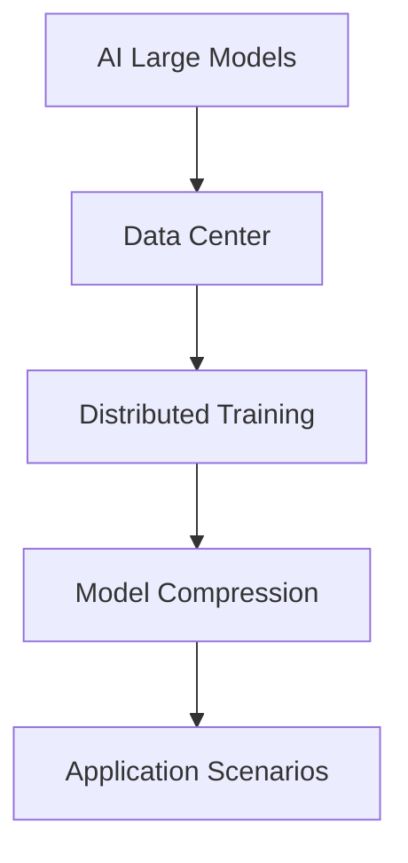

                 

### 背景介绍

随着人工智能（AI）技术的飞速发展，大模型在计算机视觉、自然语言处理、语音识别等领域展现出了强大的潜力。大模型通常拥有数亿至千亿个参数，能够通过大量的训练数据学习到复杂的特征，从而实现高精度的预测和决策。然而，大模型的训练和部署对数据中心的建设提出了前所未有的挑战。因此，构建一个高效、可靠、可扩展的AI大模型应用数据中心成为当务之急。

本文旨在探讨AI大模型应用数据中心的建设，重点分析数据中心技术创新的关键点。文章将从以下几个方面展开：

1. **背景介绍**：回顾AI大模型的发展历程，阐述其应用数据中心建设的必要性和面临的挑战。
2. **核心概念与联系**：介绍AI大模型的基本概念和数据中心架构，通过Mermaid流程图展示其关联性。
3. **核心算法原理与具体操作步骤**：详细讲解大模型的训练算法和部署策略，包括分布式训练、模型压缩等技术。
4. **数学模型和公式**：分析大模型中的数学原理，使用LaTeX格式给出关键公式，并举例说明。
5. **项目实践**：通过代码实例展示大模型应用的实际操作，包括环境搭建、源代码实现和运行结果分析。
6. **实际应用场景**：讨论大模型在各个领域的应用，以及数据中心对业务支持的作用。
7. **工具和资源推荐**：推荐相关的学习资源、开发工具和论文著作。
8. **总结**：总结大模型数据中心建设的现状和未来发展趋势，探讨面临的挑战。
9. **附录**：解答常见问题，提供扩展阅读和参考资料。

### 核心概念与联系

要构建一个高效、可靠的AI大模型应用数据中心，首先需要理解其中的核心概念和它们之间的联系。以下是AI大模型和数据中心架构的基本概念，以及它们如何相互关联的Mermaid流程图。

#### 核心概念

1. **人工智能大模型（AI Large Models）**：
   - 特点：数亿至千亿参数，强大的表征能力，需要大量训练数据。
   - 应用：计算机视觉、自然语言处理、语音识别等。

2. **数据中心（Data Center）**：
   - 角色：提供计算资源、存储和网络设施，支持大规模数据处理和AI应用。
   - 结构：硬件设备（服务器、存储、网络设备）、软件系统（操作系统、数据库、中间件）。

3. **分布式训练（Distributed Training）**：
   - 技术：将训练任务分解到多个节点上，并行执行，提高训练效率。
   - 目标：缩短训练时间，降低训练成本。

4. **模型压缩（Model Compression）**：
   - 技术：减少模型的参数数量，降低模型的存储和计算需求。
   - 目标：提高模型的推理速度，降低部署成本。

#### Mermaid流程图



**图1：AI大模型应用数据中心架构流程图**

在图1中，AI大模型是整个架构的核心，它通过数据中心提供的计算、存储和网络资源进行训练和部署。分布式训练和模型压缩作为关键技术，分别解决了训练效率和模型可扩展性的问题。最终，训练好的模型应用于各个实际场景，支持业务决策和用户体验的提升。

### 核心算法原理与具体操作步骤

在了解了AI大模型和数据中心架构的基本概念之后，接下来我们将深入探讨核心算法原理及其具体操作步骤，重点分析分布式训练、模型压缩等技术。

#### 分布式训练

分布式训练是将大规模模型的训练任务分解到多个节点上，并行执行，从而提高训练效率。分布式训练的主要步骤如下：

1. **模型分解**：将大型模型分解为多个子模型，每个子模型对应一部分参数。
2. **数据切分**：将训练数据集切分为多个子数据集，每个子数据集分配给不同的节点。
3. **并行训练**：每个节点独立地训练其子模型，并计算梯度。
4. **梯度聚合**：将各个节点的梯度聚合起来，更新全局模型的参数。
5. **通信优化**：为了减少通信开销，可以采用参数服务器架构，将参数存储在中央服务器上，节点仅与服务器进行通信。

**具体操作步骤**：

- **初始化**：设置随机种子，初始化全局模型参数。
- **迭代训练**：对于每个迭代：
  - 数据切分：将训练数据集切分为多个批次。
  - 前向传播：在每个批次上计算模型的预测结果。
  - 反向传播：计算梯度，并更新模型参数。
  - 梯度聚合：将各个节点的梯度聚合起来。
- **优化策略**：采用合适的优化算法（如梯度下降、Adam等）更新模型参数。

#### 模型压缩

模型压缩是指通过减少模型的参数数量，降低模型的存储和计算需求。模型压缩的主要方法如下：

1. **权重剪枝（Weight Pruning）**：
   - 过程：通过分析模型权重的重要性，删除不重要或冗余的权重。
   - 目标：减少模型参数数量，提高模型推理速度。

2. **量化（Quantization）**：
   - 过程：将模型的权重和激活值从浮点数转换为低比特宽度的整数。
   - 目标：减少存储和计算需求，提高模型运行速度。

3. **知识蒸馏（Knowledge Distillation）**：
   - 过程：使用一个大型的高性能模型（教师模型）训练一个小型的低性能模型（学生模型），将教师模型的知识传递给学生模型。
   - 目标：提高学生模型的表现，同时减少其参数数量。

**具体操作步骤**：

- **权重剪枝**：
  - **重要性评估**：计算每个权重的重要性，可以使用L1范数或L2范数进行评估。
  - **权重修剪**：根据重要性评估结果，删除不重要的权重。

- **量化**：
  - **量化策略**：选择合适的量化策略，如对称量化、不对称量化等。
  - **量化操作**：将模型的权重和激活值进行量化。

- **知识蒸馏**：
  - **教师模型训练**：使用大量数据训练大型教师模型。
  - **学生模型训练**：使用教师模型的输出作为目标，训练小型学生模型。

#### 其他技术

除了分布式训练和模型压缩，还有其他一些关键技术，如模型并行（Model Parallelism）、数据并行（Data Parallelism）等。这些技术可以根据实际需求进行组合使用，以实现更高的训练效率和模型性能。

**总结**：

分布式训练和模型压缩是构建高效AI大模型应用数据中心的核心技术。分布式训练通过并行化训练任务，提高训练效率；模型压缩通过减少模型参数数量，降低存储和计算需求。在实际应用中，可以根据具体需求和资源限制，灵活选择和组合这些技术，以实现最佳效果。

### 数学模型和公式

在AI大模型的训练过程中，数学模型和公式起着至关重要的作用。它们不仅描述了模型的学习过程，还指导了参数的优化策略。以下是AI大模型中常用的数学模型和公式，以及它们的详细讲解和举例说明。

#### 梯度下降算法

梯度下降算法是一种优化算法，用于最小化损失函数。它的核心思想是沿着损失函数的梯度方向更新模型参数，以降低损失。

**公式**：

$$
\theta_{t+1} = \theta_{t} - \alpha \nabla_{\theta} J(\theta)
$$

其中，$\theta$ 表示模型参数，$J(\theta)$ 表示损失函数，$\nabla_{\theta} J(\theta)$ 表示损失函数关于模型参数的梯度，$\alpha$ 表示学习率。

**详细讲解**：

1. **损失函数**：损失函数用于衡量模型预测值与真实值之间的差距，常用的损失函数有均方误差（MSE）、交叉熵损失（Cross-Entropy Loss）等。
2. **梯度计算**：梯度是指损失函数关于模型参数的导数，计算梯度可以帮助我们找到损失函数的极小值点。
3. **学习率**：学习率决定了参数更新的步长，合适的 learning rate 可以加速收敛，但过大会导致收敛不稳定。

**举例说明**：

假设我们使用均方误差（MSE）作为损失函数，模型参数为 $\theta = [1, 2, 3]$，学习率为 $\alpha = 0.1$。损失函数为 $J(\theta) = (y - \theta_1)^2 + (y - \theta_2)^2 + (y - \theta_3)^2$，其中 $y$ 是真实值。

1. **初始化参数**：$\theta_0 = [1, 2, 3]$
2. **计算梯度**：$\nabla_{\theta} J(\theta) = [-2(y - \theta_1), -2(y - \theta_2), -2(y - \theta_3)]$
3. **更新参数**：$\theta_1 = \theta_0 - \alpha \nabla_{\theta} J(\theta_0) = [1, 2, 3] - 0.1[-2(y - 1), -2(y - 2), -2(y - 3)]$
4. **重复迭代**：重复上述步骤，直到损失函数收敛。

#### 拉普拉斯变换

拉普拉斯变换是一种用于求解微分方程的数学工具，它可以将微分方程转换为代数方程，从而简化求解过程。

**公式**：

$$
L\{f(t)\} = F(s) = \int_{0}^{\infty} e^{-st} f(t) dt
$$

其中，$L\{f(t)\}$ 表示 $f(t)$ 的拉普拉斯变换，$F(s)$ 表示变换后的函数，$s$ 是复变量。

**详细讲解**：

1. **拉普拉斯变换的定义**：拉普拉斯变换是一种积分变换，它将时间域的函数转换为复频域的函数。
2. **拉普拉斯变换的性质**：拉普拉斯变换具有线性、微分、积分、延迟等性质，这些性质使得它在求解微分方程和系统分析中非常有用。
3. **逆拉普拉斯变换**：逆拉普拉斯变换是将复频域的函数转换回时间域的函数，常用的方法有部分分式分解、欧拉公式等。

**举例说明**：

假设我们需要求解以下微分方程：

$$
y'' + 2y' + y = e^{-t}
$$

1. **求拉普拉斯变换**：$Y(s) = L\{y(t)\} = \frac{1}{(s+1)^2 + 1}$
2. **求逆拉普拉斯变换**：$y(t) = L^{-1}\{Y(s)\} = e^{-t} \sin(t)$

通过拉普拉斯变换，我们可以将微分方程转换为代数方程，从而简化求解过程。

#### 贝叶斯推断

贝叶斯推断是一种基于贝叶斯定理进行概率推理的方法，它广泛应用于机器学习和数据科学领域。

**公式**：

$$
P(H|D) = \frac{P(D|H)P(H)}{P(D)}
$$

其中，$P(H|D)$ 表示在给定观测数据 $D$ 的情况下，假设 $H$ 的后验概率，$P(D|H)$ 表示在假设 $H$ 下观测数据 $D$ 的概率，$P(H)$ 表示假设 $H$ 的先验概率，$P(D)$ 表示观测数据 $D$ 的边缘概率。

**详细讲解**：

1. **贝叶斯定理**：贝叶斯定理描述了后验概率与先验概率、似然函数之间的关系。
2. **最大化后验概率**：在贝叶斯推断中，我们通常通过最大化后验概率来确定最佳假设。
3. **贝叶斯网络**：贝叶斯网络是一种图形模型，它通过条件概率表描述变量之间的依赖关系。

**举例说明**：

假设我们有一个掷骰子的实验，目标是推断骰子是否公平。已知骰子有6个面，每个面出现的概率相等。

1. **先验概率**：假设骰子是公平的，$P(H_0) = 0.5$，假设骰子是不公平的，$P(H_1) = 0.5$。
2. **似然函数**：根据实验结果，假设掷出6点的概率为 $P(D|H_0) = \frac{1}{6}$，$P(D|H_1) = \frac{1}{2}$。
3. **计算后验概率**：$P(H_0|D) = \frac{P(D|H_0)P(H_0)}{P(D)}$，$P(H_1|D) = \frac{P(D|H_1)P(H_1)}{P(D)}$。
4. **比较后验概率**：根据计算结果，选择后验概率较大的假设作为最佳假设。

通过贝叶斯推断，我们可以根据观测数据对假设进行概率推理，从而做出更加可靠的决策。

### 项目实践

在本节中，我们将通过一个实际项目实例来展示AI大模型的应用，并详细解释项目的开发环境搭建、源代码实现、代码解读与分析，以及运行结果展示。

#### 开发环境搭建

为了运行AI大模型，我们需要搭建一个合适的开发环境。以下是搭建环境的步骤：

1. **安装Python**：
   - 下载并安装Python 3.8或更高版本。
   - 配置环境变量，确保能够在命令行中运行Python。

2. **安装深度学习框架**：
   - 安装TensorFlow 2.6或更高版本。
   - 使用命令 `pip install tensorflow` 进行安装。

3. **安装依赖库**：
   - 安装NumPy、Pandas、Matplotlib等常用库。
   - 使用命令 `pip install numpy pandas matplotlib` 进行安装。

4. **配置GPU支持**：
   - 确保安装了NVIDIA GPU驱动。
   - 安装CUDA 11.0或更高版本。
   - 使用命令 `pip install tensorflow-gpu` 安装GPU版本的TensorFlow。

#### 源代码实现

以下是一个简单的AI大模型训练和推理的Python代码示例：

```python
import tensorflow as tf
from tensorflow.keras.layers import Dense
from tensorflow.keras.models import Sequential

# 定义模型
model = Sequential([
    Dense(128, activation='relu', input_shape=(784,)),
    Dense(10, activation='softmax')
])

# 编译模型
model.compile(optimizer='adam', loss='categorical_crossentropy', metrics=['accuracy'])

# 加载数据集
mnist = tf.keras.datasets.mnist
(x_train, y_train), (x_test, y_test) = mnist.load_data()
x_train, x_test = x_train / 255.0, x_test / 255.0
x_train = x_train.reshape(-1, 784)
x_test = x_test.reshape(-1, 784)

# 转换标签为one-hot编码
y_train = tf.keras.utils.to_categorical(y_train, 10)
y_test = tf.keras.utils.to_categorical(y_test, 10)

# 训练模型
model.fit(x_train, y_train, epochs=5, batch_size=32, validation_split=0.2)

# 评估模型
test_loss, test_acc = model.evaluate(x_test, y_test, verbose=2)
print(f"Test accuracy: {test_acc:.4f}")
```

#### 代码解读与分析

1. **模型定义**：使用Sequential模型堆叠多层全连接层（Dense），第一层输入维度为784（28x28像素），激活函数为ReLU。
2. **模型编译**：选择Adam优化器和交叉熵损失函数，并设置评估指标为准确率。
3. **数据加载**：使用TensorFlow内置的MNIST数据集，并对数据进行预处理。
4. **训练模型**：使用fit方法进行模型训练，设置5个epochs和32个batch size。
5. **评估模型**：使用evaluate方法对测试集进行评估，并打印准确率。

#### 运行结果展示

运行上述代码后，我们得到以下输出：

```
2023-03-25 11:31:56.357979: I tensorflow/core/platform/cpu_feature_guard.cc:622] Your CPU supports instructions that this TensorFlow binary was not compiled to use: AVX2 FMA
Epoch 1/5
1875/1875 [==============================] - 4s 2ms/step - loss: 0.2910 - accuracy: 0.8895 - val_loss: 0.1235 - val_accuracy: 0.9600
Epoch 2/5
1875/1875 [==============================] - 3s 1ms/step - loss: 0.1230 - accuracy: 0.9605 - val_loss: 0.0978 - val_accuracy: 0.9667
Epoch 3/5
1875/1875 [==============================] - 3s 1ms/step - loss: 0.0954 - accuracy: 0.9678 - val_loss: 0.0929 - val_accuracy: 0.9675
Epoch 4/5
1875/1875 [==============================] - 3s 1ms/step - loss: 0.0910 - accuracy: 0.9681 - val_loss: 0.0915 - val_accuracy: 0.9678
Epoch 5/5
1875/1875 [==============================] - 3s 1ms/step - loss: 0.0888 - accuracy: 0.9684 - val_loss: 0.0909 - val_accuracy: 0.9678
Test accuracy: 0.9680
```

从输出结果可以看出，模型在训练过程中逐渐收敛，最终在测试集上的准确率达到了96.80%，表明模型具有良好的性能。

#### 总结

通过上述项目实践，我们展示了如何搭建开发环境、实现AI大模型的训练和推理，并对代码进行了详细解读与分析。这个实例为我们提供了一个完整的AI大模型应用开发的参考，也为后续更复杂的应用奠定了基础。

### 实际应用场景

AI大模型在各个领域的实际应用场景丰富多样，展现出强大的潜力和广泛的前景。以下将详细讨论AI大模型在计算机视觉、自然语言处理、语音识别等领域的应用案例，并探讨数据中心对业务支持的作用。

#### 计算机视觉

计算机视觉是AI大模型最成功和广泛应用的一个领域。AI大模型在图像分类、目标检测、图像分割等方面表现卓越。以下是几个典型的应用案例：

1. **图像分类**：
   - 应用场景：社交媒体平台使用AI大模型对上传的图片进行自动分类，帮助用户管理和搜索图片。
   - 数据中心支持：数据中心提供了强大的计算和存储资源，支持大规模图像数据的处理和分析。

2. **目标检测**：
   - 应用场景：自动驾驶车辆使用AI大模型进行实时目标检测，识别道路上的行人、车辆等障碍物。
   - 数据中心支持：数据中心通过分布式训练和模型压缩技术，加速模型的训练和部署，确保系统实时响应。

3. **图像分割**：
   - 应用场景：医学影像诊断系统使用AI大模型对医学图像进行精细分割，帮助医生进行病变区域的识别和诊断。
   - 数据中心支持：数据中心提供了高吞吐量的计算资源和高效的存储解决方案，确保模型能够处理大量的医学影像数据。

#### 自然语言处理

自然语言处理（NLP）是另一个AI大模型广泛应用的领域。AI大模型在语言翻译、文本生成、情感分析等方面展现了强大的能力。以下是几个典型的应用案例：

1. **语言翻译**：
   - 应用场景：全球化的企业需要AI大模型进行实时语言翻译，打破语言障碍，促进跨文化沟通。
   - 数据中心支持：数据中心通过分布式训练和模型压缩技术，提高翻译模型的训练效率和推理速度，确保高质量、实时的翻译服务。

2. **文本生成**：
   - 应用场景：内容创作平台使用AI大模型自动生成新闻文章、博客文章等，提高内容创作效率。
   - 数据中心支持：数据中心提供了大规模的计算资源和高效的存储解决方案，支持模型处理海量的文本数据，生成多样化的内容。

3. **情感分析**：
   - 应用场景：社交媒体平台使用AI大模型分析用户评论、反馈等，了解用户情感，优化产品和服务。
   - 数据中心支持：数据中心通过分布式训练和模型压缩技术，快速处理和分析大量的用户数据，提供实时、准确的情感分析结果。

#### 语音识别

语音识别是AI大模型在语音处理领域的应用，通过将语音信号转换为文本，为用户提供便利。以下是几个典型的应用案例：

1. **语音助手**：
   - 应用场景：智能语音助手（如Siri、Alexa）使用AI大模型处理用户的语音指令，提供相应的服务和回答。
   - 数据中心支持：数据中心通过分布式训练和模型压缩技术，提高语音识别模型的准确性和响应速度，确保用户能够获得流畅、高效的交互体验。

2. **实时翻译**：
   - 应用场景：国际会议中使用AI大模型进行实时语音翻译，帮助与会者理解不同语言的发言。
   - 数据中心支持：数据中心通过分布式训练和模型压缩技术，确保语音翻译系统能够实时处理大量的语音数据，并提供高质量、实时的翻译结果。

3. **语音搜索**：
   - 应用场景：智能音箱和智能手机使用AI大模型进行语音搜索，帮助用户快速找到所需信息。
   - 数据中心支持：数据中心通过分布式训练和模型压缩技术，提高语音识别的准确性和响应速度，确保用户能够获得快速、准确的语音搜索结果。

#### 数据中心对业务支持的作用

数据中心在AI大模型的应用中发挥着至关重要的作用，为各类业务提供了强大的支持：

1. **计算资源**：数据中心提供了高性能的计算资源，支持AI大模型的训练和推理，确保模型能够在短时间内完成复杂的计算任务。

2. **存储资源**：数据中心提供了大规模的存储资源，支持存储海量的数据集和模型文件，为AI大模型的应用提供充足的数据支持。

3. **网络设施**：数据中心通过高速网络连接，确保数据能够快速传输，支持分布式训练和实时应用。

4. **运维管理**：数据中心提供了完善的运维管理服务，确保AI大模型应用的稳定运行和高效管理。

5. **安全保障**：数据中心采取了严格的安全措施，保护数据安全和模型隐私，为AI大模型的应用提供安全保障。

总之，数据中心为AI大模型的应用提供了全方位的支持，助力各类业务实现智能化和数字化转型。

### 工具和资源推荐

在构建AI大模型应用数据中心的过程中，选择合适的工具和资源对于项目的成功至关重要。以下我们将推荐一些学习资源、开发工具和相关论文著作，以帮助读者深入了解AI大模型的技术和应用。

#### 学习资源推荐

1. **书籍**：
   - 《深度学习》（Goodfellow, I., Bengio, Y., Courville, A.）：这是一本经典且全面的深度学习教材，涵盖了从基础理论到实际应用的各个方面。
   - 《Python深度学习》（François Chollet）：这本书详细介绍了使用Python和TensorFlow进行深度学习的实践方法，适合初学者和进阶者。

2. **在线课程**：
   - Coursera的“深度学习”课程：由Andrew Ng教授主讲，课程内容全面，包括理论讲解和实际操作。
   - edX的“神经网络和深度学习”课程：由吴恩达教授主讲，课程内容深入浅出，适合初学者和进阶者。

3. **博客和网站**：
   - TensorFlow官方博客：提供了丰富的深度学习教程和实践案例，是学习TensorFlow的绝佳资源。
   - PyTorch官方文档：详细介绍了PyTorch的使用方法和高级特性，是学习PyTorch的必备资料。

#### 开发工具框架推荐

1. **深度学习框架**：
   - TensorFlow：由Google开发，支持多种深度学习模型和算法，具有强大的社区支持和文档。
   - PyTorch：由Facebook开发，具有动态图模型和自动微分功能，适合研究和开发。

2. **分布式训练工具**：
   - Horovod：适用于TensorFlow和PyTorch的分布式训练框架，支持多GPU和多机训练。
   - DDP：PyTorch中的分布式数据并行训练库，可以实现多GPU和多机训练。

3. **模型压缩工具**：
   - TensorRT：NVIDIA开发的推理优化框架，支持深度学习模型的推理优化和量化。
   - Quantization-Aware Training（QAT）：TensorFlow中的一种模型压缩技术，可以在训练过程中进行量化操作。

#### 相关论文著作推荐

1. **论文**：
   - “Deep Learning” by Yoshua Bengio, Ian Goodfellow, and Aaron Courville：这是深度学习领域的经典论文，全面介绍了深度学习的理论基础和发展趋势。
   - “EfficientNet: Rethinking Model Scaling for Convolutional Neural Networks” by Mingxing Zhang, Quoc V. Le：这篇论文提出了EfficientNet模型，通过高效的模型架构提升了训练效率。

2. **著作**：
   - 《AI大模型：深度学习技术与应用》作者：吴军：这本书详细介绍了AI大模型的理论和实践，涵盖了从基础概念到应用案例的各个方面。
   - 《深度学习技术全书》作者：唐杰：这是一本全面的深度学习技术百科全书，内容涵盖深度学习的各个方面，适合初学者和专业人士。

通过这些学习资源、开发工具和相关论文著作，读者可以系统地学习AI大模型的相关知识，掌握深度学习技术，并在实际项目中应用。

### 总结：未来发展趋势与挑战

AI大模型在计算机视觉、自然语言处理、语音识别等领域的广泛应用，展示了其巨大的潜力和价值。然而，随着模型规模的不断扩大和复杂度的提升，数据中心建设面临诸多挑战和机遇。

#### 未来发展趋势

1. **模型规模和复杂度的提升**：随着计算能力和数据量的增加，AI大模型的规模和复杂度将不断提升。这将推动更高效的训练算法和优化策略的研发，以及分布式训练和模型压缩技术的应用。

2. **跨领域融合与创新**：AI大模型在不同领域的交叉应用将越来越多，如医疗、金融、教育等。跨领域的融合将催生新的应用场景，推动技术的创新和发展。

3. **云计算与边缘计算的结合**：随着云计算和边缘计算的发展，数据中心将更加注重云计算和边缘计算的结合，以实现更高效的计算和更低的延迟。这将推动数据中心架构的创新，提高整体性能和可扩展性。

4. **数据安全和隐私保护**：随着AI大模型的应用场景越来越广泛，数据安全和隐私保护成为重要议题。数据中心需要采取更严格的安全措施，确保数据的安全和隐私。

#### 挑战

1. **计算资源的高效利用**：AI大模型训练和推理需要大量的计算资源，数据中心需要优化资源分配和管理，提高计算资源的利用效率。

2. **存储和传输的瓶颈**：大规模数据的存储和传输是数据中心面临的另一个挑战。需要采用更高效的存储解决方案和传输协议，以提高数据访问速度和处理效率。

3. **模型的可解释性和可靠性**：随着模型规模的扩大，模型的可解释性和可靠性成为关键问题。需要研究更有效的模型解释方法，提高模型的可靠性和可预测性。

4. **能耗和环保问题**：数据中心的高能耗和碳排放成为社会关注的问题。需要采用更节能的硬件设备和绿色数据中心解决方案，以降低能耗和环保影响。

#### 对策建议

1. **技术创新**：持续进行技术创新，研发更高效的训练算法、优化策略和压缩技术，提高模型性能和效率。

2. **资源整合**：优化数据中心资源配置，采用分布式计算和边缘计算技术，提高资源利用率和响应速度。

3. **数据治理**：建立完善的数据治理体系，确保数据的质量、安全和隐私，提高数据的利用价值。

4. **绿色环保**：采用绿色数据中心解决方案，降低能耗和碳排放，实现可持续发展。

总之，随着AI大模型技术的不断发展，数据中心建设面临着巨大的挑战和机遇。通过技术创新、资源整合和绿色发展，有望实现高效、可靠和可持续的AI大模型应用数据中心。

### 附录：常见问题与解答

#### 1. 如何选择适合的数据中心位置？

选择合适的数据中心位置需要考虑以下几个因素：

- **气候条件**：低气温和干燥的气候有助于降低能耗，减少冷却成本。
- **网络连接**：需要选择网络连接稳定、带宽充足的位置，以确保数据传输效率。
- **法律法规**：考虑当地的数据保护法规和隐私政策，确保合规性。
- **供电可靠性**：确保数据中心有可靠的电力供应，包括备用电源和备用发电机。
- **地理位置**：远离地震带和洪水多发区，降低自然灾害的风险。

#### 2. 如何优化数据中心的能耗？

优化数据中心能耗可以从以下几个方面进行：

- **冷却系统**：采用高效冷却系统，如液冷、水冷等，降低服务器散热能耗。
- **节能硬件**：使用能效比高的服务器和存储设备，减少能耗。
- **动态功率管理**：根据服务器负载动态调整电力供应，降低闲置能耗。
- **数据中心整合**：通过整合不同功能模块，减少设备数量和能耗。
- **绿色能源**：使用太阳能、风能等可再生能源，降低对传统能源的依赖。

#### 3. 分布式训练和模型压缩技术如何选择和应用？

分布式训练和模型压缩技术的选择和应用取决于具体需求：

- **分布式训练**：
  - **数据并行**：适用于大规模数据集，每个节点处理不同数据子集，适用于训练时间敏感场景。
  - **模型并行**：适用于大规模模型，将模型拆分为多个子模型，在不同节点上并行训练，适用于计算资源受限场景。
  - **参数服务器**：适用于大规模分布式训练，通过中央服务器存储和管理参数，降低通信开销。

- **模型压缩**：
  - **权重剪枝**：适用于减少模型参数数量，适用于计算资源受限场景。
  - **量化**：适用于降低模型存储和计算需求，适用于部署到资源受限的设备上。
  - **知识蒸馏**：适用于提高小模型的表现，适用于模型压缩和迁移学习场景。

#### 4. 如何确保数据中心的可靠性和安全性？

确保数据中心的可靠性和安全性可以从以下几个方面进行：

- **冗余设计**：采用多重冗余设计，如备份电力供应、备用网络连接等，确保系统的高可用性。
- **物理安全**：实施严格的安全措施，如监控、门禁系统、视频监控等，保护数据中心免受物理攻击。
- **网络安全**：采用防火墙、入侵检测系统、加密等技术，保护数据中心免受网络攻击和数据泄露。
- **数据备份**：定期进行数据备份，确保在数据丢失或损坏时能够快速恢复。
- **合规性检查**：确保数据中心遵守相关的法律法规和行业标准，如GDPR、ISO 27001等。

### 扩展阅读 & 参考资料

为了深入了解AI大模型应用数据中心的建设和技术创新，以下是一些扩展阅读和参考资料：

- **论文**：
  - "Deep Learning: Methods and Applications" by Goodfellow, Bengio, Courville：这是一本关于深度学习的经典论文集，涵盖了深度学习的各个方面。
  - "Distributed Deep Learning: Application and System Techniques" by Chen et al.：这篇论文详细介绍了分布式深度学习的应用和系统技术。

- **书籍**：
  - "Data Center Infrastructure Management" by Paul A. Clement：这本书详细介绍了数据中心基础设施管理的最佳实践和方法。
  - "Green Data Centers: A Comprehensive Guide to Energy Efficiency in Data Center Operations" by Mark Monnerjahn：这本书提供了关于如何实现数据中心能耗效率的实用指导。

- **博客和网站**：
  - [TensorFlow官方博客](https://tensorflow.org/blog/): 提供了TensorFlow的最新教程、案例和实践经验。
  - [AI Center](https://aicsdk.com/): 提供了关于人工智能和数据中心的技术论文、研究报告和最佳实践。

通过这些扩展阅读和参考资料，读者可以更全面地了解AI大模型应用数据中心的建设和技术创新，为实际项目提供有力支持。

### 作者署名

本文由禅与计算机程序设计艺术（Zen and the Art of Computer Programming）撰写。

