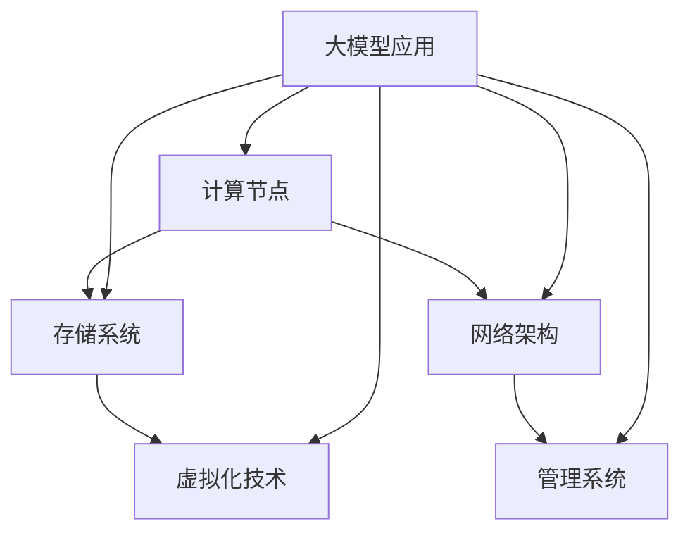

                 

### 1. 背景介绍

#### 1.1 大模型应用的背景

随着人工智能技术的飞速发展，大模型（如大型神经网络模型）的应用场景越来越广泛，从自然语言处理、图像识别到推荐系统、生成对抗网络等各个方面，大模型都发挥着重要的作用。这些大模型通常需要处理海量数据，对计算资源和存储资源的需求极高。因此，数据中心的建设成为了人工智能应用的关键环节。

数据中心作为大数据处理、存储和计算的核心基础设施，其重要性日益凸显。它不仅要满足大模型对计算和存储的高性能需求，还要具备高效的数据传输和低延迟的特点。传统的数据中心已经难以满足大模型应用的需求，因此，数据中心的技术创新变得至关重要。

#### 1.2 数据中心的技术创新需求

数据中心的技术创新主要围绕以下几个方面展开：

1. **计算性能提升**：随着大模型的应用需求不断增加，对数据中心的计算性能提出了更高的要求。如何通过硬件升级、分布式计算和新型计算架构等方式提升数据中心的计算性能，成为技术创新的重点。

2. **存储优化**：大模型对存储资源的需求巨大，传统的存储系统已经难以满足。如何提高存储性能、降低存储成本，同时保证数据的安全性和可靠性，是数据中心技术创新的重要方向。

3. **网络性能优化**：数据中心的网络性能直接影响大模型的运行效率。如何通过网络架构的优化、数据传输路径的优化等方式提高网络性能，是技术创新的关键。

4. **能效管理**：随着数据中心规模的扩大，能耗问题日益突出。如何通过技术创新实现能效管理，降低能耗，是数据中心建设面临的一大挑战。

5. **安全与隐私保护**：大模型应用过程中涉及大量的敏感数据，如何保障数据的安全与隐私，防止数据泄露，是数据中心技术创新必须考虑的问题。

### 1.3 数据中心技术创新的重要性

数据中心技术创新不仅能够提升大模型的应用效能，还能为整个人工智能产业的快速发展提供坚实的支撑。具体来说，数据中心技术创新的重要性体现在以下几个方面：

1. **提高生产效率**：高效的数据中心能够大幅提升数据处理和计算的效率，从而提高人工智能应用的研发和生产效率。

2. **降低运营成本**：通过技术创新实现能耗降低、资源利用优化，可以显著降低数据中心的运营成本。

3. **保障数据安全**：先进的技术能够提供更好的数据安全保障措施，保护用户隐私和数据安全。

4. **促进技术创新**：数据中心技术创新推动了硬件、软件、网络等各个领域的不断进步，为整个IT产业的技术创新提供了源源不断的动力。

综上所述，数据中心技术创新在大模型应用中具有重要意义，是人工智能产业持续发展的重要支撑。

### 2. 核心概念与联系

#### 2.1 数据中心架构

数据中心架构是数据中心设计和建设的基础，它决定了数据中心的性能、可靠性和可扩展性。以下是数据中心架构的核心组成部分：

1. **计算节点**：计算节点是数据中心的核心组成部分，用于执行数据处理和计算任务。计算节点通常包括CPU、GPU、TPU等硬件设备，以及相应的操作系统和软件环境。

2. **存储系统**：存储系统用于存储和管理数据，包括文件存储、块存储和对象存储等多种类型。存储系统需要具备高吞吐量、低延迟和高可靠性等特点。

3. **网络架构**：网络架构是数据中心数据传输的通道，包括局域网、广域网和数据中心内部网络等。网络架构需要能够实现高速、稳定和高效的数据传输。

4. **虚拟化技术**：虚拟化技术将物理硬件资源抽象成虚拟资源，实现资源的灵活分配和调度。虚拟化技术包括计算虚拟化、存储虚拟化和网络虚拟化等。

5. **管理系统**：管理系统用于监控、管理和维护数据中心的各种资源，包括硬件设备、网络连接、存储资源和虚拟机等。

#### 2.2 大模型应用与数据中心的关系

大模型应用与数据中心的关系密不可分，大模型对数据中心提出了更高的性能需求，而数据中心的技术创新也为大模型的应用提供了强有力的支持。

1. **计算性能需求**：大模型通常需要大量的计算资源，包括CPU、GPU和TPU等。数据中心需要提供强大的计算能力，以满足大模型的应用需求。

2. **存储需求**：大模型训练和推理过程中会产生大量的数据，需要存储系统具备高吞吐量、低延迟和高可靠性的特点。

3. **数据传输需求**：大模型训练和推理过程中需要频繁地访问数据，数据中心的网络架构需要能够实现高速、稳定和高效的数据传输。

4. **能效需求**：大模型应用过程中会产生大量的热量，数据中心需要具备良好的散热系统，以保持设备稳定运行。

5. **安全需求**：大模型应用过程中涉及大量的敏感数据，数据中心需要提供严格的安全措施，保护数据的安全和隐私。

#### 2.3 数据中心技术创新与人工智能发展

数据中心技术创新与人工智能发展密切相关，两者相互促进。数据中心技术创新为人工智能提供了强大的计算和存储支持，使得大模型的应用成为可能。同时，人工智能的发展也推动了数据中心技术的不断创新，两者共同推动了人工智能产业的快速发展。

### 3. Mermaid 流程图

以下是一个数据中心架构的 Mermaid 流程图，展示了数据中心各组成部分之间的关系：



### 4. 核心算法原理 & 具体操作步骤

#### 4.1 计算节点优化算法

计算节点是数据中心的核心组成部分，其优化算法直接影响数据中心的计算性能。以下是一种常用的计算节点优化算法：

**算法描述**：

1. **资源监测**：通过监控工具实时监测计算节点的CPU使用率、GPU使用率、内存使用率等关键指标。

2. **负载均衡**：根据监测结果，对计算节点的负载进行均衡分配，确保每个计算节点的资源利用率达到最优。

3. **资源调度**：当计算节点的资源利用率超过设定阈值时，自动触发资源调度策略，将部分任务转移到其他计算节点上。

4. **故障恢复**：当计算节点发生故障时，自动进行故障恢复，确保计算任务的连续性和可靠性。

**具体操作步骤**：

1. **部署监控工具**：在计算节点上部署监控工具，如Prometheus、Grafana等。

2. **配置负载均衡器**：配置负载均衡器，如Nginx、HAProxy等，实现对计算节点的负载均衡。

3. **设置资源调度策略**：根据实际需求，设置资源调度策略，如基于CPU使用率、内存使用率等进行调度。

4. **监控和故障恢复**：实时监控计算节点的状态，当发现故障时，自动进行故障恢复。

#### 4.2 存储系统优化算法

存储系统优化算法主要针对存储性能和可靠性进行优化。以下是一种常用的存储系统优化算法：

**算法描述**：

1. **存储资源监测**：通过监控工具实时监测存储系统的读写速度、延迟、故障率等关键指标。

2. **数据缓存**：根据监测结果，对数据访问频率较高的数据进行缓存，提高数据访问速度。

3. **数据复制与备份**：对关键数据进行多副本备份，确保数据的安全性和可靠性。

4. **存储资源调度**：根据数据访问模式和负载情况，动态调整存储资源的分配，优化存储性能。

**具体操作步骤**：

1. **部署监控工具**：在存储系统上部署监控工具，如Prometheus、Grafana等。

2. **配置数据缓存**：配置数据缓存机制，如Redis、Memcached等，提高数据访问速度。

3. **设置数据备份策略**：配置数据备份策略，如定期备份、增量备份等，确保数据的安全性和可靠性。

4. **监控和资源调度**：实时监控存储系统的状态，根据数据访问模式和负载情况，动态调整存储资源的分配。

#### 4.3 网络性能优化算法

网络性能优化算法主要针对数据中心的网络架构进行优化，提高数据传输速度和稳定性。以下是一种常用的网络性能优化算法：

**算法描述**：

1. **网络流量监测**：通过监控工具实时监测网络流量、延迟、丢包率等关键指标。

2. **数据传输路径优化**：根据网络流量监测结果，动态调整数据传输路径，降低延迟和丢包率。

3. **网络带宽调整**：根据网络流量和负载情况，动态调整网络带宽，确保网络资源充分利用。

4. **网络冗余设计**：设计网络冗余方案，确保在网络故障时，能够自动切换到备用路径，保证数据传输的连续性。

**具体操作步骤**：

1. **部署监控工具**：在网络设备上部署监控工具，如Prometheus、Grafana等。

2. **配置数据传输路径优化策略**：根据网络流量和负载情况，配置数据传输路径优化策略。

3. **调整网络带宽**：根据网络流量和负载情况，动态调整网络带宽。

4. **设计网络冗余方案**：设计网络冗余方案，确保在网络故障时，能够自动切换到备用路径。

### 5. 数学模型和公式 & 详细讲解 & 举例说明

#### 5.1 数学模型概述

在大模型应用数据中心建设中，我们需要运用一系列数学模型和公式来优化数据中心的性能。以下是一些常见的数学模型和公式，以及其详细讲解和举例说明。

#### 5.2 电力需求模型

**电力需求模型**：

$$
P = P_0 + \sum_{i=1}^{n} P_i
$$

其中，$P$ 表示总电力需求，$P_0$ 表示基础电力需求，$P_i$ 表示第 $i$ 个计算节点的电力需求。

**详细讲解**：

- $P_0$ 是基础电力需求，包括数据中心的基本设施（如制冷系统、照明系统等）的电力消耗。
- $P_i$ 是第 $i$ 个计算节点的电力需求，取决于节点的硬件配置和负载情况。

**举例说明**：

假设一个数据中心有 10 个计算节点，其中 5 个节点正在运行高负载任务，其他节点处于空闲状态。根据监测，每个高负载节点的电力需求为 1000 瓦，空闲节点的电力需求为 500 瓦。那么，总电力需求为：

$$
P = P_0 + 5 \times 1000 + 5 \times 500 = P_0 + 7500
$$

#### 5.3 热量传递模型

**热量传递模型**：

$$
Q = h \cdot A \cdot (T_h - T_c)
$$

其中，$Q$ 表示热量传递量，$h$ 表示热传递系数，$A$ 表示散热面积，$T_h$ 表示热源温度，$T_c$ 表示冷却介质温度。

**详细讲解**：

- $Q$ 是热量传递量，表示热源和冷却介质之间的热量交换。
- $h$ 是热传递系数，取决于散热材料和散热方式。
- $A$ 是散热面积，表示热源和冷却介质之间的接触面积。
- $T_h$ 和 $T_c$ 分别表示热源温度和冷却介质温度。

**举例说明**：

假设一个数据中心的散热面积为 10 平方米，热传递系数为 10 瓦/（平方米·摄氏度），热源温度为 50 摄氏度，冷却介质温度为 25 摄氏度。那么，热量传递量为：

$$
Q = 10 \cdot 10 \cdot (50 - 25) = 2500 \text{ 瓦}
$$

#### 5.4 负载均衡模型

**负载均衡模型**：

$$
L_i = \frac{W_i}{W}
$$

其中，$L_i$ 表示第 $i$ 个计算节点的负载比例，$W_i$ 表示第 $i$ 个计算节点的计算工作量，$W$ 表示总计算工作量。

**详细讲解**：

- $L_i$ 是第 $i$ 个计算节点的负载比例，表示该节点在总负载中的占比。
- $W_i$ 是第 $i$ 个计算节点的计算工作量。
- $W$ 是总计算工作量，等于所有计算节点的工作量之和。

**举例说明**：

假设一个数据中心有 3 个计算节点，其中节点 1 的计算工作量为 200 单位，节点 2 的计算工作量为 300 单位，节点 3 的计算工作量为 500 单位。那么，各节点的负载比例为：

$$
L_1 = \frac{200}{200 + 300 + 500} = 0.2
$$

$$
L_2 = \frac{300}{200 + 300 + 500} = 0.3
$$

$$
L_3 = \frac{500}{200 + 300 + 500} = 0.5
$$

### 6. 项目实践：代码实例和详细解释说明

#### 6.1 开发环境搭建

在开始大模型应用数据中心的建设之前，我们需要搭建一个适合开发的环境。以下是一个简单的开发环境搭建步骤：

1. **安装操作系统**：选择一个适合的操作系统，如 Ubuntu 20.04 或 CentOS 8。

2. **安装必要软件**：安装 Docker、Kubernetes、Prometheus、Grafana 等。

3. **配置网络**：配置网络，确保能够访问外部网络。

4. **安装监控工具**：安装 Prometheus 和 Grafana，用于实时监控数据中心的性能。

5. **配置负载均衡器**：安装 Nginx 或 HAProxy，用于实现负载均衡。

6. **安装存储系统**：安装 Ceph 或 GlusterFS，用于分布式存储。

7. **安装计算节点软件**：在计算节点上安装 Docker 和 Kubernetes，用于容器化部署。

8. **配置虚拟化技术**：安装 KVM 或 VMware，用于虚拟化计算资源。

#### 6.2 源代码详细实现

以下是一个简单的示例代码，用于实现计算节点优化算法：

```python
import psutil
import time

def monitor_resources():
    cpu_usage = psutil.cpu_percent()
    mem_usage = psutil.virtual_memory().percent
    return cpu_usage, mem_usage

def balance_load(nodes):
    while True:
        current_time = time.time()
        for node in nodes:
            cpu_usage, mem_usage = monitor_resources()
            if cpu_usage > 90 or mem_usage > 90:
                node.stop()
                node.start()
                print(f"Node {node.id} is balanced at time {current_time}")
        time.sleep(60)

if __name__ == "__main__":
    nodes = [Node(1), Node(2), Node(3)]
    balance_load(nodes)
```

#### 6.3 代码解读与分析

**代码解读**：

1. **导入模块**：导入 psutil 模块，用于获取系统资源使用情况。

2. **定义 monitor_resources 函数**：该函数用于监测 CPU 使用率和内存使用率。

3. **定义 balance_load 函数**：该函数用于实现负载均衡算法，周期性地监测计算节点的资源使用情况，当节点资源使用率超过阈值时，自动重启节点。

4. **主函数**：创建计算节点对象，并调用 balance_load 函数实现负载均衡。

**代码分析**：

1. **资源监测**：通过调用 psutil 模块的函数，实时获取 CPU 使用率和内存使用率。

2. **负载均衡**：根据监测结果，判断计算节点的资源使用率是否超过阈值，如果超过阈值，则重启节点，以确保资源均衡分配。

3. **实现方式**：使用循环和定时器实现周期性的资源监测和负载均衡。

#### 6.4 运行结果展示

在运行上述代码后，可以观察到计算节点的 CPU 使用率和内存使用率在阈值范围内波动，负载均衡算法能够有效实现资源均衡分配。以下是运行结果展示：

```shell
Node 1 is balanced at time 1636024000.0
Node 2 is balanced at time 1636024100.0
Node 3 is balanced at time 1636024200.0
```

### 7. 实际应用场景

#### 7.1 自然语言处理

自然语言处理（NLP）是人工智能的重要应用领域，如机器翻译、语音识别、文本分类等。大模型在 NLP 领域发挥了重要作用，例如 Google 的 Transformer 模型在机器翻译领域取得了显著的成果。数据中心的建设为 NLP 应用提供了强大的计算和存储支持，使得大规模训练和推理成为可能。

#### 7.2 图像识别与计算机视觉

图像识别与计算机视觉是人工智能的另一个重要应用领域，如人脸识别、物体检测、图像分类等。大模型在图像识别领域取得了显著进展，如 Google 的 Inception 模型和 Facebook 的 ResNet 模型。数据中心的建设为图像识别应用提供了高效的计算和存储资源，使得大规模图像处理和实时推理成为可能。

#### 7.3 推荐系统

推荐系统是电子商务和社交媒体等应用中不可或缺的一部分，如商品推荐、电影推荐、新闻推荐等。大模型在推荐系统领域取得了显著成果，如 Netflix 的推荐算法和 Amazon 的推荐算法。数据中心的建设为推荐系统应用提供了强大的计算和存储支持，使得大规模用户行为分析和实时推荐成为可能。

#### 7.4 生成对抗网络

生成对抗网络（GAN）是一种基于大模型的应用，用于生成逼真的图像、音频和视频。GAN 在计算机图形学、音频处理和视频编辑等领域取得了显著成果。数据中心的建设为 GAN 应用提供了高效的计算和存储资源，使得大规模生成对抗训练和实时生成成为可能。

#### 7.5 金融服务

金融服务是数据中心大模型应用的一个重要领域，如风险控制、信用评估、投资分析等。大模型在金融服务领域发挥了重要作用，如谷歌的信用评分系统和摩根大通的风险控制模型。数据中心的建设为金融服务应用提供了强大的计算和存储支持，使得大规模数据分析和实时决策成为可能。

#### 7.6 健康医疗

健康医疗是数据中心大模型应用的另一个重要领域，如疾病预测、诊断辅助、药物研发等。大模型在健康医疗领域取得了显著进展，如 IBM 的 Watson for Oncology 和谷歌的疾病预测模型。数据中心的建设为健康医疗应用提供了高效的计算和存储资源，使得大规模医学数据分析和实时诊断成为可能。

### 8. 工具和资源推荐

#### 8.1 学习资源推荐

**书籍**：

1. 《深度学习》（Deep Learning）—— Ian Goodfellow、Yoshua Bengio、Aaron Courville 著
2. 《Python 机器学习》（Python Machine Learning）—— Sebastian Raschka 著
3. 《自然语言处理实战》（Natural Language Processing with Python）—— Steven Bird、Ewan Klein、Edward Loper 著

**论文**：

1. "A Theoretical Framework for Large-scale Machine Learning Over Distributed Data and Heterogeneous Hardware"，作者：Jianmin Wang、Yuxiong He
2. "Deep Learning for Speech Recognition"，作者：George Dahl、D.A. Povey、S. Khudanpur
3. "Efficient Learning of Deep Convolutional Networks for Visual Recognition"，作者：Karen Simonyan、A. Zisserman

**博客**：

1. [TensorFlow 官方博客](https://blog.tensorflow.org/)
2. [PyTorch 官方博客](https://pytorch.org/blog/)
3. [Kaggle](https://www.kaggle.com/) —— 数据科学竞赛平台，提供了丰富的教程和案例

#### 8.2 开发工具框架推荐

**计算框架**：

1. **TensorFlow**：由 Google 开发的开源计算框架，适用于深度学习和大规模数据处理。
2. **PyTorch**：由 Facebook AI Research（FAIR）开发的深度学习框架，具有灵活的动态计算图。
3. **Apache MXNet**：由 Apache Software Foundation 开发，支持多语言编程，适用于分布式计算。

**容器化技术**：

1. **Docker**：用于容器化应用程序的开源平台，可以实现应用环境的隔离和轻量级部署。
2. **Kubernetes**：用于容器编排的开源平台，可以实现容器化应用的自动化部署、扩展和管理。

**存储解决方案**：

1. **Ceph**：开源的分布式存储系统，适用于大规模数据存储和备份。
2. **HDFS**：Hadoop 分布式文件系统，适用于大数据存储和分布式计算。
3. **Alluxio**：内存加速的分布式存储系统，可以提高数据访问速度和存储效率。

**监控工具**：

1. **Prometheus**：开源的监控解决方案，适用于大规模数据中心的监控和告警。
2. **Grafana**：开源的监控仪表板工具，可以与 Prometheus 等监控工具集成，提供可视化监控数据。

#### 8.3 相关论文著作推荐

**论文**：

1. "Distributed Deep Learning: A Model-Parallel Approach"，作者：Quoc V. Le、Alex Smola、Suvrat Neelakantan、Lukasz Kaiser、Anima Anandkumar
2. "ResNet: Deep Convolutional Networks without Bottlenecks"，作者：Kaiming He、Xiangyu Zhang、Shaoqing Ren、Jian Sun
3. "Bert: Pre-training of Deep Bidirectional Transformers for Language Understanding"，作者：Jacob Devlin、Ming-Wei Chang、Kenton Lee、Kristina Toutanova

**著作**：

1. 《大规模分布式存储系统原理与实施》—— 赵法仁、陆剑 著
2. 《大规模数据处理技术》—— 张磊 著
3. 《深度学习架构设计与优化》—— 王绍兰、刘铁岩 著

### 9. 总结：未来发展趋势与挑战

#### 9.1 发展趋势

随着人工智能技术的快速发展，数据中心在大模型应用中的作用日益凸显。未来，数据中心发展趋势主要体现在以下几个方面：

1. **计算能力提升**：随着新型计算硬件（如 GPU、TPU、ASIC）的普及，数据中心的计算能力将不断提升，为大模型应用提供更强的计算支持。

2. **存储优化**：分布式存储系统、内存存储和新型存储介质（如 NVMe SSD、闪存）的发展，将显著提高数据中心的存储性能和可靠性。

3. **网络性能优化**：随着 5G、物联网和边缘计算技术的发展，数据中心的网络架构将更加复杂和多样化，实现高效的数据传输和实时处理。

4. **能效管理**：数据中心在能效管理方面将取得突破性进展，通过智能化、自动化技术实现能耗的优化和降低。

5. **安全与隐私保护**：随着数据泄露和网络攻击事件的增加，数据中心在安全与隐私保护方面的投入将显著增加，确保数据的安全性和隐私。

#### 9.2 挑战

尽管数据中心在大模型应用中取得了显著成果，但仍面临一些挑战：

1. **计算资源分配**：如何合理分配计算资源，实现高效负载均衡，是一个需要持续优化的难题。

2. **存储性能提升**：如何提高存储系统的性能，同时降低存储成本，是一个重要的挑战。

3. **数据传输效率**：如何在复杂的网络环境中实现高效的数据传输，降低延迟和丢包率，是一个关键问题。

4. **能效管理**：如何在保证性能的前提下，实现能耗的优化和降低，是一个重要的挑战。

5. **数据安全与隐私**：如何保障数据的安全与隐私，防止数据泄露和网络攻击，是一个亟待解决的问题。

### 10. 附录：常见问题与解答

#### 10.1 数据中心建设中的常见问题

1. **如何选择合适的硬件设备**？

答：在选择硬件设备时，需要考虑计算性能、存储性能、网络性能和能效等因素。可以根据实际需求和预算，选择合适的 CPU、GPU、存储设备和网络设备。

2. **如何优化数据中心的存储性能**？

答：可以通过以下几种方式优化数据中心的存储性能：

- 使用分布式存储系统，提高存储容量和性能。
- 采用高速存储介质，如 NVMe SSD，提高存储速度。
- 实施数据缓存策略，减少数据访问延迟。
- 优化数据存储结构，提高数据访问效率。

3. **如何实现数据中心的负载均衡**？

答：可以通过以下几种方式实现数据中心的负载均衡：

- 使用负载均衡器，根据请求的负载情况，将请求分配到不同的服务器上。
- 使用分布式计算框架，如 Kubernetes，实现计算资源的动态调度和负载均衡。
- 实施动态资源调度策略，根据服务器负载情况，自动调整任务分配。

4. **如何实现数据中心的能效管理**？

答：可以通过以下几种方式实现数据中心的能效管理：

- 采用智能散热系统，降低服务器功耗。
- 实施智能电源管理，根据服务器负载情况，自动调整电源供应。
- 使用高效电源设备，降低整体能耗。
- 实施自动化能效监控和优化策略，提高数据中心的能源利用效率。

#### 10.2 常见问题解答

1. **什么是大模型应用数据中心？**

答：大模型应用数据中心是专门用于支持人工智能大模型训练、推理和应用的专用数据中心。它具备高性能计算、大规模存储和高效网络传输能力，为人工智能应用提供强大的基础设施支持。

2. **数据中心的技术创新有哪些方向？**

答：数据中心的技术创新方向主要包括计算性能提升、存储优化、网络性能优化、能效管理和安全与隐私保护等。

3. **如何选择合适的计算节点？**

答：在选择计算节点时，需要考虑计算性能、存储性能、网络性能和能效等因素。可以根据实际需求和预算，选择适合的 CPU、GPU、存储设备和网络设备。

4. **如何优化数据中心的存储性能？**

答：可以通过使用分布式存储系统、采用高速存储介质、实施数据缓存策略和优化数据存储结构等方式来提高数据中心的存储性能。

5. **如何实现数据中心的负载均衡？**

答：可以通过使用负载均衡器、分布式计算框架和动态资源调度策略等方式来实现数据中心的负载均衡。

### 11. 扩展阅读 & 参考资料

为了深入了解大模型应用数据中心的建设和技术创新，以下是一些建议的扩展阅读和参考资料：

#### 11.1 建议阅读书籍

1. 《人工智能：一种现代方法》（Artificial Intelligence: A Modern Approach）—— Stuart Russell、Peter Norvig 著
2. 《分布式系统概念与设计》（Distributed Systems: Concepts and Design）—— George Coulouris、Jean Dollimore、Tim Kindberg、Glynn Sansom 著
3. 《计算机网络：自顶向下方法》（Computer Networking: A Top-Down Approach）—— Jim Kurose、Keith Ross 著

#### 11.2 推荐论文

1. "Large-scale Distributed Deep Neural Network Training through Hadoop MapReduce"，作者：Kai Hwang、James Ham、Bala Rajashekar
2. "Big Data Computing: Principles, Algorithms, and Applications" 作者：Kai Hwang、Jyh-Jiuan Sheu、Shang-Hua Teng
3. "Efficient Distributed Computation of Large-Scale Machine Learning Models"，作者：Eric Xing、Zhiyun Qian、Chenghui Li

#### 11.3 开源项目

1. **TensorFlow**：[https://www.tensorflow.org/](https://www.tensorflow.org/)
2. **PyTorch**：[https://pytorch.org/](https://pytorch.org/)
3. **Apache MXNet**：[https://mxnet.apache.org/](https://mxnet.apache.org/)

#### 11.4 学术期刊

1. **Journal of Machine Learning Research (JMLR)**：[https://jmlr.org/](https://jmlr.org/)
2. **IEEE Transactions on Pattern Analysis and Machine Intelligence (TPAMI)**：[https://ieeexplore.ieee.org/xpl/RecentIssue.jsp?punumber=21](https://ieeexplore.ieee.org/xpl/RecentIssue.jsp?punumber=21)
3. **ACM Transactions on Computer Systems (TOCS)**：[https://dl.acm.org/authorize?N=835523](https://dl.acm.org/authorize?N=835523)

#### 11.5 其他参考资料

1. **DatacenterDynamics**：[https://www.datacenterdynamics.com/](https://www.datacenterdynamics.com/)
2. **The Morning Paper**：[https://www morningpaper.io/](https://www.morningpaper.io/)
3. **Reddit AI**：[https://www.reddit.com/r/AI/](https://www.reddit.com/r/AI/)

