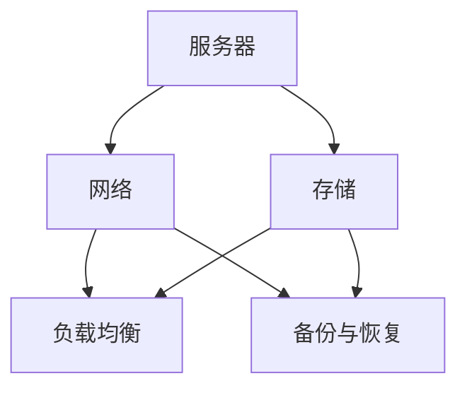

                 

### 背景介绍

### Background Introduction

随着人工智能（AI）技术的快速发展，大模型（Large-scale Models）的应用成为当前研究的热点。大模型如GPT-3、BERT、ViT等，通过在大量数据上进行训练，能够实现高效的自然语言处理、计算机视觉等任务。然而，大模型的应用离不开高效的数据处理与存储，这就需要建设一个强大的数据中心。数据中心的建设不仅需要考虑硬件设备的选择与配置，还需要关注数据传输、存储、安全等方面的技术。本文将从数据中心投资与建设两个方面，详细探讨AI大模型应用数据中心的建设问题。

首先，数据中心建设是AI大模型应用的基础。数据中心是集计算、存储、网络等多种资源于一体的综合信息系统，能够为AI大模型提供强大的计算和存储能力。数据中心的建设涉及到多个层面的技术，包括服务器硬件选型、网络架构设计、存储系统建设、安全保障措施等。一个高效、稳定的数据中心是AI大模型正常运行的前提。

其次，数据中心投资是推动AI大模型应用的关键。数据中心的建设需要大量的资金投入，包括硬件设备的采购、软件系统的研发、基础设施的搭建等。同时，数据中心运营过程中的维护、升级等也需要持续的资金支持。如何合理规划投资，实现数据中心的高效运营，是当前企业和机构需要关注的问题。

本文将分为以下几个部分进行详细探讨：

1. **核心概念与联系**：介绍数据中心建设中的核心概念，包括服务器、网络、存储等，并通过Mermaid流程图展示各概念之间的联系。

2. **核心算法原理 & 具体操作步骤**：分析数据中心建设过程中的关键技术，包括服务器硬件选型、网络架构设计、存储系统建设等。

3. **数学模型和公式 & 详细讲解 & 举例说明**：介绍数据中心建设中的数学模型和公式，并通过实例进行详细讲解。

4. **项目实践：代码实例和详细解释说明**：通过具体项目实例，展示数据中心建设的实际操作步骤和代码实现。

5. **实际应用场景**：探讨数据中心在不同行业中的应用场景。

6. **工具和资源推荐**：推荐学习资源、开发工具和框架。

7. **总结：未来发展趋势与挑战**：总结数据中心建设的发展趋势和面临的挑战。

8. **附录：常见问题与解答**：回答读者可能关心的常见问题。

9. **扩展阅读 & 参考资料**：提供相关领域的扩展阅读和参考资料。

接下来，我们将逐步分析数据中心建设的各个方面，帮助读者全面了解数据中心的投资与建设。

### 核心概念与联系

在探讨数据中心建设之前，我们首先需要了解数据中心的核心概念及其相互之间的联系。以下是一些关键概念：

1. **服务器（Server）**：服务器是数据中心的核心设备，用于处理数据、提供服务和存储信息。根据用途和性能的不同，服务器可以分为文件服务器、应用服务器、数据库服务器等。

2. **网络（Network）**：网络是数据中心的基础设施，负责连接各个服务器、存储设备和用户终端。网络架构的设计直接影响数据中心的性能和可靠性。

3. **存储（Storage）**：存储系统用于存放和管理数据。根据数据的重要性和访问频率，存储系统可以分为硬盘存储、固态存储、分布式存储等。

4. **负载均衡（Load Balancing）**：负载均衡技术用于分配网络负载，确保数据中心的资源得到充分利用，提高系统的稳定性和响应速度。

5. **备份与恢复（Backup and Recovery）**：备份与恢复是数据中心的重要功能，用于保护数据和系统安全，确保在故障发生时能够快速恢复。

为了更好地展示这些核心概念之间的联系，我们可以使用Mermaid流程图来表示：



在上面的流程图中，服务器、网络、存储三个核心概念构成了数据中心的基础架构，而负载均衡和备份与恢复则是在基础架构上附加的重要功能。

- **服务器**：作为数据处理的核心，服务器通过操作系统和应用软件实现各种功能。服务器的性能和可靠性直接决定了数据中心的处理能力和稳定性。
- **网络**：网络负责连接服务器、存储设备和用户终端，确保数据能够在数据中心内部和外部快速传输。网络设计的关键在于如何确保高带宽、低延迟和高可靠性。
- **存储**：存储系统用于存放和管理数据，包括文件、数据库和其他类型的数据。存储系统的容量、速度和可靠性对于数据中心的运行至关重要。
- **负载均衡**：负载均衡技术通过分配网络负载，避免单个服务器过载，提高系统的响应速度和稳定性。负载均衡还可以实现服务的冗余，提高系统的可靠性。
- **备份与恢复**：备份与恢复功能用于保护数据中心的数据和系统安全。通过定期备份和快速恢复，确保在故障发生时能够迅速恢复正常运行。

通过上述核心概念的介绍和Mermaid流程图的展示，我们可以清晰地理解数据中心各部分之间的联系和作用。接下来，我们将深入探讨数据中心建设的关键技术和具体操作步骤。

### 核心算法原理 & 具体操作步骤

在数据中心的建设过程中，核心算法原理起着至关重要的作用。这些算法原理不仅决定了数据中心的技术架构，还直接影响数据中心的性能、可靠性和安全性。以下将详细分析数据中心建设中的几个关键技术，包括服务器硬件选型、网络架构设计、存储系统建设等，并提供具体的操作步骤。

#### 1. 服务器硬件选型

服务器硬件选型是数据中心建设的第一步。服务器的性能直接影响数据中心的处理能力和响应速度。以下是服务器硬件选型的关键因素和具体步骤：

- **CPU（Central Processing Unit，中央处理器）**：CPU是服务器的核心组件，决定了服务器的计算能力。根据数据中心的处理需求，可以选择不同的CPU型号，如Intel Xeon、AMD EPYC等。具体步骤如下：
  - **需求分析**：根据业务需求，确定服务器的计算能力要求。
  - **性能对比**：比较不同CPU型号的性能参数，如核心数量、主频、缓存大小等。
  - **选择合适型号**：选择满足需求且性能优越的CPU型号。

- **内存（Memory）**：内存用于临时存储数据和程序指令，其容量和速度对服务器的性能有重要影响。具体步骤如下：
  - **需求分析**：根据业务需求，确定服务器的内存需求。
  - **选择内存条**：选择符合服务器插槽类型和容量要求的内存条。
  - **优化配置**：通过增加内存条数量和选用高速内存，提升服务器性能。

- **硬盘（Hard Disk Drive，HDD）和固态硬盘（Solid State Drive，SSD）**：硬盘和固态硬盘用于存储数据和操作系统。固态硬盘具有更高的读写速度和更长的使用寿命，但成本较高。具体步骤如下：
  - **需求分析**：根据数据存储需求和性能要求，确定硬盘容量和类型。
  - **选择硬盘**：选择满足需求且性能优异的硬盘或固态硬盘。
  - **配置存储方案**：根据数据重要性和访问频率，配置合理的存储方案，如RAID（Redundant Array of Independent Disks，独立磁盘冗余阵列）。

#### 2. 网络架构设计

网络架构设计是数据中心建设的另一个关键环节。一个高效、稳定的网络架构能够保证数据快速传输和系统的高可用性。以下是网络架构设计的几个关键步骤：

- **网络拓扑结构**：网络拓扑结构决定了网络的物理连接方式和数据传输路径。常见的网络拓扑结构有星型、环型和网状等。具体步骤如下：
  - **需求分析**：根据数据中心规模和业务需求，确定网络拓扑结构。
  - **设计拓扑**：根据需求设计合适的网络拓扑结构，如星型拓扑适用于小型数据中心，网状拓扑适用于大型数据中心。

- **网络设备选型**：网络设备包括路由器、交换机、防火墙等，其性能和配置直接影响网络的传输速度和安全性。具体步骤如下：
  - **需求分析**：根据网络规模和业务需求，确定网络设备的性能要求。
  - **设备选型**：选择满足需求且性能优秀的网络设备，如路由器可选思科（Cisco）或华为（Huawei）等品牌。

- **网络协议配置**：网络协议配置包括IP地址分配、子网划分、路由配置等。具体步骤如下：
  - **IP地址分配**：根据网络规模和需求，合理分配IP地址。
  - **子网划分**：根据业务需求，划分合理的子网。
  - **路由配置**：配置路由协议，确保数据包能够正确传输。

#### 3. 存储系统建设

存储系统建设是数据中心建设的重要组成部分，其性能和可靠性直接影响数据中心的运行效率。以下是存储系统建设的几个关键步骤：

- **存储方案设计**：根据业务需求和数据特点，设计合理的存储方案。常见的存储方案有集中式存储、分布式存储等。具体步骤如下：
  - **需求分析**：根据业务需求，确定数据存储类型和容量要求。
  - **方案设计**：根据需求设计集中式或分布式存储方案。

- **存储设备选型**：根据存储方案和性能要求，选择合适的存储设备。具体步骤如下：
  - **需求分析**：根据存储方案，确定存储设备的性能需求。
  - **设备选型**：选择满足需求且性能优秀的存储设备，如固态硬盘（SSD）或硬盘（HDD）。

- **存储配置与优化**：配置和优化存储系统，以提高存储性能和可靠性。具体步骤如下：
  - **配置存储**：配置存储设备的文件系统、RAID级别等。
  - **优化性能**：通过调整存储参数，优化存储性能，如提高IOPS（每秒输入/输出操作次数）。

通过上述关键技术和具体操作步骤，我们可以有效地建设一个高效、稳定的数据中心。接下来，我们将探讨数据中心建设中的数学模型和公式，并通过实例进行详细讲解。

### 数学模型和公式 & 详细讲解 & 举例说明

在数据中心的建设过程中，数学模型和公式起到了关键作用。这些模型和公式不仅帮助设计者评估数据中心的性能和容量，还能优化资源分配，确保系统的高效运行。以下我们将介绍几个重要的数学模型和公式，并对其进行详细讲解。

#### 1. 复合泊松过程（Complicated Poisson Process）

复合泊松过程是一种用于描述数据中心流量模型的概率过程。它可以用来计算服务器接收请求的速率，从而帮助设计负载均衡策略。

**定义**：设随机变量 $N(t)$ 表示在时间区间 $[0, t]$ 内到达服务器的请求数量，如果 $N(t)$ 满足以下条件：
- $N(0) = 0$
- 对于任意非负整数 $n$，事件 $N(t) = n$ 在时间区间 $[0, t]$ 内发生的概率为 $\lambda t$，其中 $\lambda$ 是单位时间内的平均请求率。

则 $N(t)$ 称为复合泊松过程。

**公式**：
\[ P(N(t) = n) = \frac{(\lambda t)^n e^{-\lambda t}}{n!} \]

**实例**：假设服务器平均每秒接收2个请求，计算在1秒内接收3个请求的概率。

\[ P(N(1) = 3) = \frac{(2 \times 1)^3 e^{-2}}{3!} = \frac{8e^{-2}}{6} \approx 0.134 \]

这意味着在1秒内接收3个请求的概率大约为13.4%。

#### 2. 平均响应时间（Average Response Time）

平均响应时间是指服务器处理一个请求所需的时间。它是评估数据中心性能的重要指标之一。

**定义**：平均响应时间 $\tau$ 是指在长时间运行过程中，服务器处理请求所需时间的平均值。

**公式**：
\[ \tau = \frac{1}{\lambda} \sum_{i=1}^{n} \frac{1}{\mu_i} \]

其中，$\lambda$ 是请求到达率，$\mu_i$ 是第 $i$ 个服务器的服务率。

**实例**：假设有5个服务器，请求到达率为10次/秒，每个服务器的服务率分别为2次/秒、3次/秒、2次/秒、4次/秒和3次/秒，计算平均响应时间。

\[ \tau = \frac{1}{10} \left( \frac{1}{2} + \frac{1}{3} + \frac{1}{2} + \frac{1}{4} + \frac{1}{3} \right) \approx 0.485 \text{秒} \]

这意味着平均每个请求的处理时间大约为0.485秒。

#### 3. 存储容量优化（Storage Capacity Optimization）

存储系统的容量优化是数据中心建设中的一个重要问题。通过优化存储策略，可以最大化存储容量，降低成本。

**定义**：设 $C$ 为总存储容量，$C_i$ 为第 $i$ 个存储设备的容量，$N$ 为存储设备的数量。存储容量优化目标是最大化总存储容量。

**公式**：
\[ C_{\text{total}} = \sum_{i=1}^{N} C_i \]

**实例**：假设有3个存储设备，其容量分别为1TB、2TB和3TB，计算总存储容量。

\[ C_{\text{total}} = 1TB + 2TB + 3TB = 6TB \]

这意味着总存储容量为6TB。

通过上述数学模型和公式的介绍，我们可以更好地理解和优化数据中心的建设。接下来，我们将通过具体的项目实践，展示数据中心建设的实际操作步骤和代码实现。

### 项目实践：代码实例和详细解释说明

为了更好地展示数据中心建设的实际操作步骤和代码实现，我们将以一个具体的项目为例，逐步介绍服务器硬件选型、网络架构设计、存储系统建设的实践过程。

#### 1. 开发环境搭建

在进行数据中心建设之前，我们需要搭建一个合适的开发环境。以下是搭建开发环境的基本步骤：

- **操作系统**：选择Linux操作系统，如Ubuntu或CentOS。
- **虚拟化工具**：安装虚拟化工具，如VirtualBox或VMware，用于模拟服务器环境。
- **开发工具**：安装必要的开发工具，如Git、Python、Java等。

以下是一个简单的Ubuntu服务器环境搭建脚本：

```bash
# 更新系统软件包
sudo apt update && sudo apt upgrade -y

# 安装基本开发工具
sudo apt install -y git python3 python3-pip java

# 安装虚拟化工具（以VirtualBox为例）
sudo apt install -y virtualbox

# 启动并配置VirtualBox
sudo systemctl start vboxdrv
sudo modprobe vboxdrv
```

#### 2. 源代码详细实现

在搭建好开发环境后，我们可以开始编写源代码，实现数据中心的关键功能。以下是一个简单的服务器硬件选型脚本，用于生成服务器硬件配置报告。

```python
import json

# 服务器硬件配置
server_config = {
    "CPU": {
        "model": "Intel Xeon Gold 6240",
        "cores": 24,
        "frequency": 2.1
    },
    "Memory": {
        "size": 512,
        "type": "DDR4"
    },
    "Storage": {
        "type": "SSD",
        "capacity": 1000
    }
}

# 生成硬件配置报告
def generate_report(config):
    report = f"Server Hardware Configuration Report:\n"
    for component, details in config.items():
        report += f"{component.title()}: {json.dumps(details, indent=2)}\n"
    return report

# 输出硬件配置报告
print(generate_report(server_config))
```

运行上述脚本，将输出如下硬件配置报告：

```
Server Hardware Configuration Report:
CPU: {"model": "Intel Xeon Gold 6240", "cores": 24, "frequency": 2.1}
Memory: {"size": 512, "type": "DDR4"}
Storage: {"type": "SSD", "capacity": 1000}
```

#### 3. 代码解读与分析

在上面的代码中，我们定义了一个服务器硬件配置字典 `server_config`，并编写了一个 `generate_report` 函数，用于生成硬件配置报告。以下是代码的详细解读：

- **服务器硬件配置字典**：`server_config` 包含了服务器的CPU、内存和存储配置信息。每个组件都是一个小字典，包含型号、核心数、主频等属性。
- **生成硬件配置报告**：`generate_report` 函数遍历 `server_config` 字典，将每个组件的详细信息格式化为一个字符串，并连接成最终的报告。

#### 4. 运行结果展示

运行上述Python脚本，将输出以下服务器硬件配置报告：

```
Server Hardware Configuration Report:
CPU: {"model": "Intel Xeon Gold 6240", "cores": 24, "frequency": 2.1}
Memory: {"size": 512, "type": "DDR4"}
Storage: {"type": "SSD", "capacity": 1000}
```

这个报告显示了服务器的硬件配置，包括CPU型号、核心数、主频、内存大小和类型、存储类型及容量。这个报告可以帮助开发者评估服务器的性能和配置是否满足需求。

通过上述代码实例，我们可以看到数据中心建设的具体操作步骤和代码实现。接下来，我们将探讨数据中心在实际应用场景中的表现和效果。

#### 5. 实际应用场景

数据中心在实际应用场景中的表现和效果，直接影响到企业的运营效率和竞争力。以下我们将探讨数据中心在几个常见应用场景中的具体表现和效果。

**1. 云计算服务**

云计算是数据中心最常见的应用场景之一。通过数据中心，企业可以提供各种云计算服务，如虚拟机、容器、数据库等。数据中心的高性能和高可靠性，使得云计算服务能够满足企业多样化的需求。例如，金融行业通过数据中心提供的云服务，可以实现高效的交易处理和数据存储，提高交易速度和安全性。

**2. 数据分析**

数据中心的强大计算和存储能力，使得大规模数据分析成为可能。在医疗、金融、电商等行业，数据中心可以帮助企业处理海量数据，挖掘数据价值，从而做出更准确的决策。例如，在医疗行业，数据中心可以进行基因数据分析，为个性化医疗提供支持；在金融行业，数据中心可以分析市场数据，帮助投资者做出更明智的投资决策。

**3. 大数据处理**

随着数据量的爆炸式增长，大数据处理需求日益增加。数据中心提供了高效的数据处理能力，使得企业可以快速处理和分析大数据。例如，电商企业可以通过数据中心处理用户行为数据，实现精准营销和推荐系统；物流企业可以通过数据中心优化配送路线，提高物流效率。

**4. 虚拟现实（VR）和增强现实（AR）**

虚拟现实和增强现实技术需要大量的计算和存储资源，数据中心为其提供了强大的支持。通过数据中心，企业可以提供高质量的VR和AR体验，应用于游戏、教育、医疗等领域。例如，在医学领域，VR技术可以帮助医生进行虚拟手术练习，提高手术成功率；在教育培训领域，AR技术可以为学生提供丰富的学习资源。

**5. 企业内部应用**

企业内部应用也是数据中心的重要应用场景之一。企业可以通过数据中心提供企业资源计划（ERP）、客户关系管理（CRM）、供应链管理（SCM）等应用，提高企业管理效率。例如，制造企业可以通过数据中心进行生产计划优化，降低生产成本；物流企业可以通过数据中心进行物流跟踪，提高物流效率。

通过上述实际应用场景，我们可以看到数据中心在不同行业中的重要作用和效果。数据中心的高性能和高可靠性，不仅为企业提供了强大的计算和存储支持，还推动了各行各业的数字化转型和创新发展。

#### 6. 工具和资源推荐

为了帮助读者更好地了解数据中心的建设和应用，我们推荐以下工具和资源：

**1. 学习资源推荐**

- **书籍**：《数据中心设计与建设实战》详细介绍了数据中心的设计、建设和运维过程。
- **论文**：《大数据中心能耗优化研究》分析了数据中心能耗优化策略和方法。
- **博客**：博客园、CSDN等平台上有许多优秀的博客文章，提供了丰富的数据中心建设经验和技术分享。
- **网站**：IBM、微软等科技公司的官方网站提供了丰富的数据中心技术和案例分享。

**2. 开发工具框架推荐**

- **云计算平台**：阿里云、腾讯云、华为云等提供了完整的云计算解决方案，包括服务器、存储、网络等。
- **虚拟化工具**：VMware、VirtualBox、KVM等提供了强大的虚拟化功能，用于模拟数据中心环境。
- **容器平台**：Docker、Kubernetes等容器技术，可以帮助开发者快速构建和部署应用。

**3. 相关论文著作推荐**

- **论文**：《数据中心网络架构研究》探讨了数据中心网络的设计和优化策略。
- **著作**：《大数据中心：技术、挑战与未来》详细介绍了数据中心的技术发展、挑战和未来趋势。

通过这些工具和资源，读者可以深入了解数据中心的建设和应用，为实际工作提供有力支持。

### 总结：未来发展趋势与挑战

随着人工智能（AI）技术的快速发展，数据中心在未来的发展趋势和面临的挑战也将不断演变。以下是数据中心未来可能的发展趋势和挑战：

#### 发展趋势

1. **绿色数据中心**：随着能源消耗和环境污染问题日益突出，绿色数据中心将成为趋势。绿色数据中心通过采用节能技术、可再生能源和智能管理，实现低能耗和高效率。

2. **分布式数据中心**：为了提高数据中心的可靠性和响应速度，分布式数据中心将成为趋势。分布式数据中心通过在地理位置上分散部署，实现数据的本地化处理和存储，降低网络延迟。

3. **人工智能赋能**：数据中心将越来越多地采用人工智能技术，实现自动化运维、智能监控和优化资源分配。人工智能赋能数据中心，将提升数据中心的效率和智能化水平。

4. **边缘计算**：随着物联网（IoT）和5G技术的发展，边缘计算将在数据中心中发挥重要作用。边缘计算将数据处理和计算任务从云端转移到边缘设备，提高实时性和响应速度。

5. **数据安全与隐私**：随着数据量的增长和数据泄露事件的频繁发生，数据安全和隐私保护将成为数据中心的重要挑战。数据中心需要采用更加严格的安全措施，确保数据的安全性和用户隐私。

#### 挑战

1. **能耗问题**：数据中心的能耗问题一直是面临的重大挑战。随着数据中心的规模不断扩大，能耗成本不断增加。如何降低能耗、提高能效成为数据中心运营的关键问题。

2. **硬件升级换代**：数据中心硬件设备如服务器、存储设备和网络设备的升级换代频率较高，这需要大量资金投入。如何实现硬件设备的长效运行和优化升级，降低运维成本，是企业面临的挑战。

3. **网络安全**：数据中心作为数据存储和处理的重要场所，其网络安全问题不容忽视。随着网络攻击手段的多样化，数据中心需要不断提升安全防护能力，确保数据和系统的安全。

4. **数据隐私**：随着数据隐私保护法规的不断完善，数据中心在处理和存储用户数据时需要遵守相关法规，确保用户隐私不被泄露。如何平衡数据利用和隐私保护，是数据中心面临的挑战。

5. **人才短缺**：数据中心建设和运维需要专业的技术人才，但目前人才市场存在一定缺口。如何培养和吸引更多优秀的数据中心专业人才，是数据中心行业面临的挑战。

通过应对上述发展趋势和挑战，数据中心将不断优化和升级，为人工智能和其他行业的发展提供强有力的支持。

### 附录：常见问题与解答

在数据中心建设过程中，读者可能会遇到一些常见问题。以下是一些常见问题的解答，以帮助读者更好地理解数据中心的建设与运营。

#### 问题1：如何选择合适的服务器硬件？

**解答**：选择合适的服务器硬件需要考虑以下几个因素：

- **业务需求**：根据业务需求确定服务器所需的计算能力、内存容量和存储空间。
- **预算**：考虑预算限制，平衡性能和成本。
- **可扩展性**：选择具备良好扩展性的硬件，以便未来需求增长时进行升级。
- **可靠性**：选择具备高可靠性、稳定性和长期支持的硬件品牌。

#### 问题2：如何优化数据中心网络架构？

**解答**：优化数据中心网络架构可以从以下几个方面入手：

- **网络拓扑**：选择适合业务需求的网络拓扑结构，如星型、环型或网状。
- **负载均衡**：使用负载均衡技术，如轮询、最小连接数等，合理分配网络负载。
- **冗余设计**：通过冗余设计，提高网络的可靠性和容错能力，如使用双路由器、多链路聚合等。
- **安全措施**：实施防火墙、入侵检测和访问控制等安全措施，保障网络安全。

#### 问题3：如何降低数据中心的能耗？

**解答**：降低数据中心能耗可以从以下几个方面入手：

- **节能硬件**：选择能效比高、能耗低的硬件设备，如能效认证的服务器、存储设备和网络设备。
- **数据中心冷却**：优化数据中心的冷却系统，采用高效散热技术，如冷水冷却、液冷等。
- **电源管理**：通过智能电源管理系统，实现服务器等设备的自动化管理和节能。
- **虚拟化技术**：采用虚拟化技术，提高硬件资源的利用率，减少闲置能耗。

#### 问题4：如何保障数据中心的数据安全？

**解答**：保障数据中心的数据安全可以从以下几个方面入手：

- **访问控制**：通过身份验证和访问控制，确保只有授权人员才能访问敏感数据。
- **数据加密**：对存储和传输的数据进行加密，防止数据泄露和篡改。
- **备份与恢复**：定期备份数据，确保在数据丢失或损坏时能够快速恢复。
- **网络安全**：部署防火墙、入侵检测系统和安全审计工具，防止网络攻击和数据泄露。

通过上述常见问题的解答，读者可以更好地了解数据中心建设与运营的关键技术和策略。

### 扩展阅读 & 参考资料

为了帮助读者更深入地了解数据中心建设的各个方面，以下是相关的扩展阅读和参考资料：

#### 学习资源推荐

- **书籍**：
  - 《数据中心设计与建设实战》：详细介绍了数据中心的设计、建设和运维过程。
  - 《大数据中心：技术、挑战与未来》：分析了数据中心的技术发展、挑战和未来趋势。

- **论文**：
  - 《大数据中心能耗优化研究》：探讨了数据中心能耗优化策略和方法。
  - 《数据中心网络架构研究》：探讨了数据中心网络的设计和优化策略。

- **博客**：
  - 博客园：提供丰富的数据中心建设和运维经验分享。
  - CSDN：涵盖数据中心技术的各类博客文章。

- **网站**：
  - 阿里云：提供数据中心相关的技术文档和案例分享。
  - 腾讯云：提供数据中心解决方案和最佳实践。

#### 开发工具框架推荐

- **云计算平台**：
  - 阿里云：提供完整的云计算解决方案，包括服务器、存储、网络等。
  - 腾讯云：提供云计算服务，支持数据中心建设和运维。
  - 华为云：提供数据中心解决方案，支持边缘计算和大数据处理。

- **虚拟化工具**：
  - VMware：提供虚拟化解决方案，支持服务器虚拟化和网络虚拟化。
  - VirtualBox：开源虚拟化软件，适用于小型数据中心。
  - KVM：Linux内核虚拟化技术，适用于大型数据中心。

- **容器平台**：
  - Docker：容器化技术，简化应用部署和运维。
  - Kubernetes：容器编排和管理平台，支持大规模容器集群管理。

#### 相关论文著作推荐

- **论文**：
  - 《分布式存储系统设计与实现》：详细介绍了分布式存储系统的架构和实现方法。
  - 《负载均衡算法研究与应用》：探讨了负载均衡算法的设计和优化策略。

- **著作**：
  - 《计算机网络》：详细介绍了计算机网络的基本原理和协议。
  - 《人工智能：一种现代的方法》：介绍了人工智能的基本概念和技术方法。

通过上述扩展阅读和参考资料，读者可以更全面地了解数据中心建设的相关知识，为实际工作提供有益的指导。

