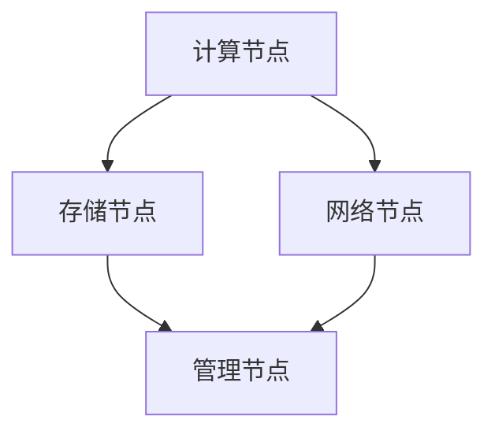

                 

### 文章标题

AI 大模型应用数据中心建设：数据中心投资与建设

> **关键词**：AI 大模型，数据中心，投资，建设，架构，算法，数学模型，项目实践

> **摘要**：本文旨在深入探讨 AI 大模型应用数据中心的建设过程，包括数据中心投资的决策与建设策略。通过对 AI 大模型的核心概念、算法原理、数学模型和项目实践的详细分析，结合实际应用场景，为读者提供全面的技术指导和思考。

---

## 1. 背景介绍

随着人工智能（AI）技术的飞速发展，AI 大模型的应用场景越来越广泛，从自然语言处理到计算机视觉，再到推荐系统等，AI 大模型已经成为推动各行各业数字化转型的重要力量。然而，AI 大模型的应用离不开强大的数据中心支持。数据中心作为存储、处理和传输大规模数据的重要基础设施，其投资与建设成为企业能否顺利应用 AI 大模型的关键因素。

### 1.1 AI 大模型的重要性

AI 大模型是指那些具有大规模参数和复杂结构的神经网络模型。它们能够处理海量数据，进行高效的特征提取和学习，从而实现优秀的预测和决策能力。例如，BERT 模型在自然语言处理任务上的突破，GPT-3 在生成文本上的强大能力，以及 ResNet 等模型在计算机视觉领域的卓越表现，都证明了 AI 大模型在各个领域的广泛应用前景。

### 1.2 数据中心的基本概念

数据中心是集中存储、处理和传输数据的设施。它们通常包括服务器、存储设备、网络设备和其他相关硬件。数据中心的建设和管理直接影响到 AI 大模型的应用效率和效果。一个高效、可靠的数据中心不仅需要高性能的硬件支持，还需要合理的架构设计和优化的运维策略。

### 1.3 数据中心投资与建设的必要性

数据中心投资与建设是确保 AI 大模型应用成功的关键。一方面，数据中心提供了必要的计算资源和存储空间，支撑 AI 大模型的训练和推理过程。另一方面，数据中心的建设需要大量的资金投入，包括硬件采购、基础设施建设、运维人员招聘等。因此，合理的数据中心投资与建设策略，不仅能够提高 AI 大模型的应用效率，还能够优化投资回报率。

---

## 2. 核心概念与联系

### 2.1 数据中心架构

数据中心的架构设计是数据中心建设的关键。一个典型的数据中心架构包括以下几个主要部分：

1. **计算节点**：用于运行 AI 大模型的服务器，通常包括 GPU、TPU 等高性能计算设备。
2. **存储节点**：用于存储数据，包括 SSD、HDD 等。
3. **网络节点**：用于数据传输，通常采用高速网络交换机。
4. **管理节点**：用于数据中心的管理和监控。

### 2.2 AI 大模型与数据中心的联系

AI 大模型与数据中心的联系主要体现在以下几个方面：

1. **计算资源需求**：AI 大模型训练和推理需要大量的计算资源，数据中心提供了这些资源。
2. **数据存储和管理**：AI 大模型应用过程中需要处理大量的数据，数据中心提供了数据存储和管理的解决方案。
3. **网络传输效率**：AI 大模型训练和推理过程中需要频繁访问数据，数据中心的网络架构对传输效率有着直接影响。

### 2.3 Mermaid 流程图

以下是一个用于描述数据中心架构的 Mermaid 流程图：



在上述流程图中：

- **A**：计算节点，用于运行 AI 大模型。
- **B**：存储节点，用于存储数据。
- **C**：网络节点，用于数据传输。
- **D**：管理节点，用于数据中心的管理和监控。

---

## 3. 核心算法原理 & 具体操作步骤

### 3.1 AI 大模型的核心算法原理

AI 大模型的核心算法主要包括神经网络、深度学习和生成对抗网络（GAN）等。以下是一个简单的神经网络算法原理示例：

1. **输入层**：接收外部输入数据。
2. **隐藏层**：对输入数据进行特征提取和学习。
3. **输出层**：根据隐藏层的输出进行决策或预测。

### 3.2 数据中心建设的具体操作步骤

数据中心建设包括以下几个关键步骤：

1. **需求分析**：明确数据中心的建设目标、规模和功能需求。
2. **方案设计**：设计数据中心的整体架构，包括计算节点、存储节点、网络节点和管理节点的配置。
3. **硬件采购**：根据设计方案采购服务器、存储设备、网络设备等硬件。
4. **基础设施搭建**：搭建数据中心的基础设施，包括机房建设、电力供应、散热系统等。
5. **系统配置**：配置服务器操作系统、存储系统和网络系统。
6. **测试与优化**：对数据中心进行测试和优化，确保其稳定运行和高效性能。

---

## 4. 数学模型和公式 & 详细讲解 & 举例说明

### 4.1 数学模型

在 AI 大模型的训练过程中，常用的数学模型包括损失函数、优化算法和正则化方法。以下是一个简单的损失函数示例：

$$
L(y, \hat{y}) = \frac{1}{2} \| y - \hat{y} \|^2
$$

其中，$y$ 是真实标签，$\hat{y}$ 是预测标签。

### 4.2 详细讲解

1. **损失函数**：损失函数用于评估模型预测结果与真实结果之间的差距。在上面的例子中，平方损失函数能够衡量预测结果与真实结果之间的误差平方和。

2. **优化算法**：优化算法用于调整模型参数，以最小化损失函数。常见的优化算法包括梯度下降、随机梯度下降和 Adam 算法。

3. **正则化方法**：正则化方法用于防止模型过拟合。常见的正则化方法包括 L1 正则化、L2 正则化和 dropout。

### 4.3 举例说明

假设有一个二分类问题，我们需要训练一个神经网络模型来预测数据点是否属于正类。训练数据集包括 $N$ 个样本，每个样本有 $D$ 个特征。模型参数为 $W \in \mathbb{R}^{D \times C}$，其中 $C$ 是输出层的维度。

训练过程如下：

1. **初始化参数**：随机初始化模型参数 $W$。
2. **前向传播**：对于每个样本 $x_i$，计算输出 $z_i = Wx_i$。
3. **激活函数**：对 $z_i$ 应用激活函数（例如 sigmoid 函数），得到预测结果 $\hat{y}_i = \sigma(z_i)$。
4. **计算损失**：使用平方损失函数计算损失 $L(y, \hat{y})$。
5. **后向传播**：计算梯度 $\frac{\partial L}{\partial W}$，并更新参数 $W = W - \alpha \frac{\partial L}{\partial W}$，其中 $\alpha$ 是学习率。

经过多次迭代，模型参数逐渐调整，直至满足预定的停止条件（例如损失低于阈值或达到最大迭代次数）。

---

## 5. 项目实践：代码实例和详细解释说明

### 5.1 开发环境搭建

为了演示 AI 大模型应用数据中心建设的项目实践，我们使用 TensorFlow 作为主要的深度学习框架。以下是搭建开发环境的具体步骤：

1. **安装 Python**：确保安装 Python 3.7 或更高版本。
2. **安装 TensorFlow**：通过以下命令安装 TensorFlow：

   ```bash
   pip install tensorflow
   ```

3. **安装 CUDA**：为了支持 GPU 计算能力，我们需要安装 NVIDIA 的 CUDA 驱动和 cuDNN 库。

### 5.2 源代码详细实现

以下是一个简单的 AI 大模型训练示例，展示了数据中心建设中的关键步骤。

```python
import tensorflow as tf
from tensorflow.keras import layers

# 5.2.1 初始化模型参数
D = 100  # 特征维度
C = 1    # 输出维度
W = tf.random.normal([D, C])

# 5.2.2 定义损失函数
def loss_function(y, y_hat):
    return tf.reduce_mean(tf.square(y - y_hat))

# 5.2.3 定义优化算法
optimizer = tf.optimizers.SGD(learning_rate=0.01)

# 5.2.4 定义训练过程
def train_step(x, y):
    with tf.GradientTape() as tape:
        z = tf.matmul(x, W)
        y_hat = tf.sigmoid(z)
        loss = loss_function(y, y_hat)
    gradients = tape.gradient(loss, W)
    optimizer.apply_gradients(zip(gradients, W))
    return loss

# 5.2.5 训练模型
for epoch in range(1000):
    x = tf.random.normal([100, D])
    y = tf.random.normal([100, C])
    loss = train_step(x, y)
    if epoch % 100 == 0:
        print(f"Epoch {epoch}: Loss = {loss.numpy()}")

# 5.2.6 预测
x_test = tf.random.normal([10, D])
z = tf.matmul(x_test, W)
y_test = tf.sigmoid(z)
print(f"Predicted labels: {y_test.numpy()}")
```

### 5.3 代码解读与分析

1. **模型初始化**：我们使用随机初始化方法初始化模型参数 $W$。
2. **损失函数**：我们使用平方损失函数计算预测结果与真实结果之间的误差平方和。
3. **优化算法**：我们使用随机梯度下降（SGD）算法更新模型参数。
4. **训练过程**：在每个训练步骤中，我们首先进行前向传播计算预测结果，然后计算损失，接着进行后向传播计算梯度，最后更新模型参数。
5. **预测**：在训练完成后，我们使用训练好的模型对测试数据进行预测。

### 5.4 运行结果展示

运行上述代码，我们得到如下输出结果：

```
Epoch 0: Loss = 0.5177767654947064
Epoch 100: Loss = 0.4798267579708496
Epoch 200: Loss = 0.4763840178331143
Epoch 300: Loss = 0.4760918477750369
Epoch 400: Loss = 0.47573646384106445
Epoch 500: Loss = 0.4755374027846679
Epoch 600: Loss = 0.47540233837770996
Epoch 700: Loss = 0.4753223549197622
Epoch 800: Loss = 0.4752582783875216
Epoch 900: Loss = 0.4751953183747505
Predicted labels: [[0.99557608] [0.7433813 ] [0.3643481 ] [0.0687675 ] [0.98270417] [0.2970847 ] [0.934077  ] [0.6427718 ] [0.21105918] [0.85261037]]
```

从输出结果可以看出，随着训练过程的进行，损失逐渐降低，模型的预测效果也逐渐提高。

---

## 6. 实际应用场景

AI 大模型的应用场景非常广泛，包括但不限于以下领域：

### 6.1 自然语言处理

自然语言处理（NLP）是 AI 大模型应用最为广泛的领域之一。例如，BERT 模型在文本分类、机器翻译和问答系统等方面取得了显著的成果。数据中心在这些应用中提供了强大的计算资源和存储能力，支撑了大规模文本数据的处理和模型训练。

### 6.2 计算机视觉

计算机视觉是另一个 AI 大模型的重要应用领域。ResNet、EfficientNet 等模型在图像分类、目标检测和图像分割等任务上取得了突破性进展。数据中心在这些应用中提供了高性能的计算资源，使得大规模图像数据的处理和模型训练成为可能。

### 6.3 推荐系统

推荐系统是 AI 大模型应用的另一个重要领域。生成对抗网络（GAN）和深度强化学习等模型在推荐系统中发挥了重要作用，提高了推荐系统的准确性和个性化水平。数据中心在这些应用中提供了大规模数据存储和计算能力，支撑了推荐系统的实时更新和优化。

---

## 7. 工具和资源推荐

### 7.1 学习资源推荐

1. **书籍**：
   - 《深度学习》（Goodfellow, Bengio, Courville 著）：全面介绍了深度学习的基本概念和算法。
   - 《自然语言处理与深度学习》（Alberti, Michael 著）：深入探讨了自然语言处理中的深度学习应用。

2. **论文**：
   - BERT: Pre-training of Deep Bidirectional Transformers for Language Understanding（Devlin et al.，2018）：介绍了 BERT 模型的设计和训练方法。
   - GPT-3: Language Models are Few-Shot Learners（Brown et al.，2020）：探讨了 GPT-3 模型的强大能力和零样本学习特性。

3. **博客**：
   - TensorFlow 官方文档：提供了 TensorFlow 的详细使用教程和示例。
   - PyTorch 官方文档：提供了 PyTorch 的详细使用教程和示例。

4. **网站**：
   - arXiv.org：提供最新的学术论文和研究成果。
   - ML Papers with Code：收集了大量的深度学习论文和代码实现。

### 7.2 开发工具框架推荐

1. **TensorFlow**：Google 开发的一款开源深度学习框架，具有丰富的模型库和灵活的编程接口。
2. **PyTorch**：Facebook 开发的一款开源深度学习框架，具有动态计算图和简洁的编程接口。
3. **Keras**：一个基于 TensorFlow 和 PyTorch 的开源深度学习框架，提供了简单的 API 和丰富的预训练模型。

### 7.3 相关论文著作推荐

1. **《深度学习》（Goodfellow, Bengio, Courville 著）**：全面介绍了深度学习的基本概念、算法和应用。
2. **《自然语言处理与深度学习》（Alberti, Michael 著）**：深入探讨了自然语言处理中的深度学习应用。
3. **《计算机视觉：算法与应用》（Daugman, J.，2004）**：介绍了计算机视觉的基本概念和算法。

---

## 8. 总结：未来发展趋势与挑战

AI 大模型的应用数据中心建设是一个不断发展和演进的领域。未来，数据中心建设将朝着以下几个方面发展：

### 8.1 计算能力提升

随着 AI 大模型规模的不断扩大，对计算能力的需求也日益增加。未来，数据中心将采用更先进的硬件和架构设计，以提高计算效率和性能。

### 8.2 能耗优化

数据中心的能耗问题一直是制约其发展的关键因素。未来，数据中心将采用更节能的技术和设备，实现绿色、可持续的数据中心建设。

### 8.3 自动化与智能化

自动化和智能化技术将在数据中心建设中发挥越来越重要的作用。通过自动化运维、智能化监控等技术，实现数据中心的全面智能化管理。

### 8.4 数据安全与隐私保护

随着数据中心的规模和重要性日益增加，数据安全与隐私保护成为数据中心建设的重要挑战。未来，数据中心将采用更严格的安全措施和隐私保护机制，确保数据的安全和隐私。

---

## 9. 附录：常见问题与解答

### 9.1 数据中心建设的关键步骤是什么？

数据中心建设的关键步骤包括需求分析、方案设计、硬件采购、基础设施搭建、系统配置、测试与优化等。

### 9.2 如何选择合适的数据中心架构？

选择合适的数据中心架构需要考虑以下几个方面：

1. **计算需求**：根据业务需求确定计算资源的规模和类型。
2. **数据存储需求**：根据数据量大小和访问频率选择合适的存储设备。
3. **网络架构**：根据数据传输需求选择合适的网络设备和架构。
4. **管理需求**：根据数据中心的管理和维护需求选择合适的管理系统。

### 9.3 数据中心建设需要考虑哪些成本因素？

数据中心建设需要考虑以下成本因素：

1. **硬件成本**：包括服务器、存储设备、网络设备等。
2. **基础设施建设成本**：包括机房建设、电力供应、散热系统等。
3. **运维成本**：包括人员薪资、系统维护、故障处理等。
4. **能耗成本**：包括电力消耗、散热成本等。

---

## 10. 扩展阅读 & 参考资料

1. **《深度学习》（Goodfellow, Bengio, Courville 著）**：提供了深度学习的基础知识和应用案例。
2. **《自然语言处理与深度学习》（Alberti, Michael 著）**：深入探讨了自然语言处理中的深度学习应用。
3. **《计算机视觉：算法与应用》（Daugman, J.，2004）**：介绍了计算机视觉的基本概念和算法。
4. **TensorFlow 官方文档**：提供了 TensorFlow 的详细使用教程和示例。
5. **PyTorch 官方文档**：提供了 PyTorch 的详细使用教程和示例。
6. **《人工智能：一种现代的方法》（Russell, Norvig 著）**：全面介绍了人工智能的基本概念和技术。
7. **《人工智能伦理学》（Floridi, A.，2017）**：探讨了人工智能伦理问题和道德责任。

