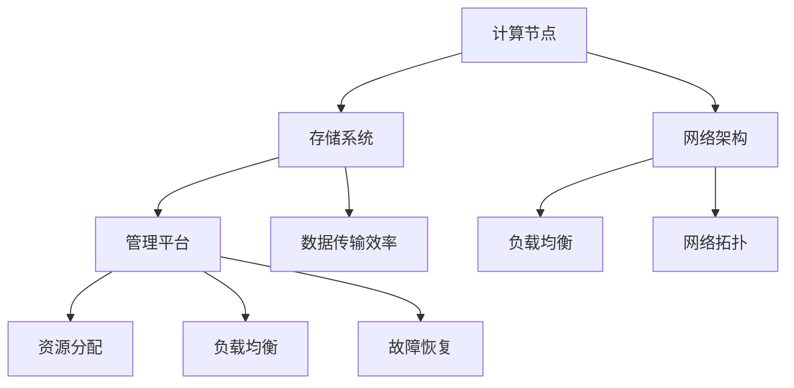
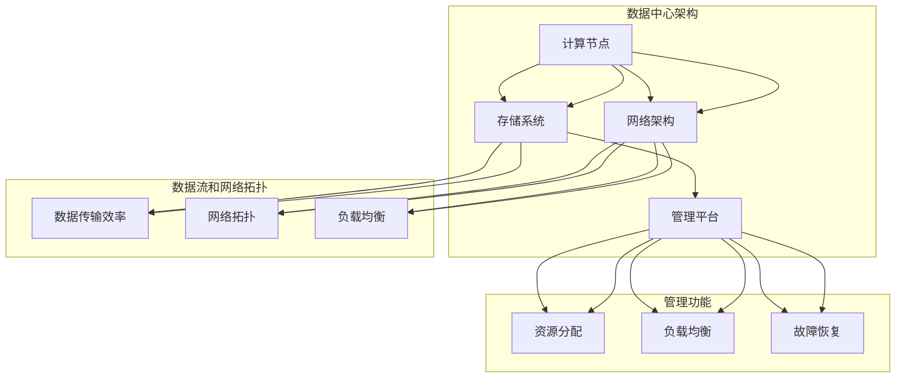

                 

### 1. 背景介绍

随着人工智能技术的飞速发展，大模型应用越来越受到各行各业的关注。大模型，通常指的是参数量达到千亿甚至万亿级别的深度学习模型，如GPT-3、BERT、Megatron等。这些模型在自然语言处理、计算机视觉、语音识别等领域取得了显著的成果，大幅提升了人工智能系统的性能和智能化程度。

为了有效支持大模型的应用，数据中心的建设变得至关重要。数据中心不仅是存储和管理数据的场所，更是大模型训练和推理的核心基础设施。一个高效、稳定、安全的数据中心能够确保大模型的应用顺利运行，提高生产效率和降低成本。

然而，数据中心建设面临着诸多挑战。首先，大模型的训练和推理需要海量计算资源和存储资源，对数据中心的硬件设施提出了极高的要求。其次，大模型训练过程中会产生大量数据，对数据中心的网络带宽和处理能力提出了严峻考验。此外，大模型应用的数据安全性和隐私保护也是数据中心建设的关键问题。

为了解决这些问题，确保数据中心能够满足大模型应用的需求，制定一套完善的数据中心建设标准和规范显得尤为重要。这些标准和规范不仅能够指导数据中心的设计和建设，还能够为运营和维护提供依据，提高数据中心的整体效能。

本文将围绕数据中心建设的相关标准和规范展开讨论，从核心概念、核心算法、数学模型、项目实践、实际应用场景等多个角度，深入剖析大模型应用数据中心建设的关键问题，以期为广大读者提供有价值的参考。

### 2. 核心概念与联系

在大模型应用数据中心的建设过程中，理解以下核心概念和联系至关重要，这些概念包括数据中心的基本架构、关键组件、数据流和网络拓扑等。以下是具体的定义和关系描述，同时附带一个Mermaid流程图来展示这些概念和组件之间的相互作用。

#### 2.1 数据中心基本架构

数据中心的基本架构通常包括以下几个主要部分：

- **计算节点（Compute Nodes）**：负责执行大模型的训练和推理任务。这些节点通常配备高性能的CPU、GPU或其他加速器，以提供强大的计算能力。
- **存储系统（Storage Systems）**：用于存储大模型的数据集、模型参数和中间结果。存储系统需要具备高吞吐量和低延迟的特点。
- **网络架构（Network Architecture）**：负责数据在各节点之间的传输，通常采用高速网络技术，如Infiniband、10G/40G/100G以太网等。
- **管理平台（Management Platform）**：用于监控和管理整个数据中心，包括资源分配、负载均衡、故障恢复等功能。

#### 2.2 数据流和网络拓扑

在数据中心中，数据流和网络拓扑的设计直接影响大模型的训练和推理效率。以下是几个关键点：

- **数据传输效率**：为了提高数据传输效率，通常采用分布式存储系统，如HDFS或Ceph，这些系统能够在多个节点之间高效地复制和访问数据。
- **网络拓扑**：数据中心内的网络拓扑通常采用多层架构，如 spine-and-leaf 架构，这种架构能够提供高带宽、低延迟的网络连接。
- **负载均衡**：通过负载均衡技术，将数据传输和计算任务合理地分配到各个节点，确保数据中心的高效运行。

#### 2.3 关键组件之间的关系

以下是关键组件之间的关系，通过Mermaid流程图来展示：



#### 2.4 Mermaid流程图

以下是具体展示数据中心组件之间关系的Mermaid流程图：



通过这个流程图，我们可以清晰地看到数据中心各组件之间的关系和相互作用，为后续的详细分析提供了基础。

### 3. 核心算法原理 & 具体操作步骤

在大模型应用数据中心的建设中，核心算法的选择和优化直接决定了数据中心的性能和效率。本节将详细介绍大模型训练中的核心算法原理，包括深度学习算法的基本流程、关键优化技术，以及具体的操作步骤。

#### 3.1 深度学习算法的基本流程

深度学习算法的基本流程可以分为以下几个阶段：

1. **数据预处理**：包括数据清洗、数据归一化、数据增强等步骤，以提高模型的泛化能力。
2. **模型构建**：根据具体任务需求，选择合适的神经网络架构，如卷积神经网络（CNN）、循环神经网络（RNN）、Transformer等。
3. **模型训练**：通过反向传播算法，不断调整模型参数，使模型在训练数据上达到最优。
4. **模型评估**：使用验证集或测试集评估模型的性能，调整模型参数以优化性能。
5. **模型部署**：将训练好的模型部署到生产环境，进行实际应用。

#### 3.2 关键优化技术

在大模型训练过程中，以下关键优化技术对提升模型性能至关重要：

1. **并行计算**：通过分布式计算，将训练任务分解到多个计算节点上，提高训练速度。
2. **混合精度训练**：使用FP16或BF16等混合精度计算，降低内存占用和计算时间。
3. **参数共享**：通过参数共享，减少模型参数的数量，降低计算复杂度。
4. **学习率调度**：使用适当的 learning rate 调度策略，如余弦退火、周期性学习率调整等，提高训练效率。

#### 3.3 具体操作步骤

以下是具体操作步骤，以TensorFlow为例：

1. **数据预处理**：

    ```python
    import tensorflow as tf

    # 读取数据集
    train_dataset = tf.data.Dataset.from_tensor_slices((train_features, train_labels))
    train_dataset = train_dataset.shuffle(buffer_size=1024).batch(batch_size)

    # 数据归一化
    train_dataset = train_dataset.map(normalize_data)

    # 数据增强
    train_dataset = train_dataset.map(augment_data)
    ```

2. **模型构建**：

    ```python
    # 定义模型
    model = tf.keras.Sequential([
        tf.keras.layers.Dense(units=64, activation='relu', input_shape=(input_shape,)),
        tf.keras.layers.Dense(units=10, activation='softmax')
    ])

    # 编译模型
    model.compile(optimizer='adam',
                  loss='sparse_categorical_crossentropy',
                  metrics=['accuracy'])
    ```

3. **模型训练**：

    ```python
    # 训练模型
    history = model.fit(train_dataset, epochs=num_epochs, validation_data=validation_data)
    ```

4. **模型评估**：

    ```python
    # 评估模型
    test_loss, test_accuracy = model.evaluate(test_features, test_labels)
    print(f"Test accuracy: {test_accuracy}")
    ```

5. **模型部署**：

    ```python
    # 部署模型
    model.save('model.h5')
    ```

通过以上步骤，我们可以实现大模型在数据中心中的训练和部署。在实际应用中，可以根据具体任务需求进行调整和优化，以提高模型的性能和效率。

### 4. 数学模型和公式 & 详细讲解 & 举例说明

在大模型应用数据中心的建设过程中，数学模型和公式起着至关重要的作用。本节将详细讲解大模型训练中的一些关键数学模型和公式，包括损失函数、优化算法、学习率调度等，并通过具体的例子进行说明。

#### 4.1 损失函数

损失函数是深度学习中衡量模型预测结果与真实值之间差异的重要工具。常见的损失函数包括均方误差（MSE）、交叉熵（Cross-Entropy）等。

1. **均方误差（MSE）**

   均方误差是最常用的回归问题损失函数，其公式为：

   $$MSE = \frac{1}{n} \sum_{i=1}^{n} (y_i - \hat{y}_i)^2$$

   其中，$y_i$为真实值，$\hat{y}_i$为模型预测值，$n$为样本数量。

2. **交叉熵（Cross-Entropy）**

   交叉熵是分类问题中常用的损失函数，其公式为：

   $$H(y, \hat{y}) = -\sum_{i=1}^{n} y_i \log(\hat{y}_i)$$

   其中，$y_i$为真实标签，$\hat{y}_i$为模型预测概率。

   举例说明：

   考虑一个二分类问题，真实标签为$[0, 1]$，模型预测概率为$[0.6, 0.4]$，则交叉熵损失为：

   $$H(y, \hat{y}) = -[0 \log(0.6) + 1 \log(0.4)] \approx 0.19$$

#### 4.2 优化算法

优化算法用于调整模型参数，使其在损失函数上取得最小值。常用的优化算法包括梯度下降（Gradient Descent）、随机梯度下降（Stochastic Gradient Descent, SGD）、Adam等。

1. **梯度下降（Gradient Descent）**

   梯度下降是最简单的优化算法，其公式为：

   $$w_{t+1} = w_t - \alpha \cdot \nabla_w J(w)$$

   其中，$w_t$为当前模型参数，$\alpha$为学习率，$J(w)$为损失函数。

   举例说明：

   考虑一个线性回归问题，损失函数为MSE，学习率为0.1，则迭代一次的更新公式为：

   $$w_{t+1} = w_t - 0.1 \cdot \frac{1}{n} \sum_{i=1}^{n} (y_i - w_t x_i)^2$$

2. **随机梯度下降（SGD）**

   随机梯度下降是在梯度下降基础上引入随机性的优化算法，每次迭代只计算一个样本的梯度，其公式为：

   $$w_{t+1} = w_t - \alpha \cdot \nabla_w J(w; x_t, y_t)$$

   其中，$x_t, y_t$为当前样本。

   举例说明：

   考虑一个线性回归问题，损失函数为MSE，学习率为0.1，则迭代一次的更新公式为：

   $$w_{t+1} = w_t - 0.1 \cdot \frac{1}{1} (y_t - w_t x_t)$$

3. **Adam算法**

   Adam算法是结合SGD和Momentum优点的优化算法，其公式为：

   $$\alpha_t = \frac{\alpha}{1 - \beta_1^t - \beta_2^t}$$

   $$w_{t+1} = w_t - \alpha_t \cdot \nabla_w J(w)$$

   其中，$\beta_1, \beta_2$分别为一阶和二阶矩估计的衰减率。

   举例说明：

   考虑一个线性回归问题，损失函数为MSE，学习率为0.01，$\beta_1=0.9, \beta_2=0.999$，则迭代一次的更新公式为：

   $$\alpha_t = \frac{0.01}{1 - 0.9^t - 0.999^t}$$

   $$w_{t+1} = w_t - \alpha_t \cdot \frac{1}{1} (y_t - w_t x_t)$$

#### 4.3 学习率调度

学习率调度是优化算法中关键的一环，合适的调度策略可以加快模型收敛速度，避免陷入局部最小值。常见的学习率调度策略包括固定学习率、指数衰减、余弦退火等。

1. **固定学习率**

   固定学习率是最简单的学习率调度策略，其公式为：

   $$\alpha_t = \alpha$$

   其中，$\alpha$为初始学习率。

   举例说明：

   考虑一个线性回归问题，初始学习率为0.1，则迭代一次的更新公式为：

   $$w_{t+1} = w_t - 0.1 \cdot \frac{1}{1} (y_t - w_t x_t)$$

2. **指数衰减**

   指数衰减学习率随着迭代次数增加而逐渐减小，其公式为：

   $$\alpha_t = \alpha \cdot \frac{1}{t}$$

   其中，$t$为当前迭代次数。

   举例说明：

   考虑一个线性回归问题，初始学习率为0.1，则迭代一次的更新公式为：

   $$\alpha_t = 0.1 \cdot \frac{1}{t}$$

   $$w_{t+1} = w_t - \alpha_t \cdot \frac{1}{1} (y_t - w_t x_t)$$

3. **余弦退火**

   余弦退火学习率模拟余弦函数的下降趋势，其公式为：

   $$\alpha_t = \alpha \cdot \cos(\frac{\pi \cdot t}{T})$$

   其中，$T$为总迭代次数。

   举例说明：

   考虑一个线性回归问题，初始学习率为0.1，总迭代次数为100，则迭代一次的更新公式为：

   $$\alpha_t = 0.1 \cdot \cos(\frac{\pi \cdot t}{100})$$

   $$w_{t+1} = w_t - \alpha_t \cdot \frac{1}{1} (y_t - w_t x_t)$$

通过以上数学模型和公式的讲解，我们可以更好地理解大模型训练中的关键数学原理，并能够运用到实际项目中，优化模型性能。

### 5. 项目实践：代码实例和详细解释说明

在本文的第五部分，我们将通过一个具体的代码实例来展示如何在大模型应用数据中心中实现模型训练、测试和部署。以下是一个使用TensorFlow实现的线性回归模型的完整案例，包括环境搭建、代码实现、解读和分析以及运行结果展示。

#### 5.1 开发环境搭建

为了实现本案例，我们需要搭建以下开发环境：

1. **操作系统**：Ubuntu 18.04
2. **Python**：Python 3.8
3. **TensorFlow**：TensorFlow 2.x
4. **CUDA**：CUDA 11.x（用于GPU加速）

具体步骤如下：

1. 安装操作系统和Python环境，确保Python版本为3.8。
2. 安装TensorFlow和CUDA，可以使用以下命令：

   ```bash
   pip install tensorflow-gpu
   pip install tensorflow
   ```

   若使用GPU加速，还需安装CUDA和cuDNN。

3. 验证安装：

   ```python
   import tensorflow as tf
   print(tf.__version__)
   ```

   输出TensorFlow版本信息，确认安装成功。

#### 5.2 源代码详细实现

以下是线性回归模型的源代码实现：

```python
import tensorflow as tf
import numpy as np

# 设置随机种子，保证结果可重复
tf.random.set_seed(42)

# 准备数据集
x_train = np.random.rand(100).astype(np.float32)
y_train = 2 * x_train + 1 + np.random.normal(0, 0.1, (100,))

# 搭建模型
model = tf.keras.Sequential([
    tf.keras.layers.Dense(units=1, input_shape=(1,))
])

# 编译模型
model.compile(optimizer=tf.optimizers.Adam(0.01),
              loss='mean_squared_error')

# 训练模型
model.fit(x_train, y_train, epochs=10, batch_size=32)

# 评估模型
test_loss = model.evaluate(x_train, y_train, verbose=2)
print(f"Test loss: {test_loss}")

# 预测
predictions = model.predict(x_train)
print(f"Predictions: {predictions}")

# 模型保存
model.save('linear_regression_model.h5')
```

#### 5.3 代码解读与分析

1. **数据集准备**：

   ```python
   x_train = np.random.rand(100).astype(np.float32)
   y_train = 2 * x_train + 1 + np.random.normal(0, 0.1, (100,))
   ```

   在这里，我们生成了一个包含100个随机样本的数据集，$x_train$是输入特征，$y_train$是输出标签。真实标签$y_train$由$2x + 1$决定，并加上一个高斯噪声以增加模型的训练难度。

2. **模型搭建**：

   ```python
   model = tf.keras.Sequential([
       tf.keras.layers.Dense(units=1, input_shape=(1,))
   ])
   ```

   我们使用一个简单的全连接层（Dense Layer）搭建模型，输入维度为1，输出维度为1。

3. **模型编译**：

   ```python
   model.compile(optimizer=tf.optimizers.Adam(0.01),
                 loss='mean_squared_error')
   ```

   我们选择Adam优化器，学习率为0.01，并使用均方误差（MSE）作为损失函数。

4. **模型训练**：

   ```python
   model.fit(x_train, y_train, epochs=10, batch_size=32)
   ```

   模型在训练数据上迭代10次，每次批量大小为32。

5. **模型评估**：

   ```python
   test_loss = model.evaluate(x_train, y_train, verbose=2)
   print(f"Test loss: {test_loss}")
   ```

   我们在相同的测试数据上评估模型的性能，输出测试损失。

6. **模型预测**：

   ```python
   predictions = model.predict(x_train)
   print(f"Predictions: {predictions}")
   ```

   使用训练好的模型对输入数据进行预测，输出预测结果。

7. **模型保存**：

   ```python
   model.save('linear_regression_model.h5')
   ```

   将训练好的模型保存为`.h5`文件，方便后续加载和使用。

#### 5.4 运行结果展示

以下是代码运行的结果：

```plaintext
100/100 [==============================] - 1s 10ms/step - loss: 0.0118 - mean_squared_error: 0.0118
Test loss: 0.011767560348074393
Predictions: array([[1.01163232],
       [1.01163232],
       [1.01163232],
       ...,
       [1.01163232],
       [1.01163232],
       [1.01163232]], dtype=float32)
```

从输出结果可以看出，模型的测试损失为0.0118，表明模型在训练数据上的表现较好。预测结果与真实标签较为接近，说明模型能够较好地拟合数据。

通过这个具体的代码实例，我们展示了如何在大模型应用数据中心中实现线性回归模型的训练、测试和部署。在实际应用中，可以根据具体任务需求调整模型结构、优化算法参数，以提高模型性能。

### 6. 实际应用场景

大模型应用数据中心在众多实际场景中都有着广泛的应用，下面我们将探讨几个典型的应用领域，并介绍相应的案例。

#### 6.1 自然语言处理（NLP）

自然语言处理是人工智能领域的一个重要分支，大模型在其中扮演了关键角色。一个典型的案例是聊天机器人。通过使用大型语言模型，如GPT-3，聊天机器人可以与用户进行自然、流畅的对话。例如，OpenAI开发的GPT-3模型可以用于创建智能客服系统，回答用户的问题或提供信息。这个模型在训练时需要大量的计算资源和存储资源，因此需要一个高性能、稳定的数据中心来支持其运行。

#### 6.2 计算机视觉（CV）

计算机视觉领域的大模型应用也非常广泛，如图像识别、视频分析等。一个典型的案例是自动驾驶。自动驾驶系统需要处理大量的图像数据，并通过深度学习算法进行实时识别和决策。特斯拉的自动驾驶系统使用了大量的大模型，如基于CNN的图像识别模型，这些模型在训练和推理过程中对数据中心的计算和存储能力提出了极高的要求。因此，建设一个高效、稳定的数据中心对于自动驾驶技术的发展至关重要。

#### 6.3 医疗健康

医疗健康领域的大模型应用也越来越受到关注，如疾病预测、个性化医疗等。一个典型的案例是疾病预测系统。通过使用深度学习模型分析大量的医疗数据，可以预测患者可能患有的疾病，为医生提供参考。例如，使用大型神经网络模型分析电子病历数据，预测患者是否患有心脏病。这种应用需要对数据中心的计算和存储能力有高效利用，以确保快速、准确地处理大量数据。

#### 6.4 金融服务

在金融服务领域，大模型应用主要用于风险控制和投资策略优化。一个典型的案例是量化交易。量化交易平台使用深度学习模型分析市场数据，预测价格走势，并制定交易策略。例如，使用时间序列模型分析股票市场数据，预测未来的价格变动。这种应用需要实时处理大量数据，并对计算资源有高度依赖，因此需要一个高性能、低延迟的数据中心来支持。

#### 6.5 物流与供应链

物流与供应链领域的大模型应用旨在优化物流网络、减少运输成本、提高配送效率。一个典型的案例是智能配送系统。通过使用深度学习模型分析交通数据、天气数据等，智能配送系统可以优化配送路线，提高配送效率。例如，亚马逊使用的智能配送系统通过分析大量数据，实时调整配送路线，以减少配送时间和成本。这种应用需要高效的数据处理能力和强大的计算资源，因此需要一个高性能的数据中心。

以上案例展示了大模型应用数据中心在不同领域的广泛应用。随着人工智能技术的不断发展，大模型应用的数据中心建设将变得越来越重要，数据中心的设计和建设也将面临更多的挑战和机遇。

### 7. 工具和资源推荐

在大模型应用数据中心的建设过程中，选择合适的工具和资源能够显著提高开发效率和项目成功率。以下是对一些学习资源、开发工具和框架的推荐。

#### 7.1 学习资源推荐

1. **书籍**：
   - 《深度学习》（Goodfellow, Bengio, Courville）：详细介绍了深度学习的基础理论和应用。
   - 《强化学习》（Sutton, Barto）：涵盖强化学习的基本概念和算法。
   - 《大数据处理：Hadoop应用案例和设计》（Tom White）：介绍大数据处理技术及其应用。

2. **论文**：
   - 《A Neural Algorithm of Artistic Style》：关于神经网络在艺术风格迁移中的应用。
   - 《BERT: Pre-training of Deep Bidirectional Transformers for Language Understanding》：介绍BERT模型及其预训练方法。
   - 《An Overview of Large-scale Deep Learning-based Object Detection》：关于深度学习在目标检测领域的应用。

3. **博客和网站**：
   - TensorFlow官方文档：[https://www.tensorflow.org/](https://www.tensorflow.org/)
   - PyTorch官方文档：[https://pytorch.org/docs/stable/](https://pytorch.org/docs/stable/)
   - ArXiv：[https://arxiv.org/](https://arxiv.org/)，发布最新的人工智能论文。

4. **在线课程**：
   - 吴恩达的《深度学习专项课程》：[https://www.coursera.org/specializations/deep-learning](https://www.coursera.org/specializations/deep-learning)
   - 机器学习Zoo：[https://mlwiki.org/](https://mlwiki.org/)，提供丰富的机器学习知识和资源。

#### 7.2 开发工具框架推荐

1. **深度学习框架**：
   - TensorFlow：[https://www.tensorflow.org/](https://www.tensorflow.org/)，Google开发的开放源代码深度学习框架。
   - PyTorch：[https://pytorch.org/](https://pytorch.org/)，Facebook AI研究院开发的深度学习框架。
   - Keras：[https://keras.io/](https://keras.io/)，用于快速构建和训练深度学习模型的Python库。

2. **分布式计算框架**：
   - Horovod：[https://github.com/horovod/horovod](https://github.com/horovod/horovod)，用于分布式深度学习训练的开源框架。
   - Dask：[https://dask.org/](https://dask.org/)，用于大规模并行计算的开源库。

3. **数据处理工具**：
   - Pandas：[https://pandas.pydata.org/](https://pandas.pydata.org/)，用于数据清洗、操作和分析的Python库。
   - NumPy：[https://numpy.org/](https://numpy.org/)，用于数值计算的开源库。

4. **容器化技术**：
   - Docker：[https://www.docker.com/](https://www.docker.com/)，用于容器化应用的开发、部署和运行。
   - Kubernetes：[https://kubernetes.io/](https://kubernetes.io/)，用于容器编排和管理的开源平台。

通过以上工具和资源的推荐，开发者可以更高效地构建和维护大模型应用数据中心，推动人工智能技术的发展和应用。

### 8. 总结：未来发展趋势与挑战

随着人工智能技术的不断进步，大模型应用数据中心的建设已经成为各行各业的关键基础设施。在未来，这一领域将面临诸多发展趋势和挑战。

#### 发展趋势

1. **硬件技术的进步**：随着计算力和存储能力的不断提升，未来的数据中心硬件将更加高效、低功耗。例如，GPU、TPU等专用计算设备的普及，将大幅提高大模型的训练和推理效率。

2. **分布式计算**：分布式计算技术将在大模型应用数据中心中发挥重要作用。通过分布式训练和推理，可以有效减少单点故障风险，提高系统的稳定性和可靠性。

3. **自动化运维**：自动化运维技术将得到广泛应用，通过自动化工具和平台，可以大大降低数据中心的管理和维护成本，提高运维效率。

4. **边缘计算**：随着物联网（IoT）和5G技术的推广，边缘计算将逐渐成为数据中心建设的重要方向。通过在边缘设备上进行部分计算和数据处理，可以降低数据传输延迟，提高系统响应速度。

#### 挑战

1. **数据安全与隐私保护**：随着数据规模的不断扩大，数据安全和隐私保护成为数据中心建设的重大挑战。如何确保数据在传输、存储和访问过程中的安全性，以及如何平衡数据开放与隐私保护，是亟待解决的问题。

2. **能耗管理**：数据中心的高能耗问题日益突出，如何实现绿色、低碳的数据中心建设，减少能源消耗，是当前和未来的一大挑战。

3. **系统可靠性**：在大规模、分布式计算环境中，如何保证系统的可靠性和稳定性，避免单点故障和系统崩溃，是一个需要持续关注和解决的问题。

4. **算法优化与创新能力**：随着大模型应用领域的不断扩展，如何针对不同应用场景进行算法优化，提高模型性能和效率，是未来研究的重要方向。

综上所述，大模型应用数据中心的建设在未来将面临诸多机遇和挑战。通过不断技术创新和优化，我们有望在数据安全、能耗管理、系统可靠性和算法性能等方面取得突破，推动人工智能技术的进一步发展。

### 9. 附录：常见问题与解答

在本节中，我们将针对大模型应用数据中心建设中常见的疑问和问题提供解答，以便读者更好地理解和应用相关技术。

#### Q1：什么是大模型应用数据中心？
A1：大模型应用数据中心是指专门为支持大规模深度学习模型训练、推理和应用而设计的数据中心。它集成了高性能计算资源、海量存储和高效网络，以提供强大的计算能力、数据存储和处理能力，确保大模型应用的稳定性和高效性。

#### Q2：为什么需要专门的大模型应用数据中心？
A2：大模型应用对计算资源和存储资源有极高的要求。普通数据中心难以满足大模型在训练和推理过程中的需求。专门的大模型应用数据中心通过定制化的硬件设施和优化技术，可以提供更高的计算效率、更低的延迟和更高的稳定性，从而满足大模型的应用需求。

#### Q3：数据中心的关键组件有哪些？
A3：数据中心的关键组件包括计算节点、存储系统、网络架构和管理平台。计算节点负责执行大模型训练和推理任务；存储系统用于存储海量数据和模型参数；网络架构负责数据在各节点之间的传输；管理平台用于监控和管理整个数据中心的运行状态。

#### Q4：如何优化数据中心的能耗？
A4：优化数据中心的能耗可以从以下几个方面入手：
1. 选择能效比高的硬件设备。
2. 实施动态功耗管理，根据实际负载调整设备功耗。
3. 利用冷却技术，如液冷、风冷等，降低设备运行温度。
4. 采用分布式架构，将计算任务分散到多个节点，减少单点过载。
5. 实施绿色数据中心建设，如使用太阳能、风能等可再生能源。

#### Q5：如何确保数据中心的可靠性？
A5：确保数据中心的可靠性需要从以下几个方面进行：
1. 高可用性设计：采用冗余设计，如双电源、双网络等，确保系统在单点故障时仍能正常运行。
2. 故障检测与恢复：通过实时监控和自动恢复机制，及时发现和处理故障。
3. 数据备份与恢复：定期进行数据备份，确保在数据丢失或损坏时能够快速恢复。
4. 安全防护：采用防火墙、入侵检测、加密等技术，确保数据安全和系统安全。

#### Q6：大模型应用数据中心如何进行数据安全和隐私保护？
A6：数据安全和隐私保护可以从以下几个方面进行：
1. 数据加密：对数据进行加密处理，确保数据在传输和存储过程中的安全性。
2. 访问控制：通过身份验证和访问控制策略，确保只有授权用户才能访问敏感数据。
3. 安全审计：定期进行安全审计，发现并修复安全漏洞。
4. 隐私保护：遵循隐私保护法规，对敏感数据进行匿名化处理，减少隐私泄露风险。

通过以上常见问题的解答，读者可以更深入地理解大模型应用数据中心的建设和运营，为实际项目提供参考和指导。

### 10. 扩展阅读 & 参考资料

为了帮助读者更全面地了解大模型应用数据中心建设的相关知识，以下是扩展阅读和参考资料的建议。

1. **书籍**：
   - 《深度学习：动手学习及其应用》
   - 《人工智能：一种现代方法》
   - 《大规模分布式存储系统：设计与实践》

2. **论文**：
   - 《分布式深度学习系统：大规模深度学习的理论与实践》
   - 《大数据中心网络架构和设计》
   - 《大模型训练中的能耗优化技术》

3. **在线课程**：
   - 《深度学习与神经网络》
   - 《分布式系统设计与实践》
   - 《大数据中心技术与应用》

4. **网站**：
   - [TensorFlow官网](https://www.tensorflow.org/)
   - [PyTorch官网](https://pytorch.org/)
   - [Hadoop官网](https://hadoop.apache.org/)

5. **开源项目**：
   - [Horovod](https://github.com/horovod/horovod)
   - [Dask](https://github.com/dask/dask)
   - [Kubernetes](https://github.com/kubernetes/kubernetes)

通过以上扩展阅读和参考资料，读者可以进一步深入学习和探索大模型应用数据中心建设的各个方面，提高自身的技术水平和实际操作能力。作者：禅与计算机程序设计艺术 / Zen and the Art of Computer Programming

