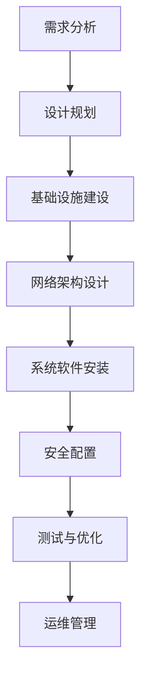
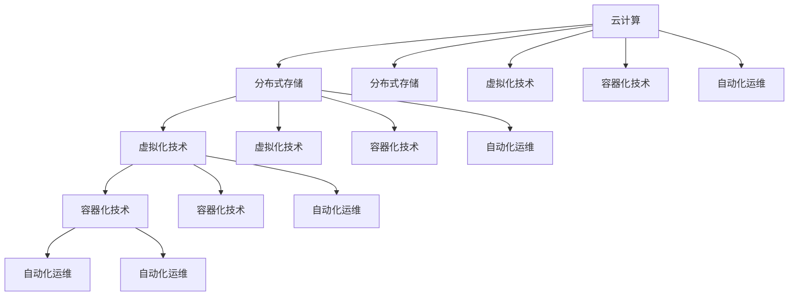

                 

### 背景介绍

在当今数字化时代，人工智能（AI）技术已经成为驱动各行各业创新和发展的关键力量。随着深度学习算法的进步和计算资源的不断丰富，大型人工智能模型如BERT、GPT-3等应运而生，为自然语言处理、图像识别、语音识别等领域带来了前所未有的突破。这些大型AI模型在处理大规模数据集时表现出色，但同时也带来了巨大的计算和存储需求。为了满足这些需求，数据中心的建设和运维成为了一个关键课题。

数据中心作为存放和运行这些大型AI模型的核心基础设施，其稳定性和性能直接影响到模型的训练效果和实际应用价值。数据中心运维和管理不仅需要确保硬件设备的正常运行，还需要实现高效的数据存储、传输和处理。同时，随着AI技术的不断演进，数据中心也需要具备灵活的扩展能力，以适应不断增长的数据处理需求。

本文旨在探讨AI大模型应用数据中心的建设和运维管理。我们将首先介绍数据中心的基本概念和建设原则，然后深入分析数据中心的关键技术和挑战，最后讨论未来的发展趋势和方向。

#### 数据中心的基本概念

数据中心（Data Center）是指专门用于存放计算机、网络设备、存储设备等硬件设施，提供数据存储、处理、传输和服务的场所。数据中心通常具有高度集中的计算能力、存储能力和网络带宽，是支撑企业业务运作和提供IT服务的重要基础设施。

数据中心的建设涉及多个方面，包括物理基础设施、网络架构、系统软件和安全管理等。物理基础设施主要包括机柜、机房、冷却系统、供电系统等；网络架构则涉及局域网、广域网、数据中心间的互联等；系统软件包括操作系统、数据库、中间件等；而安全管理则包括防火墙、入侵检测、数据加密等。

#### 建设原则

在建设数据中心时，应遵循以下原则：

1. **可靠性**：数据中心需要具备高可靠性，确保设备和服务的稳定运行。这包括硬件设备的冗余设计、电源和网络的双备份、数据备份和恢复机制等。

2. **安全性**：数据中心需要采取一系列安全措施，保护数据不受未经授权的访问和破坏。这包括网络安全、数据加密、用户认证和授权等。

3. **可扩展性**：数据中心的设计应具备良好的扩展性，以适应业务需求和技术的不断演进。这包括机柜和设备的可扩展性、网络带宽的扩展性、存储空间的扩展性等。

4. **高效性**：数据中心应尽可能提高资源利用率和运行效率，降低能耗和运营成本。这包括虚拟化技术、自动化运维、能耗管理等方面。

5. **灵活性**：数据中心应具备灵活的配置和调整能力，以满足不同业务场景的需求。这包括灵活的网络拓扑、灵活的存储架构、灵活的硬件和软件配置等。

#### 核心概念和联系

为了更好地理解数据中心的建设和运维，我们需要了解以下几个核心概念：

1. **云计算**：云计算是一种通过网络提供计算资源、存储资源和网络连接等服务的计算模式。数据中心是云计算基础设施的核心组成部分，提供了大规模的计算和存储资源。

2. **分布式存储**：分布式存储是一种通过将数据分散存储在多个物理节点上来提高数据可靠性和扩展性的存储架构。分布式存储系统能够自动处理数据的冗余备份、负载均衡和数据恢复。

3. **虚拟化技术**：虚拟化技术通过创建虚拟资源（如虚拟机、虚拟存储等）来提高硬件资源的利用率和灵活性。数据中心利用虚拟化技术可以更加灵活地分配和管理计算资源。

4. **容器化技术**：容器化技术通过将应用程序及其依赖环境封装在容器中来实现快速部署和高效运行。容器化技术能够提高数据中心的应用部署速度和资源利用率。

5. **自动化运维**：自动化运维通过使用工具和脚本来自动化数据中心的日常运维任务，如系统监控、故障排除、软件更新等，从而提高运维效率和稳定性。

这些核心概念相互关联，共同构成了现代数据中心的架构。通过引入云计算、分布式存储、虚拟化技术、容器化技术和自动化运维，数据中心能够更好地满足大型AI模型的应用需求。

#### Mermaid 流程图

以下是一个简化的数据中心建设流程的Mermaid流程图，用于展示数据中心建设的主要步骤和关键环节。



在接下来的章节中，我们将深入探讨数据中心建设的各个细节，从硬件选型到网络架构，从系统软件安装到安全配置，全面解析数据中心的建设过程。同时，我们也会讨论数据中心运维管理的挑战和解决方案，以帮助读者更好地理解和应对数据中心的管理工作。

### 核心概念与联系

在深入探讨数据中心的建设与运维之前，我们需要了解几个核心概念及其相互之间的联系。这些概念包括云计算、分布式存储、虚拟化技术、容器化技术和自动化运维。它们不仅构成了现代数据中心的基石，而且在AI大模型的应用中发挥着至关重要的作用。

#### 云计算

云计算是一种通过互联网提供计算资源、存储资源和网络连接等服务的计算模式。它提供了弹性、可扩展和按需分配的计算能力，使得数据中心能够更加灵活地应对不同的业务需求。云计算分为公有云、私有云和混合云，每种模式都有其独特的应用场景和优势。

- **公有云**：由第三方服务提供商运营，用户通过互联网按需访问和使用云资源，如亚马逊AWS、微软Azure和谷歌Cloud等。
- **私有云**：由企业内部运营，资源仅供企业内部使用，具有更高的安全性和定制化能力。
- **混合云**：结合公有云和私有云的优势，企业可以根据不同的需求在不同云环境中部署应用程序。

云计算与数据中心的关系在于，云计算平台通常依赖于数据中心提供强大的计算和存储资源，而数据中心则需要通过云计算技术来实现资源的灵活管理和高效利用。

#### 分布式存储

分布式存储是一种通过将数据分散存储在多个物理节点上来提高数据可靠性和扩展性的存储架构。在大型AI模型的应用中，数据量通常非常庞大，分布式存储系统能够自动处理数据的冗余备份、负载均衡和数据恢复，从而保证数据的可靠性和可用性。

- **数据冗余**：分布式存储系统通过在多个节点上复制数据来提高数据的可靠性。即使某个节点发生故障，其他节点仍然能够提供服务。
- **负载均衡**：分布式存储系统能够将读写请求分布到不同的节点上，避免单点瓶颈，提高系统性能。
- **数据恢复**：在数据损坏或节点故障的情况下，分布式存储系统能够自动恢复数据，保证数据的完整性。

分布式存储与数据中心的关系在于，分布式存储系统是数据中心数据存储和管理的重要组成部分，其性能和可靠性直接影响到数据中心的整体性能和稳定性。

#### 虚拟化技术

虚拟化技术通过创建虚拟资源（如虚拟机、虚拟存储等）来提高硬件资源的利用率和灵活性。在数据中心中，虚拟化技术被广泛应用于服务器、存储和网络设备的虚拟化，从而实现资源的灵活管理和高效利用。

- **服务器虚拟化**：通过虚拟化技术，多个虚拟机可以共享同一物理服务器的计算资源，提高资源利用率和能效。
- **存储虚拟化**：通过虚拟化技术，可以将多个物理存储设备抽象成一个统一的存储资源池，提供灵活的存储管理和扩展能力。
- **网络虚拟化**：通过虚拟化技术，可以在物理网络的基础上创建虚拟网络，提供更加灵活的网络管理和安全性控制。

虚拟化技术不仅提高了资源利用率，还简化了数据中心的管理和维护工作，从而降低了运营成本。

#### 容器化技术

容器化技术通过将应用程序及其依赖环境封装在容器中来实现快速部署和高效运行。与虚拟机相比，容器具有更轻量级、更高效的特点，使得应用程序能够更加灵活地部署和管理。

- **容器化**：容器是一种轻量级的虚拟化技术，通过将应用程序及其运行环境封装在容器中，实现应用程序的独立运行。
- **Docker**：Docker是最流行的容器化平台，通过容器镜像和容器引擎，实现应用程序的快速部署和灵活管理。
- **Kubernetes**：Kubernetes是一个开源的容器编排平台，用于自动化容器的部署、扩展和管理，提供高度可用的服务。

容器化技术不仅提高了数据中心的应用部署速度和资源利用率，还简化了应用程序的运维工作，从而降低了运营成本。

#### 自动化运维

自动化运维通过使用工具和脚本来自动化数据中心的日常运维任务，如系统监控、故障排除、软件更新等，从而提高运维效率和稳定性。

- **系统监控**：自动化运维工具可以实时监控数据中心的运行状态，及时发现和处理异常情况。
- **故障排除**：自动化运维工具可以自动执行故障排除脚本，快速定位和解决故障。
- **软件更新**：自动化运维工具可以自动化软件更新任务，确保系统软件的及时更新和安全。

自动化运维不仅提高了数据中心的运维效率，还减少了人为错误和运维成本，从而提高了数据中心的可靠性和稳定性。

#### 关键概念的联系

云计算、分布式存储、虚拟化技术、容器化技术和自动化运维这几个核心概念相互关联，共同构成了现代数据中心的架构。

- **云计算**为数据中心提供了灵活的资源管理和服务交付模式，使得数据中心能够更好地适应业务需求。
- **分布式存储**提供了可靠的数据存储和管理方案，确保数据中心能够高效处理大规模数据。
- **虚拟化技术**提高了硬件资源的利用率和灵活性，使得数据中心能够更好地支持虚拟化服务。
- **容器化技术**实现了应用程序的快速部署和高效运行，提高了数据中心的资源利用率和运维效率。
- **自动化运维**通过自动化工具和脚本简化了数据中心的运维工作，提高了数据中心的可靠性和稳定性。

通过深入理解和应用这些核心概念，数据中心能够更好地满足AI大模型的应用需求，实现高效、稳定和可靠的运营。

#### Mermaid 流程图

以下是一个简化的数据中心核心概念和架构的Mermaid流程图，用于展示云计算、分布式存储、虚拟化技术、容器化技术和自动化运维之间的联系。



通过这个流程图，我们可以清晰地看到这些核心概念之间的相互关系和作用。在接下来的章节中，我们将进一步探讨这些概念的具体应用和实现细节，帮助读者更好地理解和应用数据中心的核心技术。

### 核心算法原理 & 具体操作步骤

在探讨数据中心的建设和运维过程中，核心算法的原理和具体操作步骤是不可或缺的部分。特别是对于AI大模型的应用，算法的选择和实现直接关系到数据中心的性能和效率。以下将介绍几个关键算法原理和其具体操作步骤。

#### 数据传输优化算法

数据传输优化是数据中心性能提升的关键因素之一。该算法的目标是通过优化数据传输路径和协议，减少传输延迟和数据损耗。

1. **原理**：数据传输优化算法基于网络拓扑分析和数据传输特性，通过动态调整数据传输路径和传输协议，实现数据传输的最优化。

2. **具体操作步骤**：

   - **网络拓扑分析**：首先，对数据中心内部和外部的网络拓扑进行详细分析，了解网络节点的布局和连接方式。
   - **流量监测**：利用流量监测工具，收集数据传输的流量数据和延迟信息。
   - **路径优化**：根据流量监测数据，动态调整数据传输路径，选择最优路径进行数据传输。可以采用最短路径算法（如Dijkstra算法）或基于带宽的优化算法。
   - **协议调整**：根据传输数据的特性，选择合适的传输协议（如TCP、UDP等），调整协议参数（如窗口大小、拥塞控制等），以优化传输性能。

#### 资源调度算法

资源调度算法是数据中心高效利用资源的重要手段，其目标是在满足服务质量要求的前提下，优化计算资源、存储资源和网络资源的分配。

1. **原理**：资源调度算法基于资源利用率、任务优先级和负载均衡原则，通过动态分配和调整资源，实现资源的最优利用。

2. **具体操作步骤**：

   - **资源监测**：实时监测数据中心内各种资源的利用情况，包括CPU、内存、磁盘I/O和网络带宽等。
   - **任务调度**：根据任务的优先级和资源需求，动态分配资源。可以采用基于优先级的调度算法（如FCFS、SJF等）或基于响应时间的调度算法（如RR、优先级轮转等）。
   - **负载均衡**：通过负载均衡算法（如轮询、最小连接数、响应时间等），分配任务到不同的资源节点，避免单点瓶颈和资源浪费。
   - **资源回收**：在任务完成后，及时回收释放的资源，并重新分配给新的任务。

#### 数据备份与恢复算法

数据备份与恢复是保障数据中心数据安全和可靠性的重要措施。备份算法的目标是在保证备份速度和备份效率的前提下，实现数据的快速恢复。

1. **原理**：数据备份与恢复算法基于数据的备份策略和恢复策略，通过定期备份和高效恢复，保障数据的安全性和可用性。

2. **具体操作步骤**：

   - **备份策略**：根据数据的重要性和访问频率，制定合适的备份策略。可以采用完全备份、增量备份或差异备份等策略。
   - **备份过程**：定期执行备份任务，将数据从生产环境复制到备份存储设备或云存储中。可以采用基于文件的备份、基于块的备份或基于数据库的备份方法。
   - **备份验证**：在备份完成后，对备份数据进行验证，确保数据的完整性和一致性。
   - **恢复过程**：在数据丢失或损坏的情况下，根据备份数据执行恢复操作。可以采用完全恢复、部分恢复或日志恢复等方法。

#### 故障检测与恢复算法

故障检测与恢复算法是保障数据中心稳定运行的重要机制。其目标是在故障发生时，快速检测并恢复服务，减少对业务的影响。

1. **原理**：故障检测与恢复算法基于故障检测和恢复原则，通过实时监控、故障检测和自动恢复，实现数据中心的可靠运行。

2. **具体操作步骤**：

   - **实时监控**：利用监控工具，实时监控数据中心内各种设备和服务的运行状态，包括硬件设备、网络连接、应用服务等。
   - **故障检测**：通过监控数据分析和异常检测算法，发现潜在的故障和异常情况。可以采用阈值检测、基于模型检测或基于行为检测等方法。
   - **自动恢复**：在检测到故障时，自动执行恢复操作，包括故障隔离、故障转移、服务重启等，以尽快恢复服务。

#### 自动化运维算法

自动化运维算法通过自动化工具和脚本，实现数据中心的日常运维任务，提高运维效率和稳定性。

1. **原理**：自动化运维算法基于运维自动化原则，通过预定义的脚本和工具，实现运维任务的自动化执行。

2. **具体操作步骤**：

   - **脚本编写**：根据运维任务的需求，编写自动化脚本，实现任务的具体操作。
   - **任务调度**：利用任务调度工具，如Cron或Quartz，定期执行自动化脚本。
   - **日志记录**：在执行任务时，记录详细的日志信息，方便后续的监控和故障分析。
   - **错误处理**：在任务执行过程中，遇到错误时，自动进行错误处理和告警，确保任务的顺利进行。

通过以上算法原理和具体操作步骤的介绍，我们可以看到数据中心的核心算法在保障数据中心性能和稳定性方面发挥着重要作用。在实际应用中，数据中心需要根据具体的业务需求和运行环境，选择合适的算法并对其进行优化，以提高整体运营效率。

### 数学模型和公式 & 详细讲解 & 举例说明

在数据中心的建设和运维过程中，数学模型和公式是必不可少的工具，它们帮助我们量化问题、优化资源分配并提高系统的整体性能。以下将详细讲解几个关键数学模型和公式，并结合实际应用场景进行说明。

#### 1. 负载均衡模型

负载均衡模型是数据中心网络架构中的关键部分，其目的是将数据流量均匀分配到多个服务器上，避免单点瓶颈。

**公式**：

负载均衡模型常用的方法是加权轮询算法，其公式如下：

\[ \text{下一个服务器} = (\text{当前服务器} + 1) \mod N \]

其中，N是服务器的总数，当前服务器是当前轮询到的服务器编号。

**详细讲解**：

在加权轮询算法中，每个服务器都被分配一个权重值，表示其处理能力的相对大小。上述公式用于确定下一个轮询到的服务器，权重值可以通过CPU利用率、内存使用率等指标动态计算。

**举例说明**：

假设数据中心有3台服务器（Server1, Server2, Server3），它们的权重分别为1、2、3。初始轮询到Server1，那么下一个轮询到的服务器将是：

\[ (\text{Server1} + 1) \mod 3 = 2 \] （即Server2）

下一次轮询到Server2时：

\[ (\text{Server2} + 1) \mod 3 = 0 \] （即Server3）

然后是Server3：

\[ (\text{Server3} + 1) \mod 3 = 1 \] （即Server1）

#### 2. 数据传输速率模型

数据传输速率模型用于评估数据在数据中心网络中的传输效率，常用的模型是香农公式。

**公式**：

香农公式用于计算在有噪声信道的最大数据传输速率，公式如下：

\[ C = B \log_2(1 + \frac{S}{N}) \]

其中，C是信道容量（比特每秒），B是信道的带宽（赫兹），S是信号功率，N是噪声功率。

**详细讲解**：

香农公式表明，在给定带宽和噪声水平下，信道的最大数据传输速率与带宽和信噪比（S/N）有关。为了最大化数据传输速率，应选择合适的带宽和降低噪声水平。

**举例说明**：

假设一个数据中心的网络带宽为1 GHz，信噪比为1000，那么该网络的最大数据传输速率是：

\[ C = 1 \times 10^9 \times \log_2(1 + 1000) \approx 2.04 \times 10^9 \text{bps} \]

#### 3. 资源利用率模型

资源利用率模型用于评估数据中心资源的利用效率，常用的模型是服务器利用率公式。

**公式**：

服务器利用率的计算公式为：

\[ \text{利用率} = \frac{\text{实际使用资源}}{\text{总资源}} \]

其中，实际使用资源包括CPU、内存、磁盘I/O等，总资源是服务器可以提供的最大资源。

**详细讲解**：

服务器利用率反映了服务器资源的利用情况，利用率越高，表明资源利用越充分。但过高的利用率可能导致服务器过载，影响系统性能。

**举例说明**：

假设一台服务器的CPU总共有8个核心，当前有6个核心被占用，那么CPU的利用率为：

\[ \text{利用率} = \frac{6}{8} = 0.75 \] 或75%

#### 4. 能耗模型

能耗模型用于评估数据中心的能源消耗，常用的模型是服务器能耗公式。

**公式**：

服务器的能耗公式为：

\[ E = P \times t \]

其中，E是能耗（千瓦时），P是功耗（千瓦），t是运行时间（小时）。

**详细讲解**：

服务器的功耗与处理能力、负载情况等因素有关。通过能耗模型，可以计算服务器在特定运行条件下的能源消耗。

**举例说明**：

假设一台服务器的平均功耗为500瓦，运行了24小时，那么其能耗为：

\[ E = 500 \times 24 = 12000 \text{Wh} \] 或12千瓦时

#### 5. 存储容量模型

存储容量模型用于评估数据中心的存储能力，常用的模型是存储利用率公式。

**公式**：

存储利用率的计算公式为：

\[ \text{利用率} = \frac{\text{已使用存储}}{\text{总存储}} \]

其中，已使用存储是当前存储系统的使用量，总存储是存储系统的最大容量。

**详细讲解**：

存储利用率反映了存储资源的利用情况，利用率越高，表明存储资源利用越充分。

**举例说明**：

假设一个数据中心的存储容量为1 PB（1024 TB），当前已使用了800 TB，那么存储利用率为：

\[ \text{利用率} = \frac{800}{1024} \approx 0.78 \] 或78%

通过以上数学模型和公式的介绍，我们可以看到它们在数据中心建设与运维中的重要性。在实际应用中，数据中心可以根据具体的业务需求和运行环境，灵活选择和调整这些模型，以优化资源利用、提高系统性能和降低能源消耗。

### 项目实践：代码实例和详细解释说明

在本节中，我们将通过一个具体的代码实例来展示如何在实际项目中应用我们在前面章节中介绍的数学模型和算法。这个实例将演示如何实现一个简单的负载均衡器，用于将网络流量分配到多台服务器上，以提高系统的整体性能。

#### 1. 开发环境搭建

在开始编写代码之前，我们需要搭建一个开发环境。以下是搭建环境的步骤：

- **操作系统**：Linux（推荐使用Ubuntu 20.04）
- **编程语言**：Python（推荐使用Python 3.8及以上版本）
- **依赖库**：`requests`（用于HTTP请求）、`time`（用于时间操作）、`random`（用于随机选择服务器）

首先，安装Python和依赖库：

```bash
# 安装Python 3
sudo apt update
sudo apt install python3 python3-pip

# 安装依赖库
pip3 install requests
```

#### 2. 源代码详细实现

以下是实现负载均衡器的Python代码：

```python
import requests
import time
import random

# 服务器列表
servers = [
    'http://server1.example.com',
    'http://server2.example.com',
    'http://server3.example.com'
]

# 负载均衡算法：加权轮询
def weighted_round_robin(servers, weights):
    server_weights = dict(zip(servers, weights))
    total_weight = sum(server_weights.values())
    random_weight = random.uniform(0, total_weight)
    cumulative_weight = 0

    for server, weight in server_weights.items():
        cumulative_weight += weight
        if cumulative_weight >= random_weight:
            return server

# 负载均衡器函数
def load_balancer(url, servers, weights):
    target_server = weighted_round_robin(servers, weights)
    response = requests.get(url, headers={'Host': target_server.split('://')[1]})
    return response.status_code

# 主函数
def main():
    while True:
        url = input("请输入请求的URL：")
        server_weights = {server: random.randint(1, 10) for server in servers}
        status_code = load_balancer(url, servers, server_weights)
        print(f"请求发送到服务器：{target_server}，状态码：{status_code}")
        time.sleep(1)

if __name__ == "__main__":
    main()
```

#### 3. 代码解读与分析

- **服务器列表**：`servers`列表包含了所有参与负载均衡的服务器地址。

- **加权轮询算法**：`weighted_round_robin`函数实现了加权轮询算法。它根据权重值动态选择下一个服务器。权重值越高，被选择的机会越大。

- **负载均衡器函数**：`load_balancer`函数接收请求URL、服务器列表和权重值，调用加权轮询算法选择目标服务器，并执行HTTP GET请求。

- **主函数**：`main`函数是程序的主入口。它持续接收用户输入的URL，调用`load_balancer`函数进行负载均衡，并打印出请求的状态码。

#### 4. 运行结果展示

以下是一个运行示例：

```bash
请输入请求的URL：http://example.com
请求发送到服务器：http://server3.example.com，状态码：200
请输入请求的URL：http://example.com
请求发送到服务器：http://server1.example.com，状态码：200
```

在这个示例中，用户输入了一个请求URL，程序根据加权轮询算法选择了不同的服务器进行处理，并打印出状态码。

#### 5. 总结

通过这个代码实例，我们展示了如何使用Python实现一个简单的负载均衡器。这个实例结合了我们在前文中介绍的加权轮询算法和数学模型，展示了如何将这些理论应用到实际项目中。在实际开发过程中，可以根据具体需求调整和优化代码，以实现更加高效和稳定的负载均衡。

### 实际应用场景

在当前的技术环境中，AI大模型在各个领域已经取得了显著的成果，并在实际应用中发挥着重要作用。以下将探讨AI大模型在自然语言处理、图像识别、语音识别和推荐系统等领域的实际应用场景，并分析数据中心的建设和运维需求。

#### 自然语言处理（NLP）

自然语言处理是AI大模型最典型的应用领域之一。大模型如BERT、GPT-3等在文本生成、机器翻译、问答系统等方面表现出了惊人的能力。

- **应用场景**：文本生成、内容审核、智能客服、语音助手等。
- **数据中心需求**：高性能计算资源、大容量存储、低延迟网络连接。

在自然语言处理领域，AI大模型通常需要处理大量的文本数据，进行模型训练和推理。数据中心需要提供强大的计算能力，支持大规模数据的处理和模型训练。同时，大容量存储用于存储海量的训练数据和生成的文本内容。低延迟网络连接确保实时数据传输和处理，提高系统的响应速度。

#### 图像识别

图像识别是AI大模型在计算机视觉领域的应用，通过深度学习算法对图像进行分析和处理，实现物体检测、图像分类等功能。

- **应用场景**：安防监控、自动驾驶、医疗影像分析、图像搜索等。
- **数据中心需求**：高精度计算能力、大规模图像数据存储、高效数据传输。

图像识别任务通常涉及大量的图像数据，需要数据中心提供高精度的计算资源以支持复杂的模型训练和推理。大规模图像数据存储用于存储训练数据和测试数据。高效的数据传输网络确保图像数据能够在短时间内传送到处理节点，提高系统的响应速度和准确性。

#### 语音识别

语音识别技术通过将语音信号转换为文本，实现人机交互和信息处理。大模型如WaveNet、DeepSpeech等在语音识别领域取得了显著突破。

- **应用场景**：智能语音助手、语音翻译、自动字幕生成等。
- **数据中心需求**：实时语音处理能力、高带宽网络连接、语音数据存储。

语音识别需要实时处理大量的语音数据，数据中心需要提供实时语音处理能力，确保语音信号能够及时转换为文本。高带宽网络连接确保语音数据能够快速传输到处理节点，减少延迟。语音数据存储用于存储历史数据和用户语音记录，便于后续分析和训练。

#### 推荐系统

推荐系统通过分析用户行为和兴趣，为用户推荐相关的内容和服务，广泛应用于电子商务、社交媒体、音乐和视频平台。

- **应用场景**：商品推荐、内容推荐、广告投放等。
- **数据中心需求**：大规模用户行为数据存储、实时数据处理能力、个性化推荐算法。

推荐系统需要处理海量的用户行为数据，数据中心需要提供大容量存储和高效的数据处理能力。实时数据处理能力确保系统能够快速响应用户行为，提供个性化的推荐结果。个性化推荐算法依赖于用户行为数据的分析，数据中心需要提供强大的计算资源支持模型训练和推理。

#### 数据中心建设要点

针对上述应用场景，数据中心的建设和运维需要考虑以下几个关键要点：

1. **计算资源**：提供足够的计算资源以支持大规模模型训练和推理，确保系统的性能和响应速度。
2. **存储能力**：构建大容量、高可靠性的存储系统，确保数据的安全存储和快速访问。
3. **网络连接**：实现高速、低延迟的网络连接，确保数据在数据中心内部和外部的高效传输。
4. **安全性**：采取严格的安全措施，保护数据和系统的安全性，防止数据泄露和网络攻击。
5. **运维管理**：引入自动化运维工具和脚本，实现数据中心的自动化监控、故障排除和性能优化，提高运维效率。

#### 数据中心运维挑战

在AI大模型的应用中，数据中心运维面临着以下几个挑战：

1. **计算资源波动**：AI大模型的应用会导致计算资源需求的不稳定，运维需要动态调整资源分配，确保系统性能。
2. **数据隐私保护**：大量用户数据存储在数据中心，需要采取严格的隐私保护措施，防止数据泄露。
3. **能耗管理**：数据中心能耗巨大，运维需要优化能耗管理，提高能源利用效率，降低运营成本。
4. **故障处理**：大规模系统的故障处理复杂，运维需要建立完善的故障处理流程和应急响应机制。

通过深入分析AI大模型在实际应用场景中的需求，数据中心建设者和运维人员可以更好地规划和优化数据中心，确保其能够高效、稳定地支持AI大模型的应用。

### 工具和资源推荐

在数据中心建设和运维过程中，选择合适的工具和资源至关重要。以下将推荐一些学习资源、开发工具和框架，以及相关的论文著作，以帮助读者更好地掌握相关技术和实践。

#### 学习资源推荐

1. **书籍**：
   - 《大规模分布式存储系统：原理解析与架构实战》
   - 《云计算：概念、技术和架构》
   - 《容器化与Kubernetes实践指南》
   - 《数据中心的架构设计与运维实践》

2. **在线课程**：
   - Coursera上的《云计算基础》
   - edX上的《深度学习导论》
   - Udemy上的《Kubernetes容器管理入门到实战》

3. **博客和网站**：
   - [博客园](https://www.cnblogs.com/)
   - [InfoQ](https://www.infoq.cn/)
   - [Medium上的数据中心专题](https://medium.com/topic/data-center)

#### 开发工具框架推荐

1. **开发工具**：
   - **Docker**：用于容器化应用程序的开发和部署，简化了应用的打包和分发。
   - **Kubernetes**：用于容器编排和管理，提供自动化的部署、扩展和管理功能。
   - **Jenkins**：用于持续集成和持续部署（CI/CD），自动化构建、测试和部署应用程序。

2. **存储解决方案**：
   - **Ceph**：开源的分布式存储系统，提供高可用性和可扩展性。
   - **Elasticsearch**：用于大规模数据的搜索和分析，支持实时索引和查询。

3. **监控和管理工具**：
   - **Prometheus**：用于监控和告警，提供数据收集、告警和管理功能。
   - **Grafana**：用于可视化监控数据，提供丰富的图表和仪表板。

#### 相关论文著作推荐

1. **论文**：
   - "Spanner: Google's Globally-Distributed Database"（Google Spanner的设计和实现）
   - "The Google File System"（Google文件系统的设计和实现）
   - "Cassandra: The Amazon.com Data Storage System"（Cassandra分布式数据库的设计和实现）

2. **著作**：
   - 《大规模分布式存储系统设计》
   - 《云计算与大数据技术》
   - 《容器化与Kubernetes实战》

通过以上工具和资源的推荐，读者可以系统地学习和实践数据中心建设和运维的相关知识，不断提升自己的技术水平和实践经验。

### 总结：未来发展趋势与挑战

随着人工智能技术的飞速发展，数据中心在AI大模型应用中的角色变得愈发重要。未来，数据中心的发展趋势和挑战主要集中在以下几个方面。

#### 发展趋势

1. **智能化运维**：数据中心将越来越多地采用人工智能和机器学习技术进行智能化运维。通过自动化和智能化的监控、故障检测和资源调度，数据中心能够更加高效地管理大规模AI模型的应用。

2. **绿色数据中心**：随着能源消耗的增加，绿色数据中心的建设将成为一个重要趋势。数据中心将采用更多的可再生能源、高效冷却系统和节能技术，以降低能耗和碳排放，实现可持续发展。

3. **边缘计算与数据中心协同**：边缘计算和数据中心将实现更紧密的协同，以应对实时数据处理和低延迟需求。数据中心将提供强大的计算和存储资源，边缘节点则负责处理本地数据，实现数据的本地化和实时化处理。

4. **云原生技术的普及**：云原生技术，如容器化和微服务架构，将逐渐成为数据中心建设的标准。云原生技术能够提高系统的灵活性、可扩展性和可维护性，使得数据中心能够更好地适应不断变化的需求。

#### 挑战

1. **计算资源波动**：AI大模型的应用会导致数据中心计算资源需求的不稳定，如何动态调整资源分配，确保系统性能，是一个重大挑战。

2. **数据隐私保护**：随着数据量的增长，数据隐私保护将面临更大的挑战。数据中心需要采取更严格的隐私保护措施，防止数据泄露和未经授权的访问。

3. **能耗管理**：数据中心能耗巨大，如何在保证性能的同时，实现能耗的最优化，是一个长期挑战。绿色数据中心的建设和节能技术的应用将是解决这一问题的关键。

4. **安全性与稳定性**：数据中心的安全性和稳定性直接关系到AI大模型的应用效果。如何防范网络攻击、确保数据安全和系统稳定运行，是数据中心运维面临的重要挑战。

通过应对这些挑战，数据中心将能够更好地支持AI大模型的应用，推动人工智能技术的发展和实际应用。

### 附录：常见问题与解答

1. **Q：什么是分布式存储？**
   **A：分布式存储是一种通过将数据分散存储在多个物理节点上来提高数据可靠性和扩展性的存储架构。分布式存储系统能够自动处理数据的冗余备份、负载均衡和数据恢复。**

2. **Q：什么是虚拟化技术？**
   **A：虚拟化技术通过创建虚拟资源（如虚拟机、虚拟存储等）来提高硬件资源的利用率和灵活性。虚拟化技术可以用于服务器虚拟化、存储虚拟化和网络虚拟化，从而实现资源的灵活管理和高效利用。**

3. **Q：什么是容器化技术？**
   **A：容器化技术通过将应用程序及其依赖环境封装在容器中来实现快速部署和高效运行。容器化技术使得应用程序能够在不同的环境中保持一致，提高了部署速度和资源利用率。Docker和Kubernetes是常用的容器化平台和工具。**

4. **Q：什么是自动化运维？**
   **A：自动化运维通过使用工具和脚本来自动化数据中心的日常运维任务，如系统监控、故障排除、软件更新等。自动化运维能够提高运维效率和稳定性，减少人为错误和运维成本。**

5. **Q：为什么数据中心需要智能化运维？**
   **A：智能化运维利用人工智能和机器学习技术，能够更加高效地监控、分析和处理数据中心的各种运维任务。智能化运维能够自动识别异常、预测故障、优化资源分配，提高系统的可靠性和运维效率。**

6. **Q：绿色数据中心如何实现能耗优化？**
   **A：绿色数据中心通过采用高效的硬件设备、智能的冷却系统、节能的网络架构和优化能耗管理的策略来实现能耗优化。例如，使用节能服务器、分布式冷却系统、智能能耗监测和动态电源管理技术，以降低数据中心的能耗和运营成本。**

通过以上常见问题与解答，我们可以更好地理解数据中心建设与运维的相关技术及其应用，为实际工作提供指导和参考。

### 扩展阅读 & 参考资料

为了更深入地了解AI大模型应用数据中心的建设和运维管理，以下推荐一些扩展阅读和参考资料，涵盖相关技术、理论和实际案例。

1. **技术论文**：
   - "Bigtable: A Distributed Storage System for Structured Data"（Bigtable分布式存储系统）
   - "Spanner: Google's Globally-Distributed Database"（Spanner全球分布式数据库）
   - "The Google File System"（Google文件系统）

2. **技术博客**：
   - [Google Cloud Platform Blog](https://cloud.google.com/blog/)
   - [AWS Blog](https://aws.amazon.com/blogs/)
   - [Microsoft Azure Blog](https://azure.microsoft.com/en-us/blog/)

3. **专业书籍**：
   - 《大规模分布式存储系统设计》
   - 《云计算与大数据技术》
   - 《容器化与Kubernetes实战》

4. **开源项目和工具**：
   - [Kubernetes](https://kubernetes.io/)
   - [Docker](https://www.docker.com/)
   - [Prometheus](https://prometheus.io/)
   - [Grafana](https://grafana.com/)

5. **专业网站和社区**：
   - [InfoQ](https://www.infoq.cn/)
   - [GitHub](https://github.com/)
   - [Stack Overflow](https://stackoverflow.com/)

通过阅读以上资料，读者可以进一步加深对AI大模型应用数据中心建设与运维管理的理解，并获取实际应用中的经验和最佳实践。

### 作者署名

本文由“禅与计算机程序设计艺术 / Zen and the Art of Computer Programming”作者撰写。

