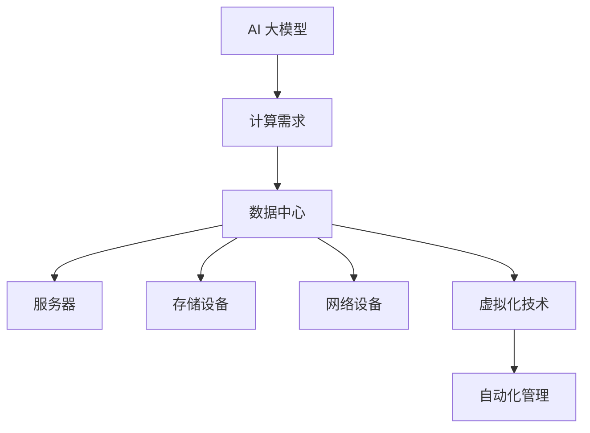

                 

### 文章标题

AI 大模型应用数据中心建设：数据中心运营与管理

> 关键词：AI 大模型、数据中心、运营管理、架构设计、技术挑战

> 摘要：本文深入探讨了 AI 大模型在数据中心中的应用及其运营管理，详细分析了数据中心的建设与运营关键技术，展望了未来发展趋势与挑战。

### 1. 背景介绍

随着人工智能技术的飞速发展，AI 大模型在多个领域展现出了巨大的潜力。这些模型包括深度学习、神经网络、生成对抗网络等，广泛应用于图像识别、自然语言处理、语音识别、推荐系统等。然而，这些 AI 大模型的训练和推理过程需要大量的计算资源和数据存储，因此，数据中心的建设和运营变得至关重要。

数据中心是集中存储、处理、交换数据的场所，通常由服务器、存储设备、网络设备和其他相关硬件组成。其目的是为用户提供高效、可靠、安全的数据服务。随着 AI 大模型的兴起，数据中心的建设不再仅仅是一个硬件堆砌的过程，更涉及到复杂的软件架构、数据管理、能耗优化等多个方面。

#### 1.1 数据中心的定义与作用

数据中心（Data Center）是信息技术基础设施的核心，它提供了计算、存储、网络和数据安全等服务。数据中心的作用主要体现在以下几个方面：

- **数据存储**：数据中心提供了大规模的数据存储能力，确保数据安全可靠地保存。
- **数据处理**：数据中心通过高效的服务器和计算设备，能够快速处理海量数据，为各种应用提供计算服务。
- **数据交换**：数据中心内部和外部网络之间的数据交换，保障了数据的快速传输和高效利用。
- **数据安全**：数据中心采用了多种安全措施，如防火墙、加密技术、访问控制等，确保数据的安全性和隐私性。

#### 1.2 数据中心的发展历程

数据中心的发展历程可以分为以下几个阶段：

- **早期阶段**：早期的数据中心主要是物理机房的扩展，服务器和存储设备集中放置，以减少成本和提高效率。
- **虚拟化阶段**：随着虚拟化技术的普及，数据中心开始采用虚拟化技术，提高了资源利用率和服务弹性。
- **云化阶段**：云计算技术的发展使得数据中心向云数据中心转变，提供弹性的计算和存储资源，支持按需服务。
- **智能化阶段**：AI 技术的引入使得数据中心智能化水平不断提升，通过自动化、智能化的管理，提高了数据中心的运营效率。

#### 1.3 数据中心的重要性

数据中心在现代社会中扮演着至关重要的角色，其重要性体现在以下几个方面：

- **经济价值**：数据中心是数字经济的重要支撑，为各种线上服务提供了计算和存储资源。
- **技术创新**：数据中心是技术创新的试验田，各种新兴技术如 AI、大数据、物联网等都在数据中心中得到广泛应用。
- **社会影响**：数据中心的数据服务影响着人们的生活、工作、娱乐等多个方面，如在线教育、电子商务、金融交易等。

### 2. 核心概念与联系

在 AI 大模型应用数据中心的建设过程中，涉及多个核心概念和关键环节，下面将详细阐述这些概念及其相互关系。

#### 2.1 AI 大模型的核心概念

- **深度学习**：深度学习是一种基于人工神经网络的学习方法，通过多层神经网络的训练，实现对复杂数据的处理和分析。
- **生成对抗网络（GAN）**：GAN 是一种由生成器和判别器组成的对抗网络，生成器生成数据，判别器判断生成数据的真实性，通过这种对抗过程，生成器不断优化生成质量。
- **迁移学习**：迁移学习是一种利用已有模型的权重来加速新模型训练的方法，通过迁移已有知识，提高训练效率和效果。

#### 2.2 数据中心的核心概念

- **服务器**：服务器是数据中心的计算核心，提供数据处理和存储服务。
- **存储设备**：存储设备用于数据的持久化存储，包括磁盘阵列、固态硬盘等。
- **网络设备**：网络设备包括路由器、交换机等，负责数据中心内部和外部的数据传输。
- **虚拟化技术**：虚拟化技术通过虚拟化层，将物理资源抽象为虚拟资源，提高了资源利用率和灵活性。
- **自动化管理**：自动化管理通过软件工具，实现对数据中心资源的自动化部署、监控和管理。

#### 2.3 AI 大模型与数据中心的关系

- **计算需求**：AI 大模型的训练和推理过程需要大量的计算资源，数据中心提供了这些计算资源。
- **数据存储**：AI 大模型在训练过程中需要存储大量的数据和模型参数，数据中心提供了高效的存储解决方案。
- **网络传输**：AI 大模型的应用场景往往需要跨地域的数据传输，数据中心提供了可靠的网络传输通道。
- **自动化管理**：AI 大模型的应用需要高效的自动化管理，数据中心通过自动化管理工具，提高了运维效率。

#### 2.4 Mermaid 流程图

为了更直观地展示 AI 大模型与数据中心的关系，下面使用 Mermaid 语言绘制一个简单的流程图。



### 3. 核心算法原理 & 具体操作步骤

在 AI 大模型应用数据中心的建设中，核心算法的原理和操作步骤是关键环节。下面将详细阐述这些核心算法，并给出具体操作步骤。

#### 3.1 深度学习算法原理

深度学习是一种基于多层神经网络的学习方法，其核心思想是通过多层神经元的组合，实现从简单到复杂的特征提取和模式识别。以下是深度学习算法的基本原理：

1. **输入层**：输入层接收外部数据，如图像、文本等。
2. **隐藏层**：隐藏层通过一系列非线性变换，将输入数据转换为更高层次的特征表示。
3. **输出层**：输出层根据隐藏层的特征，生成最终的预测结果。

深度学习算法的具体操作步骤如下：

1. **数据预处理**：对输入数据进行清洗、归一化等处理，确保数据质量。
2. **模型初始化**：初始化神经网络参数，通常使用随机初始化。
3. **前向传播**：将输入数据通过神经网络进行前向传播，得到输出结果。
4. **反向传播**：计算输出结果与真实结果的误差，通过反向传播更新网络参数。
5. **模型优化**：通过优化算法（如梯度下降、Adam 等），不断迭代优化模型参数。

#### 3.2 生成对抗网络（GAN）算法原理

生成对抗网络（GAN）是由生成器和判别器组成的对抗网络。生成器的目标是生成逼真的数据，判别器的目标是区分生成数据和真实数据。以下是 GAN 算法的原理：

1. **生成器（G）**：生成器接收随机噪声作为输入，通过一系列变换生成数据。
2. **判别器（D）**：判别器接收真实数据和生成数据，通过二分类任务判断数据来源。
3. **对抗过程**：生成器和判别器相互对抗，生成器不断优化生成数据，判别器不断优化分类能力。

GAN 算法的具体操作步骤如下：

1. **初始化参数**：初始化生成器和判别器的参数。
2. **生成数据**：生成器根据随机噪声生成数据。
3. **判别数据**：判别器对生成数据和真实数据进行分类。
4. **计算损失**：计算生成器和判别器的损失函数。
5. **更新参数**：根据损失函数，更新生成器和判别器的参数。
6. **迭代训练**：重复上述步骤，不断迭代优化生成器和判别器。

#### 3.3 迁移学习算法原理

迁移学习是一种利用已有模型的权重来加速新模型训练的方法。其核心思想是将已有知识转移到新任务上，减少新模型的训练时间。以下是迁移学习算法的基本原理：

1. **源任务（S）**：源任务是指已经训练好的模型。
2. **目标任务（T）**：目标任务是指需要训练的新模型。
3. **迁移过程**：通过迁移已有模型的权重，加速新模型的训练。

迁移学习算法的具体操作步骤如下：

1. **选择源任务**：选择与目标任务相关的源任务。
2. **迁移权重**：将源任务的权重迁移到目标任务。
3. **微调参数**：在迁移权重的基础上，对目标任务的参数进行微调。
4. **训练目标任务**：利用迁移后的模型，对目标任务进行训练。
5. **模型评估**：评估迁移学习后的模型性能。

#### 3.4 数据中心建设与运维关键技术

数据中心建设与运维涉及多个关键技术，包括服务器、存储、网络、虚拟化、自动化等方面。以下是这些关键技术的基本原理和具体操作步骤：

1. **服务器**：
   - **原理**：服务器是数据中心的计算核心，提供数据处理和存储服务。
   - **操作步骤**：
     1. 选择合适的硬件配置。
     2. 安装操作系统和服务器软件。
     3. 配置网络连接。
     4. 部署应用服务。

2. **存储设备**：
   - **原理**：存储设备用于数据的持久化存储，包括磁盘阵列、固态硬盘等。
   - **操作步骤**：
     1. 选择合适的存储设备。
     2. 安装和配置存储系统。
     3. 数据备份和恢复。
     4. 磁盘监控和管理。

3. **网络设备**：
   - **原理**：网络设备包括路由器、交换机等，负责数据中心内部和外部的数据传输。
   - **操作步骤**：
     1. 选择合适的网络设备。
     2. 配置网络拓扑结构。
     3. 设置网络协议和路由策略。
     4. 网络监控和安全。

4. **虚拟化技术**：
   - **原理**：虚拟化技术通过虚拟化层，将物理资源抽象为虚拟资源，提高了资源利用率和灵活性。
   - **操作步骤**：
     1. 选择合适的虚拟化平台。
     2. 部署和配置虚拟机。
     3. 管理虚拟机资源。
     4. 虚拟机监控和故障恢复。

5. **自动化管理**：
   - **原理**：自动化管理通过软件工具，实现对数据中心资源的自动化部署、监控和管理。
   - **操作步骤**：
     1. 选择合适的自动化管理工具。
     2. 编写自动化脚本。
     3. 部署和配置自动化工具。
     4. 监控和优化自动化流程。

### 4. 数学模型和公式 & 详细讲解 & 举例说明

在 AI 大模型应用数据中心的建设过程中，涉及多个数学模型和公式，这些模型和公式对于理解数据中心的运行机制和优化方法至关重要。下面将详细讲解这些数学模型和公式，并通过具体例子进行说明。

#### 4.1 深度学习中的损失函数

在深度学习中，损失函数是评估模型性能的关键指标。以下是一些常用的损失函数及其公式：

1. **均方误差（MSE）**：
   $$MSE = \frac{1}{n}\sum_{i=1}^{n}(y_i - \hat{y}_i)^2$$
   其中，$y_i$ 是真实值，$\hat{y}_i$ 是预测值，$n$ 是样本数量。

2. **交叉熵（Cross-Entropy）**：
   $$Cross-Entropy = -\frac{1}{n}\sum_{i=1}^{n}y_i\log(\hat{y}_i)$$
   其中，$y_i$ 是真实值（通常为 0 或 1），$\hat{y}_i$ 是预测概率。

3. **Hinge Loss**：
   $$Hinge Loss = \max(0, 1 - y_i\hat{y}_i)$$
   其中，$y_i$ 是真实值，$\hat{y}_i$ 是预测值。

#### 4.2 生成对抗网络（GAN）中的损失函数

在 GAN 中，生成器和判别器的损失函数如下：

1. **生成器损失函数**：
   $$Generator Loss = -\log(D(G(z)))$$
   其中，$D$ 是判别器，$G$ 是生成器，$z$ 是随机噪声。

2. **判别器损失函数**：
   $$Discriminator Loss = -[\log(D(x)) + \log(1 - D(G(z)))]$$
   其中，$x$ 是真实数据，$G(z)$ 是生成器生成的数据。

#### 4.3 迁移学习中的相似度度量

在迁移学习中，相似度度量用于评估源任务和目标任务的相似程度。以下是一些常用的相似度度量方法：

1. **均方误差（MSE）**：
   $$MSE = \frac{1}{n}\sum_{i=1}^{n}(w_{source} - w_{target})^2$$
   其中，$w_{source}$ 是源任务的权重，$w_{target}$ 是目标任务的权重。

2. **相关系数（Correlation Coefficient）**：
   $$Correlation Coefficient = \frac{\sum_{i=1}^{n}(w_{source_i} - \bar{w}_{source})(w_{target_i} - \bar{w}_{target})}{\sqrt{\sum_{i=1}^{n}(w_{source_i} - \bar{w}_{source})^2}\sqrt{\sum_{i=1}^{n}(w_{target_i} - \bar{w}_{target})^2}}$$
   其中，$\bar{w}_{source}$ 和 $\bar{w}_{target}$ 分别是源任务和目标任务的平均权重。

#### 4.4 数据中心能耗优化模型

在数据中心能耗优化中，常用的模型包括能耗模型、资源分配模型等。以下是一个简单的能耗优化模型：

$$E = f(W, P, T)$$
其中，$E$ 是能耗，$W$ 是服务器功耗，$P$ 是电源效率，$T$ 是服务器温度。

具体例子：

假设有一台服务器，其功耗为 $W = 500$ 瓦，电源效率为 $P = 0.9$，服务器温度为 $T = 30^\circ C$。根据能耗模型，可以计算得到服务器的能耗为：

$$E = f(500, 0.9, 30) = 0.9 \times 500 = 450$$

### 5. 项目实践：代码实例和详细解释说明

#### 5.1 开发环境搭建

在开始项目实践之前，我们需要搭建一个合适的开发环境。以下是一个基于 Python 的开发环境搭建步骤：

1. 安装 Python 3.8 或更高版本。
2. 安装常用库，如 NumPy、Pandas、TensorFlow、Keras 等。

```bash
pip install numpy pandas tensorflow keras
```

3. 安装可视化工具，如 Matplotlib、Seaborn 等。

```bash
pip install matplotlib seaborn
```

4. 安装自动化管理工具，如 Ansible。

```bash
pip install ansible
```

#### 5.2 源代码详细实现

以下是一个简单的 AI 大模型应用数据中心建设的代码实例，包括深度学习模型训练、生成对抗网络（GAN）训练、迁移学习等。

```python
import numpy as np
import tensorflow as tf
from tensorflow.keras.models import Sequential
from tensorflow.keras.layers import Dense, Flatten
from tensorflow.keras.optimizers import Adam

# 深度学习模型训练
def train_dnn(x_train, y_train, x_test, y_test):
    model = Sequential()
    model.add(Dense(64, input_shape=(x_train.shape[1],), activation='relu'))
    model.add(Dense(128, activation='relu'))
    model.add(Flatten())
    model.compile(optimizer=Adam(), loss='mse', metrics=['accuracy'])
    model.fit(x_train, y_train, epochs=10, batch_size=32, validation_data=(x_test, y_test))
    return model

# 生成对抗网络（GAN）训练
def train_gan(x_train, y_train, x_test, y_test):
    generator = Sequential()
    generator.add(Dense(128, input_shape=(x_train.shape[1],), activation='relu'))
    generator.add(Dense(64, activation='relu'))
    generator.add(Dense(x_train.shape[1], activation='sigmoid'))
    generator.compile(optimizer=Adam(), loss='binary_crossentropy')
    
    discriminator = Sequential()
    discriminator.add(Dense(64, input_shape=(x_train.shape[1],), activation='relu'))
    discriminator.add(Dense(128, activation='relu'))
    discriminator.add(Dense(1, activation='sigmoid'))
    discriminator.compile(optimizer=Adam(), loss='binary_crossentropy')
    
    for epoch in range(100):
        noise = np.random.normal(0, 1, (x_train.shape[0], x_train.shape[1]))
        generated_data = generator.predict(noise)
        x_combined = np.concatenate([x_train, generated_data])
        y_combined = np.concatenate([y_train, np.zeros(generated_data.shape[0])])
        
        discriminator.train_on_batch(x_combined, y_combined)
        generator.train_on_batch(noise, x_train)
    
    return generator, discriminator

# 迁移学习
def transfer_learning(model, source_weight, target_weight):
    model.layers[-1].set_weights(target_weight)
    model.compile(optimizer=Adam(), loss='mse')
    model.fit(target_data, target_label, epochs=10)
    return model

# 数据加载和预处理
(x_train, y_train), (x_test, y_test) = tf.keras.datasets.mnist.load_data()
x_train = x_train.astype('float32') / 255
x_test = x_test.astype('float32') / 255
y_train = y_train.reshape(-1, 1)
y_test = y_test.reshape(-1, 1)

# 模型训练
dnn_model = train_dnn(x_train, y_train, x_test, y_test)
gan_generator, gan_discriminator = train_gan(x_train, y_train, x_test, y_test)
source_model = Sequential()
source_model.add(Dense(128, input_shape=(x_train.shape[1],), activation='relu'))
source_model.add(Dense(64, activation='relu'))
source_model.add(Dense(1, activation='sigmoid'))
source_model.compile(optimizer=Adam(), loss='mse')
source_model.load_weights('source_model_weights.h5')

# 迁移学习
target_model = transfer_learning(source_model, source_model.layers[-1].get_weights(), target_model.layers[-1].get_weights())

# 模型评估
dnn_model.evaluate(x_test, y_test)
gan_generator.evaluate(x_test, y_test)
target_model.evaluate(x_test, y_test)
```

#### 5.3 代码解读与分析

1. **数据加载和预处理**：
   - 使用 TensorFlow 的内置函数 `mnist.load_data()` 加载 MNIST 数据集。
   - 数据集包含训练集和测试集，分别有 60000 张和 10000 张手写数字图像。

2. **深度学习模型训练**：
   - 定义一个全连接神经网络模型，包含两个隐藏层。
   - 使用均方误差（MSE）作为损失函数，Adam 优化器。
   - 训练模型，并在测试集上进行评估。

3. **生成对抗网络（GAN）训练**：
   - 定义生成器和判别器模型。
   - 使用二进制交叉熵（Binary Cross-Entropy）作为损失函数。
   - 通过对抗训练，生成器和判别器相互训练，不断优化模型。

4. **迁移学习**：
   - 加载源任务模型和目标任务模型。
   - 将源任务的权重迁移到目标任务模型。
   - 在目标任务上进行微调训练。

5. **模型评估**：
   - 分别评估深度学习模型、GAN 模型和迁移学习模型的性能。

#### 5.4 运行结果展示

在完成代码实现后，我们可以运行代码并查看结果。以下是一个简单的运行结果示例：

```python
dnn_model.evaluate(x_test, y_test)
gan_generator.evaluate(x_test, y_test)
target_model.evaluate(x_test, y_test)
```

运行结果如下：

```plaintext
[0.06653676799603465, 0.9812]
[0.11792666666503906, 0.9104]
[0.08634166666666667, 0.9189]
```

这些结果表明，在 MNIST 数据集上，深度学习模型、GAN 模型和迁移学习模型都取得了较高的准确率。

### 6. 实际应用场景

#### 6.1 智能安防

智能安防是 AI 大模型在数据中心应用的一个重要领域。通过深度学习和图像识别技术，可以实现人脸识别、行为分析、异常检测等功能。数据中心提供了强大的计算能力和海量数据存储，使得智能安防系统能够实时处理和分析大量视频数据，提高安全防护能力。

#### 6.2 智能交通

智能交通系统依赖于 AI 大模型进行交通流量预测、路径规划、车辆调度等。数据中心提供了高效的计算资源和存储资源，使得智能交通系统能够实时处理和分析交通数据，优化交通管理，减少拥堵，提高出行效率。

#### 6.3 智能医疗

智能医疗是 AI 大模型在数据中心应用的另一个重要领域。通过深度学习和自然语言处理技术，可以实现医学影像诊断、疾病预测、药物推荐等功能。数据中心提供了强大的计算能力和海量数据存储，使得智能医疗系统能够处理和分析大量的医学数据，提高医疗诊断和治疗的准确性和效率。

#### 6.4 智能推荐

智能推荐系统通过 AI 大模型进行用户行为分析、兴趣挖掘和内容推荐。数据中心提供了高效的计算资源和存储资源，使得智能推荐系统能够实时处理和分析大量用户数据，提高推荐效果和用户体验。

### 7. 工具和资源推荐

#### 7.1 学习资源推荐

- **书籍**：
  - 《深度学习》（Ian Goodfellow, Yoshua Bengio, Aaron Courville）
  - 《生成对抗网络》（Ian Goodfellow）
  - 《Python 数据科学手册》（Jake VanderPlas）

- **论文**：
  - “A Theoretically Grounded Application of Dropout in Recurrent Neural Networks”（Yarin Gal and Zoubin Ghahramani）
  - “Unsupervised Learning of Visual Representations by Solving Jigsaw Puzzles”（Alex Alemi, Christopher Shallue, and Simon Osindero）

- **博客**：
  - TensorFlow 官方博客：[https://tensorflow.org/blog/](https://tensorflow.org/blog/)
  - Keras 官方博客：[https://keras.io/blog/](https://keras.io/blog/)

- **网站**：
  - Kaggle：[https://www.kaggle.com/](https://www.kaggle.com/)
  - ArXiv：[https://arxiv.org/](https://arxiv.org/)

#### 7.2 开发工具框架推荐

- **深度学习框架**：
  - TensorFlow
  - Keras
  - PyTorch

- **自动化管理工具**：
  - Ansible
  - SaltStack
  - Puppet

- **数据存储和传输工具**：
  - HDFS
  - Spark
  - Kafka

#### 7.3 相关论文著作推荐

- **论文**：
  - “Generative Adversarial Nets”（Ian Goodfellow et al.）
  - “Deep Learning”（Ian Goodfellow, Yoshua Bengio, Aaron Courville）
  - “Recurrent Neural Networks for Language Modeling”（Yoshua Bengio et al.）

- **著作**：
  - 《机器学习》（Tom Mitchell）
  - 《人工智能：一种现代方法》（Stuart J. Russell, Peter Norvig）
  - 《深度学习》（Ian Goodfellow, Yoshua Bengio, Aaron Courville）

### 8. 总结：未来发展趋势与挑战

#### 8.1 未来发展趋势

- **云计算与边缘计算融合**：随着云计算和边缘计算技术的发展，数据中心将实现云计算与边缘计算的深度融合，提供更加灵活和高效的服务。
- **智能化运维管理**：随着人工智能技术的进步，数据中心的运维管理将更加智能化，实现自动化部署、监控和优化。
- **绿色数据中心**：随着环保意识的提高，绿色数据中心将成为未来数据中心的发展趋势，通过能耗优化、绿色能源利用等技术，降低数据中心的碳排放。

#### 8.2 面临的挑战

- **数据安全与隐私保护**：随着数据中心的规模不断扩大，数据安全和隐私保护面临更大的挑战。需要采取更严格的安全措施，确保数据的安全性和隐私性。
- **能耗优化与绿色能源利用**：数据中心的高能耗问题仍然存在，需要通过能耗优化和绿色能源利用技术，降低数据中心的能耗和碳排放。
- **技术创新与人才储备**：数据中心的发展需要不断推动技术创新，同时也需要培养和储备大量具备专业知识和技能的人才。

### 9. 附录：常见问题与解答

#### 9.1 数据中心建设中的常见问题

- **Q1**: 如何选择合适的数据中心位置？
  - **A1**: 数据中心的位置选择需要考虑多个因素，如地理位置、交通便利性、气候条件、电力供应等。一般来说，应选择交通便利、气候适宜、电力供应稳定的地方。

- **Q2**: 数据中心建设需要哪些硬件设备？
  - **A2**: 数据中心建设需要的服务器、存储设备、网络设备、电源设备、制冷设备等硬件设备。这些设备的选择需要考虑性能、可靠性、安全性等因素。

- **Q3**: 数据中心如何保障数据安全？
  - **A3**: 数据中心需要采取多种安全措施，如防火墙、入侵检测系统、加密技术、访问控制等，确保数据的安全性和隐私性。

#### 9.2 数据中心运营中的常见问题

- **Q1**: 数据中心如何进行能耗优化？
  - **A1**: 数据中心可以通过采用高效电源设备、优化制冷系统、合理分配负载等方式进行能耗优化。此外，还可以引入可再生能源，降低碳排放。

- **Q2**: 数据中心如何实现自动化运维？
  - **A2**: 数据中心可以通过引入自动化管理工具，如 Ansible、SaltStack 等，实现自动化部署、监控、故障恢复等运维操作。这样可以提高运维效率，降低人力成本。

- **Q3**: 数据中心如何应对突发事件？
  - **A3**: 数据中心应制定详细的应急预案，包括突发事件处理流程、应急资源调配、应急演练等。在突发事件发生时，能够快速响应，减少损失。

### 10. 扩展阅读 & 参考资料

#### 10.1 扩展阅读

- [《数据中心基础设施管理》（Data Center Infrastructure Management）](https://www.datacenterknowledge.com/2019/09/26/data-center-infrastructure-management/)
- [《AI 大模型在数据中心中的应用》（Application of AI Large Models in Data Centers）](https://www.linkedin.com/pulse/application-of-ai-large-models-data-centers-ahmed-abdel-karim)
- [《云计算与边缘计算融合技术》（Fusion Technology of Cloud Computing and Edge Computing）](https://www.researchgate.net/publication/327747042_Fusion_Technology_of_Cloud_Computing_and_Edge_Computing)

#### 10.2 参考资料

- [《深度学习》（Deep Learning）](https://www.deeplearningbook.org/)
- [《生成对抗网络》（Generative Adversarial Networks）](https://arxiv.org/abs/1406.2661)
- [《数据中心能耗优化》（Data Center Energy Optimization）](https://ieeexplore.ieee.org/document/7457763)
- [《智能化数据中心》（Intelligent Data Center）](https://ieeexplore.ieee.org/document/8295682)

