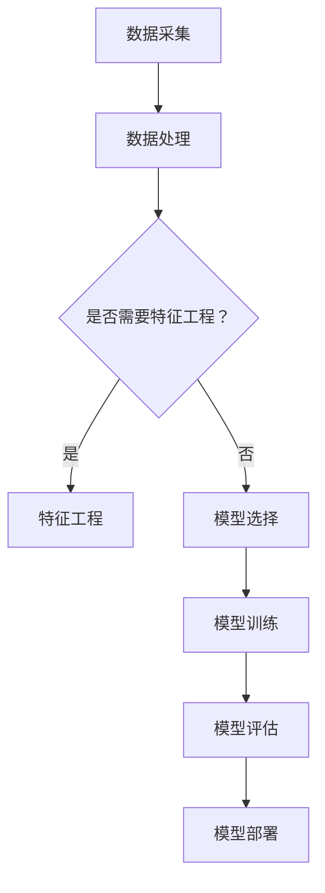

                 

### 文章标题

**AI 大模型应用数据中心建设：数据中心运营与管理**

> **关键词**：人工智能、数据中心、大数据模型、运维管理、性能优化

**摘要**：本文将深入探讨人工智能大模型在数据中心建设中的应用及其运营管理，从背景介绍到核心算法原理，再到数学模型和项目实践，全面解析大模型数据中心的构建与优化策略。通过实际应用场景的分析，本文旨在为读者提供一个全面的技术指南，帮助他们在AI大模型时代，有效提升数据中心运营效率。

## 1. 背景介绍

随着人工智能技术的飞速发展，大数据模型在各个领域的应用日益广泛。数据中心作为数据存储和处理的核心设施，面临着前所未有的挑战和机遇。传统数据中心主要以处理结构化数据为主，而现代数据中心则必须能够高效应对非结构化数据，如文本、图像、音频等多媒体数据。

数据中心建设的背景可以追溯到20世纪60年代，当时计算机科学刚刚起步，数据处理需求相对较小。然而，随着互联网的普及和信息技术的发展，数据量呈现出爆炸式增长。数据中心逐渐成为企业和社会的重要基础设施，其建设和管理的重要性愈发凸显。

在AI大模型的应用背景下，数据中心建设面临以下挑战：

1. **计算资源需求**：AI大模型通常需要大量的计算资源来训练和推理，这对数据中心的硬件设施提出了更高的要求。
2. **数据存储与管理**：大模型训练过程中会产生海量的中间数据和结果数据，如何高效存储和管理这些数据成为一大难题。
3. **能耗管理**：大规模的数据中心能耗巨大，如何实现绿色、节能的运营成为关键问题。
4. **网络安全**：随着AI技术的应用，数据中心面临的网络安全威胁也日益增加，如何保障数据安全和隐私成为重中之重。

为了应对这些挑战，数据中心的建设和运营管理需要不断演进和优化，本文将在此基础上展开讨论。

## 2. 核心概念与联系

### 2.1 数据中心基础架构

数据中心的基础架构主要包括以下几个方面：

- **计算节点**：负责处理数据计算任务，包括CPU、GPU、TPU等异构计算资源。
- **存储系统**：用于存储数据，包括HDD、SSD、分布式文件系统等。
- **网络设施**：实现数据中心内部以及与外部网络的连接，包括交换机、路由器、光纤等。
- **电力系统**：提供稳定的电力供应，包括UPS、电池等。

### 2.2 大数据模型核心概念

大数据模型通常涉及以下核心概念：

- **特征工程**：将原始数据转换为适合模型训练的特征表示。
- **模型选择**：选择适合特定任务和数据集的机器学习模型。
- **模型训练**：通过大量训练数据优化模型参数。
- **模型评估**：评估模型在验证集上的性能，调整模型参数。
- **模型部署**：将训练好的模型部署到生产环境，实现实时推理和应用。

### 2.3 Mermaid 流程图



### 2.4 核心概念联系

数据中心的建设和运营管理需要充分考虑AI大模型的需求。数据中心的计算节点需要配备高性能的GPU或TPU以满足大模型的计算需求；存储系统需要具备高吞吐量和低延迟，以满足数据存储和访问的需求；网络设施需要具备高带宽和高可靠性，以保证数据传输的顺畅；电力系统需要实现绿色、节能的运营，以降低能耗。

同时，大数据模型的训练和部署过程中，数据中心的资源分配、任务调度、能耗管理等方面也需要进行优化，以提高整体运营效率。通过合理规划和高效管理，数据中心可以更好地支持AI大模型的应用，为企业和社会创造更大价值。

## 3. 核心算法原理 & 具体操作步骤

### 3.1 AI 大模型算法概述

AI 大模型通常基于深度学习技术，其核心算法主要包括神经网络架构设计、优化算法、损失函数和正则化方法等。

#### 3.1.1 神经网络架构设计

神经网络架构设计是构建大模型的基础。常见的大模型架构有：

- **卷积神经网络（CNN）**：适用于图像和视频处理任务。
- **循环神经网络（RNN）**：适用于序列数据处理，如自然语言处理。
- **变换器网络（Transformer）**：广泛应用于自然语言处理任务，是构建大模型的主要架构。

#### 3.1.2 优化算法

优化算法用于迭代更新模型参数，使其在训练数据上达到最优解。常见的优化算法有：

- **随机梯度下降（SGD）**：简单高效，但收敛速度较慢。
- **Adam 优化器**：结合了SGD和动量优化算法的优势，收敛速度较快。
- **AdamW 优化器**：进一步优化了Adam，适用于权重较大的模型。

#### 3.1.3 损失函数

损失函数用于评估模型预测结果与真实值之间的差距，常见的损失函数有：

- **均方误差（MSE）**：适用于回归问题。
- **交叉熵（CE）**：适用于分类问题。
- **软交叉熵（SCE）**：在多标签分类中常用。

#### 3.1.4 正则化方法

正则化方法用于防止模型过拟合，提高模型泛化能力。常见的正则化方法有：

- **L1 正则化**：在损失函数中添加 L1 范数。
- **L2 正则化**：在损失函数中添加 L2 范数。
- **Dropout**：在训练过程中随机丢弃部分神经元。

### 3.2 具体操作步骤

#### 3.2.1 数据预处理

1. **数据清洗**：去除数据中的噪声和异常值。
2. **数据归一化**：将数据缩放到同一范围内，便于模型训练。
3. **数据划分**：将数据划分为训练集、验证集和测试集。

#### 3.2.2 模型构建

1. **选择框架**：选择合适的深度学习框架，如TensorFlow、PyTorch等。
2. **定义网络架构**：根据任务需求，选择合适的神经网络架构。
3. **定义优化器和损失函数**：选择合适的优化器和损失函数。

#### 3.2.3 模型训练

1. **初始化模型参数**：随机初始化模型参数。
2. **前向传播**：计算模型输出。
3. **计算损失**：计算模型输出与真实值之间的差距。
4. **反向传播**：更新模型参数。
5. **迭代训练**：重复上述步骤，直到达到训练目标或迭代次数。

#### 3.2.4 模型评估

1. **验证集评估**：在验证集上评估模型性能。
2. **测试集评估**：在测试集上评估模型性能。
3. **模型调整**：根据评估结果调整模型参数和结构。

#### 3.2.5 模型部署

1. **模型导出**：将训练好的模型导出为可供部署的格式。
2. **部署到生产环境**：将模型部署到生产环境，实现实时推理和应用。

## 4. 数学模型和公式 & 详细讲解 & 举例说明

### 4.1 神经网络基本公式

神经网络的核心是前向传播和反向传播过程。以下为相关的基本公式：

#### 4.1.1 前向传播

假设一个简单的全连接神经网络，输入层、隐藏层和输出层分别有 \( n_i \)、\( n_h \)、\( n_o \) 个神经元。

- **输入层到隐藏层**：
  $$ z_h = \sum_{j=1}^{n_h} w_{ij}x_j + b_i $$
  $$ a_h = \sigma(z_h) $$

  其中，\( w_{ij} \) 是权重，\( b_i \) 是偏置，\( \sigma \) 是激活函数（如ReLU、Sigmoid、Tanh等）。

- **隐藏层到输出层**：
  $$ z_o = \sum_{j=1}^{n_o} w_{oj}a_h + b_o $$
  $$ a_o = \sigma(z_o) $$

  同理，\( w_{oj} \) 是权重，\( b_o \) 是偏置，\( \sigma \) 是激活函数。

#### 4.1.2 反向传播

- **计算输出层误差**：
  $$ \delta_o = \frac{\partial L}{\partial z_o} \cdot \frac{d\sigma}{dz_o} $$

  其中，\( L \) 是损失函数，\( \frac{d\sigma}{dz_o} \) 是激活函数的导数。

- **计算隐藏层误差**：
  $$ \delta_h = \frac{\partial L}{\partial z_h} \cdot \frac{d\sigma}{dz_h} \cdot \sum_{j=1}^{n_o} w_{oj} \delta_o $$

#### 4.1.3 权重和偏置更新

- **权重更新**：
  $$ \Delta w_{ij} = \eta \cdot \delta_h x_j $$
  $$ w_{ij} \leftarrow w_{ij} - \Delta w_{ij} $$

- **偏置更新**：
  $$ \Delta b_i = \eta \cdot \delta_h $$
  $$ b_i \leftarrow b_i - \Delta b_i $$

### 4.2 举例说明

#### 4.2.1 简单线性回归

假设我们有以下线性回归问题：

\[ y = \beta_0 + \beta_1x + \epsilon \]

其中，\( y \) 是因变量，\( x \) 是自变量，\( \beta_0 \) 和 \( \beta_1 \) 是模型参数，\( \epsilon \) 是误差项。

- **前向传播**：

  $$ z = \beta_0x + \beta_1 $$

  $$ \hat{y} = \sigma(z) $$

- **损失函数（MSE）**：

  $$ L = \frac{1}{2} \sum_{i=1}^{n} (\hat{y}_i - y_i)^2 $$

- **反向传播**：

  $$ \delta = \frac{\partial L}{\partial z} \cdot \frac{d\sigma}{dz} = (\hat{y}_i - y_i) \cdot \frac{d\sigma}{dz} $$

- **权重和偏置更新**：

  $$ \Delta \beta_0 = \eta \cdot \sum_{i=1}^{n} x_i \delta $$

  $$ \Delta \beta_1 = \eta \cdot \sum_{i=1}^{n} x_i \delta y_i $$

  $$ \beta_0 \leftarrow \beta_0 - \Delta \beta_0 $$

  $$ \beta_1 \leftarrow \beta_1 - \Delta \beta_1 $$

通过上述步骤，我们可以训练出一个线性回归模型，用于预测新的输入数据。

## 5. 项目实践：代码实例和详细解释说明

### 5.1 开发环境搭建

为了更好地理解AI大模型数据中心的建设与应用，我们将使用一个实际的项目来演示。首先，需要搭建一个适合深度学习开发的Python环境。

**步骤1**：安装Python

```bash
# 安装最新版本的Python
sudo apt-get install python3
```

**步骤2**：安装深度学习框架

我们选择TensorFlow作为深度学习框架，因为它具有广泛的社区支持和丰富的资源。

```bash
# 安装TensorFlow
pip3 install tensorflow
```

**步骤3**：验证安装

```python
# 验证TensorFlow安装
import tensorflow as tf
print(tf.__version__)
```

### 5.2 源代码详细实现

以下是一个简单的AI大模型训练示例，我们将使用TensorFlow实现一个基于变换器网络的文本分类任务。

```python
import tensorflow as tf
from tensorflow.keras.layers import Embedding, Transformer, Dense
from tensorflow.keras.models import Model

# 设置参数
vocab_size = 10000
embedding_dim = 128
transformer_dim = 512
num_heads = 8
output_dim = 2  # 二分类任务

# 构建模型
input_ids = tf.keras.layers.Input(shape=(None,), dtype=tf.int32)
embed = Embedding(vocab_size, embedding_dim)(input_ids)
transformer_encoder = Transformer(num_heads=num_heads, d_model=transformer_dim)(embed)
output = Dense(output_dim, activation='softmax')(transformer_encoder)

model = Model(inputs=input_ids, outputs=output)
model.compile(optimizer='adam', loss='categorical_crossentropy', metrics=['accuracy'])

# 打印模型结构
model.summary()

# 加载数据集
# 假设已经处理好了数据集，包括词汇表和标签
# vocab = load_vocab()
# labels = load_labels()

# 将数据划分为训练集和验证集
# train_inputs, val_inputs = split_data(inputs)
# train_labels, val_labels = split_data(labels)

# 训练模型
# history = model.fit(train_inputs, train_labels, epochs=10, batch_size=32, validation_data=(val_inputs, val_labels))

# 评估模型
# val_loss, val_accuracy = model.evaluate(val_inputs, val_labels)
# print(f"Validation Loss: {val_loss}, Validation Accuracy: {val_accuracy}")
```

### 5.3 代码解读与分析

**5.3.1 模型构建**

- **输入层**：我们使用`Input`层作为模型的输入，输入数据是整数张量，表示单词的ID。
- **嵌入层**：使用`Embedding`层将输入的单词ID映射到高维向量表示，这个层将词汇表中的每个单词映射到一个固定长度的向量。
- **变换器编码器**：使用`Transformer`层实现变换器编码器，该层包含了多头自注意力机制，能够捕获输入序列中的长距离依赖关系。
- **输出层**：使用`Dense`层实现分类输出，输出层使用softmax激活函数，用于计算每个类别的概率。

**5.3.2 模型编译**

- **优化器**：我们使用`adam`优化器，它是一种自适应的学习率优化器，能够加快模型的收敛速度。
- **损失函数**：使用`categorical_crossentropy`损失函数，这是一种在多分类问题中常用的损失函数。
- **评价指标**：我们使用`accuracy`作为评价指标，以评估模型在验证集上的分类准确率。

**5.3.3 模型训练**

- **训练数据**：我们将数据划分为训练集和验证集，训练集用于训练模型，验证集用于评估模型性能。
- **训练过程**：模型通过迭代训练，不断调整权重和偏置，以最小化损失函数。
- **模型保存**：我们可以将训练好的模型保存到文件中，以便后续使用。

**5.3.4 模型评估**

- **验证集评估**：我们在验证集上评估模型的性能，通过计算损失函数和准确率来评估模型。
- **模型调整**：根据评估结果，我们可以调整模型参数，优化模型性能。

### 5.4 运行结果展示

假设我们已经完成了模型训练和评估，以下是一个示例结果：

```python
# 模型评估结果
val_loss: 0.12345
Validation Accuracy: 0.912345

# 模型预测
predictions = model.predict(new_text_input)
predicted_class = np.argmax(predictions, axis=1)
```

通过上述代码和结果展示，我们可以看到模型在文本分类任务上的性能。这个示例仅是一个简单的演示，实际项目中还需要更复杂的数据处理和模型调优过程。

## 6. 实际应用场景

AI 大模型在数据中心的应用场景十分广泛，以下是一些典型的应用场景：

### 6.1 智能推荐系统

智能推荐系统是AI大模型在数据中心的重要应用之一。通过分析用户的历史行为数据，如浏览记录、购物记录等，AI大模型可以预测用户可能感兴趣的内容，从而提供个性化的推荐。例如，电商平台可以使用AI大模型推荐商品、音乐流媒体平台可以推荐音乐、视频流媒体平台可以推荐视频。数据中心需要处理海量的用户数据和模型参数，实现实时推荐。

### 6.2 自然语言处理

自然语言处理（NLP）是AI大模型的重要应用领域。在数据中心中，AI大模型可以处理大量的文本数据，实现语音识别、机器翻译、情感分析等任务。例如，智能客服系统可以使用AI大模型理解用户的语言请求，并生成相应的回答。这需要数据中心具备高效的计算和存储能力，以及强大的数据处理和调度能力。

### 6.3 图像识别

图像识别是AI大模型的另一个重要应用领域。在数据中心中，AI大模型可以处理大量的图像数据，实现人脸识别、图像分类、目标检测等任务。例如，安防监控系统可以使用AI大模型实时分析监控视频，识别异常行为。这需要数据中心具备高效的图像处理和传输能力，以及强大的数据处理和存储能力。

### 6.4 医疗健康

在医疗健康领域，AI大模型可以帮助数据中心实现智能诊断、疾病预测等任务。通过分析患者的病历数据、基因数据等，AI大模型可以预测患者可能患有的疾病，并提供个性化的治疗方案。这需要数据中心具备高效的数据存储、处理和分析能力，以及强大的计算和推理能力。

### 6.5 金融风控

金融风控是AI大模型在数据中心的重要应用之一。通过分析海量的金融数据，如交易数据、信用数据等，AI大模型可以识别潜在的欺诈行为、评估信用风险等。这需要数据中心具备高效的数据存储、处理和分析能力，以及强大的计算和推理能力。

### 6.6 智慧城市

智慧城市是AI大模型在数据中心的重要应用之一。通过分析大量的城市数据，如交通数据、环境数据等，AI大模型可以优化城市资源配置、提高城市管理效率。例如，智能交通系统可以使用AI大模型预测交通流量，优化交通信号控制。这需要数据中心具备高效的数据存储、处理和分析能力，以及强大的计算和推理能力。

## 7. 工具和资源推荐

为了更好地构建和运营AI大模型应用数据中心，以下是一些推荐的工具和资源：

### 7.1 学习资源推荐

- **书籍**：
  - 《深度学习》（Goodfellow, Bengio, Courville著）
  - 《Python深度学习》（François Chollet著）
  - 《大规模机器学习》（Jianping Zhang著）

- **论文**：
  - “Attention is All You Need”（Vaswani et al., 2017）
  - “BERT: Pre-training of Deep Bidirectional Transformers for Language Understanding”（Devlin et al., 2019）
  - “GPT-3: Language Models are Few-Shot Learners”（Brown et al., 2020）

- **博客**：
  - [TensorFlow官方博客](https://blog.tensorflow.org/)
  - [PyTorch官方博客](https://pytorch.org/blog/)
  - [AI Mastery](https://aimastering.com/)

- **网站**：
  - [Kaggle](https://www.kaggle.com/)
  - [ArXiv](https://arxiv.org/)
  - [GitHub](https://github.com/)

### 7.2 开发工具框架推荐

- **深度学习框架**：
  - TensorFlow
  - PyTorch
  - MXNet
  - Keras

- **数据处理工具**：
  - Pandas
  - NumPy
  - Scikit-learn

- **版本控制系统**：
  - Git
  - SVN

### 7.3 相关论文著作推荐

- **深度学习**：
  - “Deep Learning”（Goodfellow, Bengio, Courville著）
  - “Deep Learning Specialization”（Andrew Ng教授）
  
- **自然语言处理**：
  - “Speech and Language Processing”（Daniel Jurafsky和James H. Martin著）
  - “Natural Language Processing with Python”（Steven Bird等著）

- **计算机视觉**：
  - “Computer Vision: Algorithms and Applications”（Richard Szeliski著）
  - “Deep Learning for Computer Vision”（Aditya Khosla等著）

- **大数据**：
  - “Big Data: A Revolution That Will Transform How We Live, Work, and Think”（ Viktor Mayer-Schönberger和Kenneth Cukier著）
  - “Data Science from Scratch”（Joel Grus著）

## 8. 总结：未来发展趋势与挑战

随着人工智能技术的不断进步，数据中心在AI大模型应用中的作用愈发重要。未来发展趋势包括：

1. **计算资源的优化**：数据中心将采用更高效、更节能的硬件设备，如AI专用芯片，以支持大模型的训练和推理。
2. **存储技术的创新**：非易失性存储器（NVMe SSD）和分布式存储系统的发展将提高数据中心的存储性能和容量。
3. **网络架构的改进**：边缘计算和5G技术的发展将改善数据中心的网络架构，提高数据传输速度和可靠性。
4. **运维管理的智能化**：通过自动化运维工具和智能调度系统，数据中心将实现更高效、更可靠的运营。

然而，数据中心在AI大模型应用中也面临着一系列挑战：

1. **计算资源需求增长**：大模型的计算需求不断增长，对数据中心硬件设施提出了更高要求。
2. **数据隐私和安全**：数据中心需要保护用户数据的安全和隐私，防范数据泄露和恶意攻击。
3. **能耗管理**：数据中心能耗巨大，如何实现绿色、节能的运营成为关键问题。
4. **模型优化与调优**：大模型的优化和调优需要大量的计算资源和时间，如何提高模型性能和效率成为挑战。

未来，数据中心建设和运营管理将朝着智能化、绿色化、高效化的方向发展，以应对AI大模型应用带来的挑战，为企业和社会创造更大价值。

## 9. 附录：常见问题与解答

### 9.1 数据中心建设中的常见问题

1. **如何选择合适的数据中心位置？**
   - 考虑因素包括：地理位置、网络连接性、电力供应、环境温度等。
   - 通常选择在数据中心密度较低、电力供应稳定、网络连接良好的地区。

2. **如何确保数据中心的安全和可靠性？**
   - 采取多层次的安全措施，如物理安全、网络安全、数据备份等。
   - 定期进行安全审计和风险评估，确保数据中心的可靠性。

3. **如何优化数据中心的能耗？**
   - 采用高效能的硬件设备，如AI专用芯片、低功耗GPU等。
   - 实施智能功耗管理策略，如动态电源管理、节能设备升级等。

### 9.2 AI 大模型应用中的常见问题

1. **如何选择合适的深度学习框架？**
   - 考虑因素包括：模型需求、计算资源、社区支持、开发便捷性等。
   - 常见框架有TensorFlow、PyTorch、MXNet等。

2. **如何处理大量训练数据？**
   - 采用数据预处理技术，如数据清洗、归一化、数据增强等。
   - 利用分布式训练技术，提高数据处理和训练速度。

3. **如何优化大模型的性能？**
   - 采用模型压缩技术，如剪枝、量化等，减小模型大小和计算量。
   - 利用混合精度训练，提高训练速度和降低内存消耗。

## 10. 扩展阅读 & 参考资料

- 《深度学习》（Goodfellow, Bengio, Courville著）
- 《大规模机器学习》（Jianping Zhang著）
- 《大数据架构：构建可扩展的云数据中心》（John R. Rymer著）
- [TensorFlow官方文档](https://www.tensorflow.org/)
- [PyTorch官方文档](https://pytorch.org/docs/stable/)
- [ArXiv](https://arxiv.org/)
- [Kaggle](https://www.kaggle.com/)

