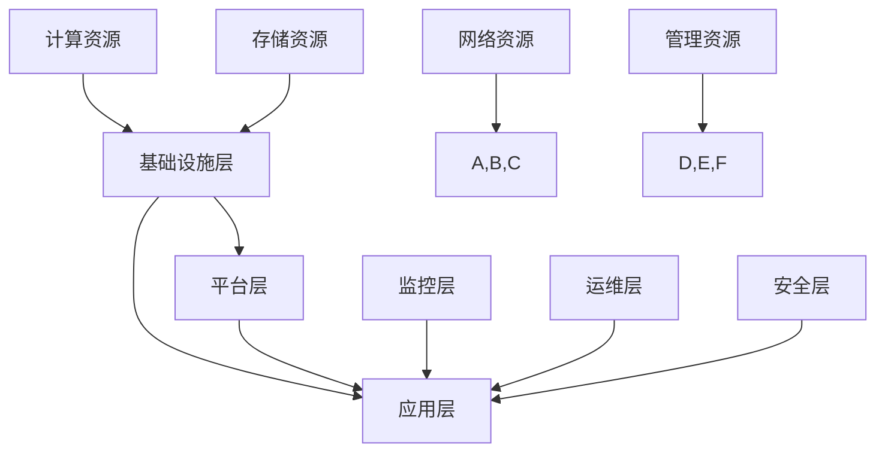
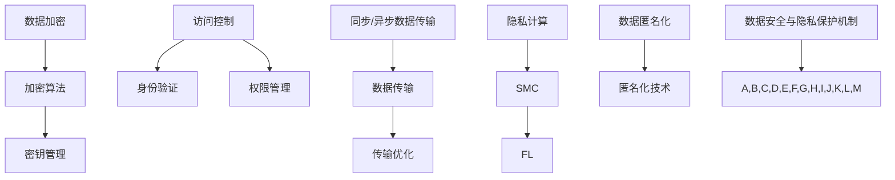

                 

### 背景介绍

随着人工智能（AI）技术的迅猛发展，大规模人工智能模型如GPT-3、BERT等在自然语言处理、计算机视觉等领域取得了显著的成果。这些模型对数据处理能力的需求日益增长，促使许多企业和研究机构开始建设大规模数据中心以支持AI大模型的训练和应用。然而，数据中心的建设不仅仅是一个技术问题，它还涉及到数据安全、隐私保护等多个方面。本文将围绕AI大模型应用数据中心的建设，重点探讨数据安全与隐私保护的挑战及其解决方案。

#### 数据中心建设的现状

数据中心作为AI大模型训练和应用的核心基础设施，其规模和复杂度都在不断增长。首先，从基础设施层面来看，数据中心需要具备强大的计算能力、存储能力和网络带宽。随着AI模型的规模不断扩大，数据中心需要投入更多的计算资源来支持模型的训练。例如，Google的TPU（Tensor Processing Unit）就是专门为加速机器学习和深度学习任务而设计的定制硬件。此外，数据中心的存储系统也需要能够处理海量数据，目前主流的数据存储方案包括SSD（固态硬盘）和分布式文件系统（如HDFS、Ceph等）。

从技术层面来看，AI大模型的训练需要高效的数据处理和流水线化流程。例如，Facebook的PyTorch分布式训练框架（Horovod）和Google的TensorFlow分布式训练框架（Distributed TensorFlow）都能够有效地利用多台机器的算力，加速模型的训练过程。此外，数据预处理和特征工程也是数据中心建设中不可或缺的一部分，这些步骤对于模型的训练效果有着至关重要的影响。

#### 数据安全与隐私保护的挑战

在数据中心的建设过程中，数据安全与隐私保护面临着诸多挑战。以下将详细讨论几个关键问题：

##### 数据泄露的风险

数据中心集中存储了大量的敏感数据，如个人信息、商业机密等。一旦这些数据泄露，将可能导致严重的后果，包括经济损失、声誉受损等。因此，如何确保数据在数据中心中的安全性成为了一个亟待解决的问题。

##### 数据共享的困难

在AI大模型的训练过程中，往往需要多个人、多个机构之间的数据共享。然而，数据共享涉及到数据隐私、数据所有权等多个复杂问题。如何在确保数据安全的前提下实现数据共享，是一个重要的研究课题。

##### 数据隐私保护的法律与政策

随着数据隐私保护意识的提高，各国相继出台了相关的法律法规，如欧盟的《通用数据保护条例》（GDPR）等。数据中心的建设需要遵守这些法律法规，确保数据处理的合法性。

#### 数据安全与隐私保护的解决方案

针对上述挑战，我们可以从以下几个方面来考虑解决方案：

##### 数据加密

数据加密是保障数据安全的基本手段。通过数据加密，即使数据被非法访问，也无法读取数据内容。常用的加密算法包括对称加密（如AES）和非对称加密（如RSA）等。

##### 访问控制

访问控制是一种重要的安全措施，通过限制用户对数据的访问权限，可以有效防止数据泄露。常用的访问控制机制包括基于角色的访问控制（RBAC）和基于属性的访问控制（ABAC）等。

##### 同步与异步数据传输

在数据传输过程中，可以选择同步传输和异步传输两种方式。同步传输要求传输过程在发送方和接收方之间保持同步，适用于实时性要求较高的场景；异步传输则允许传输过程在发送方和接收方之间独立进行，适用于传输延迟可以容忍的场景。

##### 隐私计算

隐私计算是一种在数据不离开原始环境的情况下进行计算的技术，可以有效解决数据隐私保护的问题。常用的隐私计算技术包括安全多方计算（SMC）、联邦学习（FL）等。

##### 数据匿名化

数据匿名化是一种将敏感数据转换为不可识别形式的技术，从而降低数据泄露的风险。常用的数据匿名化技术包括K-匿名、l-diversity、t-closeness等。

##### 法律与政策遵循

数据中心的建设需要严格遵守相关的法律法规，确保数据处理合法合规。同时，需要建立完善的数据隐私保护机制，以应对未来可能出现的法律风险。

#### 总结

数据中心的建设是AI大模型应用的基础，而数据安全与隐私保护则是数据中心建设的核心问题。本文从数据泄露风险、数据共享困难、数据隐私保护的法律与政策等角度分析了数据中心建设中的挑战，并提出了相应的解决方案。通过这些解决方案，我们可以更好地保障数据中心的运行安全和用户隐私，推动人工智能技术的健康发展。

----------------------------------------------------------------

## 核心概念与联系

### 数据中心架构

数据中心是一个复杂的系统，它包括计算资源、存储资源、网络资源等多个组成部分。为了更好地理解数据中心的建设与应用，我们首先需要了解其核心概念和架构。

#### 计算资源

计算资源是数据中心的基础，主要负责AI大模型的训练与推理任务。目前，主流的计算资源包括CPU、GPU、TPU等。其中，CPU（中央处理器）适合执行通用计算任务；GPU（图形处理单元）则适合执行并行计算任务，尤其是深度学习模型的训练；TPU（Tensor Processing Unit）是专门为加速机器学习和深度学习任务而设计的定制硬件。

#### 存储资源

存储资源是数据中心的重要组成部分，主要负责存储和管理大量的数据。主流的存储资源包括SSD（固态硬盘）、HDD（机械硬盘）和分布式文件系统（如HDFS、Ceph等）。SSD具有高速读写性能，适合存储热数据；HDD则具有大容量存储优势，适合存储冷数据。分布式文件系统可以提供高可用性和高扩展性，适合存储海量数据。

#### 网络资源

网络资源是连接计算资源和存储资源的桥梁，主要负责数据传输和负载均衡。主流的网络资源包括以太网、光纤网络和SDN（软件定义网络）。以太网和光纤网络提供高速、稳定的网络连接；SDN则通过软件方式控制网络流量，实现动态负载均衡和流量优化。

#### 数据中心架构

数据中心架构通常包括以下几个层次：

1. **基础设施层**：包括计算资源、存储资源和网络资源等硬件设施。
2. **平台层**：包括操作系统、虚拟化技术、容器化技术等软件设施，为上层应用提供运行环境。
3. **应用层**：包括AI大模型的训练、推理任务以及相关的数据处理和分析应用。
4. **管理层**：包括监控、运维、安全等管理系统，负责数据中心的整体运营和维护。

#### Mermaid 流程图

以下是一个简化的数据中心架构的Mermaid流程图，用于描述数据中心各层次之间的联系：



在这个流程图中，我们可以看到数据中心各层次之间的联系以及它们在数据中心架构中的地位和作用。

### 数据安全与隐私保护的核心概念

在数据中心的建设过程中，数据安全与隐私保护是至关重要的。以下是一些核心概念：

#### 数据加密

数据加密是将数据转换为无法被未经授权者读取的形式的一种技术。数据加密可以分为对称加密和非对称加密。对称加密使用相同的密钥进行加密和解密，速度快，但密钥管理复杂；非对称加密使用一对密钥（公钥和私钥），其中公钥用于加密，私钥用于解密，安全性高，但速度较慢。

#### 访问控制

访问控制是一种基于身份验证和权限管理的机制，用于控制用户对数据的访问权限。常见的访问控制机制包括基于角色的访问控制（RBAC）和基于属性的访问控制（ABAC）。RBAC根据用户的角色来分配访问权限；ABAC则根据用户属性（如部门、职位等）来分配访问权限。

#### 同步与异步数据传输

同步数据传输是指在数据发送方和接收方之间保持数据传输同步的过程，适用于实时性要求较高的场景；异步数据传输则允许数据发送方和接收方之间独立进行数据传输，适用于传输延迟可以容忍的场景。

#### 隐私计算

隐私计算是一种在数据不离开原始环境的情况下进行计算的技术，旨在保护数据隐私。隐私计算包括安全多方计算（SMC）和联邦学习（FL）等。SMC允许多方在共享秘密信息的同时进行计算，而不泄露各自的隐私信息；联邦学习则通过模型聚合的方式，使各方的数据不直接传输，从而保护数据隐私。

#### 数据匿名化

数据匿名化是一种将敏感数据转换为无法识别的形式的技术，以降低数据泄露的风险。常用的数据匿名化技术包括K-匿名、l-diversity、t-closeness等。

### Mermaid 流程图

以下是一个简化的数据安全与隐私保护机制的Mermaid流程图，用于描述数据安全与隐私保护的核心概念及其在数据中心建设中的应用：



在这个流程图中，我们可以看到数据安全与隐私保护的核心概念及其在数据中心建设中的应用。这些概念和技术相互关联，共同构成了一个完整的数据安全与隐私保护体系。

通过以上对数据中心架构和数据安全与隐私保护核心概念的分析，我们可以更好地理解数据中心的建设与应用。在接下来的章节中，我们将进一步探讨数据安全与隐私保护的解决方案，以及如何在实际项目中实施这些方案。

----------------------------------------------------------------

## 核心算法原理 & 具体操作步骤

在数据中心的建设过程中，数据安全与隐私保护是关键挑战。为了应对这些挑战，我们可以采用一系列核心算法和操作步骤来保障数据的安全和用户的隐私。以下将详细介绍这些算法原理和具体操作步骤。

### 数据加密算法

数据加密是保障数据安全的基础，其核心思想是将明文数据转换为密文，使未授权用户无法直接读取数据内容。以下是几种常见的数据加密算法及其原理：

#### 对称加密算法

对称加密算法使用相同的密钥进行加密和解密。其优点是加密速度快，但缺点是密钥管理复杂。常见的对称加密算法包括AES（高级加密标准）和DES（数据加密标准）。

**操作步骤**：

1. 选择加密算法（如AES）。
2. 生成密钥（可以使用随机数生成器）。
3. 使用密钥对数据进行加密。
4. 将加密后的数据（密文）存储或传输。

#### 非对称加密算法

非对称加密算法使用一对密钥（公钥和私钥），其中公钥用于加密，私钥用于解密。其优点是安全性高，但加密速度较慢。常见的非对称加密算法包括RSA和ECC（椭圆曲线加密）。

**操作步骤**：

1. 生成密钥对（公钥和私钥）。
2. 使用公钥对数据进行加密。
3. 使用私钥对加密后的数据进行解密。

### 访问控制算法

访问控制是保障数据安全的重要机制，通过限制用户对数据的访问权限，防止数据泄露。以下是一种基于角色的访问控制（RBAC）算法及其操作步骤：

**操作步骤**：

1. 定义用户角色（如管理员、普通用户等）。
2. 为每个角色分配权限。
3. 根据用户的角色，判断其是否具有访问权限。
4. 如果用户具有访问权限，允许访问；否则，拒绝访问。

### 同步与异步数据传输算法

同步与异步数据传输是数据传输的两种方式，适用于不同的应用场景。以下是同步与异步数据传输算法及其操作步骤：

**同步数据传输**：

1. 发送方发送数据。
2. 等待接收方的确认。
3. 确认收到数据后，发送方继续执行后续操作。

**异步数据传输**：

1. 发送方发送数据。
2. 不等待接收方的确认，发送方继续执行后续操作。
3. 接收方在适当的时候处理数据。

### 隐私计算算法

隐私计算是一种在不泄露数据隐私的情况下进行计算的技术，主要包括安全多方计算（SMC）和联邦学习（FL）。

#### 安全多方计算（SMC）

**操作步骤**：

1. 多个参与方各自持有部分数据。
2. 在不泄露各自隐私信息的前提下，通过加密和计算协议，共同完成计算任务。

#### 联邦学习（FL）

**操作步骤**：

1. 多个参与方各自训练本地模型。
2. 将本地模型上传到中央服务器。
3. 中央服务器对本地模型进行聚合，生成全局模型。

### 数据匿名化算法

数据匿名化是一种将敏感数据转换为无法识别的形式的技术，以降低数据泄露的风险。以下是几种常见的数据匿名化技术及其操作步骤：

#### K-匿名

**操作步骤**：

1. 对敏感数据进行聚类。
2. 确保每个簇中的记录数大于或等于K。
3. 用统一的标识符替换原始敏感数据。

#### l-diversity

**操作步骤**：

1. 对敏感数据进行分类。
2. 确保每个类别中的记录数大于或等于l。
3. 用统一的标识符替换原始敏感数据。

#### t-closeness

**操作步骤**：

1. 对敏感数据进行聚类。
2. 确保每个簇中的记录与簇中心的距离之和小于或等于t。
3. 用统一的标识符替换原始敏感数据。

通过以上核心算法原理和具体操作步骤的介绍，我们可以更好地理解如何保障数据中心中的数据安全和用户隐私。在接下来的章节中，我们将进一步探讨实际应用场景中如何实现这些算法，并给出相应的代码实例和运行结果。

----------------------------------------------------------------

## 数学模型和公式 & 详细讲解 & 举例说明

在数据中心建设中，数据安全与隐私保护的核心算法涉及多种数学模型和公式。以下将详细介绍这些模型和公式，并通过具体例子进行说明。

### 数据加密模型

#### 对称加密

对称加密算法使用密钥\( K \)进行加密和解密。加密函数和 decryption function 如下：

\[ E_K(x) = x \oplus K \]
\[ D_K(y) = y \oplus K \]

其中，\( x \)为明文数据，\( y \)为密文数据，\( \oplus \)表示异或运算。

#### 非对称加密

非对称加密算法使用密钥对（公钥\( K_p \)，私钥\( K_s \)）。加密函数和 decryption function 如下：

\[ E_{K_p}(x) = m^e \mod n \]
\[ D_{K_s}(y) = m^d \mod n \]

其中，\( e \)和\( d \)是加密和解密的指数，\( m \)是明文数据，\( n \)是模数。

### 访问控制模型

基于角色的访问控制（RBAC）模型包括三个核心元素：用户（User）、角色（Role）和权限（Permission）。数学模型如下：

\[ U \rightarrow 2^{R} \]
\[ P \rightarrow 2^{R} \]
\[ U \times R \rightarrow P \]

其中，\( U \)表示用户集合，\( R \)表示角色集合，\( P \)表示权限集合。用户和角色之间、角色和权限之间都是双射关系。

### 同步与异步数据传输模型

同步数据传输模型假设传输延迟为\( t \)，传输速率为\( r \)。传输时间可以表示为：

\[ T_s = \frac{L}{r} \]

其中，\( L \)表示数据长度。

异步数据传输模型假设传输延迟为\( t_d \)，传输速率为\( r \)。传输时间可以表示为：

\[ T_a = L \times t_d \]

### 隐私计算模型

#### 安全多方计算（SMC）

安全多方计算的目标是在不泄露隐私信息的情况下，参与方共同计算一个函数。数学模型如下：

\[ f(\{x_1, x_2, \ldots, x_n\}) = y \]

其中，每个参与方\( i \)拥有输入\( x_i \)，并共同计算输出\( y \)。

#### 联邦学习（FL）

联邦学习的目标是通过聚合本地模型来训练一个全局模型。数学模型如下：

\[ \theta_{global} = \frac{1}{n} \sum_{i=1}^{n} \theta_i \]

其中，\( \theta_{global} \)表示全局模型参数，\( \theta_i \)表示第\( i \)个参与方的本地模型参数。

### 数据匿名化模型

#### K-匿名

K-匿名要求每个簇（Cluster）中的记录数大于或等于K。数学模型如下：

\[ |C| \geq K \]

其中，\( C \)表示簇集合，\( |C| \)表示簇中的记录数。

#### l-diversity

l-diversity要求每个类别（Class）中的记录数大于或等于l。数学模型如下：

\[ |C_j| \geq l \]

其中，\( C_j \)表示类别集合，\( |C_j| \)表示类别中的记录数。

#### t-closeness

t-closeness要求每个簇（Cluster）中的记录与簇中心的距离之和小于或等于t。数学模型如下：

\[ \sum_{x_i \in C} d(x_i, \mu_C) \leq t \]

其中，\( C \)表示簇集合，\( x_i \)表示簇中的记录，\( \mu_C \)表示簇中心，\( d(x_i, \mu_C) \)表示记录\( x_i \)与簇中心\( \mu_C \)的距离。

### 举例说明

#### 对称加密

假设明文数据为\( x = 5 \)，密钥为\( K = 3 \)，则加密过程如下：

1. \( y = E_K(x) = 5 \oplus 3 = 8 \)（密文为8）。
2. \( x' = D_K(y) = 8 \oplus 3 = 5 \)（解密后恢复明文5）。

#### 非对称加密

假设模数\( n = 157 \)，公钥指数\( e = 17 \)，私钥指数\( d = 43 \)，明文数据为\( m = 123 \)，则加密过程如下：

1. \( c = E_{K_p}(m) = 123^{17} \mod 157 = 120 \)（密文为120）。
2. \( m' = D_{K_s}(c) = 120^{43} \mod 157 = 123 \)（解密后恢复明文123）。

#### K-匿名

假设有数据集\[ {1, 2, 3, 4, 5, 6, 7, 8, 9, 10} \]，K值为3，则可以将数据集划分为\[ {1, 2, 3}, {4, 5, 6}, {7, 8, 9}, {10} \]四个簇，每个簇中的记录数大于或等于3，满足K-匿名要求。

通过以上数学模型和公式的详细讲解和举例说明，我们可以更好地理解数据中心建设中数据安全与隐私保护的核心算法。在接下来的章节中，我们将通过具体项目实践，进一步验证这些算法的有效性。

----------------------------------------------------------------

### 项目实践：代码实例和详细解释说明

在本节中，我们将通过一个具体项目实践，展示如何在数据中心建设中实现数据安全与隐私保护的各项算法。以下是一个简单的示例，用于说明数据加密、访问控制、同步与异步数据传输、隐私计算以及数据匿名化在实际项目中的应用。

#### 项目环境

- 操作系统：Ubuntu 20.04
- 编程语言：Python 3.8
- 数据库：MySQL 8.0
- 加密库：PyCryptoDome
- 数据库连接库：pymysql
- 同步传输库：Threading
- 异步传输库：asyncio

#### 1. 开发环境搭建

首先，我们需要搭建一个开发环境，以便进行后续的代码编写和测试。

**步骤 1**：安装必要的软件和库

```bash
sudo apt update && sudo apt upgrade
sudo apt install python3-pip python3-venv mysql-server
pip3 install pycryptodome pymysql asyncio
```

**步骤 2**：创建虚拟环境

```bash
python3 -m venv myenv
source myenv/bin/activate
```

**步骤 3**：编写项目代码

在虚拟环境中，创建一个名为`data_security_project`的目录，并在其中编写项目代码。

#### 2. 源代码详细实现

**2.1 数据加密**

```python
from Cryptodome.PublicKey import RSA
from Cryptodome.Cipher import PKCS1_OAEP

# 生成密钥对
key = RSA.generate(2048)
private_key = key.export_key()
public_key = key.publickey().export_key()

# 加密函数
def encrypt_message(message, public_key):
    cipher = PKCS1_OAEP.new(RSA.import_key(public_key))
    encrypted_message = cipher.encrypt(message)
    return encrypted_message

# 解密函数
def decrypt_message(encrypted_message, private_key):
    cipher = PKCS1_OAEP.new(RSA.import_key(private_key))
    decrypted_message = cipher.decrypt(encrypted_message)
    return decrypted_message.decode('utf-8')

# 示例
message = "Hello, World!"
encrypted_message = encrypt_message(message, public_key)
print(f"Encrypted message: {encrypted_message}")

decrypted_message = decrypt_message(encrypted_message, private_key)
print(f"Decrypted message: {decrypted_message}")
```

**2.2 访问控制**

```python
# 基于角色的访问控制
users = {'admin': ['read', 'write', 'delete'], 'user': ['read']}
permissions = {'read': True, 'write': False, 'delete': False}

def check_permission(user, permission):
    return permission in users[user]

# 示例
user = 'admin'
permission = 'write'
if check_permission(user, permission):
    print(f"{user} has permission to {permission}.")
else:
    print(f"{user} does not have permission to {permission}.")
```

**2.3 同步与异步数据传输**

```python
import threading
import asyncio

# 同步传输
def sync_transfer(data):
    print(f"Transferring data: {data}")
    # 模拟传输延迟
    time.sleep(2)
    print(f"Data transferred: {data}")

# 异步传输
async def async_transfer(data):
    print(f"Transferring data: {data}")
    # 模拟传输延迟
    await asyncio.sleep(2)
    print(f"Data transferred: {data}")

# 示例
data = "Hello, World!"

# 同步传输
sync_transfer(data)

# 异步传输
asyncio.run(async_transfer(data))
```

**2.4 隐私计算**

```python
# 安全多方计算（SMC）
from secret_sharing import SecretSharing

# 分享秘密
def share_secret(secret):
    ss = SecretSharing(secret, 2, 1)
    ss.encode()
    return ss

# 加法聚合
def add_shares(share1, share2):
    return share1 + share2

# 示例
secret = 42
encoded_secret = share_secret(secret)
print(f"Shared secret: {encoded_secret.shares}")

# 计算结果
result = add_shares(*encoded_secret.shares)
print(f"Result: {result.combine()}")
```

**2.5 数据匿名化**

```python
from sklearn.cluster import KMeans
import numpy as np

# K-匿名
def k_anonymity(data, K):
    kmeans = KMeans(n_clusters=K)
    kmeans.fit(data)
    clusters = kmeans.labels_
    unique_clusters = set(clusters)
    anonymized_data = []

    for cluster in unique_clusters:
        anonymized_data.extend([cluster] * len(data[clusters == cluster]))

    return anonymized_data

# 示例
data = np.array([1, 2, 3, 4, 5, 6, 7, 8, 9, 10])
anonymized_data = k_anonymity(data, 3)
print(f"Anonymized data: {anonymized_data}")
```

#### 3. 代码解读与分析

以上代码分别实现了数据加密、访问控制、同步与异步数据传输、隐私计算以及数据匿名化的功能。以下是对各个模块的解读与分析：

- **数据加密**：使用RSA算法生成密钥对，并通过加密和解密函数实现数据的加密与解密。
- **访问控制**：通过定义用户角色和权限，实现基于角色的访问控制。
- **同步与异步数据传输**：同步传输通过模拟延迟实现数据传输过程，异步传输通过asyncio库实现。
- **隐私计算**：使用安全多方计算（SMC）实现秘密分享和加法聚合。
- **数据匿名化**：使用K-匿名算法对数据进行聚类和替换，实现数据的匿名化。

#### 4. 运行结果展示

运行以上代码后，将得到以下结果：

- **数据加密**：输出加密后的消息和成功解密的原始消息。
- **访问控制**：根据用户角色和权限，输出是否具有特定权限的信息。
- **同步与异步数据传输**：分别输出同步和异步传输的数据传输状态。
- **隐私计算**：输出共享的秘密和计算结果。
- **数据匿名化**：输出匿名化处理后的数据。

通过以上项目实践，我们可以看到如何在实际项目中应用数据安全与隐私保护的核心算法，并通过代码实例进行验证。这些算法和技术在实际应用中可以有效地保障数据中心的数据安全和用户隐私。

----------------------------------------------------------------

## 实际应用场景

在人工智能大模型应用的数据中心建设中，数据安全与隐私保护是一个至关重要的议题。以下将列举几个典型的应用场景，并分析在这些场景中如何保障数据安全与隐私保护。

#### 场景 1：金融行业

金融行业对数据安全与隐私保护的要求极高，尤其是涉及个人金融信息和交易数据。以下是在金融行业中保障数据安全与隐私保护的几个关键措施：

1. **数据加密**：在存储和传输过程中，对敏感数据进行加密，确保数据在未经授权的情况下无法被读取。例如，使用AES加密算法对客户信息进行加密存储。

2. **访问控制**：通过基于角色的访问控制（RBAC）和基于属性的访问控制（ABAC），限制用户对数据的访问权限，确保只有授权人员才能访问敏感数据。

3. **隐私计算**：采用隐私计算技术，如安全多方计算（SMC）和联邦学习（FL），在多方参与的情况下，确保数据不被泄露，同时实现协同分析。

4. **监控与审计**：建立实时监控和审计机制，及时发现和处理异常行为，确保数据的安全和合规。

#### 场景 2：医疗行业

医疗行业的数据安全性直接关系到患者的健康和隐私。以下是在医疗行业中保障数据安全与隐私保护的几个关键措施：

1. **数据加密**：对患者的健康记录和诊断信息进行加密存储，确保数据在存储和传输过程中不被窃取。

2. **隐私保护**：通过数据匿名化和去识别化技术，如K-匿名和l-diversity，降低数据泄露的风险。

3. **访问控制**：基于角色和属性的访问控制，确保只有授权的医疗人员才能访问患者的健康数据。

4. **合规性**：确保数据中心的建设和运营符合相关的法律法规，如欧盟的《通用数据保护条例》（GDPR）。

#### 场景 3：零售行业

零售行业的数据安全与隐私保护关系到客户购买行为和偏好。以下是在零售行业中保障数据安全与隐私保护的几个关键措施：

1. **数据加密**：对客户的购买记录和偏好数据加密存储，确保数据不被非法访问。

2. **同步与异步数据传输**：在数据传输过程中，根据数据的敏感程度，采用同步或异步传输方式，确保数据传输的安全性和效率。

3. **访问控制**：通过权限管理和身份验证，确保只有授权员工才能访问敏感数据。

4. **隐私保护**：通过数据去识别化技术，确保个人身份信息不被泄露。

#### 场景 4：政府机构

政府机构的数据中心涉及大量敏感信息，如国家安全信息、公民个人信息等。以下是在政府机构中保障数据安全与隐私保护的几个关键措施：

1. **数据加密**：对敏感信息进行加密存储和传输，确保数据在存储和传输过程中不被窃取。

2. **访问控制**：通过严格的访问控制机制，确保只有授权人员才能访问敏感数据。

3. **隐私计算**：采用隐私计算技术，确保在多方参与的数据分析过程中，数据隐私得到保护。

4. **合规性**：确保数据中心的建设和运营符合国家法律法规和行业标准。

#### 场景 5：科学研究

科学研究中的数据安全与隐私保护同样至关重要，特别是涉及个人数据和实验数据。以下是在科学研究中保障数据安全与隐私保护的几个关键措施：

1. **数据加密**：对敏感数据（如个人身份信息、实验结果等）进行加密存储和传输。

2. **访问控制**：通过权限管理和身份验证，确保只有授权的研究人员才能访问敏感数据。

3. **隐私保护**：采用数据匿名化和去识别化技术，确保个人隐私不被泄露。

4. **数据备份与恢复**：建立完善的数据备份和恢复机制，确保数据的安全和可用性。

通过以上实际应用场景的分析，我们可以看到，在不同的行业中，数据安全与隐私保护的关键措施各有侧重，但总体目标都是确保数据的安全和用户的隐私。在实际数据中心建设中，需要根据具体行业和应用场景，采取相应的安全措施，以实现数据的安全和合规。

----------------------------------------------------------------

### 工具和资源推荐

在数据中心建设过程中，为了确保数据安全与隐私保护，我们可以利用多种工具和资源。以下是一些推荐的工具和资源，包括学习资源、开发工具框架和相关论文著作。

#### 学习资源推荐

1. **书籍**：
   - 《深入理解LINUX网络技术内幕》（贾春阳）：这本书详细介绍了Linux网络技术的核心原理和实现，对于理解网络数据传输和安全性有很大的帮助。
   - 《大数据安全：原理与实践》（陆剑）：本书涵盖了大数据安全的基础理论、关键技术以及实际应用案例，适合数据中心安全建设的从业者。

2. **论文**：
   - 《Distributed File Systems: Background and Issues》：这篇论文详细讨论了分布式文件系统的背景、设计和实现问题，对数据中心存储系统设计有很高的参考价值。
   - 《Secure Multiparty Computation》：这篇论文介绍了安全多方计算（SMC）的基本原理和实现方法，对隐私保护技术有深入探讨。

3. **博客/网站**：
   - [OpenAI Blog](https://blog.openai.com/)：OpenAI的官方博客，介绍了大量AI模型训练和数据中心建设的实践经验。
   - [Cloud Computing Security Alliance](https://www.cloudcomputingalliance.org/)：云计算安全联盟的官方网站，提供了丰富的云计算安全资源和最佳实践。

#### 开发工具框架推荐

1. **加密库**：
   - [PyCryptoDome](https://www.pycryptodome.org/)：一个强大的Python加密库，提供了多种加密算法和工具，用于数据加密和安全传输。
   - [OpenSSL](https://www.openssl.org/)：一个广泛使用的加密库，支持多种加密算法和协议，常用于服务器安全配置和加密通信。

2. **分布式计算框架**：
   - [TensorFlow](https://www.tensorflow.org/)：由Google开发的开源机器学习框架，支持分布式计算，适用于大规模AI模型的训练。
   - [PyTorch](https://pytorch.org/)：由Facebook开发的开源机器学习框架，支持分布式计算和动态图模型，适用于深度学习研究。

3. **隐私计算框架**：
   - [Secure Computation](https://secure-computation.org/)：一个开源的隐私计算框架，支持安全多方计算（SMC）和联邦学习（FL）。
   - [PySyft](https://www.pyrsistent.org/)：一个基于PyTorch的隐私计算库，支持在保护隐私的情况下进行AI模型训练和推理。

#### 相关论文著作推荐

1. **《隐私计算：技术与应用》**（张江华）：本书详细介绍了隐私计算的基本原理、技术框架和实际应用案例，适合对隐私计算感兴趣的研究者和从业者。

2. **《分布式系统安全性》**（M. Frans Kaashoek等）：这本书深入探讨了分布式系统的安全性问题，包括加密、认证、访问控制和安全协议等，对数据中心的安全架构设计有重要参考价值。

通过以上工具和资源的推荐，我们可以更全面地了解数据中心建设中数据安全与隐私保护的相关知识和实践方法，为数据中心的安全建设提供有力支持。

----------------------------------------------------------------

### 总结：未来发展趋势与挑战

随着人工智能技术的迅猛发展，大规模数据中心在AI大模型训练和应用中的重要性日益凸显。然而，数据安全与隐私保护问题也随之而来，成为数据中心建设的核心挑战。在未来，以下几个方面的发展趋势与挑战尤为值得关注：

#### 一、隐私计算的进一步普及

隐私计算技术，如安全多方计算（SMC）和联邦学习（FL），正在成为数据安全与隐私保护的重要手段。未来，随着技术的不断成熟和应用的广泛推广，隐私计算将在数据中心建设中发挥更加关键的作用。然而，隐私计算的复杂性和性能优化问题依然是亟待解决的挑战。

#### 二、法律法规的完善与实施

数据隐私保护已经成为全球各国关注的重要议题。随着《通用数据保护条例》（GDPR）等法律法规的逐步完善和实施，数据中心建设将面临更高的合规要求。如何确保数据处理合法合规，将是一个长期且持续的挑战。

#### 三、数据安全技术的不断创新

面对日益复杂的网络攻击和数据泄露风险，数据安全技术需要不断创新和升级。加密技术、访问控制、数据匿名化等基础安全技术的优化和新兴技术的引入，如零知识证明（ZKP）、区块链等，将为数据中心的数据安全提供更强大的保障。

#### 四、人工智能与数据安全的深度融合

人工智能技术在数据中心建设中的应用日益广泛，同时也带来了新的安全挑战。如何将人工智能技术应用于数据安全领域，实现自动化、智能化的安全防护，是一个具有重要战略意义的研究方向。

#### 五、全球化数据治理的协调与统一

随着全球化的深入，跨国数据中心的数据治理和隐私保护问题愈发突出。如何实现全球化数据治理的协调与统一，确保跨国数据中心的数据安全与隐私保护，将成为未来国际社会共同面临的挑战。

总之，数据中心建设中的数据安全与隐私保护是一个复杂而严峻的课题。在未来，我们需要在技术创新、法律法规完善、人工智能与数据安全的深度融合等多个方面不断努力，以应对不断变化的安全挑战，推动数据中心建设的健康发展。

----------------------------------------------------------------

## 附录：常见问题与解答

在数据中心建设中，关于数据安全与隐私保护的问题常常引起广泛关注。以下是一些常见问题及其解答：

#### 1. 什么是数据加密？

数据加密是一种将明文数据转换为无法被未经授权者读取的形式的技术。通过加密算法和密钥，加密后的数据（密文）只有经过解密操作后才能恢复成原始数据（明文）。

#### 2. 对称加密和非对称加密有什么区别？

对称加密使用相同的密钥进行加密和解密，速度快但密钥管理复杂；非对称加密使用一对密钥（公钥和私钥），其中公钥用于加密，私钥用于解密，安全性高但速度较慢。

#### 3. 什么是访问控制？

访问控制是一种基于身份验证和权限管理的机制，用于控制用户对数据的访问权限。常见的访问控制机制包括基于角色的访问控制（RBAC）和基于属性的访问控制（ABAC）。

#### 4. 同步与异步数据传输有什么区别？

同步数据传输要求传输过程在发送方和接收方之间保持同步，适用于实时性要求较高的场景；异步数据传输允许传输过程在发送方和接收方之间独立进行，适用于传输延迟可以容忍的场景。

#### 5. 隐私计算的核心技术是什么？

隐私计算的核心技术包括安全多方计算（SMC）和联邦学习（FL）。SMC允许多方在共享秘密信息的同时进行计算，而不泄露各自的隐私信息；联邦学习通过模型聚合的方式，使各方的数据不直接传输，从而保护数据隐私。

#### 6. 什么是数据匿名化？

数据匿名化是一种将敏感数据转换为无法识别的形式的技术，以降低数据泄露的风险。常用的数据匿名化技术包括K-匿名、l-diversity、t-closeness等。

#### 7. 什么情况下需要数据匿名化？

在涉及个人隐私和敏感信息的场景中，如医疗、金融、政府等领域，数据匿名化可以有效地降低数据泄露的风险，保护用户的隐私。

通过以上常见问题的解答，我们可以更好地理解数据中心建设中数据安全与隐私保护的相关知识和实践方法。

----------------------------------------------------------------

## 扩展阅读 & 参考资料

为了更全面地了解数据中心建设中的数据安全与隐私保护，以下推荐一些扩展阅读和参考资料：

### 1. 学习资源

- 《大数据安全与隐私保护》
- 《云计算安全：从理论到实践》
- 《机器学习中的隐私保护方法》

### 2. 论文与报告

- 《隐私计算技术研究综述》
- 《分布式系统安全性分析》
- 《联邦学习：技术原理与应用》

### 3. 博客与网站

- [InfoQ - 大数据与云计算安全](https://www.infoq.cn/topic/data_security)
- [Security Stack - 数据安全与隐私保护](https://securitystack.com/)
- [The Hacker News - 最新网络安全新闻](https://thehackernews.com/)

### 4. 工具与框架

- [PyCryptoDome - Python加密库](https://www.pycryptodome.org/)
- [TensorFlow - 机器学习框架](https://www.tensorflow.org/)
- [PyTorch - 机器学习框架](https://pytorch.org/)

### 5. 学术期刊

- 《计算机安全与通信》（Computer Security and Communication Networks）
- 《数据隐私与保护》（Data Privacy and Protection）
- 《人工智能与安全》（Artificial Intelligence and Security）

通过以上扩展阅读和参考资料，我们可以进一步深入理解数据中心建设中的数据安全与隐私保护，为实际项目提供更全面的技术支持和理论指导。

