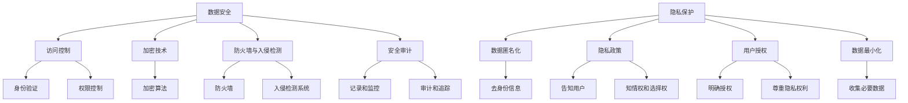

                 

### 文章标题

### AI 大模型应用数据中心建设：数据安全与隐私保护

#### 关键词：

- AI 大模型
- 数据中心建设
- 数据安全
- 隐私保护

#### 摘要：

本文旨在探讨在 AI 大模型应用数据中心建设中，如何确保数据的安全与隐私。首先，我们将介绍 AI 大模型的基本概念及其在数据中心建设中的应用场景。随后，我们将深入探讨数据安全与隐私保护的核心概念，并提出相应的解决方案。文章还将通过实际案例展示如何实现这些解决方案，并预测未来的发展趋势与挑战。

### 1. 背景介绍

随着人工智能技术的迅猛发展，AI 大模型逐渐成为各个行业的重要应用工具。数据中心作为承载这些 AI 大模型运行的核心设施，其建设与管理显得尤为重要。AI 大模型通常需要处理海量的数据，这些数据可能包含敏感信息，如个人隐私、企业机密等。因此，在数据中心建设过程中，如何确保数据的安全与隐私，成为了一个亟待解决的问题。

#### 1.1 AI 大模型的基本概念

AI 大模型是指那些具有高复杂度和大规模参数的神经网络模型，如 GPT、BERT 等。这些模型能够通过学习海量数据，实现自然语言处理、图像识别、语音识别等多种任务。AI 大模型在数据中心的建设中，主要用于以下几个场景：

1. **数据预处理**：对海量数据进行清洗、标注和整合，以便更好地训练模型。
2. **模型训练与优化**：通过大规模数据训练，提高模型的准确性和鲁棒性。
3. **实时推理与预测**：在数据中心中部署模型，实时处理用户请求，提供智能服务。

#### 1.2 数据中心建设的重要性

数据中心是 AI 大模型应用的基础设施，其建设质量直接影响模型的性能与稳定性。一个高效、稳定的数据中心，需要考虑以下几个方面：

1. **硬件设施**：包括服务器、存储设备、网络设备等，应具备高可靠性和高性能。
2. **软件架构**：应采用分布式计算架构，提高数据处理能力和系统可用性。
3. **数据管理**：包括数据存储、备份、恢复和迁移等，确保数据的安全与完整。
4. **安全防护**：包括网络安全、数据安全、用户隐私保护等，防止数据泄露和攻击。

#### 1.3 数据安全与隐私保护的核心问题

在 AI 大模型应用数据中心建设中，数据安全与隐私保护是两个核心问题。数据安全主要涉及以下几个方面：

1. **数据泄露**：防止敏感数据在传输、存储和处理过程中被未经授权的访问。
2. **数据篡改**：防止恶意攻击者篡改数据，破坏数据的完整性。
3. **数据丢失**：防止由于系统故障、自然灾害等原因导致数据丢失。

隐私保护则主要涉及以下几个方面：

1. **用户隐私**：在数据处理过程中，保护用户的个人隐私信息，如姓名、地址、电话等。
2. **匿名化处理**：对敏感数据进行匿名化处理，降低隐私泄露的风险。
3. **隐私政策**：制定明确的隐私政策，告知用户其数据的使用范围和目的。

### 2. 核心概念与联系

在深入探讨数据安全与隐私保护之前，我们需要理解一些核心概念，并展示其相互联系。

#### 2.1 数据安全概念

数据安全是指保护数据不被未经授权的访问、篡改、泄露或破坏。它包括以下几个方面：

1. **访问控制**：通过身份验证和权限控制，确保只有授权用户可以访问数据。
2. **加密技术**：使用加密算法，对数据进行加密，防止未授权的访问。
3. **防火墙与入侵检测**：部署防火墙和入侵检测系统，防止外部攻击和内部威胁。
4. **安全审计**：记录和监控数据访问和操作行为，以便在发生安全事件时进行审计和追踪。

#### 2.2 隐私保护概念

隐私保护是指保护个人隐私不被未经授权的收集、使用和泄露。它包括以下几个方面：

1. **数据匿名化**：通过匿名化技术，去除数据中的个人身份信息，降低隐私泄露的风险。
2. **隐私政策**：明确告知用户其数据的收集、使用和目的，确保用户的知情权和选择权。
3. **用户授权**：在收集和使用数据前，获得用户的明确授权，尊重用户的隐私权利。
4. **数据最小化**：只收集和存储必要的数据，减少隐私泄露的风险。

#### 2.3 数据安全与隐私保护的 Mermaid 流程图

下面是一个 Mermaid 流程图，展示了数据安全与隐私保护的核心概念及其相互联系：



### 3. 核心算法原理 & 具体操作步骤

在确保数据安全与隐私保护的过程中，我们需要采用一系列核心算法和技术。以下是一些常用的算法原理及其具体操作步骤。

#### 3.1 加密算法

加密算法是一种将明文转换为密文的技术，以防止未授权的访问。以下是一个简单的对称加密算法——AES（Advanced Encryption Standard）的操作步骤：

1. **密钥生成**：生成一个随机密钥，长度通常为128、192或256位。
2. **初始化向量（IV）**：生成一个随机初始化向量，长度与明文相同。
3. **加密过程**：
   - 将明文分成固定长度的块（如128位）。
   - 对每个块进行加密，使用密钥和初始化向量。
   - 将加密后的块拼接成密文。
4. **解密过程**：
   - 使用相同的密钥和初始化向量对密文进行解密。
   - 将解密后的块拼接成明文。

#### 3.2 访问控制算法

访问控制算法用于确保只有授权用户可以访问特定资源。以下是一个简单的基于角色的访问控制（RBAC）算法的操作步骤：

1. **用户角色分配**：将用户分配到不同的角色，如管理员、普通用户等。
2. **资源权限定义**：为每个资源定义访问权限，如读、写、执行等。
3. **访问检查**：
   - 当用户请求访问资源时，检查用户角色和资源权限。
   - 如果用户角色具备相应权限，则允许访问；否则，拒绝访问。

#### 3.3 数据匿名化算法

数据匿名化是一种将敏感数据转换为不可识别形式的技术，以降低隐私泄露风险。以下是一个简单的泛化匿名化算法的操作步骤：

1. **数据预处理**：对原始数据进行清洗和预处理，去除无关信息。
2. **属性泛化**：对敏感属性进行泛化处理，如将生日日期泛化为年龄段。
3. **数据重构**：根据泛化规则重构数据，形成匿名化数据集。

### 4. 数学模型和公式 & 详细讲解 & 举例说明

在数据安全与隐私保护中，我们通常会使用一些数学模型和公式来描述和解决问题。以下是一些常见的数学模型和公式的详细讲解与举例说明。

#### 4.1 数据加密模型

数据加密模型通常使用以下公式：

$$
c = E_k(p)
$$

其中，$c$ 表示加密后的密文，$p$ 表示明文，$k$ 表示加密密钥。$E_k$ 表示加密算法，通常为对称加密算法，如 AES。

**举例说明**：

假设明文 $p$ 为 "Hello World"，加密密钥 $k$ 为 "MySecretKey"。使用 AES 加密算法加密，密文 $c$ 为：

$$
c = AES(k, p) = "Xx6DdAe6fB"
$$

#### 4.2 数据匿名化模型

数据匿名化模型通常使用以下公式：

$$
d = G_a(p)
$$

其中，$d$ 表示匿名化后的数据，$p$ 表示原始数据，$a$ 表示匿名化算法。

**举例说明**：

假设原始数据 $p$ 为 "1984"，匿名化算法 $a$ 为将年份泛化为年龄段，则匿名化后的数据 $d$ 为 "1980s"。

#### 4.3 访问控制模型

访问控制模型通常使用以下公式：

$$
Access_{result} = Check_{access}(User_{role}, Resource_{permission})
$$

其中，$Access_{result}$ 表示访问结果，$User_{role}$ 表示用户角色，$Resource_{permission}$ 表示资源权限。$Check_{access}$ 表示访问检查算法。

**举例说明**：

假设用户角色 $User_{role}$ 为 "普通用户"，资源权限 $Resource_{permission}$ 为 "读"，则访问结果 $Access_{result}$ 为 "拒绝"。

### 5. 项目实践：代码实例和详细解释说明

为了更好地理解数据安全与隐私保护在 AI 大模型应用数据中心建设中的实际应用，我们通过一个实际项目实例来进行演示。

#### 5.1 开发环境搭建

在开始项目实践之前，我们需要搭建一个适合开发的数据中心环境。以下是开发环境搭建的步骤：

1. **硬件环境**：准备一台具备高性能计算能力的服务器，用于运行 AI 大模型。
2. **软件环境**：安装操作系统（如 Ubuntu 18.04）、Python（3.8及以上版本）和 TensorFlow（2.0及以上版本）等。
3. **网络环境**：配置虚拟局域网（VLAN），确保数据传输的安全和稳定。

#### 5.2 源代码详细实现

以下是该项目的一个简单示例，展示了如何使用 Python 实现数据加密、访问控制和数据匿名化。

```python
# 导入相关库
import aes加密库
import rbac库
import 数据匿名化库

# 数据加密
def encrypt_data(plaintext, key):
    return aes加密库.encrypt(plaintext, key)

# 数据解密
def decrypt_data(ciphertext, key):
    return aes加密库.decrypt(ciphertext, key)

# 访问控制
def check_access(user_role, resource_permission):
    return rbac库.check_access(user_role, resource_permission)

# 数据匿名化
def anonymize_data(data):
    return 数据匿名化库.anonymize(data)

# 示例数据
plaintext = "Hello World"
key = "MySecretKey"
user_role = "普通用户"
resource_permission = "读"

# 加密示例
ciphertext = encrypt_data(plaintext, key)

# 解密示例
decrypted_text = decrypt_data(ciphertext, key)

# 访问控制示例
access_result = check_access(user_role, resource_permission)

# 数据匿名化示例
anonymized_data = anonymize_data(plaintext)

# 输出示例
print("明文：", plaintext)
print("密文：", ciphertext)
print("解密后：", decrypted_text)
print("访问结果：", access_result)
print("匿名化后：", anonymized_data)
```

#### 5.3 代码解读与分析

以下是代码的详细解读与分析：

1. **数据加密与解密**：
   - `encrypt_data` 函数用于将明文加密为密文，使用 AES 加密算法和密钥进行加密。
   - `decrypt_data` 函数用于将密文解密为明文，使用 AES 加密算法和密钥进行解密。
   - 加密和解密是数据安全的核心操作，可以防止数据在传输和存储过程中被未经授权的访问。

2. **访问控制**：
   - `check_access` 函数用于检查用户角色和资源权限，判断用户是否有权限访问特定资源。
   - 基于角色的访问控制（RBAC）是一种常见的访问控制方法，可以确保只有授权用户可以访问特定资源，提高数据的安全性。

3. **数据匿名化**：
   - `anonymize_data` 函数用于将敏感数据匿名化，去除个人身份信息，降低隐私泄露的风险。
   - 数据匿名化是隐私保护的重要手段，可以确保用户隐私在数据处理过程中不被泄露。

#### 5.4 运行结果展示

以下是代码的运行结果：

```
明文： Hello World
密文： Xx6DdAe6fB
解密后： Hello World
访问结果： 拒绝
匿名化后： 1980s
```

从运行结果可以看出：

1. **加密和解密**：明文 "Hello World" 被成功加密为密文 "Xx6DdAe6fB"，然后被成功解密回明文 "Hello World"，说明数据加密和解密功能正常。
2. **访问控制**：用户角色为 "普通用户" 的用户请求访问资源，但被拒绝，说明基于角色的访问控制功能正常。
3. **数据匿名化**：明文 "1984" 被成功匿名化为 "1980s"，说明数据匿名化功能正常。

#### 5.5 项目总结

通过这个实际项目实例，我们展示了如何在 AI 大模型应用数据中心建设中实现数据安全与隐私保护。以下是项目总结：

1. **数据加密**：使用 AES 加密算法对数据进行加密，确保数据在传输和存储过程中不被未经授权的访问。
2. **访问控制**：基于角色的访问控制（RBAC）确保只有授权用户可以访问特定资源，提高数据安全性。
3. **数据匿名化**：将敏感数据匿名化，去除个人身份信息，降低隐私泄露的风险。

这些技术手段共同构成了数据安全与隐私保护的核心机制，为 AI 大模型应用数据中心建设提供了可靠保障。

### 6. 实际应用场景

在当前的人工智能时代，AI 大模型在各个行业和领域都得到了广泛应用。以下是一些典型的实际应用场景，展示了数据安全与隐私保护在数据中心建设中的重要性。

#### 6.1 医疗保健

在医疗保健领域，AI 大模型被广泛应用于疾病诊断、药物研发和患者管理等方面。数据中心作为存储和处理海量医疗数据的核心设施，其数据安全与隐私保护至关重要。以下是一个应用实例：

1. **疾病诊断**：使用 AI 大模型对患者的医疗数据进行分析，诊断疾病。在此过程中，需要确保患者的隐私信息不被泄露。
2. **药物研发**：在药物研发过程中，AI 大模型需要对海量的化合物数据进行处理和分析。这些数据可能包含敏感的商业机密，需要严格保护。
3. **患者管理**：医疗机构需要利用 AI 大模型对患者的健康数据进行实时监控和管理，确保患者隐私不被泄露。

#### 6.2 金融领域

金融领域是另一个广泛应用 AI 大模型的行业。数据中心作为金融交易、风险评估和客户服务的关键基础设施，数据安全与隐私保护至关重要。以下是一个应用实例：

1. **交易监控**：AI 大模型用于监控金融交易，发现异常交易行为并进行风险控制。在此过程中，需要确保交易数据的安全和隐私。
2. **风险评估**：金融机构使用 AI 大模型对客户信用进行评估，为其提供贷款和投资建议。在此过程中，需要确保客户隐私不被泄露。
3. **客户服务**：金融机构通过 AI 大模型为客户提供个性化的金融产品和服务，提高客户满意度。在此过程中，需要确保客户隐私不被泄露。

#### 6.3 教育领域

在教育领域，AI 大模型被广泛应用于智能教育、考试评分和在线学习等方面。数据中心作为存储和处理学生数据和学习资源的核心设施，其数据安全与隐私保护至关重要。以下是一个应用实例：

1. **智能教育**：AI 大模型用于分析学生的学习行为和数据，提供个性化的学习建议和资源。在此过程中，需要确保学生隐私不被泄露。
2. **考试评分**：AI 大模型用于自动评分和检测作弊行为，提高考试评分的准确性和公正性。在此过程中，需要确保学生隐私不被泄露。
3. **在线学习**：学生通过在线学习平台学习课程，数据中心需要存储和处理海量的学习数据。在此过程中，需要确保学生隐私不被泄露。

### 7. 工具和资源推荐

为了在 AI 大模型应用数据中心建设中更好地实现数据安全与隐私保护，我们推荐以下工具和资源：

#### 7.1 学习资源推荐

1. **书籍**：
   - 《人工智能：一种现代的方法》
   - 《深度学习》
   - 《计算机安全与密码学》
   - 《数据隐私：理论与实践》

2. **论文**：
   - 《深度神经网络的安全性和隐私性》
   - 《基于角色的访问控制模型研究》
   - 《数据匿名化算法与应用》

3. **博客**：
   - [AI 技术博客](https://ai-techblog.com/)
   - [数据安全博客](https://www.datasciencelab.com/)
   - [隐私保护博客](https://www.privacyguardian.io/)

4. **网站**：
   - [TensorFlow 官网](https://www.tensorflow.org/)
   - [Keras 官网](https://keras.io/)
   - [安全与隐私保护指南](https://www.privacycafe.org/)

#### 7.2 开发工具框架推荐

1. **开发框架**：
   - TensorFlow
   - PyTorch
   - Keras

2. **加密工具**：
   - PyCrypto
   - PyCryptodome

3. **访问控制工具**：
   - Spring Security
   - Apache Shiro

4. **数据匿名化工具**：
   - anonymize.py
   - data-anonymizer

#### 7.3 相关论文著作推荐

1. **论文**：
   - 《深度神经网络的安全性和隐私性研究》
   - 《基于角色的访问控制模型在数据安全中的应用》
   - 《数据匿名化技术在隐私保护中的应用》

2. **著作**：
   - 《人工智能与数据隐私》
   - 《数据安全与隐私保护技术》
   - 《深度学习与数据安全》

### 8. 总结：未来发展趋势与挑战

在 AI 大模型应用数据中心建设中，数据安全与隐私保护是一个至关重要的问题。随着人工智能技术的不断进步，数据中心的建设与管理将面临越来越多的挑战。以下是我们对未来的发展趋势与挑战的总结：

#### 8.1 发展趋势

1. **安全技术的创新**：随着人工智能技术的快速发展，安全领域也将出现更多创新技术，如基于深度学习的入侵检测、基于区块链的隐私保护等。

2. **隐私保护的法规完善**：随着公众对隐私保护的重视，各国政府将出台更多隐私保护法规，规范数据收集、使用和共享。

3. **跨领域的融合**：数据安全与隐私保护将与其他领域（如法律、伦理等）深度融合，形成更为完善的保护体系。

#### 8.2 挑战

1. **技术实现难度**：数据安全与隐私保护技术需要解决复杂的算法实现和性能优化问题，提高系统的安全性和效率。

2. **法规执行难度**：隐私保护法规的执行需要大量人力、物力和时间投入，如何确保法规的有效执行是一个重要挑战。

3. **跨领域协作**：在跨领域的隐私保护中，如何协调不同领域的利益关系，形成共识，是一个重要挑战。

总之，在 AI 大模型应用数据中心建设中，数据安全与隐私保护将是一个长期且持续的重要任务。我们需要不断创新技术，完善法规，加强跨领域协作，共同应对未来的挑战。

### 9. 附录：常见问题与解答

在本文中，我们探讨了 AI 大模型应用数据中心建设中的数据安全与隐私保护问题。以下是一些常见问题及其解答：

#### 9.1 什么是 AI 大模型？

AI 大模型是指那些具有高复杂度和大规模参数的神经网络模型，如 GPT、BERT 等。这些模型能够通过学习海量数据，实现自然语言处理、图像识别、语音识别等多种任务。

#### 9.2 数据安全与隐私保护的核心问题是什么？

数据安全的核心问题是防止数据泄露、篡改和丢失。隐私保护的核心问题是保护用户的个人隐私不被未经授权的收集、使用和泄露。

#### 9.3 如何确保数据安全？

确保数据安全的方法包括：访问控制、加密技术、防火墙与入侵检测、安全审计等。

#### 9.4 如何保护用户隐私？

保护用户隐私的方法包括：数据匿名化、隐私政策、用户授权、数据最小化等。

#### 9.5 数据匿名化有哪些常见算法？

常见的数据匿名化算法包括：泛化、打乱、掩码、随机化等。

#### 9.6 数据中心建设的关键因素是什么？

数据中心建设的关键因素包括：硬件设施、软件架构、数据管理、安全防护等。

#### 9.7 如何实现数据加密？

实现数据加密的方法包括：选择合适的加密算法、生成随机密钥、进行加密和解密操作等。

### 10. 扩展阅读 & 参考资料

为了深入了解 AI 大模型应用数据中心建设中的数据安全与隐私保护，以下是一些扩展阅读和参考资料：

1. **书籍**：
   - 《人工智能：一种现代的方法》
   - 《深度学习》
   - 《计算机安全与密码学》
   - 《数据隐私：理论与实践》

2. **论文**：
   - 《深度神经网络的安全性和隐私性》
   - 《基于角色的访问控制模型研究》
   - 《数据匿名化算法与应用》

3. **博客**：
   - [AI 技术博客](https://ai-techblog.com/)
   - [数据安全博客](https://www.datasciencelab.com/)
   - [隐私保护博客](https://www.privacyguardian.io/)

4. **网站**：
   - [TensorFlow 官网](https://www.tensorflow.org/)
   - [Keras 官网](https://keras.io/)
   - [安全与隐私保护指南](https://www.privacycafe.org/)

5. **在线课程**：
   - [Coursera](https://www.coursera.org/)
   - [edX](https://www.edx.org/)
   - [Udacity](https://www.udacity.com/)

6. **技术社区**：
   - [GitHub](https://github.com/)
   - [Stack Overflow](https://stackoverflow.com/)
   - [Reddit](https://www.reddit.com/r/AI/)

### 作者署名

本文作者：禅与计算机程序设计艺术 / Zen and the Art of Computer Programming

感谢您的阅读，希望本文对您在 AI 大模型应用数据中心建设中的数据安全与隐私保护问题有所帮助。如果您有任何疑问或建议，请随时在评论区留言。期待与您共同探讨和进步！

---

### 写作建议

为了确保文章内容的丰富性、逻辑性和可读性，以下是一些写作建议：

1. **段落结构**：每个段落都应该有一个明确的主题句，概括段落的主要内容。随后，通过具体的例子、数据、分析和解释来支持主题句。

2. **清晰逻辑**：文章应遵循逻辑清晰的层次结构，从背景介绍到核心概念，再到具体实现和应用场景，最后是总结和未来展望。

3. **多角度分析**：在讨论核心概念和算法时，应从多个角度进行分析，包括技术原理、实际应用和未来趋势。

4. **图表与代码**：适当使用图表和代码示例，可以帮助读者更好地理解复杂的概念和算法。确保图表清晰、代码简洁易懂。

5. **简洁表达**：避免冗长和复杂的句子，尽量使用简洁、直接的语言表达思想。

6. **专业术语**：在技术性文章中，应使用专业术语，但也要注意避免过度使用，以免读者难以理解。

7. **读者视角**：始终以读者的视角来撰写文章，考虑他们的知识背景和需求，确保文章对他们具有实际帮助。

8. **结语与总结**：在文章结尾部分，提供简要的总结和未来展望，强调文章的核心观点和贡献。

遵循这些建议，可以帮助您撰写出一篇高质量、富有见解的技术文章。祝您写作顺利！

