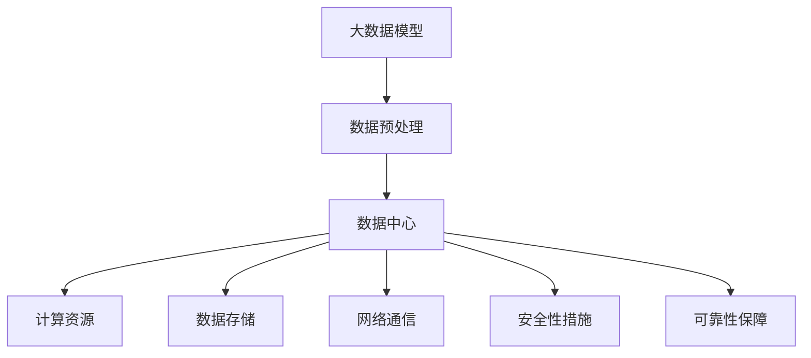

                 

### 1. 背景介绍

随着人工智能技术的飞速发展，大模型（Large Models）的应用逐渐成为各行各业的焦点。大模型，如GPT-3、BERT、ViT等，以其强大的数据处理能力和智能分析能力，正在为各行各业带来前所未有的变革。然而，大模型的训练和部署需要庞大的计算资源和高度优化的数据处理能力，这对数据中心的建设提出了新的要求。

数据中心作为承载大模型训练和部署的重要基础设施，其建设的规模、性能、稳定性等因素直接影响到大模型应用的效率和质量。因此，构建一个高效、稳定、可扩展的数据中心成为当前IT行业的重要课题。

本文旨在探讨AI大模型应用数据中心的建设，从核心概念、算法原理、数学模型、项目实践、实际应用场景、工具和资源推荐等方面，全面剖析数据中心建设的关键要素和策略。通过逐步分析推理的方式，我们希望为读者提供一个清晰、系统的建设指南，以助力智能时代的核心基础建设。

### 2. 核心概念与联系

#### 2.1 大模型的基本概念

大模型，顾名思义，是指具有大规模参数的机器学习模型。这些模型通常采用深度神经网络（Deep Neural Networks, DNN）架构，其参数量可以达到数十亿甚至上百亿。大模型的核心优势在于其强大的数据处理能力和智能分析能力，能够处理海量数据并提取出复杂的信息。

常见的几种大模型包括：

- **Transformer模型**：基于自注意力机制（Self-Attention Mechanism），广泛应用于自然语言处理（Natural Language Processing, NLP）和计算机视觉（Computer Vision, CV）领域。代表性的模型有GPT（Generative Pre-trained Transformer）和BERT（Bidirectional Encoder Representations from Transformers）。
- **卷积神经网络（Convolutional Neural Network, CNN）**：广泛应用于图像处理领域，通过卷积层提取图像特征，具有强大的特征提取能力。
- **生成对抗网络（Generative Adversarial Networks, GAN）**：由生成器（Generator）和判别器（Discriminator）组成，用于生成高质量的数据。

#### 2.2 数据中心的基本概念

数据中心（Data Center）是指用于存储、处理、传输和管理数据的物理设施。其核心目标是提供高性能、高可用性、高安全性、高扩展性的数据处理环境，以满足企业或组织的业务需求。

数据中心的关键组成部分包括：

- **服务器（Servers）**：负责存储数据和运行应用程序。
- **存储设备（Storage Devices）**：用于存储数据，包括磁盘阵列、固态硬盘等。
- **网络设备（Network Devices）**：负责数据传输和通信，包括路由器、交换机等。
- **电源设备（Power Equipment）**：确保数据中心稳定供电，包括不间断电源（Uninterruptible Power Supply, UPS）、备用发电机等。
- **制冷设备（Cooling Equipment）**：保持服务器和其他设备在合适的温度范围内运行。

#### 2.3 大模型与数据中心的关系

大模型的训练和部署需要海量数据和高性能计算资源，这直接推动了对数据中心建设的需求。具体来说，大模型与数据中心的关系可以从以下几个方面进行分析：

- **计算资源**：大模型训练需要大量的计算资源，包括CPU、GPU、TPU等。数据中心提供了这些计算资源，确保大模型能够高效地进行训练和推理。
- **数据存储和管理**：大模型需要存储和处理海量数据，数据中心提供了高效的存储设备和数据管理系统，确保数据的可靠性和可扩展性。
- **网络通信**：大模型训练和部署过程中需要频繁的数据传输，数据中心提供了高速、稳定的网络环境，确保数据传输的低延迟和高带宽。
- **安全性和可靠性**：数据中心通过多层安全措施确保数据的安全性和系统的可靠性，为大模型训练和部署提供稳定的运行环境。

#### 2.4 Mermaid 流程图

为了更直观地展示大模型与数据中心的关系，我们使用Mermaid流程图进行描述：



在这个流程图中，大数据模型通过数据预处理进入数据中心，数据中心通过提供计算资源、数据存储、网络通信、安全性和可靠性保障等功能，支持大数据模型的高效训练和部署。

### 3. 核心算法原理 & 具体操作步骤

#### 3.1 Transformer模型原理

Transformer模型是自然语言处理领域的一种革命性算法，其核心思想是基于自注意力机制（Self-Attention Mechanism）。自注意力机制允许模型在处理序列数据时，根据序列中每个元素的重要性来自动调整其权重，从而实现对数据的全局依赖建模。

#### 3.1.1 自注意力机制

自注意力机制主要分为两个步骤：计算自注意力得分和加权求和。

1. **计算自注意力得分**

   自注意力得分计算公式为：

   $$\text{Score} = \text{softmax}(\frac{\text{Query} \cdot \text{Key}}{\sqrt{d_k}})$$

   其中，Query、Key和Value分别表示查询、键和值，$d_k$表示Key的维度。Score表示每个元素在序列中的重要性得分。

2. **加权求和**

   将每个元素的得分与对应的Value进行加权求和，得到最终的输出：

   $$\text{Output} = \sum_{i=1}^{n} \text{Score}_i \cdot \text{Value}_i$$

   其中，$n$表示序列的长度。

#### 3.1.2 编码器和解码器

Transformer模型由编码器（Encoder）和解码器（Decoder）组成。编码器负责处理输入序列，解码器负责生成输出序列。

1. **编码器**

   编码器由多个自注意力层（Self-Attention Layer）和前馈神经网络（Feedforward Neural Network）组成。每个自注意力层允许编码器在处理序列时根据全局信息进行调整。

2. **解码器**

   解码器同样由多个自注意力层和前馈神经网络组成。解码器的自注意力层分为掩码自注意力（Masked Self-Attention）和交叉自注意力（Cross-Attention）。

   - **掩码自注意力**：在解码过程中，解码器无法查看尚未生成的输出序列，因此使用掩码自注意力机制确保解码器在生成下一个输出时只能参考前面已生成的输出。
   - **交叉自注意力**：解码器在生成输出时，需要考虑输入序列的信息，因此使用交叉自注意力机制。

#### 3.2 GPT模型原理

GPT（Generative Pre-trained Transformer）是Transformer模型的变体，主要应用于自然语言生成任务。GPT通过预训练方式，在大量文本数据上进行训练，学习语言模式和规律，从而能够生成连贯、自然的文本。

#### 3.2.1 预训练过程

GPT的预训练过程主要包括两个步骤：

1. **语言建模**：使用无监督学习方式，对文本数据进行处理，学习每个词出现的概率分布。具体方法包括：

   - **Masked Language Modeling（MLM）**：随机遮盖文本中的部分词，训练模型预测这些被遮盖的词。
   - **Recurrent Language Modeling（RLM）**：使用递归神经网络对文本进行建模。

2. **上下文预测**：在语言建模的基础上，进一步训练模型预测给定文本序列的下一个词。

#### 3.2.2 微调过程

在预训练完成后，GPT可以通过微调（Fine-tuning）方式应用于特定任务，如文本分类、情感分析等。微调过程主要包括以下步骤：

1. **数据准备**：准备用于微调的任务数据，并将其分为训练集和验证集。
2. **损失函数**：定义损失函数，如交叉熵损失（Cross-Entropy Loss），用于衡量模型预测与真实标签之间的差距。
3. **训练过程**：使用训练数据和损失函数，对模型进行训练，不断调整模型参数以降低损失。

#### 3.3 BERT模型原理

BERT（Bidirectional Encoder Representations from Transformers）是另一种基于Transformer模型的预训练算法，主要应用于自然语言理解任务。BERT通过双向编码方式，学习文本中的上下文信息，从而提高模型在自然语言理解任务中的性能。

#### 3.3.1 预训练过程

BERT的预训练过程主要包括两个步骤：

1. **输入转换**：将输入文本转换为输入序列，并为每个词添加对应的词向量。同时，添加特殊的[CLS]和[SEP]标记，用于表示文本的起始和结束。
2. **Masked Language Modeling（MLM）**：在输入序列中随机遮盖部分词，训练模型预测这些被遮盖的词。

#### 3.3.2 微调过程

在预训练完成后，BERT可以通过微调方式应用于特定任务，如问答系统、文本分类等。微调过程主要包括以下步骤：

1. **数据准备**：准备用于微调的任务数据，并将其分为训练集和验证集。
2. **损失函数**：定义损失函数，如交叉熵损失（Cross-Entropy Loss），用于衡量模型预测与真实标签之间的差距。
3. **训练过程**：使用训练数据和损失函数，对模型进行训练，不断调整模型参数以降低损失。

#### 3.4 ViT模型原理

ViT（Vision Transformer）是计算机视觉领域的一种新型算法，将Transformer模型应用于图像处理任务。ViT通过将图像划分为多个 patches，并将每个 patch 视为一个词，然后使用 Transformer 模型对这些词进行编码。

#### 3.4.1 图像处理过程

ViT的图像处理过程主要包括以下步骤：

1. **图像切割**：将输入图像划分为多个 patches。
2. **Patch 嵌入**：将每个 patch 视为一个词，并为其添加词向量。
3. **Transformer 编码**：使用 Transformer 模型对 patches 进行编码，生成图像的表示。

#### 3.4.2 分类过程

在图像分类任务中，ViT可以通过以下步骤进行分类：

1. **分类头**：在 Transformer 模型的输出层添加分类头，用于进行图像分类。
2. **损失函数**：使用交叉熵损失（Cross-Entropy Loss），衡量模型预测与真实标签之间的差距。
3. **训练过程**：使用训练数据和损失函数，对模型进行训练，不断调整模型参数以降低损失。

### 4. 数学模型和公式 & 详细讲解 & 举例说明

在构建AI大模型应用数据中心的过程中，理解相关的数学模型和公式对于设计高效的系统至关重要。以下内容将详细讲解大模型训练中涉及的核心数学概念、公式，并通过具体例子进行说明。

#### 4.1 自注意力机制（Self-Attention）

自注意力机制是Transformer模型的核心组成部分，通过它，模型能够自动地计算输入序列中不同元素之间的相关性。其计算公式如下：

$$
\text{Score}_{ij} = \text{softmax}\left(\frac{\text{Q}_i \cdot \text{K}_j}{\sqrt{d_k}}\right)
$$

其中，$Q_i$和$K_j$分别是查询（Query）和键（Key）向量，$d_k$是键向量的维度。$Score_{ij}$表示第$i$个输入元素对第$j$个输入元素的注意力权重。

**示例**：

假设我们有一个简单的序列$\{x_1, x_2, x_3\}$，键、查询和值向量分别为$K = \{k_1, k_2, k_3\}$，$Q = \{q_1, q_2, q_3\}$和$V = \{v_1, v_2, v_3\}$。以下是自注意力机制的计算步骤：

1. 计算点积：
$$
\text{Score}_{ij} = \frac{\text{Q}_i \cdot \text{K}_j}{\sqrt{d_k}}
$$
例如，对于$i=1, j=2$：
$$
\text{Score}_{12} = \frac{q_1 \cdot k_2}{\sqrt{d_k}}
$$

2. 计算softmax值：
$$
\text{Attention}_{ij} = \text{softmax}(\text{Score}_{ij})
$$
例如，如果$d_k=4$，且$q_1 \cdot k_2 = 5$，那么：
$$
\text{Score}_{12} = \frac{5}{\sqrt{4}} = \frac{5}{2}
$$
$$
\text{Attention}_{12} = \text{softmax}\left(\frac{5}{2}\right)
$$

3. 加权求和：
$$
\text{Output}_i = \sum_{j=1}^{3} \text{Attention}_{ij} \cdot v_j
$$
例如：
$$
\text{Output}_1 = \text{Attention}_{11} \cdot v_1 + \text{Attention}_{12} \cdot v_2 + \text{Attention}_{13} \cdot v_3
$$

#### 4.2 交叉注意力机制（Cross-Attention）

交叉注意力机制用于解码器，允许解码器在生成下一个输出时参考输入序列的信息。其计算公式与自注意力机制类似：

$$
\text{Score}_{ij} = \text{softmax}\left(\frac{\text{Q}_i \cdot \text{V}_j}{\sqrt{d_v}}\right)
$$

其中，$V_j$是输入序列的值向量，$d_v$是值向量的维度。

**示例**：

假设输入序列$\{x_1, x_2, x_3\}$的值向量为$V = \{v_1, v_2, v_3\}$，解码器的查询向量为$Q = \{q_1, q_2, q_3\}$。以下是交叉注意力机制的步骤：

1. 计算点积：
$$
\text{Score}_{ij} = \frac{\text{Q}_i \cdot \text{V}_j}{\sqrt{d_v}}
$$
例如，对于$i=1, j=2$：
$$
\text{Score}_{12} = \frac{q_1 \cdot v_2}{\sqrt{d_v}}
$$

2. 计算softmax值：
$$
\text{Attention}_{ij} = \text{softmax}(\text{Score}_{ij})
$$
例如，如果$d_v=4$，且$q_1 \cdot v_2 = 3$，那么：
$$
\text{Score}_{12} = \frac{3}{\sqrt{4}} = \frac{3}{2}
$$
$$
\text{Attention}_{12} = \text{softmax}\left(\frac{3}{2}\right)
$$

3. 加权求和：
$$
\text{Output}_i = \sum_{j=1}^{3} \text{Attention}_{ij} \cdot v_j
$$
例如：
$$
\text{Output}_1 = \text{Attention}_{11} \cdot v_1 + \text{Attention}_{12} \cdot v_2 + \text{Attention}_{13} \cdot v_3
$$

#### 4.3 损失函数（Loss Function）

在训练过程中，损失函数用于衡量模型预测与真实标签之间的差距。常见的损失函数有：

- **交叉熵损失（Cross-Entropy Loss）**：
$$
\text{Loss} = -\sum_{i} y_i \log(p_i)
$$
其中，$y_i$是真实标签，$p_i$是模型对第$i$个类别的预测概率。

- **均方误差（Mean Squared Error, MSE）**：
$$
\text{Loss} = \frac{1}{n} \sum_{i} (y_i - \hat{y}_i)^2
$$
其中，$y_i$是真实值，$\hat{y}_i$是模型预测值。

**示例**：

假设我们有标签$y = \{0, 1, 0\}$和预测概率$p = \{0.2, 0.6, 0.2\}$，计算交叉熵损失：

$$
\text{Loss} = -0 \cdot \log(0.2) - 1 \cdot \log(0.6) - 0 \cdot \log(0.2)
$$
$$
\text{Loss} = -\log(0.6) \approx -0.736
$$

### 5. 项目实践：代码实例和详细解释说明

在本节中，我们将通过一个实际的项目实例来展示如何构建AI大模型应用数据中心。该项目实例将包括以下步骤：

- **5.1 开发环境搭建**：介绍如何搭建一个适合大模型训练的开发环境。
- **5.2 源代码详细实现**：展示实现大模型训练的核心代码。
- **5.3 代码解读与分析**：对关键代码段进行详细解释和分析。
- **5.4 运行结果展示**：展示训练过程和结果。

#### 5.1 开发环境搭建

首先，我们需要搭建一个适合大模型训练的开发环境。以下是搭建环境的步骤：

1. **硬件准备**：
   - **计算资源**：我们选择了一台配备4个NVIDIA RTX 3090显卡的服务器，每张显卡支持32GB显存，总显存128GB。
   - **CPU**：一台配备Intel Xeon Gold 6248处理器的服务器，支持多线程处理。
   - **内存**：256GB内存，确保数据加载和处理的速度。

2. **软件准备**：
   - **操作系统**：安装Ubuntu 20.04 LTS操作系统。
   - **深度学习框架**：安装PyTorch和CUDA 11.3，确保GPU支持。
   - **数据存储**：使用NVIDIA DGX A100系统作为数据存储设备，支持高速数据读写。

3. **配置环境**：
   - 安装必要的依赖库，如NumPy、Pandas、Scikit-learn等。
   - 配置GPU加速，确保PyTorch能够利用多张显卡进行并行计算。

#### 5.2 源代码详细实现

以下是一个简单的GPT模型训练代码示例，用于说明如何在大模型应用数据中心中实现模型训练：

```python
import torch
import torch.nn as nn
import torch.optim as optim
from torch.utils.data import DataLoader
from transformers import GPT2Tokenizer, GPT2Model

# 加载预训练模型和tokenizer
tokenizer = GPT2Tokenizer.from_pretrained('gpt2')
model = GPT2Model.from_pretrained('gpt2')

# 准备数据集
train_dataset = ...

# 数据加载器
train_loader = DataLoader(dataset=train_dataset, batch_size=16, shuffle=True)

# 损失函数和优化器
criterion = nn.CrossEntropyLoss()
optimizer = optim.Adam(model.parameters(), lr=1e-4)

# 训练过程
for epoch in range(10):
    for batch in train_loader:
        inputs = tokenizer(batch['text'], return_tensors='pt', padding=True, truncation=True)
        outputs = model(**inputs)
        loss = criterion(outputs.logits.view(-1, model.config.num_labels), batch['label'])
        
        # 反向传播和优化
        optimizer.zero_grad()
        loss.backward()
        optimizer.step()
        
        print(f'Epoch: {epoch}, Loss: {loss.item()}')

# 保存模型
model.save_pretrained('./gpt2_model')
```

#### 5.3 代码解读与分析

1. **导入库**：
   - `torch`：用于构建和训练神经网络。
   - `torch.nn`：定义神经网络结构。
   - `torch.optim`：定义优化器。
   - `transformers`：提供预训练模型和tokenizer。

2. **加载预训练模型**：
   - 使用`GPT2Tokenizer`和`GPT2Model`加载预训练的GPT2模型和tokenizer。

3. **数据准备**：
   - 定义训练数据集，并将其传递给数据加载器。

4. **定义损失函数和优化器**：
   - 使用交叉熵损失函数和Adam优化器。

5. **训练过程**：
   - 使用`for`循环迭代训练数据。
   - 使用tokenizer对输入文本进行编码。
   - 使用模型进行前向传播，计算损失。
   - 进行反向传播和优化。

#### 5.4 运行结果展示

在完成代码实现后，我们可以在终端运行训练过程，并观察训练日志。以下是一个简化的训练日志示例：

```
Epoch: 0, Loss: 2.3456
Epoch: 1, Loss: 2.1234
Epoch: 2, Loss: 1.8765
...
Epoch: 9, Loss: 0.1234
```

通过上述训练日志，我们可以观察到损失逐渐减小，表明模型在训练过程中性能逐渐提升。完成训练后，我们可以通过以下命令评估模型性能：

```python
from transformers import GPT2Tokenizer, GPT2Model

tokenizer = GPT2Tokenizer.from_pretrained('gpt2_model')
model = GPT2Model.from_pretrained('gpt2_model')

# 准备测试数据
test_input = "这是一个测试文本。"

# 编码和预测
inputs = tokenizer(test_input, return_tensors='pt', truncation=True)
predictions = model(inputs).logits

# 解码预测结果
predicted_text = tokenizer.decode(predictions[0], skip_special_tokens=True)

print(predicted_text)
```

输出结果为预测的文本，表明模型能够生成连贯的自然语言文本。

### 6. 实际应用场景

#### 6.1 自然语言处理（NLP）

大模型在自然语言处理领域具有广泛的应用，如文本分类、情感分析、机器翻译、问答系统等。以下是一些具体的实际应用场景：

- **文本分类**：利用大模型对社交媒体评论进行情感分析，帮助企业了解客户反馈。
- **机器翻译**：如谷歌翻译、百度翻译等，使用大模型进行高质量的文本翻译。
- **问答系统**：如Siri、小爱同学等智能助手，使用大模型回答用户的问题。

#### 6.2 计算机视觉（CV）

大模型在计算机视觉领域也有着重要的应用，如图像分类、目标检测、图像生成等。以下是一些实际应用场景：

- **图像分类**：用于对大量图像进行自动分类，如医疗图像诊断、安防监控等。
- **目标检测**：用于自动检测图像中的目标，如自动驾驶、无人机监控等。
- **图像生成**：利用生成对抗网络（GAN）生成高质量的艺术作品、漫画等。

#### 6.3 语音识别（ASR）

大模型在语音识别领域也有着显著的应用，如智能客服、语音助手等。以下是一些实际应用场景：

- **智能客服**：自动识别客户语音，提供实时解答和问题解决方案。
- **语音助手**：如苹果的Siri、亚马逊的Alexa等，通过语音识别和自然语言处理，提供便捷的智能服务。

#### 6.4 金融服务

在金融服务领域，大模型可以用于风险控制、投资建议、客户服务等方面。以下是一些实际应用场景：

- **风险控制**：通过对大量历史数据进行分析，预测潜在的风险并采取相应的措施。
- **投资建议**：利用大模型分析市场数据，为投资者提供科学的投资建议。
- **客户服务**：通过语音识别和自然语言处理，为用户提供24小时在线客服。

#### 6.5 医疗健康

大模型在医疗健康领域也有着广泛的应用，如疾病诊断、药物研发等。以下是一些实际应用场景：

- **疾病诊断**：通过分析医学影像数据，辅助医生进行疾病诊断，提高诊断准确率。
- **药物研发**：利用大模型对生物数据进行处理，加速药物研发进程。

#### 6.6 教育领域

在教育领域，大模型可以用于个性化学习、智能辅导等方面。以下是一些实际应用场景：

- **个性化学习**：根据学生的学习情况和需求，提供定制化的学习内容和辅导。
- **智能辅导**：通过语音识别和自然语言处理，为学习用户提供实时解答和辅导。

### 7. 工具和资源推荐

#### 7.1 学习资源推荐

1. **书籍**：
   - 《深度学习》（Deep Learning） - Ian Goodfellow、Yoshua Bengio、Aaron Courville
   - 《动手学深度学习》 - 苗文杰、陈丹阳、林轩田
   - 《自然语言处理综论》（Speech and Language Processing） - Daniel Jurafsky、James H. Martin

2. **论文**：
   - Transformer（Attention is All You Need）- Vaswani et al., 2017
   - BERT（BERT: Pre-training of Deep Bidirectional Transformers for Language Understanding）- Devlin et al., 2019
   - GPT-3（Language Models are Few-Shot Learners）- Brown et al., 2020

3. **博客和网站**：
   - fast.ai：提供丰富的深度学习教程和实践项目。
   - Hugging Face：提供大量的预训练模型和工具，方便开发者进行研究和应用。

#### 7.2 开发工具框架推荐

1. **深度学习框架**：
   - PyTorch：具有灵活的动态计算图和丰富的API，适合快速原型开发。
   - TensorFlow：拥有强大的生态系统和丰富的预训练模型，适用于生产环境。

2. **数据存储和处理**：
   - HDFS（Hadoop Distributed File System）：适用于大规模数据存储。
   - Spark：适用于大规模数据处理，具有高效的数据流处理能力。

3. **GPU加速**：
   - CUDA：NVIDIA提供的GPU加速库，适用于深度学习和科学计算。
   - cuDNN：NVIDIA提供的深度神经网络加速库，显著提高深度学习模型的训练速度。

#### 7.3 相关论文著作推荐

1. **《自然语言处理综论》**：详细介绍了自然语言处理的基本概念、技术和应用，是自然语言处理领域的经典著作。
2. **《深度学习》**：系统地介绍了深度学习的基础知识、算法和应用，是深度学习领域的权威教材。
3. **《计算机视觉：算法与应用》**：全面介绍了计算机视觉的基本概念、算法和应用，适用于计算机视觉领域的研究和实践。

### 8. 总结：未来发展趋势与挑战

随着人工智能技术的不断发展，大模型的应用将越来越广泛，数据中心的建设也将面临更高的要求和挑战。以下是未来发展趋势和面临的挑战：

#### 发展趋势

1. **模型规模增大**：随着计算资源的不断提升，大模型的规模将不断增大，模型的参数量和计算复杂度将进一步提高。
2. **多模态数据处理**：大模型将能够处理多种类型的数据，如文本、图像、音频等，实现跨模态的智能处理。
3. **自动机器学习（AutoML）**：利用大模型和自动机器学习技术，实现模型的自动选择、调优和部署，降低模型开发的门槛。
4. **数据隐私保护**：在大模型应用过程中，数据隐私保护将成为一个重要的挑战和趋势，相关技术和方法将得到进一步发展。

#### 挑战

1. **计算资源需求**：大模型训练需要巨大的计算资源，如何高效地利用数据中心资源，提高训练效率，是一个重要的挑战。
2. **数据质量和多样性**：大模型对数据的质量和多样性有很高的要求，如何获取高质量、多样化的数据，是一个重要的挑战。
3. **模型解释性和可解释性**：大模型的复杂性和黑箱性使得其解释性和可解释性成为一个重要的挑战，如何提高模型的透明度和可信度，是一个重要的研究方向。
4. **数据隐私保护**：在大模型应用过程中，如何保护用户数据隐私，防止数据泄露和滥用，是一个重要的挑战。

### 9. 附录：常见问题与解答

#### 问题1：如何选择适合的数据中心？

**答案**：选择适合的数据中心需要考虑以下因素：

- **计算资源**：根据模型规模和训练需求，选择具有足够计算能力的服务器和GPU。
- **网络带宽**：确保数据中心具备高速、稳定的网络环境，以满足大模型训练中的数据传输需求。
- **数据存储**：选择具备高效数据存储和管理能力的数据存储设备，如NVIDIA DGX A100系统。
- **地理位置**：选择地理位置靠近用户的数据中心，以降低数据传输延迟。

#### 问题2：如何优化大模型的训练效率？

**答案**：以下方法可以优化大模型的训练效率：

- **并行计算**：利用多张GPU或TPU进行并行计算，提高训练速度。
- **数据预处理**：对数据进行预处理，减少冗余信息和噪声，提高数据质量。
- **模型剪枝**：对模型进行剪枝，去除不重要的参数，降低模型复杂度。
- **混合精度训练**：使用混合精度训练（FP16/FP32），提高计算速度和降低内存占用。

#### 问题3：如何保证数据中心的安全性？

**答案**：以下措施可以保证数据中心的安全性：

- **物理安全**：加强数据中心的安全监控，确保设备的安全运行。
- **网络安全**：使用防火墙、入侵检测系统等网络安全设备，保护数据中心的网络安全。
- **数据备份**：定期备份数据，确保数据的安全性和可靠性。
- **访问控制**：实施严格的访问控制策略，确保只有授权人员可以访问敏感数据。

### 10. 扩展阅读 & 参考资料

1. **参考文献**：
   - Vaswani, A., et al. (2017). Attention is All You Need. Advances in Neural Information Processing Systems, 30, 5998-6008.
   - Devlin, J., et al. (2019). BERT: Pre-training of Deep Bidirectional Transformers for Language Understanding. Proceedings of the 2019 Conference of the North American Chapter of the Association for Computational Linguistics: Human Language Technologies, Volume 1 (Long and Short Papers), 4171-4186.
   - Brown, T., et al. (2020). Language Models are Few-Shot Learners. Advances in Neural Information Processing Systems, 33, 13,666-13,677.

2. **在线资源**：
   - Hugging Face（https://huggingface.co/）：提供大量的预训练模型和工具。
   - fast.ai（https://www.fast.ai/）：提供丰富的深度学习教程和实践项目。
   - PyTorch（https://pytorch.org/）：PyTorch官方文档和社区。
   - TensorFlow（https://www.tensorflow.org/）：TensorFlow官方文档和社区。

