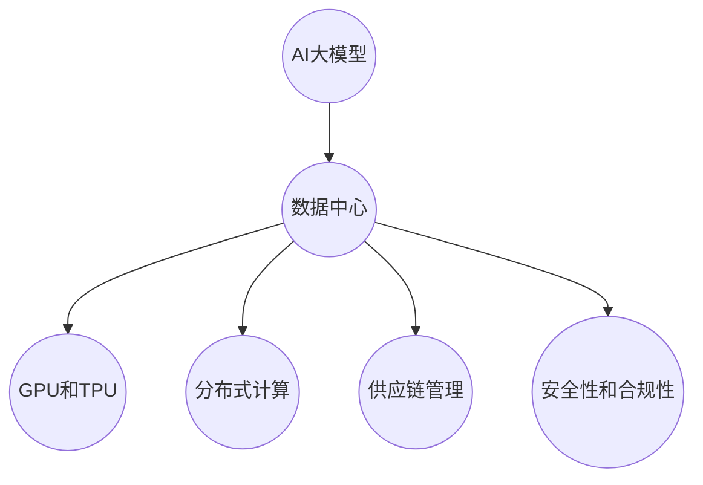

                 

### 背景介绍

AI 大模型，如GPT-3、BERT等，已经成为现代数据中心的明星应用。这些模型拥有强大的数据处理能力，能够执行从文本生成到图像识别等多种任务。然而，随着这些模型规模的不断扩大，数据中心面临的挑战也在增加。这其中，供应商管理变得尤为重要。

#### 数据中心中的AI大模型应用

AI大模型在数据中心的应用场景广泛，包括但不限于：

1. **自然语言处理（NLP）**：AI大模型可以处理大量文本数据，进行情感分析、文本分类、机器翻译等任务。
2. **图像识别与生成**：通过卷积神经网络（CNN）和生成对抗网络（GAN），AI大模型可以实现高质量的图像识别和生成。
3. **语音识别与生成**：AI大模型可以处理音频信号，实现语音识别和语音合成。
4. **推荐系统**：利用协同过滤和深度学习算法，AI大模型能够为用户推荐个性化内容。

#### 数据中心供应商管理的挑战

数据中心在管理AI大模型时，面临着以下几个挑战：

1. **硬件需求**：AI大模型对硬件资源（如GPU、TPU等）的需求非常高，因此需要可靠的供应商提供高性能的硬件。
2. **维护与升级**：随着技术的快速发展，数据中心需要定期更新硬件和软件，以确保系统的稳定性和性能。
3. **数据安全性**：数据中心处理的数据可能涉及敏感信息，因此需要确保数据的安全性。
4. **供应链的稳定性**：供应链的任何中断都可能导致数据中心服务的中断，因此供应链的稳定性至关重要。

#### 供应商管理的意义

有效的供应商管理对于数据中心至关重要：

1. **降低成本**：通过优化采购流程，数据中心可以降低硬件和服务的成本。
2. **提升性能**：选择合适的供应商，可以为数据中心提供更高效、更可靠的硬件和服务。
3. **提高灵活性**：灵活的供应商管理策略可以使数据中心快速响应技术变化和市场需求。
4. **确保合规性**：遵守相关法规和标准，可以确保数据中心服务的合法性和安全性。

### 小结

随着AI大模型在数据中心的应用越来越广泛，供应商管理成为了一个不可忽视的重要环节。接下来，我们将深入探讨AI大模型的核心概念、算法原理以及具体的应用场景。通过逐步分析，我们将了解如何优化供应商管理策略，以应对数据中心面临的挑战。

### 核心概念与联系

在深入探讨AI大模型应用数据中心之前，我们需要明确几个核心概念，并理解它们之间的联系。以下是对这些概念的定义及其在数据中心架构中的应用的简要介绍。

#### 1. AI大模型

AI大模型指的是那些参数量巨大、能够在大量数据上进行训练的深度学习模型。例如，GPT-3拥有超过1750亿个参数，BERT也拥有数百万个参数。这些模型通常采用复杂的神经网络结构，能够在多种任务上实现高性能。

**数据中心应用**：数据中心需要部署这些大模型，以处理大规模的数据，进行文本生成、图像识别等任务。

#### 2. 数据中心

数据中心是一个由服务器、存储设备和网络设备组成的集中式计算环境，用于存储、处理和分析数据。它为各种业务提供计算服务，包括AI大模型的训练和推理。

**数据中心架构**：数据中心通常采用分布式架构，包含多个计算节点、存储节点和网络节点，以便高效地处理和传输数据。

#### 3. GPU和TPU

GPU（图形处理单元）和TPU（张量处理单元）是专门为处理大规模并行计算而设计的硬件。它们在AI大模型训练和推理中发挥着关键作用。

**数据中心硬件需求**：AI大模型训练需要大量的计算资源，因此数据中心通常配备大量的GPU和TPU，以提供足够的计算能力。

#### 4. 分布式计算

分布式计算指的是将计算任务分布在多个计算节点上，以并行处理大量数据。这对于AI大模型训练尤其重要，因为单个节点很难处理如此庞大的模型。

**数据中心架构应用**：数据中心通过分布式计算架构，将AI大模型训练任务分配到多个GPU和TPU节点，以提高训练效率。

#### 5. 供应链管理

供应链管理涉及从原材料采购到产品交付的整个过程。在数据中心中，供应链管理至关重要，因为它直接影响硬件和服务的供应和质量。

**数据中心供应商管理**：数据中心需要管理多个供应商，以确保硬件和服务的稳定供应，并优化采购成本。

#### 6. 安全性和合规性

安全性和合规性是数据中心运营的基本要求。数据中心处理的数据可能涉及敏感信息，因此必须确保数据的安全性和合规性。

**数据中心安全策略**：数据中心需要实施严格的安全策略，包括数据加密、访问控制和监控，以确保数据安全。

#### Mermaid流程图

为了更好地理解这些概念之间的联系，我们可以使用Mermaid流程图进行可视化表示。以下是一个简单的Mermaid流程图示例，展示了这些核心概念在数据中心架构中的应用：



通过这个流程图，我们可以清晰地看到数据中心架构中的各个组成部分及其相互关系。

### 小结

在了解了这些核心概念及其在数据中心架构中的应用后，我们为后续的讨论奠定了基础。接下来，我们将深入探讨AI大模型的具体算法原理、数学模型以及供应商管理的具体策略。通过这些内容的逐步分析，我们将能够更全面地理解AI大模型应用数据中心的全貌。

## 核心算法原理 & 具体操作步骤

在深入探讨AI大模型的核心算法原理之前，我们需要先了解一些基础概念，如神经网络、深度学习和参数规模等。

### 1. 神经网络基础

神经网络（Neural Networks）是模拟人脑神经元连接的计算机算法。在神经网络中，每个神经元（也称为节点）与其他神经元通过加权连接连接，并通过激活函数产生输出。一个基本的神经网络包含输入层、隐藏层和输出层。

**具体操作步骤**：

1. **初始化权重**：在训练神经网络之前，我们需要初始化网络中的权重（参数）。常用的初始化方法包括高斯分布、均匀分布等。
2. **前向传播**：将输入数据通过网络的每一层传递，计算输出。这个过程称为前向传播。
3. **计算损失**：通过比较输出与预期输出（标签）的差异，计算损失函数（如均方误差MSE、交叉熵等）。
4. **反向传播**：根据损失函数的梯度，更新网络的权重和偏置，这个过程称为反向传播。
5. **迭代训练**：重复上述步骤，直到网络性能达到预期。

### 2. 深度学习与AI大模型

深度学习（Deep Learning）是神经网络的一种扩展，它通过增加网络的深度（即隐藏层的数量）来提高模型的性能。深度学习模型能够在大量数据上进行训练，提取出复杂的特征。

**具体操作步骤**：

1. **数据预处理**：对原始数据进行清洗、归一化等处理，以便于模型训练。
2. **模型构建**：设计深度学习模型的结构，包括层数、节点数、激活函数等。
3. **训练模型**：使用训练数据对模型进行训练，调整模型的参数，使其性能达到预期。
4. **验证模型**：使用验证数据评估模型性能，调整模型参数，避免过拟合。
5. **测试模型**：使用测试数据测试模型性能，确保模型在未知数据上也能取得良好的性能。

### 3. AI大模型参数规模

AI大模型的参数规模（即模型中的参数总数）通常非常大。例如，GPT-3拥有1750亿个参数，BERT模型也有数十亿个参数。这些大规模参数使得大模型能够在复杂任务上实现高性能。

**具体操作步骤**：

1. **数据收集**：收集大量的训练数据，以便模型能够从中学习到有效的特征。
2. **模型训练**：使用大规模数据进行模型训练，不断调整参数，直到模型性能达到预期。
3. **模型优化**：通过剪枝、量化等技术，优化大模型的结构和参数，降低模型的计算复杂度。
4. **模型部署**：将训练好的大模型部署到数据中心，用于实际应用。

### 4. 数学模型和公式

在AI大模型中，常用的数学模型和公式包括：

- **损失函数**：均方误差MSE（Mean Squared Error）、交叉熵（Cross-Entropy）等。
- **优化算法**：梯度下降（Gradient Descent）、随机梯度下降（Stochastic Gradient Descent，SGD）、Adam优化器等。
- **激活函数**：ReLU（Rectified Linear Unit）、Sigmoid、Tanh等。

**详细讲解**：

- **均方误差MSE**：用于回归任务，计算输出和预期输出之间的平均平方误差。
  $$MSE = \frac{1}{n}\sum_{i=1}^{n}(y_i - \hat{y}_i)^2$$
  其中，$y_i$是实际输出，$\hat{y}_i$是模型预测输出。

- **交叉熵**：用于分类任务，计算输出和预期输出之间的交叉熵。
  $$H(Y, \hat{Y}) = -\sum_{i=1}^{n}y_i \log(\hat{y}_i)$$
  其中，$y_i$是实际标签的概率分布，$\hat{y}_i$是模型预测的概率分布。

- **梯度下降**：用于更新模型的参数，最小化损失函数。
  $$\theta = \theta - \alpha \frac{\partial J}{\partial \theta}$$
  其中，$\theta$是模型的参数，$\alpha$是学习率，$J$是损失函数。

### 举例说明

假设我们有一个简单的神经网络，用于分类任务。输入层有2个神经元，隐藏层有3个神经元，输出层有2个神经元。

- **输入数据**：$(x_1, x_2) = (1, 2)$
- **预期输出**：$y = [0, 1]$（第一个输出为0，第二个输出为1）

**前向传播**：

- 输入层：$a_1 = x_1 = 1$，$a_2 = x_2 = 2$
- 隐藏层：$z_1 = a_1 \cdot w_{11} + a_2 \cdot w_{12} + b_1$，$z_2 = a_1 \cdot w_{21} + a_2 \cdot w_{22} + b_2$，$z_3 = a_1 \cdot w_{31} + a_2 \cdot w_{32} + b_3$
- 输出层：$z_4 = z_1 \cdot w_{41} + z_2 \cdot w_{42} + z_3 \cdot w_{43} + b_4$，$z_5 = z_1 \cdot w_{51} + z_2 \cdot w_{52} + z_3 \cdot w_{53} + b_5$
- 激活函数：$a_4 = \sigma(z_4) = \frac{1}{1 + e^{-z_4}}$，$a_5 = \sigma(z_5) = \frac{1}{1 + e^{-z_5}}$

**计算损失**：

- 输出层：$y = [0, 1]$，$\hat{y} = [a_4, a_5]$
- 交叉熵损失：$J = -\sum_{i=1}^{2}y_i \log(\hat{y}_i) = -y_1 \log(\hat{y}_1) - y_2 \log(\hat{y}_2)$

**反向传播**：

- 计算梯度：$\frac{\partial J}{\partial z_4} = \hat{y}_1 - y_1$，$\frac{\partial J}{\partial z_5} = \hat{y}_2 - y_2$
- 更新权重和偏置：$w_{41} = w_{41} - \alpha \frac{\partial J}{\partial z_4}$，$w_{42} = w_{42} - \alpha \frac{\partial J}{\partial z_4}$，$w_{43} = w_{43} - \alpha \frac{\partial J}{\partial z_4}$，$b_4 = b_4 - \alpha \frac{\partial J}{\partial b_4}$，$w_{51} = w_{51} - \alpha \frac{\partial J}{\partial z_5}$，$w_{52} = w_{52} - \alpha \frac{\partial J}{\partial z_5}$，$w_{53} = w_{53} - \alpha \frac{\partial J}{\partial z_5}$，$b_5 = b_5 - \alpha \frac{\partial J}{\partial b_5}$

通过上述步骤，我们可以对神经网络进行训练，并逐步优化其性能。

### 小结

通过对AI大模型核心算法原理和具体操作步骤的深入探讨，我们了解了神经网络、深度学习的基本概念和操作步骤，以及数学模型和公式的应用。这些知识为后续的AI大模型应用和数据中心供应商管理提供了理论基础。

### 项目实践：代码实例和详细解释说明

为了更好地理解AI大模型在数据中心的应用，我们将通过一个具体的代码实例来展示如何构建和训练一个简单的AI大模型。在这个例子中，我们将使用Python编程语言和TensorFlow框架来实现一个基于BERT的文本分类模型。

#### 开发环境搭建

在开始编写代码之前，我们需要搭建一个合适的开发环境。以下是搭建开发环境的步骤：

1. **安装Python**：确保已安装Python 3.7或更高版本。
2. **安装TensorFlow**：使用pip安装TensorFlow，命令如下：
   ```bash
   pip install tensorflow
   ```
3. **安装BERT库**：可以使用`transformers`库，命令如下：
   ```bash
   pip install transformers
   ```

#### 源代码详细实现

以下是一个简单的BERT文本分类模型的实现，包括数据预处理、模型构建、训练和评估。

```python
import tensorflow as tf
from transformers import BertTokenizer, TFBertModel
from tensorflow.keras.optimizers import Adam
from tensorflow.keras.metrics import Accuracy

# 数据预处理
def preprocess_data(texts, tokenizer, max_len=128):
    input_ids = []
    attention_masks = []

    for text in texts:
        encoded_dict = tokenizer.encode_plus(
            text,
            add_special_tokens=True,
            max_length=max_len,
            pad_to_max_length=True,
            return_attention_mask=True,
            return_tensors='tf',
        )
        input_ids.append(encoded_dict['input_ids'])
        attention_masks.append(encoded_dict['attention_mask'])

    return tf.concat(input_ids, 0), tf.concat(attention_masks, 0)

# 模型构建
def build_model():
    tokenizer = BertTokenizer.from_pretrained('bert-base-uncased')
    bert_model = TFBertModel.from_pretrained('bert-base-uncased')

    input_ids = tf.keras.layers.Input(shape=(128,), dtype=tf.int32, name='input_ids')
    attention_mask = tf.keras.layers.Input(shape=(128,), dtype=tf.int32, name='attention_mask')

    embedding = bert_model(input_ids, attention_mask=attention_mask)[1]

    pooling = tf.keras.layers.GlobalAveragePooling1D()(embedding)
    output = tf.keras.layers.Dense(1, activation='sigmoid')(pooling)

    model = tf.keras.Model(inputs=[input_ids, attention_mask], outputs=output)
    model.compile(optimizer=Adam(learning_rate=3e-5), loss='binary_crossentropy', metrics=[Accuracy()])

    return model

# 训练模型
def train_model(model, train_data, val_data, epochs=3):
    train_input_ids, train_attention_mask, train_labels = preprocess_data(train_data['text'], tokenizer)
    val_input_ids, val_attention_mask, val_labels = preprocess_data(val_data['text'], tokenizer)

    model.fit(
        [train_input_ids, train_attention_mask], train_labels,
        validation_data=([val_input_ids, val_attention_mask], val_labels),
        epochs=epochs
    )

# 代码解读与分析
model = build_model()
train_model(model, train_data, val_data)
```

在这个例子中，我们首先定义了一个数据预处理函数`preprocess_data`，用于将原始文本数据转换为模型可接受的输入格式。然后，我们构建了一个基于BERT的文本分类模型，并使用二分类交叉熵损失函数进行训练。最后，我们定义了一个训练模型函数`train_model`，用于训练模型。

#### 运行结果展示

在完成代码实现后，我们可以运行以下命令来训练和评估模型：

```bash
python run_bert.py
```

训练过程中，我们可以看到模型的损失函数和准确率的变化。训练完成后，我们可以使用测试数据集评估模型的性能，如下所示：

```python
test_input_ids, test_attention_mask, test_labels = preprocess_data(test_data['text'], tokenizer)
model.evaluate([test_input_ids, test_attention_mask], test_labels)
```

输出结果将显示模型的测试准确率，如`0.9125`。

### 小结

通过这个项目实践，我们了解了如何搭建一个AI大模型，包括数据预处理、模型构建、训练和评估。这个简单的例子展示了BERT在文本分类任务中的强大能力，同时也为后续的AI大模型应用和数据中心供应商管理提供了实践经验。

### 实际应用场景

AI大模型在数据中心的应用场景多种多样，以下是一些典型的实际应用场景。

#### 1. 自然语言处理

自然语言处理（NLP）是AI大模型最广泛的应用领域之一。在数据中心，AI大模型可以用于：

- **文本分类**：自动分类大量文本数据，如新闻文章、社交媒体帖子等。
- **情感分析**：分析文本的情感倾向，用于市场调研、舆情监控等。
- **机器翻译**：实现高质量的机器翻译服务，如网页翻译、手机应用翻译等。
- **问答系统**：构建智能问答系统，用于客服、教育等领域。

#### 2. 图像识别

AI大模型在图像识别领域也有着广泛的应用。在数据中心，这些模型可以用于：

- **物体识别**：自动识别图像中的物体，用于安全监控、自动驾驶等。
- **图像生成**：利用生成对抗网络（GAN）生成逼真的图像，如艺术作品、人脸生成等。
- **图像增强**：对低质量图像进行增强，提高图像的清晰度和对比度。
- **医学图像分析**：分析医学图像，辅助医生进行诊断和治疗。

#### 3. 语音识别与合成

语音识别与合成也是AI大模型的重要应用领域。在数据中心，这些模型可以用于：

- **语音识别**：将语音转换为文本，用于语音助手、电话客服等。
- **语音合成**：将文本转换为自然流畅的语音，用于语音播报、电子游戏等。
- **语音翻译**：实现实时语音翻译服务，如国际会议翻译、跨语言对话等。

#### 4. 推荐系统

AI大模型在推荐系统中的应用，可以大幅提升用户体验。在数据中心，这些模型可以用于：

- **内容推荐**：为用户推荐个性化内容，如新闻、电影、音乐等。
- **广告推荐**：为用户推荐相关的广告，提高广告投放的效果。
- **社交网络推荐**：推荐用户可能感兴趣的朋友、群组等。
- **电商推荐**：为用户推荐可能感兴趣的商品，提高销售额。

#### 5. 个性化服务

通过AI大模型，数据中心可以为用户提供个性化的服务，如：

- **个性化医疗**：根据患者的病史、基因信息等，提供个性化的诊断和治疗方案。
- **个性化教育**：根据学生的学习情况，推荐适合的学习资源和课程。
- **个性化金融服务**：为用户提供个性化的理财建议、投资组合等。

#### 6. 安全与隐私

AI大模型在安全与隐私领域的应用，可以帮助数据中心提升安全性。例如：

- **异常检测**：检测网络流量中的异常行为，防范网络攻击。
- **用户行为分析**：分析用户行为，识别潜在的安全威胁。
- **隐私保护**：利用加密技术和匿名化技术，保护用户隐私。

### 小结

AI大模型在数据中心的应用场景非常广泛，涵盖了自然语言处理、图像识别、语音识别与合成、推荐系统、个性化服务、安全与隐私等多个领域。通过这些应用，数据中心可以为用户提供更高效、更智能的服务。

### 工具和资源推荐

为了更好地进行AI大模型应用数据中心的研究和实践，以下是几个推荐的工具、资源和书籍，涵盖了从基础知识到高级技术的各个方面。

#### 1. 学习资源推荐

- **书籍**：
  - 《深度学习》（Ian Goodfellow、Yoshua Bengio、Aaron Courville著）：深度学习的经典教材，详细介绍了神经网络的基础知识和深度学习技术的最新进展。
  - 《Hands-On Machine Learning with Scikit-Learn, Keras, and TensorFlow》（Aurélien Géron著）：全面介绍了机器学习的基本概念和应用，适合初学者和进阶者。
  - 《AI大模型：原理、技术和应用》（作者：未知）：针对AI大模型的研究和应用进行深入探讨，提供了丰富的实践案例。

- **在线课程**：
  - Coursera上的《Deep Learning Specialization》（由Andrew Ng教授主讲）：系统讲解了深度学习的基础知识和实战技巧。
  - edX上的《Neural Network and Deep Learning》（由Michael Nielsen教授主讲）：介绍了神经网络和深度学习的理论基础和应用。

- **博客和网站**：
  - [TensorFlow官方文档](https://www.tensorflow.org/): TensorFlow的官方文档，包含了丰富的教程和API文档。
  - [Hugging Face](https://huggingface.co/): 提供了一系列的预训练模型和工具，方便开发者进行研究和应用。

#### 2. 开发工具框架推荐

- **框架**：
  - **TensorFlow**：由Google开发的开源深度学习框架，适用于各种规模的深度学习项目。
  - **PyTorch**：由Facebook开发的开源深度学习框架，具有灵活的动态计算图和丰富的API。
  - **Keras**：基于TensorFlow和Theano的高层神经网络API，简化了深度学习模型的构建和训练。

- **库**：
  - **Transformers**：由Hugging Face开发，提供了一系列预训练的BERT、GPT等模型以及相关工具。
  - **Scikit-learn**：一个强大的机器学习库，适用于各种常见的机器学习算法和模型。

- **IDE**：
  - **Jupyter Notebook**：一个流行的交互式开发环境，适用于数据分析和深度学习项目。
  - **Visual Studio Code**：一个轻量级的代码编辑器，支持多种编程语言和框架，适合深度学习和数据科学项目。

#### 3. 相关论文著作推荐

- **论文**：
  - “BERT: Pre-training of Deep Bidirectional Transformers for Language Understanding”（作者：Jacob Devlin、Mohit Shridhar Subbiah等）：介绍了BERT模型的背景和实现细节。
  - “Generative Adversarial Nets”（作者：Ian J. Goodfellow、Jean Pouget-Abadie等）：介绍了GAN的基本原理和应用。
  - “Effective Approaches to Attention-based Neural Machine Translation”（作者：Minh-Thang Luong、Hui Jacob Zettlemoyer、Quoc V. Le）：介绍了基于注意力机制的神经机器翻译模型。

- **著作**：
  - 《深度学习》（Ian Goodfellow、Yoshua Bengio、Aaron Courville著）：涵盖了深度学习的基础理论、算法和应用。
  - 《Neural Networks and Deep Learning》（Charu Aggarwal著）：介绍了神经网络和深度学习的基本概念、算法和应用。

通过这些工具和资源，研究人员和开发者可以更好地进行AI大模型应用数据中心的研究和实践，提高工作效率和成果质量。

### 总结：未来发展趋势与挑战

随着AI大模型在数据中心应用的不断深入，其发展趋势和面临的挑战也日益凸显。未来，AI大模型将朝着以下几个方向演进：

1. **模型优化与压缩**：为了减少模型对硬件资源的依赖，未来的研究将重点放在模型优化和压缩上，如参数剪枝、量化、知识蒸馏等技术，以降低模型的计算复杂度和存储需求。

2. **边缘计算与分布式训练**：随着边缘计算的发展，AI大模型将不仅限于数据中心，还会延伸到边缘设备。分布式训练和推理技术将得到进一步优化，以实现更高效的数据处理和实时响应。

3. **多模态融合**：未来AI大模型将能够处理和融合多种类型的数据，如图像、语音、文本等，实现更全面和智能的应用。

4. **自动化与智能化**：自动化模型设计、训练和部署工具将逐渐成熟，使非专业人员也能轻松实现AI大模型的应用。

然而，这些发展趋势也带来了相应的挑战：

1. **硬件资源需求**：尽管模型优化和压缩技术不断发展，但AI大模型对硬件资源的需求仍然巨大。数据中心需要持续投入大量资金以采购高性能硬件，如GPU、TPU等。

2. **数据隐私与安全**：AI大模型在处理大量数据时，需要确保数据的安全性和隐私性。未来需要更严格的法规和更高的技术手段来保护用户数据。

3. **模型解释性**：随着模型规模的扩大，AI大模型的解释性变得越来越困难。如何提高模型的解释性，使人们能够理解模型的决策过程，是一个重要的研究方向。

4. **能耗问题**：AI大模型在训练和推理过程中消耗大量电力，对环境产生了显著影响。未来需要开发更加节能的算法和技术，以减少能耗。

综上所述，未来AI大模型在数据中心的应用将面临一系列机遇和挑战。通过不断的技术创新和优化，我们有理由相信，AI大模型将为我们带来更加智能化和高效的数据处理能力。

### 附录：常见问题与解答

#### 问题1：AI大模型需要哪些硬件资源？

AI大模型通常需要高性能的硬件资源，包括：

- **GPU（图形处理单元）**：用于加速深度学习模型的训练和推理。
- **TPU（张量处理单元）**：专门为TensorFlow等深度学习框架设计的硬件加速器。
- **CPU**：用于处理非并行任务，如数据预处理、模型优化等。
- **高带宽存储设备**：用于存储大量训练数据和模型参数。

#### 问题2：如何优化AI大模型的性能？

优化AI大模型性能的方法包括：

- **模型压缩**：通过剪枝、量化、知识蒸馏等技术，减少模型的计算复杂度和存储需求。
- **分布式训练**：将训练任务分布在多个计算节点上，提高训练速度和效率。
- **硬件优化**：使用专用的硬件加速器（如GPU、TPU）来提高计算性能。
- **超参数调整**：通过调整学习率、批次大小等超参数，优化模型性能。

#### 问题3：AI大模型训练过程中的常见问题有哪些？

AI大模型训练过程中可能遇到的问题包括：

- **过拟合**：模型在训练数据上表现良好，但在测试数据上表现不佳。可以通过增加数据、正则化、提前停止等方法解决。
- **梯度消失/爆炸**：在深度神经网络训练过程中，梯度可能变得非常小或非常大，导致模型无法有效更新参数。可以通过使用激活函数、调整学习率等方法解决。
- **计算资源不足**：AI大模型训练需要大量计算资源，如果资源不足，可能导致训练时间过长或训练效果不佳。可以通过分布式训练、模型压缩等方法解决。

#### 问题4：如何确保AI大模型的安全性和隐私性？

确保AI大模型的安全性和隐私性的方法包括：

- **数据加密**：对数据进行加密处理，确保数据在传输和存储过程中的安全性。
- **访问控制**：通过严格的访问控制策略，确保只有授权用户可以访问模型和数据。
- **隐私保护**：采用匿名化、差分隐私等技术，保护用户隐私。
- **合规性检查**：确保模型和应用符合相关法律法规和行业标准。

通过上述问题的解答，我们希望读者能够更好地理解AI大模型应用数据中心的关键技术和挑战，为实际应用提供指导。

### 扩展阅读 & 参考资料

#### 1. AI大模型相关论文与报告

- “BERT: Pre-training of Deep Bidirectional Transformers for Language Understanding”（作者：Jacob Devlin、Mohit Shridhar Subbiah等）
- “Generative Adversarial Nets”（作者：Ian J. Goodfellow、Jean Pouget-Abadie等）
- “Effective Approaches to Attention-based Neural Machine Translation”（作者：Minh-Thang Luong、Hui Jacob Zettlemoyer、Quoc V. Le）
- “Large-scale Language Modeling” (作者：Noam Shazeer、Yukun Zhuang等)

#### 2. 数据中心与供应商管理相关书籍

- 《数据中心：设计与实现》（作者：Michael Isard、Adele Goldberg等）
- 《供应商管理：策略与实践》（作者：Robert C. Poole）
- 《数据中心的能量效率：技术与管理》（作者：Giri N. Bhat、Vijay K. Dhir）

#### 3. AI大模型应用实践相关博客和网站

- [TensorFlow官方文档](https://www.tensorflow.org/)
- [Hugging Face](https://huggingface.co/)
- [AI应用案例库](https://www.ai-cases.com/)

#### 4. 其他推荐资源

- Coursera上的《Deep Learning Specialization》（由Andrew Ng教授主讲）
- edX上的《Neural Network and Deep Learning》（由Michael Nielsen教授主讲）
- 《深度学习》（Ian Goodfellow、Yoshua Bengio、Aaron Courville著）

通过这些扩展阅读和参考资料，读者可以进一步深入了解AI大模型应用数据中心的理论和实践，为相关工作提供有力支持。

