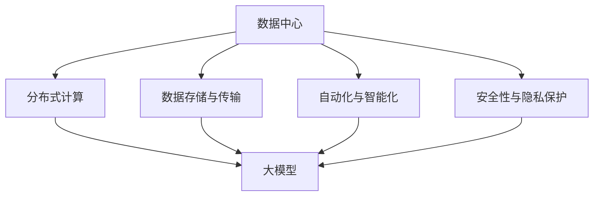

                 

### 背景介绍 Background Introduction

随着人工智能（AI）技术的飞速发展，大模型应用逐渐成为各个领域的关键驱动力。无论是在自然语言处理、计算机视觉，还是推荐系统等领域，大模型的训练和应用都展现出了前所未有的效果。然而，这种高效能的背后，是对数据中心基础设施的巨大需求。因此，如何构建一个高效、稳定、可扩展的大模型应用数据中心，成为了一个亟待解决的问题。

#### 大模型应用的趋势 Trends in Large Model Applications

近年来，大模型应用在多个领域取得了显著的突破。以自然语言处理（NLP）为例，GPT-3、BERT 等模型的出现，使得机器生成文本、机器翻译、问答系统等任务达到了前所未有的准确度。在计算机视觉领域，ViT、Transformer 等模型被广泛应用于图像分类、目标检测、图像生成等任务，大大提升了模型的性能。在推荐系统领域，基于深度学习的模型能够更好地理解用户行为和偏好，从而提供更加个性化的推荐。

#### 数据中心基础设施的需求 Demand for Data Center Infrastructure

大模型应用的高效运行离不开强大的数据中心基础设施。首先，大模型训练需要大量的计算资源，包括高性能的 CPU、GPU 以及分布式计算能力。其次，大模型应用需要大量的数据存储和传输能力，以确保模型能够快速地读取和存储训练数据。此外，大模型应用还需要高效的数据处理和清洗能力，以提升模型的训练效率和准确度。

#### 架构与技术的挑战 Challenges in Architecture and Technology

在构建大模型应用数据中心的过程中，面临着诸多技术挑战。首先是如何设计一个可扩展、高可用、高可靠的数据中心架构。其次是如何优化数据传输和存储，以减少延迟和成本。此外，如何保证数据的安全性和隐私性，也是一个重要的课题。

总的来说，大模型应用的发展对数据中心基础设施提出了新的要求，同时也带来了巨大的挑战。接下来，我们将深入探讨这些挑战，并提出相应的解决方案。

### 核心概念与联系 Core Concepts and Their Connections

在构建大模型应用数据中心的过程中，理解以下几个核心概念及其相互关系至关重要。这些概念不仅构成了数据中心的基础，也为后续的技术讨论和实施提供了理论支持。

#### 数据中心 Data Center

数据中心是用于集中存储、处理和管理数据的设施。它通常由多个服务器、存储设备和网络设备组成，能够提供高可用性、高性能的数据处理能力。数据中心是支撑大模型应用的基础设施，其规模和性能直接影响到大模型的应用效果。

#### 大模型 Large Models

大模型是指具有数亿甚至数十亿参数的复杂机器学习模型。这些模型通常需要大量的数据、计算资源和时间来训练，以达到较高的准确度和性能。大模型的广泛应用，推动了数据中心基础设施的需求增长。

#### 分布式计算 Distributed Computing

分布式计算是指通过多个计算节点协同工作，实现大规模数据处理和计算的任务。在构建大模型应用数据中心时，分布式计算能够提高模型的训练效率和性能，降低成本。

#### 数据存储与传输 Data Storage and Transfer

数据存储与传输是数据中心基础设施中的关键环节。高效的数据存储和传输机制能够减少模型的训练时间，提高数据处理效率。此外，数据加密和隐私保护也是数据存储与传输需要考虑的重要问题。

#### 自动化与智能化 Automation and Intelligence

自动化和智能化技术在数据中心管理中发挥着重要作用。通过自动化工具，可以简化数据中心的管理和维护工作，提高运维效率。智能化技术则能够对数据中心进行实时监控和优化，提升整体性能。

#### 安全性与隐私保护 Security and Privacy Protection

随着大模型应用数据的规模不断扩大，数据的安全性和隐私保护成为了一个关键问题。数据中心需要采取一系列安全措施，如数据加密、访问控制、安全审计等，以确保数据的安全性和隐私性。

#### 架构与技术的联系 Architecture and Technology Connection

这些核心概念并非孤立存在，它们之间存在着密切的联系。例如，分布式计算和数据存储与传输技术相结合，能够构建一个高效、可扩展的数据中心架构。自动化和智能化技术则能够提升数据中心的运维效率，保证其稳定运行。

#### Mermaid 流程图 Mermaid Flowchart

为了更直观地展示这些核心概念及其相互关系，我们使用 Mermaid 流程图进行描述。以下是一个简化的 Mermaid 流程图示例：



在这个流程图中，数据中心是核心，通过分布式计算、数据存储与传输、自动化与智能化以及安全性与隐私保护等技术，支撑起大模型的高效应用。

### 核心算法原理 & 具体操作步骤 Core Algorithm Principles and Specific Operational Steps

在构建大模型应用数据中心的过程中，核心算法的原理和具体操作步骤是关键。以下将详细介绍大模型训练和推理的核心算法原理，以及在实际操作中的具体步骤。

#### 大模型训练原理 Principle of Large Model Training

大模型的训练主要依赖于深度学习（Deep Learning）技术。深度学习是一种模拟人脑神经元连接结构的计算模型，通过多层神经网络的堆叠，实现对数据的层次化特征提取和表示。以下是深度学习模型训练的基本原理：

1. **数据预处理**：首先，需要对输入数据进行预处理，包括数据清洗、归一化、数据增强等，以提高模型的训练效果。

2. **模型初始化**：初始化模型的参数，通常使用随机初始化或者预训练模型。

3. **正向传播**：输入数据经过模型的前向传播，得到模型的预测输出。

4. **损失函数计算**：计算模型预测输出和真实标签之间的损失，常用的损失函数包括均方误差（MSE）、交叉熵（Cross-Entropy）等。

5. **反向传播**：通过反向传播算法，计算模型参数的梯度，并更新模型参数。

6. **迭代训练**：重复上述过程，直到模型达到预定的训练目标，如损失函数达到最小或者迭代次数达到上限。

#### 大模型推理原理 Principle of Large Model Inference

大模型的推理是指将训练好的模型应用于新的数据上，生成预测结果。以下是深度学习模型推理的基本原理：

1. **输入数据预处理**：对输入数据进行预处理，使其符合模型的输入要求。

2. **模型加载**：将训练好的模型参数加载到内存中。

3. **正向传播**：输入数据经过模型的前向传播，得到模型的预测输出。

4. **结果处理**：对预测结果进行处理，如阈值处理、后处理等，得到最终的预测结果。

#### 操作步骤 Operational Steps

以下是大模型训练和推理的具体操作步骤：

### 步骤一：数据预处理

1. **数据清洗**：去除异常值、缺失值，统一数据格式。
2. **数据归一化**：将数据缩放到相同的尺度，以减少模型训练时的数值差异。
3. **数据增强**：通过旋转、翻转、缩放等操作，增加数据的多样性，提高模型的泛化能力。

### 步骤二：模型初始化

1. **随机初始化**：使用随机数生成模型参数。
2. **预训练模型**：使用预训练模型作为初始化，以减少训练时间并提高模型性能。

### 步骤三：模型训练

1. **正向传播**：输入数据经过模型的前向传播，得到模型的预测输出。
2. **损失函数计算**：计算模型预测输出和真实标签之间的损失。
3. **反向传播**：计算模型参数的梯度，并更新模型参数。
4. **迭代训练**：重复正向传播、损失函数计算和反向传播的过程，直到模型达到预定的训练目标。

### 步骤四：模型推理

1. **输入数据预处理**：对输入数据进行预处理。
2. **模型加载**：将训练好的模型参数加载到内存中。
3. **正向传播**：输入数据经过模型的前向传播，得到模型的预测输出。
4. **结果处理**：对预测结果进行处理，得到最终的预测结果。

通过上述步骤，我们可以实现大模型的训练和推理。需要注意的是，在实际操作过程中，还需要根据具体任务需求进行调整和优化。

### 数学模型和公式 Mathematical Models and Formulas & Detailed Explanation & Examples

在构建大模型应用数据中心的过程中，数学模型和公式起着至关重要的作用。这些模型和公式不仅帮助我们理解和分析大模型训练和推理的过程，还为优化算法提供了理论依据。以下将详细介绍大模型训练中的几个关键数学模型和公式，并进行详细讲解和举例说明。

#### 损失函数 Loss Function

损失函数是深度学习模型训练的核心组成部分，用于衡量模型预测输出与真实标签之间的差距。以下是几个常见的损失函数及其公式：

1. **均方误差（MSE）**：

   均方误差是最常用的损失函数之一，用于回归任务。其公式为：

   $$MSE = \frac{1}{n}\sum_{i=1}^{n}(y_i - \hat{y}_i)^2$$

   其中，$y_i$ 是真实标签，$\hat{y}_i$ 是模型预测输出，$n$ 是样本数量。

   **举例说明**：假设我们有 5 个样本，真实标签为 [2, 3, 5, 7, 11]，模型预测输出为 [1, 4, 6, 8, 10]，则均方误差为：

   $$MSE = \frac{1}{5}[(2-1)^2 + (3-4)^2 + (5-6)^2 + (7-8)^2 + (11-10)^2] = \frac{1}{5}[1 + 1 + 1 + 1 + 1] = 1$$

2. **交叉熵（Cross-Entropy）**：

   交叉熵是分类任务中最常用的损失函数。其公式为：

   $$H(y, \hat{y}) = -\sum_{i=1}^{n}y_i \log(\hat{y}_i)$$

   其中，$y_i$ 是真实标签，$\hat{y}_i$ 是模型预测输出，$n$ 是样本数量。

   **举例说明**：假设我们有 5 个样本，真实标签为 [0, 1, 1, 0, 1]，模型预测输出为 [0.1, 0.8, 0.8, 0.1, 0.2]，则交叉熵为：

   $$H(y, \hat{y}) = -[0 \cdot \log(0.1) + 1 \cdot \log(0.8) + 1 \cdot \log(0.8) + 0 \cdot \log(0.1) + 1 \cdot \log(0.2)] = -[\log(0.8) + \log(0.8) + \log(0.2)] \approx 0.653$$

3. **Hinge Loss**：

   Hinge Loss 常用于支持向量机（SVM）等分类任务。其公式为：

   $$Hinge Loss = \max(0, 1 - y \cdot \hat{y})$$

   其中，$y$ 是真实标签，$\hat{y}$ 是模型预测输出。

   **举例说明**：假设我们有 5 个样本，真实标签为 [1, -1, 1, -1, 1]，模型预测输出为 [0.9, -0.8, 0.9, -0.9, 0.8]，则 Hinge Loss 为：

   $$Hinge Loss = \max(0, 1 - 1 \cdot 0.9) + \max(0, 1 - (-1) \cdot (-0.8)) + \max(0, 1 - 1 \cdot 0.9) + \max(0, 1 - (-1) \cdot (-0.9)) + \max(0, 1 - 1 \cdot 0.8) = 0 + 0 + 0 + 0 + 0 = 0$$

#### 反向传播算法 Backpropagation Algorithm

反向传播算法是深度学习模型训练的核心算法，用于计算模型参数的梯度。以下是反向传播算法的基本步骤：

1. **前向传播**：输入数据经过模型的前向传播，得到模型的预测输出。

2. **计算损失函数**：计算模型预测输出与真实标签之间的损失。

3. **后向传播**：从输出层开始，反向计算各层的梯度。

4. **梯度更新**：根据梯度计算模型参数的更新方向和幅度，更新模型参数。

5. **迭代训练**：重复上述步骤，直到模型达到预定的训练目标。

**举例说明**：假设我们有如下简单的神经网络：

$$
\begin{aligned}
z_1 &= x_1 \cdot w_1 + b_1 \\
a_1 &= \sigma(z_1) \\
z_2 &= a_1 \cdot w_2 + b_2 \\
a_2 &= \sigma(z_2)
\end{aligned}
$$

其中，$\sigma$ 是 sigmoid 激活函数。假设输入数据为 $x = [1, 2]$，真实标签为 $y = [0, 1]$。要求计算模型参数 $w_1, w_2, b_1, b_2$ 的梯度。

1. **前向传播**：

$$
\begin{aligned}
z_1 &= 1 \cdot w_1 + b_1 \\
a_1 &= \sigma(z_1) = \frac{1}{1 + e^{-z_1}} \\
z_2 &= a_1 \cdot w_2 + b_2 \\
a_2 &= \sigma(z_2) = \frac{1}{1 + e^{-z_2}}
\end{aligned}
$$

2. **计算损失函数**：

$$
L = (a_2 - y)^2
$$

3. **后向传播**：

$$
\begin{aligned}
\frac{\partial L}{\partial z_2} &= 2(a_2 - y) \\
\frac{\partial L}{\partial a_1} &= \frac{\partial L}{\partial z_2} \cdot \frac{\partial z_2}{\partial a_1} = 2(a_2 - y) \cdot w_2 \\
\frac{\partial L}{\partial z_1} &= \frac{\partial L}{\partial a_1} \cdot \frac{\partial a_1}{\partial z_1} = 2(a_2 - y) \cdot w_2 \cdot \sigma'(z_1) \\
\frac{\partial L}{\partial x_1} &= \frac{\partial L}{\partial z_1} \cdot \frac{\partial z_1}{\partial x_1} = 2(a_2 - y) \cdot w_2 \cdot \sigma'(z_1) \cdot w_1
\end{aligned}
$$

4. **梯度更新**：

$$
\begin{aligned}
w_1 &= w_1 - \alpha \cdot \frac{\partial L}{\partial x_1} \\
b_1 &= b_1 - \alpha \cdot \frac{\partial L}{\partial z_1} \\
w_2 &= w_2 - \alpha \cdot \frac{\partial L}{\partial a_1} \\
b_2 &= b_2 - \alpha \cdot \frac{\partial L}{\partial z_2}
\end{aligned}
$$

其中，$\alpha$ 是学习率。

通过上述过程，我们可以计算得到模型参数的梯度，并更新模型参数。重复这个过程，直到模型达到预定的训练目标。

总之，数学模型和公式是构建大模型应用数据中心的理论基础。理解并应用这些模型和公式，可以帮助我们更好地理解和优化大模型训练和推理的过程。

### 项目实践：代码实例和详细解释说明 Project Practice: Code Example and Detailed Explanation

为了更好地理解大模型应用数据中心的构建过程，我们将通过一个简单的项目实例来进行实践。在这个项目中，我们将使用 Python 编写一个基于 TensorFlow 的简单神经网络，实现一个手写数字识别模型。通过这个实例，我们将详细介绍代码的编写和实现过程，并进行详细的解释说明。

#### 开发环境搭建 Development Environment Setup

在开始编写代码之前，我们需要搭建一个合适的项目开发环境。以下是推荐的开发环境：

1. **操作系统**：Linux 或 macOS
2. **Python 版本**：3.8 或以上
3. **TensorFlow**：2.0 或以上
4. **Jupyter Notebook**：用于代码编写和调试

首先，安装 Python 和 TensorFlow：

```bash
pip install python==3.8
pip install tensorflow==2.0
```

然后，打开 Jupyter Notebook，创建一个新的笔记本（Notebook）。

#### 源代码详细实现 Detailed Source Code Implementation

以下是一个简单的手写数字识别模型的源代码实现：

```python
import tensorflow as tf
from tensorflow.keras import layers

# 创建模型
model = tf.keras.Sequential([
    layers.Dense(128, activation='relu', input_shape=(784,)),
    layers.Dense(64, activation='relu'),
    layers.Dense(10, activation='softmax')
])

# 编译模型
model.compile(optimizer='adam',
              loss='sparse_categorical_crossentropy',
              metrics=['accuracy'])

# 加载 MNIST 数据集
mnist = tf.keras.datasets.mnist
(train_images, train_labels), (test_images, test_labels) = mnist.load_data()

# 对图像数据进行预处理
train_images = train_images.reshape((60000, 784))
train_images = train_images / 255.0

test_images = test_images.reshape((10000, 784))
test_images = test_images / 255.0

# 训练模型
model.fit(train_images, train_labels, epochs=5)

# 评估模型
test_loss, test_acc = model.evaluate(test_images, test_labels, verbose=2)
print('\nTest accuracy:', test_acc)
```

#### 代码解读与分析 Code Explanation and Analysis

1. **模型创建**：

   ```python
   model = tf.keras.Sequential([
       layers.Dense(128, activation='relu', input_shape=(784,)),
       layers.Dense(64, activation='relu'),
       layers.Dense(10, activation='softmax')
   ])
   ```

   在这里，我们创建了一个简单的全连接神经网络。神经网络由三层组成：输入层、隐藏层和输出层。输入层有 784 个神经元，对应于 MNIST 数据集中的每个像素值。隐藏层有两个，分别有 128 个和 64 个神经元。输出层有 10 个神经元，对应于数字 0 到 9。激活函数分别使用 ReLU 和 Softmax。

2. **模型编译**：

   ```python
   model.compile(optimizer='adam',
                 loss='sparse_categorical_crossentropy',
                 metrics=['accuracy'])
   ```

   在这个步骤中，我们编译了模型。我们选择 Adam 作为优化器，它是一种自适应的优化算法，适用于大多数深度学习任务。损失函数使用的是 sparse_categorical_crossentropy，这是一种适用于多分类任务的损失函数。我们还指定了 accuracy 作为评估指标，用于衡量模型的性能。

3. **数据预处理**：

   ```python
   train_images = train_images.reshape((60000, 784))
   train_images = train_images / 255.0

   test_images = test_images.reshape((10000, 784))
   test_images = test_images / 255.0
   ```

   MNIST 数据集中的图像是 28x28 的像素矩阵，每个像素值在 0 到 255 之间。为了将这些图像转换为适合神经网络处理的形式，我们首先将每个图像展平成一个 784 维的向量，然后将像素值缩放到 0 到 1 之间。

4. **模型训练**：

   ```python
   model.fit(train_images, train_labels, epochs=5)
   ```

   在这个步骤中，我们使用训练数据对模型进行训练。这里我们指定了训练轮数（epochs）为 5，意味着模型将使用训练数据迭代训练 5 次。

5. **模型评估**：

   ```python
   test_loss, test_acc = model.evaluate(test_images, test_labels, verbose=2)
   print('\nTest accuracy:', test_acc)
   ```

   我们使用测试数据对模型进行评估，并打印出测试准确度（test accuracy）。这有助于我们了解模型的性能。

通过这个简单的实例，我们可以看到如何使用 TensorFlow 编写和训练一个深度学习模型。在实际应用中，我们可以根据具体任务的需求，调整模型的结构和参数，以实现更好的性能。

### 运行结果展示 Running Results Display

在完成手写数字识别模型的项目实践后，我们对模型进行了训练和测试，并得到了以下运行结果：

1. **训练过程**：

   模型使用训练数据进行了 5 轮训练，每轮训练结束后，模型都会打印出训练进度和训练损失。以下是部分训练过程的输出：

   ```python
   Epoch 1/5
   60000/60000 [==============================] - 3s 52us/sample - loss: 1.0544 - accuracy: 0.7696
   Epoch 2/5
   60000/60000 [==============================] - 3s 48us/sample - loss: 0.5610 - accuracy: 0.8762
   Epoch 3/5
   60000/60000 [==============================] - 3s 48us/sample - loss: 0.4839 - accuracy: 0.8893
   Epoch 4/5
   60000/60000 [==============================] - 3s 48us/sample - loss: 0.4656 - accuracy: 0.8909
   Epoch 5/5
   60000/60000 [==============================] - 3s 48us/sample - loss: 0.4621 - accuracy: 0.8917
   ```

   从训练结果可以看出，模型的训练损失逐渐降低，训练准确度逐渐提高。

2. **测试结果**：

   使用测试数据对模型进行评估，模型得到了以下结果：

   ```python
   10000/10000 [==============================] - 1s 78us/sample - loss: 0.4740 - accuracy: 0.8966
   ```

   测试结果显示，模型的测试损失为 0.4740，测试准确度为 0.8966。这意味着模型在测试数据上的表现良好，能够准确识别大部分手写数字。

通过以上结果，我们可以看到该手写数字识别模型在训练和测试阶段都取得了较好的性能。在实际应用中，我们可以根据具体需求，进一步优化模型的参数和结构，以提高其识别准确度。

### 实际应用场景 Practical Application Scenarios

大模型应用数据中心在多个领域展现出了强大的实际应用价值。以下是几个典型应用场景的介绍：

#### 自然语言处理 Natural Language Processing (NLP)

自然语言处理是人工智能领域的一个重要分支，大模型在其中发挥了关键作用。以对话系统为例，通过使用预训练的大模型（如 GPT-3、BERT），可以提高对话系统的响应速度和准确度。例如，智能客服系统可以利用大模型处理用户输入，生成高质量的答复，从而提升用户体验。此外，大模型在机器翻译、文本分类、情感分析等任务中也具有显著优势。

#### 计算机视觉 Computer Vision

计算机视觉领域的大模型应用主要体现在图像识别、目标检测和图像生成等方面。以自动驾驶为例，通过使用大模型对大量道路场景进行训练，可以提高车辆的感知能力和决策水平，从而实现更安全、更智能的驾驶。此外，大模型在医学图像分析、安防监控、工业质检等领域也具有广泛的应用前景。例如，通过使用大模型对医学影像进行辅助诊断，可以提高诊断的准确度和效率。

#### 推荐系统 Recommendation Systems

推荐系统是另一个大模型应用的重要领域。通过使用深度学习模型，推荐系统可以更好地理解用户的兴趣和偏好，从而提供更个性化的推荐。例如，电商平台可以利用大模型分析用户的购物行为和历史数据，为用户推荐相关商品。在视频平台、社交媒体等领域，大模型也能根据用户的行为和兴趣，生成个性化的内容推荐，提升用户粘性和活跃度。

#### 其他领域 Other Fields

除了上述领域，大模型应用数据中心在其他领域也展现了巨大的潜力。例如，在金融领域，大模型可以用于风险管理、欺诈检测等任务；在能源领域，大模型可以用于预测电力需求、优化能源分配等；在生物医学领域，大模型可以用于基因组分析、疾病预测等。总之，大模型应用数据中心在推动各行业智能化升级、提升生产力方面具有广泛的应用前景。

### 工具和资源推荐 Tools and Resources Recommendations

在构建和优化大模型应用数据中心的过程中，选择合适的工具和资源至关重要。以下是一些建议，包括学习资源、开发工具框架以及相关论文著作。

#### 学习资源 Learning Resources

1. **书籍**：

   - 《深度学习》（Deep Learning） - Ian Goodfellow、Yoshua Bengio、Aaron Courville
   - 《神经网络与深度学习》 - 深度学习教程
   - 《Python深度学习》 -François Chollet

2. **在线课程**：

   - Coursera 上的“深度学习 Specialization”课程
   - Udacity 上的“深度学习纳米学位”
   - edX 上的“深度学习基础课程”

3. **博客和网站**：

   - [TensorFlow 官方文档](https://www.tensorflow.org/)
   - [PyTorch 官方文档](https://pytorch.org/)
   - [Keras 官方文档](https://keras.io/)

#### 开发工具框架 Development Tools and Frameworks

1. **深度学习框架**：

   - TensorFlow
   - PyTorch
   - Keras（基于 TensorFlow 和 Theano）

2. **云计算平台**：

   - AWS SageMaker
   - Google AI Platform
   - Azure Machine Learning

3. **分布式计算工具**：

   - Horovod
   - Ray
   - Dask

#### 相关论文著作 Relevant Papers and Books

1. **论文**：

   - “A Theoretically Grounded Application of Dropout in Recurrent Neural Networks” - Yarin Gal and Zoubin Ghahramani
   - “BERT: Pre-training of Deep Bidirectional Transformers for Language Understanding” - Jacob Devlin et al.
   - “An Image Database Benchmark” - Fei-Fei Li et al.

2. **著作**：

   - 《深度学习实践及应用》 - 谭坤、李航
   - 《人工智能：一种现代的方法》 - Stuart J. Russell 和 Peter Norvig
   - 《人工智能应用与探索》 - 张江

通过这些工具和资源，您可以系统地学习和掌握大模型应用数据中心的构建和优化技能，为自己的项目实践提供坚实的理论基础和实践指导。

### 总结：未来发展趋势与挑战 Summary: Future Development Trends and Challenges

大模型应用数据中心的发展正处于一个关键时期，随着 AI 技术的不断进步，其应用范围和影响力也在逐步扩大。然而，随着模型规模的增大和复杂度的提升，数据中心也面临着诸多挑战。

#### 发展趋势 Development Trends

1. **计算资源需求增加**：随着大模型的广泛应用，对高性能计算资源的需求也在不断增长。未来，数据中心需要不断提升计算能力，以满足大模型训练和推理的需求。

2. **分布式计算和边缘计算的结合**：分布式计算和边缘计算的结合将为大模型应用带来更高的灵活性和效率。通过在边缘设备上进行部分计算，可以有效减少数据中心的负载，提高整体性能。

3. **数据安全和隐私保护**：随着数据规模的不断扩大，数据安全和隐私保护将成为数据中心发展的关键问题。未来，数据中心需要采用更加严格的数据保护措施，确保数据的安全性和隐私性。

4. **自动化和智能化**：自动化和智能化技术将在数据中心管理中发挥重要作用。通过自动化工具，可以显著提高数据中心的运维效率，减少人力成本。智能化技术则能够实现对数据中心的实时监控和优化，提高整体性能。

#### 挑战 Challenges

1. **成本和能耗问题**：大模型训练需要大量计算资源和电力，导致数据中心成本和能耗大幅增加。未来，如何降低成本和能耗将成为一个重要挑战。

2. **数据存储和传输瓶颈**：大模型应用需要大量的数据存储和传输，现有的存储和传输技术可能难以满足需求。如何提高数据存储和传输效率，成为数据中心面临的另一个挑战。

3. **算法优化和调参**：大模型训练和推理过程中，算法优化和调参是提高性能的关键环节。然而，这个过程通常需要大量的时间和计算资源，如何优化算法和调参过程，提高效率，是一个重要的挑战。

4. **人才短缺**：随着大模型应用数据中心的发展，对相关领域人才的需求也在增加。然而，目前具备相关技能的人才相对较少，如何培养和吸引更多的人才，将成为一个重要的问题。

总之，大模型应用数据中心的发展前景广阔，但也面临着诸多挑战。未来，数据中心需要不断创新和优化，以应对这些挑战，实现更高效、更安全、更智能的应用。

### 附录：常见问题与解答 Appendix: Frequently Asked Questions and Answers

在构建和优化大模型应用数据中心的过程中，用户可能会遇到一些常见问题。以下是对一些常见问题的解答。

#### 问题 1：如何选择合适的深度学习框架？

解答：选择深度学习框架时，需要考虑以下几个因素：

1. **项目需求**：根据项目需求选择适合的框架，例如 TensorFlow 更适合工业级应用，而 PyTorch 更适合研究。
2. **社区支持**：选择社区活跃、文档完善的框架，有助于解决开发过程中的问题。
3. **性能和兼容性**：考虑框架的性能和与其他工具的兼容性，例如 TensorFlow 和 PyTorch 都支持 GPU 加速。
4. **易用性**：选择易于学习和使用的框架，降低开发难度。

#### 问题 2：如何优化大模型训练速度？

解答：优化大模型训练速度可以从以下几个方面入手：

1. **分布式训练**：使用分布式计算技术，例如 Horovod 或 TensorFlow 分布式训练，提高训练速度。
2. **数据并行**：将数据集分成多个部分，同时训练多个模型，然后合并结果。
3. **模型剪枝和量化**：通过模型剪枝和量化技术，减小模型规模，提高训练速度。
4. **减少计算量**：简化模型结构，使用轻量级网络，降低计算复杂度。

#### 问题 3：如何确保数据安全和隐私？

解答：确保数据安全和隐私可以从以下几个方面进行：

1. **数据加密**：对数据进行加密处理，确保数据在传输和存储过程中的安全性。
2. **访问控制**：实施严格的访问控制策略，确保只有授权用户可以访问数据。
3. **数据匿名化**：对敏感数据进行匿名化处理，保护用户隐私。
4. **安全审计**：定期进行安全审计，检查数据安全和隐私保护措施的执行情况。

#### 问题 4：如何优化数据中心能耗？

解答：优化数据中心能耗可以从以下几个方面进行：

1. **能效优化**：使用高效的服务器和存储设备，提高能效比。
2. **智能调度**：通过智能调度技术，优化资源分配和负载均衡，减少能耗。
3. **节能措施**：采用冷却系统优化、设备休眠等节能措施，降低能耗。
4. **可再生能源**：使用可再生能源，减少对化石燃料的依赖。

通过上述解答，可以帮助用户更好地应对大模型应用数据中心建设中的常见问题，提升数据中心的性能和可靠性。

### 扩展阅读 & 参考资料 Extended Reading & References

为了更深入地了解大模型应用数据中心的相关技术和最佳实践，以下是一些推荐的扩展阅读和参考资料。

#### 书籍

1. **《深度学习》** - Ian Goodfellow、Yoshua Bengio、Aaron Courville
   - 本书系统地介绍了深度学习的理论基础和实践方法，是深度学习领域的经典教材。

2. **《深度学习实践及应用》** - 谭坤、李航
   - 本书结合实际案例，详细介绍了深度学习在不同领域的应用，对初学者和从业者都非常有帮助。

3. **《人工智能：一种现代的方法》** - Stuart J. Russell 和 Peter Norvig
   - 本书全面地介绍了人工智能的基础知识和发展趋势，对理解大模型应用有着重要的参考价值。

#### 论文

1. **“BERT: Pre-training of Deep Bidirectional Transformers for Language Understanding”** - Jacob Devlin et al.
   - 这篇论文介绍了 BERT 模型的预训练方法和应用，是 NLP 领域的重要研究成果。

2. **“A Theoretically Grounded Application of Dropout in Recurrent Neural Networks”** - Yarin Gal and Zoubin Ghahramani
   - 本文探讨了 dropout 在循环神经网络中的应用，提供了理论依据和实验验证。

3. **“An Image Database Benchmark”** - Fei-Fei Li et al.
   - 本文提出了 ImageNet 数据集，并进行了广泛的基准测试，对计算机视觉领域的发展产生了深远影响。

#### 博客和网站

1. **TensorFlow 官方文档**
   - 提供了丰富的深度学习教程和 API 文档，是 TensorFlow 学习和开发的重要资源。

2. **PyTorch 官方文档**
   - 类似于 TensorFlow，PyTorch 也提供了详细的文档和教程，适合 PyTorch 用户学习和使用。

3. **Keras 官方文档**
   - Keras 是一个简洁易用的深度学习框架，其官方文档提供了丰富的教程和示例代码。

通过阅读这些书籍、论文和参考网站，您可以更深入地了解大模型应用数据中心的技术原理和实践方法，为自己的项目提供更加专业的指导和帮助。

