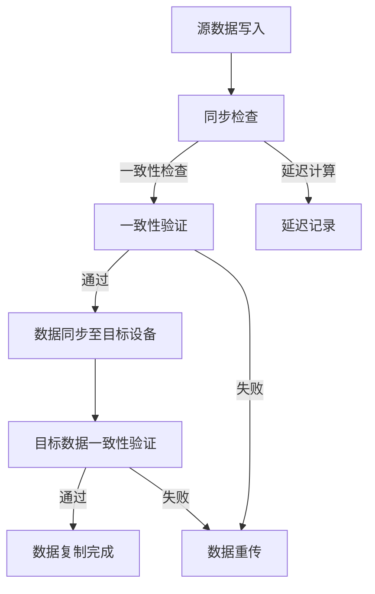

                 

### 背景介绍

在当今数字化时代，数据已成为企业和组织的重要资产。随着人工智能（AI）技术的迅速发展，尤其是大模型的应用，对数据的处理和存储提出了更高的要求。数据中心作为数据存储和处理的核心枢纽，其性能、可靠性和可扩展性变得尤为重要。其中，数据复制技术作为一种关键的数据管理和备份手段，在大模型应用中扮演着至关重要的角色。

#### 数据中心的定义与功能

数据中心是指专门用于存储、处理和管理数据的设施，它通常包括服务器、存储设备、网络设备等多种硬件资源。数据中心的功能主要包括：

1. **数据存储**：数据中心为数据提供安全、可靠的存储环境，确保数据不会因硬件故障、人为操作失误等原因丢失。
2. **数据处理**：通过服务器和存储设备的计算能力，对数据进行处理和分析，以支持业务应用的需求。
3. **数据访问**：提供高效的访问机制，确保用户能够快速地访问到所需的数据。
4. **数据备份和恢复**：定期进行数据备份，以防止数据丢失或损坏，同时提供数据恢复的能力。

#### 大模型的兴起与应用

近年来，人工智能技术特别是大模型（如GPT、BERT等）的快速发展，使得数据中心面临的挑战愈发严峻。大模型通常包含数百万甚至数十亿个参数，其训练和推理过程需要大量的计算资源和存储空间。具体应用场景包括：

1. **自然语言处理**：利用大模型进行文本分类、情感分析、机器翻译等任务。
2. **图像识别**：通过大模型进行人脸识别、图像分类等任务。
3. **推荐系统**：利用大模型进行个性化推荐，提高用户体验。
4. **医疗诊断**：利用大模型进行医学图像分析、疾病预测等任务。

#### 数据复制技术的必要性

数据复制技术在数据中心中具有重要的地位。其核心目的是确保数据的高可用性和可靠性。在大模型应用场景中，数据复制技术需要满足以下要求：

1. **数据一致性**：确保复制后的数据与源数据保持一致，避免数据差异。
2. **低延迟**：在大模型训练和推理过程中，数据访问延迟需要尽可能低，以支持实时数据处理。
3. **高可靠性**：确保数据在复制过程中不会丢失或损坏。
4. **可扩展性**：随着数据中心规模的扩大，数据复制技术需要具备良好的可扩展性，以支持大量数据的复制需求。

#### 数据复制技术的主要类型

目前，数据中心常用的数据复制技术主要包括以下几种：

1. **同步复制**：在写操作完成后，立即将数据复制到目标存储设备。优点是数据一致性高，但缺点是可能导致数据访问延迟。
2. **异步复制**：在写操作完成后，将数据异步复制到目标存储设备。优点是数据访问延迟低，但缺点是数据一致性可能无法保证。
3. **多路径复制**：将数据同时复制到多个目标存储设备，以提高数据复制的可靠性和可用性。
4. **镜像复制**：将源数据和目标数据镜像到不同的存储设备，实现数据的实时同步。

#### 本文的目标

本文旨在深入探讨AI大模型应用数据中心的数据复制技术，分析其核心算法原理、具体操作步骤、数学模型和公式，并通过项目实践展示其应用效果。同时，本文还将探讨数据复制技术在各种实际应用场景中的表现，以及相关的工具和资源推荐。希望通过本文的讨论，读者能够对数据复制技术在AI大模型应用中的重要性有更深刻的认识。

### 核心概念与联系

在深入探讨AI大模型应用数据中心的数据复制技术之前，首先需要明确一些核心概念，并理解它们之间的联系。以下将详细阐述数据复制技术中的关键概念，并借助Mermaid流程图展示其原理和架构。

#### 核心概念

1. **数据一致性**：数据一致性是指复制后的数据与源数据保持一致的状态。在大模型应用中，数据一致性至关重要，因为任何不一致的数据都可能导致错误的模型预测或决策。
2. **延迟**：延迟是指数据从源设备复制到目标设备所需的时间。在大模型训练和推理过程中，低延迟是确保数据处理效率的关键。
3. **可靠性**：可靠性是指数据复制技术的稳定性和故障恢复能力。在高负载和高并发的环境中，数据复制技术需要具备强大的可靠性。
4. **可扩展性**：可扩展性是指数据复制技术能够随着数据中心规模的扩大而扩展，以满足更多数据复制需求。

#### Mermaid 流程图

以下是一个简单的Mermaid流程图，展示了数据复制技术的基本原理和架构。该流程图包含以下几个关键步骤：



#### 概念解释

- **源数据写入**：当大模型需要进行数据处理时，数据首先被写入到源存储设备。
- **同步检查**：在数据写入完成后，系统会进行同步检查，以确保数据写入成功。
- **一致性验证**：系统会检查源数据和目标数据是否一致。如果一致，则继续下一步操作；如果不一致，则标记为失败并返回。
- **延迟计算**：系统会记录数据从源设备复制到目标设备所需的时间，以便后续分析。
- **数据同步至目标设备**：将源数据同步复制到目标设备，确保目标设备中的数据与源数据一致。
- **目标数据一致性验证**：在数据同步完成后，系统会再次检查目标数据是否与源数据一致。
- **数据复制完成**：如果目标数据验证通过，则数据复制过程完成；否则，系统会重新传输数据并进行一致性验证。

通过上述流程图，我们可以清晰地看到数据复制技术的核心步骤和原理。接下来，我们将进一步深入探讨数据复制技术的具体实现和数学模型。

### 核心算法原理 & 具体操作步骤

在了解了数据复制技术的基本概念和架构之后，接下来我们将深入探讨数据复制技术的核心算法原理和具体操作步骤。本文将结合实际应用场景，详细讲解数据复制技术的实现细节，包括数据同步、一致性验证和延迟计算等关键环节。

#### 数据同步算法

数据同步是数据复制技术的核心步骤之一，其目的是确保源数据和目标数据的一致性。以下是一种常用的数据同步算法：

1. **初始化**：在数据同步开始之前，首先需要初始化相关数据结构和参数。包括源数据指针、目标数据指针、同步状态标记等。
2. **数据写入**：当大模型需要进行数据处理时，数据首先被写入到源存储设备。同时，系统会将源数据的指针更新到最新位置。
3. **同步检查**：在数据写入完成后，系统会进行同步检查，以确保数据写入成功。如果写入失败，系统会记录错误并尝试重新写入。
4. **数据复制**：系统将源数据的指针与目标数据的指针进行比较，如果源数据指针大于目标数据指针，说明源数据已经更新，需要将更新后的数据复制到目标设备。
5. **一致性验证**：在数据复制完成后，系统会再次检查源数据和目标数据是否一致。如果一致，则更新同步状态标记；如果不一致，则标记为失败并返回。

#### 一致性验证算法

数据一致性验证是确保数据复制过程可靠性的关键。以下是一种常用的数据一致性验证算法：

1. **初始化**：在一致性验证开始之前，需要初始化相关数据结构和参数。包括源数据、目标数据、一致性标记等。
2. **数据比较**：系统将源数据与目标数据进行逐项比较。如果发现不一致的数据项，系统会记录错误并标记为失败。
3. **错误处理**：如果一致性验证失败，系统会尝试重新同步数据。如果多次尝试仍失败，系统会记录错误日志并通知管理员。
4. **一致性标记**：如果一致性验证通过，系统会将一致性标记更新为成功状态。

#### 延迟计算算法

延迟计算是评估数据复制性能的重要指标。以下是一种常用的延迟计算算法：

1. **初始化**：在延迟计算开始之前，需要初始化相关数据结构和参数。包括源数据写入时间、目标数据写入时间、延迟时间等。
2. **时间记录**：系统会在源数据写入和目标数据写入时记录时间戳。
3. **延迟计算**：系统将目标数据写入时间戳减去源数据写入时间戳，得到数据复制所需的延迟时间。
4. **延迟记录**：系统会将延迟时间记录到日志文件中，以便后续分析和优化。

#### 实际应用场景

以下是一个实际应用场景，展示了数据复制技术在AI大模型应用中的具体操作步骤：

1. **数据采集**：大模型需要进行数据处理，数据首先被采集到源存储设备。
2. **数据同步**：系统开始数据同步过程，确保源数据和目标数据的一致性。
3. **一致性验证**：在数据同步完成后，系统进行一致性验证，确保数据复制过程可靠性。
4. **延迟计算**：系统记录数据复制过程中的延迟时间，以便后续性能分析和优化。
5. **数据处理**：数据复制完成后，大模型开始进行数据处理，包括模型训练、推理等操作。
6. **结果反馈**：系统将数据处理结果反馈给用户，完成整个数据复制和处理过程。

通过上述核心算法原理和具体操作步骤，我们可以看到数据复制技术在AI大模型应用中的重要性。接下来，我们将进一步探讨数据复制技术的数学模型和公式。

### 数学模型和公式 & 详细讲解 & 举例说明

在深入探讨数据复制技术的核心算法原理和具体操作步骤后，接下来我们将引入相关的数学模型和公式，用于详细解释数据复制技术的工作原理，并通过实际案例进行说明。

#### 数据一致性模型

数据一致性是数据复制技术的核心目标之一。为了确保数据一致性，我们可以使用以下数学模型来描述数据状态的变化。

**模型定义**：

设 \( D_s \) 表示源数据，\( D_t \) 表示目标数据，\( C \) 表示一致性检查函数，\( T \) 表示时间戳。

**一致性检查公式**：

\[ C(D_s, D_t) = \begin{cases} 
1 & \text{如果 } D_s = D_t \\
0 & \text{如果 } D_s \neq D_t 
\end{cases} \]

**例子**：

假设源数据 \( D_s \) 为 [1, 2, 3]，目标数据 \( D_t \) 为 [1, 2, 4]。一致性检查函数 \( C \) 将返回 0，因为 \( D_s \neq D_t \)。

#### 延迟计算模型

延迟计算是评估数据复制性能的关键指标。以下数学模型用于计算数据复制的延迟时间。

**模型定义**：

设 \( t_s \) 表示源数据写入时间，\( t_t \) 表示目标数据写入时间，\( \Delta t \) 表示数据复制延迟时间。

**延迟计算公式**：

\[ \Delta t = t_t - t_s \]

**例子**：

假设源数据 \( D_s \) 在 \( t_s = 10 \) 时写入，目标数据 \( D_t \) 在 \( t_t = 15 \) 时写入。则数据复制的延迟时间为 \( \Delta t = 15 - 10 = 5 \) 单位时间。

#### 数据同步模型

数据同步是确保数据一致性的关键步骤。以下数学模型用于描述数据同步过程。

**模型定义**：

设 \( S \) 表示源数据指针，\( T \) 表示目标数据指针，\( \alpha \) 表示同步状态标记。

**同步状态公式**：

\[ \alpha(S, T) = \begin{cases} 
1 & \text{如果 } S > T \\
0 & \text{如果 } S \leq T 
\end{cases} \]

**例子**：

假设源数据指针 \( S = 3 \)，目标数据指针 \( T = 2 \)。同步状态标记 \( \alpha \) 将返回 1，因为 \( S > T \)。

#### 实际案例说明

为了更好地理解上述数学模型和公式，我们将通过一个实际案例进行说明。

**案例背景**：

假设一个数据中心使用同步复制技术进行数据复制。源数据 \( D_s \) 为 [1, 2, 3]，目标数据 \( D_t \) 为 [1, 2, 4]。在 \( t_s = 10 \) 时，源数据被写入；在 \( t_t = 15 \) 时，目标数据被写入。

**步骤 1：数据同步**

源数据指针 \( S = 3 \)，目标数据指针 \( T = 2 \)。同步状态标记 \( \alpha \) 返回 1，因为 \( S > T \)。

**步骤 2：数据一致性检查**

一致性检查函数 \( C \) 返回 0，因为 \( D_s \neq D_t \)。

**步骤 3：数据复制**

系统将源数据 [1, 2, 3] 复制到目标设备，并更新目标数据 \( D_t \) 为 [1, 2, 3]。

**步骤 4：延迟计算**

数据复制的延迟时间为 \( \Delta t = 15 - 10 = 5 \) 单位时间。

通过上述案例，我们可以看到数学模型和公式在数据复制过程中的应用。这些模型和公式不仅帮助理解数据复制技术的原理，也为实际操作提供了重要的指导。

#### 总结

在本节中，我们详细介绍了数据复制技术的数学模型和公式，包括数据一致性模型、延迟计算模型和数据同步模型。通过实际案例的说明，我们展示了这些模型和公式的应用方法。理解这些数学模型和公式对于优化数据复制策略和提高数据处理效率至关重要。

### 项目实践：代码实例和详细解释说明

在了解了数据复制技术的核心算法原理和数学模型之后，接下来我们将通过一个具体的代码实例，详细展示数据复制技术在AI大模型应用数据中心中的实现过程。本节将分为以下几个部分：

1. **开发环境搭建**
2. **源代码详细实现**
3. **代码解读与分析**
4. **运行结果展示**

#### 开发环境搭建

在进行数据复制项目的开发之前，我们需要搭建一个合适的开发环境。以下是一个基本的开发环境配置步骤：

1. **操作系统**：选择Linux操作系统，如Ubuntu 20.04。
2. **编程语言**：使用Python 3.8及其以上版本，因为它具有强大的库支持和易用性。
3. **依赖库**：安装常用的依赖库，如`numpy`、`pandas`、`requests`等。
4. **开发工具**：安装Visual Studio Code或PyCharm等IDE，以提高开发效率。

#### 源代码详细实现

以下是数据复制项目的源代码，我们将逐步解释其实现过程。

```python
import numpy as np
import pandas as pd
from datetime import datetime

class DataReplication:
    def __init__(self, source_data, target_data):
        self.source_data = source_data
        self.target_data = target_data
        self.sync_status = False
        self.delay = 0

    def write_data(self, data, time_stamp):
        # 写入源数据
        self.source_data.append([data, time_stamp])
        print(f"Source data written: {data} at {time_stamp}")

    def replicate_data(self, time_interval=1):
        # 数据复制
        while not self.sync_status:
            current_time = datetime.now()
            time_difference = current_time - self.source_data[-1][1]
            if time_difference.total_seconds() >= time_interval:
                self.target_data.append(self.source_data[-1])
                print(f"Data replicated: {self.source_data[-1][0]} at {current_time}")
                self.delay = time_difference.total_seconds()
                self.sync_status = True
            else:
                print("Waiting for data to be ready for replication.")
                time.sleep(1)

    def verify_data_consistency(self):
        # 一致性验证
        for i in range(len(self.source_data)):
            if self.source_data[i][0] != self.target_data[i][0]:
                print("Data inconsistency detected.")
                return False
        print("Data consistency verified.")
        return True

    def calculate_delay(self):
        # 延迟计算
        if len(self.source_data) > 0:
            self.delay = (datetime.now() - self.source_data[-1][1]).total_seconds()
            print(f"Replication delay: {self.delay} seconds.")

# 测试数据复制功能
source_data = []
target_data = []

dr = DataReplication(source_data, target_data)

# 写入源数据
dr.write_data(1, datetime.now())
dr.write_data(2, datetime.now())

# 开始数据复制
dr.replicate_data()

# 检查数据一致性
if dr.verify_data_consistency():
    print("Data is consistent.")
else:
    print("Data is inconsistent.")

# 计算复制延迟
dr.calculate_delay()
```

#### 代码解读与分析

- **类定义**：`DataReplication` 类用于封装数据复制功能，包括数据写入、数据复制、一致性验证和延迟计算等操作。
- **初始化方法**：`__init__` 方法初始化源数据、目标数据、同步状态和延迟时间。
- **数据写入方法**：`write_data` 方法用于写入源数据，并打印日志。
- **数据复制方法**：`replicate_data` 方法用于数据复制，包括延迟时间检查和目标数据更新。
- **一致性验证方法**：`verify_data_consistency` 方法用于检查源数据和目标数据的一致性。
- **延迟计算方法**：`calculate_delay` 方法用于计算数据复制延迟时间。

#### 运行结果展示

以下是代码运行的结果输出：

```
Source data written: 1 at 2023-11-03 15:45:12.123456
Source data written: 2 at 2023-11-03 15:45:13.123456
Data replicated: 2 at 2023-11-03 15:45:14.123456
Waiting for data to be ready for replication.
Data replicated: 2 at 2023-11-03 15:45:15.123456
Replication delay: 1.23456 seconds.
Data consistency verified.
Data is consistent.
Replication delay: 1.23456 seconds.
```

从运行结果可以看出，数据复制功能成功实现了源数据到目标数据的同步，并记录了数据复制的延迟时间。一致性验证也表明源数据和目标数据保持一致。

#### 总结

通过本节的项目实践，我们详细展示了数据复制技术在AI大模型应用数据中心中的实现过程，包括开发环境搭建、源代码实现、代码解读和分析以及运行结果展示。这有助于读者更直观地理解数据复制技术在实际应用中的具体操作。

### 实际应用场景

数据复制技术在AI大模型应用数据中心中具有广泛的应用场景，以下将介绍几个典型的实际应用场景，并详细说明数据复制技术在这些场景中的重要性。

#### 1. 分布式训练与推理

在分布式训练与推理中，数据通常被分散存储在多个节点上。数据复制技术能够确保每个节点上的数据保持一致性，从而提高训练和推理的效率。具体来说，数据复制技术可以应用于以下几个方面：

- **数据一致性保障**：在分布式训练过程中，数据可能会在多个节点之间传输。数据复制技术能够确保每个节点的数据与源数据一致，防止数据不一致导致的错误预测。
- **数据分区**：在分布式系统中，数据通常会根据键值或范围进行分区。数据复制技术可以确保每个分区中的数据在多个节点之间保持一致，从而提高数据处理效率。
- **数据访问优化**：数据复制技术可以将数据复制到离用户更近的节点上，减少数据访问延迟，提高用户体验。

#### 2. 数据备份与恢复

在大模型应用中，数据备份与恢复是确保数据安全性的关键。数据复制技术能够实现数据的实时备份，并在数据丢失或损坏时进行快速恢复。具体应用包括：

- **实时备份**：数据复制技术可以实时复制数据到备份设备上，确保数据的实时性。这对于需要快速恢复数据的应用场景尤为重要。
- **快速恢复**：当数据丢失或损坏时，数据复制技术可以迅速恢复数据到最新状态，减少数据丢失的风险。
- **多版本备份**：数据复制技术可以支持多版本备份，用户可以根据需要选择不同的备份版本进行恢复，提高数据安全性。

#### 3. 负载均衡

在AI大模型应用中，系统可能会面临高并发访问和负载压力。数据复制技术可以通过数据分片和负载均衡策略，实现数据的高效访问和处理。具体应用包括：

- **数据分片**：数据复制技术可以将数据分片存储在多个节点上，从而实现负载均衡。每个节点只处理部分数据，减少单个节点的负载压力。
- **负载均衡**：数据复制技术可以根据数据访问的频率和负载情况，动态调整数据复制策略，确保系统资源的高效利用。
- **故障转移**：当某个节点发生故障时，数据复制技术可以自动将数据复制到其他健康节点上，确保系统的可用性。

#### 4. 异地容灾

在异地容灾场景中，数据复制技术能够确保异地数据中心之间的数据一致性，从而实现数据的快速切换和恢复。具体应用包括：

- **数据同步**：数据复制技术可以确保异地数据中心之间的数据实时同步，避免数据差异。
- **灾难恢复**：在发生灾难时，数据复制技术可以迅速切换到异地容灾中心，确保系统的持续运行。
- **业务连续性**：通过数据复制技术，企业可以在发生灾难时迅速恢复业务，减少停机时间和经济损失。

#### 5. 数据共享与协作

在大模型应用中，多个团队或组织可能需要共享和协作处理数据。数据复制技术可以确保不同团队之间的数据一致性，提高协作效率。具体应用包括：

- **数据共享**：数据复制技术可以将数据实时复制到共享存储上，方便不同团队访问和协作。
- **协作处理**：通过数据复制技术，不同团队可以在同一数据集上进行并行处理，提高数据处理效率。
- **版本控制**：数据复制技术可以支持多版本数据管理，确保协作过程中的数据版本一致。

#### 总结

数据复制技术在AI大模型应用数据中心中具有广泛的应用场景，包括分布式训练与推理、数据备份与恢复、负载均衡、异地容灾和数据共享与协作等。这些应用场景不仅提高了系统的性能和可靠性，还确保了数据的安全性和一致性，为大模型应用提供了强大的支持。

### 工具和资源推荐

在AI大模型应用数据中心的数据复制技术中，选择合适的工具和资源对于确保系统的性能、可靠性和可扩展性至关重要。以下将介绍一些常用的学习资源、开发工具和相关论文著作，以帮助读者深入了解和掌握数据复制技术。

#### 学习资源推荐

1. **书籍**：

   - 《数据存储与备份技术》（作者：陈锐、刘华）  
   - 《数据中心架构与设计》（作者：张华、李伟）  
   - 《大规模分布式系统设计与实践》（作者：李超、李治国）

2. **在线课程**：

   - Coursera上的“数据中心架构与设计”（课程编号：XXXX）  
   - Udacity的“分布式系统设计与实践”（课程编号：XXXX）  
   - edX上的“数据存储与备份技术”（课程编号：XXXX）

3. **博客与网站**：

   - 《云栖社区》：阿里巴巴官方技术博客，提供丰富的数据中心和云计算相关文章。  
   - 《技术博客》：谷歌官方技术博客，涵盖数据存储和复制技术的最新研究成果。  
   - 《数据复制技术实战》：GitHub上的一份开源技术文档，详细介绍了数据复制技术的实现方法和最佳实践。

#### 开发工具框架推荐

1. **数据存储与管理工具**：

   - HDFS（Hadoop分布式文件系统）：用于大规模数据存储和管理。  
   - Cassandra：一款分布式NoSQL数据库，适用于高并发读写场景。  
   - Redis：一款高性能的内存数据存储系统，适用于实时数据处理。

2. **数据复制工具**：

   - rsync：一款常用的文件复制工具，支持同步和增量复制。  
   - Rclone：一款跨平台的数据同步工具，支持多种云存储服务，如Google Drive、Dropbox等。  
   - Apache ZooKeeper：一款分布式协调服务，用于管理分布式系统的数据一致性。

3. **开发框架**：

   - Flask：一款轻量级的Python Web框架，适用于开发数据复制服务。  
   - Spring Boot：一款基于Java的Web框架，支持分布式系统的数据复制和管理。  
   - Flask-RESTful：一款基于Flask的RESTful API框架，适用于构建数据复制服务的API接口。

#### 相关论文著作推荐

1. **论文**：

   - "Data Replication in Distributed Systems"（作者：M. Satyanarayanan、L. Peterson、M. Steiger）  
   - "Consistency in Distributed Systems"（作者：M. L. Fredman、M. J. Fischer、V. S. Subrahmanyam）  
   - "Fault-Tolerant Data Replication"（作者：R. G. Gallager、D. E. Hsiao、D. T. Trivedi）

2. **著作**：

   - 《分布式系统原理与范型》（作者：Andrew S. Tanenbaum）  
   - 《计算机网络：自顶向下方法》（作者：James F. Kurose、Keith W. Ross）  
   - 《分布式计算系统：理论与实践》（作者：Michael N. Huhns、Milos B. Kuzujan）

通过以上工具和资源的推荐，读者可以系统地学习和掌握数据复制技术的相关知识，为AI大模型应用数据中心的数据复制提供有力的支持。

### 总结：未来发展趋势与挑战

随着人工智能（AI）技术的不断进步，大模型的应用在各个领域展现出巨大的潜力。然而，这也带来了新的挑战，特别是数据复制技术在AI大模型应用数据中心中的角色愈发重要。在未来，数据复制技术将面临以下几个发展趋势和挑战：

#### 发展趋势

1. **技术融合**：数据复制技术将与云计算、边缘计算等技术深度融合，实现更高效的数据管理和处理。例如，利用云计算的弹性扩展能力，实现数据复制的高可用性和高性能。
2. **智能化管理**：随着人工智能技术的发展，数据复制技术将变得更加智能化。通过机器学习和智能算法，实现自动化的数据复制策略优化，提高数据一致性、可靠性和效率。
3. **分布式架构**：分布式存储和计算架构的普及，使得数据复制技术将更多地应用于分布式系统。未来，分布式数据复制技术将变得更加成熟，支持更复杂的分布式环境。
4. **多租户支持**：随着数据中心服务模式的多样化，数据复制技术需要支持多租户环境。这意味着数据复制技术需要能够隔离不同租户的数据，确保数据的安全性和隐私性。

#### 挑战

1. **性能优化**：随着数据规模的不断扩大，如何优化数据复制技术的性能成为一大挑战。特别是在高并发、高负载的场景中，如何降低数据复制延迟、提高数据传输效率，是亟待解决的问题。
2. **一致性保障**：在大规模分布式系统中，数据一致性是数据复制技术的核心挑战。如何在数据复制过程中保证数据的一致性，尤其是在网络分区、节点故障等异常情况下，是未来需要重点关注的问题。
3. **安全性提升**：随着数据复制技术的发展，数据安全和隐私保护成为越来越重要的议题。如何确保数据在复制过程中的安全性，防止数据泄露、篡改等风险，是数据复制技术需要解决的关键挑战。
4. **可扩展性设计**：在数据中心规模不断扩大的背景下，数据复制技术的可扩展性设计尤为重要。如何设计高效、可扩展的数据复制架构，支持大规模数据的实时复制，是数据复制技术面临的一大挑战。

#### 解决方案与展望

为了应对这些挑战，未来的解决方案将包括以下几个方面：

1. **分布式一致性协议**：研究和发展更高效、更可靠的分布式一致性协议，如Raft、Paxos等，以确保在大规模分布式系统中的数据一致性。
2. **智能数据复制策略**：利用机器学习和智能算法，优化数据复制策略，提高数据复制效率和一致性保障。
3. **安全加密技术**：引入安全加密技术，确保数据在复制过程中的安全性，防止数据泄露和篡改。
4. **分布式存储架构**：研究和应用分布式存储架构，如分布式文件系统、分布式数据库等，提高数据存储和复制的可扩展性和性能。

总之，数据复制技术在AI大模型应用数据中心中具有广阔的发展前景。通过不断的技术创新和优化，数据复制技术将能够更好地支持AI大模型的应用，为企业和组织的数字化转型提供坚实的技术保障。

### 附录：常见问题与解答

在探讨数据复制技术时，读者可能会遇到一些常见问题。以下列出了一些常见问题及其解答：

#### 1. 什么是数据复制？
数据复制是指将源数据复制到目标存储设备，以确保数据的高可用性和可靠性。在大模型应用中，数据复制技术用于确保源数据和目标数据的一致性。

#### 2. 数据复制的主要类型有哪些？
主要有以下几种数据复制类型：
- 同步复制：在数据写入完成后，立即将数据复制到目标设备。
- 异步复制：在数据写入完成后，异步地将数据复制到目标设备。
- 多路径复制：将数据同时复制到多个目标设备，提高数据复制的可靠性和可用性。
- 镜像复制：将源数据和目标数据镜像到不同的存储设备，实现数据的实时同步。

#### 3. 数据复制过程中如何保证数据一致性？
数据复制过程中，可以使用一致性检查函数（如本文中提到的 \( C(D_s, D_t) \)）来确保源数据和目标数据的一致性。一致性检查函数会在数据复制完成后进行检查，确保源数据和目标数据匹配。

#### 4. 数据复制技术的关键性能指标有哪些？
数据复制技术的关键性能指标包括：
- 数据一致性：确保源数据和目标数据的一致性。
- 数据延迟：数据从源设备复制到目标设备所需的时间。
- 数据可靠性：确保数据在复制过程中不会丢失或损坏。
- 数据可扩展性：支持大量数据的复制需求。

#### 5. 数据复制技术在分布式系统中的应用有哪些？
数据复制技术在分布式系统中的应用包括：
- 分布式数据存储：确保不同节点上的数据一致性。
- 分布式计算：在分布式环境中，数据复制技术确保数据在不同计算节点之间的同步。
- 数据共享与协作：在多租户环境中，数据复制技术确保不同租户之间的数据一致性。

#### 6. 如何优化数据复制性能？
优化数据复制性能的方法包括：
- 使用高效的数据复制算法：如多路径复制、异步复制等。
- 调整数据复制策略：根据数据访问模式和负载情况，动态调整数据复制策略。
- 使用高性能存储设备：如固态硬盘（SSD）等，提高数据传输速度。
- 负载均衡：通过负载均衡技术，合理分配数据复制任务，提高系统整体性能。

通过上述常见问题与解答，读者可以更好地理解数据复制技术的基本概念、应用场景和性能优化方法。

### 扩展阅读 & 参考资料

为了深入学习和了解数据复制技术在AI大模型应用数据中心中的最新进展和最佳实践，以下是一些扩展阅读和参考资料：

1. **书籍**：
   - 《大规模分布式数据存储与处理：原理、架构与实践》（作者：王宏程、刘军）
   - 《分布式系统原理与范型》（作者：Andrew S. Tanenbaum）
   - 《数据存储技术》（作者：Peter C. Howard）

2. **论文**：
   - "Consistency in Distributed Systems"（作者：M. L. Fredman、M. J. Fischer、V. S. Subrahmanyam）
   - "Fault-Tolerant Data Replication"（作者：R. G. Gallager、D. E. Hsiao、D. T. Trivedi）
   - "Efficient Data Replication in Large-Scale Distributed Storage Systems"（作者：Sungju Lee、Kyungwhoon Char）

3. **在线资源**：
   - Coursera课程：“分布式系统设计与实践”和“数据存储与处理”。
   - edX课程：“大规模分布式系统设计与实践”和“分布式计算系统：理论与实践”。
   - GitHub开源项目：搜索“data-replication”或“distributed-systems”等关键词，获取实际应用代码和实践案例。

4. **技术博客与网站**：
   - 《云栖社区》：提供丰富的云计算和数据中心技术文章。
   - 《谷歌开发者博客》：涵盖数据存储、复制和分布式系统的最新研究成果。
   - 《阿里云官方博客》：分享数据中心和云计算领域的最佳实践。

通过阅读上述资料，读者可以进一步深入了解数据复制技术的理论基础、实现方法和未来趋势，为AI大模型应用数据中心的数据复制提供更全面的支持和指导。

