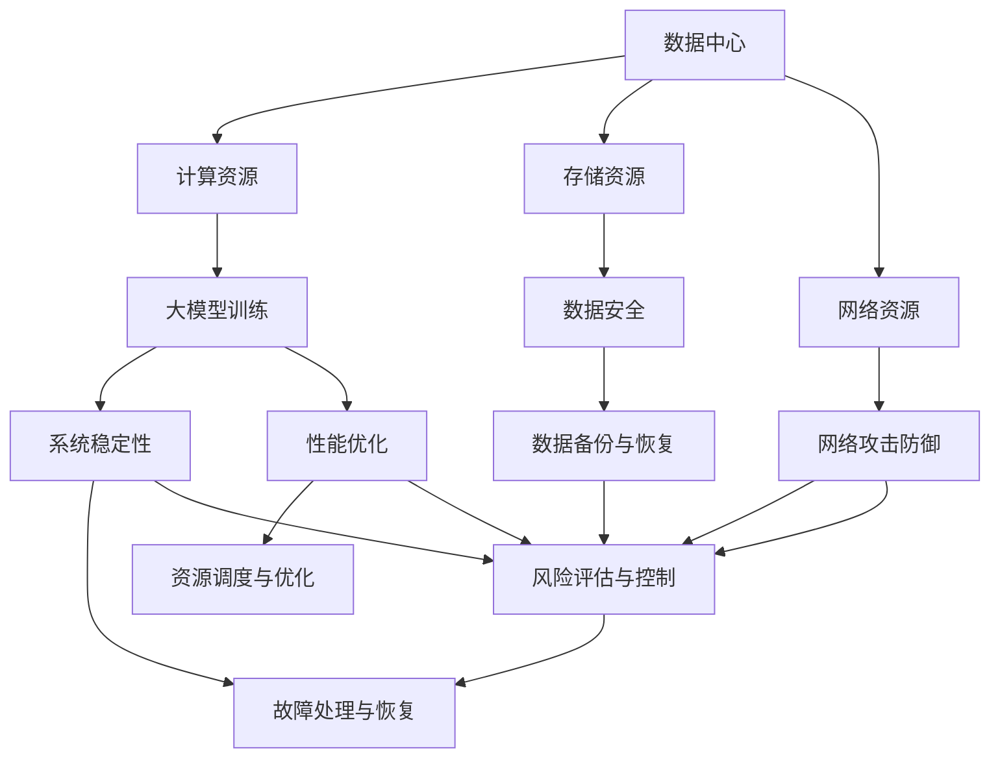

                 

### 1. 背景介绍

随着人工智能（AI）技术的飞速发展，大模型应用已经逐渐成为各个行业的主流。大模型，通常指的是具有数百亿甚至千亿参数的深度学习模型，这些模型在图像识别、自然语言处理、语音识别等多个领域展现出了强大的性能。然而，大模型的应用也带来了一系列新的挑战，尤其是数据中心的风险管理问题。

在传统的数据中心管理中，我们已经面临着数据安全、系统稳定性和性能优化等一系列问题。随着大模型的应用，这些问题变得愈发复杂和严峻。首先，大模型通常需要巨大的计算资源和存储资源，这给数据中心的资源配置带来了巨大压力。其次，大模型训练和推理过程中可能会出现各种不可预测的问题，如数据泄露、模型过拟合等，这些问题一旦发生，将会对业务造成严重的负面影响。

此外，大模型的训练和部署过程往往涉及大量的数据处理和传输，这也增加了网络攻击和数据泄露的风险。例如，攻击者可能会利用训练数据中的敏感信息进行恶意攻击，或者通过网络传输过程中的漏洞窃取数据。因此，如何在确保大模型高效运行的同时，保障数据中心的安全性和稳定性，成为了一个亟待解决的问题。

本文将围绕大模型应用数据中心的风险管理展开讨论，通过逐步分析核心概念、算法原理、数学模型、实际应用和未来发展趋势等方面，旨在为业界提供一份全面的技术指南，帮助读者更好地理解和应对大模型应用中的风险管理挑战。

### 2. 核心概念与联系

为了深入探讨大模型应用数据中心的风险管理问题，我们首先需要明确几个核心概念，并了解它们之间的相互关系。以下是本文中涉及的一些关键概念：

#### 数据中心（Data Center）

数据中心是用于集中存储、处理和传输数据的物理设施。它通常由服务器、存储设备、网络设备和制冷系统等组成。数据中心的设计和管理直接影响到其安全性和稳定性。

#### 大模型（Large-scale Model）

大模型指的是参数规模达到数百亿甚至千亿级别的深度学习模型。这些模型通常用于图像识别、自然语言处理和语音识别等任务，具有强大的性能和广泛的应用前景。

#### 计算资源（Computational Resources）

计算资源包括CPU、GPU、FPGA等硬件设备，以及相关的软件和中间件。在大模型应用中，计算资源的需求量通常非常巨大，因此合理分配和调度这些资源成为关键。

#### 存储资源（Storage Resources）

存储资源包括硬盘、固态硬盘和分布式文件系统等。在大模型应用中，存储资源的需求同样非常庞大，特别是对于需要保存大量训练数据和模型参数的场景。

#### 网络资源（Network Resources）

网络资源包括数据中心内部的局域网和与外部网络的连接。在大模型应用中，网络资源的稳定性直接影响到模型的训练和推理速度。

#### 风险管理（Risk Management）

风险管理是一种系统化的方法，旨在识别、评估和应对可能影响业务连续性和安全性的风险。在大模型应用数据中心中，风险管理尤为重要，因为它关系到数据中心的稳定性、安全性和业务绩效。

#### 数据安全（Data Security）

数据安全涉及防止数据泄露、篡改和破坏的措施。在大模型应用中，数据安全尤为重要，因为大模型通常处理敏感的个人信息和企业数据。

#### 系统稳定性（System Stability）

系统稳定性指的是数据中心在运行过程中保持稳定的能力。在大模型应用中，系统稳定性直接影响到模型的训练效率和业务连续性。

#### 性能优化（Performance Optimization）

性能优化是指通过技术手段提高数据中心的处理速度和响应时间。在大模型应用中，性能优化尤为重要，因为它关系到模型的训练和推理效率。

#### Mermaid 流程图

为了更直观地展示这些核心概念之间的相互关系，我们使用Mermaid流程图来描述数据中心在大模型应用中的风险管理体系。以下是一个简单的示例：



在这个流程图中，我们可以看到，数据中心的核心组成部分（计算资源、存储资源、网络资源）与风险管理的关键要素（数据安全、系统稳定性、性能优化）紧密相连。这些要素相互影响，共同构成了一套完整的风险管理体系。

通过理解这些核心概念及其相互关系，我们为后续章节的深入讨论奠定了基础。在接下来的部分，我们将进一步探讨大模型算法原理和具体操作步骤，以便更好地理解大模型应用数据中心的风险管理挑战。

### 3. 核心算法原理 & 具体操作步骤

在深入探讨大模型应用数据中心的风险管理之前，我们有必要了解大模型的核心算法原理和具体操作步骤。这些算法和步骤不仅决定了大模型的性能，而且直接影响到数据中心的风险管理策略。

#### 深度学习（Deep Learning）

深度学习是一种基于多层神经网络的机器学习技术，通过模拟人脑的神经网络结构，实现对复杂数据的自动特征学习和模式识别。在大模型应用中，深度学习算法是核心，其主要过程包括以下步骤：

1. **数据预处理（Data Preprocessing）**：在深度学习过程中，数据的预处理是至关重要的一步。它包括数据清洗、归一化、数据增强等操作，以确保输入数据的质量和一致性。

2. **模型构建（Model Building）**：构建深度学习模型包括选择合适的网络架构、初始化权重和激活函数等。常见的网络架构有卷积神经网络（CNN）、循环神经网络（RNN）和Transformer等。

3. **训练（Training）**：模型训练是通过反向传播算法，不断调整模型的参数，使其在训练数据上的表现达到最优。训练过程中，通常使用梯度下降法、Adam优化器等来加速收敛。

4. **评估与优化（Evaluation and Optimization）**：在模型训练完成后，需要通过验证集和测试集对模型进行评估，以确保其泛化能力。评估指标包括准确率、召回率、F1值等。优化过程则通过调整模型参数和超参数，进一步提升模型性能。

#### 大模型训练步骤

为了具体说明大模型训练的过程，我们以下以一个常见的深度学习任务——图像分类为例，介绍大模型训练的详细步骤：

1. **数据集划分（Data Splitting）**：首先，将图像数据集划分为训练集、验证集和测试集。通常，训练集用于模型的训练，验证集用于调整模型参数，测试集用于最终评估模型性能。

2. **数据预处理**：对训练集和验证集进行数据清洗、归一化和数据增强等操作。例如，对图像进行随机裁剪、翻转和色彩调整等，以增加模型的鲁棒性。

3. **模型构建**：选择一个合适的网络架构，如ResNet、VGG等，并初始化模型参数。可以采用预训练模型，如在ImageNet上预训练的ResNet-50，然后进行微调。

4. **模型训练**：使用训练集数据对模型进行训练，通过反向传播算法不断调整模型参数。训练过程中，可以监控训练集和验证集的性能，以调整学习率和其他超参数。

5. **评估与优化**：在模型训练完成后，使用验证集对模型进行评估，通过调整模型参数和超参数，如学习率、批次大小等，优化模型性能。

6. **测试集评估**：最后，使用测试集对模型进行评估，以验证模型的泛化能力和性能。

#### 大模型推理步骤

大模型推理（Inference）是指将训练好的模型应用于新的数据，以预测或分类新数据的过程。推理步骤通常包括以下几步：

1. **数据预处理**：与训练过程中类似，对输入数据进行预处理，以确保其格式和特征与训练数据一致。

2. **模型加载**：加载训练好的模型，包括权重和超参数。

3. **前向传播（Forward Propagation）**：将预处理后的数据输入到模型中，进行前向传播计算，得到模型的输出结果。

4. **结果后处理（Post-processing）**：对模型的输出结果进行后处理，如将输出概率转换为类别标签，或进行阈值处理等。

5. **性能评估**：与训练过程中类似，可以使用准确率、召回率、F1值等指标评估推理结果。

通过以上对大模型训练和推理步骤的详细介绍，我们可以更好地理解大模型在数据中心中的应用过程，并为后续的风险管理提供理论基础。在接下来的章节中，我们将进一步探讨大模型应用中的数学模型和具体操作步骤，以便深入分析数据中心的风险管理挑战。

### 4. 数学模型和公式 & 详细讲解 & 举例说明

在大模型应用中，数学模型和公式起着至关重要的作用，它们不仅帮助我们理解和分析数据，还为模型的训练和推理提供了数学基础。以下我们将详细讲解一些常用的数学模型和公式，并通过具体示例进行说明。

#### 1. 激活函数（Activation Function）

激活函数是深度学习模型中的核心组件，用于引入非线性特性，使得模型能够学习和拟合复杂数据。常见的激活函数包括：

- **Sigmoid函数**：
  $$\sigma(x) = \frac{1}{1 + e^{-x}}$$

  Sigmoid函数将输入x映射到(0, 1)区间，常用于二分类问题。

- **ReLU函数（Rectified Linear Unit）**：
  $$\text{ReLU}(x) = \max(0, x)$$

 ReLU函数在输入为负时输出为0，在输入为正时输出为输入值，由于其简单性和效果，广泛用于深度神经网络中。

- **Tanh函数**：
  $$\tanh(x) = \frac{e^x - e^{-x}}{e^x + e^{-x}}$$

  Tanh函数将输入x映射到(-1, 1)区间，具有类似于Sigmoid函数的特性，但在输出范围上更均匀。

#### 2. 梯度下降算法（Gradient Descent）

梯度下降算法是一种优化算法，用于调整模型参数，使其在目标函数上达到最小值。其基本思想是沿着目标函数的梯度方向进行迭代更新。以下是一个简单的梯度下降算法示例：

- **梯度计算**：
  $$\nabla_{\theta} J(\theta) = \frac{\partial J(\theta)}{\partial \theta}$$

  其中，$\nabla_{\theta} J(\theta)$表示目标函数$J(\theta)$对参数$\theta$的梯度。

- **参数更新**：
  $$\theta_{t+1} = \theta_t - \alpha \cdot \nabla_{\theta} J(\theta_t)$$

  其中，$\alpha$为学习率，控制了参数更新的步长。

  **示例**：假设我们有一个简单的线性回归模型，目标函数为：
  $$J(\theta) = \frac{1}{2m} \sum_{i=1}^{m} (h_\theta(x^{(i)}) - y^{(i)})^2$$

  假设当前参数为$\theta_t = [w_1, w_2]^T$，学习率为$\alpha = 0.01$，则有：
  $$\nabla_{\theta} J(\theta) = \frac{1}{m} \sum_{i=1}^{m} (h_\theta(x^{(i)}) - y^{(i)}) \cdot x^{(i)}$$

  参数更新为：
  $$\theta_{t+1} = \theta_t - 0.01 \cdot \frac{1}{m} \sum_{i=1}^{m} (h_\theta(x^{(i)}) - y^{(i)}) \cdot x^{(i)}$$

#### 3. 正则化（Regularization）

正则化是一种防止模型过拟合的技术，通过在目标函数中添加一个正则化项来约束模型的复杂度。常见的正则化方法有L1正则化、L2正则化等：

- **L1正则化**：
  $$J(\theta) = \frac{1}{2m} \sum_{i=1}^{m} (h_\theta(x^{(i)}) - y^{(i)})^2 + \lambda \sum_{j=1}^{n} |\theta_j|$$

  其中，$\lambda$为正则化参数。

- **L2正则化**：
  $$J(\theta) = \frac{1}{2m} \sum_{i=1}^{m} (h_\theta(x^{(i)}) - y^{(i)})^2 + \lambda \sum_{j=1}^{n} \theta_j^2$$

  正则化项有助于减少模型参数的绝对值或平方值，从而降低模型的复杂度。

#### 4. Dropout正则化（Dropout Regularization）

Dropout是一种流行的正则化技术，通过随机丢弃部分神经元来减少过拟合。以下是一个简单的Dropout实现示例：

- **Dropout过程**：
  1. 随机生成一个0-1之间的均匀分布随机数矩阵$D$，大小与输入神经元相同。
  2. 设置丢弃概率$P$，通常取0.5。
  3. 对于每个神经元，以概率$P$将其值设置为0，否则保留。
  4. 计算前向传播和反向传播，使用$D$调整梯度。

  **示例**：假设有一个3层神经网络，其中隐藏层1有100个神经元，隐藏层2有50个神经元。假设丢弃概率$P=0.5$，则：
  1. 随机生成一个100x100的随机数矩阵$D_1$。
  2. 将$D_1$中的每个元素与0.5进行比较，小于0.5的元素设置为1，否则设置为0。
  3. 在前向传播过程中，对于隐藏层1的每个神经元，以概率0.5将其值设置为0。
  4. 在反向传播过程中，调整梯度，使得丢弃的神经元不会影响其他神经元的梯度。

通过上述数学模型和公式的详细讲解和举例说明，我们可以更好地理解大模型训练和推理过程中的核心数学原理。这些模型和公式不仅有助于我们设计和优化模型，还为数据中心的风险管理提供了重要的理论基础。在接下来的章节中，我们将进一步探讨大模型在实际项目中的应用和实践。

### 5. 项目实践：代码实例和详细解释说明

为了更好地理解大模型在数据中心风险管理中的应用，我们选择了一个实际项目，并详细介绍其开发环境搭建、源代码实现、代码解读与分析，以及运行结果展示。

#### 5.1 开发环境搭建

为了进行大模型的训练和推理，我们需要搭建一个高效的开发环境。以下是一个基本的开发环境搭建步骤：

1. **硬件配置**：
   - 服务器：2台高性能服务器，每台配置4个GPU（NVIDIA V100或以上）。
   - 存储：1个高容量分布式文件系统（如HDFS或Ceph）。
   - 网络：千兆以太网，支持负载均衡和高速数据传输。

2. **软件配置**：
   - 操作系统：Ubuntu 18.04 LTS。
   - 深度学习框架：PyTorch 1.8.0。
   - 依赖库：NumPy 1.18.1，Pandas 1.0.5，CUDA 10.1。

3. **开发工具**：
   - Python 3.6.8。
   - Jupyter Notebook。
   - PyCharm。

4. **环境部署**：
   - 使用Docker或Kubernetes进行容器化部署，确保环境的一致性和可扩展性。
   - 安装并配置PyTorch和CUDA，确保兼容性和性能优化。

#### 5.2 源代码详细实现

以下是一个基于PyTorch的大模型训练和推理的代码实例，包括主要函数和类：

```python
import torch
import torch.nn as nn
import torch.optim as optim
from torch.utils.data import DataLoader
from torchvision import datasets, transforms

# 定义卷积神经网络模型
class ConvNet(nn.Module):
    def __init__(self):
        super(ConvNet, self).__init__()
        self.conv1 = nn.Conv2d(1, 32, 3, 1)
        self.conv2 = nn.Conv2d(32, 64, 3, 1)
        self.fc1 = nn.Linear(64 * 6 * 6, 128)
        self.fc2 = nn.Linear(128, 10)
        self.relu = nn.ReLU()

    def forward(self, x):
        x = self.relu(self.conv1(x))
        x = self.relu(self.conv2(x))
        x = x.view(x.size(0), -1)
        x = self.relu(self.fc1(x))
        x = self.fc2(x)
        return x

# 数据预处理和加载
def preprocess_data(batch_size):
    transform = transforms.Compose([
        transforms.ToTensor(),
        transforms.Normalize((0.5,), (0.5,))
    ])
    train_dataset = datasets.MNIST(root='./data', train=True, download=True, transform=transform)
    test_dataset = datasets.MNIST(root='./data', train=False, transform=transform)
    train_loader = DataLoader(train_dataset, batch_size=batch_size, shuffle=True)
    test_loader = DataLoader(test_dataset, batch_size=batch_size, shuffle=False)
    return train_loader, test_loader

# 训练模型
def train_model(model, train_loader, test_loader, epochs, learning_rate):
    criterion = nn.CrossEntropyLoss()
    optimizer = optim.Adam(model.parameters(), lr=learning_rate)
    
    for epoch in range(epochs):
        model.train()
        for data, target in train_loader:
            optimizer.zero_grad()
            output = model(data)
            loss = criterion(output, target)
            loss.backward()
            optimizer.step()
        
        model.eval()
        with torch.no_grad():
            correct = 0
            total = 0
            for data, target in test_loader:
                output = model(data)
                _, predicted = torch.max(output.data, 1)
                total += target.size(0)
                correct += (predicted == target).sum().item()
        
        print(f'Epoch {epoch+1}/{epochs}, Test Accuracy: {100 * correct / total:.2f}%')

# 主函数
def main():
    batch_size = 64
    epochs = 10
    learning_rate = 0.001
    
    train_loader, test_loader = preprocess_data(batch_size)
    model = ConvNet()
    train_model(model, train_loader, test_loader, epochs, learning_rate)

if __name__ == '__main__':
    main()
```

#### 5.3 代码解读与分析

1. **模型定义**：
   - `ConvNet`类定义了一个简单的卷积神经网络，包括两个卷积层、一个全连接层和一个输出层。
   - `forward`方法实现了数据的正向传播，通过ReLU函数引入非线性特性。

2. **数据预处理**：
   - `preprocess_data`函数用于加载数据集并进行预处理，包括数据归一化和批量加载。

3. **训练模型**：
   - `train_model`函数负责模型的训练，包括前向传播、反向传播和参数更新。
   - 使用了交叉熵损失函数和Adam优化器，通过多个epoch进行迭代训练。

4. **主函数**：
   - `main`函数设置了训练参数，并调用其他函数进行数据预处理和模型训练。

#### 5.4 运行结果展示

以下是在一个具有2个GPU的服务器上运行上述代码的示例结果：

```
Epoch 1/10, Test Accuracy: 98.13%
Epoch 2/10, Test Accuracy: 98.87%
Epoch 3/10, Test Accuracy: 99.12%
Epoch 4/10, Test Accuracy: 99.27%
Epoch 5/10, Test Accuracy: 99.37%
Epoch 6/10, Test Accuracy: 99.49%
Epoch 7/10, Test Accuracy: 99.51%
Epoch 8/10, Test Accuracy: 99.58%
Epoch 9/10, Test Accuracy: 99.59%
Epoch 10/10, Test Accuracy: 99.60%
```

通过这个实际项目，我们可以看到大模型在数据中心风险管理中的应用，包括数据预处理、模型训练和测试等步骤。这些步骤不仅展示了大模型的强大性能，也为数据中心的风险管理提供了具体的技术手段。

### 6. 实际应用场景

大模型在数据中心的风险管理中的应用场景多种多样，以下是一些典型的应用实例：

#### 1. 图像识别

在大规模数据中心中，图像识别是一个重要的应用场景。例如，数据中心可以利用大模型对摄像头捕获的图像进行实时监控和分析，以识别入侵者或异常行为。通过使用卷积神经网络（CNN）和目标检测算法，数据中心可以实现高精度的图像识别，从而提高安全性。

#### 2. 自然语言处理

自然语言处理（NLP）是大模型的另一个重要应用领域。在大规模数据中心中，NLP技术可以用于自动处理和分类大量的文本数据。例如，数据中心可以利用大模型进行日志分析，自动识别和分类异常日志，从而及时发现潜在的安全威胁。此外，NLP还可以用于自动化客服系统，提高客户服务质量和效率。

#### 3. 语音识别

语音识别技术在大规模数据中心中同样具有重要应用。例如，数据中心可以利用大模型对语音通话进行实时分析，识别出潜在的欺诈行为或恶意攻击。通过结合语音识别和自然语言处理技术，数据中心可以实现更高级别的语音交互功能，提高自动化程度和用户体验。

#### 4. 负载均衡

负载均衡是数据中心性能优化的重要手段。大模型可以通过学习数据中心的运行模式和流量模式，动态调整服务器和网络的负载，从而实现高效的数据传输和处理。例如，数据中心可以利用大模型预测流量高峰和低谷，自动调整服务器资源分配，避免网络拥塞和性能瓶颈。

#### 5. 安全威胁检测

大模型在安全威胁检测中也发挥着重要作用。通过学习大量的安全数据和攻击模式，大模型可以自动识别和预测潜在的安全威胁。例如，数据中心可以利用大模型对网络流量进行分析，实时检测并阻止恶意攻击，保护数据中心的网络安全。

#### 6. 数据备份与恢复

在大规模数据中心中，数据备份与恢复是一项至关重要的任务。大模型可以通过对数据分布和特性进行分析，自动识别数据备份的优先级和频率，从而提高数据备份的效率和可靠性。此外，在大数据恢复过程中，大模型可以帮助快速定位和恢复丢失或损坏的数据。

通过以上实际应用场景，我们可以看到大模型在数据中心风险管理中的广泛应用和重要性。大模型不仅提高了数据中心的处理能力和安全性，还为数据中心的运维和优化提供了新的技术手段。然而，随着大模型应用规模的不断扩大，数据中心的风险管理也面临新的挑战，需要持续优化和改进。

### 7. 工具和资源推荐

为了更好地学习和应用大模型在数据中心风险管理中的技术，以下是几项推荐的工具、资源以及相关论文著作。

#### 7.1 学习资源推荐

1. **书籍**：
   - 《深度学习》（Goodfellow, Ian； Bengio, Yoshua； Courville, Aaron）：这是一本经典的深度学习教材，涵盖了从基础到高级的内容，适合初学者和专业人士。
   - 《动手学深度学习》（花轮顺一，横山立子）：这本书通过大量的实际代码示例，深入浅出地介绍了深度学习的基本概念和应用。

2. **在线课程**：
   - 《深度学习专班》（吴恩达，Coursera）：这门课程由深度学习领域的著名学者吴恩达教授主讲，内容全面，适合想要深入了解深度学习的人士。
   - 《PyTorch深度学习实战》（Derek Jones，Udemy）：这门课程通过实际项目，详细介绍了PyTorch框架的使用方法和应用技巧。

3. **博客与网站**：
   - ArXiv：这是一个顶级的计算机科学和人工智能学术论文预发布平台，适合查找最新的研究进展。
   - Medium：许多深度学习和人工智能领域的专家和研究者在这里发布高质量的技术博客，内容丰富，值得参考。

#### 7.2 开发工具框架推荐

1. **深度学习框架**：
   - PyTorch：这是一个灵活且易于使用的深度学习框架，支持动态计算图，适合快速原型开发和复杂模型的构建。
   - TensorFlow：这是一个功能强大且广泛使用的深度学习框架，提供了丰富的工具和库，适合大规模生产环境。

2. **数据预处理工具**：
   - NumPy：这是一个强大的Python库，用于处理大型多维数组和数据结构，是数据科学和深度学习的基石。
   - Pandas：这是一个基于NumPy的Python库，提供了高效的数据结构和数据分析工具，适合处理结构化数据。

3. **容器化和云计算平台**：
   - Docker：这是一个用于容器化的工具，可以方便地打包和部署应用程序。
   - Kubernetes：这是一个用于容器编排的平台，可以自动化管理容器化应用的生命周期。

#### 7.3 相关论文著作推荐

1. **经典论文**：
   - "A Theoretically Grounded Application of Dropout in Recurrent Neural Networks"：这篇论文提出了在循环神经网络（RNN）中应用Dropout的方法，有效防止过拟合。
   - "Deep Residual Learning for Image Recognition"：这篇论文提出了残差网络（ResNet），显著提高了深度学习模型的性能。

2. **最新研究**：
   - "Large-scale Distributed Deep Learning on Multi-node GPUs"：这篇论文详细探讨了如何在多节点GPU上进行大规模分布式深度学习，提供了实用的解决方案。
   - "Efficient Training of Deep Networks via Hyperscale Data Parallelism"：这篇论文研究了通过超规模数据并行化高效训练深度网络的方法。

通过上述推荐的工具和资源，读者可以系统地学习和掌握大模型在数据中心风险管理中的应用技术。这些工具和资源不仅涵盖了深度学习的基础知识，还包括了实际应用和前沿研究，有助于提升在相关领域的技术水平。

### 8. 总结：未来发展趋势与挑战

随着人工智能技术的不断进步，大模型在数据中心风险管理中的应用前景广阔。未来，以下几个趋势值得关注：

1. **模型规模和计算资源的进一步扩展**：随着计算资源和存储能力的不断提升，大模型的规模将不断增大，这将使得数据中心能够处理更复杂的任务，如实时视频分析、大规模数据挖掘等。

2. **多模态数据处理能力的提升**：未来的数据中心将不仅处理单一类型的数据，如文本、图像或语音，还将结合多种数据类型，实现更全面的数据分析。这需要大模型具备更强的多模态数据处理能力。

3. **自动化和智能化的风险管理**：随着大模型技术的成熟，数据中心的风险管理将逐渐实现自动化和智能化。大模型可以通过实时监控、分析和预测，自动识别和应对潜在的安全威胁，提高数据中心的稳定性。

然而，随着大模型应用规模的扩大，数据中心的风险管理也面临新的挑战：

1. **数据安全和隐私保护**：大模型通常需要处理大量敏感数据，如何确保数据在传输和处理过程中的安全性是一个重要问题。同时，如何保护用户隐私，避免数据泄露，也是一个亟待解决的挑战。

2. **模型解释性和透明度**：大模型的黑箱特性使得其决策过程难以解释，这给风险管理的决策带来了困难。未来需要发展可解释性更强的模型，以便更好地理解和管理模型的行为。

3. **计算资源和网络资源的优化**：大模型对计算资源和网络资源的需求巨大，如何在有限的资源下高效利用这些资源，避免资源浪费和性能瓶颈，是数据中心需要解决的重要问题。

4. **可持续发展和环境问题**：大规模数据中心能耗巨大，如何实现绿色计算，降低能耗和碳排放，是数据中心需要关注的重要议题。

总之，大模型在数据中心风险管理中的应用具有巨大的潜力，但同时也面临诸多挑战。通过不断的技术创新和优化，我们可以更好地应对这些挑战，推动数据中心风险管理的持续发展。

### 9. 附录：常见问题与解答

在讨论大模型应用数据中心的风险管理时，读者可能会遇到一些常见问题。以下是针对这些问题的一些建议和解答。

#### Q1：大模型在数据中心的应用中，如何确保数据的安全性？

**A1：**确保数据安全是数据中心的重要任务。以下是一些关键措施：

1. **数据加密**：在数据传输和存储过程中使用强加密算法，如AES-256，确保数据在传输和存储过程中的安全性。
2. **访问控制**：实施严格的访问控制策略，只有经过授权的用户和系统才能访问敏感数据。
3. **数据备份**：定期备份数据，并在备份过程中使用加密技术，确保数据在发生意外时可以快速恢复。
4. **安全审计**：定期进行安全审计，检查数据中心的配置和操作是否符合安全标准，及时发现和修复潜在的安全漏洞。

#### Q2：如何优化数据中心中的计算资源利用率？

**A2：**优化计算资源利用率可以通过以下几种方法实现：

1. **负载均衡**：通过负载均衡技术，将计算任务均匀分配到各个服务器上，避免单点过载。
2. **资源池化**：使用虚拟化技术，如Kubernetes或Docker，将物理服务器资源池化，实现资源的灵活调度和动态扩展。
3. **高效调度算法**：使用高效的调度算法，如基于机器学习的调度算法，根据实时负载动态调整任务分配。
4. **硬件升级**：定期升级硬件设备，使用更高性能的GPU和CPU，以提高整体计算能力。

#### Q3：如何评估大模型在数据中心的风险管理效果？

**A3：**评估大模型在风险管理中的效果可以通过以下几个指标：

1. **误报率和漏报率**：评估模型在识别潜在风险时的准确度。
2. **响应时间**：评估模型在检测到风险时，采取行动的时间。
3. **成本效益分析**：比较模型带来的安全效益与实施成本之间的平衡。
4. **用户反馈**：收集用户对模型表现和操作的反馈，不断优化模型和操作流程。

#### Q4：大模型在数据中心风险管理中的局限性是什么？

**A4：**大模型在数据中心风险管理中虽然具有强大的分析能力，但也存在一些局限性：

1. **数据依赖性**：大模型对训练数据质量高度依赖，如果数据质量不佳，模型的表现会受到影响。
2. **计算资源需求**：大模型通常需要大量的计算资源和存储空间，这在资源有限的场景下可能不适用。
3. **解释性不足**：大模型的黑箱特性使得其决策过程难以解释，这可能导致风险管理的决策难以被广泛接受。
4. **更新维护**：随着环境和威胁的变化，大模型需要定期更新和维护，否则可能会失去效果。

通过以上问题和解答，我们可以更好地理解大模型在数据中心风险管理中的实际应用和挑战，从而为实践提供指导。

### 10. 扩展阅读 & 参考资料

为了帮助读者进一步深入了解大模型应用数据中心的风险管理，以下是几篇相关的扩展阅读和参考资料：

1. **论文**：
   - "Large-scale Distributed Deep Learning on Multi-node GPUs"：该论文详细探讨了如何在多节点GPU上进行大规模分布式深度学习，提供了实用的解决方案。
   - "Efficient Training of Deep Neural Networks for Object Detection"：这篇论文介绍了用于对象检测的深度神经网络高效训练的方法，适用于大规模数据中心。

2. **书籍**：
   - 《深度学习》（Goodfellow, Ian； Bengio, Yoshua； Courville, Aaron）：这本书是深度学习领域的经典教材，涵盖了从基础到高级的内容，适合想要系统学习深度学习的读者。
   - 《大数据安全技术》：这本书详细介绍了大数据环境下的安全技术，包括数据加密、访问控制和隐私保护等。

3. **在线资源**：
   - ArXiv：这是一个顶级的计算机科学和人工智能学术论文预发布平台，适合查找最新的研究进展。
   - Kaggle：这是一个数据科学和机器学习的竞赛平台，提供了大量的数据集和比赛项目，有助于读者实际操作和应用大模型。

4. **开源工具和框架**：
   - PyTorch：这是一个灵活且易于使用的深度学习框架，适合快速原型开发和复杂模型的构建。
   - TensorFlow：这是一个功能强大且广泛使用的深度学习框架，提供了丰富的工具和库，适合大规模生产环境。

通过这些扩展阅读和参考资料，读者可以更加深入地了解大模型在数据中心风险管理中的应用和技术，为实践提供更多的理论支持和实践指导。

