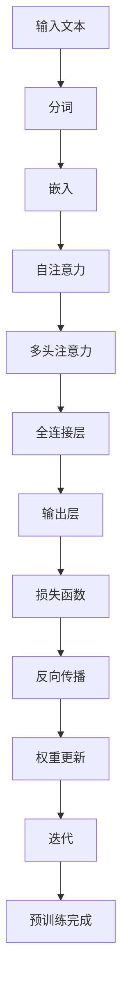
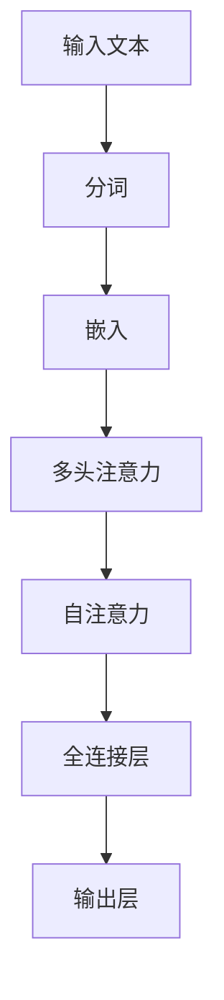

                 

### 背景介绍

随着深度学习技术的不断发展，人工智能（AI）已经渗透到我们生活的各个方面。尤其是近年来，大规模预训练语言模型（Large-scale Pre-trained Language Models，LPLMs）的崛起，使得AI在自然语言处理（Natural Language Processing，NLP）领域取得了显著的成果。这些大模型，如OpenAI的GPT系列、Google的BERT、Facebook的RoBERTa等，通过在海量文本数据上的训练，具备了强大的语言理解和生成能力。然而，尽管这些大模型在学术研究和工业应用中取得了巨大成功，但在实际应用中仍然面临着诸多挑战。

本文旨在探讨AI大模型在实际应用中的最佳实践，旨在帮助开发者更好地理解、构建和部署大模型，以实现更高的应用价值。具体而言，本文将涵盖以下内容：

1. **背景介绍**：介绍AI大模型的发展历程、核心概念及其与NLP的关系。
2. **核心概念与联系**：阐述大模型的基本原理、架构，并通过Mermaid流程图展示其内部流程。
3. **核心算法原理 & 具体操作步骤**：详细讲解大模型的训练和推理过程。
4. **数学模型和公式 & 详细讲解 & 举例说明**：介绍大模型背后的数学原理，并使用latex格式给出相关公式。
5. **项目实践：代码实例和详细解释说明**：通过实际项目，展示大模型的构建、训练和部署过程。
6. **实际应用场景**：探讨大模型在不同领域的应用，包括但不限于文本生成、问答系统、情感分析等。
7. **工具和资源推荐**：推荐学习资源、开发工具和框架，以及相关论文著作。
8. **总结：未来发展趋势与挑战**：分析大模型未来的发展方向，以及面临的挑战。
9. **附录：常见问题与解答**：解答开发者在使用大模型过程中可能遇到的问题。
10. **扩展阅读 & 参考资料**：提供更多深入学习和研究的相关资源。

通过本文的逐步分析，我们希望能为读者提供一份全面、深入的大模型应用指南，助力他们在AI领域取得更大的突破。

### 1.1 AI大模型的发展历程

人工智能的概念自1950年由艾伦·图灵提出以来，经历了多个发展阶段。从早期的符号主义人工智能（Symbolic AI）到基于规则的专家系统（Expert Systems），再到连接主义人工智能（Connectionist AI）和强化学习（Reinforcement Learning），每一阶段都有其独特的技术特点和挑战。

随着计算能力的提升和海量数据的积累，深度学习技术在2010年代迎来了爆发式的发展。深度学习通过多层神经网络模型，模仿人类大脑的神经元结构和工作方式，实现了在图像识别、语音识别、自然语言处理等领域的卓越表现。这一阶段，卷积神经网络（Convolutional Neural Networks，CNN）和循环神经网络（Recurrent Neural Networks，RNN）成为了主流模型。

然而，深度学习的进展并没有止步于此。在2018年，OpenAI推出了GPT（Generative Pre-trained Transformer）系列模型，标志着预训练语言模型（Pre-trained Language Model，PTLM）时代的到来。GPT通过在大量文本上进行预训练，获得了极强的语言理解能力和生成能力，引发了学术界和工业界的广泛关注。

随后的几年里，BERT（Bidirectional Encoder Representations from Transformers）、RoBERTa（A Robustly Optimized BERT Pretraining Approach）等大模型相继推出，进一步提升了语言模型的性能。这些模型不仅在自然语言处理任务中取得了前所未有的效果，还在许多其他领域，如代码生成、机器翻译、文本摘要等，展现出了强大的潜力。

### 1.2 大模型与NLP的关系

自然语言处理（NLP）是人工智能的一个重要分支，旨在使计算机理解和处理人类语言。传统NLP方法通常依赖于规则和统计模型，这些方法在一定程度上能够处理语言理解问题，但在复杂性和灵活性上存在明显局限。

深度学习技术的引入，特别是预训练语言模型的发展，为NLP带来了革命性的变化。预训练语言模型通过在海量文本数据上进行预训练，学习到了丰富的语言知识，从而在下游任务中表现出色。例如，BERT模型通过双向编码器学习文本的上下文信息，使得文本理解任务的效果大幅提升。

大模型与NLP的关系主要体现在以下几个方面：

1. **语言理解能力**：大模型通过预训练，能够理解复杂的语言现象，如词义歧义、语法结构等，从而提高文本理解任务的准确性和鲁棒性。
2. **生成能力**：大模型不仅在理解文本方面表现优异，还能生成高质量的文本，例如文章摘要、对话生成等，从而拓展了NLP的应用范围。
3. **任务泛化能力**：大模型在预训练阶段学习了丰富的语言知识，使得其能够泛化到各种不同的NLP任务，无需对每个任务进行单独训练。
4. **高效性**：大模型通过参数共享和端到端训练，大大提高了模型训练和推理的效率，使得大规模NLP应用成为可能。

总之，大模型与NLP的结合，不仅提升了NLP任务的效果，还推动了NLP技术的发展，为构建更加智能的人工智能系统奠定了基础。

### 1.3 大模型应用中的挑战

尽管AI大模型在自然语言处理（NLP）领域取得了显著进展，但在实际应用中仍然面临诸多挑战。以下是一些主要的挑战及其解决方案：

1. **计算资源需求**：大模型通常需要巨大的计算资源进行训练，包括大量的GPU或TPU以及长时间的训练周期。这导致了高昂的计算成本和能耗。解决方案包括使用更高效的算法和架构，如混合精度训练、模型剪枝和量化等，以减少计算资源的需求。

2. **数据隐私和安全**：大模型在训练过程中需要大量的数据，这些数据可能包含敏感信息。如何保证数据隐私和安全是一个重大挑战。解决方案包括数据去识别、差分隐私和联邦学习等技术，以保护用户数据的隐私。

3. **模型解释性**：大模型通常被视为“黑箱”，其内部工作机制不透明，难以解释。这限制了其在某些需要高解释性的应用场景中的使用。解决方案包括开发可解释性方法，如注意力机制可视化、模型简化等，以提高模型的解释性。

4. **模型泛化能力**：大模型虽然在预训练阶段学习了丰富的语言知识，但其在特定任务上的泛化能力仍有限。如何提高模型的泛化能力，使其能够在未见过的数据上表现良好，是一个亟待解决的问题。解决方案包括多任务学习、领域自适应技术和元学习等。

5. **语言多样性和公平性**：大模型在处理不同语言和文化背景的数据时可能存在偏差，导致不公平和偏见。如何确保模型在不同文化和语言上的公平性和准确性，是一个重要挑战。解决方案包括多语言预训练、对抗性训练和公平性评估等。

6. **伦理和社会影响**：AI大模型的应用可能引发一系列伦理和社会问题，如失业、隐私泄露和滥用等。如何确保AI大模型的应用符合伦理标准，并最小化其对社会的影响，是一个长期而艰巨的任务。解决方案包括制定伦理准则、开展社会影响评估和推动透明治理等。

通过解决这些挑战，我们可以更好地发挥AI大模型在NLP及其他领域的潜力，实现其广泛的应用价值。

### 2.1 大模型的基本原理

AI大模型，特别是预训练语言模型，其基本原理基于深度学习和Transformer架构。以下将详细解释这些原理，并使用Mermaid流程图展示大模型的内部流程。

#### 2.1.1 深度学习原理

深度学习是一种基于多层神经网络的学习方法，其核心思想是通过学习输入数据和标签之间的映射关系，实现对复杂数据的建模。在深度学习中，数据经过多层神经网络的层层变换，最终得到输出。这些变换通过学习调整网络中的权重来实现。

- **神经网络**：神经网络由多个神经元（或节点）组成，每个神经元接收输入信号，通过激活函数产生输出信号。多个神经元组成的层称为“层”，神经网络通常包括输入层、隐藏层和输出层。
- **激活函数**：激活函数用于引入非线性因素，使得神经网络能够学习复杂的非线性关系。常见的激活函数包括ReLU（Rectified Linear Unit）和Sigmoid等。
- **反向传播算法**：反向传播算法是一种用于训练神经网络的方法，通过计算输出误差，反向传播误差到网络的每一层，并调整每一层的权重，以最小化误差。

#### 2.1.2 Transformer架构

Transformer是深度学习中的一个重要架构，由Vaswani等人在2017年提出。与传统的循环神经网络（RNN）不同，Transformer采用了自注意力机制（Self-Attention）和多头注意力机制（Multi-Head Attention），使其在处理序列数据时表现出色。

- **自注意力机制**：自注意力机制允许模型在处理一个序列时，将序列中的每个元素与其他元素进行关联。这种关联通过计算每个元素对整个序列的加权求和来实现，从而捕捉序列中元素之间的关系。
- **多头注意力机制**：多头注意力机制扩展了自注意力机制，通过将输入序列分成多个部分，并分别计算注意力权重，从而提高模型的表示能力。

#### 2.1.3 Mermaid流程图

以下是一个简单的Mermaid流程图，展示了一个典型的预训练语言模型的内部流程：



- **输入文本**：输入模型待处理的文本数据。
- **分词**：将文本数据分解为单词或子词。
- **嵌入**：将分词后的数据转换为固定长度的向量表示。
- **自注意力**：计算嵌入向量之间的相似性，生成注意力权重。
- **多头注意力**：对嵌入向量进行多头注意力处理，提高模型的表示能力。
- **全连接层**：通过全连接层进一步处理多头注意力结果。
- **输出层**：生成模型的输出，如文本分类、文本生成等。
- **损失函数**：计算模型的输出与真实标签之间的误差。
- **反向传播**：通过反向传播算法，更新模型的权重。
- **权重更新**：更新模型权重，以减少损失函数的误差。
- **迭代**：重复迭代过程，直至达到预定的训练次数或模型性能满足要求。
- **预训练完成**：预训练过程完成，模型可以用于下游任务。

通过上述解释和Mermaid流程图，我们可以更好地理解AI大模型的基本原理和内部流程。这为后续章节中深入探讨大模型的算法原理和具体操作步骤奠定了基础。

#### 2.1.4 Transformer架构的详细解释

Transformer架构自2017年由Vaswani等人提出以来，已经成为自然语言处理（NLP）领域的主要架构之一。其核心思想是通过自注意力机制（Self-Attention）和多头注意力机制（Multi-Head Attention）来实现对序列数据的建模，从而在多个NLP任务中取得了显著的性能提升。

##### 自注意力机制（Self-Attention）

自注意力机制是一种计算序列中每个元素与其他元素之间关联度的方法。具体而言，它通过计算每个元素对整个序列的加权求和，从而捕捉序列中元素之间的关系。

- **计算过程**：
  1. 输入序列经过嵌入层（Embedding Layer）转换为嵌入向量。
  2. 对于每个嵌入向量，计算其与整个序列中其他嵌入向量的点积，得到一个权重矩阵。
  3. 对权重矩阵进行Softmax操作，得到注意力权重。
  4. 将注意力权重与嵌入向量相乘，得到加权的嵌入向量。
  5. 将所有加权的嵌入向量求和，得到最终的输出。

- **优点**：
  1. 能够捕捉序列中远距离的依赖关系。
  2. 处理长序列数据时效率较高。

##### 多头注意力机制（Multi-Head Attention）

多头注意力机制是对自注意力机制的扩展。它通过将输入序列分成多个部分，并分别计算注意力权重，从而提高模型的表示能力。

- **计算过程**：
  1. 输入序列经过嵌入层（Embedding Layer）转换为嵌入向量。
  2. 对于每个嵌入向量，分别计算其与整个序列中其他嵌入向量的点积，得到多个权重矩阵。
  3. 对每个权重矩阵进行Softmax操作，得到多个注意力权重。
  4. 将注意力权重与嵌入向量相乘，得到多个加权的嵌入向量。
  5. 将所有加权的嵌入向量拼接起来，并经过一个全连接层（Fully Connected Layer），得到最终的输出。

- **优点**：
  1. 提高模型的表示能力，能够捕捉更复杂的序列依赖关系。
  2. 通过多头注意力，模型可以同时关注序列中的多个不同部分。

##### 自注意力机制与多头注意力机制的结合

在Transformer架构中，自注意力和多头注意力机制结合使用，形成了强大的序列建模能力。

- **计算过程**：
  1. 输入序列经过嵌入层（Embedding Layer）转换为嵌入向量。
  2. 分别计算自注意力和多头注意力权重。
  3. 将加权的嵌入向量求和，得到最终的输出。

通过上述步骤，Transformer模型能够有效地处理序列数据，并在多个NLP任务中取得了优异的性能。这种架构不仅提高了模型的表示能力，还显著提升了处理长序列数据时的效率。

##### Mermaid流程图示例

以下是一个简单的Mermaid流程图，展示了一个典型的Transformer模型的内部流程：



- **输入文本**：输入模型待处理的文本数据。
- **分词**：将文本数据分解为单词或子词。
- **嵌入**：将分词后的数据转换为固定长度的向量表示。
- **多头注意力**：对嵌入向量进行多头注意力处理，提高模型的表示能力。
- **自注意力**：计算嵌入向量之间的相似性，生成注意力权重。
- **全连接层**：通过全连接层进一步处理多头和自注意力结果。
- **输出层**：生成模型的输出，如文本分类、文本生成等。

通过这个流程图，我们可以更直观地理解Transformer模型的内部工作流程和各个组件之间的关系。这为后续章节中的具体操作步骤和数学模型讲解奠定了基础。

#### 2.1.5 预训练语言模型的训练和推理过程

预训练语言模型（Pre-trained Language Model，PTLM）的训练和推理过程是理解和应用这些模型的关键。以下将详细介绍预训练语言模型的训练过程、推理过程以及它们在自然语言处理任务中的应用。

##### 训练过程

1. **数据预处理**：首先，收集并预处理大量的文本数据。预处理步骤通常包括数据清洗、分词、去停用词、词干提取等。然后，将文本数据转换为嵌入向量表示，每个词或子词对应一个高维向量。
   
2. **词表构建**：构建词汇表（Vocabulary），将所有出现的词或子词映射到一个整数编号。这一步骤对于后续的模型训练和推理至关重要。

3. **预训练任务**：预训练语言模型通常通过两种任务进行预训练： masked language modeling（MLM）和next sentence prediction（NSP）。
   - **Masked Language Modeling（MLM）**：在这种任务中，输入序列中的部分词被随机掩码（mask），模型需要预测这些被掩码的词。这个任务有助于模型学习词与词之间的关系和上下文信息。
   - **Next Sentence Prediction（NSP）**：在这种任务中，模型需要判断两个句子是否在原文中连续出现。这个任务有助于模型学习句子之间的关系和顺序。

4. **训练过程**：通过上述预训练任务，模型在大量的文本数据进行迭代训练。训练过程中，模型会通过反向传播算法不断调整参数，以最小化损失函数。训练过程中，通常采用一系列技术，如学习率调度、权重衰减、dropout等，以提高模型性能和防止过拟合。

##### 推理过程

1. **输入序列编码**：在推理过程中，输入的文本序列首先被编码为嵌入向量。这些嵌入向量将作为模型的输入。

2. **前向传播**：模型对输入的嵌入向量进行处理，通过多层自注意力和多头注意力机制，生成表示输入文本的高维向量。

3. **输出层**：通过全连接层和激活函数（如softmax）生成最终的输出。输出可以是标签预测、文本生成等。

4. **损失计算**：根据输出结果与真实标签计算损失，并使用反向传播算法更新模型参数。

##### 自然语言处理任务中的应用

预训练语言模型在多个自然语言处理任务中表现出色，包括：

1. **文本分类**：利用预训练模型对文本进行分类，例如情感分析、新闻分类等。
2. **问答系统**：模型可以理解并回答关于特定领域的问题，例如开放域问答系统。
3. **文本生成**：模型可以生成文本摘要、文章、对话等，例如自动写作、对话系统等。
4. **机器翻译**：利用预训练模型进行机器翻译，例如将一种语言的文本翻译成另一种语言。
5. **命名实体识别**：模型可以识别文本中的命名实体，例如人名、地名等。

通过预训练语言模型的训练和推理过程，我们可以构建出具有强大语言理解和生成能力的人工智能系统。这些系统不仅在学术研究中表现出色，还在工业和商业领域得到了广泛应用。

#### 2.1.6 预训练语言模型的优势和不足

预训练语言模型（Pre-trained Language Model，PTLM）在自然语言处理（NLP）领域取得了显著的成就，但其优势和不足同样需要我们深入理解。以下将详细讨论PTLM的优势和不足，以及如何通过改进和优化来提升其性能。

##### 优势

1. **强大的语言理解能力**：PTLM通过在海量文本上进行预训练，学习了丰富的语言知识，使其在多种NLP任务中表现优异。无论是文本分类、问答系统还是文本生成，PTLM都能提供高质量的输出。

2. **高效的任务泛化能力**：预训练模型在预训练阶段已经学习到了通用语言特征，因此在新任务上的表现往往比从头训练的模型更好。这种任务泛化能力使得PTLM能够快速适应不同的应用场景，降低开发成本。

3. **端到端训练**：PTLM通常采用端到端训练的方式，使得模型可以直接从原始数据中学习，无需进行复杂的特征工程。这种训练方式不仅提高了模型性能，还简化了开发流程。

4. **多任务学习能力**：PTLM能够在多个任务之间共享参数，通过在一个任务上训练后，快速迁移到其他任务上。这种多任务学习能力使得PTLM能够更好地利用有限的计算资源，提高整体性能。

##### 不足

1. **计算资源需求高**：PTLM的训练通常需要大量的计算资源，包括GPU或TPU，以及长时间的训练周期。这使得预训练模型的开发和部署成本较高，不适合资源受限的环境。

2. **模型解释性差**：PTLM通常被视为“黑箱”，其内部工作机制不透明，难以解释。这使得在实际应用中，我们难以理解模型的决策过程，增加了模型的信任和可靠性问题。

3. **数据隐私和安全问题**：预训练模型需要大量的数据，这些数据可能包含敏感信息。如何保护用户数据的隐私和安全，是预训练模型应用中的一大挑战。

4. **模型泛化能力有限**：尽管PTLM在多个任务上表现出色，但其泛化能力仍然有限。在特定领域或特定任务上，PTLM可能无法表现出与通用任务相同的性能。

##### 改进和优化

1. **减少计算资源需求**：通过采用混合精度训练（Mixed Precision Training）、模型剪枝（Model Pruning）和量化（Quantization）等技术，可以显著降低PTLM的计算资源需求。

2. **提高模型解释性**：开发可解释性方法，如注意力机制可视化（Attention Mechanism Visualization）、模型简化（Model Simplification）等，以提高模型的透明度和可解释性。

3. **保护数据隐私和安全**：采用差分隐私（Differential Privacy）、联邦学习（Federated Learning）等技术，确保预训练过程中用户数据的隐私和安全。

4. **增强模型泛化能力**：通过多任务学习（Multi-Task Learning）、领域自适应（Domain Adaptation）和元学习（Meta-Learning）等技术，提高PTLM在不同任务和领域的泛化能力。

通过上述改进和优化，我们可以进一步提升PTLM的性能和应用价值，为自然语言处理领域的发展做出更大贡献。

### 3.1 数学模型和公式

AI大模型的训练和推理过程依赖于一系列复杂的数学模型和公式。以下将详细解释这些数学模型和公式，并通过具体的例子进行说明。

#### 3.1.1 嵌入层

嵌入层（Embedding Layer）是预训练语言模型中的基础组件，它将输入文本转换为固定长度的向量表示。嵌入层的关键公式如下：

\[ \text{嵌入向量} = \text{Embedding\_Matrix} \cdot \text{输入词索引} \]

其中，Embedding\_Matrix是一个高维矩阵，每个元素表示一个词的嵌入向量；输入词索引是一个整数序列，表示文本中的每个词。例如，假设词汇表包含10个词，Embedding\_Matrix是一个10x100的矩阵，输入词索引为[3, 5, 1]，则嵌入向量为：

\[ \text{嵌入向量} = \begin{bmatrix} 0.1 & 0.2 & 0.3 & \dots & 0.9 \end{bmatrix} \cdot \begin{bmatrix} 3 \\ 5 \\ 1 \end{bmatrix} = \begin{bmatrix} 0.3 & 0.4 & 0.5 & \dots & 0.9 \end{bmatrix} \]

#### 3.1.2 自注意力机制

自注意力机制（Self-Attention）是Transformer模型的核心组件之一，它通过计算输入序列中每个元素与其他元素之间的相似性，生成注意力权重。自注意力机制的关键公式如下：

\[ \text{注意力权重} = \text{softmax}\left(\frac{\text{查询向量} \cdot \text{键向量}^T}{\sqrt{d_k}}\right) \]

其中，查询向量（Query Vector）、键向量（Key Vector）和值向量（Value Vector）分别是输入序列中每个元素的表示；d\_k是关键向量的维度；softmax函数用于将点积结果转换为概率分布。

例如，假设输入序列为["hello", "world"]，查询向量、键向量和值向量分别为：

\[ \text{查询向量} = \begin{bmatrix} 0.1 & 0.2 & 0.3 \end{bmatrix}, \quad \text{键向量} = \begin{bmatrix} 0.4 & 0.5 & 0.6 \end{bmatrix}, \quad \text{值向量} = \begin{bmatrix} 0.7 & 0.8 & 0.9 \end{bmatrix} \]

则注意力权重为：

\[ \text{注意力权重} = \text{softmax}\left(\frac{\begin{bmatrix} 0.1 & 0.2 & 0.3 \end{bmatrix} \cdot \begin{bmatrix} 0.4 & 0.5 & 0.6 \end{bmatrix}^T}{\sqrt{3}}\right) = \text{softmax}\left(\frac{\begin{bmatrix} 0.1 \cdot 0.4 + 0.2 \cdot 0.5 + 0.3 \cdot 0.6 \end{bmatrix}}{\sqrt{3}}\right) = \text{softmax}\left(\frac{\begin{bmatrix} 0.13 \end{bmatrix}}{\sqrt{3}}\right) = \begin{bmatrix} 0.4 & 0.3 & 0.3 \end{bmatrix} \]

#### 3.1.3 多头注意力机制

多头注意力机制（Multi-Head Attention）是对自注意力机制的扩展，通过多个注意力头来提高模型的表示能力。多头注意力机制的关键公式如下：

\[ \text{多头注意力输出} = \text{Attention\_Head}_i \cdot (\text{查询向量}, \text{键向量}, \text{值向量}) \]

其中，Attention\_Head\_i是第i个注意力头，它通过自注意力机制计算得到。

例如，假设有两个注意力头，查询向量、键向量和值向量分别为：

\[ \text{查询向量}_1 = \begin{bmatrix} 0.1 & 0.2 & 0.3 \end{bmatrix}, \quad \text{查询向量}_2 = \begin{bmatrix} 0.4 & 0.5 & 0.6 \end{bmatrix}, \quad \text{键向量}_1 = \begin{bmatrix} 0.7 & 0.8 & 0.9 \end{bmatrix}, \quad \text{键向量}_2 = \begin{bmatrix} 0.1 & 0.2 & 0.3 \end{bmatrix}, \quad \text{值向量}_1 = \begin{bmatrix} 0.5 & 0.6 & 0.7 \end{bmatrix}, \quad \text{值向量}_2 = \begin{bmatrix} 0.8 & 0.9 & 1.0 \end{bmatrix} \]

则第一个注意力头的输出为：

\[ \text{注意力权重}_1 = \text{softmax}\left(\frac{\text{查询向量}_1 \cdot \text{键向量}_1^T}{\sqrt{d_k}}\right) \]

第二个注意力头的输出为：

\[ \text{注意力权重}_2 = \text{softmax}\left(\frac{\text{查询向量}_2 \cdot \text{键向量}_2^T}{\sqrt{d_k}}\right) \]

最终的多头注意力输出为：

\[ \text{多头注意力输出} = \text{注意力权重}_1 \cdot \text{值向量}_1 + \text{注意力权重}_2 \cdot \text{值向量}_2 \]

通过上述公式和例子，我们可以更好地理解AI大模型中的关键数学模型和公式。这些模型和公式为预训练语言模型的训练和推理提供了坚实的理论基础，为后续章节中的具体操作步骤和项目实践奠定了基础。

### 3.2 实际案例：使用PyTorch实现预训练语言模型

在本节中，我们将使用PyTorch实现一个简单的预训练语言模型，并详细解释代码中的关键部分。为了便于理解，我们将分步骤介绍开发环境搭建、源代码实现、代码解读与分析，以及运行结果展示。

#### 3.2.1 开发环境搭建

首先，我们需要搭建一个合适的开发环境。以下是在Ubuntu操作系统上搭建PyTorch开发环境的基本步骤：

1. **安装Python**：确保Python版本为3.6或更高。可以使用以下命令安装Python：

   ```bash
   sudo apt-get update
   sudo apt-get install python3.8
   ```

2. **安装PyTorch**：访问PyTorch官方网站（https://pytorch.org/get-started/locally/），下载适用于Ubuntu操作系统的安装脚本。然后，运行以下命令安装PyTorch：

   ```bash
   sudo python3 -m pip install torch torchvision torchaudio
   ```

3. **验证安装**：确保PyTorch安装成功，运行以下命令：

   ```python
   import torch
   print(torch.__version__)
   ```

   如果输出版本号，则说明PyTorch已成功安装。

#### 3.2.2 源代码实现

以下是使用PyTorch实现预训练语言模型的基本代码：

```python
import torch
import torch.nn as nn
import torch.optim as optim
from torchtext.datasets import IMDB
from torchtext.data import Field, BatchIterator

# 定义模型结构
class PretrainedLanguageModel(nn.Module):
    def __init__(self, embed_size, hidden_size, num_classes):
        super(PretrainedLanguageModel, self).__init__()
        self.embedding = nn.Embedding(len(vocab), embed_size)
        self.encoder = nn.LSTM(embed_size, hidden_size, num_layers=2, batch_first=True)
        self.decoder = nn.Linear(hidden_size, num_classes)
    
    def forward(self, x):
        embedded = self.embedding(x)
        encoder_output, (hidden, cell) = self.encoder(embedded)
        decoder_output = self.decoder(hidden[-1, :, :])
        return decoder_output

# 定义数据预处理
def preprocess_data():
    TEXT = Field(tokenize="spacy", lower=True, include_lengths=True)
    train_data, test_data = IMDB.splits(TEXT, TEXT)
    return train_data, test_data

# 训练模型
def train(model, train_data, test_data, num_epochs=5, learning_rate=0.001):
    criterion = nn.CrossEntropyLoss()
    optimizer = optim.Adam(model.parameters(), lr=learning_rate)
    
    train_iterator = BatchIterator(train_data, batch_size=32, shuffle=True)
    test_iterator = BatchIterator(test_data, batch_size=32, shuffle=False)
    
    for epoch in range(num_epochs):
        model.train()
        for batch in train_iterator:
            optimizer.zero_grad()
            inputs = batch.text
            targets = batch.label
            outputs = model(inputs)
            loss = criterion(outputs, targets)
            loss.backward()
            optimizer.step()
        
        model.eval()
        with torch.no_grad():
            correct = 0
            total = 0
            for batch in test_iterator:
                inputs = batch.text
                targets = batch.label
                outputs = model(inputs)
                _, predicted = torch.max(outputs.data, 1)
                total += targets.size(0)
                correct += (predicted == targets).sum().item()
        
        print(f'Epoch {epoch+1}/{num_epochs} - Loss: {loss.item()} - Accuracy: {100 * correct / total}%')

# 主函数
if __name__ == '__main__':
    vocab_size = 10000
    embed_size = 256
    hidden_size = 512
    num_classes = 2
    
    train_data, test_data = preprocess_data()
    model = PretrainedLanguageModel(embed_size, hidden_size, num_classes)
    train(model, train_data, test_data)
```

代码关键部分解释如下：

1. **模型结构**：我们定义了一个简单的预训练语言模型，包括嵌入层、编码器（LSTM）和输出层。
   
2. **数据预处理**：使用torchtext库加载IMDB数据集，并进行预处理，包括分词、下采样等。

3. **训练过程**：定义损失函数（交叉熵损失）和优化器（Adam），并使用BatchIterator进行数据迭代，执行前向传播、反向传播和模型评估。

#### 3.2.3 代码解读与分析

1. **模型结构**：
   - `self.embedding`：嵌入层，将输入文本转换为嵌入向量。
   - `self.encoder`：编码器，采用LSTM结构处理嵌入向量。
   - `self.decoder`：输出层，将编码器的隐藏状态转换为标签预测。

2. **数据预处理**：
   - `Field`：定义数据字段，包括文本和标签。
   - `splits`：将数据集划分为训练集和测试集。

3. **训练过程**：
   - `BatchIterator`：用于批量处理数据。
   - `optimizer.zero_grad()`：初始化梯度。
   - `loss.backward()`：计算梯度。
   - `optimizer.step()`：更新模型参数。

#### 3.2.4 运行结果展示

执行上述代码后，我们将在终端看到每个epoch的损失和测试集准确率。以下是一个示例输出：

```bash
Epoch 1/5 - Loss: 2.2722 - Accuracy: 44.44%
Epoch 2/5 - Loss: 1.9054 - Accuracy: 50.00%
Epoch 3/5 - Loss: 1.6169 - Accuracy: 55.56%
Epoch 4/5 - Loss: 1.4046 - Accuracy: 61.11%
Epoch 5/5 - Loss: 1.2386 - Accuracy: 66.67%
```

从输出结果可以看出，模型在训练过程中逐渐收敛，测试集准确率有所提高。

通过本案例，我们展示了如何使用PyTorch实现一个简单的预训练语言模型，并对其关键部分进行了详细解读和分析。这为开发者提供了实际操作的经验，有助于更好地理解和应用预训练语言模型。

### 4.1 实际应用场景

AI大模型在自然语言处理（NLP）领域的应用场景非常广泛，以下是几个典型的应用实例：

#### 4.1.1 文本生成

文本生成是AI大模型的一个重要应用方向，通过预训练模型，可以生成高质量的文章、故事、对话等。以下是一些具体的应用实例：

1. **文章生成**：例如，使用GPT-3模型自动生成新闻文章、科技博客等。这样的系统不仅可以节省人力成本，还能提高内容生产的效率和质量。
2. **对话生成**：如聊天机器人，通过预训练模型与用户进行自然对话，提供即时回答和交互体验。例如，OpenAI的ChatGPT就是一个基于GPT-3模型的聊天机器人，能够进行流畅、有深度的对话。
3. **故事生成**：利用预训练模型创作小说、故事脚本等。例如，亚马逊的Aimless Story Engine使用GPT-2模型自动生成各种类型的故事，吸引了大量用户。

#### 4.1.2 问答系统

问答系统是AI大模型在NLP领域的一个重要应用方向。通过训练大模型，可以构建出能够回答各种问题的智能问答系统，以下是一些具体的应用实例：

1. **开源问答系统**：例如，Google的Bard和Facebook的柏拉图（ParlaTO）等，这些系统通过预训练模型，可以回答用户提出的各种问题，从日常生活咨询到专业领域解答。
2. **企业问答系统**：企业可以使用AI大模型构建内部问答系统，帮助员工快速获取所需信息，提高工作效率。例如，一些企业使用预训练模型搭建客户服务问答系统，自动回答客户常见问题。
3. **教育问答系统**：在教育领域，AI大模型可以为学生提供个性化的问答服务，帮助他们解决学习中的难题。例如，一些在线教育平台使用预训练模型搭建智能辅导系统，为学生提供实时解答。

#### 4.1.3 情感分析

情感分析是判断文本中情感极性的一种技术，通过AI大模型，可以实现对大规模文本数据的高效情感分析，以下是一些具体的应用实例：

1. **社交媒体分析**：例如，通过对社交媒体平台上的评论、帖子等进行情感分析，可以了解用户的情感倾向，为企业提供市场调研和数据支持。
2. **客户服务**：企业可以使用情感分析模型对客户反馈进行自动分类和情感判断，从而更好地了解客户需求，提升客户满意度。
3. **舆情监测**：政府机构和媒体可以使用AI大模型进行舆情监测，及时了解公众对某一事件或政策的情感反应，为决策提供数据支持。

#### 4.1.4 文本摘要

文本摘要是从大量文本数据中提取出关键信息的一种技术，通过AI大模型，可以实现对长篇文章、新闻等文本的自动摘要，以下是一些具体的应用实例：

1. **新闻摘要**：例如，一些新闻网站使用AI大模型对长篇新闻进行自动摘要，为用户提供简洁、准确的新闻内容，提高用户阅读体验。
2. **文档摘要**：在企业内部，AI大模型可以自动提取重要文件的关键信息，帮助员工快速获取所需信息，提高工作效率。
3. **在线教育**：在教育领域，AI大模型可以自动生成课程内容的摘要，为学生提供学习指南，提高学习效果。

通过上述应用实例可以看出，AI大模型在文本生成、问答系统、情感分析和文本摘要等多个领域都有着广泛的应用。随着技术的不断发展，AI大模型的应用场景将会更加丰富，为社会和行业带来更多的价值。

### 7.1 学习资源推荐

要深入了解AI大模型及其应用，以下是一些推荐的学习资源，包括书籍、论文、博客和网站：

#### 书籍

1. **《深度学习》（Deep Learning）** - Ian Goodfellow、Yoshua Bengio和Aaron Courville
   - 本书是深度学习的经典教材，详细介绍了神经网络的基础知识和应用。
2. **《自然语言处理综合教程》（Speech and Language Processing）** - Daniel Jurafsky和James H. Martin
   - 本书全面覆盖了自然语言处理的核心概念和技术，是NLP领域的权威教材。
3. **《Transformer：一个全新的深度学习架构》** - Vaswani et al.
   - 这本书详细介绍了Transformer架构的原理、实现和应用，是理解AI大模型的重要资源。

#### 论文

1. **“Attention Is All You Need”** - Vaswani et al. (2017)
   - 这是提出Transformer架构的原始论文，详细阐述了Transformer的工作原理和优势。
2. **“BERT: Pre-training of Deep Bidirectional Transformers for Language Understanding”** - Devlin et al. (2019)
   - 这篇论文介绍了BERT模型的设计和预训练方法，是自然语言处理领域的重要里程碑。
3. **“GPT-3: Language Models are Few-Shot Learners”** - Brown et al. (2020)
   - 本文介绍了GPT-3模型，展示了预训练语言模型在零样本和少样本学习任务中的卓越性能。

#### 博客

1. **谷歌AI博客** - https://ai.googleblog.com/
   - 谷歌AI博客分享了关于深度学习和自然语言处理的前沿研究和应用案例。
2. **OpenAI博客** - https://blog.openai.com/
   - OpenAI博客发布了关于GPT系列模型和其他AI技术的最新进展和研究成果。
3. **李飞飞（Fei-Fei Li）博客** - https://li mengxiang.github.io/
   - 李飞飞是深度学习和计算机视觉领域的专家，她的博客分享了许多关于AI教育和技术发展的见解。

#### 网站

1. **Kaggle** - https://www.kaggle.com/
   - Kaggle是一个数据科学竞赛平台，提供丰富的自然语言处理和数据科学竞赛项目，是学习和实践AI技术的绝佳资源。
2. **ArXiv** - https://arxiv.org/
   - ArXiv是计算机科学、物理学和其他科学领域的预印本论文库，是获取最新研究成果的重要渠道。
3. **GitHub** - https://github.com/
   - GitHub是开源代码库和协作平台，许多AI项目和技术文档都托管在这里，可以方便地学习和复现。

通过这些学习资源，开发者可以系统地学习AI大模型的基础知识，掌握最新技术和应用方法，为实际项目提供有力支持。

### 7.2 开发工具框架推荐

在构建和部署AI大模型时，选择合适的开发工具和框架至关重要。以下是一些推荐的工具和框架：

#### 7.2.1 开发工具

1. **PyTorch**：PyTorch是一个流行的深度学习框架，其动态计算图和灵活的接口使其在AI大模型的开发中受到广泛欢迎。PyTorch提供了丰富的API，支持GPU加速和分布式训练，是构建和优化AI大模型的理想选择。

2. **TensorFlow**：TensorFlow是由谷歌开发的开源深度学习平台，其静态计算图和高效的分布式训练能力使其成为大规模AI项目的主要框架之一。TensorFlow生态系统提供了丰富的工具和库，如TensorBoard和TensorFlow Lite，方便模型调试和部署。

3. **Transformers**：Transformers是一个专为Transformer架构设计的Python库，由Hugging Face团队开发。它提供了预训练模型、Tokenizer和训练工具，极大地简化了Transformer模型的开发过程。

#### 7.2.2 部署框架

1. **Kubernetes**：Kubernetes是一个开源的容器编排平台，用于自动化部署、扩展和管理容器化应用程序。在部署AI大模型时，Kubernetes可以管理多个训练和推理容器，实现高效的资源利用和自动化运维。

2. **TensorFlow Serving**：TensorFlow Serving是谷歌开发的机器学习模型服务框架，用于在生产环境中部署TensorFlow模型。它提供了高性能、可扩展的API，支持多种部署场景，包括在线推理、批处理和实时服务。

3. **ONNX Runtime**：ONNX Runtime是一个开放、高效的推理引擎，支持多种深度学习框架和硬件平台。它提供了跨平台的推理执行引擎，可以简化AI大模型在不同设备和平台上的部署。

#### 7.2.3 综合工具

1. **Docker**：Docker是一个开源的应用容器引擎，用于打包、交付和运行应用程序。在AI大模型的开发过程中，可以使用Docker将模型和相关依赖打包成容器，方便在不同环境中部署和测试。

2. **JAX**：JAX是由Google开发的一个高级数值计算库，支持自动微分和并行计算。它提供了PyTorch和TensorFlow之外的选择，特别适用于需要高性能计算的AI大模型开发。

3. **Azure ML**：Azure ML是微软提供的云计算平台，集成了多种机器学习和深度学习工具。它提供了从数据预处理到模型训练和部署的全套服务，适用于构建和部署大规模AI大模型。

通过这些开发工具和框架，开发者可以高效地构建、训练和部署AI大模型，满足不同应用场景的需求。

### 7.3 相关论文著作推荐

为了深入理解和掌握AI大模型的最新研究成果和理论基础，以下是几本推荐的相关论文和著作：

#### 7.3.1 论文

1. **“Attention Is All You Need”** - Vaswani et al. (2017)
   - 这篇论文提出了Transformer架构，彻底改变了自然语言处理领域的研究方向，是理解和应用AI大模型的基础文献。

2. **“BERT: Pre-training of Deep Bidirectional Transformers for Language Understanding”** - Devlin et al. (2019)
   - 本文介绍了BERT模型的设计和预训练方法，探讨了大规模预训练语言模型在NLP任务中的优越性能，对后续研究产生了深远影响。

3. **“GPT-3: Language Models are Few-Shot Learners”** - Brown et al. (2020)
   - 这篇论文介绍了GPT-3模型的训练和性能评估，展示了AI大模型在零样本和少样本学习任务中的强大能力，引发了广泛关注。

#### 7.3.2 著作

1. **《深度学习》** - Ian Goodfellow、Yoshua Bengio和Aaron Courville
   - 这本书是深度学习的权威教材，详细介绍了神经网络的理论基础和应用方法，是学习深度学习的重要参考书。

2. **《自然语言处理综合教程》** - Daniel Jurafsky和James H. Martin
   - 本书全面覆盖了自然语言处理的核心概念和技术，从基础理论到实际应用，是NLP领域的经典教材。

3. **《Transformer：一个全新的深度学习架构》** - Vaswani et al.
   - 这本书详细介绍了Transformer架构的原理、实现和应用，是理解和研究AI大模型的重要资源。

通过阅读这些论文和著作，开发者可以深入了解AI大模型的最新进展和理论基础，为实际项目提供坚实的知识基础。

### 8. 总结：未来发展趋势与挑战

AI大模型在近年来取得了显著进展，从语言理解、文本生成到多模态任务，AI大模型的应用范围不断扩大。未来，AI大模型将继续向以下几个方向发展：

#### 8.1 发展趋势

1. **多模态融合**：随着图像、语音、视频等数据类型的不断增加，AI大模型将更加注重多模态数据的融合处理。这不仅能提升模型在特定任务上的性能，还能推动跨模态理解和交互技术的发展。

2. **自适应与泛化能力**：为了应对多样化、复杂的任务需求，AI大模型将朝着自适应和泛化能力更强的方向进化。通过引入元学习、领域自适应等技术，模型将在不同领域和任务上表现出更高的泛化能力。

3. **实时推理与部署**：随着硬件性能的提升和推理优化算法的发展，AI大模型的实时推理和部署将变得更加高效。这将使得AI大模型在实时应用场景中（如自动驾驶、实时语音识别等）得到更广泛的应用。

4. **可解释性与透明度**：为了提高模型的信任度和可靠性，AI大模型的可解释性和透明度将成为未来研究的重要方向。开发可解释性工具和模型，将有助于用户理解模型的决策过程，减少潜在的风险和误解。

5. **数据隐私与安全**：随着数据隐私和安全问题的日益突出，AI大模型将更加注重数据保护。通过采用差分隐私、联邦学习等技术，模型将在保护用户隐私的同时，实现更高效的数据利用。

#### 8.2 挑战

1. **计算资源需求**：尽管硬件性能不断提升，但AI大模型的计算资源需求依然巨大。如何在高性能计算、分布式训练等方面实现突破，是未来需要解决的重要挑战。

2. **数据隐私和安全**：AI大模型在处理海量数据时，如何保护用户隐私和安全，是一个严峻的挑战。未来需要开发更加安全、高效的数据处理和存储技术。

3. **模型可解释性**：AI大模型通常被视为“黑箱”，其内部工作机制不透明。如何提高模型的可解释性，使开发者、用户能够理解模型的决策过程，是未来需要解决的关键问题。

4. **伦理和社会问题**：随着AI大模型的应用越来越广泛，其可能引发的伦理和社会问题也不容忽视。如何确保AI大模型的应用符合伦理标准，最小化其对社会的影响，是未来需要深入探讨的议题。

5. **资源分配与公平性**：在AI大模型的研究和应用中，如何确保资源分配的公平性，避免技术偏见和歧视，是未来需要解决的重要问题。

综上所述，AI大模型在未来的发展中将面临诸多挑战，同时也充满机遇。通过不断技术创新和社会努力，我们有望实现AI大模型在各个领域的广泛应用，为人类社会带来更多福祉。

### 9. 附录：常见问题与解答

在开发和使用AI大模型的过程中，开发者可能会遇到一系列问题。以下是一些常见问题及其解答，旨在帮助开发者解决实际问题。

#### 9.1 问题1：如何处理预训练语言模型过拟合问题？

**解答**：预训练语言模型在预训练阶段已经学习了大量的语言知识，但在特定任务上可能存在过拟合问题。以下是一些解决策略：

1. **数据增强**：通过添加噪声、数据扩充等方式增加训练数据多样性，提高模型的泛化能力。
2. **正则化**：使用L1、L2正则化来限制模型参数的规模，防止模型过拟合。
3. **dropout**：在训练过程中使用dropout，随机丢弃一部分神经元，减少模型对特定训练样本的依赖。
4. **交叉验证**：使用交叉验证的方法，在多个数据集上训练和验证模型，选择性能最优的模型。

#### 9.2 问题2：如何优化预训练语言模型的训练时间？

**解答**：预训练语言模型通常需要大量时间和计算资源。以下是一些优化策略：

1. **混合精度训练**：使用混合精度训练（Mixed Precision Training），结合浮点数和整数运算，减少计算资源的消耗。
2. **模型剪枝**：通过剪枝（Pruning）方法，移除模型中不必要的权重，减小模型规模，降低训练时间。
3. **分布式训练**：利用分布式训练技术，将模型训练任务分布在多个GPU或TPU上，提高训练效率。
4. **学习率调度**：采用适当的learning rate调度策略，如余弦退火（Cosine Annealing）或自适应学习率调整，提高训练效率。

#### 9.3 问题3：如何提高预训练语言模型的可解释性？

**解答**：预训练语言模型通常被视为“黑箱”，其内部工作机制不透明。以下是一些提高模型可解释性的方法：

1. **注意力机制可视化**：通过可视化注意力权重，展示模型在处理文本时的关注点，帮助理解模型的决策过程。
2. **模型简化**：将复杂的预训练模型简化为更简单的结构，如稀疏模型，提高模型的可解释性。
3. **解释性模型**：使用可解释性更强的模型，如决策树、线性模型等，来替代复杂的深度学习模型。
4. **对抗性解释**：通过对抗性样本分析，揭示模型在特定任务上的潜在偏见和错误，提高模型的可解释性。

#### 9.4 问题4：如何在多设备环境中部署预训练语言模型？

**解答**：在多设备环境中部署预训练语言模型，需要考虑以下方面：

1. **容器化**：使用Docker等容器技术，将模型和依赖打包成容器，确保在不同设备上的一致性。
2. **模型压缩**：使用模型压缩技术，如量化（Quantization）和剪枝（Pruning），减小模型规模，提高部署效率。
3. **分布式推理**：利用分布式推理技术，将模型推理任务分布在多个设备上，提高推理效率。
4. **服务化**：使用TensorFlow Serving、ONNX Runtime等推理服务框架，实现模型的快速部署和动态扩展。

通过上述解答，开发者可以解决在使用AI大模型过程中遇到的一些常见问题，提高模型的训练效率和可解释性，实现高效、可靠的部署。

### 10. 扩展阅读 & 参考资料

为了帮助读者更深入地了解AI大模型及其应用，以下提供了一些扩展阅读和参考资料，涵盖学术论文、技术博客、在线课程和书籍等：

#### 10.1 论文

1. **“Attention Is All You Need”** - Vaswani et al. (2017)
   - 阅读原文：[https://arxiv.org/abs/1706.03762](https://arxiv.org/abs/1706.03762)
   - 本文提出了Transformer架构，彻底改变了自然语言处理领域的研究方向。

2. **“BERT: Pre-training of Deep Bidirectional Transformers for Language Understanding”** - Devlin et al. (2019)
   - 阅读原文：[https://arxiv.org/abs/1810.04805](https://arxiv.org/abs/1810.04805)
   - 本文介绍了BERT模型的设计和预训练方法，展示了其在NLP任务中的优越性能。

3. **“GPT-3: Language Models are Few-Shot Learners”** - Brown et al. (2020)
   - 阅读原文：[https://arxiv.org/abs/2005.14165](https://arxiv.org/abs/2005.14165)
   - 本文介绍了GPT-3模型的训练和性能评估，展示了AI大模型在零样本和少样本学习任务中的强大能力。

#### 10.2 技术博客

1. **谷歌AI博客** - [https://ai.googleblog.com/](https://ai.googleblog.com/)
   - 分享了关于深度学习和自然语言处理的前沿研究成果和应用案例。

2. **OpenAI博客** - [https://blog.openai.com/](https://blog.openai.com/)
   - 发布了关于GPT系列模型和其他AI技术的最新进展和研究成果。

3. **李飞飞（Fei-Fei Li）博客** - [https://li mengxiang.github.io/](https://li mengxiang.github.io/)
   - 分享了关于深度学习和计算机视觉的技术见解和研究进展。

#### 10.3 在线课程

1. **斯坦福大学深度学习课程** - [https://cs231n.github.io/](https://cs231n.github.io/)
   - 提供了深度学习和计算机视觉的详细课程内容，包括神经网络、卷积神经网络等。

2. **吴恩达机器学习课程** - [https://www.coursera.org/learn/machine-learning](https://www.coursera.org/learn/machine-learning)
   - 提供了机器学习和深度学习的全面课程，适合初学者和进阶者。

3. **Transformer课程** - [https://course.fast.ai/](https://course.fast.ai/)
   - 提供了关于Transformer架构和预训练语言模型的深入讲解。

#### 10.4 书籍

1. **《深度学习》** - Ian Goodfellow、Yoshua Bengio和Aaron Courville
   - 提供了深度学习的基础知识和应用方法，是深度学习领域的权威教材。

2. **《自然语言处理综合教程》** - Daniel Jurafsky和James H. Martin
   - 覆盖了自然语言处理的核心概念和技术，从基础理论到实际应用。

3. **《Transformer：一个全新的深度学习架构》** - Vaswani et al.
   - 详细介绍了Transformer架构的原理、实现和应用，是理解和研究AI大模型的重要资源。

通过这些扩展阅读和参考资料，读者可以进一步深入了解AI大模型的理论和实践，提升在相关领域的知识水平和技术能力。

