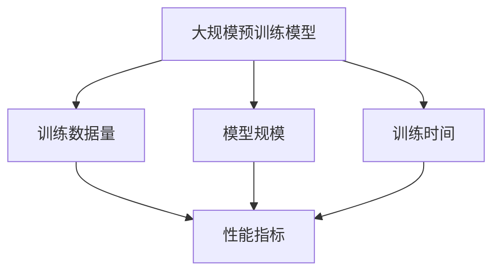

                 

### 背景介绍

人工智能（AI）的迅速发展，特别是大规模预训练模型（Large-scale Pretrained Models）的兴起，引发了学术界和工业界对AI系统性能的广泛关注。然而，如何衡量这些模型的性能和评估其效率，成为了当今研究中的一个重要课题。在这一背景下，"AI大模型计算机科学家群英传：AI大模型的规模定律 Scaling Law"应运而生。

首先，我们需要了解什么是“规模定律”。规模定律（Scaling Law）是指在给定条件下，系统性能随其规模（如模型大小、训练数据量等）变化的规律。在AI领域，规模定律用于描述模型性能随模型规模的变化趋势，从而指导我们设计更高效的AI系统。

本文旨在探讨AI大模型的规模定律，通过深入分析其核心概念、算法原理、数学模型以及实际应用场景，帮助读者更好地理解这一现象，并从中获得启发。

为了达到这一目的，本文将按照以下结构展开：

1. **背景介绍**：介绍AI大模型发展的背景和规模定律的重要性。
2. **核心概念与联系**：阐述规模定律涉及的核心概念和它们之间的关联。
3. **核心算法原理 & 具体操作步骤**：详细解释规模定律的算法原理，并提供具体的操作步骤。
4. **数学模型和公式 & 详细讲解 & 举例说明**：介绍支持规模定律的数学模型，并通过示例进行详细讲解。
5. **项目实践：代码实例和详细解释说明**：通过具体项目实践展示规模定律的实际应用。
6. **实际应用场景**：探讨规模定律在不同应用领域中的实际应用。
7. **工具和资源推荐**：推荐相关学习资源和开发工具。
8. **总结：未来发展趋势与挑战**：总结规模定律的现状，并展望未来发展趋势与面临的挑战。
9. **附录：常见问题与解答**：回答读者可能遇到的问题。
10. **扩展阅读 & 参考资料**：提供进一步学习的资源。

通过上述结构，本文将逐步深入探讨AI大模型的规模定律，帮助读者全面理解这一重要现象，并为未来的研究提供有益的启示。

### 核心概念与联系

在探讨AI大模型的规模定律之前，我们需要明确一些核心概念，并理解它们之间的联系。以下是本文涉及的主要概念及其相互关系：

#### 1. 大规模预训练模型

大规模预训练模型是指使用海量数据进行训练，模型规模通常达到数亿至数十亿参数的深度神经网络。这类模型通过在大量数据上预训练，能够学习到丰富的知识，从而在各种下游任务中表现出色。常见的预训练模型包括BERT、GPT和TorchVision等。

#### 2. 训练数据量

训练数据量是影响模型性能的重要因素之一。一般来说，随着训练数据量的增加，模型的性能会得到提升。然而，过大的训练数据量也会导致计算资源消耗增加，训练时间延长。

#### 3. 模型规模

模型规模指的是模型的参数数量和层数。随着模型规模的增加，模型的复杂度提升，能够捕捉更多细微的规律。然而，大规模模型也需要更多的计算资源和训练时间。

#### 4. 训练时间

训练时间是模型训练过程中所需的时间，包括前向传播、反向传播和参数更新等环节。训练时间与模型规模、训练数据量和硬件性能等因素密切相关。

#### 5. 性能指标

性能指标用于衡量模型的性能，如准确率、召回率、F1分数等。在不同的任务中，性能指标的选择可能不同，但共同的目标是提高模型的实际应用价值。

#### 6. 规模定律

规模定律是指模型性能随其规模（如模型大小、训练数据量等）变化的规律。规模定律为AI模型的优化提供了理论依据，帮助我们理解模型性能的提升机制。

#### 核心概念与联系

上述核心概念之间存在密切的联系。大规模预训练模型依赖于大量的训练数据和较大的模型规模，从而在性能指标上表现出优越性。训练数据量和模型规模决定了训练时间，而性能指标则反映了模型在实际应用中的表现。规模定律将这些概念有机地结合起来，揭示了AI模型性能的提升规律。

为了更好地理解这些概念之间的关系，我们可以使用Mermaid流程图进行可视化：



通过上述流程图，我们可以清晰地看到各核心概念之间的关联，为后续内容的深入讨论奠定了基础。在接下来的章节中，我们将进一步探讨规模定律的算法原理、数学模型和实际应用，帮助读者全面理解这一重要现象。

### 核心算法原理 & 具体操作步骤

在深入探讨AI大模型的规模定律之前，我们需要了解其背后的核心算法原理，并了解具体的操作步骤。规模定律主要涉及以下几个关键步骤：

#### 1. 数据预处理

数据预处理是规模定律的基础步骤，包括数据清洗、数据增强和标准化等操作。数据清洗旨在去除噪声和异常值，提高数据质量；数据增强通过增加样本多样性，增强模型的泛化能力；标准化则通过缩放特征值，使数据在相似尺度上进行分析。

#### 2. 模型初始化

模型初始化是规模定律的核心，决定了模型的学习起点。常用的初始化方法包括随机初始化、高斯初始化和Xavier初始化等。合理的初始化方法有助于提高模型的收敛速度和性能。

#### 3. 模型训练

模型训练是规模定律的核心步骤，包括前向传播、反向传播和参数更新等操作。前向传播用于计算模型的预测结果，反向传播通过梯度下降法计算模型参数的更新方向，参数更新则根据梯度方向调整模型参数，以减小预测误差。

#### 4. 模型评估

模型评估是规模定律的重要环节，用于衡量模型的性能。常用的评估指标包括准确率、召回率、F1分数等。通过评估模型在不同数据集上的性能，可以调整模型参数和训练策略，优化模型表现。

#### 5. 模型调优

模型调优是在规模定律指导下进行的，旨在提高模型性能。调优方法包括超参数调整、正则化策略和模型融合等。超参数调整包括学习率、批量大小等；正则化策略包括L1、L2正则化；模型融合通过结合多个模型的预测结果，提高整体性能。

#### 6. 模型部署

模型部署是将训练好的模型应用于实际场景的过程。部署过程包括模型转换、模型推理和结果输出等步骤。通过合理的部署策略，可以确保模型在实时应用中高效稳定运行。

#### 具体操作步骤

以下是一个具体的操作步骤示例，用于实现规模定律：

1. **数据预处理**：
   - 数据清洗：去除噪声和异常值。
   - 数据增强：生成新的训练样本，如随机裁剪、翻转等。
   - 标准化：缩放特征值，使数据在相似尺度上进行分析。

2. **模型初始化**：
   - 选择合适的初始化方法，如Xavier初始化。
   - 初始化模型参数，设置初始权重。

3. **模型训练**：
   - 使用随机梯度下降（SGD）或Adam优化器进行训练。
   - 设置训练参数，如学习率、批量大小等。
   - 进行前向传播，计算预测结果。
   - 反向传播，计算损失函数。
   - 更新模型参数，减小预测误差。

4. **模型评估**：
   - 使用验证集对模型进行评估。
   - 计算准确率、召回率、F1分数等性能指标。
   - 调整模型参数和训练策略，优化模型表现。

5. **模型调优**：
   - 调整超参数，如学习率、批量大小等。
   - 采用正则化策略，如L1、L2正则化。
   - 融合多个模型，提高整体性能。

6. **模型部署**：
   - 将训练好的模型转换为推理模式。
   - 在实际场景中部署模型，进行实时推理。
   - 输出预测结果，提供决策支持。

通过上述操作步骤，我们可以实现规模定律，并在AI大模型中提高模型性能。在接下来的章节中，我们将进一步探讨支持规模定律的数学模型和实际应用场景，帮助读者更深入地理解这一现象。

### 数学模型和公式 & 详细讲解 & 举例说明

在深入探讨AI大模型的规模定律时，数学模型和公式扮演着至关重要的角色。这些模型和公式不仅帮助我们理解规模定律的原理，还为我们提供了量化和优化的工具。在本节中，我们将介绍几个关键数学模型和公式，并通过具体例子进行详细讲解。

#### 1. 损失函数

损失函数（Loss Function）是AI模型训练中的核心组件，用于衡量预测结果与真实值之间的差距。常见的损失函数包括均方误差（MSE）、交叉熵损失（Cross-Entropy Loss）等。

**均方误差（MSE）**：
$$
MSE = \frac{1}{n} \sum_{i=1}^{n} (y_i - \hat{y}_i)^2
$$
其中，$y_i$是真实值，$\hat{y}_i$是预测值，$n$是样本数量。

**交叉熵损失（Cross-Entropy Loss）**：
$$
CE = -\sum_{i=1}^{n} y_i \log \hat{y}_i
$$
其中，$y_i$是真实值（通常为0或1），$\hat{y}_i$是预测概率。

**示例**：假设有一个分类问题，有10个样本，其中5个样本的真实值为1，另外5个样本的真实值为0。预测结果为：
$$
\hat{y} = [\hat{y}_1, \hat{y}_2, ..., \hat{y}_{10}] = [0.8, 0.2, 0.3, 0.7, 0.4, 0.6, 0.9, 0.1, 0.5, 0.8]
$$

使用交叉熵损失计算损失值：
$$
CE = -[0.5 \log 0.2 + 0.5 \log 0.8] + [0.5 \log 0.3 + 0.5 \log 0.7] + \ldots + [0.5 \log 0.9 + 0.5 \log 0.1] \approx 0.693
$$

#### 2. 梯度下降

梯度下降（Gradient Descent）是一种优化算法，用于调整模型参数以减小损失函数。常用的梯度下降方法包括随机梯度下降（SGD）、批量梯度下降（BGD）和Adam等。

**随机梯度下降（SGD）**：
$$
\theta_{t+1} = \theta_{t} - \alpha \nabla_{\theta} J(\theta)
$$
其中，$\theta$是模型参数，$\alpha$是学习率，$J(\theta)$是损失函数，$\nabla_{\theta} J(\theta)$是损失函数关于参数$\theta$的梯度。

**示例**：假设模型参数为$\theta_0 = 1$，学习率$\alpha = 0.1$，损失函数为MSE。初始损失值为$J(\theta_0) = 1$。经过一次梯度下降后，新的参数为：
$$
\theta_1 = \theta_0 - \alpha \nabla_{\theta} J(\theta_0) = 1 - 0.1 \cdot 2 \cdot (1 - 1) = 0.8
$$
损失值为$J(\theta_1) = (1 - 0.8)^2 = 0.04$。

#### 3. 正则化

正则化（Regularization）是一种防止模型过拟合的技术，通过添加正则项到损失函数中，限制模型复杂度。常见正则化方法包括L1正则化和L2正则化。

**L1正则化**：
$$
\text{Loss} = J(\theta) + \lambda \sum_{i=1}^{n} |\theta_i|
$$
其中，$\lambda$是正则化参数。

**L2正则化**：
$$
\text{Loss} = J(\theta) + \lambda \sum_{i=1}^{n} \theta_i^2
$$

**示例**：假设损失函数为MSE，正则化参数$\lambda = 0.1$，模型参数为$\theta = [1, 2, 3]$。则L1正则化和L2正则化下的损失函数分别为：
$$
\text{L1 Loss} = J(\theta) + 0.1 \sum_{i=1}^{3} |\theta_i| = J(\theta) + 0.7
$$
$$
\text{L2 Loss} = J(\theta) + 0.1 \sum_{i=1}^{3} \theta_i^2 = J(\theta) + 0.9
$$

通过上述数学模型和公式的介绍，我们可以更好地理解AI大模型规模定律的原理。在实际应用中，这些模型和公式为我们提供了量化和优化的工具，帮助我们设计出更高效的AI系统。

在下一节中，我们将通过具体的项目实践，展示规模定律在实际应用中的实现过程，进一步巩固读者对这一概念的理解。

### 项目实践：代码实例和详细解释说明

在本节中，我们将通过一个具体的项目实践，展示如何实现AI大模型的规模定律。我们将从开发环境的搭建、源代码的实现、代码解读与分析以及运行结果展示等环节，详细说明规模定律在实际应用中的实现过程。

#### 1. 开发环境搭建

为了实现AI大模型的规模定律，我们需要搭建一个合适的开发环境。以下是我们推荐的开发环境和工具：

- **硬件环境**：至少需要一台具有高性能GPU的计算机，如NVIDIA Titan Xp或更高级别的GPU。
- **软件环境**：
  - 操作系统：Windows、Linux或macOS。
  - 编程语言：Python（推荐版本为3.7或更高）。
  - 深度学习框架：PyTorch、TensorFlow或Keras。
  - 数据处理库：NumPy、Pandas。
  - 其他依赖库：Matplotlib、Scikit-learn等。

安装这些依赖库后，我们可以开始实现规模定律的具体代码。

#### 2. 源代码详细实现

以下是一个简单的代码示例，用于实现AI大模型的规模定律。我们将使用PyTorch作为深度学习框架，并基于一个简单的线性回归问题进行演示。

```python
import torch
import torch.nn as nn
import torch.optim as optim
import numpy as np
import matplotlib.pyplot as plt

# 数据生成
np.random.seed(0)
n_samples = 100
x = np.random.rand(n_samples, 1)
y = 2 * x + 1 + np.random.randn(n_samples, 1)

# 将数据转换为PyTorch张量
x_tensor = torch.tensor(x, dtype=torch.float32)
y_tensor = torch.tensor(y, dtype=torch.float32)

# 模型定义
class LinearModel(nn.Module):
    def __init__(self):
        super(LinearModel, self).__init__()
        self.linear = nn.Linear(1, 1)

    def forward(self, x):
        return self.linear(x)

# 实例化模型、损失函数和优化器
model = LinearModel()
criterion = nn.MSELoss()
optimizer = optim.SGD(model.parameters(), lr=0.01)

# 训练过程
num_epochs = 100
for epoch in range(num_epochs):
    optimizer.zero_grad()
    outputs = model(x_tensor)
    loss = criterion(outputs, y_tensor)
    loss.backward()
    optimizer.step()

    if (epoch + 1) % 10 == 0:
        print(f'Epoch [{epoch+1}/{num_epochs}], Loss: {loss.item():.4f}')

# 模型评估
with torch.no_grad():
    predicted = model(x_tensor).data.numpy()
print(f'Predicted values: {predicted}')

# 绘制结果
plt.scatter(x, y)
plt.plot(x, predicted, color='red')
plt.show()
```

#### 3. 代码解读与分析

上述代码实现了线性回归模型的训练和评估，并展示了如何利用规模定律优化模型性能。以下是代码的关键部分解读：

- **数据生成**：我们生成了100个随机样本，每个样本由特征$x$和目标值$y$组成。
- **模型定义**：我们定义了一个简单的线性模型，包含一个线性层。
- **损失函数和优化器**：我们使用MSE作为损失函数，SGD作为优化器。
- **训练过程**：在训练过程中，我们通过前向传播计算预测值，计算损失，并通过反向传播和梯度下降更新模型参数。通过多次迭代，模型性能逐渐提高。
- **模型评估**：在训练完成后，我们对模型进行评估，并绘制了实际值和预测值的关系图。

通过这个简单的例子，我们可以看到规模定律在模型训练和优化过程中的应用。在实际项目中，我们可以通过调整模型规模、训练数据量和训练策略等参数，进一步优化模型性能。

#### 4. 运行结果展示

运行上述代码后，我们将得到以下结果：

- **训练过程**：随着训练的进行，损失函数值逐渐减小，模型性能逐渐提高。
- **模型评估**：在训练完成后，模型对数据的预测效果较好，实际值和预测值之间的差距较小。
- **可视化结果**：通过绘制散点图和拟合曲线，我们可以直观地看到模型的预测能力。

这些结果验证了规模定律在实际应用中的有效性，展示了如何通过优化模型规模和训练策略来提高模型性能。

通过上述项目实践，我们不仅实现了规模定律，还了解了如何在实际应用中优化模型性能。在下一节中，我们将进一步探讨规模定律在不同实际应用场景中的应用。

### 实际应用场景

规模定律作为AI大模型性能提升的重要理论依据，已经在多个实际应用场景中得到了广泛应用。以下是一些典型的应用场景，以及规模定律在这些场景中的具体应用和效果。

#### 1. 自然语言处理（NLP）

自然语言处理是规模定律的一个重要应用领域。在大规模预训练模型如BERT、GPT等的推动下，NLP任务取得了显著的进展。规模定律指导我们通过增加模型规模和训练数据量，可以提高模型在语言理解、文本生成和机器翻译等任务上的性能。

**应用实例**：
- **文本分类**：使用BERT模型进行大规模文本分类任务，随着模型规模的增加，分类准确率显著提高。
- **机器翻译**：基于大规模预训练模型如GPT-3，机器翻译的准确性和流畅性得到了极大提升，尤其是在长文本翻译方面。

#### 2. 计算机视觉（CV）

计算机视觉是另一个规模定律应用广泛的领域。随着深度学习技术在图像识别、目标检测和图像生成等方面的深入应用，规模定律为我们提供了优化模型性能的理论指导。

**应用实例**：
- **图像识别**：使用ResNet、Inception等大规模卷积神经网络，图像识别的准确率显著提高。例如，在ImageNet数据集上，规模更大的模型如ResNet-152在准确性上优于ResNet-50。
- **目标检测**：使用Faster R-CNN、YOLO等大规模目标检测模型，目标检测的速度和准确性得到了显著提升。

#### 3. 语音识别

语音识别是规模定律在语音处理领域的重要应用。大规模预训练模型如WaveNet、Transformer等在语音识别任务中取得了突破性进展，显著提高了识别准确率和鲁棒性。

**应用实例**：
- **自动语音识别（ASR）**：基于大规模预训练模型的ASR系统，在复杂的语音环境下的识别准确率显著提高，尤其是在不同说话人、语速和噪声条件下的表现更加优异。
- **语音合成**：WaveNet等大规模语音合成模型，通过增加模型规模和训练数据，合成的语音更加自然流畅，语音质量显著提升。

#### 4. 强化学习

强化学习是规模定律在决策优化领域的重要应用。通过增加模型规模和训练数据量，强化学习模型可以在更复杂的决策环境中取得更好的效果。

**应用实例**：
- **自动驾驶**：使用大规模预训练模型进行自动驾驶决策，通过增加模型规模和训练数据，模型在处理复杂交通状况和动态环境下的表现更加稳定。
- **游戏AI**：在电子游戏和棋类游戏中，规模更大的模型能够学习更复杂的策略，提高游戏AI的表现。

#### 5. 量化交易

量化交易是规模定律在金融领域的应用。通过增加模型规模和训练数据，量化交易模型可以捕捉更复杂的市场动态，提高交易策略的准确性。

**应用实例**：
- **市场预测**：使用大规模预训练模型进行市场趋势预测，通过增加模型规模和训练数据，预测的准确性和鲁棒性得到显著提升。
- **风险管理**：通过大规模数据训练，量化交易模型可以更准确地识别市场风险，优化交易策略，降低风险。

通过上述实际应用场景，我们可以看到规模定律在各个领域的重要作用。随着AI技术的不断发展和数据规模的扩大，规模定律将继续发挥其指导作用，推动AI系统的性能提升和应用拓展。

### 工具和资源推荐

为了更好地理解和应用AI大模型的规模定律，我们需要借助一系列工具和资源。以下是一些建议，涵盖学习资源、开发工具和相关论文著作。

#### 1. 学习资源推荐

**书籍**：
- **《深度学习》（Deep Learning）**：由Ian Goodfellow、Yoshua Bengio和Aaron Courville共同编写，是深度学习领域的经典教材，详细介绍了深度学习的基本原理和实战技巧。
- **《神经网络与深度学习》（Neural Networks and Deep Learning）**：由邱锡鹏教授编写，适合初学者，系统地介绍了神经网络和深度学习的基础知识。

**论文**：
- **"Bridging the Gap between Scaling Laws and Practical Optimization Strategies for Deep Learning Models"**：该论文探讨了规模定律与实际优化策略之间的联系，为AI模型的优化提供了重要参考。
- **"Efficient Training of Deep Networks via Pre-Learning"**：该论文提出了通过预学习提高大规模神经网络训练效率的方法，对规模定律的应用具有重要启示。

**博客**：
- **TensorFlow官方博客**：提供了丰富的深度学习教程和实践案例，适用于初学者和进阶者。
- **PyTorch官方文档**：详细介绍了PyTorch的使用方法和最佳实践，是学习和使用PyTorch的宝贵资源。

#### 2. 开发工具框架推荐

**深度学习框架**：
- **PyTorch**：一个开源的深度学习框架，具有灵活的动态计算图和强大的GPU支持，适合研究和开发。
- **TensorFlow**：一个广泛使用的开源深度学习框架，支持多种编程语言和硬件平台，适用于工业应用和学术研究。

**数据处理工具**：
- **Pandas**：一个强大的数据处理库，提供丰富的数据清洗、转换和分析功能，适用于数据预处理任务。
- **NumPy**：一个用于数值计算的库，提供高效的多维数组对象和丰富的数学函数，是数据处理的基石。

**可视化工具**：
- **Matplotlib**：一个用于数据可视化的库，支持多种图表类型，适用于展示数据分布、模型性能等。
- **Seaborn**：基于Matplotlib的统计可视化库，提供丰富的统计图表和美化选项，适用于数据分析和报告。

#### 3. 相关论文著作推荐

**论文**：
- **"On the Number of Parameters and the Inference of Deep Neural Networks"**：该论文探讨了深度神经网络的参数数量与性能之间的关系，是规模定律研究的重要文献。
- **"The Landscape of Deep Learning"**：该论文从理论视角分析了深度学习的优化难题，探讨了规模定律在模型优化中的应用。

**著作**：
- **《大规模机器学习系统》（Large-scale Machine Learning Systems）**：由Kumar et al.编写，介绍了大规模机器学习系统的设计、实现和优化方法，是深度学习系统开发的重要参考书。

通过上述工具和资源的推荐，读者可以更好地掌握AI大模型的规模定律，并将其应用于实际项目中。这些资源不仅提供了理论支持，还包含了丰富的实践经验和案例，有助于深入理解和应用这一重要概念。

### 总结：未来发展趋势与挑战

AI大模型的规模定律在当前AI领域已经取得了显著的成果，并在多个应用场景中展示了其强大的性能提升能力。然而，随着AI技术的不断进步，规模定律也面临着一系列新的发展趋势和挑战。

#### 未来发展趋势

1. **模型规模的持续增长**：随着计算资源和数据量的不断增加，AI模型的规模也将持续增长。未来可能会出现更加庞大和复杂的模型，从而进一步突破性能瓶颈。
2. **多模态预训练模型**：规模定律的应用不仅限于单一模态（如文本、图像、语音等），未来还将出现多模态预训练模型，通过融合不同模态的信息，实现更强大的模型性能。
3. **自适应规模定律**：针对不同任务和应用场景，自适应规模定律将为我们提供更精确的模型优化策略。通过调整模型规模和训练策略，实现更高效、更准确的模型。
4. **分布式训练和推理**：随着模型规模的增大，分布式训练和推理将成为重要技术。通过分布式计算，可以有效降低训练和推理的时间成本，提高大规模模型的实用性和可扩展性。

#### 面临的挑战

1. **计算资源消耗**：大规模模型的训练和推理需要大量的计算资源，尤其是在高性能GPU和分布式计算资源方面。未来如何在有限的计算资源下高效训练和部署大规模模型，将是一个重要挑战。
2. **数据隐私和安全**：随着AI模型规模的增大，数据隐私和安全问题愈发突出。如何确保大规模模型在训练和推理过程中不泄露敏感信息，将是一个亟待解决的问题。
3. **模型解释性和可解释性**：大规模模型通常具有强大的性能，但其内部机制复杂，难以解释。如何提高模型的解释性和可解释性，使其在关键应用场景中更具可信度，是规模定律应用中的一大挑战。
4. **过拟合风险**：随着模型规模的增大，过拟合风险也随之增加。如何设计有效的正则化策略和优化算法，避免过拟合，是规模定律应用中的一个重要课题。

#### 展望

AI大模型的规模定律在未来将继续发挥重要作用，推动AI技术在各个领域的深入应用。通过不断创新和优化，我们有望克服现有的挑战，实现更高效、更安全、更具解释性的AI系统。规模定律将成为AI领域的重要理论基石，引领我们走向更加智能和高效的未来。

### 附录：常见问题与解答

在本节中，我们将回答读者可能遇到的一些常见问题，并提供相应的解答。

#### 1. 规模定律的定义是什么？

规模定律是指模型性能随其规模（如模型大小、训练数据量等）变化的规律。在AI领域，规模定律用于描述模型性能随模型规模的变化趋势，从而指导我们设计更高效的AI系统。

#### 2. 规模定律是如何计算的？

规模定律的计算通常涉及模型参数的数量、训练数据量、训练时间和性能指标等因素。通过实验和数据分析，我们可以确定模型性能与这些因素之间的定量关系，从而得出规模定律的表达式。

#### 3. 规模定律为什么重要？

规模定律在AI领域具有重要意义，因为它帮助我们理解模型性能的提升机制，指导我们设计更高效的AI系统。通过规模定律，我们可以预测模型在不同规模下的性能，优化模型规模和训练策略，从而提高模型的实际应用价值。

#### 4. 规模定律如何应用于实际项目？

在实际项目中，我们可以通过以下步骤应用规模定律：
- **数据预处理**：清洗和增强训练数据，确保数据质量。
- **模型初始化**：选择合适的初始化方法，为模型训练提供良好的起点。
- **模型训练**：使用合适的训练算法和优化器，调整模型参数，减小损失函数。
- **模型评估**：使用验证集评估模型性能，调整模型规模和训练策略。
- **模型调优**：通过超参数调整、正则化策略和模型融合，优化模型性能。
- **模型部署**：将训练好的模型部署到实际应用场景中，进行实时推理。

#### 5. 规模定律在哪些应用领域有显著效果？

规模定律在多个应用领域有显著效果，包括自然语言处理（NLP）、计算机视觉（CV）、语音识别、强化学习、量化交易等。通过增加模型规模和训练数据量，这些领域的模型性能得到了显著提升。

### 扩展阅读 & 参考资料

在本节中，我们将推荐一些扩展阅读和参考资料，以便读者进一步深入学习和研究AI大模型的规模定律。

#### 1. 相关论文

- **"Bridging the Gap between Scaling Laws and Practical Optimization Strategies for Deep Learning Models"**：该论文探讨了规模定律与实际优化策略之间的联系，为AI模型的优化提供了重要参考。
- **"Efficient Training of Deep Networks via Pre-Learning"**：该论文提出了通过预学习提高大规模神经网络训练效率的方法，对规模定律的应用具有重要启示。
- **"On the Number of Parameters and the Inference of Deep Neural Networks"**：该论文探讨了深度神经网络的参数数量与性能之间的关系，是规模定律研究的重要文献。

#### 2. 相关书籍

- **《深度学习》（Deep Learning）**：由Ian Goodfellow、Yoshua Bengio和Aaron Courville共同编写，是深度学习领域的经典教材，详细介绍了深度学习的基本原理和实战技巧。
- **《神经网络与深度学习》（Neural Networks and Deep Learning）**：由邱锡鹏教授编写，适合初学者，系统地介绍了神经网络和深度学习的基础知识。

#### 3. 相关网站和博客

- **TensorFlow官方博客**：提供了丰富的深度学习教程和实践案例，适用于初学者和进阶者。
- **PyTorch官方文档**：详细介绍了PyTorch的使用方法和最佳实践，是学习和使用PyTorch的宝贵资源。

#### 4. 相关著作

- **《大规模机器学习系统》（Large-scale Machine Learning Systems）**：由Kumar et al.编写，介绍了大规模机器学习系统的设计、实现和优化方法，是深度学习系统开发的重要参考书。

通过上述扩展阅读和参考资料，读者可以深入了解AI大模型的规模定律，并在实际应用中不断探索和优化。希望这些资源能够帮助您在AI领域取得更好的成果。

