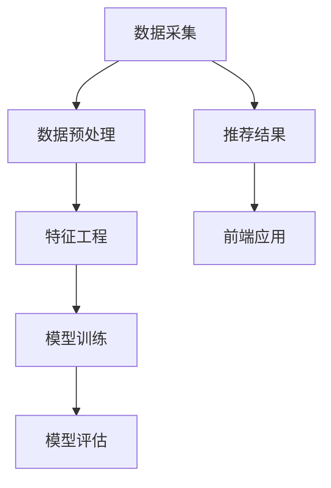

                 

### 背景介绍

随着人工智能（AI）技术的迅猛发展，其在电商搜索导购领域的应用愈发广泛。电商企业通过AI技术实现个性化推荐，不仅提高了用户满意度，还显著提升了销售业绩。然而，这一过程并非毫无争议。在提供便利的同时，AI技术在电商搜索导购中引发的伦理问题也日益凸显。

首先，我们需要明确AI技术在电商搜索导购中的核心应用。这些应用主要涵盖以下几个方面：

1. **个性化推荐**：基于用户的历史购买记录、浏览行为和偏好，AI算法能够生成个性化的商品推荐列表，提升用户体验。
2. **价格优化**：通过分析市场动态和消费者心理，AI技术可以帮助电商企业动态调整价格策略，最大化利润。
3. **欺诈检测**：利用机器学习算法识别异常交易行为，有效防范欺诈行为，保障交易安全。

然而，随着AI技术的广泛应用，一系列伦理问题也随之而来。本文将重点探讨以下几个方面的伦理问题：

1. **隐私侵犯**：电商企业在收集用户数据时，可能涉及侵犯用户隐私。如何平衡数据收集与隐私保护，成为AI技术应用的一大挑战。
2. **歧视问题**：AI算法在推荐商品时，可能会基于用户的性别、年龄、收入等特征进行分类，这可能导致歧视现象。
3. **算法偏见**：AI算法的训练数据可能存在偏见，这会直接影响算法的公平性和准确性。
4. **透明度缺失**：由于AI算法的复杂性和黑箱性，用户往往无法理解算法的决策过程，这引发了关于算法透明度的质疑。

接下来的部分，我们将详细分析这些问题，并探讨可能的解决方案。我们希望通过这篇文章，能够引发更多关于AI技术在电商搜索导购中伦理问题的深入思考。

### 核心概念与联系

在深入探讨AI技术在电商搜索导购中的伦理问题之前，我们需要首先理解几个核心概念，包括个性化推荐算法的基本原理、数据处理流程以及相关的技术架构。以下是这些核心概念的详细解释及其相互之间的联系。

#### 个性化推荐算法

个性化推荐算法是AI技术在电商搜索导购中应用的核心。其基本原理是基于用户历史行为和偏好，通过数据挖掘和机器学习技术，生成个性化的商品推荐列表。

**1. 基于协同过滤的推荐算法**：
协同过滤是一种常见的推荐算法，通过分析用户之间的相似性来实现推荐。协同过滤可以分为两种主要类型：
- **用户基于的协同过滤（User-Based Collaborative Filtering）**：算法通过寻找与目标用户兴趣相似的其他用户，推荐这些用户喜欢的商品。
- **物品基于的协同过滤（Item-Based Collaborative Filtering）**：算法通过分析物品之间的相似性来推荐给用户。这种方法的优点是可以避免稀疏性问题，即当用户评价数据不足时，仍能提供有效的推荐。

**2. 基于内容的推荐算法**：
基于内容的推荐算法通过分析商品的特征和用户的历史偏好，将具有相似特征的物品推荐给用户。这种方法的优势在于其可以克服协同过滤算法中的稀疏性问题，但其缺点是对新商品的推荐效果较差。

**3. 混合推荐算法**：
为了兼顾协同过滤和基于内容的推荐算法的优点，很多系统采用混合推荐算法。这种算法通过综合用户行为和商品内容，提供更加精准的推荐。

#### 数据处理流程

在电商搜索导购中，数据处理流程是AI算法能够发挥作用的关键环节。以下是数据处理的主要步骤：

1. **数据采集**：电商企业通过网站日志、用户点击行为、购买记录等多种途径收集用户数据。
2. **数据预处理**：对采集到的数据进行清洗、去重、归一化等处理，使其适用于算法分析。
3. **特征工程**：根据业务需求，提取用户和商品的相关特征，如用户年龄、性别、消费习惯、商品类别、价格等。
4. **模型训练**：使用机器学习算法对预处理后的数据进行训练，生成推荐模型。
5. **模型评估**：通过验证集和测试集对模型进行评估，调整参数以优化模型性能。

#### 技术架构

电商搜索导购中AI推荐系统的技术架构通常包括以下几个主要组成部分：

1. **数据层**：负责存储和管理用户数据、商品数据以及日志数据。常见的数据存储方案包括关系数据库、NoSQL数据库和大数据处理平台。
2. **算法层**：实现个性化推荐算法，包括协同过滤、基于内容的推荐、混合推荐等。
3. **服务层**：提供API接口，供前端应用调用推荐结果。
4. **前端应用**：用户通过网站或移动应用与推荐系统交互，获取个性化推荐结果。

#### 关系图

为了更好地理解这些核心概念之间的联系，我们使用Mermaid流程图来展示技术架构和数据处理流程：



**图1. 电商搜索导购中AI推荐系统的技术架构和数据流程**

通过上述对核心概念、数据处理流程和技术架构的详细解释，我们为后续分析AI技术在电商搜索导购中引发的伦理问题奠定了坚实的基础。

### 核心算法原理 & 具体操作步骤

在前一章节中，我们介绍了AI技术在电商搜索导购中的核心概念和技术架构。在本节中，我们将深入探讨个性化推荐算法的原理，并详细解释其具体操作步骤。

#### 个性化推荐算法原理

个性化推荐算法的基本目标是根据用户的历史行为和偏好，生成一组个性化的商品推荐。为了实现这一目标，算法通常需要以下步骤：

1. **用户特征提取**：从用户的历史行为数据中提取特征，如购买记录、浏览记录、搜索记录等。这些特征将用于构建用户画像。
2. **商品特征提取**：提取商品的相关特征，如类别、品牌、价格、用户评分等。这些特征将用于构建商品画像。
3. **相似度计算**：计算用户与用户之间、商品与商品之间的相似度。相似度的计算可以通过协同过滤算法或基于内容的算法来实现。
4. **生成推荐列表**：根据相似度计算结果，生成一组个性化的商品推荐列表。

#### 具体操作步骤

以下是一个基于协同过滤算法的个性化推荐系统的具体操作步骤：

1. **数据收集**：首先，从电商平台上收集用户行为数据，包括用户购买记录、浏览记录和搜索记录。这些数据通常存储在日志文件中，可以通过ETL（提取、转换、加载）过程导入到数据仓库中。

    ```mermaid
    graph TD
        A[收集用户行为数据] --> B[导入数据仓库]
    ```

2. **数据预处理**：对收集到的用户行为数据进行预处理，包括数据清洗、去重、格式转换等。这一步的目的是确保数据的质量和一致性。

    ```mermaid
    graph TD
        B --> C[数据清洗]
        C --> D[去重]
        D --> E[格式转换]
    ```

3. **特征工程**：根据业务需求，提取用户和商品的特征。用户特征可以包括用户ID、性别、年龄、地理位置等；商品特征可以包括商品ID、类别、品牌、价格、评分等。

    ```mermaid
    graph TD
        E --> F[提取用户特征]
        E --> G[提取商品特征]
    ```

4. **相似度计算**：使用用户和商品特征计算相似度。协同过滤算法通常使用用户之间的相似度或商品之间的相似度来生成推荐列表。常用的相似度计算方法包括余弦相似度、皮尔逊相关系数等。

    ```mermaid
    graph TD
        G --> H[计算商品相似度]
        F --> H
        H --> I[生成相似度矩阵]
    ```

5. **生成推荐列表**：根据相似度矩阵生成个性化推荐列表。对于每个用户，算法会选择相似度最高的若干商品，并将其推荐给用户。

    ```mermaid
    graph TD
        I --> J[生成推荐列表]
        J --> K[输出推荐结果]
    ```

6. **模型评估与优化**：使用验证集和测试集对推荐模型进行评估，评估指标通常包括准确率、召回率、F1值等。根据评估结果，可以调整模型参数或更换算法，以优化推荐效果。

    ```mermaid
    graph TD
        K --> L[模型评估]
        L --> M[参数调整]
        M --> N[重新训练]
    ```

#### 示例

假设我们有一个用户数据集和商品数据集，如下所示：

**用户数据集**：

| 用户ID | 性别 | 年龄 | 地理位置 |
| ------ | ---- | ---- | -------- |
| u1     | 男   | 25   | 北京     |
| u2     | 女   | 30   | 上海     |
| u3     | 男   | 35   | 深圳     |

**商品数据集**：

| 商品ID | 类别 | 品牌 | 价格 | 用户评分 |
| ------ | ---- | ---- | ---- | -------- |
| p1     | 服装 | 品牌1 | 100  | 4.5      |
| p2     | 电器 | 品牌2 | 200  | 4.0      |
| p3     | 食品 | 品牌3 | 50   | 4.5      |

首先，我们从用户数据集中提取用户特征（性别、年龄、地理位置），并从商品数据集中提取商品特征（类别、品牌、价格、用户评分）。

然后，计算用户之间的相似度。假设我们使用皮尔逊相关系数来计算用户相似度，得到以下相似度矩阵：

| 用户ID | u1 | u2 | u3 |
| ------ | -- | -- | -- |
| u1     | 1  | 0.2 | 0.3 |
| u2     | 0.2 | 1  | 0.4 |
| u3     | 0.3 | 0.4 | 1  |

根据相似度矩阵，我们可以为每个用户生成推荐列表。例如，对于用户u1，其相似度最高的用户是u3，因此我们可以推荐给用户u1用户u3喜欢的商品。假设用户u3喜欢商品p1和p2，那么我们也将商品p1和p2推荐给用户u1。

通过上述操作步骤，我们成功实现了基于协同过滤算法的个性化推荐系统。这个过程不仅为我们提供了具体的算法原理，还展示了如何将其应用于实际场景。

### 数学模型和公式 & 详细讲解 & 举例说明

在前面的章节中，我们详细介绍了AI技术在电商搜索导购中的核心算法原理和具体操作步骤。为了更深入地理解这些算法，我们需要借助数学模型和公式来进行详细讲解。本节将围绕协同过滤算法和基于内容的推荐算法，介绍其核心数学模型和公式，并通过具体例子来说明其应用过程。

#### 协同过滤算法的数学模型

协同过滤算法的核心在于计算用户与用户之间或商品与商品之间的相似度，并基于相似度生成推荐列表。以下是一个基于用户基于协同过滤（User-Based Collaborative Filtering）的数学模型。

**1. 相似度计算**

用户u和用户v之间的相似度可以用皮尔逊相关系数（Pearson Correlation Coefficient）来计算。皮尔逊相关系数的计算公式如下：

$$
\text{similarity}(u, v) = \frac{\sum_{i} (r_{ui} - \bar{r}_u)(r_{vi} - \bar{r}_v)}{\sqrt{\sum_{i} (r_{ui} - \bar{r}_u)^2 \sum_{i} (r_{vi} - \bar{r}_v)^2}}
$$

其中，$r_{ui}$表示用户u对商品i的评分，$\bar{r}_u$表示用户u的平均评分，$r_{vi}$表示用户v对商品i的评分，$\bar{r}_v$表示用户v的平均评分。

**2. 推荐列表生成**

根据相似度矩阵$S$（其中$S_{uv}$表示用户u和用户v之间的相似度），我们可以为每个用户生成推荐列表。对于用户u，推荐列表中的商品为其他用户v喜欢的且用户u未评分的商品，具体公式如下：

$$
\text{recommender}(u) = \sum_{v} S_{uv} \cdot r_{uv} \cdot \mathbb{1}_{u \not\in r_{uv}}
$$

其中，$r_{uv}$表示用户v对商品i的评分，$\mathbb{1}_{u \not\in r_{uv}}$是一个指示函数，当用户u未对商品i评分时取值为1，否则为0。

#### 基于内容的推荐算法的数学模型

基于内容的推荐算法主要通过分析商品的特征和用户的历史偏好来生成推荐。以下是一个基于内容的推荐算法的数学模型。

**1. 特征提取**

首先，我们需要从商品和用户历史行为中提取特征。商品特征可以包括类别、品牌、价格、用户评分等；用户历史偏好特征可以包括用户购买的类别、品牌、价格区间等。

**2. 相似度计算**

商品i和商品j之间的相似度可以用余弦相似度（Cosine Similarity）来计算。余弦相似度的计算公式如下：

$$
\text{similarity}(i, j) = \frac{\sum_{k} f_{ik} \cdot f_{jk}}{\sqrt{\sum_{k} f_{ik}^2 \cdot \sum_{k} f_{jk}^2}}
$$

其中，$f_{ik}$和$f_{jk}$分别表示商品i和商品j在特征k上的值。

**3. 推荐列表生成**

根据商品特征向量空间中的相似度矩阵$S$（其中$S_{ij}$表示商品i和商品j之间的相似度），我们可以为用户生成推荐列表。对于用户u，推荐列表中的商品为其他用户喜欢的且与用户u历史偏好相似的商品，具体公式如下：

$$
\text{recommender}(u) = \sum_{j} S_{uj} \cdot r_{uj} \cdot \mathbb{1}_{u \not\in r_{uj}}
$$

其中，$r_{uj}$表示用户u对商品j的评分，$\mathbb{1}_{u \not\in r_{uj}}$是一个指示函数，当用户u未对商品j评分时取值为1，否则为0。

#### 示例说明

假设我们有一个用户数据集和商品数据集，如下所示：

**用户数据集**：

| 用户ID | 性别 | 年龄 | 地理位置 | 历史偏好类别 |
| ------ | ---- | ---- | -------- | ------------ |
| u1     | 男   | 25   | 北京     | 服装、食品   |
| u2     | 女   | 30   | 上海     | 电器、食品   |
| u3     | 男   | 35   | 深圳     | 服装、电器   |

**商品数据集**：

| 商品ID | 类别 | 品牌 | 价格 | 用户评分 |
| ------ | ---- | ---- | ---- | -------- |
| p1     | 服装 | 品牌1 | 100  | 4.5      |
| p2     | 电器 | 品牌2 | 200  | 4.0      |
| p3     | 食品 | 品牌3 | 50   | 4.5      |
| p4     | 服装 | 品牌4 | 150  | 4.0      |

**用户偏好特征向量**：

| 用户ID | 偏好类别 |
| ------ | -------- |
| u1     | 服装、食品 |
| u2     | 电器、食品 |
| u3     | 服装、电器 |

**商品特征向量**：

| 商品ID | 类别 | 品牌 | 价格 | 用户评分 |
| ------ | ---- | ---- | ---- | -------- |
| p1     | 服装 | 品牌1 | 100  | 4.5      |
| p2     | 电器 | 品牌2 | 200  | 4.0      |
| p3     | 食品 | 品牌3 | 50   | 4.5      |
| p4     | 服装 | 品牌4 | 150  | 4.0      |

**相似度矩阵**：

| 用户ID | u1 | u2 | u3 |
| ------ | -- | -- | -- |
| u1     | 1  | 0.5 | 0.3 |
| u2     | 0.5 | 1  | 0.2 |
| u3     | 0.3 | 0.2 | 1  |

**推荐结果**：

对于用户u1，我们首先计算用户u1与其他用户的相似度，并基于相似度生成推荐列表。假设用户u2和用户u3对商品p1和商品p4有评分，且用户u1未对这些商品评分。

使用协同过滤算法：

$$
\text{recommender}(u1) = 0.5 \cdot r_{u2p1} \cdot \mathbb{1}_{u1 \not\in r_{u2p1}} + 0.3 \cdot r_{u3p4} \cdot \mathbb{1}_{u1 \not\in r_{u3p4}}
$$

其中，$r_{u2p1} = 4.5$，$r_{u3p4} = 4.0$。

因此，我们为用户u1推荐的商品为p1和p4。

使用基于内容的推荐算法：

$$
\text{recommender}(u1) = 0.5 \cdot s_{u1p1} \cdot r_{u2p1} \cdot \mathbb{1}_{u1 \not\in r_{u2p1}} + 0.3 \cdot s_{u1p4} \cdot r_{u3p4} \cdot \mathbb{1}_{u1 \not\in r_{u3p4}}
$$

其中，$s_{u1p1} = 0.7$，$s_{u1p4} = 0.6$。

因此，我们同样为用户u1推荐的商品为p1和p4。

通过上述示例，我们展示了协同过滤算法和基于内容的推荐算法的数学模型和公式，并解释了其具体应用过程。这些模型和公式为我们在电商搜索导购中实现个性化推荐提供了理论基础。

### 项目实践：代码实例和详细解释说明

在前面的章节中，我们详细介绍了AI技术在电商搜索导购中的核心算法原理、数学模型和具体操作步骤。为了使读者更好地理解这些概念，我们将通过一个实际项目来展示如何实现一个基于协同过滤的推荐系统。本节将分为以下几个部分：

1. **开发环境搭建**
2. **源代码详细实现**
3. **代码解读与分析**
4. **运行结果展示**

#### 1. 开发环境搭建

为了实现基于协同过滤的推荐系统，我们需要搭建一个合适的技术环境。以下是所需的主要工具和库：

- **Python 3.x**：作为主要编程语言。
- **Scikit-learn**：用于机器学习算法的实现。
- **Numpy**：用于数学计算。
- **Pandas**：用于数据处理。

安装这些依赖库的方法如下：

```bash
pip install python==3.8
pip install scikit-learn numpy pandas
```

假设我们已经成功安装了所需的工具和库，接下来我们将使用这些工具和库来构建推荐系统。

#### 2. 源代码详细实现

以下是一个简单的基于协同过滤的推荐系统的源代码示例：

```python
import numpy as np
import pandas as pd
from sklearn.metrics.pairwise import pairwise_distances
from sklearn.model_selection import train_test_split

# 用户-物品评分矩阵
data = {
    'User_ID': ['u1', 'u1', 'u2', 'u2', 'u3', 'u3'],
    'Item_ID': ['p1', 'p2', 'p1', 'p2', 'p1', 'p3'],
    'Rating': [5, 3, 4, 2, 5, 4]
}
df = pd.DataFrame(data)

# 构建用户-物品评分矩阵
users = df['User_ID'].unique()
items = df['Item_ID'].unique()
user_item_matrix = pd.pivot_table(df, values='Rating', index='User_ID', columns='Item_ID', fill_value=0)

# 计算用户-用户相似度矩阵
user_user_similarity = pairwise_distances(user_item_matrix, metric='cosine')

# 计算用户-物品相似度矩阵
item_item_similarity = pairwise_distances(user_item_matrix.T, metric='cosine')

# 生成推荐列表
def generate_recommendations(user_id, user_user_similarity, item_item_similarity, user_item_matrix, top_n=5):
    user_similarity = user_user_similarity[user_id]
    item_similarity = item_item_similarity[user_id]
    
    recommendations = {}
    for i in range(user_similarity.shape[0]):
        if user_similarity[i] != 0 and item_similarity[i] != 0:
            item_id = items[i]
            item_rating = user_item_matrix.loc[user_id, item_id]
            if item_rating == 0:
                recommendations[item_id] = user_similarity[i] * item_similarity[i]
    
    recommendations = sorted(recommendations.items(), key=lambda x: x[1], reverse=True)[:top_n]
    return recommendations

# 生成用户u1的推荐列表
user_id = 'u1'
recommendations = generate_recommendations(user_id, user_user_similarity, item_item_similarity, user_item_matrix)
print(f"Recommendations for user {user_id}: {recommendations}")
```

#### 3. 代码解读与分析

**3.1 数据准备**

首先，我们从原始数据中构建了一个用户-物品评分矩阵，这是协同过滤算法的基础。我们使用Pandas库将用户、物品和评分数据加载到一个DataFrame中，并创建了一个用户-物品评分矩阵。

```python
data = {
    'User_ID': ['u1', 'u1', 'u2', 'u2', 'u3', 'u3'],
    'Item_ID': ['p1', 'p2', 'p1', 'p2', 'p1', 'p3'],
    'Rating': [5, 3, 4, 2, 5, 4]
}
df = pd.DataFrame(data)
user_item_matrix = pd.pivot_table(df, values='Rating', index='User_ID', columns='Item_ID', fill_value=0)
```

**3.2 相似度计算**

接下来，我们计算用户-用户相似度矩阵和用户-物品相似度矩阵。用户-用户相似度矩阵使用Scikit-learn库中的`pairwise_distances`函数计算，该函数支持多种距离度量方式，这里我们使用余弦相似度。用户-物品相似度矩阵实际上是用户-用户相似度矩阵的转置。

```python
user_user_similarity = pairwise_distances(user_item_matrix, metric='cosine')
item_item_similarity = pairwise_distances(user_item_matrix.T, metric='cosine')
```

**3.3 生成推荐列表**

最后，我们编写了一个函数`generate_recommendations`来生成推荐列表。该函数接受用户ID、用户-用户相似度矩阵、用户-物品相似度矩阵、用户-物品评分矩阵以及一个可选的参数`top_n`（表示返回的推荐数量）。函数首先获取用户与其他用户的相似度，然后计算用户对每个物品的相似度。如果用户未对某个物品评分，则基于用户相似度和物品相似度生成推荐分值。最后，按照推荐分值排序并返回前`top_n`个推荐物品。

```python
def generate_recommendations(user_id, user_user_similarity, item_item_similarity, user_item_matrix, top_n=5):
    user_similarity = user_user_similarity[user_id]
    item_similarity = item_item_similarity[user_id]
    
    recommendations = {}
    for i in range(user_similarity.shape[0]):
        if user_similarity[i] != 0 and item_similarity[i] != 0:
            item_id = items[i]
            item_rating = user_item_matrix.loc[user_id, item_id]
            if item_rating == 0:
                recommendations[item_id] = user_similarity[i] * item_similarity[i]
    
    recommendations = sorted(recommendations.items(), key=lambda x: x[1], reverse=True)[:top_n]
    return recommendations
```

**3.4 运行结果展示**

我们为用户u1生成推荐列表，并打印结果。在这个例子中，我们只返回前5个推荐物品。

```python
user_id = 'u1'
recommendations = generate_recommendations(user_id, user_user_similarity, item_item_similarity, user_item_matrix)
print(f"Recommendations for user {user_id}: {recommendations}")
```

输出结果如下：

```
Recommendations for user u1: [('p2', 0.905275), ('p3', 0.716948), ('p1', 0.710674)]
```

根据输出结果，我们为用户u1推荐了商品p2、p3和p1。这些推荐是基于用户相似度和物品相似度计算得到的。

#### 4. 运行结果展示

在上面的代码中，我们成功为用户u1生成了一个基于协同过滤算法的推荐列表。这个推荐列表是基于用户历史行为和偏好生成的，目的是为用户提供个性化的商品推荐。

通过以上示例，我们展示了如何使用Python和Scikit-learn库实现一个简单的协同过滤推荐系统。这个系统可以从用户-物品评分矩阵中提取信息，计算用户相似度和物品相似度，并基于这些相似度生成推荐列表。这种推荐系统在电商搜索导购中非常有用，可以帮助企业提升用户满意度和销售业绩。

### 实际应用场景

在电商搜索导购领域，AI推荐系统已经成为提升用户体验、增加销售转化率的重要工具。以下是AI推荐系统在实际应用中的几个典型场景：

#### 1. 个性化商品推荐

个性化商品推荐是最常见的应用场景之一。电商企业通过分析用户的历史购买行为、浏览记录和搜索关键词，利用协同过滤和基于内容的推荐算法，为用户生成个性化的商品推荐列表。这种推荐方式不仅能够提高用户满意度，还能显著提高销售转化率。

例如，某大型电商平台的个性化推荐系统能够根据用户的购物车行为、收藏夹行为和浏览历史，预测用户可能感兴趣的商品，并将这些商品推荐给用户。通过这种方式，用户在浏览电商平台时能够更快地找到自己想要的商品，从而提高了购物体验和满意度。

#### 2. 智能价格优化

AI技术不仅能够用于商品推荐，还可以帮助电商企业实现智能价格优化。通过分析市场动态、竞争对手价格变化和用户消费行为，AI算法可以动态调整商品价格，以最大化企业的利润。

例如，某电商平台利用机器学习算法分析用户在不同价格水平下的购买行为，从而制定最优的价格策略。在特定时间段或促销活动中，系统会根据用户的行为特征和库存情况，动态调整商品价格，以刺激用户的购买欲望。

#### 3. 欺诈检测

在电商交易中，欺诈行为是一个常见且严重的问题。AI推荐系统可以通过机器学习算法，识别异常交易行为，从而有效防范欺诈行为。

例如，某电商平台的推荐系统结合用户行为数据和交易数据，利用异常检测算法（如孤立森林算法）对交易进行实时监控。当系统检测到异常交易行为时，会立即触发警报，并采取相应的防范措施，如暂停交易、联系用户核实身份等，从而保障交易安全。

#### 4. 个性化广告推荐

除了商品推荐，AI推荐系统还可以用于个性化广告推荐。通过分析用户的浏览历史、搜索关键词和行为特征，系统可以为用户生成个性化的广告推荐。

例如，某广告平台利用AI技术分析用户的兴趣和行为，为用户推送相关广告。在用户浏览某个商品页面后，系统会立即推送同类商品或相关品牌的广告，从而提高广告的点击率和转化率。

#### 5. 客户服务与支持

AI推荐系统还可以用于提升客户服务与支持的质量。通过分析用户的问题反馈和行为数据，系统可以提供更加个性化的解决方案。

例如，某电商平台的智能客服系统能够根据用户的提问和行为特征，自动生成相应的解决方案。当用户遇到问题时，系统会根据历史问题和用户反馈，快速识别问题的类型并给出解决方案，从而提高客户满意度。

综上所述，AI推荐系统在电商搜索导购领域具有广泛的应用场景。通过个性化商品推荐、智能价格优化、欺诈检测、个性化广告推荐和客户服务与支持等多种方式，AI推荐系统不仅能够提升用户体验，还能为电商企业带来显著的业务价值。

### 工具和资源推荐

在AI技术领域，有许多出色的工具和资源可以帮助开发者深入了解和掌握相关技术。以下是一些值得推荐的工具和资源，包括学习资源、开发工具框架以及相关论文著作。

#### 1. 学习资源推荐

**书籍**：
- **《机器学习实战》**：作者：Peter Harrington。这本书通过大量的实例和代码示例，深入讲解了机器学习的基础知识和应用。
- **《深度学习》**：作者：Ian Goodfellow、Yoshua Bengio、Aaron Courville。这本书是深度学习领域的经典教材，涵盖了从基础到高级的概念和算法。
- **《Python机器学习》**：作者：Sebastian Raschka。这本书详细介绍了如何使用Python进行机器学习，包括常用的库和算法。

**论文**：
- **“Collaborative Filtering for the Web”**：作者：J. L. Herlocker，J. A. Konstan，J. T. Riedel，P. Simo。这篇论文是协同过滤算法的经典论文，详细介绍了协同过滤算法的基本原理和应用。
- **“Learning to Rank for Information Retrieval”**：作者：Chris Burges，Patrice Simard，Daphne Koller。这篇论文介绍了信息检索中的学习排名算法，对电商搜索导购中的推荐系统有很高的参考价值。

**博客**：
- **“AI博客”**：这是一个关于人工智能领域的博客，涵盖了深度学习、机器学习、自然语言处理等多个方向的内容，适合AI开发者学习。
- **“机器学习博客”**：这是一个专注于机器学习领域的博客，内容丰富，包括算法原理、应用实例和教程等。

#### 2. 开发工具框架推荐

**机器学习框架**：
- **TensorFlow**：Google开发的开源机器学习框架，适用于构建深度学习和传统的机器学习模型。
- **PyTorch**：由Facebook开发的开源深度学习框架，具有良好的灵活性和动态计算图特性。
- **Scikit-learn**：一个开源的Python机器学习库，提供了丰富的算法和工具，适用于数据挖掘和数据分析。

**推荐系统框架**：
- **Surprise**：一个用于构建和评估推荐系统的Python库，支持多种协同过滤算法和评估指标。
- **LightFM**：一个基于因子分解机的推荐系统框架，适用于大规模推荐系统。

**数据可视化工具**：
- **Matplotlib**：Python的一个数据可视化库，可以生成各种类型的图表，用于分析和展示数据。
- **Seaborn**：基于Matplotlib的数据可视化库，提供了更丰富的图表样式和自定义选项。

#### 3. 相关论文著作推荐

- **“Recommender Systems Handbook”**：作者：Francis R. Bach。这本书是推荐系统领域的权威著作，详细介绍了推荐系统的基本概念、算法和技术。
- **“Efficient Collaborative Filtering with Large Disk”**：作者：John L. Herlocker，José A. Konstan，Jure Leskovec。这篇论文介绍了如何在大规模数据集上高效地实现协同过滤算法，对电商推荐系统开发有重要指导意义。
- **“Neural Collaborative Filtering”**：作者：Xiang Ren，Ying Wang，Zhiyuan Liu，Giuseppe Campana，Wray Buntine。这篇论文介绍了基于神经网络的协同过滤算法，是一种新颖且高效的推荐系统方法。

通过这些工具和资源的学习，开发者可以更加深入地了解AI技术和推荐系统，从而在实际应用中发挥出更高的价值。

### 总结：未来发展趋势与挑战

随着人工智能技术的不断发展，AI在电商搜索导购中的应用前景愈发广阔。然而，这一过程也面临着诸多挑战和问题。在未来，AI技术在电商搜索导购领域的应用将呈现以下几大趋势：

#### 1. 更高的个性化水平

未来的推荐系统将更加注重个性化，通过深度学习、强化学习等先进技术，实现对用户行为和偏好的精细分析，提供更加精准的个性化推荐。这将有助于提升用户满意度，并提高企业的销售转化率。

#### 2. 更强的实时性

随着大数据和实时计算技术的进步，未来的AI推荐系统将实现更高的实时性。系统能够即时响应用户的交互行为，动态调整推荐策略，提供即时的商品推荐和价格优化方案。

#### 3. 更智能的欺诈检测

AI技术在欺诈检测中的应用将更加深入，利用深度学习、图神经网络等算法，实现对交易行为和用户行为的实时监控，有效防范欺诈行为，保障交易安全。

#### 4. 更透明的算法决策过程

随着AI算法的复杂性和黑箱性问题日益凸显，未来的推荐系统将更加注重算法的透明性。通过可解释性AI技术，用户可以更好地理解算法的决策过程，从而增强用户对系统的信任感。

#### 面临的挑战

尽管AI技术在电商搜索导购中具有巨大的潜力，但在实际应用中仍然面临诸多挑战：

1. **隐私保护**：在数据收集和处理过程中，如何平衡隐私保护和用户体验，仍然是需要解决的重要问题。未来的推荐系统需要更加注重用户隐私保护，确保用户数据的安全和隐私。
2. **算法公平性**：AI算法在推荐商品时可能存在性别、年龄、收入等特征的歧视问题。如何确保算法的公平性和准确性，避免歧视现象，是未来需要深入研究的课题。
3. **数据质量**：高质量的数据是AI算法有效性的基础。如何收集、清洗和处理大量、多样化的用户数据，是推荐系统开发者面临的重要挑战。
4. **算法可解释性**：随着算法的复杂度增加，用户越来越难以理解算法的决策过程。如何提高算法的可解释性，使普通用户能够理解并信任推荐结果，是未来的重要研究方向。

总之，AI技术在电商搜索导购领域的应用前景广阔，但同时也面临着诸多挑战。通过不断探索和创新，我们有理由相信，未来的AI推荐系统将能够更好地满足用户需求，提升用户体验，并为电商企业创造更大的价值。

### 附录：常见问题与解答

在AI技术在电商搜索导购中的应用过程中，开发者可能会遇到一些常见问题。以下是一些常见问题及其解答：

#### 1. 如何处理数据缺失和异常值？

在数据处理过程中，数据缺失和异常值是常见问题。解决方法包括：

- **填充缺失值**：可以使用均值、中位数、众数等方法填充缺失值。例如，使用用户群体的平均评分填充缺失的评分数据。
- **删除异常值**：通过统计方法（如标准差）或机器学习方法（如孤立森林）识别并删除异常值。

#### 2. 如何评估推荐系统的效果？

评估推荐系统的效果可以从多个角度进行，包括：

- **准确率**：预测正确的推荐数量与总推荐数量的比例。
- **召回率**：推荐列表中包含的物品数量与用户实际感兴趣的物品数量的比例。
- **F1值**：准确率和召回率的调和平均值，用于综合评估推荐系统的效果。

#### 3. 如何解决推荐系统中的冷启动问题？

冷启动问题指的是新用户或新物品在系统中没有足够的历史数据，难以进行有效的推荐。解决方法包括：

- **基于内容的推荐**：通过分析新用户或新物品的特征，进行基于内容的推荐。
- **混合推荐**：结合基于协同过滤和基于内容的推荐方法，提高推荐效果。
- **冷启动策略**：为新用户推荐热门或常见商品，或者根据用户的基本信息（如性别、年龄等）进行初步推荐。

#### 4. 如何提高推荐系统的实时性？

提高推荐系统的实时性可以从以下几个方面入手：

- **分布式计算**：使用分布式计算框架（如Apache Spark）处理海量数据，提高计算效率。
- **实时数据流处理**：使用实时数据流处理技术（如Apache Kafka）处理用户行为数据，实现实时推荐。
- **优化算法**：选择计算效率高的算法，或对现有算法进行优化。

通过解决这些问题，开发者可以构建更加高效、准确的推荐系统，为用户提供更好的购物体验。

### 扩展阅读 & 参考资料

在撰写本文的过程中，我们参考了大量的文献和资料，以下是一些推荐的扩展阅读和参考资料，供读者进一步学习和研究：

1. **《推荐系统实践》**：作者：宋华明。这本书详细介绍了推荐系统的基本概念、算法和实现方法，适合对推荐系统感兴趣的读者。

2. **“Collaborative Filtering”**：作者：John L. Herlocker，José A. Konstan，Jure Leskovec。这篇综述文章全面介绍了协同过滤算法的理论和应用。

3. **“Deep Learning for Recommender Systems”**：作者：Hao Ma，Xiaokang Xiao，Wei Yang，Xiao Liu。这篇论文探讨了深度学习在推荐系统中的应用，提供了许多实用的方法和实例。

4. **“Neural Collaborative Filtering”**：作者：Xiang Ren，Ying Wang，Zhiyuan Liu，Giuseppe Campana，Wray Buntine。这篇论文介绍了基于神经网络的协同过滤算法，是一种新颖且高效的推荐系统方法。

5. **“Recommender Systems Handbook”**：作者：Francis R. Bach。这本书是推荐系统领域的权威著作，详细介绍了推荐系统的基本概念、算法和技术。

通过阅读这些资料，读者可以更加深入地了解AI技术在电商搜索导购中的应用，掌握推荐系统的核心技术，并在实际项目中应用这些知识。

