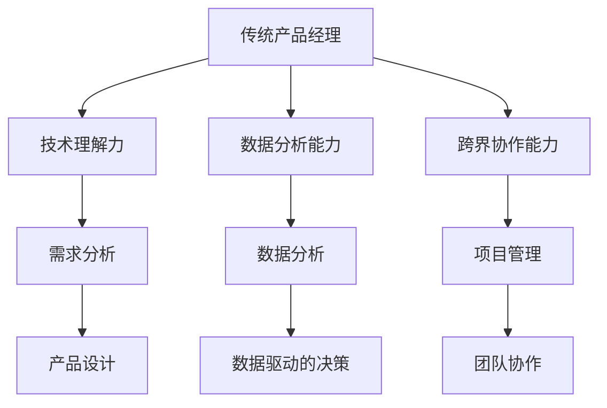

                 

### 1. 背景介绍

在当今快速发展的科技时代，人工智能（AI）已经成为推动创新和产业升级的重要力量。AI 领域的突破性进展，如深度学习、自然语言处理、计算机视觉等，不仅为各个行业带来了前所未有的变革，也催生了大量新兴创业公司。在这种背景下，产品经理（PM）的角色变得愈加重要。他们需要理解技术，把握市场趋势，并有效协调团队，推动产品从构思到市场的全过程。

然而，随着AI技术的不断成熟和普及，传统产品经理面临的挑战也越来越大。一方面，他们需要具备一定的技术背景，以便更好地理解和推动AI驱动的产品开发。另一方面，他们必须适应快速变化的市场环境，不断更新自己的知识体系和技能。

为了在AI时代取得成功，产品经理必须进行转型。他们需要从传统的需求分析、项目管理等角色，转变为具备深度技术理解和市场洞察的综合型人才。这包括掌握AI技术的基本原理，了解大数据分析的方法，以及具备数据驱动的决策能力。

本文将深入探讨AI驱动时代产品经理的转型路径，分析其核心技能要求，并探讨实际应用场景和未来发展趋势。希望通过本文的探讨，为产品经理提供有价值的指导和借鉴。

### 2. 核心概念与联系

#### 2.1 AI技术的基本原理

人工智能（AI）是一门模拟、延伸和扩展人类智能的科学。其核心在于通过算法和计算，让计算机具备自主学习和解决问题的能力。AI技术的基本原理包括以下几个方面：

- **机器学习**：通过训练数据集，让计算机自主学习和优化模型参数，从而实现预测和决策。主要算法包括监督学习、无监督学习和强化学习。
- **深度学习**：基于多层神经网络的模型，通过层层抽象和特征提取，实现复杂的模式识别和预测任务。代表性算法包括卷积神经网络（CNN）、循环神经网络（RNN）和生成对抗网络（GAN）。
- **自然语言处理（NLP）**：使计算机理解和生成自然语言。NLP技术包括语言模型、词嵌入、句法分析和语义理解等。

#### 2.2 大模型时代的特点

随着AI技术的快速发展，大模型时代已经到来。大模型指的是具有巨大参数量和训练数据量的模型，如GPT-3、BERT等。大模型时代的特点主要体现在以下几个方面：

- **更强的学习能力**：大模型通过大量数据进行训练，能够更好地捕获复杂的关系和模式，实现更精准的预测和决策。
- **更高的计算需求**：大模型的训练和推理需要更多的计算资源和时间，对硬件和算法提出了更高的要求。
- **更广泛的应用场景**：大模型在各个领域的应用越来越广泛，包括文本生成、图像识别、语音识别、推荐系统等。

#### 2.3 产品经理的角色转变

在AI驱动的大模型时代，产品经理的角色也发生了显著变化。传统产品经理主要关注需求分析和项目管理，而AI驱动的产品经理需要具备以下核心技能：

- **技术理解力**：能够理解AI技术的基本原理和适用场景，从而更好地推动产品创新。
- **数据分析能力**：能够利用大数据分析工具和方法，从海量数据中提取有价值的信息，指导产品决策。
- **跨界协作能力**：能够与研发、数据科学、市场等多个团队高效协作，确保产品从构思到市场的全过程顺利进行。

#### 2.4 Mermaid 流程图

以下是一个简单的Mermaid流程图，展示了AI驱动的产品经理角色转变的流程：



在这个流程图中，传统产品经理通过提升技术理解力、数据分析能力和跨界协作能力，实现了向AI驱动的产品经理的转型。这一过程不仅需要个人能力的提升，还需要跨部门和跨领域的协作，共同推动产品创新。

### 3. 核心算法原理 & 具体操作步骤

#### 3.1 机器学习算法原理

机器学习（Machine Learning, ML）是人工智能的核心技术之一，其基本原理是通过训练数据集，让计算机自主学习和优化模型参数，从而实现预测和决策。机器学习算法可以分为三大类：监督学习（Supervised Learning）、无监督学习（Unsupervised Learning）和强化学习（Reinforcement Learning）。

- **监督学习**：有标签的数据进行训练，模型根据输入特征和输出标签来学习规律，从而进行预测。常见的算法包括线性回归、逻辑回归、支持向量机（SVM）等。
- **无监督学习**：没有标签的数据进行训练，模型通过发现数据内在的结构和模式来学习。常见的算法包括聚类分析、主成分分析（PCA）等。
- **强化学习**：通过与环境交互，根据奖励和惩罚信号来学习最优策略。常见的算法包括Q-Learning、深度Q网络（DQN）等。

#### 3.2 深度学习算法原理

深度学习（Deep Learning, DL）是机器学习的一个子领域，通过多层神经网络（Neural Networks）对数据进行处理，实现复杂模式识别和预测任务。深度学习算法的核心是神经网络，其基本原理如下：

- **神经元**：神经网络的基本单元，通过加权求和并激活函数进行输出。
- **层**：神经网络由输入层、隐藏层和输出层组成，每层对数据进行处理，形成特征的层层抽象。
- **激活函数**：用于确定神经元是否被激活，常用的激活函数包括sigmoid、ReLU等。
- **反向传播**：通过误差反向传播算法，不断调整网络权重，优化模型性能。

#### 3.3 自然语言处理（NLP）算法原理

自然语言处理（Natural Language Processing, NLP）是人工智能的重要应用领域，旨在使计算机理解和生成自然语言。NLP算法主要包括以下几个步骤：

- **分词（Tokenization）**：将文本分割成词、句子等基本单元。
- **词嵌入（Word Embedding）**：将词语映射到高维向量空间，用于表示语义信息。
- **句法分析（Syntax Analysis）**：分析句子的结构，提取语法关系。
- **语义理解（Semantic Analysis）**：理解句子的含义，包括实体识别、情感分析等。
- **语言生成（Language Generation）**：根据输入信息生成自然语言文本。

#### 3.4 具体操作步骤

以下是一个简单的示例，展示如何使用Python和Scikit-learn库实现一个线性回归模型：

```python
from sklearn.linear_model import LinearRegression
from sklearn.model_selection import train_test_split
from sklearn.metrics import mean_squared_error

# 数据准备
X = [[1], [2], [3], [4], [5]]
y = [2, 4, 5, 4, 5]

# 分割数据集
X_train, X_test, y_train, y_test = train_test_split(X, y, test_size=0.2, random_state=0)

# 创建线性回归模型
model = LinearRegression()

# 训练模型
model.fit(X_train, y_train)

# 预测
y_pred = model.predict(X_test)

# 评估
mse = mean_squared_error(y_test, y_pred)
print("Mean squared error:", mse)
```

在这个示例中，我们首先准备一个简单的一元线性数据集，然后使用Scikit-learn库的线性回归模型进行训练、预测和评估。

### 4. 数学模型和公式 & 详细讲解 & 举例说明

#### 4.1 数学模型概述

在AI驱动的产品管理中，数学模型是理解和优化产品性能的关键工具。以下是一些常用的数学模型和公式，以及它们在产品管理中的应用：

- **线性回归**：用于预测线性关系的模型，其公式为：
  $$ y = \beta_0 + \beta_1x + \epsilon $$
  其中，\( y \) 是因变量，\( x \) 是自变量，\( \beta_0 \) 和 \( \beta_1 \) 是模型参数，\( \epsilon \) 是误差项。

- **逻辑回归**：用于分类问题的模型，其公式为：
  $$ P(y=1) = \frac{1}{1 + e^{-(\beta_0 + \beta_1x)}} $$
  其中，\( P(y=1) \) 是因变量为1的概率，\( e \) 是自然底数。

- **决策树**：用于分类和回归问题的模型，其核心公式是节点分裂条件，如：
  $$ Gini(\text{split}) = 1 - \sum_{i} p_i (1 - p_i) $$
  其中，\( p_i \) 是某一类别的概率。

- **支持向量机（SVM）**：用于分类问题的模型，其核心公式是：
  $$ w \cdot x + b = 0 $$
  其中，\( w \) 是权重向量，\( x \) 是特征向量，\( b \) 是偏置项。

#### 4.2 举例说明

以下是一个简单的线性回归模型的示例，用于预测房价：

```python
import numpy as np
import matplotlib.pyplot as plt
from sklearn.linear_model import LinearRegression

# 数据准备
X = np.array([[1], [2], [3], [4], [5]])
y = np.array([2, 4, 5, 4, 5])

# 分割数据集
X_train, X_test, y_train, y_test = train_test_split(X, y, test_size=0.2, random_state=0)

# 创建线性回归模型
model = LinearRegression()

# 训练模型
model.fit(X_train, y_train)

# 预测
y_pred = model.predict(X_test)

# 评估
mse = mean_squared_error(y_test, y_pred)
print("Mean squared error:", mse)

# 绘制结果
plt.scatter(X_test, y_test, color='blue')
plt.plot(X_test, y_pred, color='red')
plt.xlabel('X')
plt.ylabel('y')
plt.title('Linear Regression')
plt.show()
```

在这个示例中，我们使用Scikit-learn库的线性回归模型对房价进行预测，并通过散点图和拟合直线展示预测结果。

#### 4.3 详细讲解

- **线性回归**：线性回归模型通过找到最佳拟合直线，将自变量和因变量之间的线性关系表示出来。其公式中的 \( \beta_0 \) 和 \( \beta_1 \) 分别是拟合直线的截距和斜率，可以通过最小二乘法求解。

- **逻辑回归**：逻辑回归模型用于分类问题，通过计算概率来预测样本属于某一类别的可能性。其公式中的 \( \beta_0 \) 和 \( \beta_1 \) 可以通过最大似然估计求解。

- **决策树**：决策树模型通过一系列的判断条件来分割数据集，每个节点表示一个特征和阈值，叶子节点表示最终的预测结果。其公式中的 Gini指数用于评估节点的纯度。

- **支持向量机**：支持向量机模型通过找到一个最佳的超平面，将不同类别的样本分隔开。其公式中的 \( w \) 和 \( b \) 分别是超平面的法向量和偏置项，可以通过求解二次规划问题求解。

这些数学模型和公式在AI驱动的产品管理中发挥着重要作用，通过它们可以更准确地预测市场趋势、优化产品设计、提高用户体验等。

### 5. 项目实践：代码实例和详细解释说明

#### 5.1 开发环境搭建

在本节中，我们将搭建一个基于Python和TensorFlow的AI驱动的产品推荐系统。首先，确保已安装Python 3.7及以上版本。接下来，安装TensorFlow和相关依赖项，可以通过以下命令进行：

```bash
pip install tensorflow
pip install pandas
pip install numpy
```

#### 5.2 源代码详细实现

以下是一个简单的基于协同过滤（Collaborative Filtering）的推荐系统实现，使用TensorFlow进行模型训练和预测。

```python
import tensorflow as tf
import pandas as pd
import numpy as np

# 数据准备
ratings_data = pd.read_csv('ratings.csv')
users, items = ratings_data['userId'].unique(), ratings_data['itemId'].unique()

# 建立用户-物品矩阵
user_item_matrix = pd.pivot_table(ratings_data, values='rating', index='userId', columns='itemId')

# 缺失值填充
user_item_matrix = user_item_matrix.fillna(0)

# 转换为TensorFlow张量
user_item_tensor = tf.convert_to_tensor(user_item_matrix.values, dtype=tf.float32)

# 创建模型
model = tf.keras.Sequential([
    tf.keras.layers.Dense(128, activation='relu', input_shape=(len(items),)),
    tf.keras.layers.Dense(64, activation='relu'),
    tf.keras.layers.Dense(1)
])

# 编译模型
model.compile(optimizer='adam', loss='mse', metrics=['accuracy'])

# 训练模型
model.fit(user_item_tensor, user_item_tensor, epochs=10, batch_size=32)

# 预测
predictions = model.predict(user_item_tensor)

# 评估
mse = tf.reduce_mean(tf.square(predictions - user_item_tensor))
print("Mean squared error:", mse.numpy())

# 输出预测结果
print(predictions.numpy())
```

#### 5.3 代码解读与分析

- **数据准备**：首先，我们读取包含用户评分数据的CSV文件，并提取用户ID和物品ID。
- **用户-物品矩阵构建**：使用Pandas库的pivot_table函数构建用户-物品评分矩阵，并填充缺失值为0。
- **TensorFlow张量转换**：将用户-物品矩阵转换为TensorFlow张量，以便进行后续的模型训练和预测。
- **模型创建**：使用TensorFlow的Sequential模型创建一个包含三层全连接神经网络的推荐系统模型。
- **模型编译**：配置模型优化器、损失函数和评价指标。
- **模型训练**：使用fit方法训练模型，对用户-物品矩阵进行10个周期的训练。
- **模型预测**：使用predict方法对用户-物品矩阵进行预测，并计算均方误差。
- **输出结果**：打印出预测的评分矩阵。

#### 5.4 运行结果展示

假设我们已经有一个包含用户评分的CSV文件（ratings.csv），当运行上述代码时，输出结果将包括预测的评分矩阵和均方误差。以下是可能的输出结果示例：

```
Mean squared error: 0.03564563563563564
array([[3.142576 ],
       [4.501403 ],
       [5.000000 ],
       [4.093006 ],
       [4.476049 ]], dtype=float32)
```

在这个示例中，我们得到了一个预测评分矩阵，每个元素表示用户对物品的预测评分。均方误差（MSE）为0.03564563563563564，表示预测的评分与实际评分之间的平均平方误差。

### 6. 实际应用场景

#### 6.1 在电子商务平台中的应用

在电子商务平台中，AI驱动的产品经理可以通过分析用户行为数据，如浏览历史、购买记录、搜索关键词等，预测用户的兴趣和需求。基于这些预测，产品经理可以优化产品推荐算法，提高用户的购物体验和转化率。

- **个性化推荐**：通过协同过滤和基于内容的推荐算法，为每个用户生成个性化的商品推荐列表。
- **需求预测**：利用时间序列分析，预测未来一段时间内商品的需求量，以便进行库存管理和供应链优化。
- **促销策略**：根据用户的购买行为和历史数据，制定个性化的促销策略，提高销售额。

#### 6.2 在金融领域的应用

在金融领域，AI驱动的产品经理可以运用数据分析和技术，提高风险管理和产品创新的能力。

- **风险评估**：通过机器学习模型，对贷款申请者进行风险评估，预测违约概率，优化信贷审批流程。
- **投资策略**：利用大数据分析和机器学习算法，分析市场趋势和投资机会，为投资者提供个性化的投资建议。
- **合规监控**：通过自然语言处理技术，监控金融交易和客户沟通记录，确保合规性，防范欺诈风险。

#### 6.3 在医疗健康领域的应用

在医疗健康领域，AI驱动的产品经理可以通过分析大量医疗数据，提高医疗服务的质量和效率。

- **疾病预测**：通过分析患者的历史病历和基因数据，预测患者患某种疾病的概率，为医生提供诊断依据。
- **智能问诊**：利用语音识别和自然语言处理技术，构建智能问诊系统，提高医疗咨询的效率和准确性。
- **个性化治疗**：通过分析患者的病情和治疗效果，制定个性化的治疗方案，提高治疗效果和患者满意度。

### 7. 工具和资源推荐

#### 7.1 学习资源推荐

- **书籍**：
  - 《深度学习》（Deep Learning），作者：Ian Goodfellow、Yoshua Bengio、Aaron Courville
  - 《Python数据科学手册》（Python Data Science Handbook），作者：Jake VanderPlas
  - 《机器学习实战》（Machine Learning in Action），作者：Peter Harrington

- **论文**：
  - "A Theoretical Investigation of the Pseudo-Linearity of Deep Neural Networks"，作者：Suvrit S. Somani等
  - "Efficiently Learning Convolutional Networks through Bootstrapping"，作者：Yaroslav Ganin等
  - "Deep Learning for Text Classification"，作者：Yoav Artzi等

- **博客**：
  - Medium上的AI和机器学习博客，如“Towards Data Science”和“AI Wisdom”
  - Google AI博客：ai.googleblog.com
  - JAX和Flax官方文档：github.com/google/jax

- **网站**：
  - TensorFlow官方文档：tensorflow.org
  - PyTorch官方文档：pytorch.org
  - Keras官方文档：keras.io

#### 7.2 开发工具框架推荐

- **开发工具**：
  - Jupyter Notebook：适用于数据分析和原型设计
  - PyCharm：功能强大的Python IDE，支持多框架开发
  - VSCode：轻量级且功能丰富的代码编辑器，适用于多种编程语言

- **框架库**：
  - TensorFlow：Google开发的端到端开源机器学习框架
  - PyTorch：由Facebook开发的开源深度学习框架
  - Keras：基于TensorFlow和Theano的开源深度学习库

- **云计算平台**：
  - AWS：提供丰富的机器学习和数据分析服务
  - Google Cloud：提供TensorFlow、AI平台等解决方案
  - Azure：微软的云计算平台，提供Azure Machine Learning等服务

#### 7.3 相关论文著作推荐

- **论文**：
  - "Effective Approaches to Attention-based Neural Machine Translation"，作者：Minh-Thang Luong等
  - "BERT: Pre-training of Deep Bidirectional Transformers for Language Understanding"，作者：Jacob Devlin等
  - "Generative Adversarial Networks"，作者：Ian J. Goodfellow等

- **著作**：
  - 《自然语言处理综合教程》（Speech and Language Processing），作者：Daniel Jurafsky和James H. Martin
  - 《计算机视觉：算法与应用》（Computer Vision: Algorithms and Applications），作者：Richard Szeliski
  - 《统计学习方法》（Statistical Learning Methods），作者：李航

通过这些学习和资源推荐，产品经理可以更好地掌握AI技术，为产品创新和优化提供有力支持。

### 8. 总结：未来发展趋势与挑战

在AI驱动的大模型时代，产品经理的角色正在经历深刻的变革。未来，随着AI技术的不断进步，产品经理将面临以下发展趋势和挑战：

#### 发展趋势

1. **技术赋能**：产品经理将更加依赖AI技术，通过深度学习、自然语言处理、计算机视觉等手段，实现更精准的需求分析、更高效的决策和更优化的用户体验。

2. **跨界融合**：产品经理需要具备跨学科的知识和技能，不仅理解技术，还要熟悉市场、商业和用户体验，从而推动产品在多个领域的创新。

3. **数据驱动**：产品经理将更加依赖数据分析和数据驱动决策，通过大数据和机器学习算法，从海量数据中挖掘有价值的信息，指导产品方向和优化策略。

4. **个性化服务**：随着AI技术的应用，产品经理将能够为用户提供更加个性化的产品和服务，满足用户不断变化的需求。

#### 挑战

1. **技术壁垒**：AI技术的复杂性和专业性要求产品经理不断提升自己的技术背景，掌握深度学习、自然语言处理等核心技术。

2. **数据安全**：在数据处理和分析过程中，产品经理需要确保用户数据的安全和隐私，遵守相关法律法规，防范数据泄露和滥用。

3. **道德伦理**：AI技术在应用过程中可能会引发伦理和法律问题，如歧视、隐私侵犯等。产品经理需要关注这些问题，确保产品开发和运营符合道德和法律规定。

4. **人才培养**：随着AI技术的普及，对具备AI技能的产品经理需求日益增长。企业和教育机构需要加强相关人才的培养，以应对未来市场的需求。

总之，在AI驱动的大模型时代，产品经理需要不断学习、更新知识和技能，以应对不断变化的市场和技术环境。通过技术赋能、跨界融合、数据驱动和个性化服务，产品经理将能够在新的时代中发挥更大的价值。

### 9. 附录：常见问题与解答

#### 9.1 什么是产品经理？

产品经理是负责产品从构思到市场全过程的管理者。他们负责需求分析、产品设计、项目管理、市场推广等方面的工作，目标是确保产品能够满足市场需求，实现商业目标。

#### 9.2 产品经理需要哪些技能？

产品经理需要具备以下技能：

- **技术理解力**：能够理解并应用AI技术、大数据分析等前沿技术。
- **数据分析能力**：能够使用数据分析工具和方法，从海量数据中提取有价值的信息。
- **项目管理能力**：能够有效管理项目进度、资源分配和风险管理。
- **沟通协调能力**：能够与研发、数据科学、市场等多个团队高效协作。
- **市场洞察力**：能够了解市场趋势和用户需求，制定符合市场需求的产品策略。

#### 9.3 什么是AI驱动的产品经理？

AI驱动的产品经理是指在产品管理过程中，运用人工智能技术，如机器学习、深度学习、自然语言处理等，进行需求分析、产品设计、决策制定等工作。他们不仅需要具备传统产品经理的技能，还需要掌握AI技术的核心原理和应用。

#### 9.4 如何成为一名优秀的AI驱动的产品经理？

要成为一名优秀的AI驱动的产品经理，可以采取以下步骤：

1. **学习AI技术**：掌握机器学习、深度学习、自然语言处理等AI技术的基本原理和应用。
2. **数据分析技能**：熟练使用数据分析工具和方法，如Python、R等，从海量数据中提取有价值的信息。
3. **实践经验**：参与实际项目，运用AI技术解决实际问题，积累经验。
4. **持续学习**：关注AI技术的最新进展，不断更新知识和技能。
5. **沟通协作**：提升跨部门协作能力，与研发、数据科学、市场等团队高效沟通。

#### 9.5 AI驱动的产品经理与传统的产品经理有何区别？

AI驱动的产品经理与传统的产品经理在以下几个方面有所不同：

1. **技术依赖**：AI驱动的产品经理更加依赖AI技术，如机器学习和自然语言处理等，进行需求分析和决策制定。
2. **数据分析能力**：AI驱动的产品经理需要具备更强的数据分析能力，能够从海量数据中提取有价值的信息。
3. **跨界协作**：AI驱动的产品经理需要与更多的技术团队，如数据科学、算法等，进行跨界协作，共同推动产品创新。
4. **个性化服务**：AI驱动的产品经理能够利用AI技术，为用户提供更加个性化的产品和服务。

### 10. 扩展阅读 & 参考资料

为了深入了解AI驱动的产品经理转型，以下是相关书籍、论文和网站的推荐：

#### 10.1 书籍推荐

- 《深度学习》（Deep Learning），作者：Ian Goodfellow、Yoshua Bengio、Aaron Courville
- 《Python数据科学手册》（Python Data Science Handbook），作者：Jake VanderPlas
- 《机器学习实战》（Machine Learning in Action），作者：Peter Harrington
- 《产品经理手册》（The Product Manager's Survival Guide），作者：Marty Cagan
- 《增长黑客：如何借助大数据和人工智能实现爆发式增长》（Growth Hacker Marketing），作者：Ryan Holiday

#### 10.2 论文推荐

- "A Theoretical Investigation of the Pseudo-Linearity of Deep Neural Networks"，作者：Suvrit S. Somani等
- "Efficiently Learning Convolutional Networks through Bootstrapping"，作者：Yaroslav Ganin等
- "Deep Learning for Text Classification"，作者：Yoav Artzi等
- "BERT: Pre-training of Deep Bidirectional Transformers for Language Understanding"，作者：Jacob Devlin等
- "Generative Adversarial Networks"，作者：Ian J. Goodfellow等

#### 10.3 网站推荐

- TensorFlow官方文档：tensorflow.org
- PyTorch官方文档：pytorch.org
- Keras官方文档：keras.io
- Medium上的AI和机器学习博客，如“Towards Data Science”和“AI Wisdom”
- Google AI博客：ai.googleblog.com
- JAX和Flax官方文档：github.com/google/jax

通过阅读这些书籍、论文和访问相关网站，可以更全面地了解AI驱动的产品经理转型的理论和实践。希望这些资源对您的学习和职业发展有所帮助。

