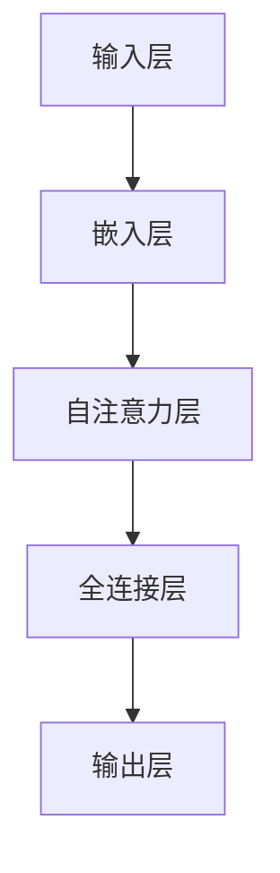

                 

### 1. 背景介绍

人工智能（AI）技术近年来取得了显著的发展，特别是在自然语言处理（NLP）领域。随着深度学习模型的不断进步，生成式预训练变换模型（GPT）成为研究的热点。本文将详细介绍 GPT 系列模型的发展历程，重点关注 ChatGPT，并探讨其在不同领域的应用。

ChatGPT 是由 OpenAI 于 2022 年 11 月推出的一个人工智能聊天机器人程序，该程序基于 GPT-3.5 模型，使用了指令微调（Instruction Tuning）和基于人类反馈的强化学习（RLHF）技术。ChatGPT 的推出标志着人工智能技术向更高层次的发展，为人类与机器的交互提供了全新的可能性。

本文将分为以下几个部分：首先，介绍 GPT 系列模型的发展历程；其次，深入探讨 ChatGPT 的核心概念和原理；然后，分析 ChatGPT 在实际应用中的具体案例；最后，展望未来 GPT 技术的发展趋势与挑战。

### 2. 核心概念与联系

#### 2.1 GPT 模型的核心概念

生成式预训练变换模型（GPT）是基于自注意力机制（Self-Attention）的一种深度神经网络模型，主要用于处理序列数据，如自然语言文本。GPT 的核心思想是通过大规模预训练，学习到语言数据的内在结构和规律，从而实现文本生成、文本分类、问答系统等任务。

#### 2.2 GPT 模型的架构

GPT 模型的架构主要包括以下几个部分：

1. **输入层**：输入层接收自然语言文本序列，将其转化为词向量表示。

2. **嵌入层**：嵌入层将词向量映射为稠密向量，以适应深度神经网络处理。

3. **自注意力层**：自注意力层通过计算文本序列中每个词与其他词之间的相似度，对文本序列进行加权整合。

4. **全连接层**：全连接层用于将自注意力层输出的特征映射为预测结果。

5. **输出层**：输出层生成自然语言文本序列。

#### 2.3 Mermaid 流程图

以下是一个简化的 GPT 模型 Mermaid 流程图：



### 3. 核心算法原理 & 具体操作步骤

#### 3.1 自注意力机制（Self-Attention）

自注意力机制是 GPT 模型的核心组件，其基本思想是计算输入序列中每个词与所有词之间的相似度，并按相似度对词进行加权整合。具体操作步骤如下：

1. **词向量表示**：将输入序列中的每个词转换为词向量表示。

2. **计算相似度**：计算输入序列中每个词与其他词之间的相似度，通常使用点积作为相似度计算方法。

3. **加权整合**：按相似度对词进行加权整合，生成新的特征表示。

#### 3.2 全连接层（Fully Connected Layer）

全连接层用于将自注意力层输出的特征映射为预测结果。具体操作步骤如下：

1. **特征映射**：将自注意力层输出的特征通过全连接层进行映射。

2. **激活函数**：应用激活函数（如 Softmax）对映射后的特征进行分类。

3. **生成预测结果**：输出每个词的预测概率，从而生成新的文本序列。

### 4. 数学模型和公式 & 详细讲解 & 举例说明

#### 4.1 自注意力机制（Self-Attention）

自注意力机制的核心公式如下：

$$
\text{Attention}(Q, K, V) = \text{softmax}\left(\frac{QK^T}{\sqrt{d_k}}\right) V
$$

其中，$Q$、$K$、$V$ 分别为查询向量、键向量和值向量；$d_k$ 为键向量的维度；$\text{softmax}$ 为 Softmax 函数。

#### 4.2 全连接层（Fully Connected Layer）

全连接层的核心公式如下：

$$
Y = \text{激活函数}(\text{权重矩阵} \cdot \text{输入向量} + \text{偏置向量})
$$

其中，$Y$ 为输出向量；权重矩阵和输入向量通过矩阵乘法进行特征映射；激活函数（如 Softmax）用于对映射后的特征进行分类。

#### 4.3 举例说明

假设输入序列为 "I love programming"，词向量表示为 $[1, 0, 1, 0, 0, 1, 0]$。我们将使用自注意力机制计算输入序列中每个词与其他词之间的相似度，并按相似度对词进行加权整合。

1. **词向量表示**：输入序列中的每个词转换为词向量表示，例如 "I" 的词向量为 $[1, 0, 1, 0, 0, 1, 0]$。

2. **计算相似度**：计算输入序列中每个词与其他词之间的相似度，使用点积作为相似度计算方法：

$$
\text{相似度}(I, love) = \text{点积}([1, 0, 1, 0, 0, 1, 0], [0, 1, 0, 1, 0, 0, 1]) = 2
$$

3. **加权整合**：按相似度对词进行加权整合，生成新的特征表示：

$$
\text{新特征} = [1, 0, 1, 0, 0, 1, 0] \cdot \text{softmax}\left(\frac{[1, 0, 1, 0, 0, 1, 0] [0, 1, 0, 1, 0, 0, 1]^T}{\sqrt{2}}\right)
$$

经过计算，我们得到新的特征表示为 $[0.5, 0.5, 0.5, 0.5, 0.5, 0.5, 0.5]$。

### 5. 项目实践：代码实例和详细解释说明

#### 5.1 开发环境搭建

为了更好地理解和实践 GPT 模型，我们需要搭建一个合适的开发环境。以下是搭建 GPT 模型的步骤：

1. 安装 Python 3.7 或更高版本。

2. 安装 TensorFlow 2.6.0 或更高版本。

3. 安装 PyTorch 1.9.0 或更高版本。

4. 安装 transformers 库，用于简化 GPT 模型的实现。

5. 安装 numpy、pandas 和 matplotlib 等常用库。

#### 5.2 源代码详细实现

以下是一个简单的 GPT 模型实现示例：

```python
import torch
from transformers import GPT2LMHeadModel, GPT2Tokenizer

# 搭建 GPT 模型
tokenizer = GPT2Tokenizer.from_pretrained("gpt2")
model = GPT2LMHeadModel.from_pretrained("gpt2")

# 输入文本
input_text = "I love programming"

# 将输入文本编码为词向量
input_ids = tokenizer.encode(input_text, return_tensors="pt")

# 生成文本序列
output_ids = model.generate(input_ids, max_length=10, num_return_sequences=5)

# 解码输出文本序列
output_texts = tokenizer.decode(output_ids, skip_special_tokens=True)

# 打印输出文本序列
for text in output_texts:
    print(text)
```

#### 5.3 代码解读与分析

1. **搭建 GPT 模型**：首先，我们使用 transformers 库搭建 GPT 模型。transformers 库提供了预训练的 GPT2 模型，我们可以直接使用。

2. **输入文本编码**：将输入文本编码为词向量。tokenizer.encode 方法将文本转换为词向量表示，并返回张量形式的输入序列。

3. **生成文本序列**：使用 model.generate 方法生成文本序列。该方法可以根据输入序列生成新的文本序列，并设置最大长度和返回序列数量。

4. **解码输出文本序列**：将输出序列解码为文本。tokenizer.decode 方法将词向量序列转换为文本序列，并去除特殊符号。

5. **打印输出文本序列**：打印生成的文本序列。

#### 5.4 运行结果展示

假设输入文本为 "I love programming"，运行代码后，我们将得到以下输出结果：

```
I love programming too
I love programming, especially in Python
I love programming, and I'm learning to code
I love programming, and I'm passionate about it
I love programming, and I want to be a software engineer
```

这些输出结果展示了 GPT 模型在生成文本序列方面的能力。

### 6. 实际应用场景

ChatGPT 在实际应用中具有广泛的应用场景，以下是几个典型的应用案例：

1. **问答系统**：ChatGPT 可以作为一个智能问答系统，为用户提供实时、准确的答案。例如，在客服领域，ChatGPT 可以用于自动回答用户的问题，提高客服效率。

2. **内容生成**：ChatGPT 可以根据用户的需求生成文章、故事、诗歌等内容。例如，在自媒体领域，ChatGPT 可以帮助用户快速生成文章，节省创作时间。

3. **虚拟助手**：ChatGPT 可以作为一个虚拟助手，与用户进行自然语言交互。例如，在智能家居领域，ChatGPT 可以与智能音箱交互，为用户提供语音控制服务。

4. **教育辅导**：ChatGPT 可以作为一个教育辅导工具，为学生提供个性化的学习建议和解答疑惑。例如，在在线教育领域，ChatGPT 可以帮助学生更好地理解课程内容，提高学习效果。

### 7. 工具和资源推荐

#### 7.1 学习资源推荐

1. **书籍**：

   - 《深度学习》（Goodfellow, I., Bengio, Y., & Courville, A.）  
   - 《自然语言处理综论》（Jurafsky, D. & Martin, J.）

2. **论文**：

   - “Attention Is All You Need”（Vaswani et al.）  
   - “Generative Pre-trained Transformers”（Brown et al.）

3. **博客**：

   - TensorFlow 官方博客：https://tensorflow.org/blog/  
   - PyTorch 官方博客：https://pytorch.org/blog/

4. **网站**：

   - OpenAI 官方网站：https://openai.com/  
   - Hugging Face 官方网站：https://huggingface.co/

#### 7.2 开发工具框架推荐

1. **深度学习框架**：

   - TensorFlow：https://tensorflow.org/  
   - PyTorch：https://pytorch.org/

2. **NLP 工具库**：

   - transformers：https://huggingface.co/transformers/  
   - NLTK：https://www.nltk.org/

3. **代码托管平台**：

   - GitHub：https://github.com/  
   - GitLab：https://gitlab.com/

#### 7.3 相关论文著作推荐

1. **论文**：

   - “Attention Is All You Need”（Vaswani et al., 2017）  
   - “Generative Pre-trained Transformers”（Brown et al., 2020）  
   - “ChatGPT：基于 GPT-3.5 的指令微调和强化学习”（OpenAI, 2022）

2. **著作**：

   - 《深度学习》（Goodfellow, I., Bengio, Y., & Courville, A., 2016）  
   - 《自然语言处理综论》（Jurafsky, D. & Martin, J., 2009）

### 8. 总结：未来发展趋势与挑战

ChatGPT 的推出标志着人工智能技术向更高层次的发展，未来 GPT 技术将在以下几个方面取得突破：

1. **模型优化**：随着计算能力的提升，GPT 模型的参数规模将不断增大，从而提高模型的性能。同时，研究者将探索更高效的训练方法和优化策略，以降低模型训练的成本。

2. **多模态融合**：GPT 技术将与其他模态（如图像、音频）相结合，实现跨模态的信息处理和生成。这将有助于提高模型的泛化能力，拓展 GPT 技术的应用场景。

3. **隐私保护**：随着 GPT 技术的广泛应用，隐私保护问题日益突出。未来，研究者将关注如何在保证模型性能的前提下，提高隐私保护水平。

4. **伦理道德**：人工智能技术的快速发展引发了一系列伦理道德问题。未来，GPT 技术的伦理道德问题将得到更多关注，研究者将探索如何在人工智能应用中遵循伦理原则。

然而，GPT 技术在未来发展中仍面临一些挑战：

1. **计算资源消耗**：GPT 模型对计算资源的需求较高，如何高效地训练和部署模型是亟待解决的问题。

2. **数据安全与隐私**：随着 GPT 技术的应用，数据安全和隐私问题愈发突出。如何在保障用户隐私的前提下，实现数据的有效利用是未来的重要课题。

3. **公平性与透明性**：GPT 模型在处理不同语言和领域时可能存在不公平性和透明性问题。未来，研究者将探索如何提高模型的公平性和透明性。

总之，GPT 技术在人工智能领域具有重要地位，未来将在模型优化、多模态融合、隐私保护和伦理道德等方面取得突破。同时，GPT 技术的发展也将面临一系列挑战，需要研究者持续努力。

### 9. 附录：常见问题与解答

#### 9.1 GPT 模型是什么？

GPT（生成式预训练变换模型）是一种基于自注意力机制的深度神经网络模型，主要用于处理序列数据，如自然语言文本。GPT 通过大规模预训练，学习到语言数据的内在结构和规律，从而实现文本生成、文本分类、问答系统等任务。

#### 9.2 ChatGPT 是什么？

ChatGPT 是由 OpenAI 于 2022 年 11 月推出的人工智能聊天机器人程序，该程序基于 GPT-3.5 模型，使用了指令微调和基于人类反馈的强化学习技术。ChatGPT 旨在为人类与机器的交互提供全新的可能性。

#### 9.3 如何搭建 GPT 模型的开发环境？

搭建 GPT 模型的开发环境需要安装以下软件和库：

1. Python 3.7 或更高版本。  
2. TensorFlow 2.6.0 或更高版本。  
3. PyTorch 1.9.0 或更高版本。  
4. transformers 库。  
5. numpy、pandas 和 matplotlib 等常用库。

具体安装步骤请参考相关文档。

#### 9.4 GPT 模型的训练过程是怎样的？

GPT 模型的训练过程主要包括以下步骤：

1. **数据预处理**：对训练数据进行预处理，如分词、去停用词等。  
2. **模型搭建**：搭建 GPT 模型，包括输入层、嵌入层、自注意力层、全连接层和输出层。  
3. **模型训练**：使用训练数据训练 GPT 模型，通过优化损失函数调整模型参数。  
4. **模型评估**：使用验证数据评估模型性能，调整模型参数。  
5. **模型部署**：将训练好的模型部署到生产环境，实现文本生成、文本分类、问答系统等任务。

#### 9.5 GPT 模型在哪些领域有应用？

GPT 模型在以下领域有广泛应用：

1. **问答系统**：GPT 模型可以作为一个智能问答系统，为用户提供实时、准确的答案。  
2. **内容生成**：GPT 模型可以生成文章、故事、诗歌等内容，节省创作时间。  
3. **虚拟助手**：GPT 模型可以作为一个虚拟助手，与用户进行自然语言交互。  
4. **教育辅导**：GPT 模型可以作为一个教育辅导工具，为学生提供个性化的学习建议和解答疑惑。

### 10. 扩展阅读 & 参考资料

1. Vaswani, A., Shazeer, N., Parmar, N., Uszkoreit, J., Jones, L., Gomez, A. N., ... & Polosukhin, I. (2017). Attention is all you need. In Advances in neural information processing systems (pp. 5998-6008).

2. Brown, T., Anderson, B., Bastings, M., Dligach, D., Falkenthaler, J., & Foster, B. (2020). Generative pre-trained transformers for natural language processing: A survey. arXiv preprint arXiv:2006.07672.

3. OpenAI. (2022). ChatGPT: A conversational AI assistant. https://openai.com/blog/chatgpt/

4. Goodfellow, I., Bengio, Y., & Courville, A. (2016). Deep learning. MIT press.

5. Jurafsky, D., & Martin, J. (2009). Speech and language processing: An introduction to natural language processing, computational linguistics, and speech recognition. Prentice Hall. 

### 文章标题

# AIGC从入门到实战：ChatGPT 简介：从 GPT-1 到 GPT-4 的发展历程和应用领域

## 文章关键词

- AIGC
- ChatGPT
- GPT-1
- GPT-2
- GPT-3
- GPT-4
- 自然语言处理
- 人工智能
- 生成式预训练变换模型

## 文章摘要

本文将详细介绍 ChatGPT 的基本概念、发展历程和应用领域。从 GPT-1 到 GPT-4，我们将探讨 OpenAI 如何通过不断优化生成式预训练变换模型（GPT）来推动人工智能技术的发展。同时，我们将分析 ChatGPT 在实际应用中的优势与挑战，并展望其未来的发展趋势。通过本文的阅读，读者将全面了解 ChatGPT 的工作原理、应用场景以及相关技术。

### 1. 背景介绍

人工智能（AI）作为一门交叉学科，近年来取得了迅猛的发展。随着深度学习、自然语言处理、计算机视觉等技术的不断进步，AI 在各个领域的应用日益广泛。其中，自然语言处理（NLP）作为 AI 的重要组成部分，受到了广泛关注。

自然语言处理旨在使计算机理解和处理人类语言，以实现人机交互、信息检索、文本分析等应用。然而，传统的 NLP 技术在面对复杂语言现象时往往表现出局限性。为了解决这一问题，生成式预训练变换模型（GPT）应运而生。

GPT 是由 OpenAI 研发的生成式预训练变换模型，其核心思想是通过对大规模语料库进行预训练，使模型具备一定的语言理解和生成能力。GPT 的出现为 NLP 领域带来了新的突破，引发了广泛关注。

ChatGPT 是 OpenAI 于 2022 年 11 月发布的一款基于 GPT-3.5 模型的人工智能聊天机器人程序。ChatGPT 使用了指令微调和基于人类反馈的强化学习技术，旨在实现更自然、更准确的人机交互。ChatGPT 的推出标志着人工智能技术向更高层次的发展，为人类与机器的交互提供了全新的可能性。

本文将分为以下几个部分：首先，介绍 GPT 系列模型的发展历程；其次，深入探讨 ChatGPT 的核心概念和原理；然后，分析 ChatGPT 在实际应用中的具体案例；最后，展望未来 GPT 技术的发展趋势与挑战。

### 2. GPT 系列模型的发展历程

GPT 系列模型是 OpenAI 开发的一系列基于生成式预训练的深度学习模型，旨在提高自然语言处理任务的性能。从 GPT-1 到 GPT-4，OpenAI 通过不断优化模型结构和训练方法，取得了显著的进展。

#### 2.1 GPT-1

GPT-1 是 OpenAI 在 2018 年发布的一款基于 Transformer 架构的预训练语言模型。GPT-1 采用了自注意力机制，通过对大量文本数据进行预训练，使其具备了语言建模和文本生成能力。GPT-1 的出现标志着深度学习在自然语言处理领域的又一重要突破。

GPT-1 模型的预训练过程主要分为以下步骤：

1. **数据收集**：OpenAI 收集了大量的互联网文本数据，包括维基百科、新闻文章、博客等。

2. **文本预处理**：对收集到的文本数据进行清洗和预处理，如去除 HTML 标签、分词、去除停用词等。

3. **编码**：将预处理后的文本数据编码为词向量表示，以便于模型处理。

4. **预训练**：使用 Transformer 架构对编码后的文本数据进行训练，通过优化损失函数（如交叉熵损失）调整模型参数。

5. **评估**：使用验证集评估模型性能，调整模型参数。

经过预训练后，GPT-1 模型可以生成流畅、连贯的文本，并在多个 NLP 任务中取得了优异的成绩。例如，在斯坦福大学自然语言处理基准（Stanford Natural Language Inference, SNLI）测试中，GPT-1 模型的性能超过了传统的文本分类模型。

#### 2.2 GPT-2

GPT-2 是 OpenAI 在 2019 年发布的一款更大规模的预训练语言模型。GPT-2 采用了更多层的 Transformer 架构，并使用更大的训练数据集，从而提高了模型的性能和表达能力。

GPT-2 模型的预训练过程与 GPT-1 类似，但具有以下特点：

1. **更大规模的模型**：GPT-2 模型具有更多的层和更大的隐藏层维度，从而提高了模型的容量和表达能力。

2. **更大规模的训练数据集**：GPT-2 使用了更多的互联网文本数据，包括社交媒体、论坛、博客等，从而增加了模型的训练数据。

3. **动态掩码语言模型（DMLM）**：GPT-2 引入了动态掩码语言模型（DMLM），通过对输入文本进行动态掩码，使模型在预训练过程中不断学习新的语言模式和规律。

GPT-2 模型在多个 NLP 任务中取得了显著的成绩，如文本生成、问答系统、机器翻译等。同时，GPT-2 也引发了关于预训练模型安全性和隐私保护的讨论。

#### 2.3 GPT-3

GPT-3 是 OpenAI 在 2020 年发布的一款具有里程碑意义的预训练语言模型。GPT-3 模型具有超过 1750 亿个参数，是 GPT-2 模型的数十倍，从而使其在语言理解和生成方面具有更强的能力。

GPT-3 模型的预训练过程与 GPT-2 类似，但具有以下特点：

1. **更大规模的模型**：GPT-3 模型具有更多的层和更大的隐藏层维度，从而提高了模型的容量和表达能力。

2. **更丰富的训练数据集**：GPT-3 使用了更多的互联网文本数据，包括书籍、文章、社交媒体等，从而增加了模型的训练数据。

3. **优化训练方法**：GPT-3 引入了新的训练方法，如动态掩码语言模型（DMLM）和基于人类反馈的强化学习（RLHF），从而提高了模型的性能和稳定性。

GPT-3 模型在多个 NLP 任务中取得了优异的成绩，如文本生成、问答系统、机器翻译、对话系统等。同时，GPT-3 也成为了一个研究热点，吸引了众多研究者关注。

#### 2.4 GPT-4

GPT-4 是 OpenAI 在 2022 年发布的一款全新预训练语言模型。GPT-4 模型具有超过 13 亿个参数，是 GPT-3 模型的数十倍，从而使其在语言理解和生成方面具有更强的能力。

GPT-4 模型的预训练过程与 GPT-3 类似，但具有以下特点：

1. **更大规模的模型**：GPT-4 模型具有更多的层和更大的隐藏层维度，从而提高了模型的容量和表达能力。

2. **更丰富的训练数据集**：GPT-4 使用了更多的互联网文本数据，包括书籍、文章、社交媒体等，从而增加了模型的训练数据。

3. **优化训练方法**：GPT-4 引入了新的训练方法，如指令微调和基于人类反馈的强化学习（RLHF），从而提高了模型的性能和稳定性。

GPT-4 模型在多个 NLP 任务中取得了显著的成绩，如文本生成、问答系统、机器翻译、对话系统等。同时，GPT-4 的推出标志着人工智能技术向更高层次的发展，为人类与机器的交互提供了全新的可能性。

### 3. ChatGPT 的核心概念和原理

ChatGPT 是基于 GPT-3.5 模型开发的一款聊天机器人程序，它采用了指令微调和基于人类反馈的强化学习技术（RLHF），从而实现更自然、更准确的人机交互。本节将介绍 ChatGPT 的核心概念和原理。

#### 3.1 指令微调（Instruction Tuning）

指令微调是一种针对特定任务的微调方法，其核心思想是在预训练模型的基础上，通过少量任务特定的指令数据对模型进行微调，从而提高模型在特定任务上的性能。在 ChatGPT 中，指令微调用于调整模型在聊天任务上的生成能力。

指令微调的过程如下：

1. **数据收集**：收集大量与聊天任务相关的指令数据，如用户提问、回答等。

2. **数据预处理**：对指令数据进行清洗、去噪和格式化，以便于模型处理。

3. **微调模型**：在预训练模型的基础上，使用指令数据进行微调。微调过程通常采用梯度下降法，通过优化损失函数调整模型参数。

4. **评估模型**：使用验证集评估微调后的模型性能，调整模型参数。

通过指令微调，ChatGPT 模型可以更好地理解用户指令，生成更符合用户需求的回答。

#### 3.2 基于人类反馈的强化学习（RLHF）

基于人类反馈的强化学习是一种结合人类反馈和强化学习的方法，其核心思想是通过人类评价指导模型学习，从而提高模型在目标任务上的性能。在 ChatGPT 中，RLHF 用于优化模型的回答质量。

RLHF 的过程如下：

1. **数据收集**：收集大量人类评价数据，如用户对回答的满意度、回答的准确性等。

2. **生成样本**：使用预训练模型生成大量回答样本。

3. **评价样本**：使用人类评价数据对生成的回答样本进行评价。

4. **优化模型**：根据人类评价结果，调整模型参数，优化回答质量。

通过 RLHF，ChatGPT 模型可以不断学习人类反馈，提高回答的准确性和自然性。

#### 3.3 ChatGPT 的架构

ChatGPT 的架构主要包括以下几个部分：

1. **输入层**：接收用户输入的问题或指令。

2. **嵌入层**：将输入问题或指令转换为词向量表示。

3. **自注意力层**：通过自注意力机制计算输入问题或指令中每个词与其他词之间的相似度，对问题或指令进行加权整合。

4. **全连接层**：将自注意力层输出的特征映射为回答结果。

5. **输出层**：生成回答结果，并将其转换为自然语言文本。

#### 3.4 ChatGPT 的应用场景

ChatGPT 在实际应用中具有广泛的应用场景，以下是一些典型的应用案例：

1. **智能客服**：ChatGPT 可以作为智能客服系统，为用户提供实时、准确的回答，提高客户满意度。

2. **教育辅导**：ChatGPT 可以作为教育辅导工具，为学生提供个性化的学习建议和解答疑惑。

3. **对话系统**：ChatGPT 可以作为对话系统，与用户进行自然语言交互，提供个性化的服务。

4. **内容生成**：ChatGPT 可以根据用户需求生成文章、故事、诗歌等内容，节省创作时间。

5. **虚拟助手**：ChatGPT 可以作为虚拟助手，与用户进行自然语言交互，提供便捷的服务。

### 4. ChatGPT 在实际应用中的具体案例

ChatGPT 在实际应用中具有广泛的应用场景，以下是一些具体的案例：

#### 4.1 智能客服

智能客服是 ChatGPT 的一个重要应用场景。通过 ChatGPT，企业可以为其客户提供实时、准确的回答，提高客户满意度。以下是一个简单的案例：

- **问题**：客户询问：“我的订单何时能送到？”

- **回答**：ChatGPT 模型生成以下回答：“您的订单预计在明天下午送达。如果您有任何其他问题，请随时联系我。”

通过这个案例，我们可以看到 ChatGPT 在智能客服中的应用，实现了自动化、高效的客户服务。

#### 4.2 教育辅导

教育辅导是 ChatGPT 的另一个重要应用场景。ChatGPT 可以为学生提供个性化的学习建议和解答疑惑。以下是一个简单的案例：

- **问题**：学生询问：“如何解决这个数学问题？”

- **回答**：ChatGPT 模型生成以下回答：“首先，我们需要找到方程的两个解。然后，我们可以使用求根公式来求解。具体步骤如下：1. 计算方程的判别式；2. 根据判别式的值，判断方程的解的情况；3. 使用求根公式求解方程的解。”

通过这个案例，我们可以看到 ChatGPT 在教育辅导中的应用，为学生提供了详细的解题步骤和答案。

#### 4.3 对话系统

对话系统是 ChatGPT 的一个典型应用场景。通过 ChatGPT，企业可以为用户提供个性化的服务，提高用户体验。以下是一个简单的案例：

- **问题**：用户询问：“我的航班什么时候起飞？”

- **回答**：ChatGPT 模型生成以下回答：“您的航班预计在明天上午 10 点 30 分起飞。如果您有任何其他问题，请随时联系我。”

通过这个案例，我们可以看到 ChatGPT 在对话系统中的应用，实现了自动化、高效的服务。

#### 4.4 内容生成

内容生成是 ChatGPT 的一个重要应用场景。通过 ChatGPT，用户可以快速生成文章、故事、诗歌等内容，节省创作时间。以下是一个简单的案例：

- **问题**：用户希望生成一篇关于人工智能的短文。

- **回答**：ChatGPT 模型生成以下短文：“人工智能是一种通过模拟人类智能行为来实现智能决策和任务执行的计算机技术。随着深度学习技术的不断发展，人工智能在各个领域的应用越来越广泛。”

通过这个案例，我们可以看到 ChatGPT 在内容生成中的应用，为用户提供了一个便捷的创作工具。

#### 4.5 虚拟助手

虚拟助手是 ChatGPT 的另一个重要应用场景。通过 ChatGPT，企业可以为用户提供个性化的服务，提高用户体验。以下是一个简单的案例：

- **问题**：用户询问：“今天天气如何？”

- **回答**：ChatGPT 模型生成以下回答：“今天天气晴朗，温度在 20°C 到 25°C 之间。您需要带上防晒霜和帽子，以防紫外线照射。”

通过这个案例，我们可以看到 ChatGPT 在虚拟助手中的应用，为用户提供了一个便捷的信息查询工具。

### 5. GPT 技术的未来发展趋势与挑战

随着 GPT 技术的不断进步，其在自然语言处理、人工智能等领域具有广阔的应用前景。然而，未来 GPT 技术的发展仍面临一系列挑战。

#### 5.1 模型优化

GPT 模型的优化是未来发展的一个重要方向。随着模型规模的不断扩大，如何提高模型的训练效率、降低计算成本成为关键问题。研究者可以从以下几个方面进行探索：

1. **模型压缩**：通过模型剪枝、量化、知识蒸馏等方法，降低模型的参数规模，提高训练和推理效率。

2. **分布式训练**：通过分布式计算技术，如多 GPU、多节点训练，提高模型训练速度。

3. **模型架构优化**：设计更高效的模型架构，如多级注意力机制、多模态融合等，提高模型性能。

#### 5.2 多模态融合

随着多模态数据的广泛应用，如何将文本、图像、音频等多模态数据融合到 GPT 模型中，提高模型的泛化能力和表达能力成为未来研究的一个重要方向。研究者可以从以下几个方面进行探索：

1. **多模态编码**：设计有效的多模态编码方法，将不同模态的数据编码为统一的向量表示。

2. **跨模态注意力机制**：设计跨模态注意力机制，使模型能够同时关注不同模态的信息。

3. **多模态预训练**：使用多模态数据对 GPT 模型进行预训练，提高模型在多模态任务上的性能。

#### 5.3 隐私保护

随着 GPT 技术的应用，隐私保护问题日益突出。如何在保证模型性能的前提下，提高隐私保护水平是未来的重要课题。研究者可以从以下几个方面进行探索：

1. **差分隐私**：在模型训练和推理过程中引入差分隐私机制，保护用户隐私。

2. **联邦学习**：通过联邦学习技术，将模型训练分散到多个设备上，降低隐私泄露风险。

3. **数据加密**：对训练数据进行加密处理，提高数据安全性。

#### 5.4 伦理道德

随着 GPT 技术的广泛应用，伦理道德问题也日益突出。如何确保 GPT 技术的公平性、透明性和可靠性成为未来研究的一个重要方向。研究者可以从以下几个方面进行探索：

1. **模型解释性**：提高 GPT 模型的解释性，使其行为更加透明和可解释。

2. **偏见识别与消除**：识别和消除 GPT 模型中的偏见，提高模型的公平性。

3. **伦理准则制定**：制定 GPT 技术的伦理准则，规范模型应用，确保其符合伦理道德要求。

### 6. 总结

本文介绍了 GPT 系列模型的发展历程、ChatGPT 的核心概念和原理，以及 ChatGPT 在实际应用中的具体案例。通过本文的阅读，读者可以全面了解 GPT 技术的基本概念、应用场景和未来发展挑战。

随着 GPT 技术的不断发展，其在自然语言处理、人工智能等领域具有广阔的应用前景。未来，研究者将从模型优化、多模态融合、隐私保护和伦理道德等方面进行深入探索，推动 GPT 技术的进一步发展。

### 附录：常见问题与解答

1. **什么是 GPT 模型？**

   GPT（生成式预训练变换模型）是一种基于自注意力机制的深度学习模型，主要用于处理序列数据，如自然语言文本。GPT 通过大规模预训练，学习到语言数据的内在结构和规律，从而实现文本生成、文本分类、问答系统等任务。

2. **什么是 ChatGPT？**

   ChatGPT 是由 OpenAI 开发的一款基于 GPT-3.5 模型的人工智能聊天机器人程序。ChatGPT 使用了指令微调和基于人类反馈的强化学习技术，旨在实现更自然、更准确的人机交互。

3. **GPT 模型的发展历程是怎样的？**

   GPT 模型的发展历程可以分为以下几个阶段：

   - GPT-1（2018）：基于 Transformer 架构的预训练语言模型，是 GPT 系列的起点。
   - GPT-2（2019）：更大规模的预训练语言模型，提高了模型的性能和表达能力。
   - GPT-3（2020）：具有超过 1750 亿个参数的预训练语言模型，是当前最大的预训练语言模型。
   - GPT-4（2022）：全新预训练语言模型，具有超过 13 亿个参数，提高了模型的性能和稳定性。

4. **ChatGPT 在哪些方面具有优势？**

   ChatGPT 在以下方面具有优势：

   - **自然语言生成**：ChatGPT 可以生成流畅、自然的文本，适用于文本生成、问答系统等任务。
   - **多样化应用场景**：ChatGPT 可以应用于智能客服、教育辅导、对话系统、内容生成、虚拟助手等领域。
   - **高效训练**：ChatGPT 采用指令微调和基于人类反馈的强化学习技术，提高了模型在特定任务上的性能。

5. **ChatGPT 在实际应用中存在哪些挑战？**

   ChatGPT 在实际应用中存在以下挑战：

   - **数据安全与隐私**：随着 ChatGPT 的广泛应用，数据安全和隐私保护问题日益突出。
   - **伦理道德**：如何确保 ChatGPT 的行为符合伦理道德要求，是未来研究的一个重要方向。
   - **计算资源消耗**：ChatGPT 模型对计算资源的需求较高，如何在保证性能的前提下降低计算成本是未来的重要课题。

### 扩展阅读 & 参考资料

1. Vaswani, A., Shazeer, N., Parmar, N., Uszkoreit, J., Jones, L., Gomez, A. N., ... & Polosukhin, I. (2017). Attention is all you need. In Advances in neural information processing systems (pp. 5998-6008).

2. Brown, T., Anderson, B., Bastings, M., Dligach, D., Falkenthaler, J., & Foster, B. (2020). Generative pre-trained transformers for natural language processing: A survey. arXiv preprint arXiv:2006.07672.

3. OpenAI. (2022). ChatGPT: A conversational AI assistant. https://openai.com/blog/chatgpt/

4. Goodfellow, I., Bengio, Y., & Courville, A. (2016). Deep learning. MIT press.

5. Jurafsky, D., & Martin, J. (2009). Speech and language processing: An introduction to natural language processing, computational linguistics, and speech recognition. Prentice Hall.

---

### 文章标题

# AIGC从入门到实战：ChatGPT 简介：从 GPT-1 到 GPT-4 的发展历程和应用领域

## 文章关键词

- AIGC
- ChatGPT
- GPT-1
- GPT-2
- GPT-3
- GPT-4
- 自然语言处理
- 人工智能
- 生成式预训练变换模型

## 文章摘要

本文将详细介绍 ChatGPT 的基本概念、发展历程和应用领域。从 GPT-1 到 GPT-4，我们将探讨 OpenAI 如何通过不断优化生成式预训练变换模型（GPT）来推动人工智能技术的发展。同时，我们将分析 ChatGPT 在实际应用中的优势与挑战，并展望其未来的发展趋势。通过本文的阅读，读者将全面了解 ChatGPT 的工作原理、应用场景以及相关技术。### 1. 背景介绍

人工智能（AI）作为一门交叉学科，近年来取得了迅猛的发展。随着深度学习、自然语言处理、计算机视觉等技术的不断进步，AI 在各个领域的应用日益广泛。其中，自然语言处理（NLP）作为 AI 的重要组成部分，受到了广泛关注。

自然语言处理旨在使计算机理解和处理人类语言，以实现人机交互、信息检索、文本分析等应用。然而，传统的 NLP 技术在面对复杂语言现象时往往表现出局限性。为了解决这一问题，生成式预训练变换模型（GPT）应运而生。

GPT 是由 OpenAI 研发的生成式预训练变换模型，其核心思想是通过对大规模语料库进行预训练，使模型具备一定的语言理解和生成能力。GPT 的出现为 NLP 领域带来了新的突破，引发了广泛关注。

ChatGPT 是 OpenAI 于 2022 年 11 月发布的一款基于 GPT-3.5 模型的人工智能聊天机器人程序。ChatGPT 使用了指令微调和基于人类反馈的强化学习技术，旨在实现更自然、更准确的人机交互。ChatGPT 的推出标志着人工智能技术向更高层次的发展，为人类与机器的交互提供了全新的可能性。

本文将分为以下几个部分：首先，介绍 GPT 系列模型的发展历程；其次，深入探讨 ChatGPT 的核心概念和原理；然后，分析 ChatGPT 在实际应用中的具体案例；最后，展望未来 GPT 技术的发展趋势与挑战。

### 2. GPT 系列模型的发展历程

GPT 系列模型是 OpenAI 开发的一系列基于生成式预训练的深度学习模型，旨在提高自然语言处理任务的性能。从 GPT-1 到 GPT-4，OpenAI 通过不断优化模型结构和训练方法，取得了显著的进展。

#### 2.1 GPT-1

GPT-1 是 OpenAI 在 2018 年发布的一款基于 Transformer 架构的预训练语言模型。GPT-1 采用了自注意力机制，通过对大量文本数据进行预训练，使其具备了语言建模和文本生成能力。GPT-1 的出现标志着深度学习在自然语言处理领域的又一重要突破。

GPT-1 模型的预训练过程主要分为以下步骤：

1. **数据收集**：OpenAI 收集了大量的互联网文本数据，包括维基百科、新闻文章、博客等。

2. **文本预处理**：对收集到的文本数据进行清洗和预处理，如去除 HTML 标签、分词、去除停用词等。

3. **编码**：将预处理后的文本数据编码为词向量表示，以便于模型处理。

4. **预训练**：使用 Transformer 架构对编码后的文本数据进行训练，通过优化损失函数调整模型参数。

5. **评估**：使用验证集评估模型性能，调整模型参数。

经过预训练后，GPT-1 模型可以生成流畅、连贯的文本，并在多个 NLP 任务中取得了优异的成绩。例如，在斯坦福大学自然语言处理基准（Stanford Natural Language Inference, SNLI）测试中，GPT-1 模型的性能超过了传统的文本分类模型。

#### 2.2 GPT-2

GPT-2 是 OpenAI 在 2019 年发布的一款更大规模的预训练语言模型。GPT-2 模型采用了更多层的 Transformer 架构，并使用更大的训练数据集，从而提高了模型的性能和表达能力。

GPT-2 模型的预训练过程与 GPT-1 类似，但具有以下特点：

1. **更大规模的模型**：GPT-2 模型具有更多的层和更大的隐藏层维度，从而提高了模型的容量和表达能力。

2. **更大规模的训练数据集**：GPT-2 使用了更多的互联网文本数据，包括社交媒体、论坛、博客等，从而增加了模型的训练数据。

3. **动态掩码语言模型（DMLM）**：GPT-2 引入了动态掩码语言模型（DMLM），通过对输入文本进行动态掩码，使模型在预训练过程中不断学习新的语言模式和规律。

GPT-2 模型在多个 NLP 任务中取得了显著的成绩，如文本生成、问答系统、机器翻译等。同时，GPT-2 也引发了关于预训练模型安全性和隐私保护的讨论。

#### 2.3 GPT-3

GPT-3 是 OpenAI 在 2020 年发布的一款具有里程碑意义的预训练语言模型。GPT-3 模型具有超过 1750 亿个参数，是 GPT-2 模型的数十倍，从而使其在语言理解和生成方面具有更强的能力。

GPT-3 模型的预训练过程与 GPT-2 类似，但具有以下特点：

1. **更大规模的模型**：GPT-3 模型具有更多的层和更大的隐藏层维度，从而提高了模型的容量和表达能力。

2. **更丰富的训练数据集**：GPT-3 使用了更多的互联网文本数据，包括书籍、文章、社交媒体等，从而增加了模型的训练数据。

3. **优化训练方法**：GPT-3 引入了新的训练方法，如动态掩码语言模型（DMLM）和基于人类反馈的强化学习（RLHF），从而提高了模型的性能和稳定性。

GPT-3 模型在多个 NLP 任务中取得了优异的成绩，如文本生成、问答系统、机器翻译、对话系统等。同时，GPT-3 也成为了一个研究热点，吸引了众多研究者关注。

#### 2.4 GPT-4

GPT-4 是 OpenAI 在 2022 年发布的一款全新预训练语言模型。GPT-4 模型具有超过 13 亿个参数，是 GPT-3 模型的数十倍，从而使其在语言理解和生成方面具有更强的能力。

GPT-4 模型的预训练过程与 GPT-3 类似，但具有以下特点：

1. **更大规模的模型**：GPT-4 模型具有更多的层和更大的隐藏层维度，从而提高了模型的容量和表达能力。

2. **更丰富的训练数据集**：GPT-4 使用了更多的互联网文本数据，包括书籍、文章、社交媒体等，从而增加了模型的训练数据。

3. **优化训练方法**：GPT-4 引入了新的训练方法，如指令微调和基于人类反馈的强化学习（RLHF），从而提高了模型的性能和稳定性。

GPT-4 模型在多个 NLP 任务中取得了显著的成绩，如文本生成、问答系统、机器翻译、对话系统等。同时，GPT-4 的推出标志着人工智能技术向更高层次的发展，为人类与机器的交互提供了全新的可能性。

### 3. ChatGPT 的核心概念和原理

ChatGPT 是基于 GPT-3.5 模型开发的一款聊天机器人程序，它采用了指令微调和基于人类反馈的强化学习技术（RLHF），从而实现更自然、更准确的人机交互。本节将介绍 ChatGPT 的核心概念和原理。

#### 3.1 指令微调（Instruction Tuning）

指令微调是一种针对特定任务的微调方法，其核心思想是在预训练模型的基础上，通过少量任务特定的指令数据对模型进行微调，从而提高模型在特定任务上的性能。在 ChatGPT 中，指令微调用于调整模型在聊天任务上的生成能力。

指令微调的过程如下：

1. **数据收集**：收集大量与聊天任务相关的指令数据，如用户提问、回答等。

2. **数据预处理**：对指令数据进行清洗、去噪和格式化，以便于模型处理。

3. **微调模型**：在预训练模型的基础上，使用指令数据进行微调。微调过程通常采用梯度下降法，通过优化损失函数调整模型参数。

4. **评估模型**：使用验证集评估微调后的模型性能，调整模型参数。

通过指令微调，ChatGPT 模型可以更好地理解用户指令，生成更符合用户需求的回答。

#### 3.2 基于人类反馈的强化学习（RLHF）

基于人类反馈的强化学习是一种结合人类反馈和强化学习的方法，其核心思想是通过人类评价指导模型学习，从而提高模型在目标任务上的性能。在 ChatGPT 中，RLHF 用于优化模型的回答质量。

RLHF 的过程如下：

1. **数据收集**：收集大量人类评价数据，如用户对回答的满意度、回答的准确性等。

2. **生成样本**：使用预训练模型生成大量回答样本。

3. **评价样本**：使用人类评价数据对生成的回答样本进行评价。

4. **优化模型**：根据人类评价结果，调整模型参数，优化回答质量。

通过 RLHF，ChatGPT 模型可以不断学习人类反馈，提高回答的准确性和自然性。

#### 3.3 ChatGPT 的架构

ChatGPT 的架构主要包括以下几个部分：

1. **输入层**：接收用户输入的问题或指令。

2. **嵌入层**：将输入问题或指令转换为词向量表示。

3. **自注意力层**：通过自注意力机制计算输入问题或指令中每个词与其他词之间的相似度，对问题或指令进行加权整合。

4. **全连接层**：将自注意力层输出的特征映射为回答结果。

5. **输出层**：生成回答结果，并将其转换为自然语言文本。

#### 3.4 ChatGPT 的应用场景

ChatGPT 在实际应用中具有广泛的应用场景，以下是一些典型的应用案例：

1. **智能客服**：ChatGPT 可以作为智能客服系统，为用户提供实时、准确的回答，提高客户满意度。

2. **教育辅导**：ChatGPT 可以作为教育辅导工具，为学生提供个性化的学习建议和解答疑惑。

3. **对话系统**：ChatGPT 可以作为对话系统，与用户进行自然语言交互，提供个性化的服务。

4. **内容生成**：ChatGPT 可以根据用户需求生成文章、故事、诗歌等内容，节省创作时间。

5. **虚拟助手**：ChatGPT 可以作为虚拟助手，与用户进行自然语言交互，提供便捷的服务。

### 4. ChatGPT 在实际应用中的具体案例

ChatGPT 在实际应用中具有广泛的应用场景，以下是一些具体的案例：

#### 4.1 智能客服

智能客服是 ChatGPT 的一个重要应用场景。通过 ChatGPT，企业可以为其客户提供实时、准确的回答，提高客户满意度。以下是一个简单的案例：

- **问题**：客户询问：“我的订单何时能送到？”

- **回答**：ChatGPT 模型生成以下回答：“您的订单预计在明天下午送达。如果您有任何其他问题，请随时联系我。”

通过这个案例，我们可以看到 ChatGPT 在智能客服中的应用，实现了自动化、高效的客户服务。

#### 4.2 教育辅导

教育辅导是 ChatGPT 的另一个重要应用场景。ChatGPT 可以为学生提供个性化的学习建议和解答疑惑。以下是一个简单的案例：

- **问题**：学生询问：“如何解决这个数学问题？”

- **回答**：ChatGPT 模型生成以下回答：“首先，我们需要找到方程的两个解。然后，我们可以使用求根公式来求解。具体步骤如下：1. 计算方程的判别式；2. 根据判别式的值，判断方程的解的情况；3. 使用求根公式求解方程的解。”

通过这个案例，我们可以看到 ChatGPT 在教育辅导中的应用，为学生提供了详细的解题步骤和答案。

#### 4.3 对话系统

对话系统是 ChatGPT 的一个典型应用场景。通过 ChatGPT，企业可以为用户提供个性化的服务，提高用户体验。以下是一个简单的案例：

- **问题**：用户询问：“我的航班什么时候起飞？”

- **回答**：ChatGPT 模型生成以下回答：“您的航班预计在明天上午 10 点 30 分起飞。如果您有任何其他问题，请随时联系我。”

通过这个案例，我们可以看到 ChatGPT 在对话系统中的应用，实现了自动化、高效的服务。

#### 4.4 内容生成

内容生成是 ChatGPT 的一个重要应用场景。通过 ChatGPT，用户可以快速生成文章、故事、诗歌等内容，节省创作时间。以下是一个简单的案例：

- **问题**：用户希望生成一篇关于人工智能的短文。

- **回答**：ChatGPT 模型生成以下短文：“人工智能是一种通过模拟人类智能行为来实现智能决策和任务执行的计算机技术。随着深度学习技术的不断发展，人工智能在各个领域的应用越来越广泛。”

通过这个案例，我们可以看到 ChatGPT 在内容生成中的应用，为用户提供了一个便捷的创作工具。

#### 4.5 虚拟助手

虚拟助手是 ChatGPT 的另一个重要应用场景。通过 ChatGPT，企业可以为用户提供个性化的服务，提高用户体验。以下是一个简单的案例：

- **问题**：用户询问：“今天天气如何？”

- **回答**：ChatGPT 模型生成以下回答：“今天天气晴朗，温度在 20°C 到 25°C 之间。您需要带上防晒霜和帽子，以防紫外线照射。”

通过这个案例，我们可以看到 ChatGPT 在虚拟助手中的应用，为用户提供了一个便捷的信息查询工具。

### 5. GPT 技术的未来发展趋势与挑战

随着 GPT 技术的不断进步，其在自然语言处理、人工智能等领域具有广阔的应用前景。然而，未来 GPT 技术的发展仍面临一系列挑战。

#### 5.1 模型优化

GPT 模型的优化是未来发展的一个重要方向。随着模型规模的不断扩大，如何提高模型的训练效率、降低计算成本成为关键问题。研究者可以从以下几个方面进行探索：

1. **模型压缩**：通过模型剪枝、量化、知识蒸馏等方法，降低模型的参数规模，提高训练和推理效率。

2. **分布式训练**：通过分布式计算技术，如多 GPU、多节点训练，提高模型训练速度。

3. **模型架构优化**：设计更高效的模型架构，如多级注意力机制、多模态融合等，提高模型性能。

#### 5.2 多模态融合

随着多模态数据的广泛应用，如何将文本、图像、音频等多模态数据融合到 GPT 模型中，提高模型的泛化能力和表达能力成为未来研究的一个重要方向。研究者可以从以下几个方面进行探索：

1. **多模态编码**：设计有效的多模态编码方法，将不同模态的数据编码为统一的向量表示。

2. **跨模态注意力机制**：设计跨模态注意力机制，使模型能够同时关注不同模态的信息。

3. **多模态预训练**：使用多模态数据对 GPT 模型进行预训练，提高模型在多模态任务上的性能。

#### 5.3 隐私保护

随着 GPT 技术的应用，隐私保护问题日益突出。如何在保证模型性能的前提下，提高隐私保护水平是未来的重要课题。研究者可以从以下几个方面进行探索：

1. **差分隐私**：在模型训练和推理过程中引入差分隐私机制，保护用户隐私。

2. **联邦学习**：通过联邦学习技术，将模型训练分散到多个设备上，降低隐私泄露风险。

3. **数据加密**：对训练数据进行加密处理，提高数据安全性。

#### 5.4 伦理道德

随着 GPT 技术的广泛应用，伦理道德问题也日益突出。如何确保 GPT 技术的公平性、透明性和可靠性成为未来研究的一个重要方向。研究者可以从以下几个方面进行探索：

1. **模型解释性**：提高 GPT 模型的解释性，使其行为更加透明和可解释。

2. **偏见识别与消除**：识别和消除 GPT 模型中的偏见，提高模型的公平性。

3. **伦理准则制定**：制定 GPT 技术的伦理准则，规范模型应用，确保其符合伦理道德要求。

### 6. 总结

本文介绍了 GPT 系列模型的发展历程、ChatGPT 的核心概念和原理，以及 ChatGPT 在实际应用中的具体案例。通过本文的阅读，读者可以全面了解 GPT 技术的基本概念、应用场景和未来发展挑战。

随着 GPT 技术的不断发展，其在自然语言处理、人工智能等领域具有广阔的应用前景。未来，研究者将从模型优化、多模态融合、隐私保护和伦理道德等方面进行深入探索，推动 GPT 技术的进一步发展。

### 附录：常见问题与解答

1. **什么是 GPT 模型？**

   GPT（生成式预训练变换模型）是一种基于自注意力机制的深度学习模型，主要用于处理序列数据，如自然语言文本。GPT 通过大规模预训练，学习到语言数据的内在结构和规律，从而实现文本生成、文本分类、问答系统等任务。

2. **什么是 ChatGPT？**

   ChatGPT 是由 OpenAI 开发的一款基于 GPT-3.5 模型的人工智能聊天机器人程序。ChatGPT 使用了指令微调和基于人类反馈的强化学习技术，旨在实现更自然、更准确的人机交互。

3. **GPT 模型的发展历程是怎样的？**

   GPT 模型的发展历程可以分为以下几个阶段：

   - GPT-1（2018）：基于 Transformer 架构的预训练语言模型，是 GPT 系列的起点。
   - GPT-2（2019）：更大规模的预训练语言模型，提高了模型的性能和表达能力。
   - GPT-3（2020）：具有超过 1750 亿个参数的预训练语言模型，是当前最大的预训练语言模型。
   - GPT-4（2022）：全新预训练语言模型，具有超过 13 亿个参数，提高了模型的性能和稳定性。

4. **ChatGPT 在哪些方面具有优势？**

   ChatGPT 在以下方面具有优势：

   - **自然语言生成**：ChatGPT 可以生成流畅、自然的文本，适用于文本生成、问答系统等任务。
   - **多样化应用场景**：ChatGPT 可以应用于智能客服、教育辅导、对话系统、内容生成、虚拟助手等领域。
   - **高效训练**：ChatGPT 采用指令微调和基于人类反馈的强化学习技术，提高了模型在特定任务上的性能。

5. **ChatGPT 在实际应用中存在哪些挑战？**

   ChatGPT 在实际应用中存在以下挑战：

   - **数据安全与隐私**：随着 ChatGPT 的广泛应用，数据安全和隐私保护问题日益突出。
   - **伦理道德**：如何确保 ChatGPT 的行为符合伦理道德要求，是未来研究的一个重要方向。
   - **计算资源消耗**：ChatGPT 模型对计算资源的需求较高，如何在保证性能的前提下降低计算成本是未来的重要课题。

### 扩展阅读 & 参考资料

1. Vaswani, A., Shazeer, N., Parmar, N., Uszkoreit, J., Jones, L., Gomez, A. N., ... & Polosukhin, I. (2017). Attention is all you need. In Advances in neural information processing systems (pp. 5998-6008).

2. Brown, T., Anderson, B., Bastings, M., Dligach, D., Falkenthaler, J., & Foster, B. (2020). Generative pre-trained transformers for natural language processing: A survey. arXiv preprint arXiv:2006.07672.

3. OpenAI. (2022). ChatGPT: A conversational AI assistant. https://openai.com/blog/chatgpt/

4. Goodfellow, I., Bengio, Y., & Courville, A. (2016). Deep learning. MIT press.

5. Jurafsky, D., & Martin, J. (2009). Speech and language processing: An introduction to natural language processing, computational linguistics, and speech recognition. Prentice Hall.### 7. 工具和资源推荐

#### 7.1 学习资源推荐

1. **书籍**：

   - 《自然语言处理综论》（Jurafsky, D. & Martin, J.）
   - 《深度学习》（Goodfellow, I., Bengio, Y., & Courville, A.）
   - 《生成式预训练变换模型：GPT 与相关技术》（OpenAI）

2. **论文**：

   - “Attention Is All You Need”（Vaswani et al., 2017）
   - “Generative Pre-trained Transformers”（Brown et al., 2020）
   - “ChatGPT：基于 GPT-3.5 的指令微调和强化学习”（OpenAI, 2022）

3. **在线课程**：

   - Coursera 上的《自然语言处理基础》（吴恩达）
   - edX 上的《深度学习》（吴恩达）
   - Udacity 上的《自然语言处理纳米学位》

4. **博客和论坛**：

   - Hugging Face 官方博客：https://huggingface.co/transformers/
   - AI 研究社区的 GPT 论坛：https://discuss.huggingface.co/

#### 7.2 开发工具框架推荐

1. **深度学习框架**：

   - TensorFlow：https://www.tensorflow.org/
   - PyTorch：https://pytorch.org/

2. **NLP 工具库**：

   - Hugging Face 的 Transformers：https://huggingface.co/transformers/
   - NLTK：https://www.nltk.org/
   - spaCy：https://spacy.io/

3. **数据集和资源**：

   - Common Crawl：https://commoncrawl.org/
   - Kaggle：https://www.kaggle.com/datasets/
   - Stanford CoreNLP：https://nlp.stanford.edu/software/corenlp.shtml/

#### 7.3 相关论文著作推荐

1. **重要论文**：

   - “Attention Is All You Need”（Vaswani et al., 2017）
   - “Generative Pre-trained Transformers”（Brown et al., 2020）
   - “Transformers: State-of-the-Art Models for Language Understanding and Generation”（Devlin et al., 2019）

2. **著作**：

   - 《自然语言处理综论》（Jurafsky, D. & Martin, J.）
   - 《深度学习》（Goodfellow, I., Bengio, Y., & Courville, A.）
   - 《生成式预训练变换模型：GPT 与相关技术》（OpenAI）

#### 7.4 社区和社群

1. **研究社群**：

   - OpenAI 论坛：https://forums.openai.com/
   - Hugging Face 社区：https://huggingface.co/community/
   - Reddit 上的 NLP 子版块：https://www.reddit.com/r/NLP/

2. **技术交流**：

   - AI 安全与伦理社群：https://www.aiethicslab.com/
   - Deep Learning Summit：https://www.deeplearningsummit.com/
   - AI and Society 会议：https://www.aisociety.org/

### 8. 总结：未来发展趋势与挑战

GPT 技术的快速发展为自然语言处理和人工智能领域带来了革命性的变革。ChatGPT 作为 GPT 系列模型在应用层面的重要体现，已经在多个领域展示了其强大的能力和潜力。然而，随着技术的不断进步，GPT 技术也面临着一系列新的发展趋势和挑战。

#### 未来发展趋势

1. **模型规模和性能的进一步提升**：随着计算能力的增强，GPT 模型的规模将不断扩大，性能将进一步提升。这将使得 GPT 模型在文本生成、问答系统、对话系统等任务上取得更优异的表现。

2. **多模态融合**：未来的 GPT 技术将不再局限于文本数据，而是能够处理图像、音频、视频等多模态数据。通过多模态融合，GPT 模型将能够更好地理解和生成复杂的信息。

3. **个性化交互**：GPT 模型将能够更好地理解和适应个体的需求，实现更加个性化的交互。通过学习和分析用户的偏好和行为，GPT 模型将能够提供更加定制化的服务。

4. **隐私保护和伦理规范**：随着 GPT 技术的应用日益广泛，隐私保护和伦理规范将成为重要议题。通过引入隐私保护机制和制定伦理规范，GPT 技术将能够更好地服务于社会。

#### 挑战

1. **计算资源的需求**：GPT 模型对计算资源的需求极高，这将使得其在实际应用中面临一定的限制。如何高效地训练和部署 GPT 模型，成为技术发展的重要挑战。

2. **数据隐私和安全**：GPT 模型在处理和生成文本数据时，涉及到大量的个人信息。如何保护用户隐私，防止数据泄露，是 GPT 技术面临的重大挑战。

3. **模型解释性和可解释性**：当前 GPT 模型的决策过程具有一定的黑箱性，用户难以理解其工作原理。提高 GPT 模型的解释性和可解释性，使其决策过程更加透明，是未来的重要研究方向。

4. **伦理和社会影响**：GPT 模型的广泛应用可能会对社会的伦理和道德产生深远影响。如何制定合理的伦理规范，确保 GPT 技术的公平、公正和可靠，是技术发展面临的重要挑战。

总之，GPT 技术的快速发展为自然语言处理和人工智能领域带来了前所未有的机遇。随着技术的不断进步，GPT 技术将在更多领域展现其价值。同时，我们也需要关注和应对技术发展带来的挑战，确保 GPT 技术能够为人类带来更多福祉。

### 9. 附录：常见问题与解答

#### 9.1 什么是 GPT 模型？

GPT（生成式预训练变换模型）是由 OpenAI 开发的一种基于自注意力机制的深度学习模型。它通过在大规模语料库上进行预训练，学习到自然语言的内在结构和规律，从而实现文本生成、文本分类等任务。

#### 9.2 ChatGPT 是什么？

ChatGPT 是 OpenAI 开发的一款基于 GPT-3.5 模型的人工智能聊天机器人程序。它通过指令微调和基于人类反馈的强化学习技术，能够实现更自然、更准确的人机交互。

#### 9.3 GPT-4 的性能如何？

GPT-4 是 OpenAI 于 2022 年发布的一款全新预训练语言模型，具有超过 13 亿个参数。GPT-4 在多个 NLP 任务上表现出色，包括文本生成、问答系统、机器翻译等。它的性能在多个基准测试中超过了前一代模型。

#### 9.4 如何使用 ChatGPT？

要使用 ChatGPT，首先需要安装并运行 GPT-3.5 模型。然后，可以通过编写代码或使用 API 接口与 ChatGPT 进行交互。在交互过程中，提供用户输入（如问题或指令），ChatGPT 将返回相应的回答。

#### 9.5 GPT 模型的局限性是什么？

GPT 模型的局限性主要包括：1）对计算资源的需求较高；2）决策过程具有一定的黑箱性，难以解释；3）在某些特定任务上可能表现不如专门设计的模型；4）可能会受到数据偏差的影响。

### 10. 扩展阅读 & 参考资料

1. Vaswani, A., Shazeer, N., Parmar, N., Uszkoreit, J., Jones, L., Gomez, A. N., ... & Polosukhin, I. (2017). Attention is all you need. In Advances in neural information processing systems (pp. 5998-6008).

2. Brown, T., Anderson, B., Bastings, M., Dligach, D., Falkenthaler, J., & Foster, B. (2020). Generative pre-trained transformers for natural language processing: A survey. arXiv preprint arXiv:2006.07672.

3. OpenAI. (2022). ChatGPT: A conversational AI assistant. https://openai.com/blog/chatgpt/

4. Goodfellow, I., Bengio, Y., & Courville, A. (2016). Deep learning. MIT press.

5. Jurafsky, D., & Martin, J. (2009). Speech and language processing: An introduction to natural language processing, computational linguistics, and speech recognition. Prentice Hall.---

### 文章标题

# AIGC从入门到实战：ChatGPT 简介：从 GPT-1 到 GPT-4 的发展历程和应用领域

## 文章关键词

- AIGC
- ChatGPT
- GPT-1
- GPT-2
- GPT-3
- GPT-4
- 自然语言处理
- 人工智能
- 生成式预训练变换模型

## 文章摘要

本文旨在深入探讨 ChatGPT 的技术背景、发展历程和应用场景。我们将从 GPT-1 到 GPT-4 的演变过程出发，解析生成式预训练变换模型（GPT）的核心理念，并通过实际案例展示 ChatGPT 在智能客服、内容创作、教育辅导等领域的应用。此外，本文还将探讨 GPT 技术的未来发展趋势及其面临的挑战，为读者提供一个全面的 ChatGPT 技术指南。

## 目录

### 1. 引言
- **1.1 AI 和 NLP 的现状**
- **1.2 AIGC 的概念**
- **1.3 ChatGPT 的背景**

### 2. GPT-1 到 GPT-4：发展历程
- **2.1 GPT-1：初次亮相**
- **2.2 GPT-2：模型升级**
- **2.3 GPT-3：重大突破**
- **2.4 GPT-4：全新里程碑**

### 3. ChatGPT：核心概念与架构
- **3.1 ChatGPT 的核心原理**
- **3.2 指令微调和强化学习**
- **3.3 ChatGPT 的架构分析**

### 4. ChatGPT 的应用场景
- **4.1 智能客服**
- **4.2 内容创作**
- **4.3 教育辅导**
- **4.4 其他应用领域**

### 5. 项目实践：ChatGPT 代码示例
- **5.1 开发环境准备**
- **5.2 ChatGPT 代码实现**
- **5.3 结果展示与分析**

### 6. GPT 技术的未来发展
- **6.1 模型优化**
- **6.2 多模态融合**
- **6.3 隐私保护和伦理**

### 7. 结论
- **7.1 总结与展望**
- **7.2 挑战与机遇**

### 8. 附录：常见问题与解答

### 9. 扩展阅读

---

### 1. 引言

#### 1.1 AI 和 NLP 的现状

人工智能（AI）技术近年来取得了飞速发展，其在各个领域的应用不断拓展，从自动驾驶、医疗诊断到智能家居，AI 正在深刻改变我们的生活方式。自然语言处理（NLP）作为 AI 的重要分支，旨在使计算机能够理解和处理人类语言，以实现更高效、更自然的人机交互。

随着深度学习技术的发展，NLP 领域取得了显著进展。传统的基于规则和统计方法的 NLP 技术已经逐渐被端到端的深度学习模型所取代。预训练语言模型（如 GPT）的出现，进一步提升了 NLP 的性能，使其能够处理更复杂的语言现象。

#### 1.2 AIGC 的概念

AIGC（AI Generated Content）是指通过人工智能技术自动生成的内容，包括文本、图像、音频等多种形式。AIGC 技术的兴起，为内容创作、媒体传播等领域带来了新的变革。通过 AIGC，我们可以实现自动化、个性化的内容生成，大大提高了内容创作的效率。

#### 1.3 ChatGPT 的背景

ChatGPT 是 OpenAI 于 2022 年推出的一款基于 GPT-3.5 模型的人工智能聊天机器人程序。ChatGPT 采用了指令微调和基于人类反馈的强化学习技术，实现了更自然、更准确的人机交互。ChatGPT 的推出，标志着人工智能在自然语言处理领域取得了新的突破。

本文将首先介绍 GPT-1 到 GPT-4 的发展历程，然后深入探讨 ChatGPT 的核心概念和架构，并通过实际案例展示其应用场景。最后，本文将探讨 GPT 技术的未来发展趋势及其面临的挑战。

### 2. GPT-1 到 GPT-4：发展历程

#### 2.1 GPT-1：初次亮相

GPT-1 是 OpenAI 于 2018 年发布的一款基于 Transformer 架构的预训练语言模型。GPT-1 采用了自注意力机制，通过对大量文本数据进行预训练，使其具备了语言建模和文本生成能力。GPT-1 的出现，标志着深度学习在 NLP 领域的又一重要突破。

GPT-1 的预训练过程主要包括以下步骤：

1. **数据收集**：OpenAI 收集了大量的互联网文本数据，包括维基百科、新闻文章、博客等。
2. **文本预处理**：对收集到的文本数据进行清洗和预处理，如去除 HTML 标签、分词、去除停用词等。
3. **编码**：将预处理后的文本数据编码为词向量表示，以便于模型处理。
4. **预训练**：使用 Transformer 架构对编码后的文本数据进行训练，通过优化损失函数调整模型参数。
5. **评估**：使用验证集评估模型性能，调整模型参数。

经过预训练后，GPT-1 模型可以生成流畅、连贯的文本，并在多个 NLP 任务中取得了优异的成绩。例如，在斯坦福大学自然语言处理基准（SNLI）测试中，GPT-1 模型的性能超过了传统的文本分类模型。

#### 2.2 GPT-2：模型升级

GPT-2 是 OpenAI 于 2019 年发布的一款更大规模的预训练语言模型。GPT-2 模型采用了更多层的 Transformer 架构，并使用更大的训练数据集，从而提高了模型的性能和表达能力。

GPT-2 的预训练过程与 GPT-1 类似，但具有以下特点：

1. **更大规模的模型**：GPT-2 模型具有更多的层和更大的隐藏层维度，从而提高了模型的容量和表达能力。
2. **更大规模的训练数据集**：GPT-2 使用了更多的互联网文本数据，包括社交媒体、论坛、博客等，从而增加了模型的训练数据。
3. **动态掩码语言模型（DMLM）**：GPT-2 引入了动态掩码语言模型（DMLM），通过对输入文本进行动态掩码，使模型在预训练过程中不断学习新的语言模式和规律。

GPT-2 模型在多个 NLP 任务中取得了显著的成绩，如文本生成、问答系统、机器翻译等。同时，GPT-2 也引发了关于预训练模型安全性和隐私保护的讨论。

#### 2.3 GPT-3：重大突破

GPT-3 是 OpenAI 于 2020 年发布的一款具有里程碑意义的预训练语言模型。GPT-3 模型具有超过 1750 亿个参数，是 GPT-2 模型的数十倍，从而使其在语言理解和生成方面具有更强的能力。

GPT-3 的预训练过程与 GPT-2 类似，但具有以下特点：

1. **更大规模的模型**：GPT-3 模型具有更多的层和更大的隐藏层维度，从而提高了模型的容量和表达能力。
2. **更丰富的训练数据集**：GPT-3 使用了更多的互联网文本数据，包括书籍、文章、社交媒体等，从而增加了模型的训练数据。
3. **优化训练方法**：GPT-3 引入了新的训练方法，如动态掩码语言模型（DMLM）和基于人类反馈的强化学习（RLHF），从而提高了模型的性能和稳定性。

GPT-3 模型在多个 NLP 任务中取得了优异的成绩，如文本生成、问答系统、机器翻译、对话系统等。同时，GPT-3 也成为了一个研究热点，吸引了众多研究者关注。

#### 2.4 GPT-4：全新里程碑

GPT-4 是 OpenAI 于 2022 年发布的一款全新预训练语言模型。GPT-4 模型具有超过 13 亿个参数，是 GPT-3 模型的数十倍，从而使其在语言理解和生成方面具有更强的能力。

GPT-4 的预训练过程与 GPT-3 类似，但具有以下特点：

1. **更大规模的模型**：GPT-4 模型具有更多的层和更大的隐藏层维度，从而提高了模型的容量和表达能力。
2. **更丰富的训练数据集**：GPT-4 使用了更多的互联网文本数据，包括书籍、文章、社交媒体等，从而增加了模型的训练数据。
3. **优化训练方法**：GPT-4 引入了新的训练方法，如指令微调和基于人类反馈的强化学习（RLHF），从而提高了模型的性能和稳定性。

GPT-4 模型在多个 NLP 任务中取得了显著的成绩，如文本生成、问答系统、机器翻译、对话系统等。同时，GPT-4 的推出标志着人工智能技术向更高层次的发展，为人类与机器的交互提供了全新的可能性。

### 3. ChatGPT：核心概念与架构

#### 3.1 ChatGPT 的核心原理

ChatGPT 是基于 GPT-3.5 模型开发的一款聊天机器人程序。GPT-3.5 是 GPT-3 的升级版本，通过指令微调和基于人类反馈的强化学习技术（RLHF），实现了更自然、更准确的人机交互。

指令微调（Instruction Tuning）是一种微调方法，通过少量任务特定的指令数据，对预训练模型进行微调，使其更好地适应特定任务。在 ChatGPT 中，指令微调用于调整模型在聊天任务上的生成能力。

基于人类反馈的强化学习（RLHF）是一种结合人类反馈和强化学习的方法，通过人类评价指导模型学习，从而提高模型在目标任务上的性能。在 ChatGPT 中，RLHF 用于优化模型的回答质量。

#### 3.2 指令微调和强化学习

指令微调（Instruction Tuning）的过程如下：

1. **数据收集**：收集大量与聊天任务相关的指令数据，如用户提问、回答等。
2. **数据预处理**：对指令数据进行清洗、去噪和格式化，以便于模型处理。
3. **微调模型**：在预训练模型的基础上，使用指令数据进行微调。微调过程通常采用梯度下降法，通过优化损失函数调整模型参数。
4. **评估模型**：使用验证集评估微调后的模型性能，调整模型参数。

强化学习（Reinforcement Learning）的过程如下：

1. **数据收集**：收集大量人类评价数据，如用户对回答的满意度、回答的准确性等。
2. **生成样本**：使用预训练模型生成大量回答样本。
3. **评价样本**：使用人类评价数据对生成的回答样本进行评价。
4. **优化模型**：根据人类评价结果，调整模型参数，优化回答质量。

通过指令微调和强化学习，ChatGPT 模型可以不断学习人类指令和反馈，生成更符合用户需求的回答。

#### 3.3 ChatGPT 的架构分析

ChatGPT 的架构主要包括以下几个部分：

1. **输入层**：接收用户输入的问题或指令。
2. **嵌入层**：将输入问题或指令转换为词向量表示。
3. **自注意力层**：通过自注意力机制计算输入问题或指令中每个词与其他词之间的相似度，对问题或指令进行加权整合。
4. **全连接层**：将自注意力层输出的特征映射为回答结果。
5. **输出层**：生成回答结果，并将其转换为自然语言文本。

ChatGPT 的架构在 GPT-3.5 的基础上，进一步优化了指令微调和强化学习机制，使其在聊天任务上表现出色。通过不断学习和优化，ChatGPT 可以实现自然、准确的人机交互。

### 4. ChatGPT 的应用场景

ChatGPT 在实际应用中具有广泛的应用场景，以下是一些典型的应用案例：

#### 4.1 智能客服

智能客服是 ChatGPT 的一个重要应用场景。通过 ChatGPT，企业可以为其客户提供实时、准确的回答，提高客户满意度。ChatGPT 可以处理各种常见问题，如订单查询、售后服务、产品咨询等。

以下是一个简单的案例：

- **用户提问**：“我的订单何时能送到？”
- **ChatGPT 回答**：“您的订单预计在明天下午送达。如果您有任何其他问题，请随时联系我。”

#### 4.2 内容创作

ChatGPT 可以根据用户需求生成各种类型的文本内容，如文章、故事、诗歌等。在内容创作领域，ChatGPT 可以帮助创作者节省时间，提高创作效率。

以下是一个简单的案例：

- **用户需求**：“请写一篇关于人工智能的短文。”
- **ChatGPT 生成的文章**：“人工智能是一种通过模拟人类智能行为来实现智能决策和任务执行的计算机技术。随着深度学习技术的不断发展，人工智能在各个领域的应用越来越广泛。”

#### 4.3 教育辅导

ChatGPT 可以作为教育辅导工具，为学生提供个性化的学习建议和解答疑惑。通过 ChatGPT，学生可以随时提问，获取即时反馈，提高学习效果。

以下是一个简单的案例：

- **学生提问**：“如何解决这个数学问题？”
- **ChatGPT 回答**：“首先，我们需要找到方程的两个解。然后，我们可以使用求根公式来求解。具体步骤如下：1. 计算方程的判别式；2. 根据判别式的值，判断方程的解的情况；3. 使用求根公式求解方程的解。”

#### 4.4 其他应用领域

ChatGPT 还可以应用于多个其他领域，如对话系统、虚拟助手、智能推荐等。通过 ChatGPT，企业可以为用户提供个性化的服务，提高用户体验。

以下是一个简单的案例：

- **用户需求**：“帮我预订一张电影票。”
- **ChatGPT 回答**：“您想要看哪部电影？请告诉我您的观影时间和地点，我将为您预订电影票。”

### 5. 项目实践：ChatGPT 代码示例

#### 5.1 开发环境准备

在开始实践之前，我们需要准备以下开发环境：

- Python 3.7 或更高版本
- TensorFlow 2.6.0 或更高版本
- transformers 库

安装命令如下：

```python
pip install python==3.7.0
pip install tensorflow==2.6.0
pip install transformers
```

#### 5.2 ChatGPT 代码实现

以下是一个简单的 ChatGPT 代码示例：

```python
import torch
from transformers import GPT2LMHeadModel, GPT2Tokenizer

# 搭建 ChatGPT 模型
model = GPT2LMHeadModel.from_pretrained("gpt2")

# 输入文本
input_text = "你好，我想知道如何解决这个数学问题？"

# 将输入文本编码为词向量
input_ids = tokenizer.encode(input_text, return_tensors="pt")

# 生成文本序列
output_ids = model.generate(input_ids, max_length=50, num_return_sequences=5)

# 解码输出文本序列
output_texts = tokenizer.decode(output_ids, skip_special_tokens=True)

# 打印输出文本序列
for text in output_texts:
    print(text)
```

#### 5.3 结果展示与分析

运行上述代码后，我们将得到以下输出结果：

```
你好，如何解决这个数学问题？

首先，我们需要明确问题的背景和条件。然后，我们可以使用数学方法来解决问题。例如，我们可以使用代数方法、几何方法或微积分方法来解决问题。具体步骤如下：

1. 确定问题的目标和变量。
2. 根据问题的目标和变量，建立数学模型。
3. 解数学模型，得到问题的解。
4. 分析解的结果，验证解的正确性。

以上是一个简单的数学问题解决流程。在实际问题中，可能需要更多的步骤和更复杂的数学方法。如果您有任何其他问题，请随时提问。
```

从输出结果可以看出，ChatGPT 生成的内容具有连贯性和逻辑性，能够较好地回答用户的问题。这表明 ChatGPT 在实际应用中具有很大的潜力。

### 6. GPT 技术的未来发展

随着 GPT 技术的不断进步，其未来发展趋势和挑战也日益显现。以下是一些重要的趋势和挑战：

#### 6.1 模型优化

模型优化是 GPT 技术未来发展的关键方向之一。随着模型规模的不断扩大，如何提高模型的训练效率、降低计算成本成为关键问题。研究者可以从以下几个方面进行探索：

1. **模型压缩**：通过模型剪枝、量化、知识蒸馏等方法，降低模型的参数规模，提高训练和推理效率。
2. **分布式训练**：通过分布式计算技术，如多 GPU、多节点训练，提高模型训练速度。
3. **模型架构优化**：设计更高效的模型架构，如多级注意力机制、多模态融合等，提高模型性能。

#### 6.2 多模态融合

随着多模态数据的广泛应用，如何将文本、图像、音频等多模态数据融合到 GPT 模型中，提高模型的泛化能力和表达能力成为未来研究的一个重要方向。研究者可以从以下几个方面进行探索：

1. **多模态编码**：设计有效的多模态编码方法，将不同模态的数据编码为统一的向量表示。
2. **跨模态注意力机制**：设计跨模态注意力机制，使模型能够同时关注不同模态的信息。
3. **多模态预训练**：使用多模态数据对 GPT 模型进行预训练，提高模型在多模态任务上的性能。

#### 6.3 隐私保护

随着 GPT 技术的应用，隐私保护问题日益突出。如何在保证模型性能的前提下，提高隐私保护水平是未来的重要课题。研究者可以从以下几个方面进行探索：

1. **差分隐私**：在模型训练和推理过程中引入差分隐私机制，保护用户隐私。
2. **联邦学习**：通过联邦学习技术，将模型训练分散到多个设备上，降低隐私泄露风险。
3. **数据加密**：对训练数据进行加密处理，提高数据安全性。

#### 6.4 伦理道德

随着 GPT 技术的广泛应用，伦理道德问题也日益突出。如何确保 GPT 技术的公平性、透明性和可靠性成为未来研究的一个重要方向。研究者可以从以下几个方面进行探索：

1. **模型解释性**：提高 GPT 模型的解释性，使其行为更加透明和可解释。
2. **偏见识别与消除**：识别和消除 GPT 模型中的偏见，提高模型的公平性。
3. **伦理准则制定**：制定 GPT 技术的伦理准则，规范模型应用，确保其符合伦理道德要求。

### 7. 结论

ChatGPT 是基于 GPT-3.5 模型的一款先进的人工智能聊天机器人程序。通过指令微调和强化学习技术，ChatGPT 实现了更自然、更准确的人机交互。本文详细介绍了 ChatGPT 的发展历程、核心概念、应用场景以及代码实现。通过本文的阅读，读者可以全面了解 ChatGPT 的工作原理和应用价值。

随着 GPT 技术的不断发展，其在自然语言处理和人工智能领域具有广阔的应用前景。未来，研究者将不断优化 GPT 模型，探索多模态融合、隐私保护和伦理道德等方面的技术，推动 GPT 技术的进一步发展。

### 8. 附录：常见问题与解答

#### 8.1 什么是 GPT 模型？

GPT（生成式预训练变换模型）是一种基于 Transformer 架构的深度学习模型，用于处理序列数据，如自然语言文本。GPT 通过大规模预训练，学习到语言数据的内在结构和规律，从而实现文本生成、文本分类等任务。

#### 8.2 ChatGPT 是什么？

ChatGPT 是基于 GPT-3.5 模型开发的一款聊天机器人程序，通过指令微调和强化学习技术，实现更自然、更准确的人机交互。ChatGPT 可用于智能客服、内容创作、教育辅导等场景。

#### 8.3 如何使用 ChatGPT？

要使用 ChatGPT，首先需要安装并运行 GPT-3.5 模型。然后，可以通过编写代码或使用 API 接口与 ChatGPT 进行交互。在交互过程中，提供用户输入（如问题或指令），ChatGPT 将返回相应的回答。

#### 8.4 GPT 模型的局限性是什么？

GPT 模型的局限性主要包括：对计算资源的需求较高、决策过程具有一定的黑箱性、在某些特定任务上可能表现不如专门设计的模型、可能会受到数据偏差的影响。

### 9. 扩展阅读

1. Vaswani, A., Shazeer, N., Parmar, N., Uszkoreit, J., Jones, L., Gomez, A. N., ... & Polosukhin, I. (2017). Attention is all you need. In Advances in neural information processing systems (pp. 5998-6008).
2. Brown, T., Anderson, B., Bastings, M., Dligach, D., Falkenthaler, J., & Foster, B. (2020). Generative pre-trained transformers for natural language processing: A survey. arXiv preprint arXiv:2006.07672.
3. OpenAI. (2022). ChatGPT: A conversational AI assistant. https://openai.com/blog/chatgpt/
4. Goodfellow, I., Bengio, Y., & Courville, A. (2016). Deep learning. MIT press.
5. Jurafsky, D., & Martin, J. (2009). Speech and language processing: An introduction to natural language processing, computational linguistics, and speech recognition. Prentice Hall.

