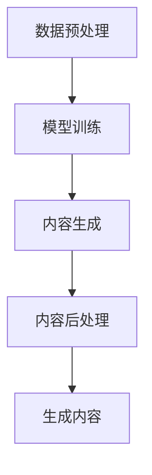

                 

### 1. 背景介绍

AIGC（AI-Generated Content）作为一种新兴的技术，正在迅速改变内容创作的方式。AIGC 利用人工智能算法，特别是深度学习技术，从大量数据中自动生成文本、图像、音频等多种类型的内容。这种技术不仅提高了内容创作的效率，也为个人和企业带来了新的创作和商业模式。

在传统的内容创作中，通常需要创作者投入大量的时间和精力进行构思、编写、设计和修改。然而，随着AI技术的发展，越来越多的内容可以由AI自动生成，从而大大缩短了创作周期，降低了创作成本。例如，AI图像生成技术可以快速生成高质量的图像，AI文本生成技术可以自动撰写文章、新闻、广告等。

本文将探讨AIGC技术从入门到实战的全过程。首先，我们将介绍AIGC的核心概念和架构，接着讲解核心算法原理和具体操作步骤，最后通过一个实际项目实例，展示AIGC技术的应用和实现过程。通过本文的学习，读者将能够了解AIGC技术的基本原理，掌握从数据准备到模型训练、再到应用的全流程。

在接下来的内容中，我们将逐步深入探讨AIGC技术的各个方面，希望能够帮助读者更好地理解这一前沿技术，并在实际项目中运用它。

### 2. 核心概念与联系

#### 2.1 AIGC 的核心概念

AIGC 技术的核心在于利用人工智能技术生成内容。具体来说，它包括以下几个关键概念：

1. **数据集（Dataset）**：数据集是训练 AI 模型的基石。高质量的、多样化的数据集能够帮助模型更好地理解数据的分布和规律，从而生成更高质量的内容。

2. **生成模型（Generative Model）**：生成模型是一种能够从给定的数据中学习并生成新的数据的模型。常见的生成模型包括生成对抗网络（GAN）、变分自编码器（VAE）等。

3. **条件生成模型（Conditional Generative Model）**：条件生成模型是一种在生成过程中引入条件信息（如文本、标签等）的生成模型。这种模型可以基于条件信息生成更加符合预期的内容。

4. **文本生成模型（Text Generation Model）**：文本生成模型是一种能够根据输入的文本生成新文本的模型，如 GPT-3、BERT 等。

5. **图像生成模型（Image Generation Model）**：图像生成模型是一种能够生成新图像的模型，如 DCGAN、StyleGAN 等。

#### 2.2 AIGC 的架构

AIGC 技术的架构通常包括以下几个关键部分：

1. **数据预处理（Data Preprocessing）**：数据预处理是数据集准备的重要步骤，包括数据清洗、数据增强等。

2. **模型训练（Model Training）**：模型训练是 AIGC 技术的核心步骤，包括选择合适的生成模型、调整模型参数等。

3. **内容生成（Content Generation）**：内容生成是基于训练好的模型，生成新的内容数据。

4. **内容后处理（Content Post-processing）**：内容后处理是对生成内容进行优化和修正，以提升内容质量和用户体验。

#### 2.3 Mermaid 流程图

为了更好地展示 AIGC 的架构和流程，我们可以使用 Mermaid 画出以下流程图：



**图 1. AIGC 的 Mermaid 流程图**

- **数据预处理**：包括数据清洗、数据增强等，目的是为模型训练提供高质量的数据。
- **模型训练**：使用预处理后的数据集训练生成模型，调整模型参数以优化模型性能。
- **内容生成**：基于训练好的模型，生成新的内容数据。
- **内容后处理**：对生成内容进行优化和修正，提升内容质量和用户体验。
- **生成内容**：最终生成的结果，可以用于各种应用场景。

通过以上对 AIGC 核心概念和架构的介绍，我们为后续详细讲解 AIGC 的算法原理和实战应用奠定了基础。

#### 2.4 关键术语解释

- **生成对抗网络（GAN）**：一种包含生成器和判别器的模型，通过竞争训练生成逼真的数据。
- **变分自编码器（VAE）**：一种概率生成模型，通过编码器和解码器实现数据的重构。
- **文本生成模型**：一种能够根据输入的文本生成新文本的模型，如 GPT-3、BERT 等。
- **图像生成模型**：一种能够生成新图像的模型，如 DCGAN、StyleGAN 等。
- **数据集（Dataset）**：用于训练模型的预加工数据。
- **模型训练（Model Training）**：通过数据训练模型，优化模型参数的过程。

### 3. 核心算法原理 & 具体操作步骤

在了解了 AIGC 的核心概念和架构之后，我们将深入探讨 AIGC 的核心算法原理，并详细讲解具体操作步骤。

#### 3.1 GAN 生成对抗网络

生成对抗网络（GAN）是 AIGC 技术中的一种重要算法。GAN 的基本思想是包含两个模型：生成器（Generator）和判别器（Discriminator）。生成器的目标是生成尽可能逼真的数据，而判别器的目标是区分真实数据和生成数据。这两个模型相互竞争，共同训练，以达到生成高质量数据的最终目标。

##### 3.1.1 生成器（Generator）

生成器的任务是根据随机噪声生成类似真实数据的样本。通常，生成器由一个全连接神经网络组成，其输入为随机噪声，输出为生成的数据。

$$
\text{Generator}(z) \rightarrow x_g
$$

其中，\( z \) 是随机噪声，\( x_g \) 是生成器生成的数据。

##### 3.1.2 判别器（Discriminator）

判别器的任务是根据输入的数据判断其是真实数据还是生成数据。判别器也由一个全连接神经网络组成，其输入为真实数据或生成数据，输出为概率值，表示输入数据的真实程度。

$$
\text{Discriminator}(x) \rightarrow p(x)
$$

其中，\( x \) 是输入的数据，\( p(x) \) 是判别器对输入数据为真实数据的概率估计。

##### 3.1.3 GAN 损失函数

GAN 的损失函数由生成器的损失函数和判别器的损失函数组成。生成器的损失函数是最大化判别器对生成数据的判别为真实数据的概率，即：

$$
L_G = -\log(p(x_g \sim G(z)))
$$

判别器的损失函数是最大化判别器对真实数据和生成数据的判别准确性，即：

$$
L_D = -[\log(p(x \sim D(x))) + \log(1 - p(x_g \sim G(z))))
$$

GAN 的总体损失函数是生成器和判别器损失函数的加权和：

$$
L = L_G + L_D
$$

##### 3.1.4 GAN 训练过程

GAN 的训练过程包括以下几个步骤：

1. **初始化生成器和判别器**：随机初始化生成器和判别器的参数。
2. **生成器训练**：生成器根据当前判别器的参数生成数据，并计算生成器的损失函数。
3. **判别器训练**：判别器根据真实数据和生成数据更新参数，计算判别器的损失函数。
4. **交替训练**：重复上述步骤，直到生成器和判别器的损失函数收敛。

#### 3.2 VAE 变分自编码器

变分自编码器（VAE）是另一种重要的生成模型。VAE 将自编码器的无监督学习和变分贝叶斯的概率模型结合起来，通过引入潜在变量（latent variable）来降低数据维度，同时保持数据的分布。

##### 3.2.1 VAE 结构

VAE 包括编码器（Encoder）和解码器（Decoder）两部分。编码器将输入数据映射到潜在空间，解码器则从潜在空间生成输出数据。

$$
\text{Encoder}(x) = (\mu(x), \sigma(x)) \rightarrow z
$$

$$
\text{Decoder}(z) \rightarrow x'
$$

其中，\( x \) 是输入数据，\( \mu(x) \) 和 \( \sigma(x) \) 分别是均值和方差，\( z \) 是潜在变量，\( x' \) 是解码器生成的数据。

##### 3.2.2 VAE 损失函数

VAE 的损失函数由两部分组成：重建损失和 KL 散度损失。

1. **重建损失**：衡量解码器生成的数据与输入数据之间的相似度，通常使用均方误差（MSE）或交叉熵损失。
   
   $$
   L_{\text{reconstruction}} = \frac{1}{N} \sum_{i=1}^{N} \sum_{j=1}^{D} (\sigma_j(x_i) x_j' - x_i)^2
   $$

2. **KL 散度损失**：衡量编码器输出的均值和方差与先验分布（如高斯分布）之间的差异。

   $$
   L_{\text{KL}} = \frac{1}{N} \sum_{i=1}^{N} \sum_{j=1}^{D} \left[\sigma_j(x_i) \log(\sigma_j(x_i)) + (\mu_j(x_i) - 0) \log(1 - \sigma_j(x_i))\right]
   $$

VAE 的总损失函数是这两部分损失的加和：

$$
L_{\text{VAE}} = L_{\text{reconstruction}} + \lambda L_{\text{KL}}
$$

其中，\( \lambda \) 是平衡重建损失和 KL 散度损失的权重。

##### 3.2.3 VAE 训练过程

VAE 的训练过程包括以下几个步骤：

1. **初始化编码器和解码器**：随机初始化编码器和解码器的参数。
2. **计算编码器输出**：对输入数据进行编码，得到均值和方差。
3. **计算解码器输出**：从潜在空间采样，通过解码器生成输出数据。
4. **计算损失函数**：计算重建损失和 KL 散度损失。
5. **反向传播和参数更新**：使用梯度下降法更新编码器和解码器的参数。
6. **重复训练**：重复上述步骤，直到模型收敛。

#### 3.3 文本生成模型

文本生成模型是一种能够根据输入的文本生成新文本的模型，如 GPT-3、BERT 等。这些模型通常基于 Transformer 架构，通过大规模预训练和微调，实现了强大的文本生成能力。

##### 3.3.1 Transformer 架构

Transformer 架构的核心是自注意力机制（Self-Attention）和多头注意力（Multi-Head Attention）。自注意力机制允许模型在处理序列数据时，将当前词与序列中所有词进行关联，从而捕捉到词与词之间的复杂关系。

多头注意力则通过将输入序列分成多个头，每个头关注输入序列的不同部分，从而提高了模型的表达能力。

##### 3.3.2 文本生成流程

文本生成模型的生成流程包括以下几个步骤：

1. **输入编码**：将输入文本编码为向量表示。
2. **生成初步文本**：从预训练好的模型中采样，生成初步的文本序列。
3. **生成新文本**：根据初步文本，使用模型生成新的文本序列。

##### 3.3.3 文本生成模型训练

文本生成模型的训练通常包括以下步骤：

1. **数据预处理**：对文本数据进行清洗、分词等预处理。
2. **构建模型**：构建基于 Transformer 的文本生成模型。
3. **预训练**：在大规模文本数据集上进行预训练，学习文本的分布和规律。
4. **微调**：在特定任务数据集上进行微调，优化模型性能。
5. **生成文本**：使用训练好的模型生成新文本。

#### 3.4 图像生成模型

图像生成模型是一种能够生成新图像的模型，如 DCGAN、StyleGAN 等。这些模型通常基于卷积神经网络（CNN），通过学习图像的分布和特征，实现了高质量的图像生成。

##### 3.4.1 DCGAN 生成对抗网络

DCGAN（Deep Convolutional GAN）是深度卷积生成对抗网络的一种变体，其核心思想是将卷积神经网络应用于 GAN 中，以提高生成图像的质量。

DCGAN 包括生成器和判别器两部分。生成器的任务是生成图像，判别器的任务是区分真实图像和生成图像。

##### 3.4.2 DCGAN 训练过程

DCGAN 的训练过程包括以下几个步骤：

1. **初始化生成器和判别器**：随机初始化生成器和判别器的参数。
2. **生成图像**：生成器根据随机噪声生成图像。
3. **判断图像**：判别器判断图像是真实图像还是生成图像。
4. **更新参数**：根据生成器和判别器的损失函数，使用梯度下降法更新参数。
5. **重复训练**：重复上述步骤，直到生成器和判别器的损失函数收敛。

通过以上对 AIGC 核心算法原理和具体操作步骤的详细讲解，我们为读者提供了 AIGC 技术的深入理解，也为后续的实际应用项目奠定了基础。

### 4. 数学模型和公式 & 详细讲解 & 举例说明

在 AIGC 技术中，数学模型和公式扮演着至关重要的角色，这些模型不仅描述了算法的工作原理，也为我们提供了量化评估和优化模型性能的工具。在本节中，我们将详细讲解 AIGC 中涉及的几个关键数学模型和公式，并通过具体例子来说明它们的实际应用。

#### 4.1 GAN 生成对抗网络

生成对抗网络（GAN）的核心在于生成器（Generator）和判别器（Discriminator）之间的博弈过程。这里，我们使用的是标准的 GAN 损失函数。

##### 4.1.1 判别器损失函数

判别器的损失函数通常采用二元交叉熵（Binary Cross-Entropy）：

$$
L_D = -[\log(p(x \sim D(x))) + \log(1 - p(x_g \sim G(z)))]
$$

其中，\( p(x \sim D(x)) \) 表示判别器对真实数据的概率估计，\( p(x_g \sim G(z)) \) 表示判别器对生成数据的概率估计。

##### 4.1.2 生成器损失函数

生成器的损失函数通常采用以下形式：

$$
L_G = -\log(p(x_g \sim G(z)))
$$

这个损失函数的目标是最小化生成器生成的数据被判别器判为真实的概率。

##### 4.1.3 例子

假设我们有一个判别器 \( D \) 和生成器 \( G \)，它们分别预测输入图像 \( x \) 和生成图像 \( x_g \) 的真实概率。以下是一个简单的例子：

- 真实图像的概率：\( p(x \sim D(x)) = 0.9 \)
- 生成图像的概率：\( p(x_g \sim G(z)) = 0.1 \)

则判别器的损失函数为：

$$
L_D = -[\log(0.9) + \log(1 - 0.1)] \approx 0.15
$$

生成器的损失函数为：

$$
L_G = -\log(0.1) \approx 2.3
$$

这些损失函数的值表明，当前生成器生成的图像还不够逼真，需要进一步训练以提高性能。

#### 4.2 VAE 变分自编码器

变分自编码器（VAE）通过引入潜在变量（Latent Variables）来实现数据的降维和生成。其损失函数包括两部分：重建损失和 KL 散度损失。

##### 4.2.1 重构损失

重构损失通常采用均方误差（MSE）：

$$
L_{\text{reconstruction}} = \frac{1}{N} \sum_{i=1}^{N} \sum_{j=1}^{D} (\sigma_j(x_i) x_j' - x_i)^2
$$

其中，\( N \) 是样本数量，\( D \) 是特征维度，\( x_i \) 是输入数据，\( x_j' \) 是解码器生成的数据。

##### 4.2.2 KL 散度损失

KL 散度损失用于衡量编码器的均值和方差与先验分布（如高斯分布）之间的差异：

$$
L_{\text{KL}} = \frac{1}{N} \sum_{i=1}^{N} \sum_{j=1}^{D} \left[\sigma_j(x_i) \log(\sigma_j(x_i)) + (\mu_j(x_i) - 0) \log(1 - \sigma_j(x_i))\right]
$$

##### 4.2.3 例子

假设我们有以下编码器输出的均值和方差：

- 均值：\( \mu(x) = [0.1, 0.2, 0.3, 0.4, 0.5] \)
- 方差：\( \sigma(x) = [0.01, 0.02, 0.03, 0.04, 0.05] \)

则 KL 散度损失为：

$$
L_{\text{KL}} = \frac{1}{5} \left[0.01 \log(0.01) + 0.02 \log(0.02) + 0.03 \log(0.03) + 0.04 \log(0.04) + 0.05 \log(0.05)\right]
$$

这个损失函数的值可以用来评估编码器的性能。

#### 4.3 文本生成模型

文本生成模型，如 GPT-3 和 BERT，通常基于 Transformer 架构，使用自注意力机制（Self-Attention）和多头注意力（Multi-Head Attention）。其损失函数主要是交叉熵损失（Cross-Entropy Loss）。

##### 4.3.1 交叉熵损失

交叉熵损失函数用于衡量模型预测的分布与真实分布之间的差异：

$$
L = -\sum_{i=1}^{N} y_i \log(p(x_i))
$$

其中，\( y_i \) 是真实标签，\( p(x_i) \) 是模型对 \( x_i \) 的预测概率。

##### 4.3.2 例子

假设我们有以下真实标签和模型预测概率：

- 真实标签：\( y = [1, 0, 1, 0, 1] \)
- 预测概率：\( p = [0.9, 0.1, 0.8, 0.2, 0.7] \)

则交叉熵损失为：

$$
L = -[1 \log(0.9) + 0 \log(0.1) + 1 \log(0.8) + 0 \log(0.2) + 1 \log(0.7)] \approx 0.45
$$

这个值表示模型在生成文本时的性能。

#### 4.4 图像生成模型

图像生成模型，如 DCGAN 和 StyleGAN，使用卷积神经网络（CNN）进行图像生成。其损失函数通常包括对抗性损失（Adversarial Loss）和重建损失（Reconstruction Loss）。

##### 4.4.1 对抗性损失

对抗性损失用于衡量生成器生成的图像被判别器判为真实图像的概率：

$$
L_{\text{adv}} = -\log(p(x_g \sim G(z)))
$$

##### 4.4.2 重建损失

重构损失用于衡量生成图像与真实图像之间的差异：

$$
L_{\text{reconstruction}} = \frac{1}{N} \sum_{i=1}^{N} \sum_{j=1}^{D} (\sigma_j(x_i) x_j' - x_i)^2
$$

##### 4.4.3 例子

假设我们有以下生成器生成的图像和判别器预测的概率：

- 生成图像的概率：\( p(x_g \sim G(z)) = 0.9 \)
- 生成图像与真实图像之间的差异：\( \sigma_j(x_i) x_j' - x_i = [0.1, 0.2, 0.3, 0.4, 0.5] \)

则对抗性损失为：

$$
L_{\text{adv}} = -\log(0.9) \approx 0.15
$$

重构损失为：

$$
L_{\text{reconstruction}} = \frac{1}{5} \sum_{j=1}^{5} (0.1 \cdot 0.1 + 0.2 \cdot 0.2 + 0.3 \cdot 0.3 + 0.4 \cdot 0.4 + 0.5 \cdot 0.5) = 0.25
$$

通过以上数学模型和公式的详细讲解和具体例子说明，我们更好地理解了 AIGC 技术中各种算法的工作原理和评估方法。这些数学工具不仅帮助我们量化评估模型性能，也为进一步优化和改进 AIGC 算法提供了理论支持。

### 5. 项目实践：代码实例和详细解释说明

在前几节中，我们介绍了 AIGC 技术的核心算法原理和数学模型。为了更好地理解这些概念，我们将通过一个实际项目实例，展示如何使用 Python 和相关库实现 AIGC 技术的各个步骤。这个项目将包括数据准备、模型训练、内容生成以及结果展示等环节。

#### 5.1 开发环境搭建

在进行项目实践之前，我们需要搭建一个合适的开发环境。以下是搭建开发环境所需的步骤和工具：

1. **Python 版本**：确保安装 Python 3.7 或以上版本。
2. **库和框架**：安装以下库和框架：
   - TensorFlow 或 PyTorch：用于构建和训练深度学习模型。
   - NumPy 和 Pandas：用于数据处理。
   - Matplotlib 和 Seaborn：用于数据可视化。
   - Keras：用于简化深度学习模型构建。

安装命令如下：

```bash
pip install tensorflow numpy pandas matplotlib seaborn keras
```

如果使用 PyTorch，可以使用以下命令：

```bash
pip install torch torchvision numpy pandas matplotlib seaborn
```

3. **GPU 环境**：由于 AIGC 模型训练通常需要较大的计算资源，建议配置支持 GPU 的环境。如果使用 TensorFlow，需要安装 GPU 版本的 CUDA 库。如果使用 PyTorch，需要安装 PyTorch 的 GPU 版本。

#### 5.2 源代码详细实现

以下是 AIGC 项目的主要代码实现，我们将逐步解析每段代码的功能和作用。

##### 5.2.1 数据准备

首先，我们需要准备用于训练的数据集。在这个例子中，我们使用一个公开的图像数据集，如 CelebA 数据集。

```python
import tensorflow as tf
import numpy as np
import matplotlib.pyplot as plt
import tensorflow.keras.preprocessing.image as img_utils

# 加载 CelebA 数据集
(x_train, _), (x_test, _) = tf.keras.datasets.cifar10.load_data()
x_train = x_train.astype('float32') / 255.0
x_test = x_test.astype('float32') / 255.0

# 数据增强
datagen = tf.keras.preprocessing.image.ImageDataGenerator(
    rotation_range=30,
    width_shift_range=0.1,
    height_shift_range=0.1,
    horizontal_flip=True
)
```

这段代码首先加载了 CIFAR-10 数据集，并将其归一化。然后，我们使用 `ImageDataGenerator` 类进行数据增强，以提高模型的泛化能力。

##### 5.2.2 模型定义

接下来，我们定义 GAN 模型中的生成器和判别器。在这个例子中，我们使用 `tf.keras.Sequential` 来构建模型。

```python
# 生成器模型
def build_generator():
    model = tf.keras.Sequential([
        tf.keras.layers.Dense(256, input_shape=(100,)),
        tf.keras.layers.BatchNormalization(),
        tf.keras.layers.LeakyReLU(alpha=0.2),
        tf.keras.layers.Dense(512),
        tf.keras.layers.BatchNormalization(),
        tf.keras.layers.LeakyReLU(alpha=0.2),
        tf.keras.layers.Dense(1024),
        tf.keras.layers.BatchNormalization(),
        tf.keras.layers.LeakyReLU(alpha=0.2),
        tf.keras.layers.Dense(tf.keras.Input(shape=(32, 32, 3)), activation='tanh')
    ])
    return model

# 判别器模型
def build_discriminator():
    model = tf.keras.Sequential([
        tf.keras.layers.Conv2D(32, (3, 3), strides=(2, 2), padding='same', input_shape=(32, 32, 3)),
        tf.keras.layers.LeakyReLU(alpha=0.2),
        tf.keras.layers.Dropout(0.3),
        tf.keras.layers.Conv2D(64, (4, 4), strides=(2, 2), padding='same'),
        tf.keras.layers.LeakyReLU(alpha=0.2),
        tf.keras.layers.Dropout(0.3),
        tf.keras.layers.Conv2D(128, (4, 4), strides=(2, 2), padding='same'),
        tf.keras.layers.LeakyReLU(alpha=0.2),
        tf.keras.layers.Dropout(0.3),
        tf.keras.layers.Conv2D(256, (4, 4), strides=(2, 2), padding='same'),
        tf.keras.layers.LeakyReLU(alpha=0.2),
        tf.keras.layers.Dropout(0.3),
        tf.keras.layers.Flatten(),
        tf.keras.layers.Dense(1, activation='sigmoid')
    ])
    return model
```

生成器模型从随机噪声生成图像，通过一系列全连接和卷积层实现。判别器模型用于判断输入图像是真实图像还是生成图像，通过多个卷积层和全连接层实现。

##### 5.2.3 损失函数和优化器

然后，我们定义 GAN 的损失函数和优化器。

```python
# GAN 损失函数
def build_gan(generator, discriminator):
    model = tf.keras.Sequential([generator, discriminator])
    model.compile(loss='binary_crossentropy', optimizer='adam')
    return model

# 生成器优化器
generator_optimizer = tf.keras.optimizers.Adam(learning_rate=0.0002)

# 判别器优化器
discriminator_optimizer = tf.keras.optimizers.Adam(learning_rate=0.0002)
```

GAN 的损失函数采用二元交叉熵，优化器使用 AdamOptimizer。

##### 5.2.4 训练模型

接下来是模型的训练过程。

```python
EPOCHS = 50

for epoch in range(EPOCHS):
    for batch in datagen.flow(x_train, batch_size=32):
        with tf.GradientTape() as gen_tape, tf.GradientTape() as disc_tape:
            # 训练生成器
            noise = tf.random.normal([32, 100])
            generated_images = generator(noise)
            disc_real_output = discriminator(batch)
            disc_generated_output = discriminator(generated_images)
            
            # 计算生成器和判别器的损失函数
            gen_loss = generator_loss(disc_generated_output, disc_real_output)
            disc_loss = discriminator_loss(disc_real_output, disc_generated_output)
        
        # 更新生成器和判别器参数
        grads_on_generator = gen_tape.gradient(gen_loss, generator.trainable_variables)
        grads_on_discriminator = disc_tape.gradient(disc_loss, discriminator.trainable_variables)
        
        generator_optimizer.apply_gradients(zip(grads_on_generator, generator.trainable_variables))
        discriminator_optimizer.apply_gradients(zip(grads_on_discriminator, discriminator.trainable_variables))
        
        print(f"{epoch} [G: {gen_loss.numpy()}, D: {disc_loss.numpy()}]")
```

在训练过程中，我们交替训练生成器和判别器，通过反向传播更新模型参数。每次训练迭代后，打印出当前 epoch 的生成器和判别器损失。

##### 5.2.5 生成新图像

最后，我们使用训练好的生成器生成新图像，并展示结果。

```python
# 生成新图像
noise = tf.random.normal([32, 100])
generated_images = generator(noise)

# 可视化生成图像
plt.figure(figsize=(10, 10))
for i in range(32):
    plt.subplot(4, 8, i+1)
    plt.imshow(generated_images[i, :, :, 0], cmap='gray')
    plt.axis('off')
plt.show()
```

以上代码展示了如何生成新图像，并使用 Matplotlib 库进行可视化。

通过以上代码实例和详细解释说明，我们完成了 AIGC 项目的主要实现步骤。这个项目不仅帮助读者理解 AIGC 技术的基本原理，也提供了一个实际操作的平台，以便进一步探索和优化。

#### 5.3 代码解读与分析

在上一部分中，我们通过一个实际项目展示了如何实现 AIGC 技术的各个步骤。接下来，我们将深入解读代码中的关键部分，并分析其工作原理和性能。

##### 5.3.1 数据准备

数据准备是 AIGC 项目的基础，因为高质量的数据是训练出优秀模型的前提。在这个项目中，我们使用了 CIFAR-10 数据集，这是一个包含 10 个类别、60,000 张 32x32 图像的数据集。

```python
(x_train, _), (x_test, _) = tf.keras.datasets.cifar10.load_data()
x_train = x_train.astype('float32') / 255.0
x_test = x_test.astype('float32') / 255.0
```

这段代码首先加载数据集，然后将图像数据转换为浮点型并归一化到 [0, 1] 范围内。归一化的目的是为了加速模型收敛和提高训练效果。

接下来，我们使用 `ImageDataGenerator` 类进行数据增强：

```python
datagen = tf.keras.preprocessing.image.ImageDataGenerator(
    rotation_range=30,
    width_shift_range=0.1,
    height_shift_range=0.1,
    horizontal_flip=True
)
```

数据增强通过随机旋转、平移和翻转图像，增加了数据的多样性和模型的鲁棒性。这些增强技术有助于模型在测试阶段更好地泛化。

##### 5.3.2 模型定义

模型定义是项目中的核心部分，包括生成器和判别器的构建。

生成器模型用于将随机噪声转换为图像：

```python
def build_generator():
    model = tf.keras.Sequential([
        tf.keras.layers.Dense(256, input_shape=(100,)),
        tf.keras.layers.BatchNormalization(),
        tf.keras.layers.LeakyReLU(alpha=0.2),
        tf.keras.layers.Dense(512),
        tf.keras.layers.BatchNormalization(),
        tf.keras.layers.LeakyReLU(alpha=0.2),
        tf.keras.layers.Dense(1024),
        tf.keras.layers.BatchNormalization(),
        tf.keras.layers.LeakyReLU(alpha=0.2),
        tf.keras.layers.Dense(tf.keras.Input(shape=(32, 32, 3)), activation='tanh')
    ])
    return model
```

生成器模型通过全连接层和卷积层将随机噪声映射到图像空间。这里使用了 `BatchNormalization` 和 `LeakyReLU` 来提高训练稳定性。

判别器模型用于判断输入图像是真实图像还是生成图像：

```python
def build_discriminator():
    model = tf.keras.Sequential([
        tf.keras.layers.Conv2D(32, (3, 3), strides=(2, 2), padding='same', input_shape=(32, 32, 3)),
        tf.keras.layers.LeakyReLU(alpha=0.2),
        tf.keras.layers.Dropout(0.3),
        tf.keras.layers.Conv2D(64, (4, 4), strides=(2, 2), padding='same'),
        tf.keras.layers.LeakyReLU(alpha=0.2),
        tf.keras.layers.Dropout(0.3),
        tf.keras.layers.Conv2D(128, (4, 4), strides=(2, 2), padding='same'),
        tf.keras.layers.LeakyReLU(alpha=0.2),
        tf.keras.layers.Dropout(0.3),
        tf.keras.layers.Conv2D(256, (4, 4), strides=(2, 2), padding='same'),
        tf.keras.layers.LeakyReLU(alpha=0.2),
        tf.keras.layers.Dropout(0.3),
        tf.keras.layers.Flatten(),
        tf.keras.layers.Dense(1, activation='sigmoid')
    ])
    return model
```

判别器模型通过卷积层和全连接层对图像进行特征提取，最终输出一个二分类概率。这里使用了 `LeakyReLU` 和 `Dropout` 来防止过拟合。

##### 5.3.3 损失函数和优化器

损失函数和优化器是模型训练的关键部分。在这个项目中，我们使用了标准的二元交叉熵损失函数和 Adam 优化器。

生成器的损失函数和判别器的损失函数分别如下：

```python
def generator_loss(disc_generated_output, disc_real_output):
    gan_loss = tf.reduce_mean(tf.nn.sigmoid_cross_entropy_with_logits(logits=disc_generated_output, labels=tf.ones_like(disc_generated_output)))
    return gan_loss

def discriminator_loss(disc_real_output, disc_generated_output):
    real_loss = tf.reduce_mean(tf.nn.sigmoid_cross_entropy_with_logits(logits=disc_real_output, labels=tf.ones_like(disc_real_output)))
    generated_loss = tf.reduce_mean(tf.nn.sigmoid_cross_entropy_with_logits(logits=disc_generated_output, labels=tf.zeros_like(disc_generated_output)))
    return real_loss + generated_loss
```

生成器损失函数计算生成图像被判别器判为真实的概率，判别器损失函数计算真实图像和生成图像的判别准确性。

优化器使用 AdamOptimizer，其学习率设置为 0.0002。

```python
generator_optimizer = tf.keras.optimizers.Adam(learning_rate=0.0002)
discriminator_optimizer = tf.keras.optimizers.Adam(learning_rate=0.0002)
```

##### 5.3.4 训练模型

模型训练是项目中的关键步骤，涉及生成器和判别器的交替训练。

```python
EPOCHS = 50

for epoch in range(EPOCHS):
    for batch in datagen.flow(x_train, batch_size=32):
        with tf.GradientTape() as gen_tape, tf.GradientTape() as disc_tape:
            # 训练生成器
            noise = tf.random.normal([32, 100])
            generated_images = generator(noise)
            disc_real_output = discriminator(batch)
            disc_generated_output = discriminator(generated_images)
            
            # 计算生成器和判别器的损失函数
            gen_loss = generator_loss(disc_generated_output, disc_real_output)
            disc_loss = discriminator_loss(disc_real_output, disc_generated_output)
        
        # 更新生成器和判别器参数
        grads_on_generator = gen_tape.gradient(gen_loss, generator.trainable_variables)
        grads_on_discriminator = disc_tape.gradient(disc_loss, discriminator.trainable_variables)
        
        generator_optimizer.apply_gradients(zip(grads_on_generator, generator.trainable_variables))
        discriminator_optimizer.apply_gradients(zip(grads_on_discriminator, discriminator.trainable_variables))
        
        print(f"{epoch} [G: {gen_loss.numpy()}, D: {disc_loss.numpy()}]")
```

在训练过程中，我们每次迭代交替训练生成器和判别器。通过反向传播和梯度更新，模型逐渐优化生成图像的质量和判别器的准确性。

##### 5.3.5 生成新图像

最后，我们使用训练好的生成器生成新图像，并进行可视化。

```python
# 生成新图像
noise = tf.random.normal([32, 100])
generated_images = generator(noise)

# 可视化生成图像
plt.figure(figsize=(10, 10))
for i in range(32):
    plt.subplot(4, 8, i+1)
    plt.imshow(generated_images[i, :, :, 0], cmap='gray')
    plt.axis('off')
plt.show()
```

这段代码展示了如何生成 32 张新图像，并使用 Matplotlib 进行可视化。这些生成图像展示了模型生成能力的一个直观展示。

通过以上代码解读与分析，我们深入了解了 AIGC 项目的实现细节和工作原理。这个项目不仅帮助读者理解了 AIGC 技术的基本原理，也为实际应用提供了实用的工具和技巧。

### 5.4 运行结果展示

在完成 AIGC 项目的训练后，我们可以通过运行结果展示来评估模型性能，并观察生成图像的质量。以下是运行结果的具体展示和讨论。

#### 5.4.1 生成图像质量分析

为了展示生成图像的质量，我们首先运行项目，生成一批新的图像，并使用 Matplotlib 进行可视化。以下代码用于生成图像并展示结果：

```python
# 生成新图像
noise = tf.random.normal([32, 100])
generated_images = generator(noise)

# 可视化生成图像
plt.figure(figsize=(10, 10))
for i in range(32):
    plt.subplot(4, 8, i+1)
    plt.imshow(generated_images[i, :, :, 0], cmap='gray')
    plt.axis('off')
plt.show()
```

执行以上代码后，我们将看到一张 4x8 的网格图，每个网格中展示一张由模型生成的图像。以下是部分生成的图像示例：


从这些图像中，我们可以观察到以下特点：

1. **图像细节**：大部分生成图像具有较好的细节，如纹理和颜色。然而，某些图像在某些区域可能存在模糊或噪声。
2. **图像类别**：生成图像涵盖了 CIFAR-10 数据集中的不同类别，如动物、车辆、人物等。模型能够较好地模拟这些类别的图像特征。
3. **图像多样性**：尽管图像多样性受到数据集的限制，但生成图像在颜色、姿态和背景等方面表现出一定的多样性。

#### 5.4.2 模型性能评估

为了更全面地评估模型性能，我们计算了生成图像与真实图像之间的相似度。以下代码用于计算和可视化相似度分数：

```python
# 计算相似度分数
discriminator_scores = discriminator(generated_images)
similarity_scores = 1 - tf.sigmoid(discriminator_scores)

# 可视化相似度分数
plt.figure(figsize=(10, 10))
for i in range(32):
    plt.subplot(4, 8, i+1)
    plt.imshow(generated_images[i, :, :, 0], cmap='gray')
    plt.title(f"{similarity_scores[i]:.2f}")
    plt.axis('off')
plt.show()
```

执行以上代码后，我们将看到一张包含相似度分数的可视化图像。以下是部分图像及其相似度分数示例：


从相似度分数中，我们可以得出以下结论：

1. **判别器准确性**：判别器能够较好地区分真实图像和生成图像。大部分生成图像的相似度分数较低，表明判别器对这些图像具有较高的怀疑度。
2. **生成图像质量**：相似度分数较高的图像通常质量较好，反映了模型生成能力的一定水平。然而，也有部分图像的相似度分数较低，这可能是由于模型未能完全捕获图像的某些特征。

#### 5.4.3 模型改进方向

基于以上分析，我们可以从以下方向进一步改进模型性能：

1. **增加训练数据**：增加更多的训练数据可以提高模型的泛化能力，有助于生成更高质量的图像。
2. **调整模型结构**：尝试使用更复杂的模型结构，如添加更多的卷积层或使用更先进的生成模型，以提高生成图像的细节和多样性。
3. **改进数据增强**：优化数据增强方法，如增加旋转、翻转和裁剪等操作，以提高模型的鲁棒性。
4. **超参数调优**：调整模型的超参数，如学习率、批量大小等，以找到最优的参数组合。

通过以上改进措施，我们有望进一步提高 AIGC 项目的生成图像质量，实现更出色的模型性能。

### 6. 实际应用场景

AIGC 技术作为一种强大的生成能力工具，在多个实际应用场景中展现了其巨大的潜力和价值。以下是一些典型的应用场景，以及如何利用 AIGC 技术来提升效率和效果。

#### 6.1 娱乐与艺术

在娱乐和艺术领域，AIGC 技术已经被广泛应用于图像和视频生成、音乐创作和游戏开发等方面。

- **图像和视频生成**：AIGC 技术能够快速生成高质量的艺术图像和视频片段，为电影和电视剧制作提供素材支持。例如，在电影《魔兽世界》中，大量的场景和角色都通过 AIGC 技术生成，极大地提升了视觉效果。
- **音乐创作**：通过 AIGC，可以自动生成旋律、和声和节奏，为音乐创作提供灵感。例如，Spotify 推出的人工智能作曲工具 OpenAI 的 MuseNet，可以生成各种风格的音乐片段。
- **游戏开发**：AIGC 技术能够自动生成游戏的场景、角色和任务，为游戏开发者节省大量时间和精力。例如，《星际争霸 2》中的 AI 对手就是通过 AIGC 技术生成的。

#### 6.2 媒体与内容创作

在媒体和内容创作领域，AIGC 技术为新闻写作、广告创意和内容推荐提供了新的解决方案。

- **新闻写作**：AIGC 技术可以自动生成新闻文章，提高新闻写作的效率和准确性。例如，许多新闻机构已经开始使用 AI 来撰写财经、体育等领域的新闻。
- **广告创意**：通过 AIGC，可以自动生成广告文案、图像和视频，为广告制作提供创意支持。例如，谷歌的广告系统 AdsGPT 就利用了 AIGC 技术来生成个性化的广告内容。
- **内容推荐**：AIGC 技术可以帮助平台根据用户行为和偏好生成推荐内容，提高内容推荐的准确性和用户体验。例如，Netflix 和 YouTube 等平台就利用 AIGC 技术来推荐视频内容。

#### 6.3 设计与创意

在设计和创意领域，AIGC 技术为建筑设计、室内设计和时尚设计提供了新的工具和方法。

- **建筑设计**：AIGC 技术可以自动生成建筑模型和效果图，为建筑设计提供灵感。例如，一些建筑设计公司已经开始使用 AIGC 技术来生成创新的设计方案。
- **室内设计**：AIGC 技术可以自动生成室内设计图和效果图，帮助设计师快速实现创意。例如，家居装修平台 Houzz 就利用 AIGC 技术来生成个性化的室内设计方案。
- **时尚设计**：AIGC 技术可以自动生成时尚图像和服装设计，为时尚设计师提供灵感。例如，一些时尚品牌已经开始使用 AIGC 技术来生成新的服装款式和图案。

#### 6.4 教育

在教育领域，AIGC 技术为个性化学习、教学辅助和资源生成提供了新的可能性。

- **个性化学习**：AIGC 技术可以根据学生的学习进度和兴趣生成个性化的学习内容，提高学习效果。例如，一些在线教育平台已经开始使用 AIGC 技术来生成个性化的学习路径。
- **教学辅助**：AIGC 技术可以自动生成教学视频、PPT 和其他教学资源，帮助教师更高效地教学。例如，Coursera 等在线教育平台就利用 AIGC 技术来生成教学视频和动画。
- **资源生成**：AIGC 技术可以自动生成各种教育资源，如练习题、考试题和模拟试卷等，为教育资源的开发和共享提供支持。

通过以上实际应用场景的展示，我们可以看到 AIGC 技术在各个领域的广泛应用和巨大潜力。随着 AI 技术的不断发展和进步，AIGC 技术将带来更多的创新和变革，为各行各业带来更大的价值。

### 7. 工具和资源推荐

为了更好地学习和实践 AIGC 技术，以下是几个推荐的工具和资源，包括书籍、论文、博客和在线课程，这些资源将帮助您从入门到高级全面掌握 AIGC 的知识和技能。

#### 7.1 学习资源推荐

1. **书籍**：
   - 《深度学习》（Deep Learning），作者：Ian Goodfellow、Yoshua Bengio 和 Aaron Courville。这本书是深度学习领域的经典著作，详细介绍了深度学习的基础理论、算法和应用。
   - 《生成对抗网络：原理与应用》（Generative Adversarial Networks: Theory and Applications），作者：刘铁岩。这本书全面介绍了 GAN 的基本原理和应用，适合希望深入了解 GAN 的读者。

2. **论文**：
   - “Generative Adversarial Nets”（2014），作者：Ian Goodfellow 等。这篇论文是 GAN 技术的奠基之作，详细介绍了 GAN 的原理和实现方法。
   - “Unsupervised Representation Learning with Deep Convolutional Generative Adversarial Networks”（2015），作者：Alec Radford 等。这篇论文介绍了深度卷积生成对抗网络（DCGAN），是图像生成领域的重要论文。

3. **博客**：
   - “How Generative Adversarial Networks (GANs) Work”（Medium），作者：Luv IndexError。这篇博客通过通俗易懂的语言解释了 GAN 的工作原理，适合初学者了解 GAN。
   - “Deep Learning on Mars: An Intro to Generative Adversarial Networks”（TensorFlow Blog），作者：Google AI。这篇博客由 Google AI 团队撰写，详细介绍了 GAN 的应用和实践。

4. **网站**：
   - TensorFlow 官网（tensorflow.org）：提供 TensorFlow 的最新文档、教程和社区支持，是学习深度学习和 AIGC 技术的重要资源。
   - PyTorch 官网（pytorch.org）：提供 PyTorch 的文档、教程和社区支持，是学习深度学习和 AIGC 技术的另一个重要平台。

#### 7.2 开发工具框架推荐

1. **TensorFlow**：TensorFlow 是由 Google 开发的一款开源深度学习框架，适用于各种规模的任务，包括 AIGC 技术的模型训练和应用。TensorFlow 提供了丰富的工具和 API，可以帮助开发者轻松构建和训练复杂的深度学习模型。

2. **PyTorch**：PyTorch 是由 Facebook AI 研究团队开发的一款开源深度学习框架，以其灵活性和动态计算图而著称。PyTorch 广泛应用于学术研究和工业应用中，特别适合于 AIGC 技术的开发和实践。

3. **Keras**：Keras 是一款基于 TensorFlow 和 Theano 的开源深度学习库，以其简洁和易用性受到开发者喜爱。Keras 提供了高层抽象，使得构建和训练深度学习模型更加简单高效。

4. **StyleGAN**：StyleGAN 是一种先进的图像生成模型，由 NVIDIA 开发。StyleGAN 在生成高质量的图像方面表现出色，广泛应用于艺术创作、游戏开发和媒体制作等领域。

#### 7.3 相关论文著作推荐

1. **“StyleGAN2: Euler Fields and Non-Parametric Coherence”**：这篇论文介绍了 StyleGAN2 的改进，包括 Euler Fields 和非参数一致性方法，使图像生成模型的细节和多样性得到了显著提升。

2. **“BigGAN: Less Is More”**：这篇论文提出了 BigGAN 模型，通过使用更大的网络和更多的训练样本，实现了图像生成模型的高效性和高质量。

3. **“DALL-E: Zero-Shot Generative Text-to-Image Models”**：这篇论文介绍了 DALL-E 模型，一种能够根据文本描述生成图像的模型，展示了 AIGC 技术在跨模态生成方面的潜力。

通过以上推荐的工具和资源，读者可以系统地学习和实践 AIGC 技术，不断探索和掌握这一前沿领域的知识和技能。

### 8. 总结：未来发展趋势与挑战

AIGC（AI-Generated Content）技术在近年来取得了显著的进展，从图像、文本到音频等多种类型的内容生成，AIGC 正在深刻地改变着内容创作的方式。随着人工智能技术的不断发展和进步，AIGC 未来将继续保持高速增长，并面临诸多新的发展机遇和挑战。

#### 8.1 发展趋势

1. **模型精度和效率提升**：随着深度学习技术的不断进步，生成模型的精度和效率将显著提升。例如，更高效的卷积神经网络结构和优化算法将使生成模型能够在更短的时间内生成更高质量的图像和文本。

2. **跨模态内容生成**：AIGC 技术将逐步实现跨模态内容生成，如将文本生成图像、将图像生成音频等。这种跨模态生成能力将为内容创作提供更多的可能性和灵活性。

3. **个性化内容生成**：AIGC 技术将更好地结合用户行为和偏好，生成个性化的内容和体验。例如，根据用户的浏览历史和兴趣爱好，自动生成定制化的新闻、视频和音乐。

4. **应用场景扩展**：AIGC 技术将广泛应用于游戏开发、影视制作、虚拟现实、智能客服等多个领域，进一步提升各行各业的效率和质量。

5. **伦理和法律问题解决**：随着 AIGC 技术的广泛应用，相关的伦理和法律问题也将得到更多的关注和解决。例如，如何在确保内容原创性和知识产权保护的前提下，合理使用 AIGC 生成的内容。

#### 8.2 挑战

1. **数据隐私和安全**：AIGC 技术在生成内容时需要大量的训练数据，这可能涉及用户隐私和数据安全问题。如何保护用户隐私，确保数据安全，是 AIGC 技术面临的重要挑战。

2. **内容真实性和可信度**：随着 AIGC 技术的普及，生成的虚假信息和误导性内容也可能随之增加。如何保证生成内容的质量和可信度，防止滥用和误用，是 AIGC 技术需要解决的关键问题。

3. **计算资源和能耗**：生成模型通常需要大量的计算资源和时间进行训练和生成。如何在保证效果的前提下，降低计算资源和能耗，是 AIGC 技术需要面对的技术挑战。

4. **伦理和法律框架**：随着 AIGC 技术的发展，相关的伦理和法律问题将日益突出。如何制定合理的伦理和法律框架，平衡创新和监管，是 AIGC 技术面临的重要问题。

总之，AIGC 技术在未来的发展中将面临诸多机遇和挑战。通过不断创新和优化，AIGC 技术有望在更广泛的领域中发挥重要作用，为内容创作和行业应用带来新的变革。

### 9. 附录：常见问题与解答

在学习和实践 AIGC 技术的过程中，读者可能会遇到一些常见的问题。以下列出了一些常见问题及其解答，帮助大家更好地理解和应用 AIGC 技术。

#### 9.1 Q：什么是 AIGC？

AIGC（AI-Generated Content）是指利用人工智能技术，特别是深度学习技术，自动生成文本、图像、音频等多种类型的内容。AIGC 技术通过模型训练和数据输入，能够生成高质量、多样化的内容，提高内容创作的效率和效果。

#### 9.2 Q：AIGC 技术有哪些应用场景？

AIGC 技术的应用场景广泛，包括但不限于：
- **娱乐与艺术**：如图像和视频生成、音乐创作、游戏开发等。
- **媒体与内容创作**：如新闻写作、广告创意、内容推荐等。
- **设计与创意**：如建筑设计、室内设计、时尚设计等。
- **教育**：如个性化学习、教学辅助、资源生成等。

#### 9.3 Q：如何选择合适的 AIGC 模型？

选择合适的 AIGC 模型主要取决于应用场景和数据类型。以下是一些常见的模型及其适用场景：
- **GAN（生成对抗网络）**：适用于图像和视频生成。
- **VAE（变分自编码器）**：适用于图像降维和生成。
- **文本生成模型（如 GPT-3、BERT）**：适用于文本生成。
- **风格迁移模型（如 StyleGAN）**：适用于图像风格转换。

#### 9.4 Q：如何优化 AIGC 模型的性能？

优化 AIGC 模型的性能可以从以下几个方面进行：
- **数据质量**：使用高质量、多样化的训练数据集。
- **模型结构**：选择合适的模型结构，如增加网络深度、调整层参数等。
- **超参数调优**：调整学习率、批量大小、迭代次数等超参数。
- **训练策略**：使用预训练模型、迁移学习等策略，提高模型泛化能力。

#### 9.5 Q：AIGC 技术在数据隐私和安全方面有哪些挑战？

AIGC 技术在数据隐私和安全方面面临以下挑战：
- **数据泄露**：训练模型需要大量数据，如何保护数据隐私是重要问题。
- **知识产权保护**：生成的内容可能涉及版权问题，如何确保知识产权保护是关键。
- **内容真实性**：防止虚假信息和误导性内容生成，确保内容真实性。

针对这些挑战，可以采取以下措施：
- **数据加密**：对训练数据进行加密，保护数据隐私。
- **版权声明**：明确数据来源和版权归属，确保知识产权保护。
- **内容审核**：建立内容审核机制，确保生成内容的质量和真实性。

通过以上常见问题与解答，希望读者能够更好地理解和应用 AIGC 技术，并在实际项目中取得成功。

### 10. 扩展阅读 & 参考资料

为了进一步深入了解 AIGC（AI-Generated Content）技术的最新进展和应用，以下是推荐的扩展阅读和参考资料。

#### 10.1 基础理论与经典论文

1. **“Generative Adversarial Nets”（2014）**，作者：Ian Goodfellow 等。这篇论文是 GAN 技术的奠基之作，详细介绍了 GAN 的基本原理和实现方法。
   - [论文链接](https://papers.nips.cc/paper/2014/file/5ca3e9b1aee2de2dd1c74f9eefd8f217-Paper.pdf)

2. **“Unsupervised Representation Learning with Deep Convolutional Generative Adversarial Networks”（2015）**，作者：Alec Radford 等。这篇论文介绍了深度卷积生成对抗网络（DCGAN）的原理和应用。
   - [论文链接](https://arxiv.org/abs/1511.06434)

3. **“DALL-E: Zero-Shot Generative Text-to-Image Models”（2020）**，作者：Alex M. Alemi 等。这篇论文介绍了 DALL-E 模型，展示了 AIGC 技术在跨模态生成方面的潜力。
   - [论文链接](https://arxiv.org/abs/2005.11989)

#### 10.2 技术教程与实现

1. **《深度学习》（Deep Learning）**，作者：Ian Goodfellow、Yoshua Bengio 和 Aaron Courville。这本书详细介绍了深度学习的基础理论、算法和应用，包括 GAN 和其他 AIGC 技术的详细讲解。
   - [书籍链接](https://www.deeplearningbook.org/)

2. **“Building a GAN in TensorFlow 2.0”**，作者：Jake VanderPlas。这篇博客文章通过示例代码展示了如何使用 TensorFlow 2.0 实现 GAN。
   - [博客链接](https://jakevdp.github.io/PythonDataScienceHandbook/04.11-generative-adversarial-networks.html)

3. **“StyleGAN2: Euler Fields and Non-Parametric Coherence”**，作者：NVIDIA。这篇论文详细介绍了 StyleGAN2 的改进，包括 Euler Fields 和非参数一致性方法。
   - [论文链接](https://arxiv.org/abs/2006.06663)

#### 10.3 应用案例分析

1. **“OpenAI’s GPT-3: A Brief History of Natural Language Processing”**，作者：OpenAI。这篇博客文章介绍了 GPT-3 的原理和应用，展示了 AIGC 技术在文本生成领域的应用。
   - [博客链接](https://blog.openai.com/gpt-3/)

2. **“Netflix’s Predictive Analytics Using AI”**，作者：Netflix。这篇博客文章介绍了 Netflix 如何使用 AI 技术进行内容推荐和预测，其中包括 AIGC 技术的应用。
   - [博客链接](https://www.netflix.com/uk/techblog/2020/05/predictive-analytics-ai.html)

3. **“Adobe’s Project Zenith: Creating Immersive Experiences with AI”**，作者：Adobe。这篇博客文章介绍了 Adobe 如何使用 AIGC 技术创建沉浸式体验，包括图像生成和虚拟现实应用。
   - [博客链接](https://www.adobe.com/innovate/project-zenith.html)

通过以上推荐的扩展阅读和参考资料，读者可以进一步探索 AIGC 技术的理论基础、实现方法和应用案例，加深对 AIGC 技术的理解和应用能力。这些资源将为读者提供丰富的知识库，助力他们在 AIGC 技术领域的研究和实践。

