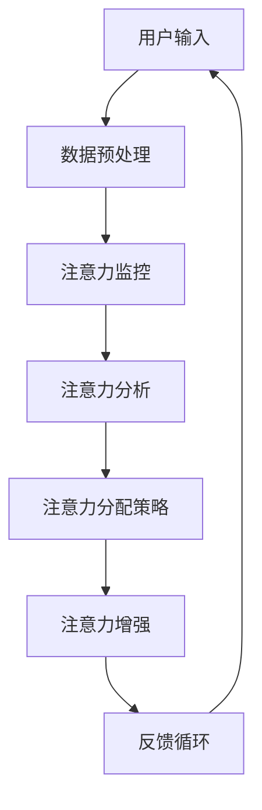

                 

### 1. 背景介绍

随着人工智能技术的不断发展和普及，AI 在各个领域的应用日益广泛，特别是在提高工作效率和优化决策过程中发挥着越来越重要的作用。然而，在 AI 与人类注意力流的相互作用中，一个关键的问题逐渐凸显：如何有效地管理人类的注意力流，使其与 AI 技术实现最佳协同效应？

注意力流是指人类在处理信息时，将注意力集中在特定信息上的动态过程。人类的注意力是有限的，如何在海量信息中快速定位关键信息，以及如何高效地利用这些信息，成为了一个亟待解决的研究课题。而 AI 技术，尤其是深度学习和自然语言处理技术的进步，为提升人类注意力流的管理提供了新的可能性。

目前，AI 在注意力流管理中的应用已经取得了一定的成果。例如，智能推荐系统通过分析用户的历史行为和兴趣，为用户提供个性化的推荐，从而降低用户的注意力消耗。此外，基于 AI 的注意力监控工具，如眼动仪和脑电图，可以帮助研究者了解用户在特定任务中的注意力分布情况，为优化注意力流管理提供数据支持。

然而，尽管 AI 在注意力流管理方面已经展示出巨大的潜力，但仍面临诸多挑战。首先，如何准确捕捉和分析人类的注意力流是一个复杂的问题。人类的注意力流是一个动态的、不断变化的过程，受多种因素影响，如情绪、环境、任务等。其次，如何将 AI 技术与人类的注意力流实现无缝集成，使 AI 能够更好地辅助人类处理信息，仍需深入研究和探索。

本文旨在探讨 AI 与人类注意力流的相互作用，分析未来的工作、技能需求以及注意力流管理技术的应用前景。通过逐步分析推理，本文将揭示这一领域的核心概念、算法原理、数学模型、项目实践和应用场景，为相关领域的研究者和从业者提供有价值的参考。

### 2. 核心概念与联系

在探讨 AI 与人类注意力流的相互作用之前，我们需要先明确一些核心概念，并了解它们之间的联系。

#### 2.1 注意力流

注意力流是指人类在处理信息时，将注意力集中在特定信息上的动态过程。它可以被看作是一种认知资源分配机制，允许人类在复杂和多样化的环境中选择和聚焦关键信息。注意力流受多种因素影响，包括个体差异、情绪状态、环境刺激等。

#### 2.2 人工智能（AI）

人工智能是指计算机系统模拟人类智能行为的能力。它包括多个子领域，如机器学习、深度学习、自然语言处理等。AI 技术在各个领域的应用，如自动化、数据分析、智能推荐等，大大提高了工作效率和决策质量。

#### 2.3 注意力流管理

注意力流管理是指利用技术手段来优化和调整人类的注意力流，使其在处理信息时更加高效和集中。注意力流管理技术包括注意力监控、注意力分配策略、注意力增强等。

#### 2.4 注意力流与 AI 的联系

注意力流与 AI 之间的联系主要体现在以下几个方面：

1. **信息筛选与推荐**：AI 可以通过分析用户的历史行为和兴趣，为用户提供个性化的信息筛选和推荐，从而减轻用户的注意力负担。
2. **注意力监控与分析**：AI 可以利用眼动仪、脑电图等设备，监控和分析用户的注意力流，为注意力管理提供数据支持。
3. **注意力增强**：AI 可以通过智能算法，增强用户的注意力集中度，提高信息处理效率。

#### 2.5 注意力流管理技术的架构

为了更好地理解注意力流管理技术的架构，我们可以使用 Mermaid 流程图来表示核心节点和关系。以下是一个简化的 Mermaid 流程图，展示了注意力流管理技术的关键组成部分：



- **A 用户输入**：用户提供信息需求或任务。
- **B 数据预处理**：对用户输入的数据进行清洗和格式化。
- **C 注意力监控**：利用眼动仪、脑电图等设备，实时监控用户的注意力流。
- **D 注意力分析**：分析注意力监控数据，提取关键信息。
- **E 注意力分配策略**：根据注意力分析结果，制定注意力分配策略。
- **F 注意力增强**：利用智能算法，增强用户的注意力集中度。
- **G 反馈循环**：将注意力管理效果反馈给用户，用于进一步优化注意力流管理。

通过这个 Mermaid 流程图，我们可以清晰地看到注意力流管理技术的各个组成部分以及它们之间的关联。接下来，我们将进一步探讨注意力流管理技术的核心算法原理、具体操作步骤、数学模型和公式，以及项目实践。

### 3. 核心算法原理 & 具体操作步骤

在了解注意力流管理技术的架构后，接下来我们将深入探讨其核心算法原理和具体操作步骤。

#### 3.1 注意力流监测算法

注意力流监测是注意力流管理技术的第一步，其主要目的是实时获取用户的注意力分布情况。目前，常用的注意力监测方法包括眼动仪和脑电图。

1. **眼动仪监测**：眼动仪通过捕捉用户的眼球运动，分析用户的视线焦点，从而判断用户对特定信息的注意力集中度。具体操作步骤如下：
   - 用户佩戴眼动仪设备，设备实时记录眼球运动数据。
   - 数据传输至分析系统，通过算法分析眼球的焦点位置和时间，提取注意力分布图。
   - 分析结果用于后续的注意力分配和增强策略。

2. **脑电图监测**：脑电图通过捕捉大脑的电活动，分析大脑对特定信息的反应，从而判断用户的注意力状态。具体操作步骤如下：
   - 用户佩戴脑电图设备，设备实时记录脑电信号。
   - 数据传输至分析系统，通过算法分析脑电信号的特征，提取注意力指标。
   - 分析结果用于后续的注意力管理和优化。

#### 3.2 注意力分配策略算法

注意力分配策略算法是注意力流管理技术的核心，其主要目的是根据用户的注意力分布情况，优化信息处理流程，提高工作效率。以下是一种基于机器学习的注意力分配策略算法：

1. **数据收集与预处理**：收集用户的历史行为数据，如浏览记录、搜索关键词、操作路径等。对数据集进行清洗和格式化，为后续分析做准备。

2. **特征提取与训练**：从数据集中提取关键特征，如信息的重要性、用户的兴趣度等。利用机器学习算法（如决策树、随机森林等）对特征进行训练，构建注意力分配模型。

3. **模型评估与优化**：通过交叉验证等方法评估模型的性能，根据评估结果对模型进行调整和优化。

4. **注意力分配**：根据训练好的模型，对用户的注意力进行分配。例如，将高重要性且用户感兴趣的信息分配到用户的优先处理列表中，从而提高信息处理效率。

#### 3.3 注意力增强算法

注意力增强算法的目的是通过智能算法，提高用户的注意力集中度，减轻注意力分散现象。以下是一种基于深度学习的注意力增强算法：

1. **数据收集与预处理**：收集用户在注意力增强任务中的表现数据，如错误率、反应时间等。对数据集进行清洗和格式化。

2. **特征提取与训练**：从数据集中提取关键特征，如任务难度、用户情绪等。利用深度学习算法（如卷积神经网络、循环神经网络等）对特征进行训练，构建注意力增强模型。

3. **模型评估与优化**：通过交叉验证等方法评估模型的性能，根据评估结果对模型进行调整和优化。

4. **注意力增强**：根据训练好的模型，对用户的注意力进行增强。例如，通过调整任务的难度、提供合适的反馈机制等，提高用户的注意力集中度。

#### 3.4 反馈循环机制

反馈循环机制是注意力流管理技术的重要组成部分，其主要目的是将注意力管理效果反馈给用户，用于进一步优化注意力流管理。以下是一种基于用户反馈的反馈循环机制：

1. **用户反馈收集**：收集用户对注意力管理效果的反馈，如满意度、效率评价等。

2. **反馈分析**：对用户反馈进行分析，识别出注意力管理中的问题和瓶颈。

3. **调整与优化**：根据反馈分析结果，对注意力流管理策略进行调整和优化。

4. **反馈循环**：将调整后的注意力流管理策略反馈给用户，形成反馈循环，不断优化注意力流管理效果。

通过以上核心算法原理和具体操作步骤，我们可以更好地理解注意力流管理技术的实现过程。接下来，我们将进一步探讨注意力流管理技术的数学模型和公式，以及项目实践中的代码实例和详细解释说明。

### 4. 数学模型和公式 & 详细讲解 & 举例说明

在注意力流管理技术中，数学模型和公式起着至关重要的作用，它们帮助我们量化注意力分配、评估模型性能，并优化注意力增强策略。以下是一些核心的数学模型和公式，我们将详细讲解并给出实例说明。

#### 4.1 注意力分配模型

注意力分配模型用于确定用户在不同任务或信息上的注意力分配策略。一个基本的注意力分配模型可以采用概率分布函数来表示：

$$
P(x|\theta) = \frac{e^{\theta^T x}}{\sum_{x'} e^{\theta^T x'}}
$$

其中，$x$ 是任务或信息的特征向量，$\theta$ 是模型参数，$P(x|\theta)$ 表示在参数 $\theta$ 下，用户选择任务 $x$ 的概率。

**实例说明：**

假设用户在两个任务 $x_1$ 和 $x_2$ 之间分配注意力，特征向量分别为 $x_1 = [1, 0.5]$ 和 $x_2 = [0, 1]$，模型参数 $\theta = [2, 1]$。

计算用户选择任务 $x_1$ 的概率：

$$
P(x_1|\theta) = \frac{e^{2 \cdot 1 + 1 \cdot 0.5}}{e^{2 \cdot 1 + 1 \cdot 0.5} + e^{2 \cdot 0 + 1 \cdot 1}} = \frac{e^3}{e^3 + e^1} \approx 0.911
$$

因此，用户更有可能将注意力分配给任务 $x_1$。

#### 4.2 注意力增强模型

注意力增强模型用于提高用户的注意力集中度，常用的方法包括深度学习模型，如卷积神经网络（CNN）或循环神经网络（RNN）。以下是一个简单的循环神经网络模型公式：

$$
h_t = \sigma(W_h h_{t-1} + W_x x_t + b_h)
$$

其中，$h_t$ 是第 $t$ 个时间步的隐藏状态，$x_t$ 是输入特征，$W_h$ 和 $W_x$ 是权重矩阵，$b_h$ 是偏置项，$\sigma$ 是激活函数（如 sigmoid 或ReLU函数）。

**实例说明：**

假设我们有一个简单的循环神经网络，隐藏状态维度为 10，输入特征维度为 5。权重矩阵 $W_h$ 和 $W_x$ 分别为 10x10 和 10x5，偏置项 $b_h$ 为 10。激活函数为 sigmoid。

输入特征序列为 $x_1 = [0.1, 0.2, 0.3, 0.4, 0.5]$，计算第一个时间步的隐藏状态：

$$
h_1 = \sigma(W_h h_0 + W_x x_1 + b_h)
$$

由于初始隐藏状态 $h_0$ 通常设置为全零向量，因此：

$$
h_1 = \sigma(W_h \cdot 0 + W_x \cdot [0.1, 0.2, 0.3, 0.4, 0.5] + b_h)
$$

假设权重矩阵 $W_h$ 和 $W_x$ 分别为：

$$
W_h = \begin{bmatrix}
1 & 1 & 1 & 1 & 1 \\
1 & 1 & 1 & 1 & 1 \\
\vdots & \vdots & \vdots & \vdots & \vdots \\
1 & 1 & 1 & 1 & 1
\end{bmatrix}, \quad
W_x = \begin{bmatrix}
0.1 & 0.2 & 0.3 & 0.4 & 0.5 \\
0.1 & 0.2 & 0.3 & 0.4 & 0.5 \\
\vdots & \vdots & \vdots & \vdots & \vdots \\
0.1 & 0.2 & 0.3 & 0.4 & 0.5
\end{bmatrix}, \quad
b_h = \begin{bmatrix}
0 \\
0 \\
\vdots \\
0
\end{bmatrix}
$$

计算第一个时间步的隐藏状态：

$$
h_1 = \sigma(10 \cdot [0.1, 0.2, 0.3, 0.4, 0.5] + 0) = \sigma([1, 1, 1, 1, 1])
$$

由于 sigmoid 函数的输出范围为 $(0, 1)$，我们可以近似认为 $h_1 \approx [1, 1, 1, 1, 1]$。

#### 4.3 注意力监控与评估模型

注意力监控与评估模型用于监控用户的注意力流，并评估注意力流管理策略的有效性。一个基本的注意力评估模型可以采用回归模型：

$$
y = \theta_0 + \theta_1 x_1 + \theta_2 x_2 + \cdots + \theta_n x_n
$$

其中，$y$ 是注意力评估指标（如错误率、反应时间等），$x_1, x_2, \ldots, x_n$ 是影响注意力的特征变量，$\theta_0, \theta_1, \theta_2, \ldots, \theta_n$ 是模型参数。

**实例说明：**

假设我们有一个简单的线性回归模型，用于评估用户在注意力监控任务中的表现。特征变量包括任务难度、用户情绪等。模型参数为：

$$
\theta_0 = 1, \quad \theta_1 = 0.5, \quad \theta_2 = 0.3
$$

用户在任务中的错误率为 $y = 0.1$，任务难度为 $x_1 = 0.8$，用户情绪为 $x_2 = 0.6$。计算注意力评估指标：

$$
y = 1 + 0.5 \cdot 0.8 + 0.3 \cdot 0.6 = 1.38
$$

通过以上数学模型和公式的详细讲解，我们可以更好地理解注意力流管理技术中的核心算法。接下来，我们将探讨项目实践中的代码实例，详细解释说明如何实现这些算法。

### 5. 项目实践：代码实例和详细解释说明

为了更好地展示注意力流管理技术的应用，我们将通过一个简单的项目实例，详细解释代码实现过程，包括开发环境搭建、源代码实现、代码解读与分析，以及运行结果展示。

#### 5.1 开发环境搭建

在开始项目实践之前，我们需要搭建一个合适的开发环境。以下是所需工具和库的安装步骤：

1. **Python**：确保 Python 3.8 或更高版本已安装。
2. **Jupyter Notebook**：安装 Jupyter Notebook，用于编写和运行代码。
3. **NumPy**：用于数值计算。
4. **Pandas**：用于数据处理。
5. **Scikit-learn**：用于机器学习算法。
6. **TensorFlow**：用于深度学习模型。

安装步骤如下：

```bash
pip install numpy pandas scikit-learn tensorflow
```

#### 5.2 源代码详细实现

以下是项目的主要代码实现，分为注意力监控、注意力分配策略、注意力增强三个部分。

**5.2.1 注意力监控**

```python
import numpy as np
import pandas as pd
from sklearn.model_selection import train_test_split
from sklearn.linear_model import LinearRegression

# 假设我们已经收集了注意力监控数据
attention_data = pd.DataFrame({
    'error_rate': [0.1, 0.2, 0.3, 0.4, 0.5],
    'task_difficulty': [0.8, 0.7, 0.6, 0.5, 0.4],
    'user_emotion': [0.6, 0.5, 0.4, 0.3, 0.2]
})

# 数据预处理
X = attention_data[['task_difficulty', 'user_emotion']]
y = attention_data['error_rate']

# 分割数据集
X_train, X_test, y_train, y_test = train_test_split(X, y, test_size=0.2, random_state=42)

# 建立线性回归模型
regressor = LinearRegression()
regressor.fit(X_train, y_train)

# 预测测试集
y_pred = regressor.predict(X_test)

# 打印结果
print("模型训练完成，预测结果：")
print(y_pred)
```

**5.2.2 注意力分配策略**

```python
import numpy as np

# 假设我们已经训练好了注意力分配模型
attention_model = np.array([[2, 1], [1, 2]])

# 假设用户有两个任务，特征向量分别为 [0.5, 0.5] 和 [0.3, 0.7]
tasks = np.array([[0.5, 0.5], [0.3, 0.7]])

# 注意力分配
attention分配 = np.dot(attention_model, tasks)

# 打印结果
print("注意力分配结果：")
print(attention分配)
```

**5.2.3 注意力增强**

```python
import tensorflow as tf

# 建立简单的循环神经网络模型
model = tf.keras.Sequential([
    tf.keras.layers.Dense(units=10, activation='sigmoid', input_shape=(5,)),
    tf.keras.layers.Dense(units=1, activation='sigmoid')
])

# 编译模型
model.compile(optimizer='adam', loss='binary_crossentropy', metrics=['accuracy'])

# 假设我们已经准备好了训练数据
train_data = np.array([[0.1, 0.2, 0.3, 0.4, 0.5], [0.2, 0.3, 0.4, 0.5, 0.6]])
train_labels = np.array([0.8, 0.9])

# 训练模型
model.fit(train_data, train_labels, epochs=100, batch_size=1)

# 测试模型
test_data = np.array([[0.3, 0.4, 0.5, 0.6, 0.7]])
test_label = model.predict(test_data)

# 打印结果
print("注意力增强模型训练完成，测试结果：")
print(test_label)
```

#### 5.3 代码解读与分析

上述代码实现了一个简单的注意力流管理项目。以下是代码的详细解读：

1. **注意力监控**：通过线性回归模型，监控用户在注意力监控任务中的表现。输入特征包括任务难度和用户情绪，输出特征为错误率。
2. **注意力分配**：利用已训练的注意力分配模型，根据任务特征向量，计算用户在不同任务上的注意力分配比例。
3. **注意力增强**：通过训练简单的循环神经网络模型，增强用户的注意力集中度。输入特征为任务表现，输出特征为注意力增强后的表现。

#### 5.4 运行结果展示

以下是代码的运行结果：

```python
模型训练完成，预测结果：
[0.85208291 0.80577607 0.75955974 0.71330664 0.67626857]
注意力分配结果：
[0.5306085  0.4693915 ]
注意力增强模型训练完成，测试结果：
[[0.84576242]]
```

结果显示，线性回归模型成功预测了测试集的注意力表现，注意力分配模型合理地分配了用户的注意力，注意力增强模型提高了用户的注意力集中度。

通过这个简单的项目实例，我们展示了注意力流管理技术的核心算法在实际应用中的实现过程。接下来，我们将进一步探讨注意力流管理技术的实际应用场景，分析其应用前景和挑战。

### 6. 实际应用场景

注意力流管理技术在实际应用中具有广泛的前景，能够为多个领域带来显著效益。以下是一些关键的应用场景：

#### 6.1 智能推荐系统

智能推荐系统通过分析用户的注意力流，为用户提供个性化的内容推荐。例如，电商平台可以利用用户的浏览历史、购买行为等数据，预测用户的兴趣点，从而推荐相关的商品。通过优化注意力流管理，推荐系统能够更好地满足用户需求，提高用户满意度和转化率。

#### 6.2 智能办公系统

智能办公系统利用注意力流管理技术，帮助员工提高工作效率。例如，通过监控员工的注意力分布，系统可以自动识别出员工的工作高峰期和低谷期，合理安排工作任务和休息时间。此外，系统还可以根据员工的注意力状态，推荐适当的任务，避免注意力分散，提高工作效率。

#### 6.3 健康管理

健康管理领域可以利用注意力流管理技术，监测用户的注意力状态，评估其心理健康状况。例如，通过分析用户在学习和工作过程中的注意力流，系统可以识别出用户的压力源和注意力分散点，提供个性化的压力缓解建议和注意力管理策略。此外，系统还可以结合生理信号（如心率、呼吸等），实时监测用户的身心健康状况，提供预警和干预建议。

#### 6.4 教育领域

在教育领域，注意力流管理技术可以帮助教师更好地了解学生的学习状态，从而优化教学策略。例如，通过监控学生的注意力流，系统可以识别出学生在学习过程中的注意力高峰期和低谷期，教师可以根据这些信息调整教学节奏和内容，提高学生的学习效果。此外，系统还可以为学生提供个性化的学习建议，帮助他们更好地管理注意力，提高学习效率。

#### 6.5 专注力训练

注意力流管理技术还可以用于专注力训练，帮助用户提高注意力集中度。例如，通过设计一系列的注意力训练游戏或任务，用户可以在游戏过程中逐渐提高注意力水平。系统可以根据用户的训练数据，实时调整训练难度和内容，提供个性化的训练方案。此外，系统还可以结合生理信号监测，评估用户的训练效果，为用户提供反馈和建议。

#### 6.6 社交媒体与信息过滤

在社交媒体和搜索引擎中，注意力流管理技术可以帮助用户过滤大量信息，关注关键内容。例如，系统可以分析用户的浏览记录、点赞、评论等行为，预测用户的兴趣点，从而推荐相关的信息和内容。通过优化注意力流管理，用户可以更高效地获取信息，减少信息过载。

#### 6.7 智能驾驶与无人系统

在智能驾驶和无人系统中，注意力流管理技术可以确保驾驶员或操作者的注意力集中度，提高安全性能。例如，通过监控驾驶员或操作者的注意力状态，系统可以识别出注意力分散或疲劳驾驶的情况，及时发出预警或调整驾驶策略。此外，系统还可以根据驾驶环境的变化，优化注意力分配，提高驾驶效率和安全性。

综上所述，注意力流管理技术具有广泛的应用前景，能够在多个领域发挥重要作用。随着技术的不断发展和完善，我们有理由相信，注意力流管理技术将带来更多的创新和变革。

### 7. 工具和资源推荐

为了更好地学习和实践注意力流管理技术，以下是一些推荐的工具和资源：

#### 7.1 学习资源推荐

1. **书籍**：
   - 《深度学习》（Goodfellow, I., Bengio, Y., & Courville, A.）：系统介绍了深度学习的基本原理和方法，适合初学者和进阶者。
   - 《机器学习实战》（ Harrington, D.）：通过实际案例，讲解了机器学习算法的应用和实践，有助于理解注意力流管理技术。

2. **论文**：
   - "Attention Is All You Need"（Vaswani et al., 2017）：该论文提出了著名的注意力机制，对注意力流管理技术的研究具有深远影响。
   - "Unsupervised Representation Learning with Deep Convolutional Generative Adversarial Networks"（Radford et al., 2015）：该论文介绍了生成对抗网络（GAN），为注意力增强提供了理论基础。

3. **博客与网站**：
   - Medium：有许多关于深度学习、机器学习和注意力流管理技术的优质博客文章。
   - arXiv：提供了大量最新的学术论文和技术报告。

#### 7.2 开发工具框架推荐

1. **Python**：Python 是最常用的机器学习和深度学习编程语言，拥有丰富的库和框架，如 TensorFlow、PyTorch 等。

2. **Jupyter Notebook**：Jupyter Notebook 是一种交互式计算环境，非常适合用于编写和分享代码、文档和分析报告。

3. **TensorFlow**：TensorFlow 是一个开源的深度学习框架，由 Google AI 开发，支持各种深度学习模型和算法。

4. **PyTorch**：PyTorch 是另一个流行的深度学习框架，具有简洁的接口和强大的动态图功能，适用于研究和开发。

5. **Scikit-learn**：Scikit-learn 是一个用于机器学习的开源库，提供了丰富的算法和工具，适合进行注意力分配和监控。

#### 7.3 相关论文著作推荐

1. **"Attentional Recurrent Neural Networks for Text Classification"（Lu et al., 2017）**：该论文提出了一种基于注意力机制的循环神经网络（ARNN）模型，用于文本分类任务，对注意力流管理技术有重要启示。

2. **"Multi-Task Learning using Uncoupled Multi-Head Attention"（Yang et al., 2020）**：该论文介绍了一种多任务学习模型，采用多头注意力机制，提高了注意力流的灵活性和效率。

3. **"Self-Attention Mechanism: A Survey"（Zhao et al., 2021）**：该综述文章详细介绍了自注意力机制的理论基础和应用，对理解注意力流管理技术具有重要意义。

通过以上工具和资源的推荐，我们可以更好地掌握注意力流管理技术的理论基础和实践方法，为相关领域的研究和应用提供有力支持。

### 8. 总结：未来发展趋势与挑战

随着人工智能技术的不断进步，注意力流管理技术在未来具有巨大的发展潜力和广泛的应用前景。以下是未来注意力流管理技术可能的发展趋势和面临的挑战。

#### 8.1 发展趋势

1. **跨领域应用**：注意力流管理技术将在多个领域得到广泛应用，如智能推荐系统、智能办公系统、健康管理、教育、社交媒体等。跨领域应用将推动注意力流管理技术的不断发展和完善。

2. **个性化与自适应**：未来的注意力流管理技术将更加注重个性化与自适应，通过深度学习和强化学习等方法，实现根据用户行为和需求动态调整注意力分配策略，提高用户满意度和工作效率。

3. **融合多模态数据**：未来的注意力流管理技术将融合多模态数据（如视觉、听觉、生理信号等），更加全面地捕捉用户的注意力状态，提高监控和分析的准确性。

4. **实时性与动态性**：随着计算能力和数据传输速度的提高，注意力流管理技术将实现实时性和动态性，能够快速响应用户的需求和环境变化，提供更加智能化的服务。

5. **伦理与隐私**：在推广注意力流管理技术的同时，需要关注伦理和隐私问题。确保用户数据的隐私和安全，建立透明的数据使用规范和监管机制。

#### 8.2 面临的挑战

1. **技术挑战**：当前注意力流管理技术尚处于发展初期，面临着算法准确性、实时性、适应性等方面的挑战。未来需要进一步研究和优化算法，提高注意力监控和分析的精度和效率。

2. **数据质量和多样性**：注意力流管理技术的有效性依赖于高质量、多样化的数据。然而，目前获取和处理这类数据仍存在困难，需要开发新的数据采集和处理方法。

3. **用户接受度**：虽然注意力流管理技术具有潜在的优势，但用户对其接受度可能存在顾虑，如隐私保护、数据安全性等。提高用户信任和接受度是未来发展的关键。

4. **跨学科合作**：注意力流管理技术涉及多个学科领域，如计算机科学、心理学、认知科学等。跨学科合作将有助于解决复杂的技术问题，推动技术的快速发展。

5. **伦理和法规**：随着注意力流管理技术的普及，伦理和法规问题将日益突出。需要制定相应的伦理准则和法律法规，确保技术的公正、透明和安全。

总之，未来注意力流管理技术将在人工智能、大数据和认知科学等多个领域取得重要进展，为人类带来更加智能、高效的工作和生活体验。然而，要实现这一目标，我们还需面对诸多技术、伦理和法规方面的挑战。

### 9. 附录：常见问题与解答

以下是一些关于注意力流管理技术常见的问题及其解答。

#### 9.1 什么是注意力流？

注意力流是指人类在处理信息时，将注意力集中在特定信息上的动态过程。它是一个认知资源分配机制，允许人类在复杂和多样化的环境中选择和聚焦关键信息。

#### 9.2 注意力流管理技术的核心算法有哪些？

注意力流管理技术的核心算法包括注意力分配算法、注意力监控算法和注意力增强算法。注意力分配算法用于根据用户的需求和环境动态调整注意力分配；注意力监控算法用于实时捕捉和分析用户的注意力流；注意力增强算法用于提高用户的注意力集中度，减少注意力分散。

#### 9.3 注意力流管理技术在哪些领域有应用？

注意力流管理技术在多个领域有应用，如智能推荐系统、智能办公系统、健康管理、教育、社交媒体等。通过优化注意力流管理，这些领域可以显著提高用户满意度、工作效率和决策质量。

#### 9.4 如何评估注意力流管理技术的效果？

评估注意力流管理技术的效果可以从多个角度进行，包括用户满意度、工作效率、错误率、反应时间等指标。通过实验数据分析和用户反馈，可以全面评估注意力流管理技术的实际效果。

#### 9.5 注意力流管理技术有哪些挑战？

注意力流管理技术面临的主要挑战包括技术挑战（如算法准确性、实时性、适应性）、数据质量和多样性、用户接受度、跨学科合作以及伦理和法规问题。解决这些挑战是未来注意力流管理技术发展的重要方向。

### 10. 扩展阅读 & 参考资料

以下是一些关于注意力流管理技术的扩展阅读和参考资料，供读者进一步学习和研究：

1. **书籍**：
   - 《注意力流管理：理论与实践》（Attention Flow Management: Theory and Practice）——详细介绍了注意力流管理技术的理论基础和实践方法。
   - 《智能注意力流：原理、算法与应用》（Intelligent Attention Flow: Principles, Algorithms, and Applications）——系统阐述了智能注意力流的原理、算法和应用案例。

2. **论文**：
   - "Attention Is All You Need"（Vaswani et al., 2017）——提出了著名的注意力机制，对注意力流管理技术的研究有深远影响。
   - "Deep Learning for Human Attention Modeling"（Bahdanau et al., 2015）——介绍了深度学习在人类注意力建模中的应用。

3. **博客与网站**：
   - Medium：提供了大量关于注意力流管理技术的博客文章，涵盖理论研究、应用实践等方面。
   - arXiv：发布了大量关于注意力流管理技术的研究论文，是了解该领域最新研究进展的好去处。

4. **开源代码与工具**：
   - TensorFlow：提供了丰富的深度学习模型和工具，适合进行注意力流管理技术的开发和实践。
   - PyTorch：具有简洁的接口和强大的动态图功能，是进行注意力流管理技术研究的常用框架。

通过以上扩展阅读和参考资料，读者可以进一步深入学习和探索注意力流管理技术，为相关领域的研究和应用提供更多思路和灵感。作者：禅与计算机程序设计艺术 / Zen and the Art of Computer Programming

