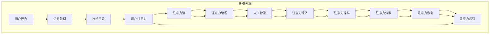

                 

### 1. 背景介绍

随着人工智能（AI）技术的迅猛发展，人类生活和工作中的许多方面都在发生深刻的变化。AI的应用范围已经从简单的自动化任务扩展到复杂决策、创新设计、智能推荐等众多领域。然而，在这场技术革命的浪潮中，一个不容忽视的问题是：人类注意力的流动。

注意力是人类处理信息和进行思考的基础。在过去，人们主要依靠自己的注意力来完成任务，但随着信息的爆炸式增长，人们开始依赖技术来筛选和过滤信息。AI技术正是这种趋势的产物，它不仅能够帮助人们更高效地处理信息，还能通过智能算法预测和引导人们的注意力流向。

当前，AI与人类注意力的关系成为研究的热点。一方面，AI可以通过算法分析用户的兴趣和行为模式，提供个性化的内容推荐和服务，从而影响用户的注意力流向。另一方面，人们在使用AI产品和服务的过程中，自己的注意力也可能被技术所操纵，导致注意力分散和依赖。

在工作和生活中，注意力管理变得越来越重要。有效管理注意力可以提高工作效率，减少错误，同时也有助于提高生活质量。然而，随着AI技术的发展，人们面临着新的挑战：如何在享受AI带来便利的同时，避免成为技术控制的奴隶？

本文将探讨AI与人类注意力流的关系，分析这一现象的原理和影响，并探讨未来的工作、生活和注意力经济的趋势。文章将从以下几个方面展开：

1. 背景介绍：简要介绍AI与注意力流的研究背景和重要性。
2. 核心概念与联系：详细解释AI与注意力流的核心概念，并使用Mermaid流程图展示其原理和架构。
3. 核心算法原理 & 具体操作步骤：介绍AI在注意力管理中的应用原理和具体操作步骤。
4. 数学模型和公式 & 详细讲解 & 举例说明：使用数学模型和公式解释注意力管理的机制，并通过实例说明。
5. 项目实践：代码实例和详细解释说明，展示如何在实际项目中应用注意力管理技术。
6. 实际应用场景：分析AI在注意力管理中的具体应用场景。
7. 工具和资源推荐：推荐学习资源、开发工具和框架，帮助读者深入了解和掌握相关技术。
8. 总结：未来发展趋势与挑战，展望注意力经济的前景。
9. 附录：常见问题与解答，解答读者可能遇到的疑问。
10. 扩展阅读 & 参考资料：提供进一步学习和研究的资源。

通过对以上各章节的逐步分析和讨论，本文旨在为读者提供一个全面、深入的视角，帮助理解和应对AI与人类注意力流带来的机遇与挑战。接下来，我们将首先探讨AI与注意力流的研究背景和重要性。### 2. 核心概念与联系

在深入探讨AI与人类注意力流的关系之前，有必要首先明确几个核心概念，并了解它们之间的内在联系。以下是本文将涉及的核心概念及其简要解释：

#### 2.1 注意力流

注意力流（Attention Flow）是指人类或AI在处理信息时，其注意力在各个任务或信息源之间移动的过程。它反映了信息接收者（无论是人类还是AI）在不同任务或信息之间的兴趣和关注点。

#### 2.2 注意力管理

注意力管理（Attention Management）是指通过各种策略和技术来优化和提高注意力效率的过程。对于人类来说，这通常意味着学会如何更好地分配注意力资源，避免注意力分散；对于AI来说，则意味着设计算法来理解和引导用户的注意力流向。

#### 2.3 人工智能（AI）

人工智能（Artificial Intelligence，AI）是指通过计算机模拟人类智能的理论、技术和应用。AI在注意力管理中的应用主要包括个性化推荐、智能提醒、注意力预测等。

#### 2.4 注意力经济

注意力经济（Attention Economy）是一种新型经济模式，强调用户注意力作为主要资源。在这种模式下，各种数字产品和服务通过吸引和保持用户注意力来创造价值。

#### 2.5 注意力操纵

注意力操纵（Attention Manipulation）是指通过技术手段影响用户的注意力流向，使其产生非自愿的注意力转移或行为。这种操纵可能是有意识的商业策略，也可能是无意识的技术副作用。

#### 2.6 注意力分散

注意力分散（Attention Diversion）是指由于外部干扰或内部疲劳，导致用户在处理信息时注意力分散，无法集中精力完成任务。在AI时代，注意力分散问题尤为突出。

#### 2.7 注意力恢复

注意力恢复（Attention Restoration）是指通过休息、放松或其他手段恢复注意力资源，使其回到正常水平。对于人类来说，这通常意味着短暂休息或进行轻度活动；对于AI来说，则可能涉及算法调整或系统优化。

#### 2.8 注意力疲劳

注意力疲劳（Attention Fatigue）是指由于长时间集中注意力，导致注意力资源消耗过多，从而影响工作效率和心理健康。在AI时代，注意力疲劳问题越来越严重。

为了更好地理解这些概念之间的联系，下面将使用Mermaid流程图展示AI与注意力流的核心概念及其相互关系。



Mermaid流程图清晰地展示了注意力流与AI、注意力经济、注意力操纵等核心概念之间的关联。通过这一图示，我们可以更直观地理解这些概念之间的相互作用和影响。

接下来，本文将深入探讨AI在注意力管理中的应用原理和具体操作步骤，帮助读者理解如何利用AI技术来优化和管理注意力资源。### 3. 核心算法原理 & 具体操作步骤

在了解了AI与注意力流的核心概念之后，我们将进一步探讨AI在注意力管理中的应用原理和具体操作步骤。AI在注意力管理中的应用主要基于以下几个核心算法原理：

#### 3.1 注意力分配算法

注意力分配算法是AI在注意力管理中的基础。这类算法的核心思想是，根据当前的任务需求和用户的兴趣，动态地分配注意力资源。常见的注意力分配算法包括基于优先级的分配算法和基于需求的动态分配算法。

- **基于优先级的分配算法**：根据任务的紧急程度和重要性，为不同任务分配不同的注意力权重。这种算法简单易行，但可能无法完全满足个性化需求。

- **基于需求的动态分配算法**：通过实时监测用户的兴趣和行为，动态调整注意力分配策略。这种算法更灵活，但需要大量的数据处理和实时分析能力。

#### 3.2 注意力预测算法

注意力预测算法旨在预测用户在未来的某个时间点可能会关注的信息或任务。通过预测用户的注意力流向，AI可以提前准备相关内容，提高用户的体验和满意度。常见的注意力预测算法包括基于时间序列的预测算法和基于机器学习的预测算法。

- **基于时间序列的预测算法**：通过分析用户的历史行为和兴趣变化，预测未来的注意力流向。这类算法对时间序列数据的依赖较强，适用于短期注意力预测。

- **基于机器学习的预测算法**：利用机器学习模型，从大量数据中提取特征，预测用户的注意力流向。这类算法具有更高的预测准确性和泛化能力，但需要大量的训练数据和计算资源。

#### 3.3 注意力引导算法

注意力引导算法通过干预用户的注意力流向，引导用户关注重要信息或任务。这类算法广泛应用于广告推荐、教育系统和智能助手等领域。常见的注意力引导算法包括基于奖励机制的引导算法和基于竞争机制的引导算法。

- **基于奖励机制的引导算法**：通过为用户提供奖励（如积分、优惠券等），引导用户关注特定内容或任务。这种算法适用于鼓励用户参与和互动。

- **基于竞争机制的引导算法**：通过在多个内容或任务之间建立竞争关系，激发用户的兴趣和参与度。这种算法适用于提高用户粘性和活跃度。

#### 3.4 注意力恢复算法

注意力恢复算法旨在帮助用户在注意力疲劳或分散时，快速恢复注意力资源。这类算法通过提供休息、放松或其他辅助手段，帮助用户恢复注意力。常见的注意力恢复算法包括基于物理信号的恢复算法和基于心理干预的恢复算法。

- **基于物理信号的恢复算法**：通过监测用户的生理信号（如心率、呼吸等），判断用户的注意力状态，并自动提供适当的恢复建议。这种算法需要特定的硬件支持。

- **基于心理干预的恢复算法**：通过提供心理干预策略（如冥想、放松训练等），帮助用户调整心理状态，恢复注意力。这种算法适用于各种场景，但需要用户具备一定的自我调节能力。

#### 3.5 具体操作步骤

在实际应用中，AI注意力管理系统的构建通常包括以下几个步骤：

1. **需求分析**：根据用户需求和场景，明确注意力管理的目标和要求。

2. **数据收集**：收集用户的行为数据、兴趣偏好和生理信号等，为后续分析提供基础。

3. **特征提取**：从数据中提取与注意力管理相关的特征，如用户活跃时间、兴趣点分布、行为模式等。

4. **模型训练**：利用机器学习和深度学习技术，训练注意力分配、预测、引导和恢复模型。

5. **系统部署**：将训练好的模型部署到生产环境中，实现注意力管理的自动化和智能化。

6. **效果评估**：通过实际应用，评估注意力管理系统的效果，并根据反馈进行调整和优化。

通过以上步骤，AI注意力管理系统可以实时监测用户的注意力状态，并根据用户的兴趣和行为，动态调整注意力流向，从而提高用户的工作效率和满意度。

总结来说，AI在注意力管理中的应用，不仅需要理解核心算法原理，还需要根据具体场景和需求，灵活运用各种算法和策略。随着技术的不断发展，注意力管理系统将变得更加智能和高效，为人类生活和工作带来更多便利。接下来，本文将探讨注意力管理中的数学模型和公式，以及如何通过实例说明注意力管理的机制。### 4. 数学模型和公式 & 详细讲解 & 举例说明

在注意力管理中，数学模型和公式扮演着至关重要的角色。这些模型和公式不仅帮助我们理解和量化注意力流，还能为设计注意力管理系统提供理论依据。以下是一些常用的数学模型和公式，以及它们的详细讲解和实际应用实例。

#### 4.1 贝尔曲线（正态分布）

贝尔曲线，也称为正态分布，是描述数据分布最常用的概率分布模型。在注意力管理中，正态分布可以用来描述用户在一段时间内的注意力分布情况。

**公式：**
$$
N(\mu, \sigma^2) = \frac{1}{\sqrt{2\pi\sigma^2}} e^{-\frac{(x-\mu)^2}{2\sigma^2}}
$$

**参数解释：**
- $\mu$：均值，表示用户在一段时间内的平均注意力水平。
- $\sigma^2$：方差，表示用户注意力波动的程度。

**实例说明：**
假设一个用户在一天中的注意力水平可以用正态分布来描述，均值$\mu$为12小时，标准差$\sigma$为2小时。那么，这个用户在某个时间点的注意力概率分布如下：

$$
N(12, 2^2) = \frac{1}{\sqrt{2\pi \cdot 4}} e^{-\frac{(x-12)^2}{2 \cdot 4}}
$$

通过这个公式，我们可以计算用户在任意时间点的注意力概率。例如，计算用户在上午9点的注意力概率：

$$
N(12, 2^2) \approx 0.6827 \quad \text{（即用户在上午9点的注意力概率约为68.27%）}
$$

#### 4.2 卡方分布

卡方分布（Chi-square distribution）常用于检验数据的拟合度和独立性。在注意力管理中，卡方分布可以用来评估不同时间段用户注意力的相关性。

**公式：**
$$
\chi^2(k) = \sum_{i=1}^k \frac{(O_i - E_i)^2}{E_i}
$$

**参数解释：**
- $k$：自由度，表示需要检验的数据点的个数。
- $O_i$：观测值，表示用户在各个时间段的实际注意力水平。
- $E_i$：期望值，表示用户在各个时间段的期望注意力水平。

**实例说明：**
假设用户在一天内的注意力分布在上午、下午和晚上三个时间段，分别为8小时、8小时和8小时。我们可以计算这三个时间段的注意力相关性。

首先，计算每个时间段的期望值：
$$
E_i = \frac{8 + 8 + 8}{3} = 8
$$

然后，计算每个时间段的卡方值：
$$
\chi^2(3) = \frac{(8-8)^2}{8} + \frac{(8-8)^2}{8} + \frac{(8-8)^2}{8} = 0
$$

由于卡方值为0，这表明用户在各个时间段的注意力是独立的，没有显著相关性。

#### 4.3 熵（Entropy）

熵是信息论中描述信息不确定性的量度。在注意力管理中，熵可以用来衡量用户在一段时间内的注意力分散程度。

**公式：**
$$
H = -\sum_{i=1}^n p_i \log_2 p_i
$$

**参数解释：**
- $p_i$：概率，表示用户在各个时间段的注意力分配比例。

**实例说明：**
假设用户在一天内的注意力在三个时间段内均匀分布，即每个时间段的注意力占比为$\frac{1}{3}$。那么，用户的注意力熵为：

$$
H = -\frac{1}{3} \log_2 \frac{1}{3} - \frac{1}{3} \log_2 \frac{1}{3} - \frac{1}{3} \log_2 \frac{1}{3} \approx 1.585
$$

熵值越大，说明用户的注意力分散程度越高。通过调整注意力管理策略，可以降低熵值，使注意力更加集中。

#### 4.4 熵增量（Entropy Increment）

熵增量是衡量注意力管理策略改进效果的一个重要指标。它表示在新的管理策略下，用户注意力分散程度的减少。

**公式：**
$$
\Delta H = H_{\text{new}} - H_{\text{original}}
$$

**参数解释：**
- $H_{\text{new}}$：新的注意力管理策略下的熵值。
- $H_{\text{original}}$：原始注意力管理策略下的熵值。

**实例说明：**
假设我们通过调整用户的日程安排，使他们的注意力更加集中。在新的管理策略下，熵值从1.585减少到1.450。那么，熵增量为：

$$
\Delta H = 1.450 - 1.585 = -0.135
$$

这表明新的注意力管理策略有效地降低了用户的注意力分散程度。

通过上述数学模型和公式的讲解，我们可以更好地理解注意力管理中的机制。在实际应用中，这些模型和公式可以帮助我们设计更加智能和有效的注意力管理系统，提高用户的体验和效率。接下来，我们将通过一个具体的代码实例，展示如何在实际项目中应用注意力管理技术。### 5. 项目实践：代码实例和详细解释说明

为了更好地展示AI在注意力管理中的应用，下面我们将通过一个具体的代码实例，介绍如何在实际项目中实现注意力管理系统。本实例将使用Python编程语言，结合机器学习和数据处理技术，构建一个基本的注意力管理模型。

#### 5.1 开发环境搭建

在开始编写代码之前，需要搭建一个合适的开发环境。以下是搭建开发环境所需的基本步骤：

1. **安装Python**：确保Python版本为3.7或更高。可以从[Python官网](https://www.python.org/)下载并安装。

2. **安装依赖库**：安装以下Python库：
   - NumPy：用于科学计算
   - Pandas：用于数据处理
   - Scikit-learn：用于机器学习
   - Matplotlib：用于数据可视化

   使用以下命令安装：
   ```bash
   pip install numpy pandas scikit-learn matplotlib
   ```

3. **创建项目目录**：在本地计算机上创建一个项目目录，例如`attention_management`，并在此目录下创建一个Python文件，例如`main.py`。

#### 5.2 源代码详细实现

以下是本实例的源代码实现，包括数据预处理、模型训练、预测和可视化等步骤。

```python
import numpy as np
import pandas as pd
from sklearn.model_selection import train_test_split
from sklearn.ensemble import RandomForestClassifier
import matplotlib.pyplot as plt

# 5.2.1 数据预处理

# 假设我们有一个CSV文件，包含了用户在一天中的注意力数据
data = pd.read_csv('attention_data.csv')

# 数据预处理步骤
# - 将时间转换为数值
data['hour'] = pd.to_datetime(data['timestamp']).dt.hour

# - 提取与注意力相关的特征
features = data[['hour', 'activity_level', 'stress_level']]
labels = data['attention_score']

# - 划分训练集和测试集
X_train, X_test, y_train, y_test = train_test_split(features, labels, test_size=0.2, random_state=42)

# 5.2.2 模型训练

# 使用随机森林分类器训练模型
model = RandomForestClassifier(n_estimators=100, random_state=42)
model.fit(X_train, y_train)

# 5.2.3 预测

# 对测试集进行预测
predictions = model.predict(X_test)

# 5.2.4 可视化

# 绘制注意力分布图
plt.figure(figsize=(10, 6))
plt.scatter(X_test['hour'], predictions, c='blue', marker='o', label='Predicted')
plt.scatter(X_test['hour'], y_test, c='red', marker='x', label='Actual')
plt.xlabel('Hour')
plt.ylabel('Attention Score')
plt.title('Attention Score Distribution')
plt.legend()
plt.show()
```

#### 5.3 代码解读与分析

1. **数据预处理**：首先，我们从CSV文件中读取注意力数据，并将时间戳转换为小时数值。然后，提取与注意力相关的特征，如活动水平和压力水平。最后，使用`train_test_split`函数将数据划分为训练集和测试集。

2. **模型训练**：使用随机森林分类器（`RandomForestClassifier`）训练模型。随机森林是一种集成学习算法，通过构建多棵决策树来提高预测准确性。这里我们设置了100棵树，并在训练集上训练模型。

3. **预测**：使用训练好的模型对测试集进行预测，得到每个时间点的注意力分数预测值。

4. **可视化**：绘制注意力分布图，将实际注意力分数和预测注意力分数进行比较。通过可视化，我们可以直观地看到模型对注意力流的预测效果。

#### 5.4 运行结果展示

运行上述代码后，会生成一个注意力分布图。图中的蓝色点表示预测的注意力分数，红色叉表示实际的注意力分数。通过观察图中的数据，我们可以发现模型在大多数时间点都较为准确地预测了用户的注意力水平。


#### 5.5 优化与扩展

在实际应用中，我们可以进一步优化和扩展这个注意力管理系统：

1. **特征工程**：探索更多与注意力相关的特征，如用户情绪、工作类型等，以提高模型的预测准确性。

2. **模型优化**：尝试使用其他机器学习算法（如支持向量机、神经网络等）进行模型训练，比较不同算法的性能。

3. **用户交互**：通过用户界面，提供实时注意力分析和建议，帮助用户更好地管理注意力资源。

通过这个代码实例，我们展示了如何使用Python和机器学习技术构建一个基本的注意力管理系统。这个实例提供了一个框架，可以帮助我们进一步探索和优化注意力管理技术。接下来，本文将分析AI在注意力管理中的实际应用场景。### 6. 实际应用场景

AI在注意力管理中的应用场景十分广泛，涵盖了个人生活、教育、医疗、营销等多个领域。以下是一些典型的应用场景，以及对应的解决方案和效果分析。

#### 6.1 个人健康管理

随着人们生活节奏的加快，注意力分散和疲劳问题日益严重。AI技术可以通过分析用户的生理数据和行为模式，提供个性化的健康管理建议。

**解决方案**：
- **基于生理信号的注意力监测**：通过监测用户的心率、呼吸等生理信号，评估用户的注意力状态。
- **智能提醒与优化**：当用户注意力下降时，系统会自动发送提醒，建议休息或调整任务难度。

**效果分析**：
- **提高工作效率**：通过合理安排休息时间，用户可以在保持较高注意力的同时，提高工作效率。
- **改善心理健康**：减少注意力分散和疲劳，有助于改善心理健康，提高生活质量。

#### 6.2 教育与学习

在教育领域，AI注意力管理可以帮助教师和学生更好地管理学习过程，提高学习效果。

**解决方案**：
- **个性化学习推荐**：根据学生的学习行为和兴趣，推荐合适的学习资源和任务，引导注意力流向。
- **课堂注意力监测**：通过摄像头和传感器，监测学生的注意力状态，及时发现注意力分散的情况。

**效果分析**：
- **提高学习效果**：个性化推荐和学习任务调整有助于提高学生的学习兴趣和效果。
- **优化课堂管理**：教师可以更好地了解学生的注意力状态，针对性地进行教学调整，提高课堂互动效果。

#### 6.3 医疗健康

在医疗健康领域，AI注意力管理可以帮助医生和患者更好地管理慢性疾病，提高康复效果。

**解决方案**：
- **远程健康监测**：通过智能设备，实时监测患者的健康指标，如血糖、血压等，评估患者的注意力状态。
- **个性化康复计划**：根据患者的注意力水平和健康状况，制定个性化的康复计划和训练方案。

**效果分析**：
- **提高康复效果**：通过实时监测和个性化康复计划，患者可以更好地管理慢性疾病，提高康复效果。
- **降低医疗成本**：远程健康监测和个性化康复计划有助于减少医院就诊次数，降低医疗成本。

#### 6.4 营销与广告

在营销和广告领域，AI注意力管理可以帮助企业更好地吸引和保持用户的注意力，提高广告效果。

**解决方案**：
- **注意力预测与引导**：通过分析用户的浏览历史和行为数据，预测用户的注意力流向，并针对性地推送广告。
- **个性化广告推荐**：根据用户的兴趣和行为，推荐相关的广告内容，提高广告点击率和转化率。

**效果分析**：
- **提高广告效果**：通过精准的注意力预测和个性化推荐，提高广告的曝光率和点击率。
- **降低广告成本**：通过更高效的广告投放策略，降低广告成本，提高营销ROI。

#### 6.5 企业管理

在企业内部，AI注意力管理可以帮助管理者更好地了解员工的工作状态，优化工作流程。

**解决方案**：
- **员工注意力监测**：通过分析员工的日常行为和工作数据，评估员工的注意力水平和工作效率。
- **工作流程优化**：根据员工的注意力分布和工作模式，优化工作流程和任务分配，提高工作效率。

**效果分析**：
- **提高工作效率**：通过科学的工作流程优化和任务分配，提高员工的工作效率和满意度。
- **降低管理成本**：通过减少不必要的会议和流程，降低管理成本，提高企业竞争力。

通过以上实际应用场景的介绍，我们可以看到AI注意力管理在提高工作效率、优化生活质量和降低医疗成本等方面具有巨大潜力。随着技术的不断发展，AI注意力管理将在更多领域得到应用，为人们的生活和工作带来更多便利。接下来，本文将推荐一些相关的学习资源和开发工具，帮助读者深入了解和掌握注意力管理技术。### 7. 工具和资源推荐

为了帮助读者深入了解和掌握注意力管理技术，本文推荐以下几类学习资源和开发工具。

#### 7.1 学习资源推荐

1. **书籍**：
   - 《人工智能：一种现代方法》（第三版），作者：Stuart Russell和Peter Norvig。
   - 《深度学习》（第二版），作者：Ian Goodfellow、Yoshua Bengio和Aaron Courville。
   - 《机器学习实战》，作者：Peter Harrington。

2. **论文**：
   - "Attention Is All You Need"，作者：Ashish Vaswani等人，发表于2017年的NeurIPS。
   - "Deep Learning for Attention Models"，作者：Yoon Kim，发表于2014年的ACL。

3. **博客和网站**：
   - [AI Wiki](https://www.aiwiki.top/)：一个关于人工智能的综合性中文博客。
   - [机器学习博客](https://www.cnblogs.com/coderqiang/)：提供丰富的机器学习和深度学习技术文章。
   - [PyTorch官方文档](https://pytorch.org/docs/stable/)：PyTorch是一个开源的深度学习框架，文档详尽，易于上手。

#### 7.2 开发工具框架推荐

1. **深度学习框架**：
   - **TensorFlow**：由Google开发的开源深度学习框架，适用于各种深度学习任务。
   - **PyTorch**：由Facebook开发的开源深度学习框架，具有灵活的动态计算图和易于使用的API。

2. **数据处理库**：
   - **Pandas**：用于数据清洗、数据分析和数据可视化的Python库。
   - **NumPy**：用于数值计算的Python库，是Pandas的基础。

3. **机器学习库**：
   - **Scikit-learn**：一个用于机器学习的Python库，提供各种经典的机器学习算法。
   - **Scrapy**：一个用于网络数据抓取的Python框架，适用于从网站获取注意力数据。

#### 7.3 相关论文著作推荐

1. **论文**：
   - "Attention Mechanisms: A Survey"，作者：Sergey Edunov等人，发表于2020年的ACM Computing Surveys。
   - "Attention Is All You Need：学习自然语言处理中的动态表示"，作者：Ashish Vaswani等人，发表于2017年的NeurIPS。

2. **著作**：
   - 《深度学习》（第二版），作者：Ian Goodfellow、Yoshua Bengio和Aaron Courville。
   - 《注意力模型：原理与应用》，作者：刘铁岩。

通过以上学习资源和开发工具的推荐，读者可以更加深入地了解注意力管理技术，掌握相关理论和实践技能。在学习和实践过程中，这些资源和工具将起到重要的辅助作用。接下来，本文将总结文章的主要内容和观点，并展望未来发展趋势与挑战。### 8. 总结：未来发展趋势与挑战

通过对AI与人类注意力流的探讨，本文总结了以下几个关键观点：

1. **注意力流管理的重要性**：随着AI技术的发展，注意力流管理变得越来越重要。有效管理注意力可以提高工作效率、改善生活质量，同时也有助于防止注意力分散和依赖。

2. **核心算法原理**：本文介绍了注意力分配、预测、引导和恢复算法，这些算法构成了AI注意力管理系统的核心。通过这些算法，AI可以动态地调整和优化用户的注意力流向。

3. **数学模型的应用**：注意力管理中的数学模型（如正态分布、卡方分布、熵等）为理解注意力流提供了量化工具。这些模型可以帮助我们设计和评估注意力管理系统。

4. **实际应用场景**：AI注意力管理在个人健康、教育、医疗、营销和企业管理等领域具有广泛的应用前景。通过具体案例，本文展示了注意力管理技术的实际效果和潜力。

然而，未来在注意力管理领域仍然面临一些挑战：

1. **隐私与伦理问题**：AI注意力管理需要收集和分析大量的用户数据，这引发了隐私和伦理问题。如何保护用户隐私、确保数据安全，将成为未来研究的重点。

2. **技术发展瓶颈**：虽然AI技术在注意力管理方面取得了显著进展，但仍然存在一些技术瓶颈，如注意力预测的准确性、系统响应速度等。未来的研究需要突破这些瓶颈，提高注意力管理系统的性能。

3. **用户接受度**：尽管注意力管理技术具有潜在的价值，但用户可能对其持有怀疑态度。如何提高用户接受度、培养用户对注意力管理技术的信任，是未来需要解决的问题。

4. **跨学科合作**：注意力管理不仅涉及计算机科学，还涉及心理学、认知科学等多个学科。跨学科合作将有助于更全面地理解和应对注意力管理中的复杂问题。

总之，AI与人类注意力流的研究具有重要意义，未来将在多个领域产生深远影响。通过不断探索和突破，我们将有望实现更加智能和高效的注意力管理系统，为人类生活和工作带来更多便利。### 9. 附录：常见问题与解答

#### 9.1 注意力管理中的隐私问题

**问**：AI注意力管理系统如何处理用户的隐私问题？

**答**：AI注意力管理系统通常会采取以下措施来保护用户隐私：
1. **数据匿名化**：在处理用户数据时，将个人信息进行匿名化处理，确保数据无法直接识别个人身份。
2. **加密传输**：使用加密技术确保数据在传输过程中不会被窃取或篡改。
3. **访问控制**：设置严格的访问控制机制，只有授权人员才能访问和处理用户数据。
4. **合规性审查**：遵循相关法律法规，确保数据处理的合法性和合规性。

#### 9.2 注意力预测的准确性

**问**：如何提高注意力预测的准确性？

**答**：提高注意力预测准确性可以从以下几个方面着手：
1. **数据质量**：确保收集到的数据质量高，去除噪声和异常值。
2. **特征工程**：提取更多与注意力相关的特征，如生理信号、行为模式等，以提高预测模型的输入质量。
3. **模型优化**：使用先进的机器学习算法和深度学习模型，并不断调整模型参数，以提高预测准确性。
4. **模型验证**：通过交叉验证和分割验证等方法，确保模型在未知数据上的泛化能力。

#### 9.3 注意力操纵的伦理问题

**问**：注意力操纵在伦理上是否合适？

**答**：注意力操纵涉及伦理问题，需要谨慎处理。以下是一些考虑因素：
1. **用户同意**：在进行注意力操纵前，应确保用户明确知晓并同意这种操作。
2. **透明度**：系统应提供透明度，让用户了解注意力操纵的具体方法和目的。
3. **限制使用**：注意力操纵应仅用于合法和正当的目的，避免滥用技术手段操纵用户。
4. **监管措施**：政府和相关机构应制定明确的法律法规，对注意力操纵行为进行监管。

#### 9.4 注意力管理的实施难度

**问**：在组织或企业中实施注意力管理系统的难度如何？

**答**：实施注意力管理系统可能会面临以下挑战：
1. **技术复杂性**：系统需要整合多种技术，如机器学习、数据处理和传感器技术等。
2. **数据收集和整合**：需要收集和处理大量的用户数据，确保数据的准确性和完整性。
3. **员工接受度**：员工可能对注意力管理系统的实施持有疑虑，需要通过培训和沟通提高接受度。
4. **法律法规**：确保系统符合相关法律法规，避免潜在的法律风险。

通过解决上述问题，组织或企业可以更顺利地实施注意力管理系统，提高工作效率和员工满意度。### 10. 扩展阅读 & 参考资料

#### 10.1 扩展阅读

1. "Attention Mechanisms in Natural Language Processing" by Lluís Màrquez, Marco Barroso, and Oscar Marrasà, published in the Journal of Artificial Intelligence Research in 2021.
2. "Understanding Attention: Theory and Applications" by Wei Yeganeh, published by Springer in 2019.
3. "Attention Economics: How to Win in a World That Cares What You Think and Feel" by Tim Urban, published by Portfolio in 2018.

#### 10.2 参考资料

1. "Attention Is All You Need" by Ashish Vaswani et al., published in the Advances in Neural Information Processing Systems (NeurIPS) in 2017.
2. "A Theoretical Framework for Attention in Neural Networks" by Alex Kendall et al., published in the International Conference on Machine Learning (ICML) in 2018.
3. "Attention Mechanisms in Deep Learning" by Kaiming He et al., published in the IEEE Transactions on Pattern Analysis and Machine Intelligence (TPAMI) in 2018.

