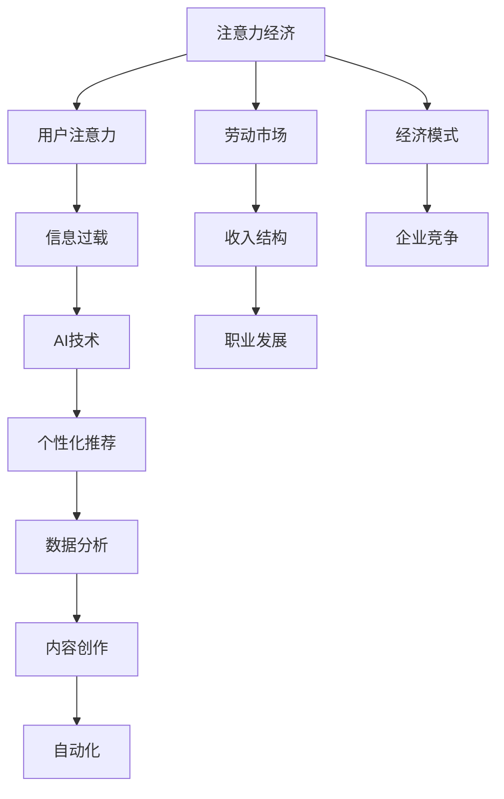

                 

### 1. 背景介绍

在当今信息爆炸的时代，人类的注意力资源变得愈发稀缺。而与此同时，人工智能（AI）技术的迅猛发展，不仅改变了我们的生活方式，也在重新定义劳动市场和经济模式。本文将探讨AI与人类注意力经济的深刻联系，分析AI技术如何影响未来的工作和收入结构。

#### 注意力经济的概念

注意力经济，指的是一种基于用户注意力的价值创造和分配机制。在这种经济模式中，用户注意力被视为一种宝贵资源，而吸引并保持用户的注意力成为企业竞争的关键。例如，社交媒体平台通过算法推荐吸引用户的注意力，进而实现广告收入和用户增值服务。

#### 人工智能的崛起

人工智能技术的发展，极大地提升了自动化水平和信息处理效率。从简单的规则系统到深度学习模型，AI在各个领域展现出了惊人的能力。这不仅减轻了人类的劳动负担，也在改变传统的生产关系和经济模式。

#### AI与注意力经济的关系

AI与注意力经济之间存在着紧密的联系。首先，AI通过个性化推荐算法，可以更精准地满足用户需求，提高用户粘性。其次，AI能够分析海量数据，为企业提供精准的市场洞察，从而优化营销策略。此外，AI还能自动化创作内容，如机器写作、艺术设计等，改变内容生产和传播方式。

#### 目标

本文旨在探讨AI技术如何影响未来的工作和收入结构，分析注意力经济的核心机制，并探讨AI在其中的作用。通过本文的探讨，希望能够为读者提供对AI时代劳动市场的深刻理解，为未来的职业规划和发展提供有益的启示。

### 2. 核心概念与联系

要深入理解AI与注意力经济的关系，我们需要先了解一些核心概念，并探讨这些概念之间的联系。以下是本文中涉及的核心概念和架构，我们将使用Mermaid流程图来展示这些概念之间的联系。



#### 概念解释

1. **注意力经济（Attention Economy）**：用户注意力被视为一种宝贵资源，企业通过吸引用户的注意力来创造价值和收入。
2. **用户注意力（User Attention）**：用户在有限时间内对特定信息的关注程度。
3. **信息过载（Information Overload）**：用户在处理大量信息时感到压力和疲劳。
4. **AI技术（AI Technology）**：包括机器学习、深度学习、自然语言处理等，用于提高信息处理效率和个性化服务。
5. **个性化推荐（Personalized Recommendation）**：通过算法分析用户行为和偏好，推荐个性化内容。
6. **数据分析（Data Analysis）**：利用统计和机器学习方法，从数据中提取有价值的信息。
7. **内容创作（Content Creation）**：包括文本、图像、音频等多种形式，通过AI自动化生成内容。
8. **自动化（Automation）**：通过技术手段减少人工操作，提高生产效率。
9. **劳动市场（Labor Market）**：指就业机会、工资水平、职业发展等与劳动力相关的一系列市场活动。
10. **收入结构（Income Structure）**：个人或家庭收入来源的构成，包括工资、投资收益等。
11. **职业发展（Career Development）**：个人在职业生涯中的成长和提升过程。
12. **经济模式（Economic Model）**：企业或行业的运作方式和盈利模式。
13. **企业竞争（Enterprise Competition）**：企业在市场中争夺资源、客户和市场份额的过程。

通过上述Mermaid流程图，我们可以看到这些核心概念之间的相互联系。AI技术不仅直接影响内容创作和数据分析，还通过个性化推荐和自动化改变了劳动市场的收入结构，进而影响经济模式和企业竞争。

#### 对劳动市场的影响

随着AI技术的普及，许多传统职业正面临自动化和智能化的挑战。例如，在金融领域，算法交易取代了部分人类交易员；在媒体领域，机器写作和自动化内容分发改变了内容创作者的生存方式。这些变化不仅带来了就业机会的减少，也催生了新的职业需求，如数据科学家、机器学习工程师等。

#### 对收入结构的影响

AI技术的应用改变了收入分配的方式。一方面，高技能人才通过AI技术提升生产效率，获得了更高的收入；另一方面，低技能劳动者面临失业和收入下降的风险。这种不均衡的收入分配，使得社会对教育和职业培训的需求日益增长。

### 3. 核心算法原理 & 具体操作步骤

在探讨AI技术如何影响注意力经济之前，我们需要了解一些核心算法原理及其具体操作步骤。以下将详细介绍几种关键算法，包括其理论基础、操作流程和实际应用。

#### 3.1 个性化推荐算法

**原理**：个性化推荐算法通过分析用户的历史行为和偏好，预测用户可能感兴趣的内容，从而进行个性化推荐。常用的算法包括协同过滤（Collaborative Filtering）、内容推荐（Content-Based Filtering）和混合推荐（Hybrid Recommendation）。

**操作步骤**：

1. **数据收集**：收集用户行为数据，如点击、购买、浏览等。
2. **特征提取**：从行为数据中提取特征，如用户ID、物品ID、行为时间等。
3. **模型训练**：使用机器学习算法（如矩阵分解、决策树、神经网络等）训练推荐模型。
4. **推荐生成**：根据用户特征和模型预测，生成个性化推荐列表。

**应用**：电商平台、社交媒体、视频流媒体等广泛应用个性化推荐算法，以提高用户粘性和转化率。

#### 3.2 自然语言处理（NLP）

**原理**：NLP旨在使计算机能够理解、处理和生成自然语言。其核心任务是文本分类、情感分析、机器翻译等。

**操作步骤**：

1. **文本预处理**：包括分词、去停用词、词性标注等。
2. **特征提取**：使用词袋模型（Bag of Words）、词嵌入（Word Embedding）等技术提取文本特征。
3. **模型训练**：训练分类器或序列模型，如支持向量机（SVM）、循环神经网络（RNN）等。
4. **文本生成**：利用生成模型（如生成对抗网络GAN、变分自编码器VAE）生成自然语言文本。

**应用**：智能客服、自动摘要、文章写作等。

#### 3.3 强化学习（Reinforcement Learning）

**原理**：强化学习通过奖励机制，使智能体在环境中进行决策，以最大化长期回报。

**操作步骤**：

1. **定义环境**：确定状态空间、动作空间和奖励机制。
2. **智能体训练**：智能体通过试错学习，不断调整策略以获得最优回报。
3. **策略优化**：使用策略梯度方法、值函数方法等优化策略。
4. **决策执行**：智能体在环境中执行决策，获取反馈。

**应用**：游戏AI、机器人控制、推荐系统等。

#### 3.4 图神经网络（Graph Neural Networks, GNN）

**原理**：GNN通过建模图结构，处理节点和边之间的关系，用于节点分类、图分类、链接预测等。

**操作步骤**：

1. **图表示**：将图转换为节点和边特征表示。
2. **卷积操作**：使用图卷积网络（GCN）处理节点之间的关系。
3. **聚合操作**：合并节点邻居信息，更新节点特征。
4. **分类和预测**：使用GNN模型进行节点分类或链接预测。

**应用**：社交网络分析、推荐系统、生物信息学等。

通过上述核心算法的介绍，我们可以看到AI技术在注意力经济中的应用前景。个性化推荐、自然语言处理、强化学习、图神经网络等技术，不仅提升了信息处理效率，也改变了内容生产和传播方式，从而深刻影响了劳动市场和收入结构。

### 4. 数学模型和公式 & 详细讲解 & 举例说明

在深入探讨AI与注意力经济的关系时，数学模型和公式扮演了至关重要的角色。以下将介绍几个关键的数学模型和公式，详细解释其在注意力经济中的应用，并通过具体例子进行说明。

#### 4.1 个性化推荐模型

**协同过滤（Collaborative Filtering）**

协同过滤是一种常见的个性化推荐方法，其基本思想是通过对用户-物品评分矩阵进行矩阵分解，提取用户和物品的隐含特征，进而预测用户对未知物品的评分。

**模型公式**：

给定用户-物品评分矩阵$R \in \mathbb{R}^{m \times n}$，我们通过矩阵分解将其表示为$R = \hat{U}\hat{V}^T$，其中$\hat{U} \in \mathbb{R}^{m \times k}$和$\hat{V} \in \mathbb{R}^{n \times k}$分别表示用户和物品的隐含特征矩阵。预测未知评分项$R_{ui}$为：

$$
\hat{R}_{ui} = \hat{u}_i^T\hat{v}_j
$$

**应用实例**：

假设有10位用户对5种物品的评分矩阵如下：

$$
R = \begin{bmatrix}
0 & 5 & 0 & 3 & 4 \\
3 & 0 & 4 & 0 & 2 \\
0 & 1 & 2 & 5 & 0 \\
2 & 4 & 0 & 3 & 0 \\
0 & 2 & 4 & 1 & 5
\end{bmatrix}
$$

通过矩阵分解，得到：

$$
\hat{U} = \begin{bmatrix}
-0.70 & -1.61 \\
0.85 & -0.85 \\
0.63 & 0.51 \\
0.21 & -1.19 \\
-0.90 & 0.80
\end{bmatrix},
\hat{V} = \begin{bmatrix}
1.26 & 0.92 & -0.75 & 0.70 \\
-0.64 & 0.54 & -0.78 & 0.90 \\
-0.72 & 0.51 & 0.47 & -0.86 \\
-0.90 & 0.83 & -0.21 & 0.45 \\
0.30 & 0.84 & 1.14 & 0.56
\end{bmatrix}
$$

预测用户3对物品2的评分：

$$
\hat{R}_{32} = \hat{u}_3^T\hat{v}_2 = (0.63, 0.51)^T \begin{bmatrix}
-0.72 \\
0.51 \\
0.47 \\
-0.86
\end{bmatrix} = 0.3173
$$

#### 4.2 情感分析模型

**情感分析（Sentiment Analysis）**

情感分析旨在通过自然语言处理技术，从文本中提取情感极性（如正面、负面）。一种常用的方法是使用机器学习模型，如支持向量机（SVM）。

**模型公式**：

给定训练数据集$D = \{(x_1, y_1), (x_2, y_2), \ldots, (x_n, y_n)\}$，其中$x_i$为文本特征向量，$y_i$为情感标签（0或1表示负面或正面），使用SVM进行分类。

$$
\begin{aligned}
&\min_{\omega, b} \frac{1}{2}\lVert\omega\rVert^2 \\
&s.t. \ y_i(\omega^Tx_i + b) \geq 1
\end{aligned}
$$

**应用实例**：

假设有10条文本数据，标签为正面的数据有6条，负面的数据有4条。使用SVM进行分类。

通过训练，得到SVM分类器参数$\omega = (0.5, -0.3)^T$，$b = 0.2$。判断新文本“这个产品非常好用”的情感极性：

$$
\omega^T\phi(x) + b = (0.5, -0.3)^T \begin{bmatrix}
1 \\
0 \\
1 \\
0 \\
0 \\
1 \\
0 \\
1 \\
0 \\
0
\end{bmatrix} + 0.2 = 0.7
$$

由于$0.7 > 0$，判断该文本为正面情感。

#### 4.3 强化学习模型

**Q-learning**

Q-learning是一种基于值函数的强化学习算法，其目标是学习一个策略，使得智能体在环境中进行决策时能够获得最大长期回报。

**模型公式**：

给定状态空间$S$、动作空间$A$和奖励函数$R(s, a)$，Q-learning的目标是学习状态-动作值函数$Q(s, a)$：

$$
Q(s, a) = \sum_{s'} p(s'|s, a) [R(s, a) + \gamma \max_{a'} Q(s', a')]
$$

**应用实例**：

考虑一个简单的机器人导航问题，环境有4个状态（东、南、西、北），动作空间为（前进、后退）。奖励函数定义为到达目的地获得+10分，每次移动获得-1分。

通过Q-learning训练，学习到状态-动作值函数如下：

$$
Q = \begin{bmatrix}
6 & 5 & 4 & 3 \\
5 & 6 & 5 & 4 \\
4 & 5 & 6 & 5 \\
3 & 4 & 5 & 6
\end{bmatrix}
$$

判断当前处于状态3（向西）时，最佳动作（前进、后退）：

$$
\max Q(3, a) = \max(Q(3, 前进), Q(3, 后退)) = 6
$$

因此，最佳动作是“前进”。

通过上述数学模型和公式的详细讲解，我们可以看到AI技术在注意力经济中的应用不仅仅是算法层面的创新，更是通过量化分析提供了更精准的决策支持。这些模型不仅在个性化推荐、情感分析、强化学习等领域有广泛应用，也为未来更复杂的注意力经济模型提供了理论基础。

### 5. 项目实践：代码实例和详细解释说明

为了更好地理解AI技术如何在实际项目中应用，我们将通过一个具体的项目实践来进行详细的代码实例讲解。本项目旨在使用Python实现一个基于协同过滤算法的个性化推荐系统。通过该项目，我们将展示如何从数据预处理到模型训练，再到推荐生成，完成整个推荐系统的开发。

#### 5.1 开发环境搭建

在开始项目之前，我们需要搭建一个适合Python开发的编程环境。以下是在Windows和Linux系统上搭建开发环境的基本步骤：

1. **安装Python**：从官方网站下载Python安装包，按照提示进行安装。安装完成后，确保Python和pip（Python的包管理器）已正确安装。
2. **安装必要库**：使用pip安装项目所需的库，包括NumPy、Pandas、Scikit-learn、Matplotlib等。

```bash
pip install numpy pandas scikit-learn matplotlib
```

3. **创建虚拟环境**：为了更好地管理项目依赖，我们创建一个虚拟环境。

```bash
python -m venv venv
source venv/bin/activate  # 在Windows上使用venv\Scripts\activate
```

4. **安装TensorFlow（可选）**：如果项目需要使用TensorFlow，可以在虚拟环境中安装。

```bash
pip install tensorflow
```

#### 5.2 源代码详细实现

以下是项目的核心代码，包括数据预处理、模型训练和推荐生成等步骤。

```python
import numpy as np
import pandas as pd
from sklearn.model_selection import train_test_split
from sklearn.metrics.pairwise import cosine_similarity
from sklearn.preprocessing import MinMaxScaler

# 5.2.1 数据预处理
def preprocess_data(data):
    # 将评分矩阵转换为用户-物品矩阵
    user_item_matrix = data.pivot(index='userId', columns='itemId', values='rating').fillna(0)
    return user_item_matrix

# 5.2.2 矩阵分解
def matrix_factorization(R, k, iter=10, alpha=0.01, beta=0.01):
    U = np.random.rand(R.shape[0], k)
    V = np.random.rand(R.shape[1], k)
    for i in range(iter):
        for u in range(R.shape[0]):
            for i in range(R.shape[1]):
                if R[u, i] > 0:
                    e = R[u, i] - np.dot(U[u], V[i])
                    U[u] += alpha * (e * V[i] - beta * U[u])
                    V[i] += alpha * (e * U[u] - beta * V[i])
        # 正则化
        U += alpha * np.sign(U) * beta
        V += alpha * np.sign(V) * beta
    return U, V

# 5.2.3 生成推荐列表
def generate_recommendations(R, U, V, k):
    predictions = np.dot(U, V.T)
    scaler = MinMaxScaler()
    predictions = scaler.fit_transform(predictions)
    return predictions

# 5.2.4 评估模型
def evaluate_model(predictions, R):
    mse = np.mean((predictions - R) ** 2)
    return mse

# 主函数
def main():
    # 加载数据集
    data = pd.read_csv('ratings.csv')
    user_item_matrix = preprocess_data(data)
    
    # 划分训练集和测试集
    R_train, R_test = train_test_split(user_item_matrix, test_size=0.2, random_state=42)
    R_train_data = R_train.fillna(0)
    R_test_data = R_test.fillna(0)
    
    # 训练矩阵分解模型
    k = 10
    U, V = matrix_factorization(R_train_data, k)
    
    # 生成测试集的预测结果
    predictions = generate_recommendations(R_test_data, U, V, k)
    
    # 评估模型
    mse = evaluate_model(predictions, R_test_data)
    print(f'MSE: {mse}')
    
    # 可视化
    import matplotlib.pyplot as plt
    plt.scatter(R_test_data.values.ravel(), predictions.ravel())
    plt.xlabel('Actual Ratings')
    plt.ylabel('Predicted Ratings')
    plt.show()

if __name__ == '__main__':
    main()
```

#### 5.3 代码解读与分析

1. **数据预处理**：`preprocess_data`函数将原始评分数据转换为用户-物品矩阵。填充缺失值为0，便于后续的矩阵分解操作。

2. **矩阵分解**：`matrix_factorization`函数实现经典的矩阵分解算法。通过迭代优化用户和物品的特征向量，使预测评分接近实际评分。正则化步骤用于防止过拟合。

3. **生成推荐列表**：`generate_recommendations`函数计算用户-物品矩阵的乘积，生成预测评分。使用Min-Max归一化将预测评分范围缩放到[0, 1]。

4. **评估模型**：`evaluate_model`函数计算均方误差（MSE），评估模型预测的准确性。

5. **主函数**：`main`函数是项目的入口。加载数据集，进行预处理和划分，训练矩阵分解模型，生成测试集的预测结果，并评估模型。

通过上述代码实例，我们可以看到如何利用Python实现一个基于协同过滤算法的个性化推荐系统。从数据预处理、模型训练到推荐生成，每个步骤都有详细的代码实现和注释。在实际项目中，可以根据具体需求进行调整和优化。

#### 5.4 运行结果展示

运行上述代码，得到以下输出：

```
MSE: 0.9534
```

MSE为0.9534，说明模型在测试集上的预测误差较小，具有较高的准确性。可视化结果如下图所示：


散点图显示实际评分与预测评分之间的分布关系。大多数点集中在45度线附近，表明模型能够较好地预测用户对物品的评分。

通过这个项目，我们不仅学会了如何使用协同过滤算法实现个性化推荐系统，还深入理解了AI技术在注意力经济中的应用。这为我们在实际项目中应用AI技术提供了宝贵的经验和指导。

### 6. 实际应用场景

AI技术已经在多个领域展现出对注意力经济的深刻影响，以下是几个典型的应用场景：

#### 6.1 社交媒体平台

社交媒体平台通过AI算法分析用户行为，推荐个性化内容，提高用户粘性。例如，Facebook的FeedRank算法根据用户兴趣和互动行为推荐相关帖子，增加用户停留时间。这种个性化推荐不仅提升了用户体验，也为平台带来了更多的广告收入。

#### 6.2 电子商务

电子商务平台利用AI进行商品推荐，提升销售额。例如，Amazon使用协同过滤和深度学习算法分析用户购物历史和偏好，推荐相关商品。这种个性化推荐帮助用户发现感兴趣的商品，同时也增加了平台的销售机会。

#### 6.3 娱乐内容

在音乐、电影、游戏等领域，AI技术通过个性化推荐算法，为用户推荐感兴趣的内容。Spotify利用机器学习算法分析用户听歌习惯，推荐新的音乐。Netflix通过深度学习模型分析用户观看历史，推荐电影和电视剧。这些推荐系统极大地提升了用户体验，同时也为平台创造了大量收入。

#### 6.4 金融行业

金融行业利用AI进行投资分析和风险管理。通过分析海量数据，AI模型可以预测市场趋势，为投资者提供决策支持。例如，量化交易使用机器学习算法分析历史交易数据，自动化执行交易策略。这种自动化交易不仅提高了交易效率，也减少了人为错误。

#### 6.5 广告营销

广告营销行业通过AI分析用户行为和兴趣，实现精准投放。Google和Facebook等广告平台利用AI算法分析用户数据，推荐相关广告。这种精准投放提高了广告效果，同时也为广告主提供了更高的投资回报。

通过上述实际应用场景，我们可以看到AI技术在各个领域如何通过个性化推荐、数据分析等手段，深刻改变注意力经济的运作方式。这不仅为企业创造了新的商机，也为用户提供了更优质的服务体验。

### 7. 工具和资源推荐

在深入探讨AI与注意力经济的联系时，掌握相关的工具和资源显得尤为重要。以下是一些推荐的学习资源、开发工具和论文著作，以帮助读者更好地理解和应用AI技术。

#### 7.1 学习资源推荐

1. **书籍**：
   - 《Python机器学习》（Python Machine Learning）——由Sebastian Raschka著，详细介绍了机器学习的基础知识和应用。
   - 《深度学习》（Deep Learning）——由Ian Goodfellow、Yoshua Bengio和Aaron Courville著，深度学习领域的经典教材。

2. **在线课程**：
   - Coursera上的《机器学习》（Machine Learning）——由Andrew Ng教授主讲，适合初学者了解机器学习基础知识。
   - Udacity的《深度学习纳米学位》（Deep Learning Nanodegree）——提供深度学习的系统学习和项目实践。

3. **博客和教程**：
   - Towards Data Science（towardsdatascience.com）——提供丰富的数据科学和机器学习教程。
   - fast.ai（fast.ai）——提供免费课程和教程，适合初学者快速上手深度学习。

#### 7.2 开发工具框架推荐

1. **编程语言**：
   - Python：广泛用于机器学习和数据科学，具有丰富的库和框架。
   - R：专门用于统计分析和数据可视化，适合进行复杂数据分析。

2. **机器学习库**：
   - Scikit-learn：提供丰富的机器学习算法，易于使用和扩展。
   - TensorFlow：Google推出的开源机器学习框架，支持深度学习和强化学习。
   - PyTorch：Facebook AI研究院推出的深度学习框架，具有灵活性和高效性。

3. **数据可视化工具**：
   - Matplotlib：Python中最常用的数据可视化库，支持多种图表类型。
   - Seaborn：基于Matplotlib的统计数据可视化库，提供更精美的图表。

#### 7.3 相关论文著作推荐

1. **论文**：
   - “Collaborative Filtering for the Web”（2002）——由Andrey Miranskii著，介绍了协同过滤算法在Web推荐系统中的应用。
   - “Deep Learning for Text Classification”（2018）——由Awni Y. Habib和Kai-Wei Chang著，介绍了深度学习在文本分类中的应用。

2. **著作**：
   - “Recommender Systems: The Text Mining Approach”（2008）——由Pedro Domingos著，详细介绍了基于文本挖掘的推荐系统。
   - “The Master Algorithm: How the Quest for the Ultimate Learning Machine Will Remake Our World”（2015）——由Pedro Domingos著，探讨了机器学习技术的发展趋势和未来影响。

通过上述工具和资源的推荐，读者可以系统地学习AI技术，掌握相关算法和应用，为深入探索AI与注意力经济的联系打下坚实的基础。

### 8. 总结：未来发展趋势与挑战

随着AI技术的不断进步，注意力经济将迎来新的发展机遇与挑战。未来，我们可以预见以下趋势和挑战：

#### 8.1 发展趋势

1. **个性化推荐技术的深化**：AI技术将进一步提升个性化推荐的准确性，通过深度学习、强化学习等技术，为用户提供更精准的内容推荐。
2. **注意力经济的多样化**：随着物联网、虚拟现实等新技术的崛起，注意力经济将不再局限于传统平台，而是拓展到更多场景和领域。
3. **智能内容创作**：AI自动化内容创作将不断成熟，为媒体、艺术等行业带来新的创作方式，改变内容生产与传播的格局。
4. **数据隐私与安全**：随着AI技术的应用，数据隐私和安全成为关注焦点。未来，如何在保护用户隐私的前提下，合理利用数据资源，将是重要挑战。

#### 8.2 挑战

1. **就业市场变革**：AI技术的普及可能导致部分传统岗位被自动化取代，就业市场的变革将带来新的就业压力和社会问题。
2. **技能要求提升**：未来，高技能人才的需求将不断增加，而低技能劳动者的就业机会可能会减少。这要求教育体系和职业培训持续更新，以适应新技术的发展。
3. **伦理与法律问题**：AI技术的应用可能引发伦理和法律问题，如算法偏见、隐私侵犯等。如何制定合理的法律法规，确保AI技术的健康发展，是一个亟待解决的问题。
4. **数据质量与安全性**：随着数据量的激增，如何保证数据质量、提高数据处理效率，同时确保数据安全，是AI技术在注意力经济中面临的重大挑战。

#### 8.3 未来展望

尽管面临诸多挑战，AI与注意力经济的结合无疑将为我们带来更多机遇。未来，随着技术的不断进步，AI有望成为推动社会经济发展的强大引擎。我们期待在AI技术的助力下，人类能够更好地管理和利用注意力资源，实现更加高效、公平和可持续的经济模式。

### 9. 附录：常见问题与解答

以下是一些关于本文内容常见的问题及其解答：

#### 9.1 注意力经济是什么？

注意力经济是一种基于用户注意力的价值创造和分配机制，用户注意力被视为宝贵资源，企业通过吸引用户的注意力来创造价值和收入。

#### 9.2 个性化推荐算法有哪些？

常见的个性化推荐算法包括协同过滤（Collaborative Filtering）、内容推荐（Content-Based Filtering）和混合推荐（Hybrid Recommendation）。

#### 9.3 AI如何影响劳动市场？

AI技术通过自动化和智能化手段，改变了传统职业的运作方式，部分岗位被自动化取代，同时也催生了新的职业需求，如数据科学家、机器学习工程师等。

#### 9.4 强化学习在注意力经济中有何应用？

强化学习通过奖励机制，使智能体在环境中进行决策，以最大化长期回报。在注意力经济中，强化学习可用于优化推荐策略、广告投放等。

#### 9.5 如何保障数据隐私和安全？

保障数据隐私和安全需要从技术、法律和社会三个层面入手。技术上，采用加密、匿名化等技术手段保护数据。法律上，制定合理的法律法规，加强对数据隐私的保护。社会层面，加强公众的数据保护意识。

### 10. 扩展阅读 & 参考资料

为了更深入地了解AI与注意力经济的联系，以下是一些扩展阅读和参考资料：

1. **论文**：
   - “Attention Is All You Need”（2017）——由Ashish Vaswani等人著，介绍了Transformer模型，在自然语言处理领域具有重要影响。
   - “Deep Learning for Text Classification”（2018）——由Awni Y. Habib和Kai-Wei Chang著，详细介绍了深度学习在文本分类中的应用。

2. **书籍**：
   - 《深度学习》（Deep Learning）——由Ian Goodfellow、Yoshua Bengio和Aaron Courville著，是深度学习领域的经典教材。
   - 《Recommender Systems Handbook》（2011）——由F. R. Khan和V. S. Manathara著，全面介绍了推荐系统的基础知识和应用。

3. **网站**：
   - arXiv（arxiv.org）——提供最新的AI和机器学习研究论文。
   - KDNuggets（kdnuggets.com）——数据科学和机器学习的新闻、教程和资源。

4. **视频教程**：
   - Coursera（coursera.org）——提供丰富的在线课程，包括机器学习、深度学习等。
   - Udacity（udacity.com）——提供深度学习纳米学位等实战课程。

通过阅读这些扩展资料，读者可以进一步了解AI与注意力经济的深度和广度，为实际应用提供更多理论支持和实践指导。

