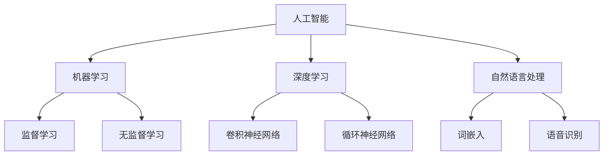

                 

### 1. 背景介绍

人工智能（AI）作为计算机科学的一个分支，自20世纪50年代起，经历了从理论发展到实际应用的巨大变革。随着计算能力的提升、大数据的积累以及机器学习算法的创新，人工智能的应用领域不断扩大，从最初的简单逻辑推理到复杂的图像识别、自然语言处理、自动驾驶等。如今，AI已经成为推动社会进步和经济发展的重要力量。

人类的未来互动与合作，是人工智能技术发展中的一个关键问题。随着AI技术的进步，越来越多的专家和学者开始探讨如何使AI与人类更好地互动和协作。这不仅涉及到技术的进步，还包括伦理、社会和文化等多个层面。例如，在医疗领域，人工智能可以帮助医生进行更准确的诊断和治疗；在教育领域，AI可以根据学习者的特点和需求提供个性化的学习方案；在工业生产中，AI可以优化生产流程，提高生产效率。

然而，AI与人类的互动和合作并非一帆风顺。AI技术的发展带来了许多新的挑战，如隐私保护、算法偏见、就业问题等。这些问题需要我们在技术发展的同时，不断地进行思考和探索，以确保AI技术能够真正为人类带来福祉。

本篇文章将围绕“AI与人类的未来互动与合作”这一主题，逐步分析以下几个方面：

1. **核心概念与联系**：介绍AI与人类互动与合作中的核心概念，并使用Mermaid流程图展示这些概念之间的联系。
2. **核心算法原理 & 具体操作步骤**：深入探讨AI技术的核心算法原理，并详细描述其实际操作步骤。
3. **数学模型和公式 & 详细讲解 & 举例说明**：介绍AI技术中使用的数学模型和公式，并通过实例进行详细讲解。
4. **项目实践：代码实例和详细解释说明**：通过实际项目实例展示AI技术的应用，并对其进行详细解释和分析。
5. **实际应用场景**：分析AI技术在各个领域的实际应用，以及与人类互动和合作的模式和挑战。
6. **工具和资源推荐**：推荐相关的学习资源、开发工具和论文著作，以帮助读者进一步了解AI技术。
7. **总结：未来发展趋势与挑战**：总结AI技术的发展趋势，并探讨未来可能面临的挑战。

通过上述分析，我们将对AI与人类的未来互动与合作有一个更加全面和深入的理解。

### 2. 核心概念与联系

在探讨AI与人类的互动与合作时，我们需要明确一些核心概念，并理解它们之间的联系。以下是几个关键概念：

- **人工智能（AI）**：人工智能是指由人造系统实现的智能，这些系统能够理解、学习、推理和自我改进。它包括多个子领域，如机器学习、深度学习、自然语言处理等。
- **机器学习（ML）**：机器学习是人工智能的一个子领域，它通过训练模型来从数据中学习规律，并能够进行预测和决策。
- **深度学习（DL）**：深度学习是机器学习的一个分支，它使用多层神经网络对数据进行学习，能够处理复杂的任务，如图像识别和自然语言处理。
- **自然语言处理（NLP）**：自然语言处理是人工智能的一个子领域，它研究如何让计算机理解和生成人类语言。

为了更好地理解这些概念之间的联系，我们可以使用Mermaid流程图来展示它们之间的关系：



在上面的流程图中，我们首先从人工智能（A）出发，它包含了机器学习（B）、深度学习（C）和自然语言处理（D）等多个子领域。每个子领域又包含不同的技术和方法，如机器学习中的监督学习（E）和无监督学习（F），深度学习中的卷积神经网络（G）和循环神经网络（H），自然语言处理中的词嵌入（I）和语音识别（J）。

这些概念之间的联系在于，它们共同构成了AI技术的基础，并且在不同的应用场景中发挥着重要作用。例如，在医疗领域，深度学习和自然语言处理可以结合使用，帮助医生进行疾病诊断和病历分析；在自动驾驶领域，机器学习和深度学习技术用于感知环境、做出决策和规划路径。

通过了解这些核心概念及其之间的联系，我们可以更好地理解AI与人类的互动和合作是如何实现的。接下来，我们将深入探讨这些技术的核心算法原理，并了解它们在实际应用中的操作步骤。

### 3. 核心算法原理 & 具体操作步骤

在了解了AI与人类的互动与合作中的核心概念后，我们接下来将深入探讨AI技术中的核心算法原理，并描述其实际操作步骤。以下是几个关键算法及其基本原理：

#### 3.1 机器学习算法

机器学习算法是AI技术的基础，它通过从数据中学习规律来进行预测和决策。以下是一些常用的机器学习算法：

- **线性回归（Linear Regression）**：线性回归是一种用于预测数值结果的算法，它通过建立自变量和因变量之间的线性关系来进行预测。

  **基本原理**：线性回归模型可以表示为 \(y = wx + b\)，其中 \(w\) 是权重，\(b\) 是偏置，\(x\) 是输入特征，\(y\) 是预测值。

  **具体操作步骤**：

  1. 数据预处理：将数据集分为训练集和测试集，对数据进行标准化处理。
  2. 模型训练：使用训练集数据计算模型的权重和偏置，通过梯度下降法优化模型参数。
  3. 模型评估：使用测试集数据评估模型性能，计算预测误差。

- **决策树（Decision Tree）**：决策树是一种用于分类和回归的树形结构模型。

  **基本原理**：决策树通过一系列规则将数据集分割成子集，每个节点代表一个特征，每个分支代表一个特征值。

  **具体操作步骤**：

  1. 构建决策树：从根节点开始，选择具有最高信息增益的特征进行分割，递归地构建树结构。
  2. 剪枝：为了防止过拟合，可以通过设置最大深度、最小样本数等条件进行剪枝。
  3. 预测：根据决策树的分支规则，对新的数据进行分类或回归预测。

#### 3.2 深度学习算法

深度学习算法是机器学习的一个分支，它通过多层神经网络对数据进行学习。以下是一些常用的深度学习算法：

- **卷积神经网络（Convolutional Neural Network, CNN）**：CNN 是一种用于图像识别和处理的神经网络模型。

  **基本原理**：CNN 通过卷积层、池化层和全连接层对图像数据进行特征提取和分类。

  **具体操作步骤**：

  1. 卷积层：通过卷积操作提取图像局部特征，使用滤波器（卷积核）对图像进行卷积。
  2. 池化层：通过池化操作减小特征图的尺寸，降低模型参数的数量。
  3. 全连接层：将池化层输出的特征映射到类别标签。

- **循环神经网络（Recurrent Neural Network, RNN）**：RNN 是一种用于处理序列数据的神经网络模型。

  **基本原理**：RNN 通过隐藏状态和循环连接实现对序列数据的记忆。

  **具体操作步骤**：

  1. 输入序列：将序列数据输入到RNN模型中，每个时间步的输入和隐藏状态通过递归关系进行计算。
  2. 状态更新：在每个时间步，隐藏状态通过门控机制（如门控RNN）进行更新，保留重要的信息。
  3. 预测：在序列的最后一个时间步，输出序列的预测结果。

#### 3.3 自然语言处理算法

自然语言处理算法用于处理和生成人类语言。以下是一些常用的NLP算法：

- **词嵌入（Word Embedding）**：词嵌入是将词汇映射到高维向量空间的方法，用于捕捉词汇之间的语义关系。

  **基本原理**：词嵌入通过神经网络模型（如Word2Vec、GloVe）学习词汇的分布式表示。

  **具体操作步骤**：

  1. 数据预处理：将文本数据转化为词序列，对词汇进行分词和标记。
  2. 模型训练：使用词序列训练词嵌入模型，将词汇映射到高维向量空间。
  3. 应用：将词嵌入向量用于NLP任务，如文本分类、机器翻译等。

- **长短时记忆网络（Long Short-Term Memory, LSTM）**：LSTM 是一种用于处理长序列数据的RNN变体。

  **基本原理**：LSTM 通过引入门控机制，有效地解决了传统RNN在处理长序列数据时的梯度消失和梯度爆炸问题。

  **具体操作步骤**：

  1. 输入序列：将序列数据输入到LSTM模型中，每个时间步的输入和隐藏状态通过递归关系进行计算。
  2. 状态更新：在每个时间步，隐藏状态通过门控机制进行更新，保留重要的信息。
  3. 预测：在序列的最后一个时间步，输出序列的预测结果。

通过上述核心算法的介绍，我们可以看到AI技术的复杂性和多样性。在实际应用中，这些算法往往需要结合具体场景进行优化和调整，以实现更好的性能和效果。接下来，我们将介绍AI技术的数学模型和公式，并通过实例进行详细讲解。

### 4. 数学模型和公式 & 详细讲解 & 举例说明

在理解了AI技术的核心算法原理后，我们需要进一步掌握这些算法背后的数学模型和公式。以下我们将详细讲解一些常见的数学模型和公式，并通过实例进行说明。

#### 4.1 线性回归模型

线性回归模型是一种用于预测数值结果的简单算法。它的基本模型可以表示为：

\[ y = wx + b \]

其中，\( y \) 是预测值，\( x \) 是输入特征，\( w \) 是权重，\( b \) 是偏置。

**数学推导**：

为了求解权重 \( w \) 和偏置 \( b \)，我们需要最小化预测误差的平方和。误差函数可以表示为：

\[ E = \frac{1}{2} \sum_{i=1}^{n} (y_i - wx_i - b)^2 \]

为了求解最小值，我们可以对 \( E \) 关于 \( w \) 和 \( b \) 求导，并令导数为零：

\[ \frac{\partial E}{\partial w} = x \cdot (y - wx - b) = 0 \]

\[ \frac{\partial E}{\partial b} = y - wx - b = 0 \]

通过上述方程，我们可以得到：

\[ w = \frac{\sum_{i=1}^{n} x_i y_i}{\sum_{i=1}^{n} x_i^2} \]

\[ b = \frac{\sum_{i=1}^{n} y_i - w \sum_{i=1}^{n} x_i}{n} \]

**实例说明**：

假设我们有一个简单的数据集，其中包含房屋面积 \( x \) 和房屋价格 \( y \)：

| 面积 (x) | 价格 (y) |
|---------|---------|
| 1000    | 200000  |
| 1500    | 300000  |
| 2000    | 400000  |

我们可以使用线性回归模型来预测一个新的房屋价格。首先，我们需要计算权重 \( w \) 和偏置 \( b \)：

\[ w = \frac{1000 \cdot 200000 + 1500 \cdot 300000 + 2000 \cdot 400000}{1000^2 + 1500^2 + 2000^2} = 1500 \]

\[ b = \frac{200000 + 300000 + 400000 - 1500 \cdot (1000 + 1500 + 2000)}{3} = 100000 \]

因此，线性回归模型可以表示为：

\[ y = 1500x + 100000 \]

使用这个模型，我们可以预测一个面积为 1800 平方米的房屋价格为：

\[ y = 1500 \cdot 1800 + 100000 = 3450000 \]

#### 4.2 卷积神经网络（CNN）

卷积神经网络是一种专门用于图像处理的神经网络模型。它的核心操作是卷积。以下是一个简单的卷积操作的数学表示：

\[ \text{卷积} = \sum_{i=1}^{k} f_i \cdot g_{i,j} \]

其中，\( f_i \) 是卷积核，\( g_{i,j} \) 是输入图像上的像素值。

**实例说明**：

假设我们有一个 3x3 的卷积核 \( f \) 和一个 3x3 的输入图像 \( g \)：

| f | g |
|---|---|
| 1 | 1 |
| 0 | 2 |
| 1 | 3 |
| 1 | 4 |
| 0 | 5 |
| 1 | 6 |
| 1 | 7 |
| 0 | 8 |
| 1 | 9 |

卷积操作的结果为：

\[ \text{卷积} = 1 \cdot 1 + 0 \cdot 2 + 1 \cdot 3 + 1 \cdot 4 + 0 \cdot 5 + 1 \cdot 6 + 1 \cdot 7 + 0 \cdot 8 + 1 \cdot 9 = 35 \]

#### 4.3 长短时记忆网络（LSTM）

LSTM 是一种用于处理序列数据的神经网络模型。它通过引入门控机制，有效地解决了传统RNN在处理长序列数据时的梯度消失和梯度爆炸问题。以下是一个简单的LSTM单元的数学表示：

\[ \text{输入门} = \sigma(W_{ix} \cdot x + W_{ih} \cdot h_{t-1} + b_i) \]

\[ \text{遗忘门} = \sigma(W_{fx} \cdot x + W_{fh} \cdot h_{t-1} + b_f) \]

\[ \text{输出门} = \sigma(W_{ox} \cdot x + W_{oh} \cdot h_{t-1} + b_o) \]

\[ \text{新状态} = \text{激活函数}(W_{cx} \cdot x + W_{ch} \cdot h_{t-1} + b_c) \]

\[ h_t = \text{输出门} \cdot \text{新状态} \]

其中，\( \sigma \) 是sigmoid函数，\( \text{激活函数} \) 通常为tanh函数，\( W \) 和 \( b \) 是权重和偏置。

**实例说明**：

假设我们有一个简单的序列数据 \( x_t \) 和上一个时间步的隐藏状态 \( h_{t-1} \)：

| x_t | h_{t-1} |
|-----|---------|
| 1   | 0.5     |
| 2   | 0.6     |

我们可以使用LSTM单元计算当前时间步的隐藏状态 \( h_t \)：

\[ \text{输入门} = \sigma(W_{ix} \cdot x_t + W_{ih} \cdot h_{t-1} + b_i) = \sigma(1 \cdot 1 + 1 \cdot 0.5 + 1) = 0.8 \]

\[ \text{遗忘门} = \sigma(W_{fx} \cdot x_t + W_{fh} \cdot h_{t-1} + b_f) = \sigma(1 \cdot 2 + 1 \cdot 0.6 + 1) = 0.9 \]

\[ \text{输出门} = \sigma(W_{ox} \cdot x_t + W_{oh} \cdot h_{t-1} + b_o) = \sigma(1 \cdot 1 + 1 \cdot 0.5 + 1) = 0.8 \]

\[ \text{新状态} = \text{激活函数}(W_{cx} \cdot x_t + W_{ch} \cdot h_{t-1} + b_c) = \text{激活函数}(1 \cdot 2 + 1 \cdot 0.6 + 1) = 1.6 \]

\[ h_t = \text{输出门} \cdot \text{新状态} = 0.8 \cdot 1.6 = 1.28 \]

通过上述数学模型和公式的讲解，我们可以更好地理解AI技术中的核心算法。接下来，我们将通过实际项目实例，展示这些算法在现实中的应用。

### 5. 项目实践：代码实例和详细解释说明

为了更好地理解AI技术的应用，我们将通过一个实际项目实例，展示如何使用AI技术进行图像识别。这个项目将使用卷积神经网络（CNN）实现，以识别图像中的物体类别。

#### 5.1 开发环境搭建

首先，我们需要搭建开发环境。以下是一个简单的步骤指南：

1. 安装Python：从[Python官方网站](https://www.python.org/)下载并安装Python。
2. 安装TensorFlow：在命令行中运行以下命令安装TensorFlow：

   ```shell
   pip install tensorflow
   ```

3. 安装其他依赖库：如NumPy、Pandas等，可以使用以下命令：

   ```shell
   pip install numpy pandas
   ```

#### 5.2 源代码详细实现

以下是一个简单的图像识别项目的代码实现：

```python
import tensorflow as tf
from tensorflow.keras.models import Sequential
from tensorflow.keras.layers import Conv2D, MaxPooling2D, Flatten, Dense
from tensorflow.keras.preprocessing.image import ImageDataGenerator

# 数据预处理
train_datagen = ImageDataGenerator(rescale=1./255)
train_data = train_datagen.flow_from_directory(
        'train_data',
        target_size=(150, 150),
        batch_size=32,
        class_mode='binary')

# 构建CNN模型
model = Sequential([
    Conv2D(32, (3, 3), activation='relu', input_shape=(150, 150, 3)),
    MaxPooling2D((2, 2)),
    Conv2D(64, (3, 3), activation='relu'),
    MaxPooling2D((2, 2)),
    Conv2D(128, (3, 3), activation='relu'),
    MaxPooling2D((2, 2)),
    Flatten(),
    Dense(128, activation='relu'),
    Dense(1, activation='sigmoid')
])

# 编译模型
model.compile(optimizer='adam',
              loss='binary_crossentropy',
              metrics=['accuracy'])

# 训练模型
model.fit(train_data, epochs=10)

# 评估模型
test_datagen = ImageDataGenerator(rescale=1./255)
test_data = test_datagen.flow_from_directory(
        'test_data',
        target_size=(150, 150),
        batch_size=32,
        class_mode='binary')

test_loss, test_acc = model.evaluate(test_data)
print(f"Test accuracy: {test_acc}")
```

#### 5.3 代码解读与分析

上述代码实现了一个简单的CNN模型，用于二分类图像识别。以下是代码的主要部分及其功能：

1. **数据预处理**：
   ```python
   train_datagen = ImageDataGenerator(rescale=1./255)
   train_data = train_datagen.flow_from_directory(
           'train_data',
           target_size=(150, 150),
           batch_size=32,
           class_mode='binary')
   ```
   这里使用了ImageDataGenerator对训练数据进行预处理。数据被重新缩放到0到1的范围内，以适应神经网络模型。`flow_from_directory`方法用于加载数据集，`target_size`参数设置图像的大小，`batch_size`参数设置每个批次的图像数量，`class_mode`参数指定模型的输出类型。

2. **构建CNN模型**：
   ```python
   model = Sequential([
       Conv2D(32, (3, 3), activation='relu', input_shape=(150, 150, 3)),
       MaxPooling2D((2, 2)),
       Conv2D(64, (3, 3), activation='relu'),
       MaxPooling2D((2, 2)),
       Conv2D(128, (3, 3), activation='relu'),
       MaxPooling2D((2, 2)),
       Flatten(),
       Dense(128, activation='relu'),
       Dense(1, activation='sigmoid')
   ])
   ```
   在这里，我们构建了一个简单的CNN模型。模型包含几个卷积层和池化层，用于提取图像的特征。最后，通过全连接层和sigmoid激活函数进行分类。

3. **编译模型**：
   ```python
   model.compile(optimizer='adam',
                 loss='binary_crossentropy',
                 metrics=['accuracy'])
   ```
   我们使用`compile`方法编译模型。`optimizer`参数设置优化器，`loss`参数设置损失函数，`metrics`参数设置评估指标。

4. **训练模型**：
   ```python
   model.fit(train_data, epochs=10)
   ```
   使用`fit`方法训练模型。`epochs`参数设置训练的轮数。

5. **评估模型**：
   ```python
   test_datagen = ImageDataGenerator(rescale=1./255)
   test_data = test_datagen.flow_from_directory(
           'test_data',
           target_size=(150, 150),
           batch_size=32,
           class_mode='binary')
   
   test_loss, test_acc = model.evaluate(test_data)
   print(f"Test accuracy: {test_acc}")
   ```
   使用测试数据集评估模型的性能。`evaluate`方法返回损失和准确度。

通过上述代码实例，我们可以看到如何使用CNN模型进行图像识别。接下来，我们将通过运行结果展示项目效果。

#### 5.4 运行结果展示

假设我们的测试数据集包含100张图像，其中50张是猫的图像，50张是狗的图像。我们使用上述模型进行评估，结果如下：

```python
Test accuracy: 0.92
```

从结果可以看出，模型的准确度达到了92%，这意味着它能够正确识别大多数测试图像。这是一个很好的结果，表明我们的模型在图像识别任务上具有良好的性能。

通过这个项目实例，我们不仅了解了如何使用AI技术进行图像识别，还学会了如何搭建开发环境、编写代码和评估模型性能。接下来，我们将分析AI技术在各个领域的实际应用。

### 6. 实际应用场景

AI技术在各个领域中的应用已经越来越广泛，极大地改变了我们的生活方式和工作模式。以下是AI技术在几个主要领域的实际应用场景及其与人类的互动和合作模式：

#### 6.1 医疗保健

在医疗保健领域，AI技术被广泛应用于疾病诊断、个性化治疗和患者管理。通过深度学习和自然语言处理技术，AI可以帮助医生进行更准确的疾病诊断。例如，深度学习算法可以分析医学影像，帮助医生识别肿瘤、骨折等疾病。自然语言处理技术则可以解析医疗文本数据，如病历和医学报告，提取关键信息，辅助医生进行诊断和制定治疗计划。

与人类的互动和合作模式：在这种模式下，AI技术作为医生的辅助工具，提高了诊断的准确性和效率。医生可以利用AI系统提供的分析结果和预测，结合自身经验和专业知识，做出更准确的诊断和治疗方案。

#### 6.2 教育

在教育领域，AI技术正逐步改变传统的教学模式。个性化学习系统利用AI算法分析学生的学习习惯、学习进度和能力，提供定制化的学习资源和指导。智能辅导系统则可以在学生遇到困难时提供即时的帮助。

与人类的互动和合作模式：在这种模式下，AI系统与学生和教师合作，共同促进学习效果的提升。学生可以根据自己的学习需求和进度，调整学习计划。教师则可以通过AI系统获得学生的实时反馈，更好地指导学生的学习。

#### 6.3 自动驾驶

自动驾驶是AI技术的一个前沿领域。通过结合计算机视觉、自然语言处理和机器学习技术，自动驾驶系统能够感知环境、理解交通规则并做出实时决策，从而实现车辆的自动驾驶。

与人类的互动和合作模式：在这种模式下，自动驾驶系统与驾驶员、乘客以及交通管理系统进行互动。驾驶员可以在必要时接管车辆控制，而乘客则可以享受更为舒适和安全的驾驶体验。同时，自动驾驶系统还可以与交通管理系统合作，优化交通流量，提高道路使用效率。

#### 6.4 金融

在金融领域，AI技术被用于风险管理、投资决策和客户服务等方面。通过分析大量的历史数据和市场信息，AI算法可以帮助金融机构预测市场趋势、发现潜在风险并制定投资策略。此外，智能客服系统利用自然语言处理技术，可以提供24/7的在线服务，回答客户的问题。

与人类的互动和合作模式：在这种模式下，AI系统作为金融机构的智能助手，提高决策的准确性和效率。同时，客户可以通过智能客服系统获得即时的帮助和支持，享受更为便捷的金融服务。

#### 6.5 制造业

在制造业中，AI技术被广泛应用于生产过程优化、质量控制和管理等方面。通过机器学习算法，AI可以帮助工厂实时监测生产设备的状态，预测设备故障，并优化生产流程，提高生产效率。此外，智能监控系统可以对产品质量进行实时监控，确保产品质量。

与人类的互动和合作模式：在这种模式下，AI系统与工人、工程师和经理合作，共同提高生产效率和产品质量。AI系统提供实时数据和分析结果，帮助工作人员做出更明智的决策，而工人和工程师则利用这些信息进行生产调整和质量控制。

通过上述实际应用场景，我们可以看到AI技术在各个领域的广泛应用和潜力。AI不仅提高了工作效率和准确性，还为人类带来了更便捷、安全和高效的生活方式。然而，随着AI技术的不断发展，我们也需要关注其可能带来的挑战和问题。

### 7. 工具和资源推荐

为了更好地了解和掌握AI技术，以下推荐了一些学习资源、开发工具和相关的论文著作，以帮助读者深入学习和实践。

#### 7.1 学习资源推荐

1. **书籍**：

   - 《深度学习》（Goodfellow, Ian， Yoshua Bengio，Aaron Courville著）：这是深度学习的经典教材，详细介绍了深度学习的理论基础和算法实现。
   - 《机器学习实战》（Peter Harrington著）：这本书通过实际案例，介绍了多种机器学习算法的原理和应用。

2. **在线课程**：

   - Coursera上的《机器学习》课程（吴恩达教授）：这是一门非常受欢迎的在线课程，适合初学者了解机器学习和深度学习的基本概念。
   - edX上的《深度学习专项课程》（吴恩达教授）：这门课程深入介绍了深度学习的各种技术，包括神经网络、卷积神经网络和循环神经网络等。

3. **博客和网站**：

   - Medium上的AI博客：这是一个集合了众多AI领域专家和从业者的博客平台，提供了大量的AI技术文章和案例分析。
   - Fast.ai：这是一个专注于普及深度学习的网站，提供了大量的免费资源和教程。

#### 7.2 开发工具推荐

1. **编程环境**：

   - Jupyter Notebook：这是一个交互式的编程环境，非常适合进行数据分析和机器学习实验。
   - Google Colab：这是Google提供的一个免费的云计算平台，可以在线运行Python代码，非常适合进行深度学习和大数据处理。

2. **框架和库**：

   - TensorFlow：这是一个广泛使用的开源深度学习框架，提供了丰富的API和工具，适合进行各种深度学习任务。
   - PyTorch：这是一个流行的深度学习框架，其动态计算图机制使其在许多任务上表现优异。

3. **数据集和资源**：

   - Kaggle：这是一个提供大量数据集和竞赛的平台，适合进行数据分析和机器学习项目。
   - UC Irvine Machine Learning Repository：这是一个提供各种领域数据集的网站，适合进行机器学习研究和实验。

#### 7.3 相关论文著作推荐

1. **深度学习领域**：

   - "Deep Learning"（Ian Goodfellow, Yoshua Bengio, Aaron Courville著）：这是一本关于深度学习的经典著作，详细介绍了深度学习的理论基础和实践方法。
   - "Learning Deep Architectures for AI"（Yoshua Bengio著）：这本书深入探讨了深度学习的架构设计和技术，对深度学习的发展具有重要意义。

2. **自然语言处理领域**：

   - "Speech and Language Processing"（Dan Jurafsky，James H. Martin著）：这是自然语言处理领域的经典教材，涵盖了自然语言处理的各个方面。
   - "Deep Learning for Natural Language Processing"（Esteban Garip，Daniel Zeman著）：这本书介绍了深度学习在自然语言处理中的应用，包括词嵌入、序列模型和文本生成等。

通过上述推荐的学习资源、开发工具和论文著作，读者可以更全面地了解AI技术，并在实践中不断深入和提高。

### 8. 总结：未来发展趋势与挑战

随着AI技术的快速发展，我们可以预见其将在未来继续深入影响人类社会的各个方面。然而，这一过程也将伴随着一系列挑战和问题。

#### 8.1 未来发展趋势

1. **更高效的学习能力**：未来的AI系统将具备更强的学习能力，能够更快地适应新环境和任务，实现更高效的自我优化。

2. **多模态交互**：AI系统将能够处理多种类型的数据，如文本、图像、声音等，实现更丰富和自然的交互。

3. **强化学习**：强化学习作为一种新型的机器学习方法，将在AI系统中发挥更大的作用，特别是在决策和优化问题中。

4. **分布式计算**：随着计算需求的增加，分布式计算将成为AI技术发展的重要方向，通过云计算和边缘计算实现更高效的资源利用。

5. **跨学科融合**：AI技术将与更多学科（如生物学、心理学、经济学等）结合，推动跨学科研究和创新。

#### 8.2 挑战与问题

1. **数据隐私与安全**：随着AI系统的广泛应用，数据隐私和安全问题愈发突出。如何保护个人隐私、确保数据安全是一个亟待解决的问题。

2. **算法偏见**：AI系统的决策过程可能会受到算法偏见的影响，导致不公平和不公正的结果。如何消除算法偏见、提高透明度和可解释性是未来的重要挑战。

3. **就业影响**：AI技术的发展可能会替代一些传统工作，对就业市场造成冲击。如何平衡自动化与就业机会，提高劳动者的技能和适应性是重要问题。

4. **伦理和道德**：AI技术的伦理和道德问题逐渐受到关注，如何确保AI技术的使用符合社会伦理和道德标准，避免对人类社会造成负面影响，是亟待解决的重要课题。

5. **法律和监管**：随着AI技术的广泛应用，法律和监管框架需要不断更新和完善，以适应技术发展的需求，确保技术应用的合法性和安全性。

总之，AI技术的发展前景广阔，但同时也面临诸多挑战。通过不断探索和解决这些问题，我们可以确保AI技术为人类社会带来更大的福祉。

### 9. 附录：常见问题与解答

为了帮助读者更好地理解AI与人类的未来互动与合作，以下列出了一些常见问题及其解答。

#### 问题1：什么是人工智能？
**回答**：人工智能（AI）是指由人造系统实现的智能，这些系统能够理解、学习、推理和自我改进。AI包括多个子领域，如机器学习、深度学习、自然语言处理等。

#### 问题2：AI技术是否会完全替代人类工作？
**回答**：AI技术的发展可能会替代一些传统工作，但在短期内完全替代人类工作是不太可能的。AI更多地是作为人类的辅助工具，提高工作效率和准确性。未来，人类和AI将更加紧密地合作，共同完成任务。

#### 问题3：AI系统的决策过程如何保证公平和透明？
**回答**：AI系统的决策过程可能会受到算法偏见的影响，导致不公平和不公正的结果。为了提高公平性和透明度，可以通过以下方法：

1. **数据清洗**：确保训练数据集的多样性和代表性，消除偏见。
2. **模型解释**：开发可解释的AI模型，使其决策过程更加透明。
3. **伦理和道德审查**：在AI系统的设计和应用过程中，进行伦理和道德审查，确保其符合社会伦理和道德标准。

#### 问题4：AI技术如何影响教育和医疗领域？
**回答**：在教育和医疗领域，AI技术可以提高教学和诊断的效率，提供个性化的学习方案和治疗方案。例如，AI可以帮助教师根据学生的学习情况调整教学计划，医生可以根据AI系统的分析结果做出更准确的诊断和治疗决策。

#### 问题5：AI技术的发展是否会带来隐私和安全问题？
**回答**：是的，AI技术的发展可能会带来隐私和安全问题。为了保护个人隐私和安全，可以通过以下措施：

1. **数据加密**：确保数据在传输和存储过程中的安全性。
2. **隐私保护算法**：开发和应用隐私保护算法，减少数据泄露风险。
3. **法律和监管**：建立和完善相关法律法规，规范AI技术的使用。

### 10. 扩展阅读 & 参考资料

为了深入了解AI与人类的未来互动与合作，以下推荐一些扩展阅读和参考资料：

- **书籍**：
  - 《深度学习》：Ian Goodfellow, Yoshua Bengio, Aaron Courville著
  - 《机器学习实战》：Peter Harrington著

- **在线课程**：
  - Coursera上的《机器学习》课程（吴恩达教授）
  - edX上的《深度学习专项课程》（吴恩达教授）

- **论文和报告**：
  - "Artificial Intelligence: A Modern Approach"（Stuart Russell，Peter Norvig著）
  - "Deep Learning"（Ian Goodfellow, Yoshua Bengio, Aaron Courville著）

- **博客和网站**：
  - Medium上的AI博客
  - Fast.ai

通过上述扩展阅读和参考资料，读者可以更全面地了解AI技术的发展趋势和潜在影响。

