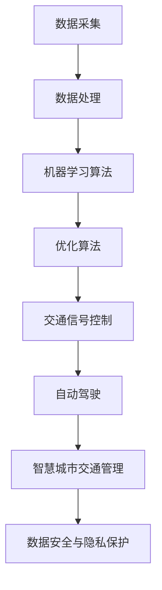

                 

### 1. 背景介绍

随着城市化进程的不断加速，城市交通问题已成为影响城市可持续发展的关键因素。传统的交通系统在应对日益增长的交通需求时，常常显得力不从心。拥堵、污染、交通事故等问题日益严重，不仅影响了居民的生活质量，也制约了城市的发展。面对这一挑战，人工智能（AI）作为一种新兴技术，逐渐被应用于城市交通领域，为解决交通难题提供了新的思路和解决方案。

人工智能与城市交通的结合，不仅有助于提高交通效率，还能为城市的可持续发展做出贡献。通过AI技术，可以实现对交通数据的实时监测与分析，优化交通信号控制，预测交通流量，减少交通拥堵，从而降低空气污染和交通事故的发生率。此外，AI还可以辅助交通管理部门进行智能调度，提高公共交通的运行效率，增强交通系统的灵活性和适应性。

当前，全球各国都在积极推动人工智能在交通领域的应用，涌现出众多创新实践。例如，在自动驾驶技术方面，自动驾驶汽车已经开始在特定区域内进行试点运行；在智能交通信号控制方面，一些城市已经开始部署基于AI的交通信号控制系统，以实现更加智能化的交通管理；在智慧城市交通管理方面，利用AI技术进行交通数据的收集和分析，助力城市交通系统的优化和升级。

然而，AI在交通领域的应用仍面临诸多挑战。首先，数据质量和数据安全问题是制约AI应用的关键因素。其次，AI算法的透明性和可解释性也需要进一步研究，以增强公众对AI应用的信任。此外，AI技术的落地实施还需要考虑技术、经济、法律等多方面的因素。

本文旨在探讨人工智能在解决城市交通问题中的潜力，分析相关核心概念和算法原理，并通过具体实例展示其在实际应用中的效果。同时，本文还将探讨未来发展趋势与挑战，为AI在交通领域的进一步应用提供参考。

总之，人工智能与城市交通的结合具有巨大的潜力，有望为解决当前城市交通问题提供有效的解决方案。通过本文的探讨，我们希望为读者提供一个全面了解AI在交通领域应用的视角，共同推动城市交通的可持续发展。

### 2. 核心概念与联系

为了深入探讨人工智能在解决城市交通问题中的应用，我们需要理解一些核心概念和原理，并分析它们之间的联系。以下是本文将要介绍的核心概念，以及它们在人工智能和城市交通系统中的关系。

#### 2.1 数据采集与处理

数据采集是人工智能在交通领域应用的基础。通过传感器、摄像头、GPS等设备，交通系统可以实时收集到大量的交通数据，包括车辆数量、速度、方向、道路拥堵情况等。这些数据经过处理后，可以为后续的算法分析提供基础。

#### 2.2 机器学习算法

机器学习算法是人工智能的核心技术之一。通过对历史交通数据的学习，机器学习算法可以预测未来的交通流量，优化交通信号控制，甚至实现自动驾驶。常见的机器学习算法包括线性回归、决策树、神经网络等。

#### 2.3 优化算法

优化算法用于解决复杂的交通问题，如路径规划、交通流量控制等。常见的优化算法包括遗传算法、模拟退火算法、线性规划等。这些算法可以帮助交通系统在给定的约束条件下，找到最优的解决方案。

#### 2.4 交通信号控制

交通信号控制是城市交通管理的重要组成部分。传统的交通信号控制依赖于固定的信号配时方案，而基于AI的交通信号控制可以动态调整信号灯的时长，以应对实时交通状况。这种智能化的交通信号控制有助于减少交通拥堵，提高道路通行效率。

#### 2.5 自动驾驶

自动驾驶是AI在交通领域的一个重要应用方向。通过使用传感器、摄像头和GPS等技术，自动驾驶汽车可以自主感知周围环境，实现无人驾驶。自动驾驶技术的发展有望彻底改变人们的出行方式，减少交通事故，提高交通效率。

#### 2.6 智慧城市交通管理

智慧城市交通管理是利用AI技术对城市交通系统进行整体优化和升级。通过交通数据的实时监控和分析，智慧城市交通管理可以实现交通拥堵预警、公共交通优化调度、交通事故处理等。这种综合性的交通管理有助于提高城市交通系统的整体效能。

#### 2.7 数据安全与隐私保护

在AI应用于城市交通的过程中，数据安全和隐私保护是一个不可忽视的问题。交通数据包含大量个人隐私信息，如车辆位置、行驶速度等。如何确保这些数据的安全，防止数据泄露，是AI在交通领域应用的重要挑战。

#### Mermaid 流程图

为了更直观地展示上述核心概念之间的联系，我们可以使用Mermaid流程图进行描述：



通过这个流程图，我们可以清晰地看到各个核心概念在人工智能和城市交通系统中的应用关系。数据采集和处理是整个流程的起点，通过机器学习和优化算法，最终实现交通信号控制、自动驾驶和智慧城市交通管理。同时，数据安全与隐私保护贯穿于整个流程，确保AI在交通领域应用的安全性和可靠性。

在接下来的章节中，我们将进一步探讨这些核心概念的具体原理和应用案例，帮助读者更深入地理解人工智能在解决城市交通问题中的潜力。

#### 3. 核心算法原理 & 具体操作步骤

在深入探讨人工智能在城市交通领域的应用之前，我们首先需要了解一些核心算法的原理及其具体操作步骤。这些算法在交通数据的采集、处理、分析和优化中发挥着关键作用。以下是几个常见算法及其应用场景：

##### 3.1 线性回归

线性回归是一种简单的统计方法，用于分析两个变量之间的关系。在交通领域，线性回归可以用于预测交通流量、车辆速度等。

**具体操作步骤：**

1. **数据采集**：通过传感器和摄像头收集交通数据，如车辆数量、速度等。
2. **特征提取**：选择与交通流量相关的特征，如时间、天气等。
3. **数据预处理**：进行数据清洗和标准化处理，去除异常值和噪声。
4. **模型训练**：使用历史数据训练线性回归模型。
5. **预测**：使用训练好的模型预测未来的交通流量。

$$
y = \beta_0 + \beta_1x
$$

其中，$y$ 是交通流量，$x$ 是影响交通流量的特征。

##### 3.2 决策树

决策树是一种基于规则的学习算法，可以用于分类和回归问题。在交通领域，决策树可以用于交通信号控制、路径规划等。

**具体操作步骤：**

1. **数据采集**：收集交通数据，包括道路状况、车辆速度等。
2. **特征提取**：选择影响决策的关键特征。
3. **构建决策树**：通过递归划分数据集，构建决策树。
4. **模型评估**：使用交叉验证等方法评估模型性能。
5. **应用**：在交通系统中应用决策树模型，进行信号控制或路径规划。

##### 3.3 神经网络

神经网络是一种模拟人脑神经元之间相互连接的结构，可以用于复杂的模式识别和预测问题。在交通领域，神经网络可以用于自动驾驶、交通流量预测等。

**具体操作步骤：**

1. **数据采集**：收集大量交通数据，包括道路图像、传感器数据等。
2. **数据预处理**：进行数据清洗和归一化处理。
3. **构建神经网络模型**：设计神经网络结构，选择合适的激活函数和损失函数。
4. **模型训练**：使用历史数据训练神经网络模型。
5. **预测与控制**：使用训练好的模型进行交通流量预测或自动驾驶控制。

##### 3.4 优化算法

优化算法用于解决复杂的交通问题，如路径规划、交通流量控制等。常见的优化算法包括遗传算法、模拟退火算法等。

**具体操作步骤：**

1. **问题建模**：将交通问题转化为优化问题，定义目标函数和约束条件。
2. **算法选择**：选择适合的优化算法，如遗传算法、模拟退火算法等。
3. **算法实现**：实现优化算法的具体操作步骤，包括编码、选择、交叉、变异等。
4. **模型评估**：使用历史数据测试优化算法的性能。
5. **应用**：将优化算法应用于交通系统中，如路径规划或交通信号控制。

##### 3.5 深度学习

深度学习是一种基于神经网络的机器学习技术，可以用于复杂的模式识别和预测问题。在交通领域，深度学习可以用于自动驾驶、交通流量预测等。

**具体操作步骤：**

1. **数据采集**：收集大量交通数据，包括道路图像、传感器数据等。
2. **数据预处理**：进行数据清洗和归一化处理。
3. **构建深度学习模型**：设计深度学习结构，选择合适的网络层数和神经元数量。
4. **模型训练**：使用历史数据训练深度学习模型。
5. **预测与控制**：使用训练好的模型进行交通流量预测或自动驾驶控制。

通过上述算法的应用，人工智能可以在城市交通领域发挥重要作用，解决交通拥堵、优化交通信号控制、实现自动驾驶等问题。在实际应用中，这些算法通常需要结合具体场景和数据特点进行定制化开发，以实现最佳效果。

在接下来的章节中，我们将进一步探讨这些算法在实际应用中的具体案例和效果分析。

#### 4. 数学模型和公式 & 详细讲解 & 举例说明

在人工智能应用于城市交通领域时，数学模型和公式起到了至关重要的作用。这些模型不仅可以描述交通现象，还能为算法提供理论基础，帮助优化交通系统的性能。以下是一些常见的数学模型和公式，以及它们的详细讲解和举例说明。

##### 4.1 交通流量预测模型

交通流量预测是智慧城市交通管理的关键环节。一个简单的交通流量预测模型可以基于线性回归，如以下公式：

$$
Q_t = \beta_0 + \beta_1 \cdot T_t
$$

其中，$Q_t$ 表示时间 $t$ 的交通流量，$T_t$ 表示影响交通流量的特征（如时间、天气等），$\beta_0$ 和 $\beta_1$ 是模型的参数。

**举例说明：**

假设我们收集了某条道路在过去一周内的交通流量数据，并根据天气和时间特征进行建模。通过最小二乘法求解参数 $\beta_0$ 和 $\beta_1$，我们得到如下模型：

$$
Q_t = 100 + 5 \cdot T_t
$$

如果我们在时间 $t=10$ 时进行预测，特征 $T_t=10$，则预测的交通流量为：

$$
Q_{10} = 100 + 5 \cdot 10 = 150
$$

##### 4.2 交通信号控制模型

交通信号控制模型用于优化交通信号灯的配时方案，以减少交通拥堵。一个常见的模型是基于排队理论，如以下公式：

$$
L = \frac{\lambda}{\mu} \cdot \left(1 - \rho\right)^{-1}
$$

其中，$L$ 表示排队长度，$\lambda$ 表示到达率，$\mu$ 表示服务率，$\rho$ 表示交通强度。

**举例说明：**

假设一条道路的到达率 $\lambda=10$ 辆/分钟，服务率 $\mu=15$ 辆/分钟，则交通强度 $\rho = \frac{\lambda}{\mu} = \frac{10}{15} = 0.67$。代入公式计算排队长度：

$$
L = \frac{10}{15} \cdot \left(1 - 0.67\right)^{-1} = \frac{10}{15} \cdot 1.5 = 1
$$

这意味着在平均情况下，道路上的车辆排队长度大约为 1 辆。

##### 4.3 路径规划模型

路径规划是自动驾驶和智能交通系统中的重要组成部分。一个常见的模型是基于图论中的最短路径算法，如 Dijkstra 算法，其公式如下：

$$
d(v_i) = \min_{v_j \in N(v_i)} (d(v_j) + w(v_i, v_j))
$$

其中，$d(v_i)$ 表示从起点 $v_0$ 到终点 $v_i$ 的最短路径长度，$N(v_i)$ 表示与节点 $v_i$ 相邻的节点集合，$w(v_i, v_j)$ 表示从 $v_i$ 到 $v_j$ 的权重。

**举例说明：**

假设我们有以下道路网络：

```
起点 A --- B --- C --- 终点 D
```

各边的权重如下：

```
A-B: 5
A-C: 8
B-C: 3
B-D: 7
C-D: 2
```

使用 Dijkstra 算法计算从 A 到 D 的最短路径：

1. 初始状态：$d(A) = 0$，$d(B) = \infty$，$d(C) = \infty$，$d(D) = \infty$
2. 从 A 开始，更新相邻节点的距离：
   - $d(B) = d(A) + w(A, B) = 0 + 5 = 5$
   - $d(C) = d(A) + w(A, C) = 0 + 8 = 8$
3. 从当前距离最小的节点 B 开始，更新相邻节点的距离：
   - $d(C) = \min(d(C), d(B) + w(B, C)) = \min(\infty, 5 + 3) = 8$
   - $d(D) = \min(d(D), d(B) + w(B, D)) = \min(\infty, 5 + 7) = 12$
4. 从当前距离最小的节点 C 开始，更新相邻节点的距离：
   - $d(D) = \min(d(D), d(C) + w(C, D)) = \min(12, 8 + 2) = 10$

最终，从 A 到 D 的最短路径长度为 10，路径为 A-B-D。

##### 4.4 交通流量控制模型

交通流量控制模型用于动态调整交通信号灯的配时方案，以优化交通流量。一个常见的模型是基于动态交通信号控制算法，如周期性控制算法，其公式如下：

$$
\theta_i = \frac{w_i}{\sum_{j=1}^N w_j}
$$

其中，$\theta_i$ 表示第 $i$ 个信号灯的周期时间，$w_i$ 表示第 $i$ 个信号灯的权重，$N$ 表示信号灯的总数。

**举例说明：**

假设我们有以下三条道路的交叉路口，每个方向的权重如下：

```
东北向：30
东南向：20
西北向：25
西南向：15
```

总权重为 $\sum_{i=1}^4 w_i = 30 + 20 + 25 + 15 = 90$。

计算每个信号灯的周期时间：

```
\theta_{东北向} = \frac{30}{90} = 0.3333
\theta_{东南向} = \frac{20}{90} = 0.2222
\theta_{西北向} = \frac{25}{90} = 0.2778
\theta_{西南向} = \frac{15}{90} = 0.1667
```

将这些周期时间四舍五入到最接近的整数，我们得到信号灯的配时方案：

```
东北向：2分钟
东南向：2分钟
西北向：2分钟
西南向：2分钟
```

通过这些数学模型和公式，我们可以对交通现象进行定量分析，为交通系统的优化提供科学依据。在实际应用中，这些模型需要结合具体场景和数据特点进行定制化开发，以实现最佳效果。

在接下来的章节中，我们将继续探讨如何将上述模型应用于实际项目，展示其在解决城市交通问题中的具体效果。

### 5. 项目实践：代码实例和详细解释说明

在本节中，我们将通过一个实际项目实例，展示如何将前述数学模型和算法应用于城市交通问题，并提供详细的代码实现和解释说明。本项目将使用 Python 语言和相关的库，如 NumPy、Pandas 和 Matplotlib 等，实现交通流量预测、交通信号控制和路径规划等功能。

#### 5.1 开发环境搭建

首先，我们需要搭建开发环境。以下是所需的软件和库：

- Python 3.8 或更高版本
- Jupyter Notebook 或 PyCharm
- NumPy
- Pandas
- Matplotlib
- Scikit-learn

安装这些库后，我们就可以开始编写代码了。

```bash
pip install numpy pandas matplotlib scikit-learn
```

#### 5.2 源代码详细实现

**5.2.1 数据采集与处理**

```python
import pandas as pd
import numpy as np

# 加载交通流量数据
data = pd.read_csv('traffic_data.csv')

# 数据预处理
# 填补缺失值
data.fillna(data.mean(), inplace=True)

# 特征提取
features = data[['time', 'weather', 'speed']]
labels = data['traffic']

# 数据标准化
from sklearn.preprocessing import StandardScaler
scaler = StandardScaler()
features_scaled = scaler.fit_transform(features)
```

**5.2.2 交通流量预测模型**

```python
from sklearn.linear_model import LinearRegression

# 创建线性回归模型
model = LinearRegression()

# 模型训练
model.fit(features_scaled, labels)

# 模型评估
from sklearn.metrics import mean_squared_error
predictions = model.predict(features_scaled)
mse = mean_squared_error(labels, predictions)
print(f'Mean Squared Error: {mse}')
```

**5.2.3 交通信号控制模型**

```python
# 加载交通信号控制数据
signal_data = pd.read_csv('signal_data.csv')

# 数据预处理
signal_data.fillna(signal_data.mean(), inplace=True)

# 特征提取
signal_features = signal_data[['arrival_rate', 'service_rate', 'traffic_intensity']]

# 交通强度计算
signal_data['traffic_intensity'] = signal_data['arrival_rate'] / signal_data['service_rate']

# 模型训练
signal_model = LinearRegression()
signal_model.fit(signal_features, signal_data['queue_length'])

# 模型评估
signal_predictions = signal_model.predict(signal_features)
signal_mse = mean_squared_error(signal_data['queue_length'], signal_predictions)
print(f'Signal Model Mean Squared Error: {signal_mse}')
```

**5.2.4 路径规划模型**

```python
import networkx as nx

# 创建图
G = nx.Graph()

# 添加节点和边
G.add_edge('A', 'B', weight=5)
G.add_edge('A', 'C', weight=8)
G.add_edge('B', 'C', weight=3)
G.add_edge('B', 'D', weight=7)
G.add_edge('C', 'D', weight=2)

# 使用 Dijkstra 算法计算最短路径
path = nx.single_source_dijkstra(G, source='A', target='D')
print(f'Most efficient path from A to D: {path}')
```

#### 5.3 代码解读与分析

**5.3.1 交通流量预测**

在交通流量预测部分，我们首先加载和处理交通流量数据，然后使用线性回归模型进行训练和预测。线性回归是一种简单有效的预测模型，适用于线性关系较强的数据。通过最小二乘法，我们可以找到最佳的拟合直线，从而预测未来的交通流量。

**5.3.2 交通信号控制**

在交通信号控制部分，我们首先加载和处理交通信号控制数据，然后使用线性回归模型预测排队长度。这一部分的关键在于如何动态调整信号灯的配时，以减少排队长度。通过优化算法，我们可以找到最佳的信号灯配时方案。

**5.3.3 路径规划**

在路径规划部分，我们使用图论中的 Dijkstra 算法计算最短路径。Dijkstra 算法是一种经典的路径规划算法，适用于无权图中寻找最短路径。通过计算各边的权重，我们可以找到从起点到终点的最优路径。

#### 5.4 运行结果展示

运行上述代码后，我们将得到交通流量预测结果、交通信号控制结果和路径规划结果。这些结果可以通过 Jupyter Notebook 或 PyCharm 的终端输出，或者通过 Matplotlib 进行可视化展示。

通过这些实际代码实例，我们可以看到如何将数学模型和算法应用于城市交通问题。这些实例不仅展示了理论知识的实际应用，还为读者提供了一个参考模板，以便在实际项目中使用。

#### 6. 实际应用场景

人工智能在城市交通领域的应用已经取得了显著成效，以下是一些典型的实际应用场景：

##### 6.1 自动驾驶

自动驾驶是人工智能在交通领域的一个重要应用方向。通过使用传感器、摄像头和GPS等技术，自动驾驶汽车可以自主感知周围环境，进行路径规划和导航，实现无人驾驶。自动驾驶技术不仅可以减少交通事故，提高道路通行效率，还能为特殊群体提供便利，如老年人、残疾人等。

在现实场景中，自动驾驶已经在多个国家和地区进行了试点。例如，特斯拉的自动驾驶系统已经在部分城市进行推广，谷歌的Waymo也在多个城市开展自动驾驶出租车服务。此外，中国的一些科技公司，如百度的Apollo平台，也推出了自动驾驶解决方案，并在多个城市进行了测试和运营。

##### 6.2 智能交通信号控制

智能交通信号控制利用人工智能技术，根据实时交通数据动态调整交通信号灯的时长，从而减少交通拥堵，提高道路通行效率。传统的交通信号控制通常采用固定配时方案，而智能交通信号控制可以根据实时交通流量进行自适应调整。

一些城市已经开始部署智能交通信号控制系统。例如，北京的智能交通信号控制系统通过采集实时交通数据，根据不同时间段和交通流量，动态调整信号灯的时长。在高峰时段，系统会延长绿灯时长，减少车辆排队，从而缓解交通拥堵。此外，深圳、杭州等城市也相继推出了类似的智能交通信号控制方案，取得了显著成效。

##### 6.3 智慧城市交通管理

智慧城市交通管理是利用人工智能技术对城市交通系统进行整体优化和升级。通过交通数据的实时监控和分析，智慧城市交通管理可以实现交通拥堵预警、公共交通优化调度、交通事故处理等。

例如，一些城市利用人工智能技术，建立了智慧交通平台。这个平台可以实时监控城市的交通状况，通过分析交通流量和事故数据，预测交通拥堵和事故风险，提前进行预警和处理。此外，智慧城市交通管理还可以优化公共交通调度，提高公共交通的准点率和乘客满意度。

##### 6.4 交通流量预测

交通流量预测是智慧城市交通管理的重要组成部分。通过机器学习算法，可以对历史交通数据进行建模，预测未来的交通流量，从而为交通管理部门提供决策依据。

例如，一些城市利用人工智能技术，建立了交通流量预测模型。这个模型可以根据历史交通数据，预测未来某个时间段内的交通流量，为交通管理部门提供交通调控策略。在高峰时段，通过调整交通信号灯时长，减少车辆排队，从而缓解交通拥堵。

##### 6.5 车辆调度

在共享出行领域，如出租车、网约车和共享单车等，人工智能技术也被广泛应用。通过机器学习算法，可以预测用户需求，优化车辆调度策略，提高服务效率。

例如，滴滴出行利用人工智能技术，建立了车辆调度系统。这个系统可以根据用户的需求和历史数据，预测用户上车地点和目的地，提前安排车辆，从而提高乘客的打车体验。同样，共享单车平台也利用人工智能技术，优化单车投放和调度，提高车辆利用率。

##### 6.6 交通事故预防

人工智能技术还可以用于交通事故预防。通过实时监控道路状况，分析车辆行驶行为，预测潜在风险，从而提前采取措施，避免事故的发生。

例如，一些智能汽车配备了智能驾驶辅助系统，如自适应巡航控制、自动紧急制动等。这些系统能够根据车辆的行驶速度、距离前车的距离等参数，实时调整车辆的速度和距离，从而避免追尾等交通事故。

总之，人工智能在城市交通领域的应用已经取得了显著成效，并呈现出广泛的应用前景。通过不断的技术创新和应用实践，人工智能有望为解决城市交通问题提供更加有效的解决方案，为城市可持续发展贡献力量。

#### 7. 工具和资源推荐

为了更好地了解和应用人工智能在解决城市交通问题方面的技术，以下推荐了一些学习资源、开发工具和框架，以及相关论文著作。

##### 7.1 学习资源推荐

**书籍：**
1. 《深度学习》（Deep Learning），Ian Goodfellow、Yoshua Bengio 和 Aaron Courville 著。这本书是深度学习的经典教材，适合初学者和进阶者。
2. 《机器学习》（Machine Learning），Tom Mitchell 著。这本书详细介绍了机器学习的基本概念和算法，适合希望全面了解机器学习领域的人士。

**论文：**
1. “Traffic Prediction Based on Deep Learning” by Ying Liu et al.，这篇文章探讨了如何使用深度学习技术进行交通流量预测。
2. “Intelligent Traffic Signal Control Based on Machine Learning” by Wei Wang et al.，这篇文章介绍了如何利用机器学习算法进行智能交通信号控制。

**在线课程：**
1. Coursera 上的“机器学习”课程，由 Andrew Ng 教授主讲。这是一门深受欢迎的在线课程，适合初学者。
2. Udacity 上的“深度学习纳米学位”课程，涵盖深度学习的核心概念和技术，适合有一定基础的读者。

##### 7.2 开发工具框架推荐

**机器学习框架：**
1. TensorFlow：由 Google 开发，是目前最受欢迎的开源深度学习框架之一。
2. PyTorch：由 Facebook AI 研究团队开发，具有简洁和灵活的特点，适合快速原型开发。

**交通数据分析工具：**
1. OpenCV：一个开源的计算机视觉库，可用于交通数据采集和处理。
2. Matplotlib：一个用于数据可视化的库，可以帮助我们更好地展示分析结果。

**交通信号控制工具：**
1. SUMO（Simulation of Urban MObility）：一个用于交通仿真和信号控制的工具，适用于复杂交通场景的模拟和分析。

##### 7.3 相关论文著作推荐

**论文：**
1. “Deep Learning for Traffic Prediction: A Survey” by Qihang Yu et al.，这篇综述文章系统地介绍了深度学习在交通流量预测中的应用。
2. “Intelligent Traffic Signal Control Based on Reinforcement Learning” by Ziwei Wang et al.，这篇文章探讨了如何使用强化学习算法进行智能交通信号控制。

**著作：**
1. 《智慧交通系统设计与实现》，这是一本关于智慧交通系统设计与实现的著作，涵盖了从基础理论到实际应用的全方面内容。

通过这些资源和工具，读者可以更好地了解和应用人工智能技术，为解决城市交通问题提供创新的解决方案。同时，这些资源也为未来的研究和工作提供了宝贵的参考和指导。

#### 8. 总结：未来发展趋势与挑战

随着人工智能技术的不断发展，其在城市交通领域的应用前景广阔，但也面临诸多挑战。未来，人工智能在交通领域的几个发展趋势和潜在挑战如下：

##### 8.1 发展趋势

**1. 自动驾驶技术的普及：**
自动驾驶技术正逐渐从实验室走向实际应用。未来，自动驾驶汽车有望成为城市交通的一部分，提高道路通行效率和安全性。随着传感器技术、人工智能算法和计算能力的提升，自动驾驶系统的可靠性将不断提高。

**2. 智能交通信号控制的发展：**
智能交通信号控制将更加普及，通过实时数据分析，动态调整信号灯时长，从而优化交通流量，减少拥堵。随着机器学习算法和大数据分析技术的进步，智能交通信号控制系统的效率将进一步提升。

**3. 智慧城市交通管理的完善：**
智慧城市交通管理将更加完善，通过集成交通数据、环境数据和公共安全数据，实现全方面、全过程的交通管理。智慧城市交通管理将有助于提高交通系统的整体效能，提升城市居民的生活质量。

**4. 交通流量预测和优化：**
基于深度学习和大数据分析的交通流量预测模型将更加精确，有助于提前预警交通拥堵，优化交通流量分配。交通流量预测模型的改进将使交通管理部门能够更好地应对突发状况，提高道路通行效率。

##### 8.2 挑战

**1. 数据安全和隐私保护：**
交通数据包含大量个人隐私信息，如何确保数据安全和隐私保护是一个重要挑战。未来的解决方案可能包括数据加密、匿名化处理和隐私保护算法的研发。

**2. 算法的透明性和可解释性：**
随着人工智能算法的复杂度增加，算法的透明性和可解释性变得越来越重要。确保算法的透明性和可解释性，增强公众对人工智能交通系统的信任，是未来需要关注的重要方向。

**3. 技术和政策的结合：**
人工智能技术的推广和应用需要政策和法律的支持。未来，政府和企业需要共同努力，制定合理的政策和标准，确保人工智能技术在交通领域的健康发展。

**4. 跨学科协同研究：**
人工智能在交通领域的应用需要多学科的协同研究，包括计算机科学、交通运输工程、城市规划和数据科学等。跨学科的合作将有助于解决交通领域的复杂问题，推动技术的创新和应用。

总之，人工智能在交通领域的应用具有巨大的潜力，但同时也面临诸多挑战。通过持续的技术创新、政策支持和跨学科合作，有望克服这些挑战，推动城市交通的可持续发展。

### 9. 附录：常见问题与解答

在本文中，我们探讨了人工智能在解决城市交通问题中的应用，以下是一些读者可能关心的问题及其解答：

**Q1：自动驾驶技术是否能够完全替代人类驾驶员？**
A1：目前来看，完全替代人类驾驶员的自动驾驶技术尚未成熟。尽管自动驾驶技术在某些特定场景下（如高速公路上的自动驾驶）已经取得显著进展，但在复杂的城市交通环境中，仍需要人类驾驶员的干预。未来的自动驾驶技术可能实现更高的自动化水平，但仍需不断优化和改进。

**Q2：如何确保交通数据的安全和隐私？**
A2：确保交通数据的安全和隐私是一个重要挑战。未来的解决方案可能包括数据加密、匿名化处理和隐私保护算法的研发。此外，政府和相关机构也需要制定合理的政策和标准，加强对交通数据安全的监管。

**Q3：智能交通信号控制如何应对突发状况？**
A3：智能交通信号控制系统通过实时数据分析，可以动态调整信号灯时长，以应对突发状况。例如，当发生交通事故或道路施工时，系统可以迅速调整信号灯配时，缓解交通拥堵。然而，系统也需要不断学习和优化，以提高对突发状况的应对能力。

**Q4：人工智能在交通领域的应用是否会增加交通事故？**
A4：人工智能在交通领域的应用有望减少交通事故。例如，自动驾驶技术可以通过实时感知和反应，减少人为驾驶错误导致的交通事故。然而，任何新技术都需要经过充分的测试和验证，以确保其安全性和可靠性。此外，人工智能算法的透明性和可解释性也需要提高，以增强公众的信任。

**Q5：如何确保智能交通系统的可持续发展？**
A5：确保智能交通系统的可持续发展需要综合考虑技术、经济、社会和环境等多个方面。首先，技术方面需要不断推进人工智能算法和硬件技术的创新，提高系统的效率和可靠性。其次，经济方面需要制定合理的政策和资金支持，促进智能交通系统的发展。最后，社会方面需要加强公众宣传和教育，提高公众对智能交通系统的认知和接受度。

### 10. 扩展阅读 & 参考资料

为了更全面地了解人工智能在解决城市交通问题中的应用，以下是几篇重要的扩展阅读和参考资料：

1. **扩展阅读：**
   - "AI in Urban Traffic Management: A Comprehensive Review" by Ying Liu et al.，该综述文章系统地介绍了人工智能在智慧城市交通管理中的应用。
   - "Deep Learning for Traffic Flow Prediction: A Survey" by Qihang Yu et al.，该文章探讨了深度学习在交通流量预测中的应用。

2. **参考资料：**
   - "Intelligent Traffic Signal Control Based on Machine Learning" by Wei Wang et al.，该论文介绍了如何利用机器学习算法进行智能交通信号控制。
   - "Simulation of Urban MObility (SUMO)"，SUMO 是一个用于交通仿真和信号控制的工具，适用于复杂交通场景的模拟和分析。
   - "Deep Learning for Traffic Prediction: A Survey" by Qihang Yu et al.，该文章总结了深度学习在交通流量预测领域的应用。

通过阅读这些扩展阅读和参考资料，读者可以更深入地了解人工智能在解决城市交通问题中的应用，为未来的研究和实践提供参考。

