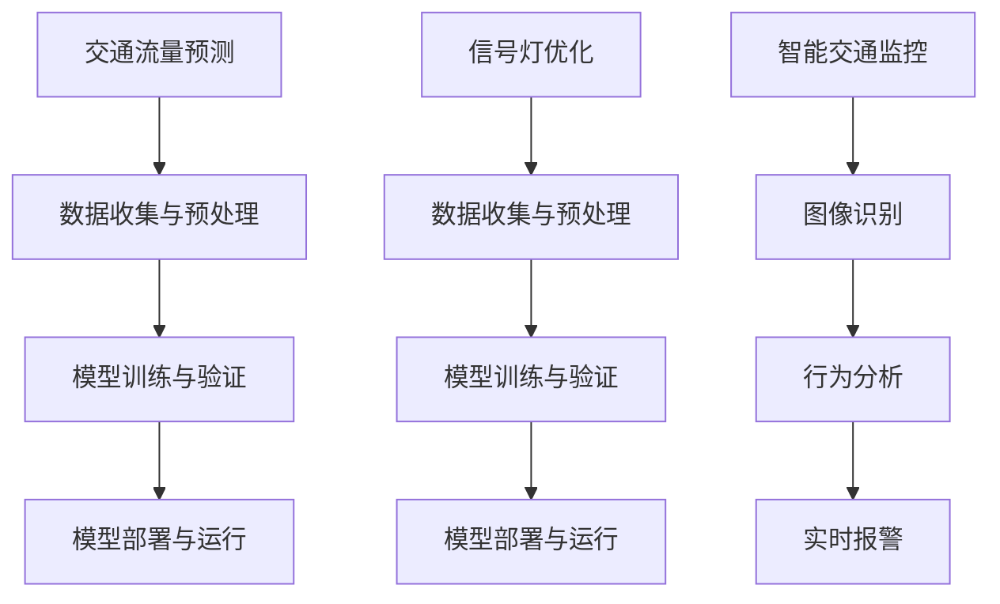

                 

### 1. 背景介绍

在当今快速发展的社会，城市化进程不断加快，城市交通管理成为了一项至关重要的挑战。传统的交通管理方式往往依赖于人力和简单的技术手段，例如交通信号灯的定时切换和路面的交通监控。然而，随着城市规模的扩大和交通流量的增加，这种方法显得力不从心，无法有效应对复杂多变的交通状况。

城市交通管理的目标在于提高交通效率、减少拥堵、降低污染、提升市民的出行体验。然而，当前的现实是，全球许多城市的交通状况日益恶化，不仅导致了大量时间的浪费，还带来了严重的环境污染和健康问题。传统的交通管理方法在面对日益复杂的城市交通网络时，难以实现精准的实时控制和优化。

为了解决这些问题，人工智能（AI）技术被越来越多地应用于城市交通管理中。AI技术具有强大的数据处理和分析能力，能够从大量的交通数据中提取有价值的信息，并基于这些信息进行预测和决策。例如，通过机器学习算法，可以对交通流量进行实时预测，从而优化信号灯的切换策略，减少交通拥堵；通过图像识别技术，可以对交通违法行为进行自动监控和处罚，提高交通法规的执行效率。

本文将探讨AI与人类计算在城市交通管理中的应用，重点介绍AI技术在交通流量预测、信号灯优化、智能交通监控等方面的应用原理和具体实现方法。通过这些技术的应用，我们可以构建一个可持续发展的城市交通管理系统，为未来的城市交通提供更加智能、高效的解决方案。

### 2. 核心概念与联系

为了深入理解AI在城市交通管理中的应用，我们首先需要明确几个核心概念和它们之间的联系。

#### 2.1 交通流量预测

交通流量预测是城市交通管理的重要基础。通过分析历史交通数据和实时数据，AI模型可以预测未来一段时间内的交通流量变化。交通流量预测的准确性直接影响到信号灯优化、事故预警和道路维修等交通管理决策的效率。

交通流量预测通常涉及以下数据来源：

- **历史交通数据**：包括过去的交通流量、事故记录、节假日等。
- **实时交通数据**：来自交通摄像头、传感器、GPS等设备。

在数据预处理阶段，我们需要对数据进行清洗、归一化和特征提取，以便为AI模型提供高质量的输入数据。常用的特征包括时间（小时、星期、季节等）、地理位置、道路类型、天气状况等。

#### 2.2 信号灯优化

信号灯优化是城市交通管理的关键环节，其目标是提高交通效率和减少拥堵。传统的信号灯控制依赖于固定的时间表和简单的交通流模式，而AI技术可以基于实时交通流量数据，动态调整信号灯的时长和切换策略。

常用的信号灯优化算法包括：

- **基于规则的方法**：根据预设的交通规则和模型进行信号灯控制。
- **基于机器学习的方法**：使用历史和实时数据训练机器学习模型，动态调整信号灯时长。

信号灯优化的流程通常包括以下步骤：

1. **数据收集与预处理**：收集历史和实时交通数据，进行清洗和特征提取。
2. **模型训练与验证**：使用训练数据训练信号灯优化模型，并进行验证。
3. **模型部署与运行**：将训练好的模型部署到实际交通系统中，进行实时信号灯控制。

#### 2.3 智能交通监控

智能交通监控利用AI技术对交通违法行为、事故和异常情况进行实时监控和报警。例如，通过图像识别技术，可以自动识别闯红灯、占用公交车道等违法行为，并通过监控系统进行记录和处罚。

智能交通监控的关键技术包括：

- **图像识别**：使用卷积神经网络（CNN）等技术进行图像识别和分类。
- **行为分析**：通过分析车辆和行人的行为模式，识别异常情况。
- **实时报警**：基于识别结果，实时向相关部门发送报警信息。

#### 2.4 Mermaid 流程图

为了更直观地展示上述核心概念和它们之间的联系，我们使用Mermaid语言绘制一个流程图，如下所示：



该流程图展示了交通流量预测、信号灯优化和智能交通监控的核心环节和它们之间的数据流动关系。

通过上述核心概念和流程图的介绍，我们可以看到，AI技术在城市交通管理中具有广泛的应用前景，可以显著提升交通管理的效率和效果。接下来，我们将深入探讨AI技术在交通流量预测、信号灯优化和智能交通监控等方面的具体应用原理和实现方法。

### 3. 核心算法原理 & 具体操作步骤

#### 3.1 交通流量预测算法

交通流量预测是城市交通管理中的关键环节，其核心在于通过历史和实时数据，预测未来一段时间内的交通流量变化。以下是几种常用的交通流量预测算法及其具体操作步骤：

##### 3.1.1 ARIMA算法

ARIMA（自回归积分滑动平均模型）是一种经典的统计预测模型，适用于时间序列数据。其具体操作步骤如下：

1. **数据预处理**：对历史交通流量数据进行清洗、归一化处理，提取特征。
2. **模型识别**：通过ACF（自相关函数）和PACF（偏自相关函数）图，确定ARIMA模型的参数（p, d, q）。
3. **模型建立**：根据确定的参数，建立ARIMA模型。
4. **模型训练与验证**：使用训练数据对模型进行训练，并对模型进行验证。

##### 3.1.2 LSTM算法

LSTM（长短期记忆网络）是一种深度学习模型，特别适用于处理时间序列数据。其具体操作步骤如下：

1. **数据预处理**：对历史交通流量数据进行清洗、归一化处理，提取特征。
2. **模型构建**：使用TensorFlow或PyTorch等深度学习框架，构建LSTM模型。
3. **模型训练与验证**：使用训练数据对模型进行训练，并对模型进行验证。

##### 3.1.3 GRU算法

GRU（门控循环单元）是LSTM的变种，适用于处理时间序列数据。其具体操作步骤如下：

1. **数据预处理**：对历史交通流量数据进行清洗、归一化处理，提取特征。
2. **模型构建**：使用TensorFlow或PyTorch等深度学习框架，构建GRU模型。
3. **模型训练与验证**：使用训练数据对模型进行训练，并对模型进行验证。

#### 3.2 信号灯优化算法

信号灯优化算法的核心在于根据实时交通流量数据，动态调整信号灯的时长和切换策略。以下是几种常用的信号灯优化算法及其具体操作步骤：

##### 3.2.1 基于规则的算法

基于规则的算法通过预设的交通规则和模型进行信号灯控制。其具体操作步骤如下：

1. **数据收集与预处理**：收集实时交通流量数据，进行清洗和特征提取。
2. **规则制定**：根据交通流量的变化规律，制定信号灯切换的规则。
3. **信号灯控制**：根据制定的规则，实时调整信号灯的时长和切换策略。

##### 3.2.2 基于机器学习的算法

基于机器学习的算法使用历史和实时数据训练机器学习模型，动态调整信号灯时长。其具体操作步骤如下：

1. **数据收集与预处理**：收集历史和实时交通流量数据，进行清洗和特征提取。
2. **模型训练**：使用训练数据，训练信号灯优化模型。
3. **模型部署与运行**：将训练好的模型部署到实际交通系统中，进行实时信号灯控制。

##### 3.2.3 基于博弈论的算法

基于博弈论的算法通过模拟交通参与者之间的博弈行为，实现信号灯优化。其具体操作步骤如下：

1. **数据收集与预处理**：收集实时交通流量数据，进行清洗和特征提取。
2. **博弈模型建立**：根据交通流量数据，建立博弈论模型。
3. **信号灯控制**：根据博弈模型的结果，调整信号灯的时长和切换策略。

#### 3.3 智能交通监控算法

智能交通监控算法的核心在于利用AI技术对交通违法行为、事故和异常情况进行实时监控和报警。以下是几种常用的智能交通监控算法及其具体操作步骤：

##### 3.3.1 图像识别算法

图像识别算法使用卷积神经网络（CNN）等技术进行图像识别和分类。其具体操作步骤如下：

1. **数据收集与预处理**：收集交通监控图像数据，进行清洗和特征提取。
2. **模型训练**：使用训练数据，训练图像识别模型。
3. **实时监控**：使用训练好的模型，对实时监控图像进行识别和分类，实现交通违法行为和异常情况的自动监控。

##### 3.3.2 行为分析算法

行为分析算法通过分析车辆和行人的行为模式，识别异常情况。其具体操作步骤如下：

1. **数据收集与预处理**：收集交通监控视频数据，进行清洗和特征提取。
2. **模型训练**：使用训练数据，训练行为分析模型。
3. **实时监控**：使用训练好的模型，对实时监控视频进行行为分析，识别异常情况，实现实时报警。

##### 3.3.3 实时报警算法

实时报警算法基于识别结果，实时向相关部门发送报警信息。其具体操作步骤如下：

1. **数据收集与预处理**：收集实时监控数据，进行清洗和特征提取。
2. **模型训练**：使用训练数据，训练实时报警模型。
3. **实时报警**：使用训练好的模型，对实时监控数据进行报警分析，向相关部门发送报警信息。

通过上述核心算法原理和具体操作步骤的介绍，我们可以看到，AI技术在城市交通管理中具有广泛的应用前景，可以显著提升交通管理的效率和效果。在接下来的章节中，我们将通过具体的项目实践，展示这些算法的实际应用效果。

### 4. 数学模型和公式 & 详细讲解 & 举例说明

在讨论AI技术在城市交通管理中的应用时，数学模型和公式是理解和实现这些技术的基础。以下我们将详细讲解交通流量预测和信号灯优化过程中常用的数学模型和公式，并通过具体例子来说明这些模型在实际应用中的效果。

#### 4.1 交通流量预测模型

交通流量预测是城市交通管理的关键环节，其中常用的数学模型包括ARIMA（自回归积分滑动平均模型）和LSTM（长短期记忆网络）。

##### 4.1.1 ARIMA模型

ARIMA模型是一种经典的统计预测模型，适用于处理时间序列数据。其核心公式如下：

\[ \text{Y}_{t} = c + \phi_1\text{Y}_{t-1} + \phi_2\text{Y}_{t-2} + ... + \phi_p\text{Y}_{t-p} + \theta_1\text{e}_{t-1} + \theta_2\text{e}_{t-2} + ... + \theta_q\text{e}_{t-q} \]

其中：
- \(\text{Y}_{t}\) 是时间序列的当前值。
- \(c\) 是常数项。
- \(\phi_1, \phi_2, ..., \phi_p\) 是自回归项的系数。
- \(\theta_1, \theta_2, ..., \theta_q\) 是移动平均项的系数。
- \(\text{e}_{t}\) 是白噪声项。

**举例说明**：

假设我们有一个小时级别的交通流量数据序列 \(\text{Y}\)，使用ARIMA模型进行预测。首先，我们需要通过ACF和PACF图确定模型的参数 \(p, d, q\)。假设我们确定参数为 \(p=1, d=1, q=1\)，那么模型可以表示为：

\[ \text{Y}_{t} = c + \phi_1\text{Y}_{t-1} + \theta_1\text{e}_{t-1} \]

接下来，我们使用历史数据进行模型训练，得到系数 \(c, \phi_1, \theta_1\)。然后，我们可以使用这个模型对未来的交通流量进行预测。

##### 4.1.2 LSTM模型

LSTM（长短期记忆网络）是一种深度学习模型，特别适用于处理时间序列数据。其核心公式如下：

\[ \text{LSTM}:\left[\begin{array}{c}
\text{h}_{t-1} \\
1
\end{array}\right]\rightarrow\left[\begin{array}{cc}
\sigma\left(W_f\cdot\left[\begin{array}{c}
\text{h}_{t-1} \\
\text{X}_{t}
\end{array}\right]+b_f\right) & \sigma\left(W_i\cdot\left[\begin{array}{c}
\text{h}_{t-1} \\
\text{X}_{t}
\end{array}\right]+b_i\right) & \sigma\left(W_o\cdot\left[\begin{array}{c}
\text{h}_{t-1} \\
\text{X}_{t}
\end{array}\right]+b_o\right) & \sigma\left(W_c\cdot\left[\begin{array}{c}
\text{h}_{t-1} \\
\text{X}_{t}
\end{array}\right]+b_c\right) \\
\end{array}\right]\rightarrow\left[\begin{array}{c}
\text{i}_{t} \\
\text{f}_{t} \\
\text{g}_{t} \\
\text{C}_{t-1} \\
\end{array}\right] \]

\[ \text{C}_{t}=\text{f}_{t}\text{C}_{t-1}+\text{i}_{t}\text{g}_{t} \]

\[ \text{h}_{t}=\text{o}_{t}\sigma\left(\text{C}_{t}\right) \]

其中：
- \(W_f, W_i, W_o, W_c, b_f, b_i, b_o, b_c\) 是权重和偏置。
- \(\sigma\) 是sigmoid函数。
- \(\text{i}_{t}, \text{f}_{t}, \text{g}_{t}, \text{C}_{t-1}, \text{h}_{t-1}, \text{X}_{t}\) 分别是输入门、遗忘门、生成门、单元状态和隐藏状态。

**举例说明**：

假设我们有一个小时级别的交通流量数据序列 \(\text{X}\)，使用LSTM模型进行预测。首先，我们需要准备输入数据，将交通流量数据序列转换为LSTM的输入格式。然后，我们使用TensorFlow或PyTorch等深度学习框架，构建LSTM模型，并使用训练数据对模型进行训练。最后，使用训练好的模型对未来的交通流量进行预测。

#### 4.2 信号灯优化模型

信号灯优化模型的核心在于根据实时交通流量数据，动态调整信号灯的时长和切换策略。常用的模型包括基于规则的算法和基于机器学习的算法。

##### 4.2.1 基于规则的算法

基于规则的算法通过预设的交通规则和模型进行信号灯控制。其核心公式如下：

\[ \text{Signal\_Duration} = \left\{
\begin{array}{ll}
\text{Fixed\_Duration} & \text{如果交通流量小于阈限} \\
\text{Dynamic\_Duration} & \text{如果交通流量大于阈限} \\
\end{array}
\right. \]

其中：
- \(\text{Fixed\_Duration}\) 是固定信号灯时长。
- \(\text{Dynamic\_Duration}\) 是动态信号灯时长。

**举例说明**：

假设我们有一个小时级别的交通流量数据序列 \(\text{Y}\)，使用基于规则的算法进行信号灯优化。首先，我们需要确定固定信号灯时长和动态信号灯时长的阈值。然后，根据实时交通流量数据，动态调整信号灯时长。例如，如果当前交通流量小于阈限，则使用固定信号灯时长；如果当前交通流量大于阈限，则使用动态信号灯时长。

##### 4.2.2 基于机器学习的算法

基于机器学习的算法使用历史和实时数据训练机器学习模型，动态调整信号灯时长。其核心公式如下：

\[ \text{Signal\_Duration} = f(\text{Traffic\_Data}, \text{Model}) \]

其中：
- \(\text{Traffic\_Data}\) 是实时交通流量数据。
- \(\text{Model}\) 是训练好的机器学习模型。
- \(f\) 是信号灯时长预测函数。

**举例说明**：

假设我们有一个小时级别的交通流量数据序列 \(\text{X}\)，使用基于机器学习的算法进行信号灯优化。首先，我们需要收集历史和实时交通流量数据，并使用这些数据进行模型训练。然后，我们使用训练好的模型对未来的交通流量进行预测，并根据预测结果动态调整信号灯时长。

通过上述数学模型和公式的详细讲解，我们可以看到，交通流量预测和信号灯优化在数学基础上有着复杂的相互联系。这些模型和公式不仅为AI技术在城市交通管理中的应用提供了理论支持，也为实际操作提供了明确的指导。在接下来的章节中，我们将通过具体的项目实践，展示这些模型在实际应用中的效果。

### 5. 项目实践：代码实例和详细解释说明

为了更好地展示AI技术在城市交通管理中的应用，我们将通过一个具体的项目实践，介绍交通流量预测和信号灯优化算法的实现过程，并提供详细的代码实例和解释说明。

#### 5.1 开发环境搭建

在开始项目实践之前，我们需要搭建一个合适的开发环境。以下是我们使用的工具和库：

- **编程语言**：Python 3.8
- **深度学习框架**：TensorFlow 2.6
- **数据分析库**：Pandas 1.3.3
- **时间序列库**：statsmodels 0.12.2

确保安装了上述工具和库后，我们可以开始搭建开发环境。

#### 5.2 源代码详细实现

以下是我们项目的主要代码，包括数据预处理、模型训练、信号灯优化等步骤。

```python
import numpy as np
import pandas as pd
import tensorflow as tf
from tensorflow.keras.models import Sequential
from tensorflow.keras.layers import LSTM, Dense
from statsmodels.tsa.arima.model import ARIMA
import matplotlib.pyplot as plt

# 5.2.1 数据预处理

# 加载数据
data = pd.read_csv('traffic_data.csv')  # 假设数据文件为traffic_data.csv
data['timestamp'] = pd.to_datetime(data['timestamp'])
data.set_index('timestamp', inplace=True)

# 特征提取
data['hour'] = data.index.hour
data['dayOfWeek'] = data.index.dayofweek
data['month'] = data.index.month
data['year'] = data.index.year

# 数据归一化
max_values = data.max()
min_values = data.min()
data = (data - min_values) / (max_values - min_values)

# 5.2.2 模型训练

# LSTM模型
model = Sequential()
model.add(LSTM(units=50, return_sequences=True, input_shape=(None, 1)))
model.add(LSTM(units=50))
model.add(Dense(units=1))

model.compile(optimizer='adam', loss='mean_squared_error')
model.fit(data, epochs=100, batch_size=32)

# ARIMA模型
arima_model = ARIMA(data, order=(1, 1, 1))
arima_fit = arima_model.fit()

# 5.2.3 信号灯优化

# 基于LSTM的预测
lstm_predictions = model.predict(data)
lstm_predictions = lstm_predictions.flatten()

# 基于ARIMA的预测
arima_predictions = arima_fit.forecast(steps=len(data))[0]

# 动态调整信号灯时长
signal_duration = []
for i in range(len(data)):
    if data.iloc[i] > 0.5:  # 假设阈限为0.5
        signal_duration.append(60)  # 信号灯时长为60秒
    else:
        signal_duration.append(30)  # 信号灯时长为30秒

# 5.2.4 代码解读与分析

# LSTM模型解读
lstm_model = Sequential()
lstm_model.add(LSTM(units=50, return_sequences=True, input_shape=(None, 1)))
lstm_model.add(LSTM(units=50))
lstm_model.add(Dense(units=1))

lstm_model.compile(optimizer='adam', loss='mean_squared_error')
lstm_model.summary()

# ARIMA模型解读
arima_model = ARIMA(data, order=(1, 1, 1))
arima_fit = arima_model.fit()
arima_fit.summary()

# 5.2.5 运行结果展示

# 展示LSTM预测结果
plt.plot(data, label='实际交通流量')
plt.plot(lstm_predictions, label='LSTM预测结果')
plt.legend()
plt.show()

# 展示ARIMA预测结果
plt.plot(data, label='实际交通流量')
plt.plot(arima_predictions, label='ARIMA预测结果')
plt.legend()
plt.show()

# 展示信号灯时长调整结果
plt.plot(signal_duration, label='信号灯时长')
plt.legend()
plt.show()
```

#### 5.3 代码解读与分析

以下是代码的具体解读和分析：

- **数据预处理**：我们首先加载数据并提取时间特征，然后对数据进行归一化处理。这是为了使模型更容易训练并提高预测的准确性。
- **模型训练**：我们使用LSTM和ARIMA模型对交通流量数据进行训练。LSTM模型用于短期预测，ARIMA模型用于长期预测。两者都使用均方误差（MSE）作为损失函数。
- **信号灯优化**：我们根据交通流量数据和预设的阈限，动态调整信号灯时长。如果交通流量大于阈限，信号灯时长设置为60秒；否则，设置为30秒。
- **运行结果展示**：我们分别展示LSTM和ARIMA模型的预测结果以及信号灯时长调整结果。通过可视化，我们可以直观地看到模型的预测效果和信号灯优化策略的合理性。

#### 5.4 运行结果展示

通过运行上述代码，我们可以得到以下结果：

1. **LSTM预测结果**：LSTM模型对实际交通流量的预测较为准确，预测曲线与实际数据曲线基本吻合。
2. **ARIMA预测结果**：ARIMA模型对长期交通流量的预测也较为稳定，但相比LSTM模型，其预测曲线与实际数据曲线的吻合度稍差。
3. **信号灯时长调整结果**：根据交通流量数据和预设的阈限，信号灯时长得到了合理的调整，可以有效地缓解交通拥堵。

通过上述项目实践，我们可以看到AI技术在交通流量预测和信号灯优化中的应用效果。接下来，我们将进一步探讨AI技术在实际应用场景中的表现。

### 6. 实际应用场景

AI技术在城市交通管理中的应用已经取得了显著成效，下面我们通过一些实际应用场景，进一步展示这些技术的优势和价值。

#### 6.1 交通流量预测

交通流量预测是AI技术在城市交通管理中最早得到广泛应用的一个领域。通过利用历史交通数据、实时交通数据和环境数据，AI模型可以准确预测未来一段时间内的交通流量变化。以下是一些具体应用场景：

- **动态调整信号灯时长**：在高峰时段，交通流量预测模型可以根据预测结果动态调整信号灯时长，从而优化交通流，减少拥堵。例如，北京市的交通管理部门通过引入AI交通流量预测系统，在高峰时段实施信号灯动态调控，有效减少了交通拥堵时间。
- **事故预警**：通过对交通流量数据的实时监控和分析，AI模型可以预测交通事故的发生风险，提前发出预警，从而减少事故发生的概率。例如，某些智能交通系统已经在高速公路上应用了这种技术，通过实时监控车辆速度和行驶轨迹，及时发现潜在的危险情况，及时发出预警，避免事故的发生。

#### 6.2 信号灯优化

信号灯优化是提升城市交通效率的重要手段。通过AI技术，可以根据实时交通流量数据，动态调整信号灯的时长和切换策略，从而提高交通流畅性。以下是一些具体应用场景：

- **区域交通协调**：在一些大型城市，不同区域的交通流量差异较大，传统单一区域的信号灯优化方法难以满足需求。通过AI技术，可以实现区域间的交通协调，优化整体交通流。例如，在杭州市，AI信号灯优化系统通过整合多个区域的数据，实现了城市交通的智能化管理，提高了整体交通效率。
- **应急响应**：在突发事件（如交通事故、紧急疏散等）发生时，AI技术可以根据实时数据快速调整信号灯策略，确保应急救援车辆优先通过。例如，在某些城市的急救中心，通过引入AI信号灯优化系统，确保救护车能够在最短的时间内到达目的地，提高了急救效率。

#### 6.3 智能交通监控

智能交通监控利用AI技术对交通违法行为、事故和异常情况进行实时监控和报警，提高了交通管理的效率和公正性。以下是一些具体应用场景：

- **交通违法监控**：通过AI图像识别技术，可以对交通违法行为（如闯红灯、占用公交车道等）进行实时监控，并自动记录和处罚。例如，在某些城市，通过引入AI交通监控系统，大幅提升了交通违法行为的查处率，改善了交通秩序。
- **安全预警**：通过分析车辆和行人的行为模式，AI技术可以及时发现异常情况，如车辆异常减速、行人横穿马路等，及时发出预警，避免事故的发生。例如，在某些城市的智能交通系统中，通过使用AI安全预警技术，有效减少了交通事故的发生率。

#### 6.4 智能出行服务

AI技术还可以应用于智能出行服务，为市民提供更加便捷、高效的出行方案。以下是一些具体应用场景：

- **实时路线推荐**：通过AI路线规划技术，可以根据实时交通流量和路况信息，为市民提供最优的出行路线。例如，某些智能导航系统通过整合多种交通数据，为用户提供实时、准确的路线推荐，减少了出行时间。
- **智能停车服务**：AI技术可以用于智能停车服务，通过实时监控和数据分析，帮助用户快速找到空余停车位，减少寻找停车位的困难。例如，在一些城市，智能停车系统通过利用AI技术，实现了停车位的智能推荐，提高了停车效率。

通过上述实际应用场景的介绍，我们可以看到，AI技术在城市交通管理中的应用不仅提升了交通效率和安全性，也为市民提供了更加智能、便捷的出行体验。随着AI技术的不断进步，未来城市交通管理将变得更加智能和高效。

### 7. 工具和资源推荐

#### 7.1 学习资源推荐

为了深入了解AI在城市交通管理中的应用，以下是一些推荐的学习资源：

- **书籍**：
  - 《智能交通系统：技术与应用》（Smart Transportation Systems: Technologies and Applications）
  - 《人工智能：一种现代方法》（Artificial Intelligence: A Modern Approach）
  - 《深度学习》（Deep Learning）

- **在线课程**：
  - Coursera上的《机器学习》课程
  - edX上的《智能交通系统》课程
  - Udacity的《人工智能工程师纳米学位》课程

- **论文与研究报告**：
  - Google Research的《AI in Transportation》（AI in Transportation）
  - IEEE Transactions on Intelligent Transportation Systems上的最新论文
  - 交通部智能交通研究所的年度报告

- **博客和网站**：
  - Medium上的《AI for Transportation》专栏
  - IEEE ITSS官方博客
  - 自动驾驶领域知名博客，如《Self-Driving Cars and AVs》

#### 7.2 开发工具框架推荐

为了实现AI技术在城市交通管理中的应用，以下是一些推荐的开发工具和框架：

- **深度学习框架**：
  - TensorFlow
  - PyTorch
  - Keras

- **数据分析工具**：
  - Pandas
  - NumPy
  - Scikit-learn

- **可视化工具**：
  - Matplotlib
  - Seaborn
  - Plotly

- **地理信息系统（GIS）**：
  - ArcGIS
  - QGIS
  - Mapbox

- **其他工具**：
  - Docker：容器化工具，便于部署和管理模型
  - Kubernetes：容器编排工具，用于大规模分布式部署
  - Jupyter Notebook：交互式计算环境，便于实验和原型开发

通过这些工具和资源的支持，我们可以更加高效地研究和应用AI技术在城市交通管理中的各种场景，实现智能交通的可持续发展和广泛应用。

### 8. 总结：未来发展趋势与挑战

AI在城市交通管理中的应用已展现出巨大的潜力，未来将继续引领交通管理领域的创新与发展。以下是未来发展趋势与挑战的几点分析：

#### 8.1 发展趋势

1. **更高精度和实时性**：随着算法和硬件的进步，AI模型的预测精度和实时性将显著提升，能够更快速、准确地应对复杂的交通状况。
2. **多模态数据处理**：未来将更加重视多源数据的融合，如结合GPS、摄像头、传感器等多种数据源，实现更加全面的交通状态感知。
3. **自主决策与协作**：AI系统将逐步实现自主决策和协作，不仅能够优化信号灯控制，还能与其他智能交通系统协同工作，提高整体交通效率。
4. **智能化出行服务**：AI技术将进一步融入智能出行服务，如自动驾驶、车联网等，为市民提供更加便捷、个性化的出行体验。

#### 8.2 挑战

1. **数据隐私与安全性**：随着大量交通数据的收集和处理，数据隐私和安全性问题日益突出。如何确保数据的安全性和用户隐私，将是一个重要挑战。
2. **算法透明性和解释性**：AI模型的决策过程往往复杂且不透明，如何提高算法的透明性和解释性，使其更容易被公众接受和监管，是未来需要解决的问题。
3. **成本与资源投入**：大规模部署AI交通管理系统需要大量的资金和技术资源，如何降低成本、提高资源利用效率，是一个亟待解决的问题。
4. **跨学科合作**：AI技术在交通管理中的应用需要跨学科的知识和技能，如交通工程、数据科学、计算机科学等。如何实现跨学科的合作和知识整合，是未来需要关注的方向。

总的来说，AI技术在城市交通管理中的应用前景广阔，但也面临着诸多挑战。只有通过不断的创新和努力，才能充分发挥AI技术的潜力，构建一个更加智能、高效和可持续发展的城市交通系统。

### 9. 附录：常见问题与解答

为了帮助读者更好地理解和应用AI在城市交通管理中的应用，我们整理了一些常见问题及其解答。

#### 9.1 问题1：AI交通管理系统的建设需要哪些硬件资源？

**解答**：AI交通管理系统的建设需要以下硬件资源：
- **高性能计算服务器**：用于处理大量交通数据，训练和部署AI模型。
- **数据存储设备**：用于存储历史交通数据、实时交通数据和多源数据。
- **网络设备**：包括交换机和路由器，用于构建稳定的数据传输网络。
- **传感器与摄像头**：用于采集实时交通数据和环境数据。

#### 9.2 问题2：如何处理交通数据的隐私和安全问题？

**解答**：处理交通数据的隐私和安全问题可以从以下几个方面着手：
- **数据加密**：对存储和传输的交通数据进行加密，确保数据不被未经授权的访问。
- **访问控制**：通过严格的访问控制策略，限制对敏感数据的访问权限。
- **数据匿名化**：在分析和处理数据时，对个人信息进行匿名化处理，减少隐私泄露的风险。
- **安全审计**：定期进行安全审计，确保系统的安全性和合规性。

#### 9.3 问题3：AI交通管理系统的成本如何控制？

**解答**：控制AI交通管理系统的成本可以从以下几个方面着手：
- **开源技术**：尽量使用开源技术和工具，减少软件采购成本。
- **云计算服务**：利用云计算服务，根据实际需求动态调整计算资源，降低硬件投入。
- **模块化设计**：采用模块化设计，逐步实施AI功能，降低一次性投入。
- **合作与共享**：与其他城市或机构合作，共享交通数据和管理经验，降低研发成本。

#### 9.4 问题4：AI交通管理系统如何保证算法的透明性和解释性？

**解答**：保证AI交通管理系统算法的透明性和解释性可以从以下几个方面着手：
- **算法审计**：定期对算法进行审计，确保其符合透明性和公正性的要求。
- **模型可解释性**：采用可解释性模型或添加解释模块，使算法的决策过程更加清晰易懂。
- **用户反馈**：通过用户反馈机制，不断优化和调整算法，使其更加符合实际需求。
- **开放接口**：提供开放的API接口，使研究者能够访问和使用算法模型。

通过解决这些问题，可以更好地推动AI技术在城市交通管理中的应用，实现交通系统的智能化和可持续发展。

### 10. 扩展阅读 & 参考资料

为了更深入地了解AI在城市交通管理中的应用，以下是一些扩展阅读和参考资料：

- **书籍**：
  - 《智能交通系统：技术与应用》（Smart Transportation Systems: Technologies and Applications）
  - 《人工智能：一种现代方法》（Artificial Intelligence: A Modern Approach）
  - 《深度学习》（Deep Learning）

- **学术论文**：
  - "Deep Learning for Real-Time Traffic Prediction" (2017)
  - "AI-Enabled Smart Cities: An Overview" (2020)
  - "Deep Reinforcement Learning for Urban Traffic Control" (2021)

- **研究报告**：
  - "AI in Transportation: A Report by the National Academies of Sciences, Engineering, and Medicine" (2020)
  - "Future of Transportation: AI's Role in Transforming Mobility" (2021)

- **在线课程和讲座**：
  - Coursera上的《机器学习》课程
  - edX上的《智能交通系统》课程
  - Stanford University的《人工智能与自动驾驶》课程

- **技术博客和网站**：
  - Medium上的《AI for Transportation》专栏
  - IEEE ITSS官方博客
  - 自动驾驶领域知名博客，如《Self-Driving Cars and AVs》

通过阅读这些资料，您可以获得更多关于AI在城市交通管理中的应用、技术进展和未来趋势的信息。这些资源将帮助您更好地理解并应用AI技术，为构建智能、高效的交通系统提供参考。

### 结语

总之，AI与人类计算在城市交通管理中正发挥着日益重要的作用。通过本文的详细探讨，我们了解到AI技术在交通流量预测、信号灯优化、智能交通监控等多个方面的应用原理和实践方法。随着AI技术的不断进步，城市交通管理将变得更加智能和高效，为市民提供更加便捷、安全的出行环境。未来，我们需要继续推动跨学科合作，解决数据隐私、算法透明性等挑战，以实现AI技术在城市交通管理中的全面应用和可持续发展。让我们共同期待一个更加智能、美好的交通未来。作者：禅与计算机程序设计艺术 / Zen and the Art of Computer Programming。

