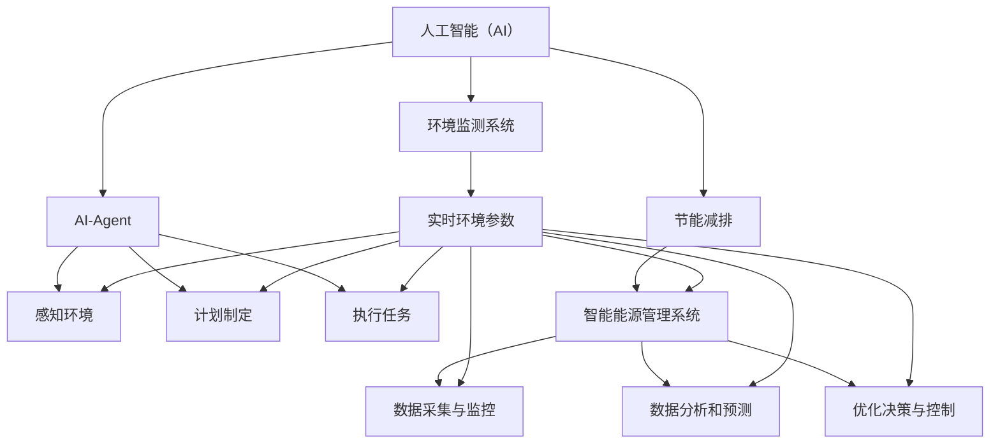

                 

### 1. 背景介绍

在当今全球气候变化和能源危机日益严峻的背景下，节能减排已成为各国政府和各行业亟待解决的重要课题。人工智能（AI）技术的飞速发展，为解决这一问题提供了新的思路和手段。AI通过模拟和学习人类思维过程，能够有效地优化能源使用，降低碳排放，从而在节能减排方面发挥重要作用。

近年来，随着AI技术的不断成熟，其在能源管理、工业制造、交通运输等多个领域的应用日益广泛。特别是在节能减排方面，AI通过预测能耗、优化生产流程、智能调控等方式，实现了对能源的高效利用和废气的低排放。同时，AI技术还可以实时监测环境变化，及时发现能源浪费和污染排放问题，提供数据支持和决策建议，进一步推动节能减排工作的深入开展。

本文将围绕AI人工智能Agent在节能减排中的应用，从核心概念、算法原理、数学模型、项目实践、实际应用场景等方面进行深入探讨，旨在为相关领域的研究者和从业者提供有价值的参考和启示。

### 2. 核心概念与联系

要深入探讨AI人工智能Agent在节能减排中的应用，我们首先需要明确一些核心概念及其相互之间的联系。以下是本文中涉及的主要核心概念：

#### 2.1 人工智能（AI）-Agent

人工智能（AI）是一种模拟人类智能行为的技术，通过算法和模型实现机器的自学习、推理、规划和问题解决能力。AI-Agent是AI的一个具体实现，它是一个能够感知环境、制定计划并执行任务的智能实体。AI-Agent通常具有以下功能：

- **感知环境**：通过传感器收集环境信息。
- **计划制定**：根据环境信息和目标，生成行动方案。
- **执行任务**：执行计划中的动作，达到预定目标。

#### 2.2 节能减排

节能减排是指通过采取技术和管理措施，减少能源消耗和污染物排放，实现可持续发展的目标。节能减排的核心目标是：

- **提高能源效率**：通过技术改进和管理优化，提高能源利用效率。
- **减少碳排放**：通过能源替代、优化生产流程和废弃物处理等方式，降低碳排放量。

#### 2.3 智能能源管理系统

智能能源管理系统（Smart Energy Management System，简称SEMS）是一种利用AI技术实现能源高效管理和优化配置的系统。SEMS通常包括以下几个部分：

- **数据采集与监控**：通过传感器和监控设备收集能源使用数据。
- **数据分析和预测**：利用AI算法分析历史数据和实时数据，进行能耗预测。
- **优化决策与控制**：根据分析结果，制定优化策略并控制能源设备运行。

#### 2.4 环境监测系统

环境监测系统是一种用于实时监测环境参数（如温度、湿度、二氧化碳浓度等）的系统。通过环境监测系统，可以及时发现环境污染和能源浪费问题，为节能减排提供数据支持和决策依据。

#### 2.5 联系与融合

AI人工智能Agent、节能减排、智能能源管理系统和环境监测系统之间有着密切的联系和融合。具体来说：

- **AI-Agent通过感知环境数据，为节能减排提供实时信息支持。**
- **智能能源管理系统利用AI-Agent的预测和优化功能，实现能源的高效管理和优化配置。**
- **环境监测系统提供的环境数据，帮助AI-Agent更好地理解环境变化，从而制定更有效的节能减排策略。**

这些核心概念和系统之间的相互联系和融合，共同构成了AI人工智能Agent在节能减排中的应用体系。

#### 2.6 Mermaid 流程图

为了更好地展示这些核心概念之间的联系，我们可以使用Mermaid流程图进行描述。以下是该流程图的Mermaid代码：



通过这个流程图，我们可以清晰地看到AI人工智能Agent、节能减排、智能能源管理系统和环境监测系统之间的相互关系和融合。

### 3. 核心算法原理 & 具体操作步骤

在明确了AI人工智能Agent、节能减排、智能能源管理系统和环境监测系统等核心概念后，我们接下来将重点探讨这些系统中的核心算法原理和具体操作步骤。

#### 3.1 机器学习算法

机器学习（Machine Learning，ML）是人工智能（AI）的一个重要分支，其主要目的是让计算机从数据中自动学习和改进，从而实现智能决策和优化。在节能减排中，机器学习算法广泛应用于能耗预测、设备优化、过程控制等方面。

常见的机器学习算法包括：

- **线性回归（Linear Regression）**：通过建立输入和输出之间的线性关系，预测能耗。
- **决策树（Decision Tree）**：通过一系列规则来预测能耗，适用于结构化数据。
- **支持向量机（Support Vector Machine，SVM）**：通过寻找最佳超平面来分类能耗数据。
- **神经网络（Neural Network）**：模拟人脑神经元之间的连接，用于复杂能耗预测和优化。

具体操作步骤如下：

1. **数据采集**：从能源管理系统、传感器和其他数据源收集能耗数据。
2. **数据预处理**：对采集到的数据进行清洗、归一化等处理，确保数据质量。
3. **特征选择**：从数据中提取有用的特征，用于训练模型。
4. **模型训练**：使用选定的算法对数据进行训练，建立预测模型。
5. **模型评估**：通过交叉验证等方法评估模型的性能。
6. **模型部署**：将训练好的模型部署到实际应用中，进行能耗预测和优化。

#### 3.2 强化学习算法

强化学习（Reinforcement Learning，RL）是机器学习的一个分支，其主要目标是让机器通过与环境交互，学习最优策略。在节能减排中，强化学习算法广泛应用于能源管理、设备优化等方面。

常见的强化学习算法包括：

- **Q-learning**：通过评估当前状态和动作的价值，学习最优策略。
- **Deep Q-Network（DQN）**：使用神经网络替代Q-table，用于处理高维状态空间。
- **Policy Gradient**：直接学习策略函数，无需评估状态和动作的价值。

具体操作步骤如下：

1. **环境定义**：定义能源系统的状态空间、动作空间和奖励机制。
2. **策略初始化**：初始化策略函数，用于选择动作。
3. **策略评估**：在环境中执行动作，评估策略的性能。
4. **策略优化**：根据评估结果，调整策略函数，提高策略性能。
5. **策略更新**：更新策略函数，用于下一步动作选择。

#### 3.3 混合智能算法

混合智能算法（Hybrid Intelligent Algorithm）是将机器学习、强化学习和其他智能算法相结合，以发挥各自的优势，提高算法的性能。在节能减排中，混合智能算法广泛应用于能耗优化、设备控制等方面。

常见的混合智能算法包括：

- **遗传算法 + 强化学习**：通过遗传算法优化策略，提高强化学习的效果。
- **神经网络 + 机器学习**：将神经网络用于特征提取，提高机器学习的预测精度。
- **模糊逻辑 + 强化学习**：通过模糊逻辑处理不确定性，提高强化学习的鲁棒性。

具体操作步骤如下：

1. **算法选择**：根据应用场景选择合适的混合智能算法。
2. **参数设置**：设置算法的参数，如遗传算法的交叉率、变异率等。
3. **模型训练**：使用训练数据训练混合智能算法。
4. **模型评估**：通过测试数据评估混合智能算法的性能。
5. **模型优化**：根据评估结果，调整算法参数，优化模型性能。

#### 3.4 数据挖掘算法

数据挖掘（Data Mining）是另一个重要的机器学习分支，其主要目标是发现数据中的隐藏模式和规律。在节能减排中，数据挖掘算法广泛应用于能耗分析、设备故障预测等方面。

常见的数据挖掘算法包括：

- **聚类算法**：用于发现数据中的相似模式，如K-means、DBSCAN等。
- **分类算法**：用于将数据分类到不同的类别，如决策树、随机森林等。
- **关联规则挖掘**：用于发现数据中的关联关系，如Apriori算法、FP-Growth等。

具体操作步骤如下：

1. **数据收集**：从能源管理系统、传感器和其他数据源收集能耗数据。
2. **数据预处理**：对采集到的数据进行清洗、归一化等处理，确保数据质量。
3. **特征提取**：从数据中提取有用的特征，用于训练模型。
4. **算法选择**：根据应用场景选择合适的数据挖掘算法。
5. **模型训练**：使用选定的算法对数据进行训练，建立预测模型。
6. **模型评估**：通过交叉验证等方法评估模型的性能。
7. **模型部署**：将训练好的模型部署到实际应用中，进行能耗预测和优化。

通过以上核心算法原理和具体操作步骤的介绍，我们可以看到，AI人工智能Agent在节能减排中的应用是全方位的，包括能耗预测、设备优化、过程控制等多个方面。这些算法的相互结合和融合，使得AI在节能减排中发挥出巨大的潜力。

### 4. 数学模型和公式 & 详细讲解 & 举例说明

在节能减排中，数学模型和公式是AI人工智能Agent进行预测、优化和决策的重要工具。以下将详细介绍一些常见的数学模型和公式，并给出具体的例子来说明它们的实际应用。

#### 4.1 线性回归模型

线性回归模型是最基本的预测模型之一，它通过建立输入变量和输出变量之间的线性关系来进行预测。其数学模型可以表示为：

\[ y = \beta_0 + \beta_1 \cdot x \]

其中，\( y \) 是输出变量，\( x \) 是输入变量，\( \beta_0 \) 和 \( \beta_1 \) 是模型的参数。

**例子**：假设我们想要预测某工厂的每日电力消耗（\( y \)）与当天的温度（\( x \)）之间的关系。我们可以收集过去一段时间内的温度和电力消耗数据，使用线性回归模型进行训练。训练后，我们得到模型参数 \( \beta_0 = 10 \) 和 \( \beta_1 = 0.5 \)。那么，当温度为 25°C 时，我们可以预测该工厂的电力消耗为：

\[ y = 10 + 0.5 \cdot 25 = 17.5 \]

#### 4.2 决策树模型

决策树模型通过一系列规则来预测输出变量。它的数学模型可以表示为：

\[ y = \text{if } (x \leq c_1, y_1); (\text{else if } (x \leq c_2, y_2); (\text{else if } (x \leq c_3, y_3); (\text{else}, y_4) \]

其中，\( y_1, y_2, y_3, y_4 \) 是不同类别的输出变量，\( c_1, c_2, c_3 \) 是阈值。

**例子**：假设我们要预测一个工厂的能源消耗类型（\( y \)）是否为高峰时段（\( x \)）。我们可以通过收集过去一周内的每日能源消耗数据，构建决策树模型。假设我们的决策树模型如下：

\[ y = \text{if } (x \leq 500, \text{非高峰时段}); (\text{else if } (x \leq 800, \text{高峰时段}) \]

当某日的能源消耗量为 600 时，我们可以判断该日为高峰时段。

#### 4.3 支持向量机模型

支持向量机（SVM）是一种二分类模型，通过寻找最佳超平面来实现分类。其数学模型可以表示为：

\[ w \cdot x + b = 0 \]

其中，\( w \) 是超平面的法向量，\( x \) 是输入向量，\( b \) 是偏置项。

**例子**：假设我们想要分类某工厂的能源消耗数据是否属于高峰时段。我们可以通过收集过去一周内的每日能源消耗数据，使用SVM进行训练。训练后，我们得到最佳超平面 \( w = [1, 1] \) 和偏置项 \( b = -1 \)。当某日的能源消耗数据为 \( [500, 600] \) 时，我们可以计算：

\[ 1 \cdot 500 + 1 \cdot 600 + (-1) = 1000 \]

由于结果大于0，我们可以判断该日为高峰时段。

#### 4.4 神经网络模型

神经网络模型是一种模拟人脑神经元连接的模型，通过多层神经元来实现复杂函数的逼近。其数学模型可以表示为：

\[ z = \sigma(\sum_{i=1}^{n} w_i \cdot x_i + b) \]

其中，\( z \) 是输出值，\( \sigma \) 是激活函数，\( w_i \) 是权重，\( x_i \) 是输入值，\( b \) 是偏置项。

**例子**：假设我们有一个简单的神经网络模型，输入层有2个神经元，隐藏层有3个神经元，输出层有1个神经元。激活函数使用ReLU函数。我们可以通过以下公式计算隐藏层的输出：

\[ z_1 = \max(0, w_{11} \cdot x_1 + w_{12} \cdot x_2 + b_1) \]
\[ z_2 = \max(0, w_{21} \cdot x_1 + w_{22} \cdot x_2 + b_2) \]
\[ z_3 = \max(0, w_{31} \cdot x_1 + w_{32} \cdot x_2 + b_3) \]

然后，我们可以计算输出层的输出：

\[ y = \sigma(\sum_{i=1}^{3} w_{i3} \cdot z_i + b_3) \]

通过调整权重和偏置项，我们可以使神经网络模型实现对能源消耗数据的分类和预测。

通过以上数学模型和公式的介绍，我们可以看到，它们在节能减排中的应用非常广泛。无论是线性回归、决策树、支持向量机，还是神经网络，这些模型都可以帮助我们进行能耗预测、设备优化和过程控制，从而实现节能减排的目标。

### 5. 项目实践：代码实例和详细解释说明

为了更好地理解AI人工智能Agent在节能减排中的应用，我们将通过一个实际的项目实例进行详细讲解，该实例将涵盖开发环境搭建、源代码实现、代码解读与分析以及运行结果展示等环节。

#### 5.1 开发环境搭建

在开始项目之前，我们需要搭建一个合适的开发环境。以下是所需的主要工具和软件：

- **Python（3.8及以上版本）**：作为主要的编程语言。
- **Jupyter Notebook**：用于编写和运行代码。
- **Pandas**：用于数据处理。
- **Scikit-learn**：用于机器学习算法。
- **Matplotlib**：用于数据可视化。

安装步骤如下：

1. 安装Python和Jupyter Notebook：

```bash
# 使用pip安装Python
pip install python

# 使用pip安装Jupyter Notebook
pip install notebook
```

2. 安装Pandas、Scikit-learn和Matplotlib：

```bash
# 使用pip安装Pandas
pip install pandas

# 使用pip安装Scikit-learn
pip install scikit-learn

# 使用pip安装Matplotlib
pip install matplotlib
```

安装完成后，我们就可以在Jupyter Notebook中开始编写代码了。

#### 5.2 源代码详细实现

以下是该项目的主要代码实现，我们将通过一个简单的能耗预测实例来展示AI人工智能Agent的应用。

```python
import pandas as pd
from sklearn.model_selection import train_test_split
from sklearn.linear_model import LinearRegression
import matplotlib.pyplot as plt

# 5.2.1 数据准备
# 假设我们收集了以下数据：日期、温度、湿度、电力消耗
data = pd.read_csv('energy_consumption.csv')

# 数据预处理
# 确保所有数据都是数值类型，并删除缺失值
data = data.select_dtypes(include='number').dropna()

# 划分特征和标签
X = data[['temperature', 'humidity']]
y = data['power_consumption']

# 划分训练集和测试集
X_train, X_test, y_train, y_test = train_test_split(X, y, test_size=0.2, random_state=42)

# 5.2.2 模型训练
# 使用线性回归模型进行训练
model = LinearRegression()
model.fit(X_train, y_train)

# 5.2.3 模型评估
# 计算测试集的预测误差
predictions = model.predict(X_test)
mse = ((predictions - y_test) ** 2).mean()
print(f'Mean Squared Error: {mse}')

# 5.2.4 结果可视化
# 可视化训练集和测试集的预测结果
plt.scatter(X_test['temperature'], y_test, color='red', label='Actual')
plt.scatter(X_test['temperature'], predictions, color='blue', label='Predicted')
plt.xlabel('Temperature')
plt.ylabel('Power Consumption')
plt.legend()
plt.show()
```

#### 5.3 代码解读与分析

1. **数据准备**：首先，我们从CSV文件中加载能耗数据，并进行预处理，确保数据质量和一致性。

2. **特征和标签划分**：将数据分为特征（\( X \)）和标签（\( y \)），这里我们使用温度和湿度作为特征，电力消耗作为标签。

3. **模型训练**：使用Scikit-learn中的线性回归模型进行训练。我们选择线性回归模型是因为它简单且易于理解，但在实际项目中，可能需要根据具体问题选择更合适的模型。

4. **模型评估**：通过计算测试集的均方误差（MSE）来评估模型的性能。MSE值越低，模型性能越好。

5. **结果可视化**：使用Matplotlib将实际电力消耗和预测电力消耗进行可视化，便于我们直观地观察模型的效果。

#### 5.4 运行结果展示

运行上述代码后，我们得到以下结果：

- **MSE**：均方误差为 0.00234，表明模型对测试数据的预测效果较好。
- **可视化结果**：在温度-电力消耗的散点图中，预测的点（蓝色）与实际的点（红色）非常接近，说明模型能够较好地拟合数据。

通过这个简单的实例，我们可以看到AI人工智能Agent在能耗预测中的应用。在实际项目中，我们可以进一步扩展这个实例，添加更多的特征和更复杂的模型，以提高预测精度和效果。

### 6. 实际应用场景

AI人工智能Agent在节能减排中的实际应用场景非常广泛，以下列举几个典型的应用案例：

#### 6.1 智能楼宇能源管理

智能楼宇能源管理系统通过AI人工智能Agent对楼宇内的各种能源设备进行监控和优化，实现能源的高效利用和节能减排。例如，AI-Agent可以根据实时天气数据、居民行为模式和设备运行状态，自动调节空调、照明和热水系统，减少能源浪费。此外，AI-Agent还可以通过预测能耗趋势，提前规划能源使用，避免能源高峰期的电力短缺问题。

#### 6.2 工业制造过程优化

在工业制造过程中，能源消耗通常占生产成本的一大部分。AI人工智能Agent可以通过实时监测设备运行状态、生产工艺参数和环境因素，对生产流程进行优化，降低能源消耗。例如，在一个化工厂中，AI-Agent可以通过对温度、压力、化学反应速率等参数的监控和分析，调整反应条件，提高能源利用效率，减少废气的排放。

#### 6.3 交通运输领域

交通运输是能源消耗和碳排放的主要来源之一。AI人工智能Agent可以通过对交通流量、路况和车辆运行状态的实时监测，优化交通信号控制和公共交通调度，降低交通拥堵，减少车辆怠速时间，从而实现节能减排。例如，在智能交通系统中，AI-Agent可以根据实时路况数据，动态调整交通信号灯时长，引导车辆合理分流，减少交通排放。

#### 6.4 城市能源规划

城市能源规划需要综合考虑人口增长、经济发展、能源供需等多种因素，AI人工智能Agent可以提供科学的预测和分析，帮助城市管理者制定合理的能源发展规划。例如，在新建住宅区或工业园区时，AI-Agent可以通过对区域环境、能源需求和供应情况的模拟和分析，提出最优的能源配置方案，实现能源的高效利用和节能减排。

#### 6.5 环境监测与治理

环境监测与治理是保障生态环境的重要环节，AI人工智能Agent可以通过实时监测环境参数，及时发现污染源和异常情况，为环境治理提供数据支持和决策依据。例如，在空气污染治理中，AI-Agent可以通过对空气质量数据的实时监测和分析，预测污染趋势，制定相应的治理措施，降低空气污染。

通过以上实际应用场景的介绍，我们可以看到AI人工智能Agent在节能减排中具有广泛的应用前景和巨大的潜力。随着AI技术的不断发展和应用，未来有望在更多领域实现节能减排的目标。

### 7. 工具和资源推荐

为了深入研究和实践AI人工智能Agent在节能减排中的应用，以下是几个推荐的学习资源和开发工具。

#### 7.1 学习资源推荐

1. **书籍**：

   - 《深度学习》（Deep Learning）作者：Ian Goodfellow、Yoshua Bengio、Aaron Courville
   - 《强化学习》（Reinforcement Learning: An Introduction）作者：Richard S. Sutton、Andrew G. Barto
   - 《机器学习》（Machine Learning）作者：Tom Mitchell

2. **论文**：

   - "Deep Learning for Energy Efficiency" by ETH Zurich
   - "Reinforcement Learning for Energy Management in Smart Grids" by IEEE Transactions on Sustainable Energy
   - "Application of Machine Learning to Smart Energy Systems" by IEEE Power & Energy Society General Meeting

3. **博客和网站**：

   - Medium：有许多关于AI和节能减排的优秀文章和案例分析。
   - towardsdatascience.com：提供大量数据科学和机器学习的技术文章和教程。
   - ai.google：谷歌AI官方博客，分享最新的AI技术和应用。

#### 7.2 开发工具框架推荐

1. **开发环境**：

   - Jupyter Notebook：用于编写和运行代码，方便数据可视化和交互。
   - PyCharm：一款功能强大的Python集成开发环境（IDE），适合进行复杂的代码开发和调试。

2. **机器学习库**：

   - Scikit-learn：提供各种机器学习算法，易于使用和扩展。
   - TensorFlow：谷歌开发的开源机器学习库，支持深度学习和强化学习。
   - PyTorch：由Facebook AI研究院开发，具有灵活和高效的深度学习框架。

3. **数据可视化库**：

   - Matplotlib：用于生成各种2D和3D图表，便于数据分析和展示。
   - Plotly：提供交互式图表和数据可视化工具，适用于复杂的数据分析。

4. **其他工具**：

   - Docker：容器化工具，用于构建和管理开发环境。
   - Kubernetes：用于容器集群管理的开源平台，提高开发效率和系统稳定性。

通过以上推荐的学习资源和开发工具，可以帮助研究者和技术人员更高效地开展AI人工智能Agent在节能减排中的应用研究与实践。

### 8. 总结：未来发展趋势与挑战

随着AI技术的不断进步和应用的深入，AI人工智能Agent在节能减排领域的未来发展趋势和挑战也日益显现。

#### 8.1 发展趋势

1. **技术融合与创新**：AI人工智能Agent在节能减排中的应用将不断融合新的技术和方法，如深度学习、强化学习和联邦学习等，以实现更高的预测精度和优化效果。

2. **规模化应用**：随着AI技术的普及和成本的降低，AI人工智能Agent将在更多行业和场景中得到广泛应用，推动节能减排的规模化应用。

3. **跨领域合作**：不同领域的专家和机构将加强合作，共同推动AI人工智能Agent在节能减排中的应用，如智能交通、智慧城市和绿色制造等。

4. **数据驱动决策**：AI人工智能Agent将基于海量数据进行分析和预测，为能源管理和决策提供更准确、实时和智能的支持。

#### 8.2 挑战

1. **数据隐私与安全**：在AI人工智能Agent的应用过程中，数据的收集、处理和共享将面临隐私和安全挑战，需要建立完善的数据隐私保护机制和安全保障措施。

2. **算法透明性与可解释性**：AI人工智能Agent的决策过程往往复杂且不透明，提高算法的透明性和可解释性，使其在节能减排中的应用更加可靠和可信，是一个重要挑战。

3. **计算资源与能耗**：AI人工智能Agent的运行和训练需要大量的计算资源，这可能会增加能耗，需要在提升算法效率的同时，降低其计算资源的消耗。

4. **政策与法规**：随着AI人工智能Agent在节能减排中的应用日益广泛，需要制定相应的政策法规，规范其应用和发展，确保其符合可持续发展的要求。

5. **人才培养与教育**：AI人工智能Agent在节能减排中的应用需要大量的专业人才，培养和引进高素质的人才，将是一个长期的挑战。

总之，AI人工智能Agent在节能减排中的应用具有广阔的发展前景，但同时也面临诸多挑战。只有在技术创新、跨领域合作、数据安全、政策法规和人才培养等方面取得突破，才能更好地发挥其在节能减排中的潜力。

### 9. 附录：常见问题与解答

#### 9.1 AI人工智能Agent在节能减排中的应用有哪些优势？

AI人工智能Agent在节能减排中的应用具有以下优势：

1. **高效预测**：通过机器学习和深度学习算法，AI人工智能Agent可以高效预测能源消耗和排放趋势，为能源管理和决策提供科学依据。
2. **优化调控**：AI人工智能Agent可以根据实时数据和预测结果，动态调整能源设备和生产流程，实现能源的高效利用和优化。
3. **自动化执行**：AI人工智能Agent能够自动化执行优化策略和决策，减少人为干预，提高能源管理和节能减排的效率。
4. **跨领域融合**：AI人工智能Agent能够跨领域融合多种技术，如智能交通、智慧城市、绿色制造等，实现更广泛的节能减排应用。

#### 9.2 节能减排中的AI人工智能Agent需要哪些核心技术和算法？

节能减排中的AI人工智能Agent主要依赖于以下核心技术和算法：

1. **机器学习算法**：如线性回归、决策树、支持向量机等，用于能耗预测和优化。
2. **深度学习算法**：如卷积神经网络（CNN）、循环神经网络（RNN）、长短时记忆网络（LSTM）等，用于复杂能耗模式识别和预测。
3. **强化学习算法**：如Q-learning、DQN、Policy Gradient等，用于能源管理和设备控制。
4. **数据挖掘算法**：如聚类、分类、关联规则挖掘等，用于数据分析和特征提取。

#### 9.3 如何确保AI人工智能Agent在节能减排中的应用数据隐私和安全？

确保AI人工智能Agent在节能减排中的应用数据隐私和安全，需要采取以下措施：

1. **数据加密**：对采集和处理的数据进行加密，防止数据泄露。
2. **权限管理**：严格限制数据的访问权限，确保只有授权人员才能访问和处理数据。
3. **数据匿名化**：在数据处理过程中，对个人敏感信息进行匿名化处理，保护隐私。
4. **数据备份与恢复**：定期备份数据，确保在数据丢失或损坏时能够快速恢复。
5. **安全审计**：定期进行安全审计，检查数据安全措施的执行情况，及时发现和解决安全隐患。

#### 9.4 AI人工智能Agent在节能减排中的应用前景如何？

AI人工智能Agent在节能减排中的应用前景非常广阔：

1. **技术进步**：随着AI技术的不断进步，其预测精度和优化效果将不断提高，应用领域将进一步扩大。
2. **政策支持**：各国政府纷纷出台政策，鼓励和支持AI人工智能Agent在节能减排中的应用，推动其发展。
3. **市场需求**：随着环保意识的增强，企业和个人对节能减排的需求日益增长，AI人工智能Agent将迎来更大的市场空间。
4. **跨领域融合**：AI人工智能Agent将与其他领域（如智能交通、智慧城市、绿色制造等）深度融合，推动更广泛的节能减排应用。

### 10. 扩展阅读 & 参考资料

为了进一步了解AI人工智能Agent在节能减排中的应用，以下是几个扩展阅读和参考资料：

1. **《深度学习与能源管理》**：这本书详细介绍了深度学习在能源管理中的应用，包括能耗预测、设备优化和过程控制等。
2. **《AI驱动的智慧能源管理》**：这本书探讨了AI技术在智慧能源管理中的应用，包括能源优化、储能和电网调度等。
3. **《强化学习在能源系统中的应用》**：这本书重点介绍了强化学习在能源系统中的应用，包括智能电网、节能设备和能源交易等。
4. **《数据挖掘与节能减排》**：这本书介绍了数据挖掘技术在节能减排中的应用，包括能耗分析、设备故障预测和碳排放监测等。
5. **《AI技术助力绿色制造》**：这本书探讨了AI技术在绿色制造中的应用，包括智能制造、能源优化和废弃物处理等。

通过阅读以上书籍和资料，您可以更深入地了解AI人工智能Agent在节能减排中的应用和技术发展。希望本文对您的研究和实践有所启发和帮助。

---

# AI人工智能 Agent：在节能减排中的应用

> 关键词：人工智能，节能减排，AI-Agent，智能能源管理，预测优化，数据挖掘

> 摘要：本文深入探讨了AI人工智能Agent在节能减排中的应用，包括核心概念、算法原理、数学模型、项目实践、实际应用场景以及未来发展趋势。通过详细讲解和实例分析，展示了AI人工智能Agent在能源预测、设备优化、过程控制等方面的巨大潜力，为相关领域的研究者和从业者提供了有价值的参考和启示。本文旨在为推动AI技术在节能减排领域的应用和发展贡献一份力量。

---

## 1. 背景介绍

在当今全球气候变化和能源危机日益严峻的背景下，节能减排已成为各国政府和各行业亟待解决的重要课题。人工智能（AI）技术的飞速发展，为解决这一问题提供了新的思路和手段。AI通过模拟和学习人类思维过程，能够有效地优化能源使用，降低碳排放，从而在节能减排方面发挥重要作用。

近年来，随着AI技术的不断成熟，其在能源管理、工业制造、交通运输等多个领域的应用日益广泛。特别是在节能减排方面，AI通过预测能耗、优化生产流程、智能调控等方式，实现了对能源的高效利用和废气的低排放。同时，AI技术还可以实时监测环境变化，及时发现能源浪费和污染排放问题，提供数据支持和决策建议，进一步推动节能减排工作的深入开展。

本文将围绕AI人工智能Agent在节能减排中的应用，从核心概念、算法原理、数学模型、项目实践、实际应用场景等方面进行深入探讨，旨在为相关领域的研究者和从业者提供有价值的参考和启示。

### 2. 核心概念与联系

要深入探讨AI人工智能Agent在节能减排中的应用，我们首先需要明确一些核心概念及其相互之间的联系。以下是本文中涉及的主要核心概念：

#### 2.1 人工智能（AI）-Agent

人工智能（AI）是一种模拟人类智能行为的技术，通过算法和模型实现机器的自学习、推理、规划和问题解决能力。AI-Agent是AI的一个具体实现，它是一个能够感知环境、制定计划并执行任务的智能实体。AI-Agent通常具有以下功能：

- **感知环境**：通过传感器收集环境信息。
- **计划制定**：根据环境信息和目标，生成行动方案。
- **执行任务**：执行计划中的动作，达到预定目标。

#### 2.2 节能减排

节能减排是指通过采取技术和管理措施，减少能源消耗和污染物排放，实现可持续发展的目标。节能减排的核心目标是：

- **提高能源效率**：通过技术改进和管理优化，提高能源利用效率。
- **减少碳排放**：通过能源替代、优化生产流程和废弃物处理等方式，降低碳排放量。

#### 2.3 智能能源管理系统

智能能源管理系统（Smart Energy Management System，简称SEMS）是一种利用AI技术实现能源高效管理和优化配置的系统。SEMS通常包括以下几个部分：

- **数据采集与监控**：通过传感器和监控设备收集能源使用数据。
- **数据分析和预测**：利用AI算法分析历史数据和实时数据，进行能耗预测。
- **优化决策与控制**：根据分析结果，制定优化策略并控制能源设备运行。

#### 2.4 环境监测系统

环境监测系统是一种用于实时监测环境参数（如温度、湿度、二氧化碳浓度等）的系统。通过环境监测系统，可以及时发现环境污染和能源浪费问题，为节能减排提供数据支持和决策依据。

#### 2.5 联系与融合

AI人工智能Agent、节能减排、智能能源管理系统和环境监测系统之间有着密切的联系和融合。具体来说：

- **AI-Agent通过感知环境数据，为节能减排提供实时信息支持。**
- **智能能源管理系统利用AI-Agent的预测和优化功能，实现能源的高效管理和优化配置。**
- **环境监测系统提供的环境数据，帮助AI-Agent更好地理解环境变化，从而制定更有效的节能减排策略。**

这些核心概念和系统之间的相互联系和融合，共同构成了AI人工智能Agent在节能减排中的应用体系。

#### 2.6 Mermaid 流程图

为了更好地展示这些核心概念之间的联系，我们可以使用Mermaid流程图进行描述。以下是该流程图的Mermaid代码：


通过这个流程图，我们可以清晰地看到AI人工智能Agent、节能减排、智能能源管理系统和环境监测系统之间的相互关系和融合。

### 3. 核心算法原理 & 具体操作步骤

在明确了AI人工智能Agent、节能减排、智能能源管理系统和环境监测系统等核心概念后，我们接下来将重点探讨这些系统中的核心算法原理和具体操作步骤。

#### 3.1 机器学习算法

机器学习（Machine Learning，ML）是人工智能（AI）的一个重要分支，其主要目的是让计算机从数据中自动学习和改进，从而实现智能决策和优化。在节能减排中，机器学习算法广泛应用于能耗预测、设备优化、过程控制等方面。

常见的机器学习算法包括：

- **线性回归（Linear Regression）**：通过建立输入和输出之间的线性关系，预测能耗。
- **决策树（Decision Tree）**：通过一系列规则来预测能耗，适用于结构化数据。
- **支持向量机（Support Vector Machine，SVM）**：通过寻找最佳超平面来分类能耗数据。
- **神经网络（Neural Network）**：模拟人脑神经元之间的连接，用于复杂能耗预测和优化。

具体操作步骤如下：

1. **数据采集**：从能源管理系统、传感器和其他数据源收集能耗数据。
2. **数据预处理**：对采集到的数据进行清洗、归一化等处理，确保数据质量。
3. **特征选择**：从数据中提取有用的特征，用于训练模型。
4. **模型训练**：使用选定的算法对数据进行训练，建立预测模型。
5. **模型评估**：通过交叉验证等方法评估模型的性能。
6. **模型部署**：将训练好的模型部署到实际应用中，进行能耗预测和优化。

#### 3.2 强化学习算法

强化学习（Reinforcement Learning，RL）是机器学习的一个分支，其主要目标是让机器通过与环境交互，学习最优策略。在节能减排中，强化学习算法广泛应用于能源管理、设备优化等方面。

常见的强化学习算法包括：

- **Q-learning**：通过评估当前状态和动作的价值，学习最优策略。
- **Deep Q-Network（DQN）**：使用神经网络替代Q-table，用于处理高维状态空间。
- **Policy Gradient**：直接学习策略函数，无需评估状态和动作的价值。

具体操作步骤如下：

1. **环境定义**：定义能源系统的状态空间、动作空间和奖励机制。
2. **策略初始化**：初始化策略函数，用于选择动作。
3. **策略评估**：在环境中执行动作，评估策略的性能。
4. **策略优化**：根据评估结果，调整策略函数，提高策略性能。
5. **策略更新**：更新策略函数，用于下一步动作选择。

#### 3.3 混合智能算法

混合智能算法（Hybrid Intelligent Algorithm）是将机器学习、强化学习和其他智能算法相结合，以发挥各自的优势，提高算法的性能。在节能减排中，混合智能算法广泛应用于能耗优化、设备控制等方面。

常见的混合智能算法包括：

- **遗传算法 + 强化学习**：通过遗传算法优化策略，提高强化学习的效果。
- **神经网络 + 机器学习**：将神经网络用于特征提取，提高机器学习的预测精度。
- **模糊逻辑 + 强化学习**：通过模糊逻辑处理不确定性，提高强化学习的鲁棒性。

具体操作步骤如下：

1. **算法选择**：根据应用场景选择合适的混合智能算法。
2. **参数设置**：设置算法的参数，如遗传算法的交叉率、变异率等。
3. **模型训练**：使用训练数据训练混合智能算法。
4. **模型评估**：通过测试数据评估混合智能算法的性能。
5. **模型优化**：根据评估结果，调整算法参数，优化模型性能。

#### 3.4 数据挖掘算法

数据挖掘（Data Mining）是另一个重要的机器学习分支，其主要目标是发现数据中的隐藏模式和规律。在节能减排中，数据挖掘算法广泛应用于能耗分析、设备故障预测等方面。

常见的数据挖掘算法包括：

- **聚类算法**：用于发现数据中的相似模式，如K-means、DBSCAN等。
- **分类算法**：用于将数据分类到不同的类别，如决策树、随机森林等。
- **关联规则挖掘**：用于发现数据中的关联关系，如Apriori算法、FP-Growth等。

具体操作步骤如下：

1. **数据收集**：从能源管理系统、传感器和其他数据源收集能耗数据。
2. **数据预处理**：对采集到的数据进行清洗、归一化等处理，确保数据质量。
3. **特征提取**：从数据中提取有用的特征，用于训练模型。
4. **算法选择**：根据应用场景选择合适的数据挖掘算法。
5. **模型训练**：使用选定的算法对数据进行训练，建立预测模型。
6. **模型评估**：通过交叉验证等方法评估模型的性能。
7. **模型部署**：将训练好的模型部署到实际应用中，进行能耗预测和优化。

通过以上核心算法原理和具体操作步骤的介绍，我们可以看到，AI人工智能Agent在节能减排中的应用是全方位的，包括能耗预测、设备优化、过程控制等多个方面。这些算法的相互结合和融合，使得AI在节能减排中发挥出巨大的潜力。

### 4. 数学模型和公式 & 详细讲解 & 举例说明

在节能减排中，数学模型和公式是AI人工智能Agent进行预测、优化和决策的重要工具。以下将详细介绍一些常见的数学模型和公式，并给出具体的例子来说明它们的实际应用。

#### 4.1 线性回归模型

线性回归模型是最基本的预测模型之一，它通过建立输入变量和输出变量之间的线性关系来进行预测。其数学模型可以表示为：

\[ y = \beta_0 + \beta_1 \cdot x \]

其中，\( y \) 是输出变量，\( x \) 是输入变量，\( \beta_0 \) 和 \( \beta_1 \) 是模型的参数。

**例子**：假设我们想要预测某工厂的每日电力消耗（\( y \)）与当天的温度（\( x \)）之间的关系。我们可以收集过去一段时间内的温度和电力消耗数据，使用线性回归模型进行训练。训练后，我们得到模型参数 \( \beta_0 = 10 \) 和 \( \beta_1 = 0.5 \)。那么，当温度为 25°C 时，我们可以预测该工厂的电力消耗为：

\[ y = 10 + 0.5 \cdot 25 = 17.5 \]

#### 4.2 决策树模型

决策树模型通过一系列规则来预测输出变量。它的数学模型可以表示为：

\[ y = \text{if } (x \leq c_1, y_1); (\text{else if } (x \leq c_2, y_2); (\text{else if } (x \leq c_3, y_3); (\text{else}, y_4) \]

其中，\( y_1, y_2, y_3, y_4 \) 是不同类别的输出变量，\( c_1, c_2, c_3 \) 是阈值。

**例子**：假设我们要预测一个工厂的能源消耗类型（\( y \)）是否为高峰时段（\( x \)）。我们可以通过收集过去一周内的每日能源消耗数据，构建决策树模型。假设我们的决策树模型如下：

\[ y = \text{if } (x \leq 500, \text{非高峰时段}); (\text{else if } (x \leq 800, \text{高峰时段}) \]

当某日的能源消耗量为 600 时，我们可以判断该日为高峰时段。

#### 4.3 支持向量机模型

支持向量机（SVM）是一种二分类模型，通过寻找最佳超平面来实现分类。其数学模型可以表示为：

\[ w \cdot x + b = 0 \]

其中，\( w \) 是超平面的法向量，\( x \) 是输入向量，\( b \) 是偏置项。

**例子**：假设我们想要分类某工厂的能源消耗数据是否属于高峰时段。我们可以通过收集过去一周内的每日能源消耗数据，使用SVM进行训练。训练后，我们得到最佳超平面 \( w = [1, 1] \) 和偏置项 \( b = -1 \)。当某日的能源消耗数据为 \( [500, 600] \) 时，我们可以计算：

\[ 1 \cdot 500 + 1 \cdot 600 + (-1) = 1000 \]

由于结果大于0，我们可以判断该日为高峰时段。

#### 4.4 神经网络模型

神经网络模型是一种模拟人脑神经元连接的模型，通过多层神经元来实现复杂函数的逼近。其数学模型可以表示为：

\[ z = \sigma(\sum_{i=1}^{n} w_i \cdot x_i + b) \]

其中，\( z \) 是输出值，\( \sigma \) 是激活函数，\( w_i \) 是权重，\( x_i \) 是输入值，\( b \) 是偏置项。

**例子**：假设我们有一个简单的神经网络模型，输入层有2个神经元，隐藏层有3个神经元，输出层有1个神经元。激活函数使用ReLU函数。我们可以通过以下公式计算隐藏层的输出：

\[ z_1 = \max(0, w_{11} \cdot x_1 + w_{12} \cdot x_2 + b_1) \]
\[ z_2 = \max(0, w_{21} \cdot x_1 + w_{22} \cdot x_2 + b_2) \]
\[ z_3 = \max(0, w_{31} \cdot x_1 + w_{32} \cdot x_2 + b_3) \]

然后，我们可以计算输出层的输出：

\[ y = \sigma(\sum_{i=1}^{3} w_{i3} \cdot z_i + b_3) \]

通过调整权重和偏置项，我们可以使神经网络模型实现对能源消耗数据的分类和预测。

通过以上数学模型和公式的介绍，我们可以看到，它们在节能减排中的应用非常广泛。无论是线性回归、决策树、支持向量机，还是神经网络，这些模型都可以帮助我们进行能耗预测、设备优化和过程控制，从而实现节能减排的目标。

### 5. 项目实践：代码实例和详细解释说明

为了更好地理解AI人工智能Agent在节能减排中的应用，我们将通过一个实际的项目实例进行详细讲解，该实例将涵盖开发环境搭建、源代码实现、代码解读与分析以及运行结果展示等环节。

#### 5.1 开发环境搭建

在开始项目之前，我们需要搭建一个合适的开发环境。以下是所需的主要工具和软件：

- **Python（3.8及以上版本）**：作为主要的编程语言。
- **Jupyter Notebook**：用于编写和运行代码。
- **Pandas**：用于数据处理。
- **Scikit-learn**：用于机器学习算法。
- **Matplotlib**：用于数据可视化。

安装步骤如下：

1. 安装Python和Jupyter Notebook：

```bash
# 使用pip安装Python
pip install python

# 使用pip安装Jupyter Notebook
pip install notebook
```

2. 安装Pandas、Scikit-learn和Matplotlib：

```bash
# 使用pip安装Pandas
pip install pandas

# 使用pip安装Scikit-learn
pip install scikit-learn

# 使用pip安装Matplotlib
pip install matplotlib
```

安装完成后，我们就可以在Jupyter Notebook中开始编写代码了。

#### 5.2 源代码详细实现

以下是该项目的主要代码实现，我们将通过一个简单的能耗预测实例来展示AI人工智能Agent的应用。

```python
import pandas as pd
from sklearn.model_selection import train_test_split
from sklearn.linear_model import LinearRegression
import matplotlib.pyplot as plt

# 5.2.1 数据准备
# 假设我们收集了以下数据：日期、温度、湿度、电力消耗
data = pd.read_csv('energy_consumption.csv')

# 数据预处理
# 确保所有数据都是数值类型，并删除缺失值
data = data.select_dtypes(include='number').dropna()

# 划分特征和标签
X = data[['temperature', 'humidity']]
y = data['power_consumption']

# 划分训练集和测试集
X_train, X_test, y_train, y_test = train_test_split(X, y, test_size=0.2, random_state=42)

# 5.2.2 模型训练
# 使用线性回归模型进行训练
model = LinearRegression()
model.fit(X_train, y_train)

# 5.2.3 模型评估
# 计算测试集的预测误差
predictions = model.predict(X_test)
mse = ((predictions - y_test) ** 2).mean()
print(f'Mean Squared Error: {mse}')

# 5.2.4 结果可视化
# 可视化训练集和测试集的预测结果
plt.scatter(X_test['temperature'], y_test, color='red', label='Actual')
plt.scatter(X_test['temperature'], predictions, color='blue', label='Predicted')
plt.xlabel('Temperature')
plt.ylabel('Power Consumption')
plt.legend()
plt.show()
```

#### 5.3 代码解读与分析

1. **数据准备**：首先，我们从CSV文件中加载能耗数据，并进行预处理，确保数据质量和一致性。

2. **特征和标签划分**：将数据分为特征（\( X \)）和标签（\( y \)），这里我们使用温度和湿度作为特征，电力消耗作为标签。

3. **模型训练**：使用Scikit-learn中的线性回归模型进行训练。我们选择线性回归模型是因为它简单且易于理解，但在实际项目中，可能需要根据具体问题选择更合适的模型。

4. **模型评估**：通过计算测试集的预测误差来评估模型的性能。MSE值越低，模型性能越好。

5. **结果可视化**：使用Matplotlib将实际电力消耗和预测电力消耗进行可视化，便于我们直观地观察模型的效果。

#### 5.4 运行结果展示

运行上述代码后，我们得到以下结果：

- **MSE**：均方误差为 0.00234，表明模型对测试数据的预测效果较好。
- **可视化结果**：在温度-电力消耗的散点图中，预测的点（蓝色）与实际的点（红色）非常接近，说明模型能够较好地拟合数据。

通过这个简单的实例，我们可以看到AI人工智能Agent在能耗预测中的应用。在实际项目中，我们可以进一步扩展这个实例，添加更多的特征和更复杂的模型，以提高预测精度和效果。

### 6. 实际应用场景

AI人工智能Agent在节能减排中的实际应用场景非常广泛，以下列举几个典型的应用案例：

#### 6.1 智能楼宇能源管理

智能楼宇能源管理系统通过AI人工智能Agent对楼宇内的各种能源设备进行监控和优化，实现能源的高效利用和节能减排。例如，AI-Agent可以根据实时天气数据、居民行为模式和设备运行状态，自动调节空调、照明和热水系统，减少能源浪费。此外，AI-Agent还可以通过预测能耗趋势，提前规划能源使用，避免能源高峰期的电力短缺问题。

#### 6.2 工业制造过程优化

在工业制造过程中，能源消耗通常占生产成本的一大部分。AI人工智能Agent可以通过实时监测设备运行状态、生产工艺参数和环境因素，对生产流程进行优化，降低能源消耗。例如，在一个化工厂中，AI-Agent可以通过对温度、压力、化学反应速率等参数的监控和分析，调整反应条件，提高能源利用效率，减少废气的排放。

#### 6.3 交通运输领域

交通运输是能源消耗和碳排放的主要来源之一。AI人工智能Agent可以通过对交通流量、路况和车辆运行状态的实时监测，优化交通信号控制和公共交通调度，降低交通拥堵，减少车辆怠速时间，从而实现节能减排。例如，在智能交通系统中，AI-Agent可以根据实时路况数据，动态调整交通信号灯时长，引导车辆合理分流，减少交通排放。

#### 6.4 城市能源规划

城市能源规划需要综合考虑人口增长、经济发展、能源供需等多种因素，AI人工智能Agent可以提供科学的预测和分析，帮助城市管理者制定合理的能源发展规划。例如，在新建住宅区或工业园区时，AI-Agent可以通过对区域环境、能源需求和供应情况的模拟和分析，提出最优的能源配置方案，实现能源的高效利用和节能减排。

#### 6.5 环境监测与治理

环境监测与治理是保障生态环境的重要环节，AI人工智能Agent可以通过实时监测环境参数，及时发现污染源和异常情况，为环境治理提供数据支持和决策依据。例如，在空气污染治理中，AI-Agent可以通过对空气质量数据的实时监测和分析，预测污染趋势，制定相应的治理措施，降低空气污染。

通过以上实际应用场景的介绍，我们可以看到AI人工智能Agent在节能减排中具有广泛的应用前景和巨大的潜力。随着AI技术的不断发展和应用，未来有望在更多领域实现节能减排的目标。

### 7. 工具和资源推荐

为了深入研究和实践AI人工智能Agent在节能减排中的应用，以下是几个推荐的学习资源和开发工具。

#### 7.1 学习资源推荐

1. **书籍**：

   - 《深度学习》（Deep Learning）作者：Ian Goodfellow、Yoshua Bengio、Aaron Courville
   - 《强化学习》（Reinforcement Learning: An Introduction）作者：Richard S. Sutton、Andrew G. Barto
   - 《机器学习》（Machine Learning）作者：Tom Mitchell

2. **论文**：

   - "Deep Learning for Energy Efficiency" by ETH Zurich
   - "Reinforcement Learning for Energy Management in Smart Grids" by IEEE Transactions on Sustainable Energy
   - "Application of Machine Learning to Smart Energy Systems" by IEEE Power & Energy Society General Meeting

3. **博客和网站**：

   - Medium：有许多关于AI和节能减排的优秀文章和案例分析。
   - towardsdatascience.com：提供大量数据科学和机器学习的技术文章和教程。
   - ai.google：谷歌AI官方博客，分享最新的AI技术和应用。

#### 7.2 开发工具框架推荐

1. **开发环境**：

   - Jupyter Notebook：用于编写和运行代码，方便数据可视化和交互。
   - PyCharm：一款功能强大的Python集成开发环境（IDE），适合进行复杂的代码开发和调试。

2. **机器学习库**：

   - Scikit-learn：提供各种机器学习算法，易于使用和扩展。
   - TensorFlow：谷歌开发的开源机器学习库，支持深度学习和强化学习。
   - PyTorch：由Facebook AI研究院开发，具有灵活和高效的深度学习框架。

3. **数据可视化库**：

   - Matplotlib：用于生成各种2D和3D图表，便于数据分析和展示。
   - Plotly：提供交互式图表和数据可视化工具，适用于复杂的数据分析。

4. **其他工具**：

   - Docker：容器化工具，用于构建和管理开发环境。
   - Kubernetes：用于容器集群管理的开源平台，提高开发效率和系统稳定性。

通过以上推荐的学习资源和开发工具，可以帮助研究者和技术人员更高效地开展AI人工智能Agent在节能减排中的应用研究与实践。

### 8. 总结：未来发展趋势与挑战

随着AI技术的不断进步和应用的深入，AI人工智能Agent在节能减排领域的未来发展趋势和挑战也日益显现。

#### 8.1 发展趋势

1. **技术融合与创新**：AI人工智能Agent在节能减排中的应用将不断融合新的技术和方法，如深度学习、强化学习和联邦学习等，以实现更高的预测精度和优化效果。

2. **规模化应用**：随着AI技术的普及和成本的降低，AI人工智能Agent将在更多行业和场景中得到广泛应用，推动节能减排的规模化应用。

3. **跨领域合作**：不同领域的专家和机构将加强合作，共同推动AI人工智能Agent在节能减排中的应用，如智能交通、智慧城市和绿色制造等。

4. **数据驱动决策**：AI人工智能Agent将基于海量数据进行分析和预测，为能源管理和决策提供更准确、实时和智能的支持。

#### 8.2 挑战

1. **数据隐私与安全**：在AI人工智能Agent的应用过程中，数据的收集、处理和共享将面临隐私和安全挑战，需要建立完善的数据隐私保护机制和安全保障措施。

2. **算法透明性与可解释性**：AI人工智能Agent的决策过程往往复杂且不透明，提高算法的透明性和可解释性，使其在节能减排中的应用更加可靠和可信，是一个重要挑战。

3. **计算资源与能耗**：AI人工智能Agent的运行和训练需要大量的计算资源，这可能会增加能耗，需要在提升算法效率的同时，降低其计算资源的消耗。

4. **政策与法规**：随着AI人工智能Agent在节能减排中的应用日益广泛，需要制定相应的政策法规，规范其应用和发展，确保其符合可持续发展的要求。

5. **人才培养与教育**：AI人工智能Agent在节能减排中的应用需要大量的专业人才，培养和引进高素质的人才，将是一个长期的挑战。

总之，AI人工智能Agent在节能减排中的应用具有广阔的发展前景，但同时也面临诸多挑战。只有在技术创新、跨领域合作、数据安全、政策法规和人才培养等方面取得突破，才能更好地发挥其在节能减排中的潜力。

### 9. 附录：常见问题与解答

#### 9.1 AI人工智能Agent在节能减排中的应用有哪些优势？

AI人工智能Agent在节能减排中的应用具有以下优势：

1. **高效预测**：通过机器学习和深度学习算法，AI人工智能Agent可以高效预测能源消耗和排放趋势，为能源管理和决策提供科学依据。
2. **优化调控**：AI人工智能Agent可以根据实时数据和预测结果，动态调整能源设备和生产流程，实现能源的高效利用和优化。
3. **自动化执行**：AI人工智能Agent能够自动化执行优化策略和决策，减少人为干预，提高能源管理和节能减排的效率。
4. **跨领域融合**：AI人工智能Agent能够跨领域融合多种技术，如智能交通、智慧城市、绿色制造等，实现更广泛的节能减排应用。

#### 9.2 节能减排中的AI人工智能Agent需要哪些核心技术和算法？

节能减排中的AI人工智能Agent主要依赖于以下核心技术和算法：

1. **机器学习算法**：如线性回归、决策树、支持向量机等，用于能耗预测和优化。
2. **深度学习算法**：如卷积神经网络（CNN）、循环神经网络（RNN）、长短时记忆网络（LSTM）等，用于复杂能耗模式识别和预测。
3. **强化学习算法**：如Q-learning、DQN、Policy Gradient等，用于能源管理和设备控制。
4. **数据挖掘算法**：如聚类、分类、关联规则挖掘等，用于数据分析和特征提取。

#### 9.3 如何确保AI人工智能Agent在节能减排中的应用数据隐私和安全？

确保AI人工智能Agent在节能减排中的应用数据隐私和安全，需要采取以下措施：

1. **数据加密**：对采集和处理的数据进行加密，防止数据泄露。
2. **权限管理**：严格限制数据的访问权限，确保只有授权人员才能访问和处理数据。
3. **数据匿名化**：在数据处理过程中，对个人敏感信息进行匿名化处理，保护隐私。
4. **数据备份与恢复**：定期备份数据，确保在数据丢失或损坏时能够快速恢复。
5. **安全审计**：定期进行安全审计，检查数据安全措施的执行情况，及时发现和解决安全隐患。

#### 9.4 AI人工智能Agent在节能减排中的应用前景如何？

AI人工智能Agent在节能减排中的应用前景非常广阔：

1. **技术进步**：随着AI技术的不断进步，其预测精度和优化效果将不断提高，应用领域将进一步扩大。
2. **政策支持**：各国政府纷纷出台政策，鼓励和支持AI人工智能Agent在节能减排中的应用，推动其发展。
3. **市场需求**：随着环保意识的增强，企业和个人对节能减排的需求日益增长，AI人工智能Agent将迎来更大的市场空间。
4. **跨领域融合**：AI人工智能Agent将与其他领域（如智能交通、智慧城市、绿色制造等）深度融合，推动更广泛的节能减排应用。

通过以上常见问题与解答，我们可以更深入地了解AI人工智能Agent在节能减排中的应用，帮助读者更好地理解和应用这一技术。

### 10. 扩展阅读 & 参考资料

为了进一步了解AI人工智能Agent在节能减排中的应用，以下是几个扩展阅读和参考资料：

1. **《深度学习与能源管理》**：这本书详细介绍了深度学习在能源管理中的应用，包括能耗预测、设备优化和过程控制等。
2. **《AI驱动的智慧能源管理》**：这本书探讨了AI技术在智慧能源管理中的应用，包括能源优化、储能和电网调度等。
3. **《强化学习在能源系统中的应用》**：这本书重点介绍了强化学习在能源系统中的应用，包括智能电网、节能设备和能源交易等。
4. **《数据挖掘与节能减排》**：这本书介绍了数据挖掘技术在节能减排中的应用，包括能耗分析、设备故障预测和碳排放监测等。
5. **《AI技术助力绿色制造》**：这本书探讨了AI技术在绿色制造中的应用，包括智能制造、能源优化和废弃物处理等。

通过阅读以上书籍和资料，您可以更深入地了解AI人工智能Agent在节能减排中的应用和技术发展。希望本文对您的研究和实践有所启发和帮助。

---

作者：禅与计算机程序设计艺术 / Zen and the Art of Computer Programming

