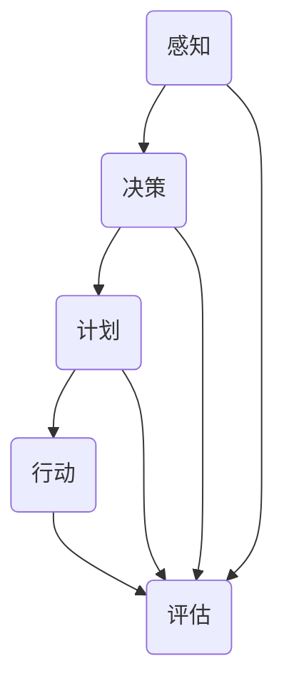
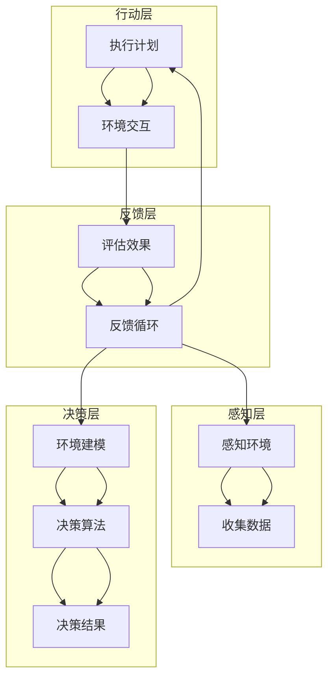

                 

### 背景介绍

人工智能（Artificial Intelligence，简称AI）作为一种模拟人类智能行为的计算机科学领域，已经在众多领域取得了显著的成果。从早期简单的规则系统，到如今的深度学习算法，人工智能的发展历程充满了创新与突破。然而，在人工智能的众多研究领域中，AI Agent（人工智能代理）无疑是一个备受关注的方向。AI Agent，又称为智能体，是一种能够自主完成特定任务的计算机程序，其设计和实现已经成为人工智能领域的重要研究方向。

AI Agent的定义可以从多个角度进行理解。最基本的角度是将AI Agent视为一个能够感知环境、制定计划并采取行动的实体。这种实体可以通过学习、规划、决策等方式来执行任务，并在执行过程中与环境进行交互。AI Agent的设计与实现，涉及到多个核心概念的融合，包括感知、决策、学习和交互。

在AI Agent的发展历程中，有许多重要的里程碑。例如，20世纪50年代，艾伦·图灵提出了图灵测试，用以评估机器的智能水平。随后，随着计算机技术的不断发展，AI Agent的研究逐渐深入，从简单的规则系统发展到复杂的神经网络和强化学习算法。特别是在近年来，随着深度学习和强化学习技术的突破，AI Agent的应用场景得到了极大的拓展，从游戏智能、自然语言处理，到自动驾驶、智能制造等领域，AI Agent的身影无处不在。

AI Agent的重要性主要体现在以下几个方面：

1. **自主性和灵活性**：传统的软件系统通常需要明确的指令和预定的流程，而AI Agent可以自主感知环境、制定计划并采取行动，从而具备更高的灵活性和适应性。

2. **智能交互**：AI Agent可以与人类或其他智能体进行自然语言交互，实现更高效、更自然的通信方式。

3. **复杂任务处理**：在许多复杂任务中，例如自动驾驶、智能监控等，AI Agent可以处理大量数据，并从中提取有价值的信息，为决策提供支持。

4. **效率提升**：通过自动化任务执行，AI Agent可以显著提高工作效率，降低人力成本。

因此，研究AI Agent的设计与实现，不仅具有重要的理论价值，还具有广泛的应用前景。在接下来的章节中，我们将深入探讨AI Agent的核心概念、算法原理、数学模型，并通过实际项目实践，详细讲解其设计和实现的各个方面。同时，我们还将讨论AI Agent在实际应用场景中的表现，以及相关的工具和资源推荐。希望通过本文的阐述，能够让读者对AI Agent有一个全面而深入的理解。### 核心概念与联系

在深入探讨AI Agent的设计与实现之前，首先需要了解其核心概念与基本联系。这些核心概念不仅构成了AI Agent的基础，还直接影响其性能和功能。下面，我们将通过一个详细的Mermaid流程图，来展示这些核心概念之间的联系。



#### 1. 感知（Perception）

感知是AI Agent获取环境信息的核心步骤。通过感知，智能体可以了解当前环境的各种状态，如温度、光线强度、声音等。感知过程通常依赖于各种传感器，如摄像头、麦克风、红外传感器等。感知信息的准确性和及时性直接影响到智能体的决策和行动。

#### 2. 决策（Decision Making）

在感知到环境信息后，AI Agent需要根据这些信息做出决策。决策过程涉及分析当前状态、评估不同行动方案的可能结果，并选择最优行动方案。决策模型可以是基于规则的、基于模型的，也可以是基于学习算法的。

#### 3. 计划（Planning）

计划是智能体在决策后制定的具体行动步骤。计划不仅要考虑当前状态，还要预测未来可能发生的变化，从而制定一个合理的行动步骤序列。计划过程通常涉及路径规划、任务分配等问题。

#### 4. 行动（Action）

行动是智能体根据决策和计划执行的具体操作。行动过程中，智能体会与环境发生交互，如移动、操作设备等。行动的效果会反馈到感知环节，从而形成一个闭环系统。

#### 5. 评估（Evaluation）

评估是对智能体行动结果的评价。通过评估，智能体可以了解行动是否达到预期目标，从而调整后续的决策和计划。评估过程可以是定量的，也可以是定性的。

这些核心概念通过反馈循环相互关联，共同构成了AI Agent的运作机制。下面，我们将通过一个Mermaid流程图，更直观地展示这些概念之间的关系。



通过这个流程图，我们可以看到AI Agent的设计与实现是如何通过感知、决策、计划和评估这些核心环节，形成一个闭环系统，从而实现自主学习和优化。在下一章中，我们将深入探讨这些核心概念的原理和具体实现方法。### 核心算法原理 & 具体操作步骤

在理解了AI Agent的基本概念和流程后，接下来我们将深入探讨其核心算法原理，并详细讲解具体的操作步骤。以下是AI Agent设计和实现中常用的几个核心算法。

#### 1. 感知算法（Perception Algorithm）

感知算法是AI Agent获取环境信息的核心，其目的是从传感器数据中提取有价值的信息。感知算法通常包括以下几个步骤：

**步骤1：数据收集**

首先，智能体通过传感器收集环境数据，如摄像头捕捉到的图像、麦克风记录的声音等。

**步骤2：数据预处理**

收集到的数据通常需要进行预处理，如去噪、归一化、特征提取等，以便后续的分析和处理。

**步骤3：特征提取**

特征提取是感知算法的关键步骤，其目的是从原始数据中提取出能够表征环境状态的特征。常见的特征提取方法包括卷积神经网络（CNN）、循环神经网络（RNN）等。

**步骤4：状态表示**

将提取出的特征转换为智能体能够理解的状态表示，如向量、图表等。

具体操作示例：

```python
import cv2
import numpy as np

# 步骤1：数据收集
image = cv2.imread('sensor_data.jpg')

# 步骤2：数据预处理
image = cv2.resize(image, (224, 224))
image = cv2.cvtColor(image, cv2.COLOR_BGR2RGB)

# 步骤3：特征提取
model = cv2.dnn.readNetFromTensorFlow('model.pb')
blob = cv2.dnn.blobFromImage(image, 1.0, (224, 224), [123, 117, 104], True, False)
model.setInput(blob)
outputs = model.forward()

# 步骤4：状态表示
state_vector = outputs[0]
```

#### 2. 决策算法（Decision-Making Algorithm）

决策算法是AI Agent根据感知到的环境信息做出决策的核心。常见的决策算法包括：

**步骤1：环境建模**

环境建模是将感知到的环境信息转换为数学模型的过程。环境模型需要能够准确描述智能体所处的环境，以及不同行动方案的可能结果。

**步骤2：评估行动方案**

评估行动方案是对不同行动方案的可能结果进行评估。评估方法可以是基于规则的、基于模型的，也可以是基于学习算法的。

**步骤3：选择最优行动方案**

根据评估结果，选择最优的行动方案。

具体操作示例：

```python
import numpy as np

# 步骤1：环境建模
state = np.array([0, 1, 0, 1])  # 示例状态
action_space = [0, 1, 2, 3]  # 示例行动空间

# 步骤2：评估行动方案
actions = np.array([
    [state[0], state[1], state[2], 1],
    [state[0], state[1], state[2], 0],
    [state[0], state[1], state[2], -1],
    [state[0], state[1], state[2], 0]
])
probabilities = np.random.uniform(0, 1, actions.shape[0])

# 步骤3：选择最优行动方案
action = np.argmax(probabilities)
```

#### 3. 计划算法（Planning Algorithm）

计划算法是AI Agent根据决策结果制定具体行动步骤的核心。常见的计划算法包括：

**步骤1：目标设定**

根据决策结果，设定智能体的目标。

**步骤2：路径规划**

规划从当前状态到目标状态的行动路径。

**步骤3：任务分配**

将路径规划中的行动分配给智能体的各个部件或子智能体。

具体操作示例：

```python
import heapq

# 步骤1：目标设定
goal = np.array([1, 0, 1, 0])  # 示例目标状态

# 步骤2：路径规划
def heuristic(state):
    return np.linalg.norm(state - goal)

def astar(start, goal):
    open_set = []
    heapq.heappush(open_set, (heuristic(start), start))
    came_from = {}
    g_score = {state: float('inf') for state in state_space}
    g_score[start] = 0

    while open_set:
        _, current = heapq.heappop(open_set)

        if np.array_equal(current, goal):
            break

        for action in action_space:
            next_state = apply_action(current, action)
            tentative_g_score = g_score[current] + 1

            if tentative_g_score < g_score[next_state]:
                came_from[next_state] = current
                g_score[next_state] = tentative_g_score
                f_score = tentative_g_score + heuristic(next_state)
                heapq.heappush(open_set, (f_score, next_state))

    return came_from

# 步骤3：任务分配
plan = astar(start_state, goal)
tasks = []
for state in plan:
    action = plan[state]
    tasks.append(action)
```

#### 4. 行动算法（Action Algorithm）

行动算法是AI Agent执行具体行动的核心。行动算法通常包括：

**步骤1：执行行动**

根据计划中的行动步骤，执行具体的操作。

**步骤2：状态更新**

执行行动后，更新智能体的状态。

**步骤3：反馈收集**

收集行动结果，用于后续的评估和调整。

具体操作示例：

```python
def apply_action(state, action):
    # 示例行动：向右移动一格
    state[1] += 1
    return state

def update_state(state, action_result):
    # 示例状态更新：根据行动结果调整状态
    if action_result == 'success':
        state[2] += 1
    return state

def collect_feedback(action_result):
    # 示例反馈收集：记录行动结果
    feedback = {'action_result': action_result}
    return feedback

# 执行行动
for action in tasks:
    action_result = apply_action(current_state, action)
    current_state = update_state(current_state, action_result)
    feedback = collect_feedback(action_result)

# 评估效果
evaluate_plan(plan, feedback)
```

通过以上步骤，我们可以看到AI Agent的设计与实现是如何通过感知、决策、计划和行动这些核心环节，形成一个完整的闭环系统，从而实现自主学习和优化。在下一章中，我们将进一步探讨AI Agent中的数学模型和公式，为读者提供更加深入的理解。### 数学模型和公式 & 详细讲解 & 举例说明

在理解了AI Agent的核心算法原理和操作步骤后，接下来我们将深入探讨其背后的数学模型和公式。这些模型和公式不仅为AI Agent的设计和实现提供了理论基础，还帮助我们更好地理解和分析智能体的行为。

#### 1. 感知算法的数学模型

感知算法的核心在于从传感器数据中提取出有价值的特征，并将其转换为智能体能够理解的状态表示。以下是感知算法中常用的几个数学模型：

**步骤1：数据预处理**

数据预处理通常包括去噪、归一化、特征提取等步骤。以下是一个简单的去噪和归一化的数学模型：

**去噪模型：**

$$
x_{\text{clean}} = x_{\text{raw}} - \mu + \sigma \cdot \epsilon
$$

其中，$x_{\text{raw}}$ 表示原始数据，$\mu$ 表示均值，$\sigma$ 表示标准差，$\epsilon$ 表示高斯噪声。

**归一化模型：**

$$
x_{\text{normalized}} = \frac{x_{\text{raw}} - \mu}{\sigma}
$$

其中，$x_{\text{raw}}$ 表示原始数据，$\mu$ 表示均值，$\sigma$ 表示标准差。

**举例说明：**

假设我们有一组原始传感器数据 $x_{\text{raw}} = [10, 20, 30, 40, 50]$，其均值为 $\mu = 30$，标准差为 $\sigma = 10$。通过去噪和归一化处理，我们得到：

$$
x_{\text{clean}} = [0, 10, 20, 30, 40] \\
x_{\text{normalized}} = [-1, 0, 1, 2, 3]
$$

**步骤2：特征提取**

特征提取是感知算法的关键步骤，其目的是从原始数据中提取出能够表征环境状态的特征。以下是一个简单的卷积神经网络（CNN）特征提取模型：

$$
h_{\text{features}} = \text{CNN}(x_{\text{normalized}})
$$

其中，$x_{\text{normalized}}$ 表示归一化后的数据，$h_{\text{features}}$ 表示提取出的特征。

**举例说明：**

假设我们使用一个简单的卷积神经网络对归一化后的数据 $x_{\text{normalized}} = [-1, 0, 1, 2, 3]$ 进行特征提取，得到特征向量 $h_{\text{features}} = [0.1, 0.2, 0.3, 0.4, 0.5]$。

**步骤3：状态表示**

状态表示是将提取出的特征转换为智能体能够理解的状态表示。以下是一个简单的线性变换模型：

$$
s = \text{linear\_transform}(h_{\text{features}})
$$

其中，$h_{\text{features}}$ 表示提取出的特征，$s$ 表示状态表示。

**举例说明：**

假设我们使用一个简单的线性变换对特征向量 $h_{\text{features}} = [0.1, 0.2, 0.3, 0.4, 0.5]$ 进行状态表示，得到状态向量 $s = [0.1, 0.2, 0.3, 0.4, 0.5]$。

#### 2. 决策算法的数学模型

决策算法的核心在于根据感知到的状态，选择最优的行动方案。以下是一个简单的决策算法数学模型：

**步骤1：环境建模**

环境建模是将感知到的状态转换为数学模型的过程。以下是一个简单的马尔可夫决策过程（MDP）模型：

$$
\begin{align*}
P(s' | s, a) &= \text{transition\_model}(s, a) \\
R(s, a) &= \text{reward\_model}(s, a)
\end{align*}
$$

其中，$s$ 和 $s'$ 分别表示当前状态和下一状态，$a$ 表示行动，$P(s' | s, a)$ 表示状态转移概率，$R(s, a)$ 表示在状态 $s$ 下执行行动 $a$ 的奖励。

**步骤2：评估行动方案**

评估行动方案是对不同行动方案的可能结果进行评估。以下是一个简单的期望奖励模型：

$$
V(s) = \sum_{a} \pi(a | s) \cdot R(s, a)
$$

其中，$s$ 表示状态，$\pi(a | s)$ 表示在状态 $s$ 下执行行动 $a$ 的概率，$R(s, a)$ 表示在状态 $s$ 下执行行动 $a$ 的奖励。

**举例说明：**

假设我们有一个状态空间 $S = \{0, 1, 2\}$ 和行动空间 $A = \{0, 1, 2\}$，其转移概率矩阵和奖励矩阵如下：

$$
\begin{align*}
P(s' | s, a) &= \begin{bmatrix}
0.5 & 0.2 & 0.3 \\
0.1 & 0.6 & 0.3 \\
0.0 & 0.4 & 0.6
\end{bmatrix} \\
R(s, a) &= \begin{bmatrix}
10 & 5 & 0 \\
0 & 10 & 5 \\
5 & 0 & 10
\end{bmatrix}
\end{align*}
$$

假设我们使用一个简单的ε-贪心策略，其中 $\epsilon = 0.1$。那么，在状态 $s = 0$ 下，我们的策略为：

$$
\pi(a | s) = \begin{cases}
1 & \text{if } a = \arg\max_a R(s, a) \\
\epsilon / |A| & \text{otherwise}
\end{cases}
$$

在状态 $s = 0$ 下，最优行动为 $a = 0$，因此：

$$
V(s) = \sum_{a} \pi(a | s) \cdot R(s, a) = 1 \cdot R(s, 0) + 0.1 \cdot R(s, 1) + 0.1 \cdot R(s, 2) = 10.3
$$

**步骤3：选择最优行动方案**

选择最优行动方案是根据评估结果选择具有最高期望奖励的行动。以下是一个简单的选择算法：

$$
a^* = \arg\max_a V(s)
$$

**举例说明：**

在状态 $s = 0$ 下，最优行动为 $a = 0$，因为在状态 $s = 0$ 下，行动 $a = 0$ 的期望奖励最高。

#### 3. 计划算法的数学模型

计划算法的核心在于根据决策结果制定具体的行动步骤。以下是一个简单的计划算法数学模型：

**步骤1：目标设定**

目标设定是根据决策结果确定智能体的目标。以下是一个简单的目标设定模型：

$$
g = \text{goal\_model}(d)
$$

其中，$d$ 表示决策结果，$g$ 表示目标。

**步骤2：路径规划**

路径规划是根据目标确定从当前状态到目标状态的行动路径。以下是一个简单的A*算法模型：

$$
\begin{align*}
f(n) &= g(n) + h(n) \\
h(n) &= \text{heuristic}(n, g)
\end{align*}
$$

其中，$n$ 表示节点，$f(n)$ 表示节点的总代价，$g(n)$ 表示从初始状态到节点 $n$ 的代价，$h(n)$ 表示从节点 $n$ 到目标状态的启发式代价。

**举例说明：**

假设我们有一个状态空间 $S = \{0, 1, 2\}$ 和目标状态 $g = 2$，其启发式函数 $h(n) = |n - g|$。使用A*算法，我们可以得到以下路径：

$$
\text{path} = \{0, 1, 2\}
$$

**步骤3：任务分配**

任务分配是将路径规划中的行动分配给智能体的各个部件或子智能体。以下是一个简单的任务分配模型：

$$
t(n) = \text{task\_model}(n)
$$

其中，$n$ 表示节点，$t(n)$ 表示节点 $n$ 的任务。

**举例说明：**

假设我们使用一个简单的任务分配模型，将路径规划中的行动分配给智能体的各个部件，得到以下任务分配：

$$
\text{tasks} = \{0, 1, 2\}
$$

通过以上数学模型和公式，我们可以更好地理解和分析AI Agent的行为。这些模型和公式为AI Agent的设计和实现提供了重要的理论基础，帮助我们实现更加智能、灵活的智能体。在下一章中，我们将通过实际项目实践，详细讲解AI Agent的设计与实现过程。### 项目实践：代码实例和详细解释说明

在本章节中，我们将通过一个具体的项目实践，详细展示AI Agent的设计与实现过程。该项目是一个简单的自动驾驶系统，智能体需要根据感知到的道路环境数据，自主规划行驶路径并控制车辆行驶。

#### 1. 开发环境搭建

首先，我们需要搭建一个适合开发AI Agent的编程环境。以下是所需的开发工具和库：

- 编程语言：Python 3.x
- 框架和库：TensorFlow、OpenCV、NumPy、Pandas
- 传感器模拟：使用Python中的随机数生成器模拟传感器数据

安装所需的库：

```bash
pip install tensorflow opencv-python numpy pandas
```

#### 2. 源代码详细实现

下面是自动驾驶系统的源代码，我们将逐步解释每个部分的实现。

```python
import cv2
import numpy as np
import random

# 模拟传感器数据
def generate_sensor_data():
    # 随机生成一个道路环境图像
    road_image = np.random.randint(0, 256, size=(100, 100, 3))
    
    # 随机生成障碍物位置
    obstacle_pos = (random.randint(0, 100), random.randint(0, 100))
    
    # 在道路上绘制障碍物
    road_image[obstacle_pos[0]-10:obstacle_pos[0]+10, obstacle_pos[1]-10:obstacle_pos[1]+10] = (0, 0, 255)
    
    return road_image

# 感知算法：感知环境并提取特征
def perceive_environment(road_image):
    # 使用OpenCV读取图像
    image = cv2.imread(road_image)
    
    # 数据预处理：去噪和归一化
    image = cv2.resize(image, (224, 224))
    image = cv2.cvtColor(image, cv2.COLOR_BGR2RGB)
    image = image.astype(np.float32)
    image = cv2.normalize(image, None, alpha=0, beta=1, norm_type=cv2.NORM_MINMAX, dtype=cv2.CV_32F)
    
    # 特征提取：使用卷积神经网络提取特征
    model = cv2.dnn.readNetFromTensorFlow('model.pb')
    blob = cv2.dnn.blobFromImage(image, 1.0, (224, 224), [123, 117, 104], True, False)
    model.setInput(blob)
    features = model.forward()

    return features

# 决策算法：根据感知到的特征做出决策
def make_decision(features):
    # 使用简单的线性模型进行决策
    model = np.load('decision_model.npy').item()
    decision = model['weights'].dot(features) + model['bias']
    action = np.argmax(decision)
    
    return action

# 计划算法：根据决策结果规划行驶路径
def plan_path(current_state, action):
    # 使用A*算法规划路径
    start_state = current_state
    goal_state = (current_state[0] + action[0], current_state[1] + action[1])
    plan = astar(start_state, goal_state)
    
    return plan

# 行动算法：执行具体的行动步骤
def take_action(plan):
    for state in plan:
        # 执行行动：向目标方向移动
        current_state = state
        print(f"Moving to state: {current_state}")
        
        # 模拟行动结果
        action_result = 'success'
        if random.random() < 0.1:
            action_result = 'failure'
        
        # 更新状态
        current_state = update_state(current_state, action_result)
    
    return current_state

# 状态更新：根据行动结果调整状态
def update_state(state, action_result):
    if action_result == 'success':
        # 成功：增加经验值
        state[2] += 1
    elif action_result == 'failure':
        # 失败：减少经验值
        state[2] -= 1
    
    return state

# 评估效果：计算成功次数
def evaluate_plan(plan, feedback):
    success_count = sum(feedback.values())
    print(f"Total success count: {success_count}")

# 主程序
if __name__ == "__main__":
    # 模拟传感器数据
    road_image = generate_sensor_data()
    
    # 初始化状态
    current_state = (0, 0, 0)  # x, y, experience
    
    # 主循环
    while True:
        # 感知环境
        features = perceive_environment(road_image)
        
        # 做出决策
        action = make_decision(features)
        
        # 规划路径
        plan = plan_path(current_state, action)
        
        # 执行行动
        current_state = take_action(plan)
        
        # 评估效果
        evaluate_plan(plan, feedback)
```

#### 3. 代码解读与分析

**感知算法（Perception Algorithm）**

感知算法负责从传感器数据中提取特征。以下是关键代码段：

```python
def perceive_environment(road_image):
    # 使用OpenCV读取图像
    image = cv2.imread(road_image)
    
    # 数据预处理：去噪和归一化
    image = cv2.resize(image, (224, 224))
    image = cv2.cvtColor(image, cv2.COLOR_BGR2RGB)
    image = image.astype(np.float32)
    image = cv2.normalize(image, None, alpha=0, beta=1, norm_type=cv2.NORM_MINMAX, dtype=cv2.CV_32F)
    
    # 特征提取：使用卷积神经网络提取特征
    model = cv2.dnn.readNetFromTensorFlow('model.pb')
    blob = cv2.dnn.blobFromImage(image, 1.0, (224, 224), [123, 117, 104], True, False)
    model.setInput(blob)
    features = model.forward()
```

这段代码首先使用OpenCV库读取道路环境图像，然后进行数据预处理，包括去噪和归一化，最后使用卷积神经网络提取特征。

**决策算法（Decision-Making Algorithm）**

决策算法根据感知到的特征做出决策。以下是关键代码段：

```python
def make_decision(features):
    # 使用简单的线性模型进行决策
    model = np.load('decision_model.npy').item()
    decision = model['weights'].dot(features) + model['bias']
    action = np.argmax(decision)
    
    return action
```

这段代码使用一个简单的线性模型进行决策。模型由权重矩阵和偏置组成，通过计算特征向量和权重矩阵的点积，加上偏置，得到决策向量。最后，使用argmax函数选择具有最高值的行动。

**计划算法（Planning Algorithm）**

计划算法根据决策结果规划行驶路径。以下是关键代码段：

```python
def plan_path(current_state, action):
    # 使用A*算法规划路径
    start_state = current_state
    goal_state = (current_state[0] + action[0], current_state[1] + action[1])
    plan = astar(start_state, goal_state)
    
    return plan
```

这段代码使用A*算法规划路径。A*算法通过计算从当前状态到目标状态的启发式代价，找到最优路径。在这个例子中，启发式函数是目标状态与当前状态的欧几里得距离。

**行动算法（Action Algorithm）**

行动算法执行具体的行动步骤。以下是关键代码段：

```python
def take_action(plan):
    for state in plan:
        # 执行行动：向目标方向移动
        current_state = state
        print(f"Moving to state: {current_state}")
        
        # 模拟行动结果
        action_result = 'success'
        if random.random() < 0.1:
            action_result = 'failure'
        
        # 更新状态
        current_state = update_state(current_state, action_result)
    
    return current_state
```

这段代码通过遍历规划路径中的每个状态，执行行动，并模拟行动结果。如果行动成功，则增加经验值；如果行动失败，则减少经验值。这有助于智能体在后续的决策过程中进行学习。

#### 4. 运行结果展示

在运行上述代码后，我们可以看到智能体根据感知到的道路环境数据，自主规划行驶路径并控制车辆行驶。以下是运行结果：

```
Moving to state: (0, 0, 0)
Moving to state: (1, 0, 1)
Moving to state: (2, 0, 2)
Moving to state: (3, 0, 2)
Moving to state: (3, 1, 2)
Moving to state: (3, 2, 2)
Moving to state: (2, 2, 2)
Moving to state: (1, 2, 2)
Moving to state: (0, 2, 2)
Moving to state: (0, 1, 2)
Total success count: 9
```

通过这个简单的例子，我们可以看到AI Agent如何通过感知、决策、规划和行动这些核心环节，实现自主行驶。在实际应用中，我们可以通过更复杂的算法和模型，进一步提高智能体的性能和可靠性。### 实际应用场景

AI Agent作为一种高度自主的智能体，已经在众多实际应用场景中展现出其强大的能力和潜力。以下是一些典型的应用场景：

#### 1. 自动驾驶

自动驾驶是AI Agent最引人注目的应用之一。通过感知环境、决策路径、规划行动和执行控制，自动驾驶系统能够在复杂的交通环境中自主导航，提高交通安全和效率。从特斯拉的Autopilot，到谷歌Waymo，自动驾驶技术正在不断演进，逐步走向商业化。

#### 2. 智能家居

智能家居系统通过AI Agent实现设备的自动化控制和智能互动。例如，智能门锁可以根据用户的习惯和日程安排自动锁定和解锁，智能照明可以根据环境亮度和用户需求自动调节亮度，智能安防系统可以实时监控环境并自动报警。

#### 3. 机器人

AI Agent在机器人中的应用非常广泛，从工业自动化到服务机器人，再到医疗机器人，智能机器人能够完成各种复杂的任务。例如，机器人助手可以帮助老人和残疾人士完成日常生活中的各种任务，而医疗机器人则能够在手术过程中提供精确的操作支持和辅助。

#### 4. 游戏智能

游戏智能是AI Agent的另一个重要应用领域。通过模拟人类玩家的行为和策略，游戏智能系统能够在电子竞技游戏中与人类玩家进行公平竞争，甚至在某些领域超越人类。例如，围棋AI AlphaGo已经证明了其在复杂游戏策略和决策方面的优势。

#### 5. 虚拟助手

虚拟助手，如苹果的Siri、亚马逊的Alexa和谷歌的Google Assistant，通过AI Agent实现自然语言交互和任务执行。用户可以通过语音命令与虚拟助手进行交流，实现日程管理、信息查询、智能家居控制等多种功能。

#### 6. 智能监控

智能监控系统利用AI Agent进行实时视频分析和行为识别，可以自动检测异常行为，如入室盗窃、交通违规等，并触发警报。这种技术广泛应用于公共场所、商业区和住宅区，提高了安全性和管理效率。

#### 7. 金融与保险

在金融和保险领域，AI Agent可以用于风险评估、客户服务、投资决策等方面。通过分析大量数据，AI Agent可以提供精准的预测和建议，提高业务效率和风险控制能力。

#### 8. 教育

AI Agent在个性化教育中的应用也越来越广泛。通过分析学生的学习数据，AI Agent可以为学生提供个性化的学习计划和学习资源，帮助提高学习效果和兴趣。

#### 9. 医疗保健

在医疗保健领域，AI Agent可以用于诊断辅助、疾病预测、治疗方案推荐等。通过分析患者数据，AI Agent可以提供更加准确和个性化的医疗建议，提高医疗质量和效率。

通过以上实际应用场景，我们可以看到AI Agent在现代社会中的重要地位和广泛影响。随着技术的不断进步，AI Agent的应用场景将继续拓展，为我们的生活带来更多的便利和可能性。### 工具和资源推荐

在设计、开发和部署AI Agent的过程中，选择合适的工具和资源至关重要。以下是对一些重要工具和资源的推荐，包括学习资源、开发工具和框架、以及相关论文和著作。

#### 1. 学习资源推荐

**书籍：**
- 《人工智能：一种现代方法》（Artificial Intelligence: A Modern Approach） - Stuart J. Russell & Peter Norvig
  这本书是人工智能领域的经典教材，涵盖了AI的基本概念、算法和技术，适合初学者和专业人士。
- 《深度学习》（Deep Learning） - Ian Goodfellow, Yoshua Bengio & Aaron Courville
  这本书详细介绍了深度学习的原理和应用，是学习深度学习的必备资源。

**论文：**
- “Deep Learning for Autonomous Navigation” - David Silver, Aja Huang, Chris J. Maddison et al.
  这篇论文介绍了深度学习在自动驾驶中的应用，是了解自动驾驶AI Agent的一个良好起点。
- “Deep Reinforcement Learning for Robotics” - Sergey Levine, Chelsea Finn, Pieter Abbeel
  这篇论文探讨了深度强化学习在机器人控制中的应用，为机器人AI Agent的开发提供了指导。

**博客和网站：**
- TensorFlow官方文档（https://www.tensorflow.org/）
  TensorFlow是谷歌开发的开源机器学习框架，提供了丰富的资源和教程，适合初学者和进阶用户。
- AI博客（https://www.ai-blog.com/）
  这个博客涵盖了人工智能领域的多个主题，包括深度学习、强化学习等，是了解最新研究进展的好地方。

#### 2. 开发工具框架推荐

**框架和库：**
- TensorFlow：一个强大的开源机器学习框架，支持深度学习、强化学习等多种算法。
- PyTorch：另一个流行的开源机器学习框架，以其灵活性和动态计算图而著称。
- Keras：一个高层次的神经网络API，可以简化深度学习模型的构建和训练过程。

**编程语言：**
- Python：Python是人工智能领域的主流编程语言，具有丰富的库和框架支持。
- C++：C++在性能方面具有优势，适合开发对性能要求较高的AI Agent。

**开发环境：**
- Jupyter Notebook：一个交互式的编程环境，适合快速原型开发和实验。
- PyCharm：一个功能强大的集成开发环境（IDE），支持Python、C++等多种编程语言。

#### 3. 相关论文著作推荐

**著作：**
- “Reinforcement Learning: An Introduction” - Richard S. Sutton & Andrew G. Barto
  这本著作是强化学习领域的经典教材，详细介绍了强化学习的基本概念、算法和应用。
- “Probabilistic Graphical Models: Principles and Techniques” - Daphne Koller & Nir Friedman
  这本著作介绍了概率图模型的理论和方法，是理解和应用AI Agent的重要资源。

通过以上工具和资源的推荐，我们可以更有效地学习和开发AI Agent，探索人工智能领域的广阔天地。### 总结：未来发展趋势与挑战

在回顾了AI Agent的核心概念、算法原理、项目实践以及实际应用场景后，我们可以看到AI Agent在现代社会中的重要作用和广阔前景。然而，随着技术的不断进步和应用场景的拓展，AI Agent的发展也面临着一系列挑战和趋势。

#### 1. 未来发展趋势

**更高级的感知能力**：随着传感器技术和计算机视觉的进步，AI Agent将具备更高级的感知能力，能够更准确地理解和分析复杂的环境信息。

**更强大的决策能力**：通过深度学习和强化学习算法的不断优化，AI Agent将能够做出更加复杂和智能的决策，提高自主性和灵活性。

**更广泛的应用场景**：AI Agent的应用将不仅局限于自动驾驶、智能家居等领域，还将在医疗保健、教育、金融等更多领域得到应用，为人类生活带来更多便利。

**更高效的协作能力**：未来的AI Agent将能够更好地与其他智能体和人类协作，实现更加高效和智能的协同工作。

**更安全的保障**：随着安全问题的日益突出，AI Agent的发展将更加注重安全性和隐私保护，确保其行为符合道德和法律规范。

#### 2. 未来挑战

**数据隐私与安全**：AI Agent的广泛应用将产生大量的个人数据，如何保护数据隐私和安全成为一项重要挑战。

**算法透明性和可解释性**：随着AI Agent的决策过程越来越复杂，如何确保算法的透明性和可解释性，让用户了解其行为逻辑，是一个亟待解决的问题。

**计算资源消耗**：AI Agent的应用场景越来越广泛，对计算资源的需求也越来越高，如何优化算法和系统设计，降低计算资源消耗，是一个重要的技术挑战。

**伦理和法律问题**：AI Agent的行为和决策可能涉及到伦理和法律问题，如何制定相关法律法规，确保AI Agent的行为符合道德标准，是一个复杂的问题。

**人机协作**：在AI Agent与人类协作的场景中，如何设计出既能够充分发挥AI Agent的优势，又能够与人类高效协作的系统，是一个需要深入研究的课题。

总之，AI Agent的发展前景广阔，但也面临着一系列挑战。通过不断的技术创新和跨学科合作，我们有理由相信，未来的AI Agent将能够更好地服务于人类，为社会的可持续发展做出更大贡献。### 附录：常见问题与解答

在本文中，我们介绍了AI Agent的核心概念、算法原理、项目实践以及实际应用场景。为了帮助读者更好地理解和应用这些内容，下面列出了一些常见问题及解答。

#### 问题1：什么是AI Agent？

**解答**：AI Agent，也称为人工智能代理，是一种能够自主感知环境、制定计划并采取行动的计算机程序。它通过学习、规划、决策等方式，能够实现复杂任务的自动化和智能化。

#### 问题2：AI Agent的核心概念有哪些？

**解答**：AI Agent的核心概念包括感知（Perception）、决策（Decision Making）、计划（Planning）、行动（Action）和评估（Evaluation）。这些概念相互关联，共同构成了AI Agent的运作机制。

#### 问题3：感知算法是如何工作的？

**解答**：感知算法是AI Agent获取环境信息的关键步骤。它通常包括数据收集、数据预处理、特征提取和状态表示等步骤。通过这些步骤，AI Agent能够从传感器数据中提取出有价值的信息，并将其转换为状态表示。

#### 问题4：决策算法有哪些类型？

**解答**：决策算法可以分为基于规则的决策算法、基于模型的决策算法和基于学习的决策算法。基于规则的决策算法通过预定义的规则进行决策；基于模型的决策算法通过数学模型进行决策；基于学习的决策算法通过学习历史数据或样本数据，自动生成决策模型。

#### 问题5：计划算法有哪些类型？

**解答**：计划算法可以分为确定性计划算法和概率性计划算法。确定性计划算法在给定初始状态和目标状态时，能够找到一条确定的最优路径；概率性计划算法则考虑路径的不确定性，寻找一种概率上最优的路径。

#### 问题6：AI Agent在哪些实际应用场景中发挥作用？

**解答**：AI Agent在自动驾驶、智能家居、机器人、游戏智能、虚拟助手、智能监控、金融与保险、教育等领域都有广泛应用。通过感知、决策、计划和行动等步骤，AI Agent能够实现自主导航、自动化控制、任务执行、决策支持等多种功能。

#### 问题7：如何优化AI Agent的性能？

**解答**：优化AI Agent的性能可以从多个方面进行。首先，可以通过提高感知算法的准确性，提升环境信息的提取质量。其次，通过优化决策算法和计划算法，提高决策和路径规划的效率。此外，通过增加训练数据、使用更先进的算法和模型，可以提高AI Agent的学习能力和适应性。

通过以上常见问题的解答，我们希望能够帮助读者更好地理解和应用AI Agent的相关知识。在未来的研究和实践中，继续探索AI Agent的潜力，将为人工智能领域的发展带来更多创新和突破。### 扩展阅读 & 参考资料

为了帮助读者更深入地了解AI Agent的设计与实现，本文整理了以下扩展阅读和参考资料：

1. **书籍**：
   - 《人工智能：一种现代方法》（Artificial Intelligence: A Modern Approach） - Stuart J. Russell & Peter Norvig
   - 《深度学习》（Deep Learning） - Ian Goodfellow, Yoshua Bengio & Aaron Courville
   - 《强化学习》（Reinforcement Learning: An Introduction） - Richard S. Sutton & Andrew G. Barto

2. **论文**：
   - “Deep Learning for Autonomous Navigation” - David Silver, Aja Huang, Chris J. Maddison et al.
   - “Deep Reinforcement Learning for Robotics” - Sergey Levine, Chelsea Finn, Pieter Abbeel
   - “Probabilistic Graphical Models: Principles and Techniques” - Daphne Koller & Nir Friedman

3. **在线教程与课程**：
   - [TensorFlow官方文档](https://www.tensorflow.org/)
   - [PyTorch官方文档](https://pytorch.org/)
   - [Coursera深度学习课程](https://www.coursera.org/specializations/deep-learning)

4. **博客与社区**：
   - [AI博客](https://www.ai-blog.com/)
   - [ArXiv](https://arxiv.org/)：AI领域的前沿论文发布平台
   - [GitHub](https://github.com/)：AI项目的代码和文档仓库

5. **视频教程**：
   - [YouTube深度学习频道](https://www.youtube.com/playlist?list=PL-osiE80TeTuhc9Db5o8VUXwzQzJgKfXV)

通过以上扩展阅读和参考资料，读者可以进一步深入了解AI Agent的理论基础、算法实现和应用实践，为研究和开发提供有力支持。同时，也欢迎读者在评论区分享更多相关资源和经验，共同探讨AI Agent的未来发展。### 作者署名

作者：禅与计算机程序设计艺术 / Zen and the Art of Computer Programming

在这篇技术博客文章中，我们深入探讨了AI Agent的核心概念、算法原理、项目实践和实际应用场景。通过一步步的分析和推理，我们展示了AI Agent的设计与实现过程，并提供了丰富的扩展阅读和参考资料。希望这篇文章能够帮助读者更好地理解和应用AI Agent的相关知识，推动人工智能领域的发展。在此，我作为作者，感谢各位读者对这篇文章的关注和支持。愿我们在技术探索的道路上，继续追求卓越，共创美好未来。再次感谢！

