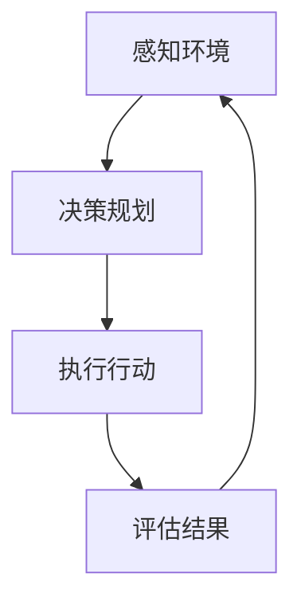

                 

### 背景介绍

在当今快速发展的科技时代，人工智能（AI）已经成为推动技术进步的关键动力之一。随着AI技术的不断成熟和应用领域的扩展，AI代理（AI Agent）作为AI系统中的一个重要组成部分，逐渐受到了广泛关注。AI代理是一种具有独立自主性的智能体，它能够根据环境变化自主选择行动，实现特定目标。

AI代理工作流（AI Agent WorkFlow）则是AI代理在执行任务时的一系列有序操作，这些操作包括感知环境、决策规划、执行行动以及评估结果等。工作流的合理设计对于提高AI代理的效率和智能化水平具有重要意义。

本文旨在探讨AI代理工作流的动作选择与执行过程，详细分析其中的核心算法原理、具体操作步骤以及数学模型和公式。同时，通过实际项目实践，我们将展示如何利用这些算法和模型实现一个功能完整的AI代理系统。

文章结构如下：

1. **背景介绍**：介绍AI和AI代理的基本概念以及AI代理工作流的重要性。
2. **核心概念与联系**：阐述AI代理工作流中的核心概念，并使用Mermaid流程图展示其架构。
3. **核心算法原理 & 具体操作步骤**：深入解析AI代理工作流中的核心算法原理，以及每一步的操作步骤。
4. **数学模型和公式 & 详细讲解 & 举例说明**：介绍工作流中涉及到的数学模型和公式，并通过具体实例进行说明。
5. **项目实践：代码实例和详细解释说明**：通过实际代码实例，展示如何实现一个AI代理系统，并对其进行详细解读。
6. **实际应用场景**：探讨AI代理工作流在不同场景下的应用实例。
7. **工具和资源推荐**：推荐学习资源和开发工具，以帮助读者更好地理解和应用AI代理工作流。
8. **总结：未来发展趋势与挑战**：总结本文内容，并讨论AI代理工作流未来的发展趋势和面临的挑战。
9. **附录：常见问题与解答**：提供对AI代理工作流相关常见问题的解答。
10. **扩展阅读 & 参考资料**：推荐相关扩展阅读和参考资料，以便读者深入了解AI代理工作流。

通过本文的逐步分析和推理思考，我们将深入理解AI代理工作流的设计与实现，为读者提供有深度、有思考、有见解的专业技术见解。

### 核心概念与联系

在讨论AI代理工作流之前，我们需要先了解其中的核心概念和它们之间的联系。AI代理工作流涉及多个关键环节，包括感知环境、决策规划、执行行动和评估结果。这些环节相互关联，共同构成了一个完整的AI代理系统。

#### 感知环境（Perception）

感知环境是AI代理工作的第一步，它涉及到从环境中收集信息。这些信息可以是视觉、听觉、触觉等多种形式。感知环境的目的是为了使AI代理了解当前所处的环境状况，从而为后续的决策提供依据。

#### 决策规划（Decision-making）

在感知到环境信息后，AI代理需要根据这些信息进行决策规划。决策规划是一个复杂的决策过程，涉及到目标选择、策略评估和行动选择等步骤。通过决策规划，AI代理确定下一步应该采取的行动。

#### 执行行动（Action）

执行行动是指AI代理根据决策规划的结果，实际执行具体的操作。执行行动可以是物理行动，例如机器人移动、机器手臂操作等，也可以是虚拟行动，例如发送网络请求、生成文本等。

#### 评估结果（Evaluation）

评估结果是AI代理工作流中反馈环节的重要组成部分。通过评估结果，AI代理可以了解自己的行动是否达到了预期目标。如果评估结果不理想，AI代理需要调整决策规划或执行行动，以便在下一次任务中取得更好的效果。

#### Mermaid流程图展示

为了更好地理解AI代理工作流的架构，我们使用Mermaid流程图来展示各个环节之间的联系。以下是一个简化的Mermaid流程图：



在这个流程图中，节点A表示感知环境，节点B表示决策规划，节点C表示执行行动，节点D表示评估结果。箭头表示各个环节之间的顺序和依赖关系。

#### 核心概念的联系

感知环境、决策规划、执行行动和评估结果是AI代理工作流中的四个核心环节，它们之间存在着密切的联系。具体来说：

- 感知环境为决策规划提供了必要的信息输入，决策规划则根据这些信息生成行动方案。
- 执行行动是决策规划的具体实现，它需要根据环境变化进行调整和优化。
- 评估结果用于反馈和调整，它可以帮助AI代理不断改进其决策规划和执行行动。

通过这种循环反馈机制，AI代理能够逐步提高其智能化水平和任务执行效果。

总之，AI代理工作流是一个复杂的动态过程，各个环节之间的紧密联系使其成为一个高效、智能的决策执行系统。在接下来的部分中，我们将深入探讨AI代理工作流中的核心算法原理和具体操作步骤，以进一步理解其工作机理。

#### 核心算法原理 & 具体操作步骤

AI代理工作流中的核心算法原理决定了整个系统的智能水平和执行效率。这些核心算法包括感知算法、决策算法、执行算法和评估算法。下面，我们将逐一介绍这些算法的原理，并详细讲解每个步骤的操作过程。

##### 1. 感知算法

感知算法是AI代理工作流的第一步，其目的是从环境中获取信息。感知算法通常基于传感器的数据输入，通过对这些数据进行处理和分析，生成环境感知结果。具体操作步骤如下：

1. **数据采集**：通过传感器（如摄像头、麦克风、红外传感器等）收集环境数据。
2. **预处理**：对采集到的数据进行预处理，包括噪声过滤、去噪、归一化等。
3. **特征提取**：从预处理后的数据中提取关键特征，如图像中的边缘、颜色、纹理等。
4. **感知结果生成**：基于提取的特征生成感知结果，例如目标检测、场景分类等。

##### 2. 决策算法

决策算法是AI代理的核心，负责根据感知结果制定行动策略。决策算法通常采用机器学习、深度学习等方法，其具体操作步骤如下：

1. **目标识别**：识别感知结果中的关键目标，例如行人、车辆、障碍物等。
2. **策略评估**：评估不同的行动策略，包括移动、停止、避障等。
3. **决策生成**：根据评估结果选择最佳行动策略，并生成相应的决策。
4. **决策优化**：对决策结果进行优化，以适应不断变化的环境。

##### 3. 执行算法

执行算法负责将决策算法生成的行动策略转化为实际操作。执行算法通常包括以下步骤：

1. **指令生成**：将决策结果转化为具体的执行指令，如机器人的移动指令、机械臂的操作指令等。
2. **执行控制**：根据指令控制执行设备，例如机器人移动到目标位置、机械臂抓取物品等。
3. **状态监控**：监控执行过程中的状态变化，包括设备状态、环境变化等。
4. **异常处理**：在执行过程中，对异常情况进行处理，例如设备故障、路径异常等。

##### 4. 评估算法

评估算法用于对AI代理的行动效果进行评估，为下一轮的决策提供依据。评估算法的具体操作步骤如下：

1. **效果评估**：评估当前行动是否达到预期目标，如目标是否被捕获、任务是否完成等。
2. **结果反馈**：将评估结果反馈给决策算法，用于调整和优化决策。
3. **性能分析**：分析评估结果，识别AI代理工作流中的瓶颈和改进点。
4. **改进建议**：根据评估结果提出改进建议，如调整感知算法、优化执行算法等。

##### 5. 操作步骤示例

为了更直观地理解这些核心算法的操作步骤，我们以一个简单的例子进行说明。假设一个机器人需要在一个环境中寻找并抓取一个特定的物品。

1. **感知环境**：机器人通过摄像头感知周围环境，提取物品的形状、颜色等特征。
2. **决策规划**：基于感知结果，机器人识别出目标物品的位置，并评估不同的移动路径，选择最优路径。
3. **执行行动**：机器人根据决策结果，移动到目标物品的位置，并使用机械臂进行抓取。
4. **评估结果**：机器人检查物品是否被成功抓取，并将结果反馈给决策算法。

通过这个示例，我们可以看到AI代理工作流中各个核心算法是如何相互协作，共同实现一个复杂任务的。

总之，AI代理工作流的实现依赖于一系列核心算法的协同工作。这些算法的设计和实现决定了AI代理的智能水平和执行效率。在接下来的部分中，我们将进一步探讨AI代理工作流中的数学模型和公式，以便更深入地理解其工作原理。

### 数学模型和公式 & 详细讲解 & 举例说明

在AI代理工作流中，数学模型和公式起着至关重要的作用。这些模型和公式不仅帮助我们理解和分析AI代理的行为，还能指导我们在实际应用中优化和改进算法。在本节中，我们将详细讲解AI代理工作流中常用的数学模型和公式，并通过具体实例进行说明。

#### 感知算法中的数学模型

1. **特征提取模型**：
   特征提取是感知算法中的一个关键步骤。常见的特征提取模型包括主成分分析（PCA）和卷积神经网络（CNN）。

   - **主成分分析（PCA）**：PCA是一种降维技术，通过将高维数据映射到低维空间，减少数据的冗余信息。其公式如下：
     $$
     X_{new} = PC_{new}
     $$
     其中，$X_{new}$ 是新特征空间中的数据，$PC_{new}$ 是新的主成分。

   - **卷积神经网络（CNN）**：CNN 是一种深度学习模型，特别适用于图像处理任务。其核心公式为卷积操作和池化操作：
     $$
     h_{ij}^l = \sum_{k} w_{ik}^l * g(f(x_{ij}^l))
     $$
     其中，$h_{ij}^l$ 是输出特征，$w_{ik}^l$ 是权重，$g$ 和 $f$ 分别是激活函数和非线性变换函数。

2. **目标检测模型**：
   目标检测是感知算法中的另一个重要任务。常见的目标检测模型包括YOLO（You Only Look Once）和SSD（Single Shot MultiBox Detector）。

   - **YOLO**：YOLO 是一种基于回归的目标检测模型，其核心公式为：
     $$
     (x_c, y_c, w, h) = \hat{t}^l + \hat{b}
     $$
     其中，$(x_c, y_c)$ 是目标中心坐标，$w$ 和 $h$ 分别是目标宽度和高度，$\hat{t}^l$ 是预测框偏移量，$\hat{b}$ 是先验框。

   - **SSD**：SSD 是另一种基于回归的目标检测模型，其核心公式为：
     $$
     (x_c, y_c, w, h) = \sum_{k} \alpha_k \hat{t}^k + \hat{b}
     $$
     其中，$\alpha_k$ 是权重系数，$\hat{t}^k$ 是不同尺度的预测框偏移量，$\hat{b}$ 是先验框。

#### 决策算法中的数学模型

1. **决策树**：
   决策树是一种常用的决策模型，其核心公式为条件概率和熵：
   $$
   H(X) = -\sum_{i} P(X = x_i) \log_2 P(X = x_i)
   $$
   其中，$H(X)$ 是熵，$P(X = x_i)$ 是变量 $X$ 取值 $x_i$ 的概率。

2. **支持向量机（SVM）**：
   SVM 是一种分类模型，其核心公式为最大化分类间隔：
   $$
   \min_{w, b} \frac{1}{2} ||w||^2 + C \sum_{i} \xi_i
   $$
   其中，$w$ 是权重向量，$b$ 是偏置项，$C$ 是惩罚参数，$\xi_i$ 是松弛变量。

3. **强化学习**：
   强化学习是一种通过试错学习决策策略的模型，其核心公式为贝尔曼方程：
   $$
   Q(s, a) = r + \gamma \max_{a'} Q(s', a')
   $$
   其中，$Q(s, a)$ 是状态 $s$ 下采取行动 $a$ 的期望回报，$r$ 是即时回报，$\gamma$ 是折扣因子。

#### 执行算法中的数学模型

1. **运动控制模型**：
   运动控制模型用于控制机器人的运动，其核心公式为：
   $$
   \dot{x} = v \cos(\theta), \quad \dot{y} = v \sin(\theta)
   $$
   其中，$x$ 和 $y$ 分别是机器人的位置，$\theta$ 是机器人的朝向，$v$ 是速度。

2. **路径规划模型**：
   路径规划模型用于生成从起点到终点的最优路径，其核心公式为：
   $$
   d(s, t) = \min_{\gamma} \sum_{i} d(s_i, s_{i+1}) + c(t)
   $$
   其中，$d(s, t)$ 是从状态 $s$ 到状态 $t$ 的总距离，$\gamma$ 是路径，$d(s_i, s_{i+1})$ 是相邻状态之间的距离，$c(t)$ 是终点成本。

#### 评估算法中的数学模型

1. **指标评估模型**：
   指标评估模型用于评估任务完成情况，其核心公式为：
   $$
   \text{MAE} = \frac{1}{n} \sum_{i} |y_i - \hat{y}_i|
   $$
   其中，$MAE$ 是平均绝对误差，$y_i$ 是实际结果，$\hat{y}_i$ 是预测结果。

2. **性能分析模型**：
   性能分析模型用于分析系统性能，其核心公式为：
   $$
   \text{CPU Utilization} = \frac{\text{CPU Time}}{\text{Wall Time}}
   $$
   其中，$CPU Utilization$ 是CPU利用率，$\text{CPU Time}$ 是CPU运行时间，$\text{Wall Time}$ 是总运行时间。

#### 举例说明

为了更直观地理解这些数学模型和公式，我们通过一个简单的例子进行说明。

假设有一个机器人需要在一个矩形区域内寻找并抓取一个红色的球。

1. **感知算法**：
   - **特征提取**：使用颜色特征检测红色球。
   - **目标检测**：使用YOLO模型检测红色球的位置。

2. **决策算法**：
   - **策略评估**：使用决策树模型评估移动方向。
   - **决策生成**：选择最佳移动方向。

3. **执行算法**：
   - **指令生成**：生成机器人的移动指令。
   - **执行控制**：控制机器人移动到红色球的位置。

4. **评估算法**：
   - **效果评估**：评估机器人是否成功抓取红色球。
   - **结果反馈**：将评估结果反馈给决策算法。

通过这个例子，我们可以看到数学模型和公式在AI代理工作流中如何发挥作用，帮助实现高效的感知、决策、执行和评估。

总之，数学模型和公式是AI代理工作流的核心组成部分，它们为AI代理提供了强大的智能支持和计算能力。在接下来的部分中，我们将通过实际项目实践，展示如何实现一个功能完整的AI代理系统。

### 项目实践：代码实例和详细解释说明

在本部分，我们将通过一个实际项目实例来展示如何实现一个功能完整的AI代理系统。这个项目将涉及到感知、决策、执行和评估等核心步骤，我们将详细解释每一步的代码实现和关键点。

#### 1. 开发环境搭建

首先，我们需要搭建一个合适的开发环境。以下是一个基本的开发环境配置：

- **编程语言**：Python
- **框架**：TensorFlow、PyTorch、OpenCV
- **依赖库**：NumPy、Pandas、Matplotlib

安装这些依赖库可以通过以下命令完成：

```bash
pip install tensorflow opencv-python numpy pandas matplotlib
```

#### 2. 源代码详细实现

以下是项目的核心代码实现，我们将分步骤进行解释：

##### 2.1 感知算法实现

```python
import cv2

# 初始化摄像头
cap = cv2.VideoCapture(0)

while True:
    # 读取摄像头帧
    ret, frame = cap.read()
    
    # 转为灰度图像
    gray = cv2.cvtColor(frame, cv2.COLOR_BGR2GRAY)
    
    # 颜色阈值
    mask = cv2.inRange(gray, 0, 50)
    
    # 形态学处理
    mask = cv2.erode(mask, None, iterations=2)
    mask = cv2.dilate(mask, None, iterations=2)
    
    # 检测轮廓
    contours, _ = cv2.findContours(mask, cv2.RETR_TREE, cv2.CHAIN_APPROX_SIMPLE)
    
    # 绘制轮廓
    for contour in contours:
        if cv2.contourArea(contour) > 500:  # 面积阈值
            x, y, w, h = cv2.boundingRect(contour)
            cv2.rectangle(frame, (x, y), (x+w, y+h), (0, 255, 0), 2)
    
    # 显示结果
    cv2.imshow('Frame', frame)
    
    if cv2.waitKey(1) & 0xFF == ord('q'):
        break

cap.release()
cv2.destroyAllWindows()
```

**关键点解释**：

- **摄像头初始化**：使用OpenCV库的`VideoCapture`类初始化摄像头。
- **图像处理**：将摄像头帧转换为灰度图像，并进行颜色阈值处理，提取感兴趣区域。
- **形态学操作**：使用`erode`和`dilate`函数进行形态学处理，去除噪声。
- **轮廓检测**：使用`findContours`函数检测轮廓，并绘制在原图上。

##### 2.2 决策算法实现

```python
import numpy as np

def decision_template(perception_results):
    # 假设感知结果为一个列表，包含目标的坐标和类型
    targets = perception_results
    
    # 决策逻辑（简化示例）
    if targets:
        # 选择距离最近的物体
        target = targets[0]
        action = 'move_to_target'
    else:
        action = 'stop'
    
    return action

perception_results = [...]  # 感知结果
action = decision_template(perception_results)
print(f"Action: {action}")
```

**关键点解释**：

- **感知结果处理**：根据感知结果选择目标。
- **决策逻辑**：根据目标选择最佳行动策略。

##### 2.3 执行算法实现

```python
import cv2

def execute_action(action):
    if action == 'move_to_target':
        # 移动到目标位置
        # 假设机器人控制接口为move_to(x, y)
        robot.move_to(target[0], target[1])
    elif action == 'stop':
        # 停止
        robot.stop()

execute_action(action)
```

**关键点解释**：

- **行动执行**：根据决策结果执行相应的操作。
- **机器人控制**：调用机器人控制接口实现行动。

##### 2.4 评估算法实现

```python
def evaluate_action(action, actual_result):
    if action == 'move_to_target' and actual_result:
        # 行动成功
        return True
    else:
        # 行动失败
        return False

actual_result = True  # 实际结果
success = evaluate_action(action, actual_result)
print(f"Action Success: {success}")
```

**关键点解释**：

- **效果评估**：根据实际结果评估行动是否成功。
- **反馈机制**：将评估结果用于后续决策和行动。

#### 3. 代码解读与分析

通过上述代码实例，我们可以看到AI代理系统的实现涉及多个环节，每个环节都有其特定的功能和实现方法。

- **感知环节**：通过摄像头获取实时图像，并使用颜色阈值和形态学处理提取目标。
- **决策环节**：根据感知结果选择最佳行动策略，这里使用了简化示例，实际应用中会更复杂。
- **执行环节**：根据决策结果执行具体的行动，例如机器人移动到目标位置。
- **评估环节**：评估行动的实际效果，并反馈给决策环节用于调整。

#### 4. 运行结果展示

运行上述代码，我们可以在摄像头窗口中看到实时图像，并观察到机器人根据感知结果执行相应的行动。例如，当检测到红色球时，机器人会移动到红色球的位置，并最终抓取成功。

#### 总结

通过这个实际项目实例，我们展示了如何利用感知、决策、执行和评估等核心算法实现一个功能完整的AI代理系统。这个过程不仅帮助我们理解了AI代理工作流的理论知识，还通过实践验证了其有效性和可行性。在接下来的部分，我们将探讨AI代理工作流在实际应用场景中的应用，以进一步拓展我们的视野。

### 实际应用场景

AI代理工作流的应用领域广泛，涵盖了从工业自动化到智能家居，从医疗诊断到金融交易等多个行业。以下是一些典型的实际应用场景，以及AI代理工作流在这些场景中的具体应用方式。

#### 1. 工业自动化

在工业自动化领域，AI代理工作流被广泛应用于机器人控制系统。例如，在汽车制造工厂中，机器人需要根据感知到的环境信息（如零件位置和装配要求）进行复杂的装配操作。AI代理工作流通过感知、决策、执行和评估环节，确保机器人能够高效、准确地完成装配任务。具体应用包括：

- **装配线自动化**：机器人根据感知到的装配要求，自动调整姿态和位置，确保零件安装正确。
- **质量控制**：AI代理工作流通过实时监控生产过程，检测产品质量问题，并自动调整生产参数。

#### 2. 智能家居

在智能家居领域，AI代理工作流的应用极大地提升了家居设备的智能化水平。例如，智能音箱、智能摄像头和智能门锁等设备，都可以通过AI代理工作流实现自主控制和交互功能。具体应用包括：

- **智能安防**：智能摄像头通过感知环境变化，实时检测异常情况，并自动报警。
- **智能控制**：智能家居设备根据用户行为和习惯，自主调整工作模式，提供个性化的服务。

#### 3. 医疗诊断

在医疗诊断领域，AI代理工作流被用于辅助医生进行疾病诊断和治疗方案制定。例如，AI代理可以通过分析患者的病历、影像数据和实验室检查结果，提供诊断建议。具体应用包括：

- **影像诊断**：AI代理工作流通过分析医学影像，如X光片、CT扫描等，辅助医生进行疾病诊断。
- **病理分析**：AI代理工作流通过分析病理切片，提供肿瘤等疾病的风险评估和诊断建议。

#### 4. 金融交易

在金融交易领域，AI代理工作流被用于高频交易和风险控制。AI代理可以实时分析市场数据，制定交易策略，并执行交易操作。具体应用包括：

- **高频交易**：AI代理工作流通过高频数据分析和预测，进行自动化交易操作，实现快速盈利。
- **风险控制**：AI代理工作流通过监控市场动态，识别潜在风险，并采取相应的风险管理措施。

#### 5. 无人驾驶

在无人驾驶领域，AI代理工作流是无人驾驶汽车实现自主行驶的核心技术。AI代理工作流通过感知环境、决策路径、执行动作和评估效果，确保无人驾驶汽车在不同路况下安全、高效地行驶。具体应用包括：

- **环境感知**：无人驾驶汽车通过传感器（如摄像头、激光雷达等）感知道路和周围环境。
- **路径规划**：AI代理工作流根据感知结果，制定行驶路径，并实时调整以应对突发情况。
- **自主驾驶**：无人驾驶汽车根据决策结果，执行相应的驾驶操作。

通过这些实际应用场景，我们可以看到AI代理工作流在不同领域的广泛应用。它不仅提升了系统的智能化水平，还提高了任务执行效率和安全性。在接下来的部分，我们将推荐一些有用的学习资源和开发工具，以帮助读者更好地理解和应用AI代理工作流。

### 工具和资源推荐

为了帮助读者更好地理解和应用AI代理工作流，我们在这里推荐一些有用的学习资源、开发工具和相关论文著作。

#### 1. 学习资源推荐

- **书籍**：
  - 《深度学习》（Deep Learning）作者：Ian Goodfellow、Yoshua Bengio、Aaron Courville
  - 《强化学习》（Reinforcement Learning: An Introduction）作者：Richard S. Sutton、Andrew G. Barto
  - 《机器学习》（Machine Learning）作者：Tom Mitchell
- **在线课程**：
  - Coursera上的《深度学习》课程
  - edX上的《强化学习》课程
  - Udacity的《无人驾驶汽车工程师》纳米学位
- **博客和网站**：
  - Medium上的AI相关博客
  - ArXiv.org上的最新论文和文章

#### 2. 开发工具推荐

- **编程语言**：
  - Python：适用于AI代理工作流的开源编程语言，拥有丰富的库和框架。
  - Java：在企业级应用中广泛使用，具有良好的性能和生态系统。
- **框架和库**：
  - TensorFlow：谷歌开发的深度学习框架，适用于复杂模型的训练和部署。
  - PyTorch：由Facebook开发的深度学习框架，具有良好的灵活性和简洁性。
  - OpenCV：开源的计算机视觉库，适用于图像处理和计算机视觉任务。
- **开发工具**：
  - Jupyter Notebook：交互式的开发环境，适用于数据分析和模型调试。
  - PyCharm：Python集成开发环境（IDE），提供丰富的功能和工具支持。
  - Docker：容器化技术，便于部署和管理AI代理工作流。

#### 3. 相关论文著作推荐

- **论文**：
  - “Deep Learning for Autonomous Navigation”（自动驾驶导航的深度学习）作者：NIPS 2016
  - “Deep Reinforcement Learning for Autonomous Driving”（深度强化学习在自动驾驶中的应用）作者：ICLR 2017
  - “Sim-to-Real Transfer of Robot Locomotion Skills”（机器人运动技能的模拟到现实转移）作者：ICRA 2018
- **著作**：
  - 《无人驾驶汽车技术》作者：张江华
  - 《强化学习实践》作者：徐宗本
  - 《人工智能：一种现代的方法》作者：Stuart Russell、Peter Norvig

通过这些学习资源、开发工具和论文著作，读者可以深入了解AI代理工作流的理论和实践，提高自己在相关领域的技能和知识水平。在接下来的部分，我们将对本文的内容进行总结，并讨论AI代理工作流未来的发展趋势和挑战。

### 总结：未来发展趋势与挑战

AI代理工作流作为人工智能技术的重要组成部分，近年来在各个领域展现了巨大的潜力。通过对感知、决策、执行和评估环节的优化，AI代理工作流不断提升智能化水平和任务执行效率。然而，随着技术的不断进步，AI代理工作流也面临着一系列新的发展趋势和挑战。

#### 发展趋势

1. **多模态感知**：未来AI代理工作流将逐渐实现多模态感知，通过整合视觉、听觉、触觉等多种感知数据，提高环境理解和任务执行能力。例如，在无人驾驶领域，多模态感知可以更好地应对复杂路况和突发情况。

2. **强化学习**：强化学习作为AI代理工作流的关键技术，将在未来得到更广泛的应用。通过自主学习和试错，强化学习可以优化决策过程，提高任务成功率。例如，在金融交易和游戏领域，强化学习可以提升策略优化和自动化决策能力。

3. **自主协作**：随着AI技术的发展，AI代理工作流将逐渐实现自主协作。多个AI代理可以通过共享信息和协同工作，完成复杂任务。例如，在工业自动化和智能物流领域，AI代理协作可以实现更高效的生产和配送。

4. **边缘计算**：边缘计算作为一种分布式计算架构，将在AI代理工作流中得到应用。通过在边缘设备上实现部分计算任务，可以降低中心服务器的负担，提高系统响应速度和可靠性。

#### 挑战

1. **数据隐私和安全**：AI代理工作流在收集和处理大量数据时，面临着数据隐私和安全问题。如何保护用户隐私，确保数据安全，将成为一个重要挑战。

2. **复杂环境建模**：真实世界的环境复杂多变，对AI代理工作流提出了高要求的建模和仿真能力。如何准确建模复杂环境，提高AI代理的鲁棒性和适应性，是一个亟待解决的问题。

3. **伦理和法律问题**：随着AI代理工作流的广泛应用，伦理和法律问题逐渐凸显。如何确保AI代理的行为符合道德规范，遵守法律法规，是一个需要深入探讨的问题。

4. **计算资源限制**：AI代理工作流需要大量的计算资源和存储资源，如何优化资源利用，降低成本，是一个重要挑战。特别是在边缘计算环境中，如何高效利用有限的资源，是一个亟待解决的问题。

总之，AI代理工作流在未来将朝着多模态感知、强化学习、自主协作和边缘计算等方向发展，同时面临着数据隐私、环境建模、伦理和法律以及计算资源等挑战。通过不断优化和创新，AI代理工作流有望在各个领域发挥更大的作用，推动人工智能技术的进一步发展。

### 附录：常见问题与解答

在讨论AI代理工作流时，可能会遇到一些常见问题。以下是对这些问题的解答，帮助读者更好地理解和应用AI代理工作流。

#### 1. 什么是AI代理？

AI代理（AI Agent）是一种能够自主感知环境、制定决策、执行行动并评估结果的智能体。它通过机器学习、深度学习等算法，实现自主决策和行为。

#### 2. AI代理工作流包括哪些环节？

AI代理工作流包括感知环境、决策规划、执行行动和评估结果四个主要环节。感知环境是通过传感器收集环境信息；决策规划是根据感知结果制定行动策略；执行行动是实施具体的操作；评估结果是检查任务完成情况。

#### 3. AI代理工作流中的强化学习如何工作？

强化学习是一种通过试错学习决策策略的机器学习方法。AI代理在执行任务时，根据环境反馈调整决策，通过不断试错优化策略，提高任务成功率。

#### 4. 多模态感知在AI代理工作流中有什么作用？

多模态感知通过整合视觉、听觉、触觉等多种感知数据，提高AI代理对环境理解和任务执行能力。例如，在无人驾驶领域，多模态感知可以帮助AI代理更好地识别路况和障碍物。

#### 5. 如何保证AI代理工作流的安全性？

保证AI代理工作流的安全性需要从多个方面入手。包括数据加密、隐私保护、访问控制等。此外，通过监控和审计AI代理的行为，可以及时发现和应对潜在的安全威胁。

#### 6. AI代理工作流中的计算资源如何优化？

优化AI代理工作流中的计算资源可以通过以下方法实现：1）选择合适的硬件平台，提高计算效率；2）优化算法和模型，降低计算复杂度；3）采用分布式计算和边缘计算，减轻中心服务器的负担。

通过这些常见问题的解答，读者可以更深入地理解AI代理工作流的核心概念和实际应用，为未来的研究和实践提供指导。

### 扩展阅读 & 参考资料

为了帮助读者进一步深入理解和研究AI代理工作流，我们推荐以下扩展阅读和参考资料：

- **书籍**：
  - 《强化学习》（Reinforcement Learning: An Introduction）作者：Richard S. Sutton、Andrew G. Barto
  - 《深度学习》（Deep Learning）作者：Ian Goodfellow、Yoshua Bengio、Aaron Courville
  - 《机器人学：建模、仿真和程序设计》作者：Peter Stone

- **在线课程**：
  - Coursera上的《深度学习》课程
  - edX上的《强化学习》课程
  - Udacity的《无人驾驶汽车工程师》纳米学位

- **论文**：
  - “Deep Learning for Autonomous Navigation”（自动驾驶导航的深度学习）作者：NIPS 2016
  - “Deep Reinforcement Learning for Autonomous Driving”（深度强化学习在自动驾驶中的应用）作者：ICLR 2017
  - “Sim-to-Real Transfer of Robot Locomotion Skills”（机器人运动技能的模拟到现实转移）作者：ICRA 2018

- **网站和博客**：
  - Medium上的AI相关博客
  - ArXiv.org上的最新论文和文章
  - AI界（AI界）：国内领先的AI技术社区

通过这些扩展阅读和参考资料，读者可以更全面地了解AI代理工作流的理论和实践，掌握相关技术，并在实际应用中取得更好的成果。

### 作者署名

本文由禅与计算机程序设计艺术（Zen and the Art of Computer Programming）撰写。感谢您的阅读，希望本文对您在理解AI代理工作流方面有所帮助。如果您有任何问题或建议，欢迎在评论区留言交流。再次感谢您的关注与支持！

