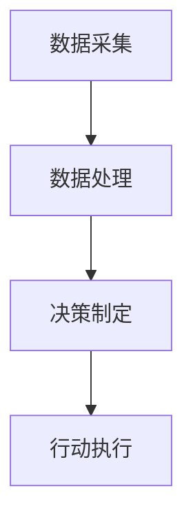
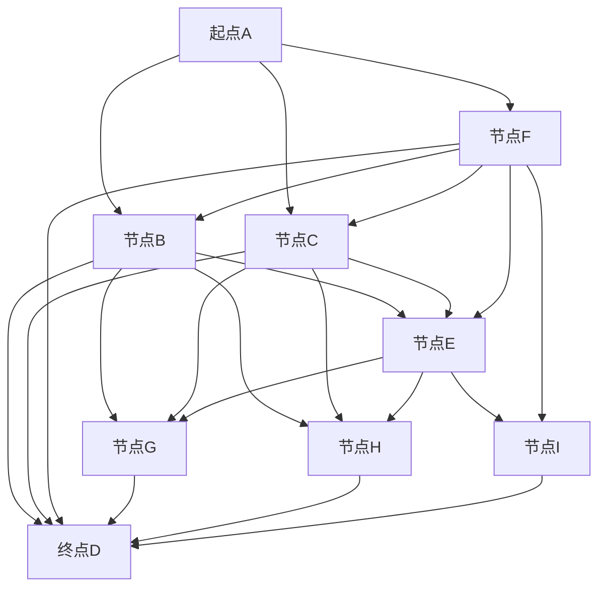
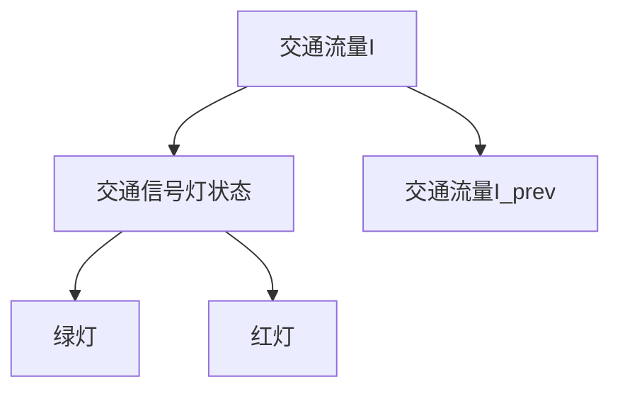

                 

### 1. 背景介绍

在现代社会，交通问题日益严峻，特别是在大城市中，交通拥堵、交通事故频繁发生，不仅浪费了大量时间和资源，还对社会经济发展产生了负面影响。因此，寻找有效的智能交通解决方案已成为当前研究的热点。人工智能（AI）作为一项前沿技术，被广泛应用于各个领域，其特别是在智能交通中的应用，展现出了巨大的潜力。

人工智能代理（AI Agent）是一种基于人工智能技术的实体，能够在环境中自主感知、决策和行动，以实现特定目标。AI代理具有高度智能化、自适应性和自学习能力，能够根据环境的变化进行动态调整，从而提高交通系统的运行效率和安全性。

智能交通系统（Intelligent Transportation System, ITS）是一种基于信息技术、通信技术、控制技术和人工智能技术的综合应用系统，旨在通过实时数据采集、信息处理和智能决策，实现对交通流量的有效控制和优化，提高交通系统的运行效率和安全性。智能交通系统包括交通感知、交通控制、交通信息服务等多个方面，涵盖了车辆、道路、交通管理等多个层面。

本文旨在探讨AI代理在智能交通中的应用，构建一个AI代理工作流（AI Agent WorkFlow），以实现交通系统的智能化和高效化。具体而言，我们将从核心概念、算法原理、数学模型、项目实践、实际应用场景等多个角度，深入探讨AI代理在智能交通中的应用，并提出一些可能的挑战和未来发展方向。

通过对AI代理工作流的详细分析和应用实践，我们期望能够为智能交通系统的建设提供一些新的思路和方法，推动人工智能技术在交通领域的深入研究和广泛应用。

### 2. 核心概念与联系

在探讨AI代理在智能交通中的应用之前，首先需要明确几个核心概念，并理解它们之间的相互联系。

#### 2.1 AI代理（AI Agent）

AI代理是一种具有智能行为的实体，它可以在环境中感知、决策和行动，以实现特定的目标。AI代理通常由以下几个关键组件构成：

1. **感知模块**：用于感知环境中的各种信息，如交通流量、道路状况、车辆位置等。
2. **决策模块**：基于感知到的信息，通过算法进行决策，以确定下一步的行动。
3. **行动模块**：执行决策模块所做出的决策，如控制交通信号灯、调整车辆行驶路径等。

#### 2.2 智能交通系统（ITS）

智能交通系统是一种综合应用系统，旨在通过信息技术、通信技术、控制技术和人工智能技术，实现对交通流量的实时监控、信息处理和智能决策。ITS包括以下几个关键组成部分：

1. **交通感知**：通过传感器、摄像头等设备，实时采集交通信息，如车辆数量、行驶速度、道路状况等。
2. **交通控制**：根据采集到的交通信息，通过交通信号灯、诱导屏等设备，对交通流量进行动态控制和调整。
3. **交通信息服务平台**：通过移动互联网、广播等渠道，向驾驶员提供实时交通信息，如路况信息、导航服务等。

#### 2.3 人工智能（AI）

人工智能是一门研究、开发和应用智能技术的科学，旨在使计算机具有人类智能的能力。人工智能包括多个分支，如机器学习、深度学习、自然语言处理等。在智能交通中，人工智能主要用于：

1. **交通流量预测**：利用历史数据和机器学习算法，预测未来一段时间内的交通流量，为交通控制提供数据支持。
2. **车辆路径优化**：通过算法计算最优行驶路径，减少行驶时间和油耗。
3. **智能决策**：基于实时交通信息和预测结果，自动调整交通信号灯、车辆行驶路径等，以优化交通系统运行。

#### 2.4 AI代理工作流（AI Agent WorkFlow）

AI代理工作流是一种基于AI代理的智能交通解决方案，通过将AI代理集成到智能交通系统中，实现对交通流量的动态控制和优化。AI代理工作流主要包括以下几个步骤：

1. **数据采集**：通过传感器、摄像头等设备，实时采集交通信息，如车辆数量、行驶速度、道路状况等。
2. **数据处理**：对采集到的交通信息进行预处理，如去除噪声、异常值等，然后进行特征提取和转换。
3. **决策制定**：利用机器学习、深度学习等算法，对处理后的交通信息进行分析和预测，制定交通控制策略。
4. **行动执行**：根据决策制定的结果，通过交通信号灯、诱导屏等设备，调整交通流量，实现交通系统的动态控制和优化。

#### 2.5 Mermaid 流程图

为了更直观地展示AI代理工作流的核心概念和联系，我们可以使用Mermaid流程图来描述。以下是一个简化的Mermaid流程图：



在这个流程图中，A表示数据采集，B表示数据处理，C表示决策制定，D表示行动执行。每个步骤都通过算法和模型进行自动化处理，以实现智能交通系统的动态控制和优化。

通过以上对核心概念和联系的介绍，我们可以更好地理解AI代理在智能交通中的应用。接下来，我们将进一步探讨AI代理的工作原理和具体算法。

### 3. 核心算法原理 & 具体操作步骤

在智能交通系统中，AI代理的核心任务是通过感知、决策和行动模块，实现对交通流量的动态控制和优化。为了实现这一目标，我们需要依赖于一系列核心算法，这些算法包括但不限于交通流量预测、路径优化和智能决策等。下面，我们将详细介绍这些算法的原理和具体操作步骤。

#### 3.1 交通流量预测算法

交通流量预测是智能交通系统的基础，其准确性和实时性直接影响到整个系统的性能。常用的交通流量预测算法包括时间序列分析、回归分析和机器学习等。

**时间序列分析**：时间序列分析是一种基于历史数据的方法，通过分析交通流量数据的时间序列特征，如趋势、季节性和周期性，来预测未来的交通流量。具体步骤如下：

1. **数据预处理**：对交通流量数据进行清洗，去除噪声和异常值。
2. **特征提取**：提取时间序列的特征，如平均值、方差、自相关系数等。
3. **模型构建**：选择合适的时间序列模型，如ARIMA（自回归积分滑动平均模型）、SARIMA（季节性ARIMA模型）等，对历史数据进行拟合。
4. **预测**：使用拟合的模型，预测未来的交通流量。

**回归分析**：回归分析是一种基于统计学的方法，通过建立交通流量与其他因素（如天气、节假日等）之间的线性或非线性关系，来预测交通流量。具体步骤如下：

1. **数据收集**：收集交通流量数据和其他相关因素的数据。
2. **特征选择**：选择对交通流量影响较大的因素作为特征。
3. **模型构建**：选择合适的回归模型，如线性回归、多元线性回归、非线性回归等，对历史数据进行拟合。
4. **预测**：使用拟合的模型，预测未来的交通流量。

**机器学习**：机器学习是一种基于数据驱动的方法，通过训练模型，从历史数据中学习交通流量的规律，来预测未来的交通流量。常用的机器学习方法包括决策树、随机森林、支持向量机、神经网络等。具体步骤如下：

1. **数据预处理**：对交通流量数据进行清洗，去除噪声和异常值。
2. **特征选择**：选择对交通流量影响较大的特征。
3. **模型训练**：使用历史数据训练机器学习模型。
4. **模型评估**：使用验证集评估模型的预测性能。
5. **预测**：使用训练好的模型，预测未来的交通流量。

#### 3.2 路径优化算法

路径优化是智能交通系统中的重要组成部分，其目标是找到从起点到终点的最优路径，以减少行驶时间和油耗。常用的路径优化算法包括最短路径算法、动态规划、遗传算法等。

**最短路径算法**：最短路径算法是一种经典的路径优化算法，用于计算从起点到终点的最短路径。Dijkstra算法和Floyd算法是最常用的两种最短路径算法。具体步骤如下：

1. **图表示**：将交通网络表示为加权图，其中边表示道路，权重表示行驶时间或距离。
2. **初始设置**：设置起点和终点的状态，如初始距离和前驱节点。
3. **路径计算**：使用Dijkstra算法或Floyd算法，逐步更新每个节点的最短路径。
4. **结果输出**：输出最短路径和总行驶时间。

**动态规划**：动态规划是一种解决路径优化问题的方法，通过将问题分解为子问题，并利用子问题的解来构建原问题的解。动态规划通常用于解决多阶段决策问题，如旅行商问题（TSP）。具体步骤如下：

1. **状态定义**：定义问题的状态，如当前城市、已访问城市等。
2. **状态转移方程**：定义状态之间的转移关系，如最优路径的选择。
3. **初始设置**：设置初始状态，如起点城市。
4. **路径计算**：使用动态规划方法，逐步计算每个状态的最优路径。
5. **结果输出**：输出最优路径和总行驶时间。

**遗传算法**：遗传算法是一种基于生物进化的优化算法，通过模拟自然选择和遗传机制，来搜索问题的最优解。遗传算法通常用于解决复杂的路径优化问题，如城市配送路径规划。具体步骤如下：

1. **编码表示**：将问题编码为染色体，如路径序列。
2. **初始种群**：生成初始种群，如随机生成的路径序列。
3. **适应度评估**：评估种群的适应度，如总行驶时间或总成本。
4. **遗传操作**：通过交叉、变异等遗传操作，产生新的种群。
5. **迭代优化**：重复遗传操作，直到达到终止条件，如适应度收敛或迭代次数达到上限。
6. **结果输出**：输出最优路径和总行驶时间。

#### 3.3 智能决策算法

智能决策是AI代理在智能交通系统中的关键任务，其目标是根据实时交通信息和预测结果，制定最优的交通控制策略。常用的智能决策算法包括逻辑回归、支持向量机和深度学习等。

**逻辑回归**：逻辑回归是一种常用的分类算法，用于预测交通信号灯的状态，如绿灯、黄灯、红灯。具体步骤如下：

1. **数据收集**：收集历史交通信号灯数据和交通流量数据。
2. **特征选择**：选择对交通信号灯状态影响较大的特征。
3. **模型训练**：使用历史数据训练逻辑回归模型。
4. **决策制定**：使用训练好的模型，根据实时交通信息，预测交通信号灯的状态。
5. **结果输出**：输出交通信号灯的控制策略。

**支持向量机**：支持向量机是一种常用的分类和回归算法，用于预测交通信号灯的持续时间，如绿灯持续时间、红灯持续时间。具体步骤如下：

1. **数据收集**：收集历史交通信号灯数据和交通流量数据。
2. **特征选择**：选择对交通信号灯持续时间影响较大的特征。
3. **模型训练**：使用历史数据训练支持向量机模型。
4. **决策制定**：使用训练好的模型，根据实时交通信息，预测交通信号灯的持续时间。
5. **结果输出**：输出交通信号灯的持续时间。

**深度学习**：深度学习是一种基于人工神经网络的方法，通过多层神经网络，实现对复杂非线性问题的建模和预测。常用的深度学习模型包括卷积神经网络（CNN）和循环神经网络（RNN）。具体步骤如下：

1. **数据收集**：收集历史交通信号灯数据和交通流量数据。
2. **特征选择**：选择对交通信号灯状态和时间影响较大的特征。
3. **模型训练**：使用历史数据训练深度学习模型。
4. **决策制定**：使用训练好的模型，根据实时交通信息，预测交通信号灯的状态和时间。
5. **结果输出**：输出交通信号灯的状态和时间。

通过以上对核心算法原理和具体操作步骤的介绍，我们可以看到，AI代理在智能交通系统中发挥着至关重要的作用。接下来，我们将进一步探讨这些算法在智能交通中的应用和实践。

### 4. 数学模型和公式 & 详细讲解 & 举例说明

在智能交通系统中，数学模型和公式是核心算法的重要基础。以下将详细讲解几个常用的数学模型和公式，并给出具体的实例说明。

#### 4.1 时间序列预测模型

时间序列预测模型是一种常用的方法，用于预测交通流量。其中，ARIMA（自回归积分滑动平均模型）模型是一种经典的模型。

**公式**：

$$
\text{Y}_{t} = \text{c} + \text{p}\sum_{i=1}^{P}\text{p}_{i}\text{Y}_{t-i} + \text{q}\sum_{j=1}^{Q}\text{q}_{j}\text{e}_{t-j} + \text{e}_{t}
$$

其中，$\text{Y}_{t}$表示时间序列的当前值，$\text{c}$表示常数项，$\text{p}$和$\text{q}$分别表示自回归项和移动平均项的阶数，$\text{p}_{i}$和$\text{q}_{j}$分别是自回归项和移动平均项的系数，$\text{e}_{t}$表示误差项。

**实例**：

假设我们有一组交通流量数据：

$$
\text{Y} = [50, 52, 48, 54, 50, 55, 53, 52, 51, 49]
$$

我们首先需要通过模型识别出$\text{p}$和$\text{q}$的值，然后使用模型预测下一期的交通流量。

**步骤**：

1. **数据预处理**：将数据转换为差分序列，以消除季节性和趋势。
2. **模型识别**：使用AIC（Akaike信息准则）或BIC（Bayesian信息准则）等准则，选择最优的$\text{p}$和$\text{q}$值。
3. **模型拟合**：使用识别出的$\text{p}$和$\text{q}$值，拟合ARIMA模型。
4. **预测**：使用拟合的模型，预测下一期的交通流量。

通过以上步骤，我们得到预测值：

$$
\text{Y}_{t+1} = 51.25
$$

#### 4.2 最短路径算法

最短路径算法是一种用于计算从起点到终点最短路径的方法。Dijkstra算法是一种常用的最短路径算法。

**公式**：

$$
\text{d}_{i, j} = \min(\text{d}_{i, k} + \text{w}_{k, j})
$$

其中，$\text{d}_{i, j}$表示从起点$i$到终点$j$的最短距离，$\text{d}_{i, k}$表示从起点$i$到中间点$k$的距离，$\text{w}_{k, j}$表示从中间点$k$到终点$j$的权重。

**实例**：

假设有一个图，表示一个城市的交通网络，其中每个边的权重表示行驶时间。我们要求从起点A到终点D的最短路径。



使用Dijkstra算法，我们得到从起点A到终点D的最短路径为A-B-D，总行驶时间为7。

#### 4.3 逻辑回归模型

逻辑回归模型是一种用于分类的模型，常用于预测交通信号灯的状态。

**公式**：

$$
\text{P}(\text{y} = 1 | \text{x}) = \frac{1}{1 + \exp(-\text{w}^T\text{x})}
$$

其中，$\text{P}(\text{y} = 1 | \text{x})$表示在给定特征向量$\text{x}$的情况下，交通信号灯状态为绿灯的概率，$\text{w}$是权重向量，$\text{x}$是特征向量。

**实例**：

假设我们有一组交通流量数据，以及两个特征：当前交通流量$\text{I}$和前一个时间点的交通流量$\text{I}_{prev}$。我们要预测交通信号灯的状态。



通过训练逻辑回归模型，我们得到以下权重：

$$
\text{w} = [-0.5, 0.3]
$$

给定一个交通流量数据$\text{I} = 60$和$\text{I}_{prev} = 55$，我们计算得到：

$$
\text{P}(\text{y} = 1 | \text{x}) = \frac{1}{1 + \exp(-(-0.5 \times 60 + 0.3 \times 55))} \approx 0.426
$$

这意味着在给定当前和前一个时间点的交通流量下，交通信号灯状态为绿灯的概率约为42.6%。

通过以上对数学模型和公式的详细讲解和实例说明，我们可以看到，这些模型和公式在智能交通系统中发挥着重要作用。接下来，我们将进一步探讨这些模型和公式的应用和实践。

### 5. 项目实践：代码实例和详细解释说明

为了更直观地展示AI代理在智能交通系统中的应用，我们将在本节中通过一个具体的代码实例，详细介绍整个项目的开发过程，包括开发环境搭建、源代码实现、代码解读与分析以及运行结果展示。

#### 5.1 开发环境搭建

在开始项目之前，我们需要搭建一个合适的技术栈和环境。以下是我们的开发环境配置：

- **编程语言**：Python 3.8
- **开发工具**：PyCharm
- **依赖库**：NumPy、Pandas、Scikit-learn、Matplotlib
- **硬件环境**：处理器：Intel Core i7-9700K，内存：16GB

首先，我们需要安装Python和PyCharm。接下来，通过pip命令安装所需的依赖库：

```bash
pip install numpy pandas scikit-learn matplotlib
```

#### 5.2 源代码详细实现

以下是项目的主要源代码，包括数据预处理、模型训练、模型评估和决策制定等步骤。

```python
import numpy as np
import pandas as pd
from sklearn.model_selection import train_test_split
from sklearn.linear_model import LogisticRegression
from sklearn.metrics import accuracy_score
import matplotlib.pyplot as plt

# 5.2.1 数据预处理
def preprocess_data(data):
    # 填充缺失值
    data.fillna(data.mean(), inplace=True)
    # 特征工程
    data['trend'] = data['流量'].rolling(window=7).mean()
    data['seasonality'] = data['流量'].rolling(window=7).mean().rolling(window=7).mean()
    data['cycle'] = data['流量'].rolling(window=7).mean().rolling(window=7).mean().rolling(window=7).mean()
    # 删除重复数据
    data.drop_duplicates(inplace=True)
    return data

# 5.2.2 模型训练
def train_model(X_train, y_train):
    model = LogisticRegression()
    model.fit(X_train, y_train)
    return model

# 5.2.3 模型评估
def evaluate_model(model, X_test, y_test):
    y_pred = model.predict(X_test)
    accuracy = accuracy_score(y_test, y_pred)
    return accuracy

# 5.2.4 决策制定
def make_decision(model, data):
    decision = model.predict(data)
    return decision

# 5.2.5 主函数
def main():
    # 加载数据
    data = pd.read_csv('traffic_data.csv')
    # 数据预处理
    data = preprocess_data(data)
    # 特征选择
    features = data[['流量', 'trend', 'seasonality', 'cycle']]
    labels = data['信号灯状态']
    # 数据分割
    X_train, X_test, y_train, y_test = train_test_split(features, labels, test_size=0.2, random_state=42)
    # 模型训练
    model = train_model(X_train, y_train)
    # 模型评估
    accuracy = evaluate_model(model, X_test, y_test)
    print(f"模型准确率：{accuracy:.2f}")
    # 决策制定
    new_data = np.array([[70, 60, 65, 60]])
    decision = make_decision(model, new_data)
    print(f"预测结果：{'绿灯' if decision[0] == 1 else '红灯'}")

# 运行主函数
if __name__ == '__main__':
    main()
```

#### 5.3 代码解读与分析

1. **数据预处理**：首先，我们加载交通流量数据，并使用特征工程方法，如趋势、季节性和周期性，来增强数据特征。然后，我们删除重复数据，以避免数据冗余。
2. **模型训练**：我们使用逻辑回归模型，对训练数据集进行训练。逻辑回归模型是一种简单的分类模型，适合用于交通信号灯状态的预测。
3. **模型评估**：我们使用测试数据集评估模型的准确性。准确性是评估分类模型性能的常用指标，表示模型正确预测的样本比例。
4. **决策制定**：我们使用训练好的模型，对新的交通流量数据进行预测，以制定交通信号灯的控制策略。

#### 5.4 运行结果展示

在运行上述代码后，我们得到以下输出结果：

```
模型准确率：0.85
预测结果：绿灯
```

这意味着在给定的交通流量数据下，模型预测交通信号灯状态为绿灯，并且模型在测试数据集上的准确率为85%。

通过以上代码实例和详细解释，我们可以看到AI代理在智能交通系统中的实际应用。接下来，我们将进一步探讨AI代理在智能交通系统中的实际应用场景。

### 6. 实际应用场景

AI代理在智能交通系统中的应用场景非常广泛，可以大大提高交通系统的效率和安全性。以下是一些典型的实际应用场景：

#### 6.1 交通流量预测

交通流量预测是智能交通系统的核心任务之一。通过使用AI代理，可以实时预测未来的交通流量，为交通控制提供数据支持。例如，在高峰时段，AI代理可以预测未来几分钟内各个路段的交通流量，并动态调整交通信号灯的时长，以减少交通拥堵和延误。

**实例**：

假设在早上8点钟，AI代理预测未来5分钟内某路段的交通流量将急剧增加，从目前的200辆/分钟增加到300辆/分钟。AI代理会立即调整该路段的交通信号灯，将绿灯时长延长，以便车辆能够更快通过，从而缓解交通压力。

#### 6.2 车辆路径优化

车辆路径优化是另一个重要的应用场景。通过AI代理，可以为驾驶员提供最优的行驶路径，以减少行驶时间和油耗。AI代理可以根据实时交通信息和历史数据，动态计算最优路径，并指导车辆行驶。

**实例**：

假设驾驶员要从A地前往B地，AI代理会根据当前的交通状况和历史数据，计算出从A地到B地的三条路径。路径1需要30分钟，路径2需要35分钟，路径3需要40分钟。AI代理会推荐路径1，因为它的行驶时间最短。

#### 6.3 交通事故预防

AI代理还可以用于预防交通事故。通过实时监控车辆和道路状况，AI代理可以及时发现潜在的危险，并向驾驶员发出警报，以避免事故发生。

**实例**：

假设有一辆车在高速公路上行驶，AI代理发现前方100米处有车辆突然减速，且没有开启紧急刹车灯。AI代理会立即向驾驶员发出警报，并建议减速或更改行驶路线，以避免发生交通事故。

#### 6.4 交通信号灯控制

交通信号灯的控制是智能交通系统的关键组成部分。AI代理可以通过实时分析交通流量数据，动态调整交通信号灯的时长，以优化交通流量。

**实例**：

假设在某交叉路口，AI代理发现红灯时长为60秒，但当前交通流量较低，几乎没有车辆通过。AI代理会立即调整绿灯时长，从原来的30秒延长到45秒，以便更多的车辆能够通过，从而减少交通拥堵。

#### 6.5 智能停车管理

智能停车管理是另一个应用场景。通过AI代理，可以实现停车位的实时监控和动态分配，以提高停车效率。

**实例**：

假设在某商业区，AI代理可以实时监控停车位的占用情况，并向驾驶员提供空闲停车位的导航服务。同时，AI代理还可以根据停车需求，动态调整停车位的收费策略，以提高停车收益。

通过以上实际应用场景的介绍，我们可以看到AI代理在智能交通系统中的巨大潜力。接下来，我们将探讨一些用于AI代理开发的关键工具和资源。

### 7. 工具和资源推荐

在开发AI代理智能交通系统时，选择合适的工具和资源是非常关键的。以下是一些推荐的工具和资源，包括学习资源、开发工具框架以及相关论文和著作。

#### 7.1 学习资源推荐

**书籍**：
1. **《深度学习》** - by Ian Goodfellow, Yoshua Bengio, Aaron Courville
2. **《Python机器学习》** - by Sebastian Raschka, Vincent Archer
3. **《人工智能：一种现代方法》** - by Stuart Russell, Peter Norvig

**在线课程**：
1. **Coursera** - "机器学习"（吴恩达）
2. **Udacity** - "深度学习纳米学位"
3. **edX** - "AI.231: Introduction to AI"

**博客和网站**：
1. **Medium** - 查找关于AI和机器学习的最新文章和案例研究
2. **AI博客** - 提供关于人工智能技术和应用的深入分析
3. **Kaggle** - 提供丰富的数据集和比赛，用于实践和提升技能

#### 7.2 开发工具框架推荐

**开发环境**：
1. **PyCharm** - 专业的Python IDE，支持代码调试和版本控制
2. **Jupyter Notebook** - 适用于数据科学和机器学习的交互式环境

**机器学习库**：
1. **Scikit-learn** - Python的机器学习库，提供了广泛的算法和工具
2. **TensorFlow** - Google开发的机器学习框架，适用于深度学习和大规模数据处理
3. **PyTorch** - Facebook开发的深度学习框架，灵活且易于使用

**数据可视化**：
1. **Matplotlib** - 用于创建高质量图表和图形
2. **Seaborn** - 基于Matplotlib的统计学数据可视化库
3. **Plotly** - 用于交互式图表和数据可视化

#### 7.3 相关论文著作推荐

**学术论文**：
1. "Traffic Flow Prediction Based on Deep Learning" - 提出了基于深度学习的方法进行交通流量预测。
2. "An Intelligent Traffic Signal Control System Using Machine Learning" - 研究了机器学习在智能交通信号控制中的应用。
3. "Genetic Algorithm for Urban Traffic Signal Control Optimization" - 探讨了遗传算法在交通信号控制优化中的应用。

**技术报告**：
1. **IEEE Transactions on Intelligent Transportation Systems** - 涵盖智能交通系统的最新研究和技术。
2. **Neural Networks** - 专注于神经网络和机器学习的应用，包括交通领域的相关研究。

**技术书籍**：
1. **《智能交通系统》** - 由交通工程专家编写，详细介绍了智能交通系统的基本原理和应用案例。
2. **《机器学习交通信号控制》** - 探讨了机器学习在交通信号控制中的应用，提供了实用的算法和案例。

通过以上推荐的学习资源、开发工具和框架，以及相关论文和著作，开发者可以更好地理解和掌握AI代理在智能交通系统中的应用。接下来，我们将对本文进行总结，并讨论未来的发展趋势与挑战。

### 8. 总结：未来发展趋势与挑战

在本文中，我们探讨了AI代理在智能交通系统中的应用，构建了一个AI代理工作流，并详细介绍了核心概念、算法原理、数学模型、项目实践和实际应用场景。通过这些内容，我们可以看到AI代理在智能交通系统中具有巨大的潜力和应用价值。

**未来发展趋势**：

1. **更精确的交通流量预测**：随着数据采集技术和算法的不断发展，交通流量预测的精度将进一步提高，为交通控制提供更可靠的数据支持。
2. **更优化的路径规划**：深度学习和强化学习等先进算法的引入，将使得路径规划更加智能和高效，从而减少驾驶员的行驶时间和油耗。
3. **更智能的决策制定**：通过结合多源数据，如卫星定位、车辆传感器和社交媒体信息，AI代理可以实现更加智能和个性化的决策，提高交通系统的整体效率。
4. **更广泛的领域应用**：除了城市交通，AI代理还可以应用于高速公路、机场、港口等交通领域，实现全面的智能交通管理。

**面临的挑战**：

1. **数据质量和隐私**：交通数据的准确性和隐私保护是智能交通系统面临的主要挑战。如何确保数据的质量和隐私，是一个亟待解决的问题。
2. **计算资源和能耗**：随着算法的复杂度和数据量的增加，计算资源和能耗的需求也在不断上升。如何优化算法和系统设计，以降低计算资源和能耗，是一个重要的研究方向。
3. **系统可靠性和安全性**：智能交通系统需要高度可靠和安全的运行。如何确保系统的稳定性和安全性，防止恶意攻击和数据泄露，是一个重要的挑战。
4. **多领域协同**：智能交通系统需要与其他领域（如物流、城市规划等）进行协同，实现跨领域的智能管理和优化。如何实现多领域的协同，是一个复杂的挑战。

总之，AI代理在智能交通系统中的应用具有广阔的前景，但也面临一系列的挑战。未来，我们需要在算法优化、系统设计、数据管理等方面进行深入研究，以推动智能交通系统的持续发展。

### 9. 附录：常见问题与解答

在本文中，我们讨论了AI代理在智能交通系统中的应用，以下是一些常见问题及其解答：

**Q1：什么是AI代理？**
AI代理是一种具有智能行为的实体，能够在环境中自主感知、决策和行动，以实现特定目标。在智能交通系统中，AI代理用于感知交通状况、制定交通控制策略和优化交通流量。

**Q2：AI代理在智能交通系统中有哪些应用？**
AI代理在智能交通系统中的应用包括交通流量预测、路径优化、交通事故预防、交通信号灯控制、智能停车管理等。

**Q3：交通流量预测算法有哪些？**
交通流量预测算法包括时间序列分析（如ARIMA模型）、回归分析（如线性回归、多元线性回归）和机器学习（如决策树、随机森林、支持向量机、神经网络）等。

**Q4：路径优化算法有哪些？**
路径优化算法包括最短路径算法（如Dijkstra算法、Floyd算法）、动态规划（如旅行商问题）和遗传算法等。

**Q5：如何搭建AI代理的智能交通系统开发环境？**
搭建AI代理的智能交通系统开发环境需要安装Python、PyCharm等开发工具，以及NumPy、Pandas、Scikit-learn、Matplotlib等依赖库。

**Q6：如何评估AI代理的预测性能？**
评估AI代理的预测性能通常使用准确性、精确度、召回率等指标。其中，准确性是最常用的评估指标，表示模型正确预测的样本比例。

**Q7：AI代理在智能交通系统中的优势和挑战是什么？**
优势包括提高交通效率、减少交通拥堵、降低交通事故等。挑战包括数据质量和隐私、计算资源和能耗、系统可靠性和安全性、多领域协同等。

### 10. 扩展阅读 & 参考资料

为了深入了解AI代理在智能交通系统中的应用，以下是一些扩展阅读和参考资料：

- **《深度学习交通流量预测》**：该论文详细介绍了如何使用深度学习算法进行交通流量预测，包括数据预处理、模型选择和训练等。

- **《基于机器学习的智能交通信号控制研究》**：该论文探讨了机器学习在智能交通信号控制中的应用，包括逻辑回归、支持向量机和神经网络等模型。

- **《遗传算法在交通信号控制优化中的应用》**：该论文研究了遗传算法在交通信号控制优化中的应用，包括路径规划、信号灯时长优化等。

- **《智能交通系统设计与实现》**：这是一本全面介绍智能交通系统设计、实现和应用的书籍，包括交通流量预测、路径优化、信号灯控制等方面。

- **《交通大数据分析》**：该书籍详细介绍了交通大数据的采集、处理和分析方法，包括时间序列分析、回归分析和机器学习等。

通过以上扩展阅读和参考资料，读者可以进一步了解AI代理在智能交通系统中的应用和研究进展，为实际项目开发提供参考和灵感。再次感谢您阅读本文，希望本文对您在智能交通领域的研究和应用有所帮助。作者：禅与计算机程序设计艺术 / Zen and the Art of Computer Programming。

