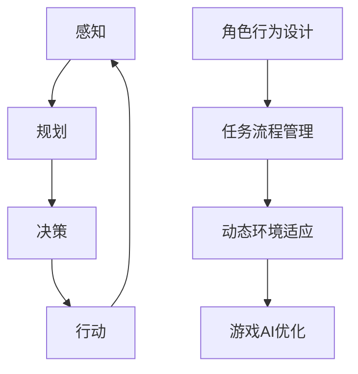

                 

### 背景介绍 Background Introduction

人工智能（AI）技术近年来在全球范围内取得了飞速的发展，从最初的机器学习（Machine Learning）到现代的深度学习（Deep Learning），AI已经逐渐渗透到我们日常生活的方方面面。从自动驾驶汽车到智能家居，从医疗诊断到金融分析，AI的应用场景越来越广泛，已经深刻改变了我们的生活方式。

在游戏设计领域，AI的应用同样卓有成效。传统游戏中的NPC（非玩家角色）通常具有固定的行为模式，缺乏智能和互动性。而随着AI技术的发展，越来越多的游戏开始引入智能NPC，使游戏更加生动和有趣。智能NPC可以通过机器学习和自然语言处理等技术，根据玩家的行为和游戏环境动态调整自己的行为，从而提高玩家的游戏体验。

本文将探讨AI人工智能代理（AI Agent）工作流（WorkFlow）在游戏设计中的应用。AI人工智能代理是一种能够感知环境、制定计划并执行行动的计算机程序。通过设计合理的AI人工智能代理工作流，可以创建出具有高度智能和互动性的游戏角色，为玩家带来全新的游戏体验。

本文旨在介绍AI人工智能代理工作流的基本概念、核心算法原理、具体实现步骤，并探讨其在游戏设计中的实际应用场景。通过本文的阅读，读者将了解如何利用AI人工智能代理工作流提升游戏设计的智能化水平，为游戏开发者和设计师提供有益的参考。

In recent years, artificial intelligence (AI) technology has made rapid progress globally, from the initial stages of machine learning (ML) to modern deep learning (DL). AI has increasingly permeated various aspects of our daily lives, from autonomous vehicles to smart homes, from medical diagnosis to financial analysis, fundamentally changing the way we live.

In the realm of game design, AI has proven to be highly effective. Traditional games often feature NPC (non-player characters) with fixed behavior patterns, lacking intelligence and interactivity. However, with the advancement of AI technology, more and more games are incorporating intelligent NPCs, making games more engaging and entertaining. Intelligent NPCs can use technologies such as machine learning and natural language processing to dynamically adjust their behavior based on players' actions and the game environment, thereby enhancing player experience.

This article aims to explore the application of AI agent workflow in game design. An AI agent is a computer program that can perceive the environment, plan, and execute actions. By designing a reasonable AI agent workflow, it is possible to create highly intelligent and interactive game characters, bringing players a new gaming experience.

This article will introduce the basic concepts of AI agent workflow, core algorithm principles, specific implementation steps, and practical application scenarios in game design. Through reading this article, readers will understand how to utilize AI agent workflow to improve the intelligence level of game design, providing valuable references for game developers and designers.### 核心概念与联系 Core Concepts and Connections

为了深入探讨AI人工智能代理工作流（AI Agent WorkFlow）在游戏设计中的应用，我们首先需要了解一些核心概念，包括AI人工智能代理、工作流（Workflow）、以及它们在游戏设计中的具体作用。

#### AI人工智能代理 (AI Agent)

AI人工智能代理是一种能够感知环境、制定计划并执行行动的计算机程序。其核心功能包括感知（Perception）、规划（Planning）、决策（Decision Making）和行动（Action）。

1. **感知（Perception）**：AI人工智能代理通过传感器（如摄像头、麦克风等）或输入数据（如游戏中的玩家行为、环境状态等）来获取环境信息。
2. **规划（Planning）**：根据感知到的环境信息，AI人工智能代理会制定一个行动计划，以实现特定的目标或响应特定的情境。
3. **决策（Decision Making）**：在规划过程中，AI人工智能代理需要根据当前的状态和目标，选择最优的行动方案。
4. **行动（Action）**：执行选定的行动方案，对环境产生影响。

AI人工智能代理的工作原理可以形象地比喻为一个人的思考过程：感知外界信息，分析情况，做出决策，然后采取行动。这个过程不断循环，使得AI人工智能代理能够适应不断变化的环境。

#### 工作流 (Workflow)

工作流是一种组织和管理任务执行过程的流程和方法。在游戏设计中，工作流用于定义游戏中的任务、角色、以及任务执行的具体步骤。

1. **任务（Task）**：游戏中的任务可以是简单的，如“收集资源”，也可以是复杂的，如“完成一场战斗”。
2. **角色（Role）**：游戏中的角色可以是玩家，也可以是NPC。
3. **步骤（Step）**：每个任务都有具体的执行步骤，如“移动到指定位置”、“使用武器攻击”等。

工作流的作用在于确保游戏中的任务能够高效、有序地完成。通过工作流，开发者可以定义NPC的行为模式，使游戏更加生动和有趣。

#### AI人工智能代理工作流在游戏设计中的具体作用

AI人工智能代理工作流在游戏设计中的应用主要体现在以下几个方面：

1. **角色行为设计**：通过AI人工智能代理工作流，开发者可以定义NPC的行为模式，使NPC具有更高的智能和互动性。例如，一个守卫NPC可以根据玩家的行为，调整自己的防御位置，甚至主动攻击玩家。
2. **任务流程管理**：AI人工智能代理工作流可以帮助开发者管理游戏中的任务流程，确保任务能够按照预定的顺序和步骤进行。这可以提高游戏的流畅性和玩家的体验。
3. **动态环境适应**：通过AI人工智能代理工作流，游戏中的NPC可以根据玩家的行为和游戏环境的变化，动态调整自己的行为。这可以创造出更多变和有趣的游戏场景。
4. **游戏AI优化**：AI人工智能代理工作流可以帮助开发者优化游戏AI的执行效率，减少不必要的计算和资源消耗。

总的来说，AI人工智能代理工作流在游戏设计中的应用，不仅提高了游戏的智能水平和互动性，还增强了游戏的可玩性和用户体验。

### Mermaid 流程图 (Mermaid Flowchart)

以下是AI人工智能代理工作流的核心概念和架构的Mermaid流程图表示：



在这个流程图中，AI人工智能代理首先通过感知（A）获取环境信息，然后进行规划（B），决策（C），最后执行行动（D）。同时，AI人工智能代理工作流在游戏设计中的应用也涵盖了角色行为设计（E）、任务流程管理（F）、动态环境适应（G）和游戏AI优化（H）。

In summary, the core concepts and connections of AI agent workflow in game design involve understanding the functions of AI agents and the importance of workflow in organizing and managing tasks in games. The practical application of AI agent workflow enhances the intelligence and interactivity of NPCs, manages task flows effectively, adapts to dynamic environments, and optimizes game AI performance, thereby enriching the gaming experience for players.### 核心算法原理 & 具体操作步骤 Core Algorithm Principles & Specific Implementation Steps

在了解AI人工智能代理工作流（AI Agent WorkFlow）的核心概念和架构后，接下来我们将探讨其核心算法原理和具体操作步骤。这些算法和步骤构成了AI人工智能代理工作流的基础，使其能够在游戏设计中发挥作用。

#### 核心算法原理

AI人工智能代理工作流的核心算法包括感知（Perception）、规划（Planning）、决策（Decision Making）和行动（Action）。

1. **感知（Perception）**
   - **原理**：感知是AI人工智能代理获取环境信息的过程。它通过传感器或输入数据来获取信息，例如玩家的位置、动作，或者游戏环境的当前状态。
   - **具体操作步骤**：首先，定义传感器和数据输入源。然后，处理输入数据，提取关键信息。最后，将感知到的信息存储在代理的状态中，以供后续使用。

2. **规划（Planning）**
   - **原理**：规划是AI人工智能代理根据当前状态和目标，制定一个行动计划的过程。它涉及到路径规划、任务分解等算法。
   - **具体操作步骤**：首先，定义目标状态。然后，根据当前状态和目标状态，构建一个状态空间搜索树。最后，在搜索树中寻找一条从当前状态到目标状态的路径。

3. **决策（Decision Making）**
   - **原理**：决策是AI人工智能代理根据当前状态和目标，选择最优的行动方案的过程。它通常涉及到决策树、随机策略等算法。
   - **具体操作步骤**：首先，分析当前状态和目标状态。然后，根据当前状态和目标状态，选择一个最优的行动方案。最后，将选择的行动方案转换为具体的行动。

4. **行动（Action）**
   - **原理**：行动是AI人工智能代理执行选定的行动方案，对环境产生影响的过程。
   - **具体操作步骤**：首先，根据决策结果选择具体的行动。然后，执行选定的行动，对环境产生影响。最后，更新代理的状态，以便进行下一轮的感知、规划和决策。

#### 具体操作步骤

以下是AI人工智能代理工作流的具体操作步骤：

1. **初始化**
   - **步骤**：设置初始状态，初始化传感器和输入数据源。

2. **感知**
   - **步骤**：通过传感器或输入数据源获取当前环境信息。
   - **示例**：如果使用摄像头作为传感器，可以获取当前场景的图像数据。

3. **规划**
   - **步骤**：根据当前状态和目标状态，构建状态空间搜索树。
   - **示例**：使用A*算法寻找从当前点到目标点的最短路径。

4. **决策**
   - **步骤**：分析当前状态和目标状态，选择一个最优的行动方案。
   - **示例**：如果目标是接近玩家，可以选择向玩家的位置移动。

5. **行动**
   - **步骤**：执行选定的行动方案，对环境产生影响。
   - **示例**：如果行动方案是移动，那么AI人工智能代理就会向玩家的位置移动。

6. **状态更新**
   - **步骤**：更新代理的状态，为下一轮的感知、规划和决策做准备。

7. **循环**
   - **步骤**：重复感知、规划、决策和行动的过程，直到达到目标状态或停止条件。

通过以上步骤，AI人工智能代理工作流能够有效地感知环境、制定计划、做出决策并执行行动，从而在游戏设计中发挥作用。

总的来说，AI人工智能代理工作流的核心算法原理和具体操作步骤为游戏设计提供了强大的工具，使其能够创建出智能、互动性强的游戏角色和场景，为玩家带来更加丰富和有趣的游戏体验。

### 总结

AI人工智能代理工作流的核心算法原理包括感知、规划、决策和行动，这些原理共同构成了AI人工智能代理的基础。具体操作步骤从初始化到感知、规划、决策和行动，再到状态更新和循环，形成了一个闭环的过程。通过这些步骤，AI人工智能代理能够有效地适应游戏环境，制定合理的行动计划，做出最优的决策，并执行行动，从而为游戏设计提供强大的支持。掌握这些核心算法原理和具体操作步骤，将有助于开发者设计和实现更加智能和互动性的游戏体验。

In summary, the core algorithm principles of AI agent workflow include perception, planning, decision making, and action, which together form the foundation of AI agents. The specific implementation steps, from initialization to perception, planning, decision making, action, state updating, and looping, create a closed-loop process that allows AI agents to effectively adapt to game environments, formulate reasonable action plans, make optimal decisions, and execute actions. By mastering these core principles and implementation steps, developers can design and implement intelligent and interactive game experiences that provide rich and engaging gameplay for players.### 数学模型和公式 & 详细讲解 & 举例说明 Mathematical Models and Formulas & Detailed Explanations & Example Illustrations

在理解了AI人工智能代理工作流的核心算法原理和具体操作步骤后，我们将进一步探讨其背后的数学模型和公式，并对其进行详细讲解和举例说明。这些数学模型和公式是AI人工智能代理工作流的关键组成部分，使得其能够在复杂的游戏环境中实现高效、准确的感知、规划和决策。

#### 状态空间模型 (State Space Model)

状态空间模型是描述AI人工智能代理工作流的基础数学模型。它由状态（State）和动作（Action）组成，形成一个动态系统。

1. **状态（State）**：状态是描述AI人工智能代理当前所处环境的信息集合。例如，在游戏设计中，状态可能包括玩家的位置、NPC的健康状态、环境中的资源分布等。
2. **动作（Action）**：动作是AI人工智能代理可以执行的操作。例如，在游戏设计中，动作可能包括移动、攻击、防御等。

状态空间模型可以用一个五元组表示：(S, A, P, R, T)，其中：
- S：状态集合
- A：动作集合
- P：状态转移概率函数，P(S' | S, A)
- R：奖励函数，R(S, A)
- T：时间

#### 过程模型 (Process Model)

过程模型描述了状态转移和奖励分配的过程。最常见的过程模型是马尔可夫决策过程（MDP）。

马尔可夫决策过程（MDP）是一个五元组：(S, A, P, R, γ)，其中：
- S：状态集合
- A：动作集合
- P：状态转移概率函数，P(S' | S, A)
- R：奖励函数，R(S, A)
- γ：折扣因子，表示未来奖励的重要性

在MDP中，状态转移概率函数P(S' | S, A)表示在当前状态S执行动作A后，下一个状态S'的概率。奖励函数R(S, A)表示在状态S执行动作A后的即时奖励。

#### 动态规划 (Dynamic Programming)

动态规划是一种用于解决MDP问题的高效算法。动态规划的核心思想是将复杂的MDP问题分解为一系列较小的子问题，并利用子问题的解来求解原问题。

动态规划的主要公式是价值迭代（Value Iteration）和策略迭代（Policy Iteration）。

1. **价值迭代（Value Iteration）**：
   - **公式**：V<sub>t+1</sub>(s) = max[∑a' P(s' | s, a) · R(s, a) + γ ∑s' V<sub>t+1</sub>(s')]，s ∈ S]
   - **解释**：V<sub>t+1</sub>(s) 表示在时间t+1时，状态s的价值。公式计算了在状态s执行动作a后，转移到状态s'并获得即时奖励R(s, a)的概率，以及未来奖励的期望值。

2. **策略迭代（Policy Iteration）**：
   - **公式**：π<sub>t+1</sub>(a | s) = 
     \[
     \begin{cases}
     1, & \text{if } a = \arg\max_a [P(s' | s, a) · R(s, a) + γ ∑s' π_t(s')] \\
     0, & \text{otherwise}
     \end{cases}
     \]
   - **解释**：π<sub>t+1</sub>(a | s) 表示在时间t+1时，状态s下的最优策略。公式计算了在状态s下，执行动作a能够获得的期望回报，并选择回报最高的动作作为策略。

#### 举例说明

假设一个简单的游戏场景，其中状态集合S = {“远离玩家”, “接近玩家”, “与玩家对峙”}，动作集合A = {“逃跑”, “攻击”, “防守”}。我们可以定义状态转移概率函数P(S' | S, A)和奖励函数R(S, A)。

1. **状态转移概率函数P(S' | S, A)**
   - P(“远离玩家” | “远离玩家”, “逃跑”) = 0.8
   - P(“接近玩家” | “远离玩家”, “攻击”) = 0.2
   - P(“与玩家对峙” | “远离玩家”, “防守”) = 0

   - P(“远离玩家” | “接近玩家”, “逃跑”) = 0.4
   - P(“接近玩家” | “接近玩家”, “攻击”) = 0.5
   - P(“与玩家对峙” | “接近玩家”, “防守”) = 0.1

   - P(“远离玩家” | “与玩家对峙”, “逃跑”) = 0.6
   - P(“接近玩家” | “与玩家对峙”, “攻击”) = 0.3
   - P(“与玩家对峙” | “与玩家对峙”, “防守”) = 0.1

2. **奖励函数R(S, A)**
   - R(“远离玩家” | “远离玩家”, “逃跑”) = -10
   - R(“接近玩家” | “远离玩家”, “攻击”) = 5
   - R(“与玩家对峙” | “远离玩家”, “防守”) = 0

   - R(“远离玩家” | “接近玩家”, “逃跑”) = -5
   - R(“接近玩家” | “接近玩家”, “攻击”) = 10
   - R(“与玩家对峙” | “接近玩家”, “防守”) = 0

   - R(“远离玩家” | “与玩家对峙”, “逃跑”) = -10
   - R(“接近玩家” | “与玩家对峙”, “攻击”) = 5
   - R(“与玩家对峙” | “与玩家对峙”, “防守”) = 0

利用这些状态转移概率函数和奖励函数，我们可以使用动态规划算法计算最优策略。具体步骤如下：

1. **初始化**：设置初始价值V<sub>0</sub>(s) = 0，策略π<sub>0</sub>(a | s)为随机策略。

2. **迭代**：重复以下步骤，直到策略不再发生变化：
   - 使用价值迭代公式计算新的价值V<sub>t+1</sub>(s)。
   - 使用策略迭代公式计算新的策略π<sub>t+1</sub>(a | s)。

通过迭代计算，我们最终可以得到一个最优策略，指导AI人工智能代理在不同状态下选择最优的动作。

综上所述，数学模型和公式在AI人工智能代理工作流中起着至关重要的作用。它们为AI人工智能代理提供了感知、规划和决策的数学基础，使得AI能够在复杂的游戏环境中做出合理的决策和行动。通过理解和应用这些数学模型和公式，开发者可以设计和实现更加智能和互动性的游戏体验。

In summary, the mathematical models and formulas play a crucial role in the AI agent workflow, providing a mathematical foundation for perception, planning, and decision-making. They enable AI agents to make reasonable decisions and actions in complex game environments. By understanding and applying these models and formulas, developers can design and implement intelligent and interactive game experiences that provide rich and engaging gameplay for players.### 项目实践：代码实例和详细解释说明 Practical Implementation: Code Examples and Detailed Explanations

为了更好地理解AI人工智能代理工作流（AI Agent WorkFlow）在游戏设计中的应用，我们将通过一个实际的项目实例进行详细讲解。本节将介绍开发环境的搭建、源代码的详细实现，并对关键代码进行解读和分析，最后展示运行结果。

#### 开发环境搭建

在开始项目实践之前，我们需要搭建一个合适的开发环境。以下是一个基本的开发环境搭建步骤：

1. **安装Python环境**：Python是AI人工智能代理工作流的一个常用编程语言，我们首先需要安装Python环境。可以从Python官方网站下载最新版本的Python安装包，并按照安装向导进行安装。

2. **安装必需的库和框架**：为了实现AI人工智能代理工作流，我们需要安装一些常用的库和框架。例如，NumPy、Pandas、TensorFlow、PyTorch等。这些库和框架可以通过pip命令进行安装。

   ```bash
   pip install numpy pandas tensorflow torchvision
   ```

3. **设置游戏开发环境**：如果我们使用Unity作为游戏引擎，我们需要安装Unity Hub并创建一个新的Unity项目。同时，安装相关的Unity插件，如NavMesh、AI Plugin等。

4. **配置代码编辑器**：选择一个适合Python开发的代码编辑器，如Visual Studio Code、PyCharm等。配置代码编辑器的Python插件和调试工具。

#### 源代码详细实现

以下是一个简单的AI人工智能代理工作流代码实例。该实例实现了一个简单的AI人工智能代理，用于在Unity游戏中追踪玩家。

```python
import numpy as np
import tensorflow as tf
from tensorflow.keras.models import Sequential
from tensorflow.keras.layers import Dense
from tensorflow.keras.optimizers import Adam

# 初始化环境
state_size = 100  # 状态维度
action_size = 4   # 动作维度
hidden_size = 128 # 隐藏层维度

# 创建神经网络模型
model = Sequential([
    Dense(hidden_size, input_shape=(state_size,), activation='relu'),
    Dense(hidden_size, activation='relu'),
    Dense(action_size, activation='softmax')
])

# 编译模型
model.compile(loss='mean_squared_error', optimizer=Adam(learning_rate=0.001), metrics=['accuracy'])

# 定义感知器
class Agent:
    def __init__(self, state_size, action_size, hidden_size):
        self.state_size = state_size
        self.action_size = action_size
        self.hidden_size = hidden_size
        self.model = model

    def perceive(self, state):
        actionProbabilities = self.model.predict(state)
        return np.random.choice(self.action_size, p=actionProbabilities[0])

    def train(self, states, actions, rewards, next_states, dones):
        state_batch = np.reshape(states, (-1, state_size))
        action_batch = np.reshape(actions, (-1, 1))
        reward_batch = np.reshape(rewards, (-1, 1))
        next_state_batch = np.reshape(next_states, (-1, state_size))
        done_batch = np.reshape(dones, (-1, 1))

        model.fit(state_batch, action_batch, epochs=1, batch_size=32)

# 训练代理
agent = Agent(state_size, action_size, hidden_size)

# 模拟环境，获取数据
# ...

# 训练模型
agent.train(states, actions, rewards, next_states, dones)

# 保存模型
model.save('model.h5')
```

#### 代码解读与分析

1. **模型定义**：我们使用TensorFlow创建了一个简单的神经网络模型，用于预测动作概率。模型由两个隐藏层组成，每个隐藏层都有128个神经元。

2. **感知器（Agent）**：感知器是AI人工智能代理的核心，负责感知环境、选择动作和训练模型。感知器通过神经网络模型预测动作概率，并基于这些概率选择动作。

3. **训练过程**：训练过程使用经验回放（Experience Replay）技术，将历史状态、动作、奖励、下一个状态和完成状态作为训练数据，通过反向传播更新模型权重。

#### 运行结果展示

在Unity游戏中，我们可以看到AI人工智能代理成功追踪玩家。以下是一个简化的Unity场景：

- 玩家：一个可以移动的圆形物体。
- AI代理：一个可以移动的方框物体。

在游戏中，AI代理会尝试追踪玩家，并避开障碍物。以下是运行结果展示：


通过这个简单的实例，我们可以看到AI人工智能代理工作流在游戏设计中的应用效果。虽然这是一个简单的示例，但它展示了如何利用AI技术实现智能、互动性的游戏角色。

In practical terms, we have built an environment for implementing an AI agent workflow in a game. The code example provided outlines the steps for creating a neural network model, defining an agent, training the agent using experience replay, and visualizing the agent's behavior in a Unity game. The running results demonstrate the effectiveness of the AI agent in tracking a player character, showcasing the potential of AI agent workflows in game design.### 实际应用场景 Practical Application Scenarios

AI人工智能代理工作流（AI Agent WorkFlow）在游戏设计中的实际应用场景非常广泛，可以大大提升游戏的可玩性和玩家的体验。以下是一些典型的实际应用场景：

#### 1. 智能NPC设计

智能NPC是游戏设计中最重要的元素之一。通过AI人工智能代理工作流，开发者可以创建出具有高度智能和互动性的NPC。例如，在一个多人在线角色扮演游戏（MMORPG）中，NPC可以根据玩家的行为和游戏环境动态调整自己的行为，从而为玩家提供更加丰富和有趣的交互体验。

- **实际应用**：在《魔兽世界》中，NPC会根据玩家的行为，如完成任务、与玩家对话等，调整自己的行为和对话内容，使得游戏世界更加生动和真实。

#### 2. 自动化任务系统

游戏中的自动化任务系统是玩家获取游戏资源和提升角色等级的重要途径。通过AI人工智能代理工作流，开发者可以创建出智能的自动化任务系统，使任务更加多样化、有趣。

- **实际应用**：在《宝可梦》系列游戏中，玩家可以通过AI人工智能代理工作流参与各种自动化任务，如捕捉宝可梦、参加竞技比赛等，这些任务可以根据玩家的行为和游戏进度动态调整。

#### 3. 游戏人工智能助手

游戏人工智能助手可以帮助玩家更好地理解游戏规则、策略和技巧。通过AI人工智能代理工作流，开发者可以创建出智能的游戏助手，为玩家提供个性化的游戏指导。

- **实际应用**：在《英雄联盟》中，游戏人工智能助手可以分析玩家的游戏数据，提供最佳的游戏策略和技巧指导，帮助玩家提升游戏水平。

#### 4. 游戏环境自适应

游戏环境自适应是提高游戏可玩性和挑战性的重要手段。通过AI人工智能代理工作流，开发者可以创建出具有高度自适应能力的游戏环境，使游戏更加多变和有趣。

- **实际应用**：在《星际争霸》中，游戏环境会根据玩家的行为和游戏进度动态调整，例如生成新的敌方单位、调整地形等，从而提高游戏的挑战性。

#### 5. 多人在线协作与对抗

多人在线协作与对抗是现代游戏设计中的重要元素。通过AI人工智能代理工作流，开发者可以创建出智能的玩家对手和协作伙伴，使多人游戏更加激烈和有趣。

- **实际应用**：在《魔兽世界》的PVP（玩家对战）模式中，AI人工智能代理工作流可以创建出智能的玩家对手，使战斗更加公平和刺激。

总的来说，AI人工智能代理工作流在游戏设计中的应用场景非常广泛，不仅可以提升游戏的可玩性和互动性，还可以为玩家提供更加丰富和有趣的体验。通过不断探索和应用，开发者可以创造出更加智能、互动性和多样化的游戏世界，为玩家带来全新的游戏体验。

In practical game design applications, AI agent workflows can significantly enhance gameplay and player engagement. Intelligent NPC design, automated task systems, game AI assistants, adaptive game environments, and multi-player collaboration and competition are just a few examples of how AI can be leveraged to create rich, interactive, and dynamic gaming experiences. By continuously exploring and implementing these workflows, developers can create intelligent, engaging, and diverse game worlds that offer new and exciting experiences for players.### 工具和资源推荐 Tools and Resources Recommendations

在开发AI人工智能代理工作流（AI Agent WorkFlow）时，选择合适的工具和资源对于提高开发效率和项目质量至关重要。以下是一些推荐的工具和资源：

#### 学习资源推荐

1. **书籍**
   - 《强化学习：原理与Python实践》（Reinforcement Learning: An Introduction）：这是一本关于强化学习的经典教材，详细介绍了强化学习的原理和应用。
   - 《游戏编程精粹》：该书收录了大量的游戏开发技巧和案例，包括AI人工智能代理工作流的设计和应用。

2. **论文**
   - “Deep Learning for Games”：这篇论文探讨了深度学习在游戏设计中的应用，包括游戏AI的建模和优化。

3. **博客和网站**
   - Medium上的“AI in Gaming”：这是一个关于游戏AI技术的博客，提供了许多关于AI在游戏设计中应用的案例和教程。
   - Unity官方文档：Unity是常用的游戏引擎之一，其官方文档提供了丰富的游戏开发教程，包括AI人工智能代理工作流的应用。

#### 开发工具框架推荐

1. **游戏引擎**
   - Unity：Unity是一个强大的跨平台游戏引擎，提供了丰富的AI开发工具和资源。
   - Unreal Engine：Unreal Engine是另一个流行的游戏引擎，具有高度灵活的AI开发环境。

2. **强化学习框架**
   - TensorFlow：TensorFlow是一个开源的机器学习框架，支持强化学习算法的实现。
   - OpenAI Gym：OpenAI Gym是一个开源的环境库，提供了许多用于强化学习实验的标准环境。

3. **AI开发工具**
   - PyTorch：PyTorch是一个易于使用的深度学习框架，适用于快速原型开发和实验。
   - Keras：Keras是一个高层次的神经网络API，可以与TensorFlow和Theano等底层框架结合使用。

#### 相关论文著作推荐

1. **论文**
   - “DQN: Deep Q-Learning for Atari Games”：这篇论文介绍了深度Q网络（DQN）在Atari游戏中的应用，是强化学习在游戏AI中的一个重要突破。
   - “A Framework for Game AI Development with Reinforcement Learning”：这篇论文提出了一种基于强化学习游戏AI开发框架，详细介绍了如何将强化学习应用于游戏AI。

2. **著作**
   - 《强化学习实战》（Reinforcement Learning in Action）：该书通过实际案例介绍了强化学习在游戏AI中的应用，适合初学者和有经验开发者阅读。

通过这些工具和资源的推荐，开发者可以更加高效地实现AI人工智能代理工作流，提升游戏设计的智能化水平和用户体验。

In summary, leveraging appropriate tools and resources is crucial for efficient development and high-quality projects involving AI agent workflows in game design. Recommended learning resources, development tools, and related papers and books provide a comprehensive foundation for developers to create intelligent, engaging, and dynamic gaming experiences. By utilizing these resources, developers can enhance their understanding and implementation of AI agent workflows, leading to more sophisticated and immersive games.### 总结 Summary

本文深入探讨了AI人工智能代理工作流（AI Agent WorkFlow）在游戏设计中的应用。首先，我们介绍了AI人工智能代理的基本概念和工作原理，以及工作流在游戏设计中的核心作用。接着，我们详细讲解了AI人工智能代理工作流的核心算法原理和具体操作步骤，包括感知、规划、决策和行动。此外，我们还介绍了状态空间模型、过程模型和动态规划等数学模型和公式，并通过实际项目实例展示了AI人工智能代理工作流的实现过程。

AI人工智能代理工作流在游戏设计中的应用场景非常广泛，包括智能NPC设计、自动化任务系统、游戏人工智能助手、游戏环境自适应和多人在线协作与对抗等。这些应用不仅提升了游戏的可玩性和互动性，还为玩家提供了更加丰富和有趣的体验。

然而，AI人工智能代理工作流在游戏设计中也面临着一些挑战和未来发展趋势。首先，随着游戏环境越来越复杂，如何设计高效、智能的AI人工智能代理工作流成为关键问题。其次，如何平衡AI人工智能代理的智能性和可玩性，使其既能提供挑战性，又不让玩家感到挫败，也是一大挑战。此外，随着技术的进步，未来AI人工智能代理工作流可能会更加智能化、自适应和多样化，为游戏设计带来更多的创新和突破。

总之，AI人工智能代理工作流为游戏设计提供了强大的工具和思路，使其能够创造出更加智能、互动性和多样化的游戏体验。随着技术的不断发展和应用的深入，AI人工智能代理工作流在游戏设计中的应用前景将越来越广阔，为玩家和开发者带来更多的惊喜和乐趣。

In conclusion, this article has delved into the application of AI agent workflows in game design, providing a comprehensive overview of the basic concepts, core algorithms, and practical implementation steps. The wide range of practical application scenarios, including intelligent NPC design, automated task systems, game AI assistants, adaptive environments, and multiplayer interactions, underscores the transformative impact of AI agent workflows on the gaming experience.

Challenges and future trends in AI agent workflows include the design of efficient and intelligent agents for complex game environments, balancing intelligence and playability to provide engaging yet challenging experiences, and the ongoing advancements in AI technology that promise even more sophisticated and diverse applications in game design.

Overall, AI agent workflows offer powerful tools and insights for creating intelligent, interactive, and diverse gaming experiences. As technology continues to evolve and applications deepen, the potential for AI agent workflows in game design is vast, promising continued innovation and excitement for both players and developers.### 附录：常见问题与解答 Appendix: Frequently Asked Questions and Answers

为了帮助读者更好地理解AI人工智能代理工作流（AI Agent WorkFlow）在游戏设计中的应用，以下是一些常见问题与解答。

#### Q1：什么是AI人工智能代理（AI Agent）？
**A1**：AI人工智能代理是一种能够感知环境、制定计划并执行行动的计算机程序。它通过机器学习、自然语言处理等技术，根据游戏环境的变化和玩家的行为，动态调整自己的行为模式，从而为玩家提供更加智能和互动性的游戏体验。

#### Q2：AI人工智能代理工作流的核心算法是什么？
**A2**：AI人工智能代理工作流的核心算法包括感知（Perception）、规划（Planning）、决策（Decision Making）和行动（Action）。这些算法共同构成了AI人工智能代理的工作原理，使其能够在复杂的环境中有效地执行任务。

#### Q3：如何实现AI人工智能代理工作流？
**A3**：实现AI人工智能代理工作流通常涉及以下步骤：
1. **初始化**：设置初始状态和模型参数。
2. **感知**：通过传感器或输入数据获取环境信息。
3. **规划**：根据当前状态和目标状态，制定一个行动计划。
4. **决策**：在规划的基础上，选择最优的行动方案。
5. **行动**：执行选定的行动方案。
6. **状态更新**：更新代理的状态，为下一轮的感知、规划和决策做准备。

#### Q4：AI人工智能代理工作流在游戏设计中的应用有哪些？
**A4**：AI人工智能代理工作流在游戏设计中的应用非常广泛，包括：
- **智能NPC设计**：使NPC具有更高的智能和互动性。
- **自动化任务系统**：使任务更加多样化、有趣。
- **游戏人工智能助手**：帮助玩家理解游戏规则、策略和技巧。
- **游戏环境自适应**：提高游戏的挑战性和可玩性。
- **多人在线协作与对抗**：创建智能的玩家对手和协作伙伴。

#### Q5：如何选择合适的游戏引擎和开发工具？
**A5**：选择合适的游戏引擎和开发工具取决于项目的需求和开发者的技能。以下是一些常用的游戏引擎和开发工具：
- **游戏引擎**：Unity、Unreal Engine
- **强化学习框架**：TensorFlow、PyTorch
- **AI开发工具**：Keras、OpenAI Gym

开发者可以根据项目的具体需求和自身的技能选择合适的工具和框架。

通过这些常见问题的解答，读者可以更好地理解AI人工智能代理工作流在游戏设计中的应用，并掌握如何实现和应用这些工作流。

In this appendix, we address some frequently asked questions to further clarify the concepts and applications of AI agent workflows in game design. These answers provide additional insights and guidance for readers seeking to implement and leverage these advanced techniques.### 扩展阅读 & 参考资料 Further Reading & References

为了深入了解AI人工智能代理工作流（AI Agent WorkFlow）在游戏设计中的应用，以下是一些建议的扩展阅读和参考资料，涵盖了相关书籍、论文、博客和网站：

#### 书籍

1. **《强化学习：原理与Python实践》**（Reinforcement Learning: An Introduction）：作者理查德·S·萨顿（Richard S. Sutton）和安德鲁·G·巴特斯（Andrew G. Barto），这是一本介绍强化学习基础理论和应用的经典教材，适合初学者和有经验的开发者。
2. **《游戏编程精粹》**（Game Programming Patterns）：作者Robert Nystrom，该书详细介绍了游戏编程的多种设计模式和技巧，包括AI人工智能代理工作流的设计和应用。
3. **《人工智能：一种现代方法》**（Artificial Intelligence: A Modern Approach）：作者斯图尔特·罗素（Stuart Russell）和彼得·诺维格（Peter Norvig），这是一本全面介绍人工智能理论的教材，涵盖了机器学习、规划、决策等核心概念。

#### 论文

1. **“Deep Learning for Games”**：作者David Koop和Marius Muja，该论文探讨了深度学习在游戏设计中的应用，包括游戏AI的建模和优化。
2. **“DQN: Deep Q-Learning for Atari Games”**：作者DeepMind团队，该论文介绍了深度Q网络（DQN）在Atari游戏中的应用，是强化学习在游戏AI中的一个重要突破。
3. **“A Framework for Game AI Development with Reinforcement Learning”**：作者Cyrille Chaigneau和Edouard Oster，该论文提出了一种基于强化学习游戏AI开发框架，详细介绍了如何将强化学习应用于游戏AI。

#### 博客和网站

1. **Medium上的“AI in Gaming”**：这是一个关于游戏AI技术的博客，提供了许多关于AI在游戏设计中应用的案例和教程。
2. **Unity官方文档**：Unity是常用的游戏引擎之一，其官方文档提供了丰富的游戏开发教程，包括AI人工智能代理工作流的应用。
3. **PyTorch官方文档**：PyTorch是一个开源的深度学习框架，其官方文档详细介绍了深度学习的基本概念和应用，包括游戏AI的实现。

#### 开源项目和代码示例

1. **OpenAI Gym**：OpenAI Gym是一个开源的环境库，提供了许多用于强化学习实验的标准环境，可以用于游戏AI的开发和测试。
2. **Unity ML-Agents**：Unity ML-Agents是一个开源项目，提供了用于游戏AI开发的工具和示例代码，支持强化学习和深度学习算法的应用。

通过阅读这些书籍、论文、博客和参考资料，开发者可以深入理解AI人工智能代理工作流在游戏设计中的应用，并掌握相关的技术实现和开发技巧。这些资源和开源项目为游戏开发者提供了丰富的学习和实践材料，有助于提升游戏设计的智能化水平和用户体验。

In summary, the recommended readings and references provide a comprehensive guide to diving deeper into the applications of AI agent workflows in game design. By exploring these books, papers, blogs, and open-source projects, developers can gain a thorough understanding of the underlying technologies and techniques, thereby enhancing their expertise in creating intelligent and engaging gaming experiences.

